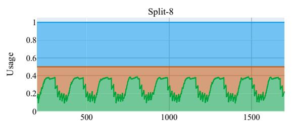

# 6.2 Cache Utilization on Multi-Application Workloads

In this subsection, we further analyze the impact of the cacheline-level space management scheme on cache utilization. We build a two-core architecture to evaluate multi-application workloads. Two scalar cores have their private L1 caches and share an L2 MagiCache. One core runs vector applications, and the other executes scalar applications. The scalar applications are vector addition(add), matrix multiplication(mmul), and sparse matrix-vector multiplication(spmv) with the same working set size. They feature sequential, strided, and random access patterns, respectively.

Table 8: Cache Utilization of Split-8 and Chain-4

| Configurations | vvadd | matmul | jacobi | pathfinder | k-means | backprop | average |
|----------------|-------|--------|--------|------------|---------|----------|---------|
| Split-8        | 53.2% | 56.2%  | 61.4%  | 55.3%      | 56.6%   | 52.4%    | 55.9%   |
| Chain-4        | 98.2% | 96.9%  | 94.8%  | 97.4%      | 96.3%   | 98.8%    | 97.1%   |
| Improvement    | 45.0% | 40.7%  | 33.4%  | 42.1%      | 39.7%   | 46.4%    | 41.2%   |

Table 8 shows the average cache utilization on Split-8 and Chain-4 specifications. These utilization rates are uniformly sampled over time and averaged over various applications. Split-8 statically divides half of the cache space for vector registers. Since vector applications typically use only several registers, Split-8 struggles to achieve a high utilization. In contrast, our cache space management scheme employs a lazy initialization strategy so unused vector register segments do not take up cache space. Therefore, the utilization of Chain-4 is approaching 100%.

The improvement of cache utilization also reduces the miss rates on L2 MagiCache. Fig. 10 presents the miss rates of scalar applications on L2 MagiCache. Compared to Split-8, Chain-4 and Fused-4 significantly reduce the miss rate in most multi-application workloads. MagiCache reduces the average miss rate of add by 36% and spmv by 14%. The L2 miss rate of mmul is close to 0 because strided memory requests frequently miss in L1, hit in L2, and update the LRU timestamp of L2 cachelines. Therefore, mmul's working set resides in L2 and has very low miss rates, while the L2 cachelines of vector applications are frequently replaced. In some applications, the employment of instruction chaining slightly increases the miss rates, but they are still lower than Split-8.

Fig. 11 shows the cache space utilization over time for both Split-8 and Chain-4 configurations. 1500 cycles are sampled from the multi-application workload of vector k-means and scalar mmul. In Split-8, since half of the cache space is occupied by vector registers, the remaining half is struggling to meet the requirements of vector and scalar applications, which results in frequent cache evictions and performance degradation. However, Chain-4 allocates only necessary amounts of cachelines to vector registers, with about 90% available for caching data. It is worth noting that, with the increase in cache utilization, Chain-4 also has performance improvement on both applications. In the same time interval, Chain-4 executes 11 iterations, while Split-8 only executes 9 iterations.

#### 6.3 Energy and Area Analysis

We summarize all the overheads of MagiCache here. Compared to vanilla cache, MagiCache includes extra tag bits and the vector register mapping table as the storage overhead. The control logic overhead consists of peripheral circuits of each fused array and the

Figure 11: Cache utilization over time on Split-8 and Chain-4. The cache space is divided into three parts: vector registers (VReg) and the cachelines owned by vector/scalar applications (Vector/Scalar).

virtual engine. As for the computing-line allocation policy, although the pseudo-LRU performs the best, the simpler FFA achieves comparable performance (less than 1% loss) without introducing or updating additional states. Maintaining cacheline coherency incurs performance overhead as it invalidates some cachelines. However, all in-cache computing architectures or vector architectures must pay the same overhead as long as their processing units directly fetch data from L2 or last-level caches.

Based on circuit evaluation results, the bit-line computation operation brings 54% more energy consumption than read/write operations. As bit-line computation accounts for about 17% of all read/write operations in fused arrays, the average power consumption of fused arrays will increase by 9% for the same operation frequency. However, in traditional cache read/write operations, the H-tree network accounts for over 80% of the total energy consumption, while the array consumes less than 20% [4]. The energy efficiency is significantly enhanced since bit-line computation has the source and destination rows in the same fused array and does not go through the H-tree.

The circuit evaluation results show that the fused array incurs 8.9% additional area compared to the vanilla SRAM array. The microprograms executed by the array sequencer can be stored in an 8 KB ROM with 1.6% area. In SplitCache, only half of the cache arrays are computing arrays, so SplitCache incurs 6.0% area overhead over conventional L2 cache. Although we do not consider the control circuits, the baseline SplitCache is more area-efficient than a conventional L2 cache, as Split-8 is 4.81x faster than executing these applications using only scalar cores. The MagiCache further brings 6.5 KB of additional storage, with 4.5 KB for the vector register mapping table and 2 KB for computing bits and coherence bits in L2 tags. The virtual engine's control logic also counts for 1% additional area. Therefore, MagiCache further incurs 6.8% additional area overhead over SplitCache. Our cacheline-level architecture and management scheme can dynamically configure the ratio of the storage and computing spaces, which significantly improves cache utilization and area efficiency.

#### 7 Related Work

The related work of in-cache computing architectures has been discussed in Section 2.2. The under-utilization of the vector registers is also partially addressed by the next-generation vector instruction sets [32, 38]. RISC-V vector extension exploits vector register grouping, which allows multiple adjacent vector registers to be grouped together so that one single instruction can operate on all

of these registers. For example, when the vector length multiplier is four, four vector registers  $v_{4n}$ ,  $v_{4n+1}$ ,  $v_{4n+2}$ , and  $v_{4n+3}$  are combined into a vector register group named  $v_{4n}$ . Thus, the effective vector length and register utilization are enhanced by four times. RISC-V vector extension now supports multipliers of 1, 2, 4, 8. However, this approach can only exponentially extend the register utilization in a coarse-grained manner, resulting in an exponential decrease in the number of vector registers. In contrast, our cacheline-level space management scheme allocates vector registers at the granularity of cachelines to flexibly configure the length of vector registers. Our dynamic allocation strategy ensures that the register utilization reaches nearly 100%, with the unused space used as cachelines.

#### 8 Conclusion

In this paper, we propose MagiCache, a virtual in-cache computing engine, to achieve cacheline-level runtime cache space management. By employing a cacheline-level in-cache computing architecture, MagiCache can fuse both computation and storage capabilities into a unified cache array. Our proposed virtual engine can dynamically configure the roles of each cacheline according to the application requirements, thus improving cache utilization and available capacity. We further present the instruction chaining technique to hide the bursty access latency by enabling asynchronous execution of cache arrays. Experimental results show that MagiCache achieves 1.19x-1.61x performance speedup and 42% cache utilization improvement with a negligible 6.5 KB storage overhead over existing array-level pre-configuration schemes. Our proposed cacheline-level runtime cache space management can be employed in various in-cache computing architectures with different data layouts, peripheral circuits, and programming frameworks to improve computing efficiency and resource utilization.

#### Acknowledgments

This work was supported by Tsinghua-Toyota Joint Research Fund, Open Research Fund Program of Beijing National Research Center for Information Science and Technology, Beijing Science and Technology Plan Project (Z241100004824002), and National Natural Science Foundation of China (NSFC) under Grant 92373103, 62204271.

#### References

 Shaizeen Aga, Supreet Jeloka, Arun Subramaniyan, Satish Narayanasamy, David Blaauw, and Reetuparna Das. 2017. Compute caches. In 2017 IEEE International Symposium on High Performance Computer Architecture (HPCA). IEEE, 481–492.

- [2] Khalid Al-Hawaj, Olalekan Afuye, Shady Agwa, Alyssa Apsel, and Christopher Batten. 2020. Towards a reconfigurable bit-serial/bit-parallel vector accelerator using in-situ processing-in-sram. In 2020 IEEE International Symposium on Circuits and Systems (ISCAS). IEEE, 1–5.
- [3] Khalid Al-Hawaj, Tuan Ta, Nick Cebry, Shady Agwa, Olalekan Afuye, Eric Hall, Courtney Golden, Alyssa B Apsel, and Christopher Batten. 2023. EVE: Ephemeral vector engines. In 2023 IEEE International Symposium on High-Performance Computer Architecture (HPCA). IEEE, 691–704.
- [4] Rajeev Balasubramonian, Norman P Jouppi, and Naveen Muralimanohar. 2011. Multi-core cache hierarchies. Morgan & Claypool Publishers.
- [5] Nathan Binkert, Bradford Beckmann, Gabriel Black, Steven K Reinhardt, Ali Saidi, Arkaprava Basu, Joel Hestness, Derek R Hower, Tushar Krishna, Somayeh Sardashti, Rathijit Sen, Korey Sewell, Shoaib Muhammad, Nilay Vaish, Mark D Hill, and David A Wood. 2011. The gem5 simulator. ACM SIGARCH computer architecture news 39, 2 (2011), 1–7.
- [6] Nagadastagiri Challapalle, Sahithi Rampalli, Linghao Song, Nandhini Chandramoorthy, Karthik Swaminathan, John Sampson, Yiran Chen, and Vijaykrishnan Narayanan. 2020. GaaS-X: Graph analytics accelerator supporting sparse data representation using crossbar architectures. In 2020 ACM/IEEE 47th Annual International Symposium on Computer Architecture (ISCA). IEEE, 433–445.
- [7] Shuai Che, Michael Boyer, Jiayuan Meng, David Tarjan, Jeremy W Sheaffer, Sang-Ha Lee, and Kevin Skadron. 2009. Rodinia: A benchmark suite for heterogeneous computing. In 2009 IEEE international symposium on workload characterization (IISWC). Ieee, 44–54.
- [8] Wei Chen, Szu-Liang Chen, Siufu Chiu, Raghuraman Ganesan, Venkata Lukka, Wei Wing Mar, and Stefan Rusu. 2013. A 22nm 2.5 MB slice on-die L3 cache for the next generation Xeon® processor. In 2013 Symposium on VLSI Circuits. IEEE, C132–C133.
- [9] Ming Cheng, Lixue Xia, Zhenhua Zhu, Yi Cai, Yuan Xie, Yu Wang, and Huazhong Yang. 2017. Time: A training-in-memory architecture for memristor-based deep neural networks. In Proceedings of the 54th Annual Design Automation Conference 2017. 1–6.
- [10] Ping Chi, Shuangchen Li, Cong Xu, Tao Zhang, Jishen Zhao, Yongpan Liu, Yu Wang, and Yuan Xie. 2016. Prime: A novel processing-in-memory architecture for neural network computation in reram-based main memory. ACM SIGARCH Computer Architecture News 44, 3 (2016), 27–39.
- [11] Charles Eckert, Xiaowei Wang, Jingcheng Wang, Arun Subramaniyan, Ravi Iyer, Dennis Sylvester, David Blaaauw, and Reetuparna Das. 2018. Neural cache: Bitserial in-cache acceleration of deep neural networks. In 2018 ACM/IEEE 45Th annual international symposium on computer architecture (ISCA). IEEE, 383–396.
- [12] Roger Espasa, Federico Ardanaz, Joel Emer, Stephen Felix, Julio Gago, Roger Gramunt, Isaac Hernandez, Toni Juan, Geoff Lowney, Matthew Mattina, and Andre Seznec. 2002. Tarantula: a vector extension to the alpha architecture. ACM SIGARCH Computer Architecture News 30, 2 (2002), 281–292.
- [13] Renhao Fan, Yikai Cui, Qilin Chen, Mingyu Wang, Youhui Zhang, Weimin Zheng, and Zhaolin Li. 2023. MAICC: A Lightweight Many-core Architecture with In-Cache Computing for Multi-DNN Parallel Inference. In Proceedings of the 56th Annual IEEE/ACM International Symposium on Microarchitecture. 411–423.
- [14] Tim Finkbeiner, Glen Hush, Troy Larsen, Perry Lea, John Leidel, and Troy Manning. 2017. In-memory intelligence. IEEE Micro 37, 4 (2017), 30–38.
- [15] Daichi Fujiki, Scott Mahlke, and Reetuparna Das. 2019. Duality cache for data parallel acceleration. In Proceedings of the 46th International Symposium on Computer Architecture. 397–410.
- [16] Fei Gao, Georgios Tziantzioulis, and David Wentzlaff. 2019. Computedram: Inmemory compute using off-the-shelf drams. In Proceedings of the 52nd annual IEEE/ACM international symposium on microarchitecture. 100–113.
- [17] Matthew R Guthaus, James E Stine, Samira Ataei, Brian Chen, Bin Wu, and Mehedi Sarwar. 2016. OpenRAM: An open-source memory compiler. In 2016 IEEE/ACM International Conference on Computer-Aided Design (ICCAD). IEEE, 1–6.
- [18] Min Huang, Moty Mehalel, Ramesh Arvapalli, and Songnian He. 2013. An energy efficient 32-nm 20-mb shared on-die L3 cache for intel® xeon® processor E5 family. IEEE Journal of Solid-State Circuits 48, 8 (2013), 1954–1962.
- [19] Mohsen Imani, Saransh Gupta, Yeseong Kim, and Tajana Rosing. 2019. Floatpim: In-memory acceleration of deep neural network training with high precision. In Proceedings of the 46th International Symposium on Computer Architecture. 802–815.
- [20] Supreet Jeloka, Naveen Bharathwaj Akesh, Dennis Sylvester, and David Blaauw. 2016. A 28 nm configurable memory (TCAM/BCAM/SRAM) using push-rule 6T bit cell enabling logic-in-memory. IEEE Journal of Solid-State Circuits 51, 4 (2016), 1009–1021.
- [21] Mingu Kang, Eric P Kim, Min-sun Keel, and Naresh R Shanbhag. 2015. Energyefficient and high throughput sparse distributed memory architecture. In 2015 IEEE International Symposium on Circuits and Systems (ISCAS). IEEE, 2505–2508.
- [22] Yann LeCun, Yoshua Bengio, and Geoffrey Hinton. 2015. Deep learning. nature 521, 7553 (2015), 436–444.
- [23] Gushu Li, Guohao Dai, Shuangchen Li, Yu Wang, and Yuan Xie. 2018. GraphIA: An in-situ accelerator for large-scale graph processing. In Proceedings of the

- International Symposium on Memory Systems. 79–84.
- [24] Shuangchen Li, Alvin Oliver Glova, Xing Hu, Peng Gu, Dimin Niu, Krishna T Malladi, Hongzhong Zheng, Bob Brennan, and Yuan Xie. 2018. Scope: A stochastic computing engine for dram-based in-situ accelerator. In 2018 51st Annual IEEE/ACM International Symposium on Microarchitecture (MICRO). IEEE, 696–709.
- [25] Shuangchen Li, Dimin Niu, Krishna T Malladi, Hongzhong Zheng, Bob Brennan, and Yuan Xie. 2017. Drisa: A dram-based reconfigurable in-situ accelerator. In Proceedings of the 50th Annual IEEE/ACM International Symposium on Microarchitecture. 288–301.
- [26] Weitao Li, Pengfei Xu, Yang Zhao, Haitong Li, Yuan Xie, and Yingyan Lin. 2020. Timely: Pushing data movements and interfaces in pim accelerators towards local and in time domain. In 2020 ACM/IEEE 47th Annual International Symposium on Computer Architecture (ISCA). IEEE, 832–845.
- [27] Jason Lowe-Power, Abdul Mutaal Ahmad, Ayaz Akram, Mohammad Alian, Rico Amslinger, Matteo Andreozzi, Adrià Armejach, Nils Asmussen, Brad Beckmann, Srikant Bharadwaj, Gabe Black, Gedare Bloom, Bobby R Bruce, Daniel Rodrigues Carvalho, Jeronimo Castrillon, Lizhong Chen, Nicolas Derumigny, Stephan Diestelhorst, Wendy Elsasser, Carlos Escuin, Marjan Fariborz, Amin Farmahini-Farahani, Pouya Fotouhi, Ryan Gambord, Jayneel Gandhi, Dibakar Gope, Thomas Grass, Anthony Gutierrez, Bagus Hanindhito, Andreas Hansson, Swapnil Haria, Austin Harris, Timothy Hayes, Adrian Herrera, Matthew Horsnell, Syed Ali Raza Jafri, Radhika Jagtap, Hanhwi Jang, Reiley Jeyapaul, Timothy M Jones, Matthias Jung, Subash Kannoth, Hamidreza Khaleghzadeh, Yuetsu Kodama, Tushar Krishna, Tommaso Marinelli, Christian Menard, Andrea Mondelli, Miquel Moreto, Tiago Mück, Omar Naji, Krishnendra Nathella, Hoa Nguyen, Nikos Nikoleris, Lena E Olson, Marc Orr, Binh Pham, Pablo Prieto, Trivikram Reddy, Alec Roelke, Mahyar Samani, Andreas Sandberg, Javier Setoain, Boris Shingarov, Matthew D Sinclair, Tuan Ta, Rahul Thakur, Giacomo Travaglini, Michael Upton, Nilay Vaish, Ilias Vougioukas, Willian Wang, Zhengrong Wang, Norbert Wehn, Christian Weis, David A Wood, Hongil Yoon, and Éder F Zulian. 2020. The gem5 simulator: Version 20.0+. arXiv preprint arXiv:2007.03152 (2020).
- [28] Steven Muchnick. 1997. Advanced compiler design implementation. Morgan kaufmann.
- [29] NVIDIA. 2018. Parallel Thread Execution ISA. [https://docs.nvidia.com/cuda/](https://docs.nvidia.com/cuda/parallel-thread-execution/index.html) [parallel-thread-execution/index.html](https://docs.nvidia.com/cuda/parallel-thread-execution/index.html)
- [30] Keni Qiu, Nicholas Jao, Mengying Zhao, Cyan Subhra Mishra, Gulsum Gudukbay, Sethu Jose, Jack Sampson, Mahmut Taylan Kandemir, and Vijaykrishnan Narayanan. 2020. ResiRCA: A resilient energy harvesting ReRAM crossbarbased accelerator for intelligent embedded processors. In 2020 IEEE International Symposium on High Performance Computer Architecture (HPCA). IEEE, 315–327.
- [31] Cristóbal Ramírez, César Alejandro Hernández, Oscar Palomar, Osman Unsal, Marco Antonio Ramírez, and Adrián Cristal. 2020. A risc-v simulator and benchmark suite for designing and evaluating vector architectures. ACM Transactions on Architecture and Code Optimization (TACO) 17, 4 (2020), 1–30.
- [32] RISC-V Foundation. 2021. RISC-V Vector Extension 1.0. [https://github.com/](https://github.com/riscv/riscv-v-spec/releases/tag/v1.0) [riscv/riscv-v-spec/releases/tag/v1.0](https://github.com/riscv/riscv-v-spec/releases/tag/v1.0)
- [33] Vivek Seshadri, Donghyuk Lee, Thomas Mullins, Hasan Hassan, Amirali Boroumand, Jeremie Kim, Michael A Kozuch, Onur Mutlu, Phillip B Gibbons, and Todd C Mowry. 2017. Ambit: In-memory accelerator for bulk bitwise operations using commodity DRAM technology. In Proceedings of the 50th Annual IEEE/ACM International Symposium on Microarchitecture. 273–287.
- [34] Ali Shafiee, Anirban Nag, Naveen Muralimanohar, Rajeev Balasubramonian, John Paul Strachan, Miao Hu, R Stanley Williams, and Vivek Srikumar. 2016. ISAAC: A convolutional neural network accelerator with in-situ analog arithmetic in crossbars. ACM SIGARCH Computer Architecture News 44, 3 (2016), 14–26.
- [35] William Andrew Simon, Yasir Mahmood Qureshi, Marco Rios, Alexandre Levisse, Marina Zapater, and David Atienza. 2020. BLADE: An in-cache computing architecture for edge devices. IEEE Trans. Comput. 69, 9 (2020), 1349–1363.
- [36] Linghao Song, Xuehai Qian, Hai Li, and Yiran Chen. 2017. Pipelayer: A pipelined reram-based accelerator for deep learning. In 2017 IEEE international symposium on high performance computer architecture (HPCA). IEEE, 541–552.
- [37] Linghao Song, Youwei Zhuo, Xuehai Qian, Hai Li, and Yiran Chen. 2018. GraphR: Accelerating graph processing using ReRAM. In 2018 IEEE International Symposium on High Performance Computer Architecture (HPCA). IEEE, 531–543.
- [38] Nigel Stephens, Stuart Biles, Matthias Boettcher, Jacob Eapen, Mbou Eyole, Giacomo Gabrielli, Matt Horsnell, Grigorios Magklis, Alejandro Martinez, Nathanael Premillieu, Alastair Reid, Alejandro Rico, Pau Walker, and ARM. 2017. The ARM scalable vector extension. IEEE micro 37, 2 (2017), 26–39.
- [39] Jingcheng Wang, Xiaowei Wang, Charles Eckert, Arun Subramaniyan, Reetuparna Das, David Blaauw, and Dennis Sylvester. 2019. A 28-nm compute SRAM with bit-serial logic/arithmetic operations for programmable in-memory vector computing. IEEE Journal of Solid-State Circuits 55, 1 (2019), 76–86.
- [40] Xin Xin, Youtao Zhang, and Jun Yang. 2019. Roc: Dram-based processing with reduced operation cycles. In Proceedings of the 56th Annual Design Automation Conference 2019. 1–6.