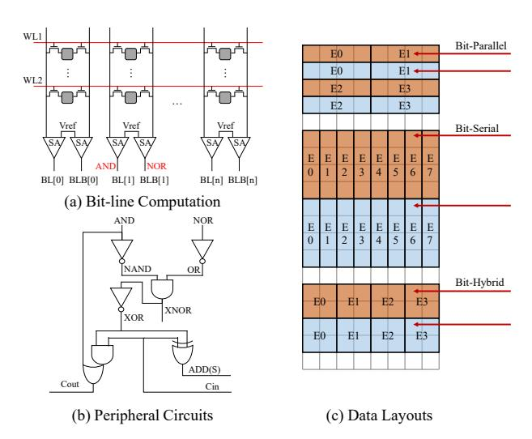
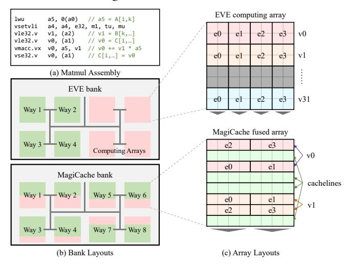

# [Zhaolin Li](https://orcid.org/0009-0001-1131-3024)†

Department of Computer Science and Technology, Beijing National Research Center for Information Science and Technology, Tsinghua University Beijing, China lzl73@tsinghua.edu.cn

### Abstract

The rise of data-parallel applications poses a significant challenge to the energy consumption of computing architectures. In-cache computation is a promising solution for achieving high parallelism and energy efficiency because it can eliminate data movement between the cache and the processor. Existing in-cache computing architectures transform a portion of cache arrays into computing arrays, with all rows of these arrays serving as computing lines. The remaining cache arrays are used as cachelines to store the data required by computing arrays or processors. However, in these array-level in-cache computing architectures, only a few computing lines in each computing array are active at runtime while the others are idle, which incurs severe cache capacity loss and space underutilization. In addition, bursty memory accesses of data-parallel applications also cause significant in-cache data movement latency.

To address these problems, we propose MagiCache, a virtual in-cache computing engine. First, we design a novel cacheline-level in-cache computing architecture in which each cache array can configure some rows as computing lines and the other rows as cachelines with negligible overhead. Second, a virtual engine is further designed on this novel architecture to dynamically allocate different rows of each array as computing lines or cachelines based on runtime computation and storage requirements, thus realizing efficient cacheline-level space management. Finally, we present an instruction chaining technique to overlap the bursty access latency by enabling asynchronous execution of computing arrays. Evaluation results show that MagiCache achieves a 1.19x-1.61x speedup over the state-of-the-art in-cache computing architectures with 6.5 KB of additional storage. Our cacheline-level space

†Corresponding authors: Mingyu Wang and Zhaolin Li.

[This work is licensed under a Creative Commons Attribution-NonCommercial-](https://creativecommons.org/licenses/by-nc-nd/4.0)[NoDerivatives 4.0 International License.](https://creativecommons.org/licenses/by-nc-nd/4.0)

ISCA '25, Tokyo, Japan © 2025 Copyright held by the owner/author(s). ACM ISBN 979-8-4007-1261-6/25/06 <https://doi.org/10.1145/3695053.3731113>

management improves cache utilization by 42% and reduces cache miss rate by 10%-40% over various memory access patterns. The instruction chaining technique also reduces the memory access time by 2%-27%.

### CCS Concepts

• Computer systems organization → Single instruction, multiple data.

### Keywords

In-Cache Computation, Vector Processing

#### ACM Reference Format:

Renhao Fan, Yikai Cui, Weike Li, Mingyu Wang, and Zhaolin Li. 2025. MagiCache: A Virtual In-Cache Computing Engine. In Proceedings of the 52nd Annual International Symposium on Computer Architecture (ISCA '25), June 21–25, 2025, Tokyo, Japan. ACM, New York, NY, USA, [13](#page-12-0) pages. [https:](https://doi.org/10.1145/3695053.3731113) [//doi.org/10.1145/3695053.3731113](https://doi.org/10.1145/3695053.3731113)

## 1 Introduction

Recent years have witnessed incredible growth in data-parallel applications, especially neural networks [\[22\]](#page-12-1). These applications are mainly characterized by data-intensive, large-scale matrix or vector computations that require a large number of computations and memory accesses. This poses a huge challenge to the memory bandwidth and power consumption of traditional computing architectures.

In-memory computation (IMC) technology is a promising solution for high-bandwidth and energy-efficient computing. This technology enables computations to be performed directly within the memory and thus eliminates data movement between the memory and the processor. Based on the memory substrates, the common in-memory computations can be categorized into DRAMbased IMC [\[14,](#page-12-2) [16,](#page-12-3) [19,](#page-12-4) [23–](#page-12-5)[25,](#page-12-6) [33,](#page-12-7) [40\]](#page-12-8), RRAM-based IMC [\[6,](#page-12-9) [9,](#page-12-10) [10,](#page-12-11) [26,](#page-12-12) [30,](#page-12-13) [34,](#page-12-14) [36,](#page-12-15) [37\]](#page-12-16), and SRAM-based IMC [\[1–](#page-11-0)[3,](#page-12-17) [11,](#page-12-18) [13,](#page-12-19) [15,](#page-12-20) [35,](#page-12-21) [39\]](#page-12-22). This paper focuses on SRAM-based IMC because it can be fabricated by modern integrated circuit technologies and easily integrated into modern processor architectures.

∗These authors contributed equally to this work.

SRAM-based in-memory computation utilizes the bit-line computation technique [\[20,](#page-12-23) [21\]](#page-12-24) and additional peripheral circuits to transform SRAM arrays into parallel computing arrays, which enable logical operations [\[1\]](#page-11-0), integer arithmetic operations [\[11,](#page-12-18) [35,](#page-12-21) [39\]](#page-12-22), and even floating-point operations [\[15\]](#page-12-20) within the SRAM array. By leveraging this technology, the caches of modern processors can be easily transformed into in-cache computing architectures with extremely high parallelism. These architectures convert a portion of SRAM arrays in the cache into in-cache computing arrays, noted as array-level in-cache computing architectures. Specifically, the entire cache space is divided into the storage space and computing space at the granularity of cache arrays. The in-cache computing arrays form the computing space with all their rows used as computing lines, while the conventional SRAM arrays constitute the storage space and remain as the cache to provide data for the processor and computing space. Recent in-cache computing architectures further pre-configure these computing lines as vector or SIMT (single instruction multiple threads) registers to provide programming flexibility. Compared with logic-based computing units, in-cache computing arrays enable parallel computation with low area overhead and energy consumption. They can also access the peer-level storage space with high internal bandwidth.

However, existing array-level architectures suffer from static and coarse-grained pre-configuration schemes, which bring two challenges: (1) Under-utilization of cache space. The arraylevel partition of cache space significantly reduces cache capacity and associativity, which consequently degrades cache performance. Meanwhile, in-cache computing arrays suffer from space underutilization because only a few computing lines are active during execution while the remaining lines are inactive. (2) Bursty incache data movement overhead. Since in-cache computing architectures obtain high parallelism, they are also characterized by bursty parallel memory accesses. Bursty data movement from the storage space to the computing space still leads to high access latency, especially when cache misses frequently occur.

To address these challenges, we propose MagiCache, a virtual incache computing engine. First, we propose a novel cacheline-level in-cache computing architecture that can partition the computing and storage spaces at the granularity of cachelines within SRAM arrays. In this architecture, each array can configure a portion of its rows as computing lines and the remaining rows as cachelines with negligible overhead, thus performing both computation and storage operations. Second, we introduce a virtual engine on top of the physical cache structure to manage in-cache computing resources efficiently. The virtual engine allocates rows of the arrays as computing lines or cachelines at runtime based on application requirements. It further marks computing lines as virtual vector registers and manages the number, length, location, and life cycle of these registers through a cacheline-level space management scheme to maximize the utilization and available capacity of the cache. Finally, we present an instruction chaining technique to mitigate the bursty access bottleneck by allowing asynchronous execution of in-cache computing arrays. It overlaps the latency of computations and memory accesses across different computing arrays and improves the performance of in-cache computation.

We implement a cycle-approximate model of the MagiCache on gem5 [\[5,](#page-12-25) [27\]](#page-12-26) and conduct experiments on six vector applications from Rodinia [\[7\]](#page-12-27) and RiVEC [\[31\]](#page-12-28) benchmark suites. Experimental results show that the MagiCache achieves a 1.19x-1.61x speedup over the state-of-the-art array-level in-cache computing architectures [\[3\]](#page-12-17) with 6.5 KB of additional storage. Our proposed cacheline-level space management scheme significantly improves cache utilization by 42% and reduces cache miss rates by 10%-40% in various memory access patterns. The instruction chaining technique also reduces the average memory access time by 2%-27%.

In summary, this paper makes the following contributions:

- We present the first cacheline-level in-cache computing architecture. By adding indicator bits on tags, our architecture can configure some rows of the cache array as computing lines and the remaining rows of the same array as cachelines, thus transforming cache arrays into fused arrays with both computation and storage capabilities.
- We present a virtual engine for in-cache computing architectures for the first time. It serves as a virtual middle layer that allocates different rows of fused arrays into computing or storage spaces at runtime based on application requirements. It also enables efficient cacheline-level space management by flexibly mapping the computing space into virtual vector registers with variable numbers, lengths, locations, and life cycles, achieving nearly 100% cache utilization.
- We propose an instruction chaining technique to reduce the bursty in-cache data movement latency by enabling asynchronous execution of different computing arrays. With this technique, the accesses are scattered to different cycles to hide the latency of in-cache data movement.
- We demonstrate the effectiveness of the MagiCache through detailed experiments on a set of vector applications. The evaluation results show that our architecture achieves a 1.19x-1.61x speedup over existing in-cache computing architectures with an additional 6.5KB storage overhead.

### 2 Background

### 2.1 SRAM-based In-Memory Computation

The SRAM array includes two-dimensional bit cells connected by horizontal word-lines and vertical bit-lines [\[17\]](#page-12-29). When a wordline is activated, the data in the bit cells flow to the bit-lines and can be read out at the sense amplifiers. SRAM-based IMC utilizes the bit-line computation technology [\[20,](#page-12-23) [21\]](#page-12-24) to implement in-situ computation within SRAM arrays. This technique reports that when two word-lines are simultaneously activated, data in both wordlines will flow to the shared bit-lines and perform logic operations in the analog domain. Then, the sense amplifiers will acquire their AND and NOR values from the bit-lines, as shown in Fig. [1\(](#page-2-0)a). Data corruption of multi-row access can be avoided by lowering the word-line voltage to bias against write voltage at the expense of a slight decrease in operation frequency. Furthermore, arithmetic operations, such as addition and multiplication, can be implemented by adding additional peripheral circuits and latches around the SRAM array, which account for a 10% area overhead [\[11\]](#page-12-18). For example, Fig. [1\(](#page-2-0)b) presents the circuits to generate logic and 1-bit addition operations.

Existing designs explore different data layouts to exploit the potential of SRAM-based IMC. Fig. [1\(](#page-2-0)c) illustrates three data layouts.

Figure 1: Overview of SRAM-based In-Memory Computation. (a) Bit-line computation. WL: word-line, SA: sense amplifier, BL/BLB: bit-line (bar). (b) A Peripheral circuit Example. (c) Three data layouts in a simplified 8-column array. Orange and blue rectangles present two 4-bit vectors. Red arrows are word-lines activated simultaneously.

The bit-parallel layout [1, 39] puts all bits of an element on the same word-line in a regular way, while the bit-serial layout [11] locates them on the same bit-line in a transposed manner. The bit-hybrid layout [3] combines bit-serial and bit-parallel layouts by placing the element in a rectangular region. With different peripheral circuit designs, all the data layouts can implement logic and integer arithmetic operations. The bit-serial data layout can even support floating-point operations with a relatively long latency [15]. VRAM [2] provides a detailed comparison of data layouts and demonstrates that bit-parallel has lower latency than bit-serial while bit-serial has higher throughput than bit-parallel. Most existing designs leverage bit-serial or bit-hybrid layouts to achieve high throughput at the cost of additional transpose delay when moving data from/to computing arrays. In contrast, we argue that the bitparallel layout enables cacheline-level runtime management of cache space, which will be further illustrated in Section 3.

#### 2.2 In-Cache Computing Architectures

The development of SRAM-based IMC contributes to the emergence of in-cache computing architectures because modern processors have large amounts of organized SRAM arrays in the caches [8, 18], which are naturally available for in-memory computation. Compute Cache [1] is the first to propose in-cache computation supporting logic, search, compare, and copy operations. Neural Cache [11] proposes the bit-serial layout to implement fixed-point addition, multiplication, and reduction operations on the L3 Cache to accelerate neural network inference. Based on it, Duality Cache [15] further enables floating-point arithmetic operations and implements a GPU-like SIMT programming framework that transforms L3 cache space into SIMT registers. BLADE [35] introduces local bit-lines to isolate data in different word-lines, thus eliminating data corruption without reducing operation frequency. EVE [3] re-configures the in-cache computing arrays into vector

registers and provides a micro-code execution framework to implement RISC-V vector extensions [32]. These works demonstrate the high energy efficiency and internal memory bandwidth of incache computation.

In summary, existing in-cache computing architectures typically divide the cache into two spaces at the granularity of SRAM arrays. Some SRAM arrays are converted to in-cache computing arrays and constitute the computing space. All rows of these computing arrays serve as computing lines under different layouts. Their bit cells employ bit-line computation and specific peripheral circuits to perform required operations. On the other hand, the remaining conventional SRAM arrays form the storage space and maintain the cache functionality with a reduced capacity and associativity. Their rows serve as traditional cachelines to supply data for the computing space and processor. Furthermore, recent works preconfigure the computing space as parallel registers to enable generic parallel programming frameworks. The computing arrays divide their computing lines evenly to parallel registers and work in the same way as lanes in the vector architecture or streaming multiprocessors in the SIMT architecture. For example, Duality Cache allocates several ways of the L3 cache to the computing space, each way containing dozens of SRAM arrays. These arrays are configured as SIMT registers and support a PTX-like ISA [29]. EVE also contributes half of L2 cache arrays as the computing space and configures them as vector registers. The register-based pre-configuration scheme addresses the programming availability problem. However, as the computing space usually has a different data layout and management scheme from traditional cache arrays, it is detached from memory addressing and cannot be accessed through traditional cache behavior. Moreover, the registers in the computing space still have to fetch data from the storage space, which will incur bursty access latency when cache misses occur.

#### 3 Motivation

While existing in-cache computing architectures can address the programming availability problem, they still suffer from static and coarse-grained pre-configuration schemes. Such schemes only support array-level partitioning and lead to severe under-utilization of cache space. The synchronous execution flow of in-cache computing arrays also brings long access latency. To address these two challenges, this paper initiates a virtual engine to manage storage and computing resources efficiently. The following two subsections illustrate our key motivations in detail.

#### 3.1 Cacheline-level Runtime Space Management

There are two reasons for cache space under-utilization. First, existing schemes can only statically divide the two spaces at a fixed ratio before execution. When the fixed configuration does not match the requirements of various applications, the preconfiguration scheme faces performance degradation or waste due to insufficient or excessive resources. For applications with high arithmetic intensity, the computing space requires more computing lines to increase the parallelism. While for applications with low arithmetic intensity, the storage space needs a large capacity to reduce cache misses. Fig. 2 shows the cache miss rates and normalized performance of matmul and backprop under

Figure 2: Cache miss rates and normalized performance of different static configurations.

Figure 3: Cacheline-Level Space Management. (a) RISC-V vector assembly code of matrix multiplication. (b) Bank layouts of EVE and MagiCache. The computing space and storage space are marked in pink and green. (c) Array layouts of EVE and MagiCache in a simplified 8-column array. v0-v31 and e0-e3 denote vector registers and element indexes.

different static configurations. The x-axis describes the percentage of SRAM arrays in the cache that are used for computation. As the ratio of computing arrays grows, the computing parallelism increases. However, the cache miss rate also increases due to reduced cache capacity. Thus, the performance first ascends and then descends. Different applications require different trade-offs for static configurations. The matmul prefers 62.5%, while the backprop performs best at 50%. Therefore, the expected architecture should exploit dynamic space management to reallocate both spaces at runtime based on the requirements of applications to get the best performance.

Second, existing pre-configuration schemes only support coarsegrained partitioning at the array level. Some SRAM arrays dedicate their total capacity to storage, while others devote all their rows to computing. However, we claim that array-level partitioning performs sub-optimally for both storage and computing spaces. The memory bandwidth of storage space is proportional to the number of storage arrays, and the parallelism of computing space is also proportional to the number of computing arrays. Instead of dividing the two spaces at the array level and obtaining reduced bandwidth and parallelism, we can partition them at a smaller granularity of rows (or cachelines) within each array. In the expected cacheline-level space management scheme, each array becomes a fused array where a portion of its rows serves as cachelines in the storage space and the other portion as computing lines in the computing space, as illustrated in Fig. 3(b). Since all arrays can perform either computing or storage operations, the architecture can provide maximum memory bandwidth or parallelism at different times.

Combined with dynamic allocation, this cacheline-level space management also improves cache utilization. We observe that parallel applications exhibit some locality by frequently using only some architectural registers and hardly consuming all registers. For example, the matrix multiplication vector program in Fig. 3(a) only accesses registers v0 and v1. This means that only some computing lines within the computing array are active. Therefore, there is an opportunity to reuse the idle lines as cachelines at runtime, which increases the available cache capacity and utilization without performance degradation.

Based on the above analysis, the first motivation is to employ a cacheline-level architecture and a corresponding runtime space management scheme. In the proposed MagiCache architecture, all SRAM arrays are fused arrays with some of their rows marked as virtual vector registers and the remaining rows as cachelines. As shown in Fig. 3(c), the array-level configuration scheme in EVE [3] statically distributes the capacity of computing arrays among all the 32 vector registers, and 30 of them are wasted for matrix multiplication. In contrast, our proposed fused array dynamically allocates the actually used vector registers (v0, v1) while the remaining rows are still available as cachelines. Note that our fused array adopts a bit-parallel layout because it has the same layout as cachelines, which facilitates the management and transformation between cachelines and virtual registers. To achieve cacheline-level runtime allocation, a virtual engine is designed on top of the physical cache structure to record which rows in the fused arrays are marked as vector registers or cachelines. The virtual engine is also responsible for the initialization, placement, and release of vector registers.

