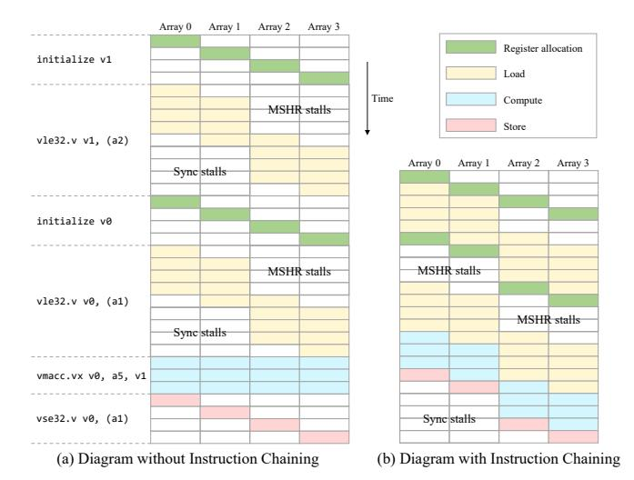

# <span id="page-5-0"></span>4.3 The Virtual Engine For Efficient Space Management

In MagiCache, the virtual engine receives vector instructions and executes them sequentially. It serves as a virtual middle layer to connect the physical in-cache computing arrays and the vector ISA. Fig. 6 presents the structure of the virtual engine. It consists of an instruction queue, vector control status registers (CSRs), a request generator, and a vector register mapping table. Since incache computing operations consume multiple cycles, a 16-entry instruction queue holds vector instructions to prevent them from blocking the scalar core. The CSRs keep vector information such as effective vector length (vl) and vector element type (vtype). The request generator calculates addresses and generates requests for each element of vector memory instructions. The requests are then sent to the cache controller for memory accesses using standard cache mechanisms: hit and response, or miss and forward to the last-level cache. The vector register mapping table records the mapping information from computing lines to vector registers. It can configure the number, length, location, and life cycle of vector registers at runtime, which enables efficient runtime cache space

In MagiCache, each vector register contains Q segments, and each segment is a computing line. All 32 vector registers map segments with the same index into the same fused array so they can share bit-lines and perform in-cache computations. Segments with different indexes are mapped into different fused arrays so that multiple fused arrays can compute in parallel. Precisely, assuming that MagiCache has a total of N fused arrays, the j-th segments of the 32 vector registers are mapped into the  $(j \mod N)$ -th array. The vector register mapping table records the locations of vector register segments in the fused arrays. It is a two-dimensional table VRMT[i][j] with 32 rows and Q columns. Each table entry consists of two fields: the valid bit and the row index of the array. For example, in Fig. 6, VRMT[v0][1].index = 1

<span id="page-5-2"></span>


Figure 6: The Virtual Engine Overview. v0s1 and v0s2 (pink boxes) indicate the computing lines used as segments 1/2 of register v0. Green boxes indicate v1 segments to be initialized.

and VRMT[v0][2].index = 3 mean that the Array 1 Row 1 and Array 2 Row 3 are used as the first two segments of v0. The other entries in the table have valid bits of zeros, so no cachelines are occupied by these segments.

We can configure the number of segments Q to explore the tradeoff between computational performance and cache capacity. We assume that the size of the fused array is H rows by W columns, where W is also the cacheline size. We define vector register occupancy as the percentage of cache space occupied by vector registers. Then, the formulas for vector length, vector register mapping table size, and maximum occupancy are shown below.

$$Maximum\ Vector\ Length = Q*W\ bits \tag{1}$$

$$Size(VRMT) = 32 * Q * (1 + logH) bits$$
 (2)

$$Maximum\ Occupancy = \frac{32 * Q * W}{N * H * W} \tag{3}$$

As Q increases, the vector length and computational performance will increase. However, the available cache capacity will decrease, which incurs cache misses and long latency. Typically, Q should be a multiple of N (i.e., Q = kN) to ensure that each fused array has the same workload. k denotes the number of computing lines each vector register occupies in each fused array. For a 256-row fused array, the maximum value of k is 4. With k=4, the vector registers consume at most half of the cache space. We will quantitatively explore the impact of different vector lengths in the experiment section.

The virtual engine is responsible for register initialization and release. It adopts a lazy initialization scheme to determine when to allocate vector registers. In other words, vector registers are initialized only when they are actually used by instructions. The effective vector length in the CSRs determines how many segments should be allocated for each vector register. Unused registers and segments are not allocated to save cache space. The RISC-V vector extension uses the configuration instruction vset(i)vl(i) to update the effective vector length. When executing this instruction, the virtual engine will allocate or release relevant segments for each valid register to fit the new vector length. As for the register release,

Algorithm 1: The initialization of vector registers when executing a new vector instruction.

```
1 VRegs = { vs1, vs2, vd };
2 Segments = VectorLength / ElementPerSegment;
3 for vi in VRegs do
4 for j ← 1 to Segments do
5 if VRMT[vi][j].valid == 0 then
6 Array = Arrays[j % N];
7 RowIndex = FindCandidateCacheline(Array);
8 if Array[RowIndex] is dirty then
9 Evict(Array[RowIndex]);
10 convertToComputingLine(Array[RowIndex]);
11 VRMT[vi][j].valid = 1;
12 VMRT[vi][j].index = RowIndex;
```

<span id="page-6-1"></span>we pre-process vector workloads to extract the life cycles of vector registers and determine appropriate locations to release them. The pre-processing algorithm is a standard liveliness analysis algorithm in compiler design [\[28\]](#page-12-35). It can be integrated into the compiler with negligible overhead because the compiler also performs liveliness analysis for register allocation and dead code elimination. Vector register release can be implemented by reusing ()() and setting the effective vector length to zero. These instructions are inserted at the end of the life cycles of vector registers.

Algorithm [1](#page-6-1) shows the workflow of register initialization. First, the virtual engine determines which table entries should be initialized (Lines 1-2). The initialization process is triggered when an instruction uses unallocated vector registers or increases the effective vector length. Fig. [6](#page-5-2) illustrates an example. Here, the first two segments of 1 should be initialized (green color). Then, the allocation policy finds a candidate cacheline for each entry in the corresponding array (Line 7). The candidate cacheline is converted into a vector register segment by manipulating tag bits (Line 10). The cacheline should be evicted if it is dirty (Lines 8-9). Finally, the table entries are filled to complete the initialization (Lines 11-12). The vector register can be released by clearing the table entries and converting the computing lines into cachelines.

In line 7 of the algorithm, an allocation policy finds a candidate cacheline in the array to accommodate the vector register segment. This policy is similar to cache replacement policies, but there are some differences. The cache replacement policy finds a victim from different ways of the same set, usually among 2-16 cachelines. In contrast, our allocation policy looks for a candidate in the fused array with typically 256 cachelines. With such many cachelines, traditional cache replacement policies, such as least-recently-used (LRU) and pseudo-LRU, incur significant hardware overhead, while a simple find-first-available (FFA) policy incurs moderate overhead. FFA starts at a random location, scans all the cachelines circularly, and finds the first free cacheline (with the valid bit as 0) and available cacheline (with the computing bit as 0). FFA selects the free cacheline if it exists. Otherwise, FFA selects the first available cacheline. FFA incurs lower latency and hardware overhead than LRU and pseudo-LRU as it only scans the existing tag states without

<span id="page-6-2"></span>

Figure 7: Space-Time Diagram of Instruction Chaining. In this simplified example, the widths of register allocation and memory access are 1 and 2 due to write buffer and MSHR limits.

introducing or updating additional states. Experimental evaluation shows that FFA incurs less than 1% increase in the overall L2 miss rate, which is acceptable due to its moderate overhead.

In summary, the virtual engine enables cacheline-level runtime cache space management by determining the number, length, location, and life cycle of vector registers allocated for the computing space through the vector register mapping table. Because only a few of the 32 vector registers are used in most applications, our management scheme can save a substantial amount of space and significantly improve the capacity and performance of storage space without sacrificing the performance of computing space.

### <span id="page-6-0"></span>4.4 Instruction Chaining

Data-parallel applications have a wide range of memory accesses that often exceed the cache capacity. As a result, cache misses can occur frequently. MagiCache can support a maximum vector length of 65536 bits, or 2048 32-bit integers. At this length, one unit-stride access corresponds to 128 cachelines. Strided and indexed accesses will fetch much more cachelines. This greatly exceeds the number of misses that a typical L2 cache (usually with 32 MSHRs) can handle. Therefore, vector memory accesses will probably block the cache for a long time until the MSHRs are released.

Fig. [7\(](#page-6-2)a) shows the matrix multiplication application where each iteration contains two vector loads, one multiply-accumulate, and one store. The multiply-accumulate instruction can be executed synchronously in all fused arrays, while the memory instructions must be divided into multiple batches due to the limited number of MSHRs. Therefore, stalls will occur between these batches. Specifically, each fused array will go through three stages when its memory accesses miss in the cache. Before sending its requests, the fused array has to wait for a free MSHR (MSHR stalls). Then, it sends its requests and waits for responses (load/store time). After completing its requests, it still has to wait for all other fused arrays to complete before the instruction can be committed (synchronization stalls).

On the other hand, since each fused array has separate storage and computation resources, the Magicache has the potential for asynchronous execution. Ideally, when one fused array has its source register segments ready, it can start the computation without waiting for other arrays to complete the entire load instruction. Based on this idea, we propose the instruction chaining technique. This technique chains multiple adjacent instructions without conflicts into a group and allows each fused array to execute all instructions within the group independently. Inter-array synchronization is only performed between groups rather than between instructions. Therefore, we can overlap the accesses and computations of different arrays and reduce the synchronization stall time. Fig. [7\(](#page-6-2)b) illustrates how instruction chaining overlaps the latency. In this case, the four instructions are packed into a group.

There are three cases leading to inter-array conflicts. The first is the configuration instructions (vset(i)vl(i)). They change the global vector state, such as the effective vector length. The second is the permutation instructions, such as register gather and slide, which move elements among multiple arrays. The third is the store instructions, whose address ranges are interleaved with other memory instructions. In this case, asynchronous execution may cause data hazards. A hazard-free exception is that two memory instructions have the same address range, i.e., two unit-stride or strided instructions have the same base address and stride. In this case, the address ranges of different arrays are not interleaved, and thus no data hazard occurs. An example is the second and fourth instructions in the matrix multiplication application. When these three conflicts occur, the incoming instructions will be allocated to a new group.

To implement instruction chaining, we extend the instruction issuing logic in the MagiCache and the array sequencers to support the asynchronous execution of different arrays. Also, an instruction can only be retired in MagiCache after all arrays finish this instruction. The virtual engine determines at runtime which instructions can form a conflict-free group. When an instruction arrives, the virtual engine checks to see whether it is a configuration or permutation instruction. It also records the address ranges of all memory instructions for conflict detection. If the incoming instruction does not conflict with instructions in the current group, it can be directly pushed into the queue and incorporated into the current group. Otherwise, a synchronization pseudo-instruction is inserted before the incoming instruction as the group boundary.

### <span id="page-7-0"></span>4.5 Integration with Cache Functionality

Integrating vector registers into computing caches has an impact on the cache structure and functionality. The occupancy of vector registers determines the shrinkage of cache capacity and associativity. However, the lazy initialization scheme minimizes cache capacity loss by only initializing vector register segments that are actually used and not allocating space for unused registers. As for associativity, our register allocation policy prefers to select free lines, which alleviates the loss of available associativity for hotspot sets. We also set a minimum threshold of available associativity for each set. When the available associativity of one set reaches the threshold, the allocation policy will no longer select cachelines of this set, ensuring that each set has sufficient available cachelines.

The MagiCache faces the same cache coherence problem as traditional vector machines, i.e., ensuring that both the scalar accesses in the L1 cache and vector accesses in the L2 cache get the latest data. This problem has been addressed in traditional vector machine designs such as Tarantula [\[12\]](#page-12-36). Specifically, a presence bit is added to the L2 cache tags to declare whether the cacheline is owned by the MagiCache or the scalar core. When vector instructions access a cacheline owned by the scalar core, the L2 cache should send a snoop request upwards to fetch the latest data from the L1 cache and invalidate it. After that, the L2 cache can set the presence bit and serve the request.

In addition, the vector and scalar instructions are executed out of order because vector instructions without writeback do not block the scoreboard, which can lead to consistency problems. For example, in the case of a scalar write after a vector read, the scalar core may perform the write before the slower vector read completes, causing the vector instruction to read the wrong data. We use fence instructions to solve this problem. When the scalar core sees a fence, it has to wait until the MagiCache finishes executing all the existing vector instructions.

### 4.6 OS Integration

MagiCache requires the support of the processor architecture and the operating system (OS) for efficient context switches. When context switches occur, the vector state (such as vector CSRs and vector registers) of the old process is stored in the memory, and the vector state of the new process is restored to MagiCache. MagiCache only initializes used vector registers to improve cache utilization. However, if the OS does not have this information, it will have no choice but to conservatively store and restore all 32 vector registers, eliminating the benefit of lazy initialization.

Therefore, MagiCache should expose the VRMT information to the processor and the OS. First, we add a new 32-bit CSR \_ to record whether the 32 vector registers are initialized. During register initialization and release, the virtual engine sets and clears its corresponding bits. It is read-only for the processor. Second, the context switch procedure should be modified to store/restore only valid vector registers. Specifically, the store procedure first extracts the subset of valid vector registers from \_ and saves the subset to the memory. Then, it stores and releases these valid vector registers. The restore procedure first loads the subset and then restores these valid registers. Note that MagiCache only appends \_ into the vector state. There is no need to store VMRT entries since the old vector registers are stored and released while the new vector registers are re-allocated their space.

### 5 Evaluation Methodology

Circuits Evaluation. A working 128×256 fused sub-array circuit is implemented to demonstrate our idea. We use Cadence Virtuoso to implement the full custom circuit part of the fused array (shown in Fig. [4\(](#page-4-2)c)) and generate corresponding netlists under 1.1V nominal voltage and TSMC 40nm technology. The generated netlists are integrated into the Cadence Spectre simulation environment and simulated at the TT corner and 25°C to measure the energy consumption and latency. We verify the functional correctness of the circuit by injecting multiple sets of random inputs and printing

<span id="page-8-0"></span>Table 1: Energy and area breakdown of the virtual engine.

| Components               | Area( $\mu m^2$ ) | Power (mW) |
|--------------------------|-------------------|------------|
| Instruction Queue        | 5970              | 4.84       |
| Control Status Registers | 246               | 0.31       |
| Request Generator        | 19279             | 19.51      |
| VRMT Control Logic       | 939               | 2.35       |
| Total                    | 26434             | 27.01      |

**Table 2: Simulated Architecture** 

<span id="page-8-1"></span>

|               | Tuble 2. diminiated 1 itemiteetale                                                          |
|---------------|---------------------------------------------------------------------------------------------|
| Processor     | Out-of-order 8-issue, 8-commit RV64GC core with 192-entry ROB and 32-entry load/store queue |
| L1I Cache     | 2-cycle-hit 4-way 32KB with 16 MSHRs                                                        |
| L1D Cache     | 2-cycle-hit 4-way 32KB with 16 MSHRs                                                        |
| L2 SplitCache | 8-cycle-hit 8-way 512KB with 32 MSHRs<br>with half of its ways used as computing arrays     |
| L2 MagiCache  | 8-cycle-hit 8-way 512KB with 32 MSHRs<br>with fused arrays managed by the virtual engine    |
| LLC Cache     | 12-cycle-hit 16-way 8MB with 32 MSHRs                                                       |
| Memory        | Single channel DDR4-2400                                                                    |

<span id="page-8-2"></span>Table 3: Cycles of Arithmetic Instructions in Fused Array

| Instructions (.vv/.vx/.vi) | Cycles  | Instructions (.vv/.vx/.vi) | Cycles |
|----------------------------|---------|----------------------------|--------|
| vadd                       | 2       | vand/vor/vxor              | 2      |
| vsub/vrsub                 | 4       | vmseq/vmsne                | 9-11   |
| vmul/vmacc/vmadd           | 161-164 | vmslt/vmsle                | 5-6    |
| vdiv                       | 360     | vmsgt/vmsge                | 5-11   |
| vrem                       | 263     | vmin/vmax                  | 7-8    |
| vsll/vsrl/vsra             | 91      | vmerge                     | 4      |

the signal waveforms at key nodes. The functional verification encompasses the SRAM array and the peripheral circuits.

Circuit evaluation results show that our proposed fused array incurs 17.7% area overhead compared to vanilla SRAM. Since a standard 256×256 fused array consists of two sub-arrays sharing the same circuits, the area overhead is halved to 8.9%. Bit-line computation consumes 54% more energy than read/write operations. As for the cycle time, while the vanilla SRAM takes 1.0ns for read/write operations, bit-line computation consumes 1.6ns with a 60% additional latency. However, the energy consumption and latency are still lower than reading two rows individually.

We measure the virtual engine's area and energy by writing RTL for the four main modules. We then synthesize the logic circuits using Synopsys Design Compiler on the 28nm TSMC technology, with a target frequency of 1GHz at 0.81V. The energy and area breakdown is shown in Table 1. Note that it only counts the control circuits of the VRMT, while the mapping table is modeled as the SRAM.

**Performance Model.** We implement the MagiCache on a cycle-approximate simulator gem5 [5, 27]. Table 2 shows the configuration of the simulated architecture. We use the O3CPU provided by gem5 as the scalar core. It is an out-of-order 8-issue, 8-commit processor that executes scalar instructions and forwards vector instructions to the MagiCache. The MagiCache is converted from the 512 KB L2 cache. It has 1024 sets and 8 ways, with each way

**Table 4: Evaluated MagiCache Configurations** 

<span id="page-8-3"></span>

| Name    | Number of<br>Fused Arrays | Maximum Vector<br>Length (bits) | Maximum<br>Occupancy |
|---------|---------------------------|---------------------------------|----------------------|
| Split-8 | 16                        | 65536                           | 50%                  |
| Fused-1 | 32                        | 16384                           | 12.5%                |
| Fused-2 | 32                        | 32768                           | 25%                  |
| Fused-4 | 32                        | 65536                           | 50%                  |
| Chain-1 | 32                        | 16384                           | 12.5%                |
| Chain-2 | 32                        | 32768                           | 25%                  |
| Chain-4 | 32                        | 65536                           | 50%                  |
|         |                           |                                 |                      |

**Table 5: Benchmark Configurations** 

<span id="page-8-4"></span>

| Name       | Application<br>Size | Memory Access<br>Patterns | Cross Element<br>Instructions | Masked<br>Instructions |
|------------|---------------------|---------------------------|-------------------------------|------------------------|
| vvadd      | 8192k               | unit-stride               | ×                             | ×                      |
| matmul     | $1024 \times 2048$  | unit-stride               | ×                             | ×                      |
| jacobi-2d  | 2000×2000           | unit-stride               | slide                         | ×                      |
| pathfinder | 10×5000k            | unit-stride               | slide                         | ×                      |
| k-means    | 50000×10            | unit-stride & strided     | ×                             | $\checkmark$           |
| backprop   | 512k                | unit-stride & strided     | reduce                        | ×                      |

including eight 256×256 fused arrays. All the caches use the LRU replacement policy. We use a cycle-accurate micro-code simulator written in C++ to verify the correctness of micro-code programs and measure the cycles of vector arithmetic instructions in each fused array. The cycles of the commonly used arithmetic instructions are shown in Table 3. Based on it, we implement the virtual engine in gem5 [5, 27] and functionally perform these instructions. We assume that it takes one cycle to compute the address for each element of vector memory instructions in Request Generator. We also assume that address translations always hit in the TLB. The FFA allocation policy requires at most 8 cycles to find a candidate computing line in one fused array by scanning 32 consequent cachelines in one cycle, and each array can perform allocations in parallel. Converting a specific cacheline into the other role consumes 2 cycles to set the tag bits and VRMT fields. The cacheline eviction may consume several cycles, but it is not in the critical

We implement the SplitCache derived from EVE [3] as the baseline. The SplitCache employs a static cache space partition scheme to transform half of the cache ways into computing arrays. In SplitCache, all 256 rows of each computing array are equally divided among 32 vector registers, yielding a maximum vector length of 65536 bits. Table 4 shows the various experimental configurations of the MagiCache. The Split-x, Fused-x, and Chain-x represent the SplitCache, the MagiCache without instruction chaining, and the MagiCache with instruction chaining, respectively. The numbers 1, 2, 4, and 8 denote how many rows in each fused/computing array are occupied by each vector register.

Benchmark Setup. We evaluate the performance of MagiCache on various vector applications from Rodinia [7] and RiVEC [31] benchmark suites, including vvadd, matmul, jacobi-2d, pathfinder, k-means, and backprop. The detailed descriptions of these applications are listed in Table 5. In these applications, k-means and backprop require strided accesses, while others only contain unit-stride accesses. These applications are rewritten as 32-bit integer versions and manually vectorized using RISC-V vector intrinsics. They are compiled by LLVM 17 and the RISC-V GNU toolchain. We

<span id="page-9-0"></span>

Figure 8: Overall Performance of different configurations.

<span id="page-9-2"></span>

Figure 9: Execution Breakdown of different configurations.

Table 6: Speedup of MagiCache over SplitCache.

<span id="page-9-1"></span>

| Benchmark | vvadd | matmul | jacobi-2d | pathfinder | backprop | k-means | geomean |
|-----------|-------|--------|-----------|------------|----------|---------|---------|
| Fused-4   | 1.18  | 1.50   | 1.44      | 1.29       | 1.12     | 1.37    | 1.31    |
| Chain-4   | 1.25  | 1.61   | 1.46      | 1.32       | 1.19     | 1.58    | 1.39    |

mark the regions of interest (ROIs) for these applications and record only the statistics of ROIs, which include only vector computing functions and exclude the pre- and post-processing functions of pure scalar instructions. These applications are pre-processed by the liveliness analysis for register release. The inserted release instructions occupy less than 0.5% overhead of the total execution time. Without pre-processing, vector applications may experience performance degradation but still maintain correctness.

#### 6 Results

### 6.1 Performance

Fig. 8 shows the evaluated performance of MagiCache and Split-Cache at different configurations. Table 6 presents the speedup of Fused-4 and Chain-4. The performance and speedup are normalized by Split-8. Chain-4 achieves the best performance with a 1.39x speedup over Split-8 on average. Compared to Split-8, all configurations of MagiCache have significant performance improvement due to higher computational parallelism. In most applications, the performance improves with the occupancy of vector registers. In addition, Chain-x configurations are 10% faster than Fused-x on average due to the instruction chaining technique.

Fig. 9 shows the execution time breakdown of MagiCache for different configurations. The execution time is divided into register allocation, computation, load, store, MSHR stall, and synchronization times. For the Chain-x configurations, the execution times are obtained by counting each fused array individually and then averaging the cycles. The MSHR stall time, load/store time, and synchronization time correspond to the three stages of memory accesses mentioned in Section 4.4. They are also counted for each

<span id="page-9-3"></span>Table 7: Average Usage of MSHR Entries (32 entries in total)

| Benc    | hmark   | vvadd | matmul | jacobi-2d | pathfinder | backprop | k-means | average |
|---------|---------|-------|--------|-----------|------------|----------|---------|---------|
|         | Split-8 | 2.55  | 2.54   | 5.93      | 8.20       | 13.66    | 0.68    | 5.59    |
| Overall | Chain-1 | 3.45  | 3.97   | 8.35      | 11.20      | 13.55    | 0.87    | 6.90    |
| Overall | Chain-2 | 3.78  | 5.78   | 9.50      | 12.47      | 13.50    | 0.89    | 7.65    |
|         | Chain-4 | 3.66  | 7.28   | 10.42     | 13.64      | 13.52    | 0.86    | 8.23    |
|         | Split-8 | 1.52  | 2.52   | 5.70      | 7.59       | 12.14    | 0.52    | 5.00    |
| Vector  | Chain-1 | 2.41  | 3.95   | 7.97      | 10.46      | 12.98    | 0.66    | 6.41    |
| vector  | Chain-2 | 2.74  | 5.75   | 9.15      | 11.74      | 12.94    | 0.68    | 7.17    |
|         | Chain-4 | 2.61  | 7.26   | 10.12     | 12.95      | 12.93    | 0.66    | 7.76    |

fused array and then averaged. Split-8 has twice the computation time of other configurations, which is inversely proportional to the number of computing/fused arrays. Register allocation time is very short because the vector registers are usually allocated only once until the last iteration of each loop. Therefore, our cacheline-level cache space management scheme has negligible time overhead. Synchronization time comes from the inconsistent execution of different fused arrays. The instruction chaining technique can reduce synchronization time by 45.3% on average due to the reduced number of synchronizations required. Meanwhile, synchronization time also decreases as the occupancy increases. The reason is that a single instruction can manipulate more elements with a larger vector length, and the number of dynamic instructions (i.e., the number of synchronizations) will decrease. Finally, load/store time and MSHR stall time increase as vector length grows because packing more requests in one vector memory instruction consumes more MSHRs on average. However, this increase is smaller than the decrease in synchronization time, and the overall memory access time is reduced.

Table 7 shows the average MSHR usage of MagiCache over time. The lower half records the MSHRs occupied by vector memory instructions, while the upper half records the overall MSHR usage, including vector and scalar accesses. It indicates the number of vector elements that can be processed simultaneously when cache misses occur. Compared to Split-8, Chain-4 increases the MSHR usage of vector accesses by 2.76 entries on average. In addition,

<span id="page-10-1"></span>


Figure 10: Miss Rates of Scalar Applications on L2 MagiCache.

the MSHR usage also increases with vector length from Chain-1 to Chain-4. This demonstrates that memory accesses can be accelerated by aggregating more elements into a single vector memory instruction, even with the same computing parallelism. For backprop, Split-8 has a higher overall MSHR usage but a lower vector MSHR usage than the Fused-x configurations. This is because scalar accesses in backprop produce a higher miss rate in Split-8's smaller cache capacity.

We further analyze the impact of different application characteristics on the performance of MagiCache. Backprop and kmeans have essentially the same execution time for different vector lengths due to their strided accesses. They also have considerable MSHR stalls. Compared to unit-stride accesses, elements in strided accesses are scattered in different cachelines and can hardly be coalesced, which results in significantly more memory requests in one memory instruction. For example, a unit-stride access in Fused-1 generates 32 coalesced requests, while a strided access can generate up to 512 requests with a large enough stride. Such many requests prevent the MagiCache from overlapping requests across different fused arrays. Thus, all fused arrays can only work in a near-serial manner. As a result, the total memory access time is essentially fixed with the increase of vector lengths, although the synchronization time and MSHR stall time may change. The MSHR usage of these two applications also remains the same for different vector lengths. In addition, jacobi and pathfinder do not obtain significant performance improvement from the instruction chaining technique because they contain many cross-element slide instructions that cannot be chained. The Chain-1 configurations of these two applications even lose 1% performance compared to Fused-1 because the asynchronous execution of fused arrays causes discontinuous memory accesses and slightly longer access latency.

