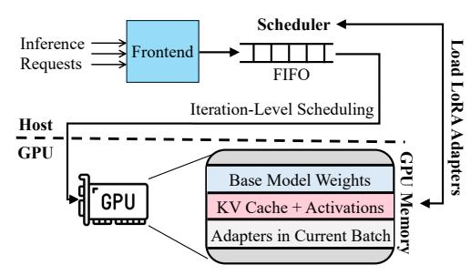
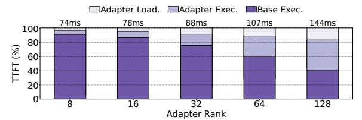
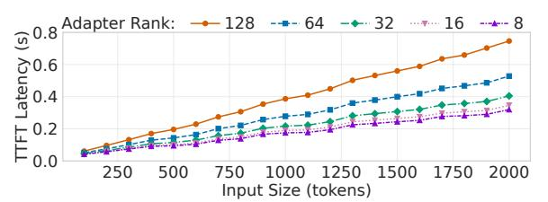
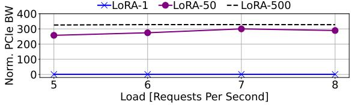
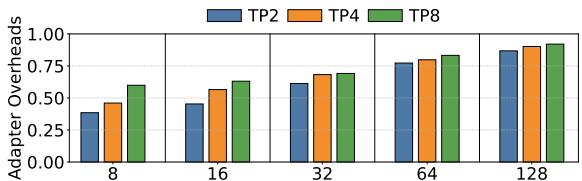
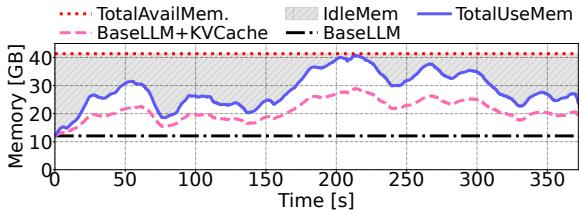
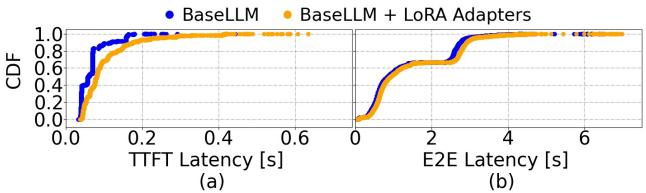
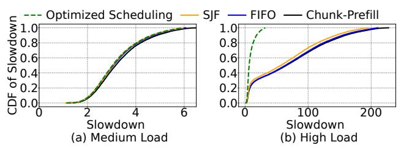
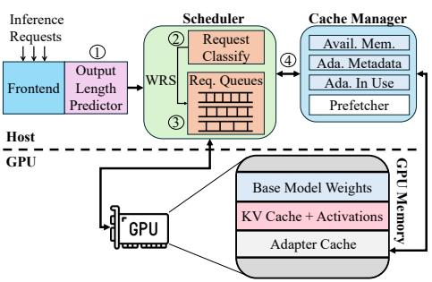

# 1 Introduction

Generative Large Language Models (LLMs) have seen an exponential growth in recent years [\[2,](#page-13-0) [8,](#page-13-1) [20,](#page-13-2) [32,](#page-13-3) [41,](#page-14-0) [53,](#page-14-1) [61,](#page-14-2) [66,](#page-14-3) [68\]](#page-14-4). They have become integral to numerous technologies and applications [\[3,](#page-13-4) [13,](#page-13-5) [33,](#page-13-6) [42,](#page-14-5) [57\]](#page-14-6). As their popularity increases, the number of online queries received by datacenter inference clusters continuously grows [\[21\]](#page-13-7). These queries typically target a variety of downstream tasks, e.g., chat-bot conversation, coding, or text summarization. These different tasks require different or special-purpose fine-tuned LLMs to achieve their highest accuracy. Unfortunately, this requirement imposes a large hardware [\[41\]](#page-14-0) and energy [\[51\]](#page-14-7) tax on datacenters, as each of these models typically requires large memory and, thus, many GPUs, to store its many parameters.

To alleviate this problem, adapter-based techniques such as Low-Rank Adaptation (LoRA) [\[17,](#page-13-8) [58\]](#page-14-8), have been explored. These methods fine-tune a small subset of a base model's parameters for every task. Recent serving systems [\[4,](#page-13-9) [49\]](#page-14-9) leverage this technique. They decouple the base model and the fine-tuned adapter parameters, allowing different colocated LLMs to share the base model. This enables serving potentially hundreds of LoRA fine-tuned LLMs at a much lower memory cost.

However, our characterization of this environment shows that adapter-based LLM serving systems exhibit two challenges that substantially reduce performance. First, inference clusters have to orchestrate the adapters required by incoming requests as they are being scheduled. State-of-the-art systems [\[4,](#page-13-9) [49\]](#page-14-9) keep the base model stored in GPU memory and the adapters in host memory. Then, they fetch on-demand the adapters required by the running requests and discard them from the GPU memory as soon as the requests terminate. Some systems [\[49,](#page-14-9) [60\]](#page-14-10) further fetch in advance the adapters for the requests waiting in the system's queue to hide some of the loading overheads. However, our study reveals that

even such asynchronous adapter fetching increases the time-tofirst-token (TTFT) latency, especially when the system is heavily loaded, as it increases contention in the CPU-GPU PCIe link.

Second, execution with adapters increases workload heterogeneity. This is because decoupled computations between base model and adapters increase the execution time of individual requests [\[60\]](#page-14-10), and such effect varies across requests. Moreover, the use of adapters can increase resource utilization and throughput, which results in the execution of heterogeneous batches of requests for different tasks and adapters [\[4,](#page-13-9) [25,](#page-13-10) [49,](#page-14-9) [60\]](#page-14-10). With increased heterogeneity, tail latency is penalized: large requests that take long to execute end up stalling smaller requests within the same batch [\[25\]](#page-13-10).

We analyze real-world production workloads [\[41\]](#page-14-0) and observe that requests follow a heavy-tailed distribution: most are completed in a short time, while a small fraction experiences significantly longer execution durations. While prior work has largely attributed this heterogeneity to differences in input [\[59\]](#page-14-11) and output [\[46\]](#page-14-12) request sizes, our study is the first one to shed light on how the variability in adapter rank (i.e., size) [\[49\]](#page-14-9) and popularity [\[10,](#page-13-11) [53,](#page-14-1) [60\]](#page-14-10) affect the requests at the tail, underlying the necessity to take the adapter size into account.

Unfortunately, simply prioritizing short requests is insufficient to address the issue of tail latency. For instance, the speculative Shortest-Job-First (SJF) scheduler [\[46\]](#page-14-12), along with its aging mechanism to mitigate starvation, inadvertently increases the tail latency of longer requests—potentially causing them to miss their Service Level Objectives (SLOs). Instead, our findings emphasize the need for a more nuanced scheduling strategy: one that addresses adapterlevel heterogeneity, offers expedited processing for short requests, and ensures that longer requests still meet their SLOs.

We use these insights to design Chameleon, an LLM inference serving system optimized for many-adapter environments. Tasks share their base LLM, which uses a large fraction of the GPU memory, while each task uses its own specific adapter. Chameleon attains high efficiency through two new ideas.

First, Chameleon provides a transparent, adaptive, and interferencefree cache for adapters. Contrary to common wisdom [\[4,](#page-13-9) [49\]](#page-14-9), we observe that, even during high load, there is enough idle GPU memory to implement a cache for adapters that are likely to be reused in the future. However, as available memory fluctuates, the cache must be dynamically sized and carefully managed to avoid interfering with the key-value cache, while employing a cost-aware eviction policy suited for workload heterogeneity.

Second, Chameleon employs a non-preemptive, adapter-aware multi-level queue (MLQ) scheduler to minimize head-of-line blocking and ensure SLO compliance for all request types. Requests are classified into different queues based on their predicted sizes and, in each scheduling cycle, a subset from each queue is selected to form a batch. This enables a faster lane for smaller requests while also eliminating starvation across all request sizes.

We implement Chameleon on top of the open-source S-LoRA [\[49\]](#page-14-9) LLM serving platform. Chameleon does not require any hardware or operating system support, or changes to CUDA kernels. We evaluate Chameleon with open-source LLMs using real-world production traces [\[41\]](#page-14-0) and show that Chameleon is very effective. Compared to a state-of-the-art baseline [\[49\]](#page-14-9), Chameleon reduces

the P99 and P50 time-to-first-token (TTFT) latencies by 80.7% and 48.1%, respectively, while improving the throughput by 1.5×.

This paper makes the following contributions:

- A characterization of state-of-the-art LLM inference serving systems in environments with many LoRA adapters.
- The Chameleon LLM inference serving platform, which introduces the first cache design for LoRA adapters, and a novel adapter-aware multi-queue scheduler that eliminates head-ofline blocking while preventing starvation.
- An implementation and evaluation of Chameleon.

## 2 Background

LLM inference. Generative LLMs [\[29,](#page-13-12) [36,](#page-13-13) [47,](#page-14-13) [56\]](#page-14-14) process the entire input at once (prefill phase) and then generate output tokens one by one (decode phase). In prefill, all input tokens are processed in parallel. This phase is compute-bound and its performance depends on the input size, which is known in advance. In decode, the output tokens are generated sequentially in iterations. Each iteration generates a token based on the input prompt and all previously generated tokens, typically cached on the GPU memory in keyvalue (KV) caches. The decode phase is memory-intensive and its performance depends on the output size, i.e. the number of decode iterations, which is determined on the fly and is unknown at the time a request is admitted to execute.

LLM inference serving systems. LLM serving systems batch requests for the same model to maximize hardware utilization. Since different requests generate different numbers of output tokens, the execution time of different requests in the same batch varies. To prevent long requests from blocking smaller ones, systems dynamically update batches. Specifically, state-of-the-art systems perform continuous batching [\[1,](#page-13-14) [61\]](#page-14-2): they remove completed requests from a batch and potentially add new ready-to-run requests on every decode iteration, an approach called iteration-level scheduling.

LLM Low-Rank Adaptation (LoRA). One way to reduce LLM training overhead is to pre-train LLMs and then fine-tune them for specific tasks. One method to do so is Low-Rank Adaptation (LoRA) [\[17,](#page-13-8) [43\]](#page-14-15), where the layers of a base model are updated with low-rank matrices to fine tune them. These matrices are called LoRA adapters and their size (i.e., their rank) determines the accuracy of the resulting computation. Specifically, higher ranks potentially translate to better tuning and higher accuracy. Since different tasks have different accuracy requirements, they are likely to employ adapters of different ranks over the same base LLM [\[49,](#page-14-9) [58\]](#page-14-8).

The straightforward way to apply adapters is to merge them with the base model and create a full-size standalone specialized LLM instance [\[28\]](#page-13-15) for each task. However, recent works for LLM inference serving [\[4,](#page-13-9) [25,](#page-13-10) [49,](#page-14-9) [60\]](#page-14-10) allow tasks to share the base model and allocate specific per-task adapters. Typically, an adapter is significantly smaller than the base model. Hence, this method significantly reduces the memory requirements of systems that serve diverse tasks [\[68\]](#page-14-4). Moreover, such method also enables batching requests of different tasks, with a common base and different adapter combinations, further improving the throughput.

Figure [1](#page-2-0) shows the organization of such systems [\[4,](#page-13-9) [25,](#page-13-10) [49,](#page-14-9) [60\]](#page-14-10). On initialization, the base LLM model is transferred to the GPU memory from the host. A scheduler on the host manages the incoming requests, updating the batch to be executed on every iteration.

Figure 1: Conventional LoRA online serving system.

Figure 2: TTFT latency with different adapter ranks broken down into base and adapter execution, and adapter loading.

Before it sends the batch to the inference engine on the GPU, the scheduler also loads any missing adapters required by the requests in the batch. Once there are no requests that use a given adapter, the adapter is discarded from the GPU memory to make room for new incoming requests [4, 49].

#### 3 Opportunities in Many-Adapter Settings

In this section, we examine the new challenges that appear in many-adapter environments and why they are not efficiently handled by conventional LLM serving systems. We characterize the open-source Llama-7B model [56] on an NVIDIA A40 server with 48GB of GPU memory [38]. We use the S-LoRA serving platform [49], a state-of-the-art inference system for multi-adapter scenarios.

## 3.1 Adapters Increase Workload Heterogeneity

The LoRA adapters employed by different tasks are expected to vary in size (*rank*), as tasks require different levels of accuracy [17, 49, 58, 60]. Figure 2 shows how this rank heterogeneity affects the TTFT of a single inference request, with medium input and output size [53]. We run the request over a base Llama-7B model combined with a specific adapter on an unloaded system, and increase the adapter rank from 8 to 128 [49, 60]. We break down the total execution time into time spent: (1) executing the base model, (2) executing the adapter, and (3) loading the adapter's weights from host to the GPU memory. The numbers on top of the bars are the TTFT values.

We observe that, as the rank size increases, the relative weight of the adapter overheads also increases. For example, for rank 128, ~60% of the total TTFT latency is spent on adapter loading and computation.

For these experiments, we use the Multi-size Batched Gather Matrix-Matrix Multiplication (MBGMM) kernel from the state-of-the-art baseline system S-LoRA [49]. LoRA adapters induce two matrix multiplications on top of the base model multiplication, and a matrix addition for results aggregation per LLM inference layer. This leads to the high computational overhead of adapter execution observed in Figure 2. Recent work (Figure 5 in [60]) corroborates

Figure 3: TTFT latency for different adapter ranks.

our findings that these steps are expensive even for small-rank adapters.

We further examine the effect of the adapter rank while considering other sources of inference heterogeneity. Prior work observed that large inputs lead to longer prefill phases and large outputs to much longer decode phases [53]. Also, using large batches of requests increases throughput but at the cost of longer decode iterations. Figure 3 shows the TTFT latency for different adapter ranks as we vary the input size of a request (i.e., the number of input tokens), while keeping the output size fixed. For this experiment, we keep the adapter weights in GPU memory and isolate prefill performance by excluding adapter loading. For all input sizes, TTFT varies significantly across adapter ranks. Moreover, the impact of the rank is more pronounced as the input size increases. Similarly, it can be shown that, for large batch sizes, different adapter ranks lead to diverse decode latencies for requests with similar input/output sizes. Overall, we find adapter rank to be an extra, equally important source of heterogeneity, next to input, output, and batch size.

Apart from different ranks, adapters have skewed popularity as well, following the skewed popularity of different tasks. LLM inference is a user-facing service where some tasks receive a larger amount of requests than others, and these requests typically arrive in bursts [10, 53, 60]. Next, we will show how this heterogeneity affects various system design decisions, such as which adapter to keep in GPU memory or how to schedule inference requests for different adapters.

**Insight #1:** Adapters are an additional source of heterogeneity in LLM inference that must be managed dynamically.

#### 3.2 Adapters are Expensive to Load

When an LLM inference request using a specific adapter arrives at an online serving system, the adapter must be loaded into the GPU memory for the request to be processed. Thus, loading the adapter weights lies on the critical path of inference execution. Figure 2 shows that loading takes 17.5% of the total TTFT latency when a 128-rank adapter is used in an unloaded system.

This overhead becomes more pronounced as the requests use a larger number of different adapters. One reason is the contention on the PCIe link between the host and the GPU as the adapters are brought to the GPU memory. In our next experiment, we use rank 32 adapters and consider three scenarios: in *LoRA-1*, all the requests use the same adapter; in *LoRA-50* and *LoRA-500*, a request uses one of 50 or 500 different adapters with a uniform distribution. Figure 4 shows the normalized PCIe bandwidth consumption for the three scenarios and different requests per second (RPS). We normalize the bandwidth consumption to *LoRA-1* with 5 RPS.

We see that, as we go from *LoRA-1* to *LoRA-50* and *LoRA-500*, the bandwith consumption increases. With *LoRA-500*, the PCIe bus is

Figure 4: PCIe bandwidth usage under different loads for environments with: 1 adapter (*LoRA-1*), 50 different adapters (*LoRA-50*), and 500 different adapters (*LoRA-500*).

Figure 5: Overhead of loading the adapters of different ranks as a fraction of the total TTFT latency for Llama-70B running on 2, 4, or 8 A100 GPUs using tensor parallelism.

Figure 6: Memory usage over time for different parts of the workload: base LLM model, KV cache, and adapters.

saturated. We measure that at, 8 RPS, this bandwidth contention causes the P99 TTFT latency of the requests in *LoRA-50* and *LoRA-500* to be 1.69x and 2.60x higher, respectively, than *LoRA-1*. For higher RPS loads, these P99 TTFT latency gaps increase rapidly, but they are also affected by other bottlenecks.

We now evaluate the impact of adapter loading overhead when serving the larger Llama-70B base model using tensor parallelism (TP) across 2, 4, and 8 A100 GPUs—since the model no longer fits on a single GPU. We observe that the cost of loading adapters increases due to two main factors. First, larger base models result in proportionally larger adapter weight matrices, for the same rank configuration, increasing their loading time. For example, a rank 32 adapter for Llama-7B is 64 MB, while its size grows to 256 MB for Llama-70B. Rank 128 adapter size grows to the order of GBs. Second, using more GPUs introduces additional overheads: adapter weights must now be partitioned across tensor-parallel ranks, transferred separately to each GPU's memory, and synchronized to ensure consistent execution. These overheads exacerbate the latency on the critical path of inference.

Figure 5 considers different TP degrees and adapter ranks, and shows the fraction of the TTFT latency that is taken by adapter loading. We observe that this fraction increases with the TP degree and adapter rank. For example, loading accounts for 68% of the TTFT latency for rank 32 and TP4.

An intuitive way to reduce these overheads is to leverage idle GPU memory to cache adapters. However, LLM inference has substantial load fluctuations [53]. Figure 6 shows the GPU memory usage over time when we run the Llama-7B model using production

Figure 7: CDF of (a) TTFT and (b) E2E latency of requests for a real LLM trace [41]. Requests are executed one by one.

traces of requests from Azure [41]. Because our testbed has modest memory, we have scaled down the input and output lengths in these large-scale system traces using a constant factor that results in the peak memory consumption of the scaled-down trace to be equal to the memory capacity of our testbed (§ 5.1).

The figure shows the memory consumed by the base LLM (*BaseLLM*), base LLM plus KV cache (*BaseLLM+KVCache*), and base LLM plus KV cache plus adapter (*TotalUseMem*). We see that, most of the time, there is abundant idle memory that can cache adapter weights. However, idle memory drastically drops during load spikes. Hence, the system needs to carefully and dynamically resize the cache resources based on the incoming load.

These findings challenge the common design decision to discard the adapters from GPU memory if none of the currently running requests use them [49, 60]. We find that keeping them in GPU memory can significantly improve performance, especially in high load scenarios, and that there is a sizable amount of idle GPU memory that can be used for this.

**Insight #2:** Frequent loading of adapters from host to GPU memory creates bandwidth contention, degrading system performance. Idle GPU memory can be repurposed to cache adapters and mitigate some of these overheads. However, dynamic resizing of the cache is essential, as the amount of idle memory fluctuates heavily.

#### 3.3 Adapters Affect Requests at the Tail

In Section 3.1, we observed that there is a high degree of heterogeneity in the performance of LLM inference requests, based on their input, output, and adapter size. Now, we analyze how this heterogeneity impacts the effectiveness of scheduling decisions.

We take the open-source production traces of LLM inference requests for a conversation service [41] and execute one request at a time. We run with only a base LLM, and with a base LLM augmented with LoRA adapters. Similar to [49], we consider a pool of 100 different adapters with rank sizes uniformly distributed among 8, 16, 32, 64, and 128, and associate every request in the trace with one of these adapters, following a uniform distribution for rank popularity and a power-law distribution for adapter popularity. Figure 7 shows the CDF of (a) TTFT and (b) end-to-end latency of all requests. For this experiment, the latency includes both the prefill phase and the time it takes to load the adapter. This figure shows that the execution time of requests follows a heavy-tail pattern: the majority of requests have short execution times, but there are a few very long requests. Moreover, adding LoRA adapters significantly affects requests at the tail.

Heterogeneity in execution times typically requires special scheduling considerations. LLM engines schedule requests at iteration-level [61] where, at each iteration, the scheduler decides which

Figure 8: CDF of the per-request slowdown for different scheduling policies under (a) medium and (b) high load.

requests will execute in a batch. The majority of conventional systems use a FIFO approach due to its simplicity [20, 49]. However, FIFO is inefficient for heterogeneous requests, as it introduces head-of-line (HoL) blocking, leading to increased tail latency.

For this reason, researchers have proposed to schedule the requests in a Shortest-Job-First (SJF) manner. Specifically, existing systems [46] predict the request output lengths and prioritize the requests with the shortest predicted outputs. However, continuously prioritizing short requests leads to the starvation of long requests, again, negatively impacting the overall tail latency. Moreover, using the output length as the only scheduling knob is insufficient, as inputs and adapters also impact the total latency (Figure 3).

To show the inefficiencies of these two scheduling policies, we execute the production trace [41] using the Llama-7B model. We record the slowdown of each request: how many times higher is the request's response time now relative to the response time in an isolated environment where the request executes alone. Figure 8 shows the CDF of slowdown per request with different scheduling policies: FIFO with regular iteration-level scheduling (i.e., continuous batching) [61] (FIFO); FIFO with the more advanced chunked-prefill iteration-level scheduling [1] (Chunk-Prefill); SJF; and the optimized scheduling policy that we will introduce in Section 4 (Optimized Scheduling). The last two schemes use iteration-level scheduling.

Under high loads, conventional policies create high slowdowns for the requests at the tail. In FIFO, short requests are blocked by long requests. Using a classification of requests into short, medium, and long that we describe in Section 4, we measure that a short request spends on average 28.6% of its time waiting to be scheduled, compared to 12% for a large request. As chunked-prefill is designed to prioritize decode iterations, it slightly slows down prefill iterations, increasing TTFT latencies. Chunked-prefill does not solve the HoL blocking problem because it still adheres to a per-request ordering within each pipeline stage. Thus, short requests can remain blocked behind long prefill or decode chunks in their respective queues, especially when resources (e.g., tokens or compute slots) are saturated. Hence, chunked-prefill does not reduce tail latency under high-load scenarios.

For SJF, long requests are penalized, as they are starved by the prioritization of short ones. We measure that a long request spends 5.15 s waiting to be scheduled compared to 1.5 s for a small request. While long requests are relatively infrequent, their queuing latency has a significant impact.

**Insight #3:** Conventional scheduling policies such as FIFO and SJF are ineffective for highly heterogeneous LLM inference requests. There is a need for a scheduling policy that can efficiently manage request heterogeneity while, at the same time, taking into account all knobs that affect the execution time.

Figure 9: Chameleon architecture.

