# <span id="page-6-0"></span>4.3 Chameleon Scheduler

The Chameleon Scheduler is inspired by prior work on load balancing multi-server environments with heterogeneous task size distributions [\[7,](#page-13-18) [15,](#page-13-19) [35\]](#page-13-20). The scheduler stores the inference requests across multiple queue lanes, each dedicated to handling requests within a specific size range. Its goal is twofold: to provide a fast lane for small requests, preventing their HoL blocking, and to ensure that requests from all lanes are scheduled in parallel, avoiding starvation for large requests.

Each queue is assigned a resource quota, which governs the resources available to execute requests from that queue. This quota is represented as tokens, and includes input tokens, output tokens, and tokens due to the memory required for the corresponding adapter. These tokens determine the resources a queue can reserve for request execution. When a request from a specific queue is admitted to the batch, the queue's available quota is decreased by the memory consumption of the request, determined by its input and output length, and adapter size, all translated into tokens. When the request ends, it returns the borrowed quota back to the queue. In every iteration, all queues have the chance to put requests into the batch, although the queues with smaller requests are accessed first.

1. Admission to the Queues. We characterize the requests entering the system by three parameters: known input size, predicted output size, and rank of the used adapter. We calculate the weighted request size (WRS) as an estimate of the total execution time of a request based on the formula:

$$WRS = \left(A \cdot \frac{InputSize}{MaxInputSize} + B \cdot \frac{OutputSize}{MaxOutputSize}\right) \cdot \frac{AdapterSize}{MaxAdapterSize}$$

The input size affects the prefill latency, which is typically shorter than the decode latency but still a significant contributor to the total execution. The output size determines the number of decode iterations, which affects the decode latency and the total execution time. The adapter size affects the speed of both prefill and decode processes (Section [2\)](#page-1-0). It can be shown that using this polynomial of degree 2 improves Chameleon's performance by up to 10% over using a polynomial of degree 1 that simply combines the three factors linearly.

We call WRS the "request size", and use it to classify requests into size ranges and dispatch them to corresponding queues for scheduling. A and B are weighting coefficients chosen based on our sensitivity studies and on profiling in Section [3.](#page-2-4) We set A to 0.4 and B to 0.6.

Given a request, the scheduler uses the calculated WRS and the per-queue cut-offs (i.e., the boundaries that define the ranges of request sizes for each queue) to place the request in the correct

#### Algorithm 1: Generate a new batch of requests.

```
def generate_batch:
    Inputs: Queues = requ. queues; PQ_Tokens = per queue tokens
    Result: Batch of requests to be sent to the GPU.
    batch ← [];
    leftover ← 0;
    for each q in Queues do // Phase 1
        consumed ← put_batch(q, PQ_Tokens[q], batch);
        if q is empty then
            leftover ← leftover + (PQ_Tokens[q] - consumed);
    for each q in Queues do // Phase 2
        if leftover == 0 then
            break;
        consumed ← put_batch(q, leftover, batch);
        leftover ← leftover - consumed;
    return batch;
def put_batch:
    Inputs: Queue; Tokens; Batch
    Result: Tokens consumed by added requests from the queue.
    resources ← Tokens;
    consumed ← 0;
    for each req in Queue do
        needed ← need_resources(req);
        if resources < needed then
            break;
        resources ← resources - needed;
        consumed ← consumed + needed;
        batch.append(req);
    queue ← [req for each req in queue if req not in batch]
     return consumed;
```

<span id="page-6-1"></span>queue. Later, we detail how to determine these per-queue cut-offs using request clustering. Note that the Chameleon Scheduler uses an open-source BERT-based proxy model to predict a request's output length [\[46\]](#page-14-12).

2. Admission to the Batch. The idea behind the Chameleon Scheduler is depicted in Algorithm [1.](#page-6-1) It operates in two phases: Initial Request Admission and Redistribution of Spare Resources. In the first phase, each queue attempts to put requests into the batch, up to the queue's maximum allowed resources. If certain queues have few or no requests to put, any unused resources are collected and consolidated into a Total Spare Resources bucket. After the first phase ends, in the second phase, the scheduler redistributes the spare resources to queues that still have pending requests, aiming to maximize resource utilization. Specifically, starting from the smallest-request queue and moving downward to larger-request queues, the scheduler allocates as much of the spare resources as possible to admit waiting requests into the batch. If requests from a given queue still cannot be admitted due to insufficient tokens available, no additional resources are allocated to that queue.

The phases of this process are illustrated in Figure [10,](#page-7-0) which depicts three request queues, for "small", "medium", and "large" requests. Figure [10\(](#page-7-0)a) shows the case when no spare resources are collected, while Figure [10\(](#page-7-0)b) shows the case when spare resources are collected and redistributed. In Figure [10\(](#page-7-0)a), the Initial Request Admission phase starts with the small-request queue, admitting

<span id="page-7-0"></span>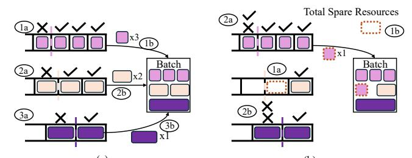

Figure 10: An example of Chameleon Scheduler operation when (a) no spare resources are collected (b) spare resources are collected and redistributed.

three requests, which fit within the queue's resource quota (a). The fourth request is not admitted due to insufficient resources allocated to the queue. These admitted requests are then placed into the batch (a). The same procedure is subsequently applied to the medium-request queue (a), and the large-request queue (a). At the end of this phase, there are no remaining resources to redistribute, so the process concludes without entering the second phase.

Figure 10(b) shows a case where spare resources are available for redistribution. Specifically, the medium-request queue only has a single request, and so it does not use up its allocated resources. Hence, during the Initial Request Admission phase, the queue contributes with some spare resources (1a), which are deposited into the Total Spare Resources bucket (1b).

Then, during the Redistribution of Spare Resources phase, the scheduler checks each queue in order, from the small- to the medium- and large-request queue, to try to admit any remaining requests into the batch. The small-request queue evaluates if its single pending request can be admitted (2a). Since the Total Spare Resources are sufficient, the scheduler allows this request to be admitted. The medium-request queue has no pending requests and is skipped. The large-request queue attempts to put its pending request (2b). However, since the remaining spare resources are not enough, the request remains in the queue. At the conclusion of this phase, the batch is finalized and ready for execution.

**3. Opportunistic Bypassing.** Sometimes, a request *R1* that should be put in a batch according to the resource quota allocated to its queue, may fail to get admitted to the batch because there is not enough idle GPU memory to store its adapter—even after Chameleon evicts all idle cached adapters. In such case, without proper action, the queue is unable to use its allocated resource quota. However, it may happen that a younger request *R2* in the same queue uses an adapter that is either already loaded in the Chameleon Adapter Cache or is small enough to fit in the remaining space of the cache.

To address this case, Chameleon implements an *Opportunistic Bypass* mechanism, whereby R2 is put in the batch for execution, bypassing R1. This mechanism improves system throughput by allowing more requests to be processed without waiting for cache space to become available. However, repeated bypassing can lead to request starvation. Consequently, Chameleon first predicts how soon will the memory needed by R1 become available, and how long will R2's execution take. Then, Chameleon allows R2 to bypass R1 only if the former is longer than the latter.

Unfortunately, predictions may turn out to be wrong. Hence, if, before R2's execution completes, Chameleon finds enough free memory on the GPU (including the memory used by R2) to execute R1, it squashes R2 for later re-execution. In our experiments, we see at most 5% of requests getting squashed. Note that these scenarios can only happen when the GPU memory is entirely consumed by running requests and no idle adapters are cached. Thus, eviction policies do not apply here.

4. Determining the Number of Queues. The efficiency of the Chameleon Scheduler depends on the number of used queues. Too few queues may cause HoL blocking when there is a high variability in the request sizes within a queue, while too many queues can result in load imbalance and underutilized queue resources due to resource fragmentation. To decide on the optimal number of queues, the Chameleon Scheduler uses K-Means clustering. Given the distribution of request sizes, the scheduler computes K-Means clustering for values of K ranging from 1 to  $K_{max}$ . With K-Means clustering, requests similar in size are grouped within the same cluster, and requests from different clusters are different enough to require separate resources. For each value of K, the scheduler calculates the Within-Cluster Sum of Squares (WCSS), and picks the K that yields minimal WCSS as the optimal number of queues. We set the maximum number of queues,  $K_{max}$ , to 4 to keep queue management overheads tolerable.

Once we have the K centroids from the clustering result, we proceed to determine the per-queue request-size cutoffs. Specifically, we define the cluster boundaries as the midpoint between the centroids of two consecutive clusters. For example, the boundary between  $Cluster_i$  and  $Cluster_{i+1}$  is  $(Centroid_i + Centroid_{i+1})/2$ . The boundaries represent the maximum and minimum request sizes for each queue:  $Queue_1$  handles requests smaller than  $Boundary_1$ ,  $Queue_2$  handles requests larger than or equal to  $Boundary_1$  but smaller than  $Boundary_2$ , and so on for all K queues.

The distribution of request sizes changes over time due to fluctuating load behavior. Hence, static queue configurations can lead to inefficiencies. Therefore, Chameleon dynamically adjusts the number of queues based on the observed load patterns. Specifically, the system periodically gathers recent request data to analyze the distribution of request sizes and, every  $T_{refresh}$ , re-computes the optimal number of queues and the per-queue cut-offs using the aforementioned method. Since changes in load patterns are not sharp [53], changing the multi-queue organization happens relatively infrequently. We set  $T_{refresh}$  to 5 minutes, which adds negligible overheads.

**5. Assigning Quotas per Queue.** After determining the number of queues in the system and the per-queue cut-offs, the Chameleon Scheduler assigns the resource quotas to each queue. For this, we use queuing theory, modeling the system as K\*M/M/1 queues [34].

We take the maximum allowed size (S) of a request in a queue in tokens, the assigned resource quota (Tok) to the queue in tokens, the expected time duration (D) of processing a request from the queue, the arrival rate ( $\lambda$ ) of requests to the queue, and the requests' SLO. Then, the processing rate of the requests is  $\mu = \frac{Tok}{S*D}$ , while the total time that a request spends in the system is  $T_{total} = \frac{1}{\mu - \lambda}$ . To meet the SLO, the system needs to satisfy the following equation:  $T_{total} \leq SLO$ . Combining these constraints, we compute the

minimum assigned quota in tokens  $(Tok_{min})$  to the queue that is required for requests from the queue to meet the SLO:

$$Tok_{min} \ge S * D * \left(\frac{1}{SLO} + \lambda\right)$$

The total number of available tokens in the system  $(Tok_{total})$  must be greater than or equal to  $\sum\limits_{q} Tok_{min}^q$  (i.e., the sum of the minimum number of tokens needed by each queue q). Then, each queue q is assigned its minimum number of required tokens  $(Tok_{min}^q)$ , and the remaining tokens  $(Tok_{total} - \sum\limits_{q} Tok_{min}^q)$  are split across queues proportionally to their initial weights.

To adjust to the dynamic nature of the workload, Chameleon recomputes the per-queue quotas every  $T_{refresh}$ .

#### 4.4 Multi-GPU Set-up

With multiple GPUs, LLM inference can use tensor parallelism (TP), pipeline parallelism (PP), and data parallelism (DP). In TP or PP, Chameleon distributes its adapter cache accordingly, so each GPU stores a fraction of each adapter; in DP, Chameleon replicates the adapter cache across engines. Since adapters are read-only, data coherence is not a concern. In this paper, we follow the S-LoRA TP strategy [49].

For scheduling, in TP or PP, Chameleon treats all GPUs as a single execution engine; in DP, Chameleon uses a two-level scheduler: a global scheduler dispatches requests to the different engines, and each engine has its local scheduler.

## 5 Evaluation

## <span id="page-8-0"></span>5.1 Evaluation Methodology

Hardware Platforms and LLMs. We run most of our experiments on a server equipped with an A40 NVIDIA GPU [38] and an AMD EPYC 9454 CPU. The GPU has 48GB memory and the CPU has 48 cores and 377GB of main memory. For the scalability experiments, we use a server equipped with an A100 NVIDIA GPU [37] configured with 24GB, 48GB, and 80GB of GPU memory. For the multi-GPU experiments, we use four A100 GPUs with 80GB of GPU memory. For the majority of experiments, we use the Llama-7B [56] model. When memory capacity allows, we also run the Llama-13B and Llama-30B models. We used other models, such as Falcon [55], OPT [30], and Mixtral [36] and observed similar trends.

**Workload Configuration.** We set the input and output lengths of requests based on the open-source production trace from Azure [41]. To vary the load on the system, we use the Poisson distribution for the request inter-arrival time [4, 25, 26]. We set the number of different adapters used by the requests to  $N_a$ . Unless specified otherwise, in our experiments,  $N_a$  is 100. There are five adapter ranks: 8, 16, 32, 64, and 128. Each rank has an equal number of different adapters, i.e.,  $N_a/5$ . To each request, we attach an adapter, following a uniform distribution for rank popularity and a power-law distribution for adapter popularity within a rank [49].

**Baseline Systems.** We run the experiments on S-LoRA [49], an open-source state-of-the-art LLM inference serving platform for adapter environments, and compare Chameleon to the baseline S-LoRA. S-LoRA performs iteration-level scheduling using a FIFO policy, and asynchronous adapter prefetching without adapter caching.

<span id="page-8-1"></span>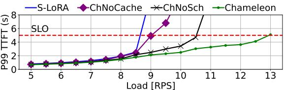

Figure 11: P99 TTFT tail latency for S-LoRA, ChameleonNo-Cache, ChameleonNoSched, and Chameleon under different loads. The red dashed line indicates the SLO.

<span id="page-8-2"></span>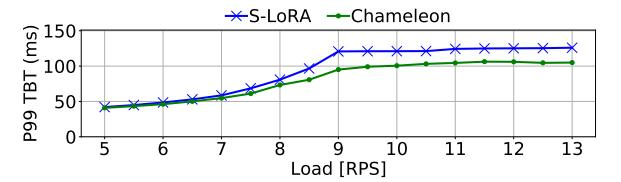

Figure 12: P99 TBT tail latency for S-LoRA and Chameleon.

We also compare Chameleon's scheduler to the recently proposed SJF scheduler in  $\mu$ Serve [46]. We measure Time-To-First-Token (TTFT), Time-Between-Tokens (TBT), and End-To-End (E2E) latency. We set the SLO to be 5× the average request execution time in a low-load system [26, 41, 53].

#### <span id="page-8-3"></span>5.2 Performance Gains

**1. Tail Latency.** Figure 11 shows, for different loads, the P99 TTFT tail latency for *S-LoRA*, *Chameleon* without its cache, *Chameleon* without its scheduler, and the full *Chameleon*. We consider the latter in this section. Although it is hard to see for low RPS, *Chameleon* consistently has lower TTFTs than *S-LoRA*, and the benefits become more pronounced as the load increases. At low (6 RPS), medium (8 RPS), and high (9 RPS) loads, *Chameleon* reduces the TTFT tail latency over *S-LoRA* by 14.7%, 24.6%, and 80.7%, respectively.

There are two reasons why Chameleon reduces the P99 TTFT latency over S-LoRA. First, its caching mechanism reduces the adapter fetching time and, as the load increases, it also alleviates the PCIe bandwidth bottleneck-which in turn further decreases TTFT latency. Second, its scheduling policy reduces queueing delays, as it removes HoL blocking and prevents starvation, especially helping the requests at the tail. As the load increases, GPU memory is increasingly consumed by the KV cache entries of the running requests, and there is less space for Chameleon to cache adapters not currently in use. It can be shown that, by 12.5 RPS, most of the time, GPU memory is fully used and there is no space for caching adapters not in use. Still, we see that Chameleon manages to reach this point while keeping TTFT under SLO. Below 12.5 RPS, Chameleon judiciously re-purposes scarce idle memory, caching frequently-used and costly to reload adapters, while prioritizing requests with short execution times that use them. S-LoRA, on the other hand, already violates SLO at about 8.5 RPS, well before it can fully utilize all the available GPU memory to run requests.

Chameleon reduces both TTFT and TBT tail latencies. Figure 12 shows the P99 TBT latency for *S-LoRA* and *Chameleon* under different loads. Again, *Chameleon* has lower latencies than *S-LoRA* for all loads. However, both systems keep their TBT latency under the SLO (150ms). The reason is that TBT latencies are less affected by queuing effects, and requests do not wait on adapter loading. Substantially increasing the batch size can in theory increase TBT

<span id="page-9-0"></span>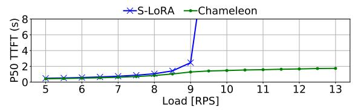

Figure 13: P50 TTFT latency for S-LoRA and Chameleon.

<span id="page-9-1"></span>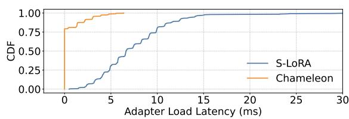

Figure 14: CDF of adapter loading latency on the critical path.

in both systems. However, in our experiments of Figure 12, we find that admissions are eventually limited by available GPU memory, and batches never grow to the extent of violating TBT SLOs.

- **2. Throughput.** Figure 11 also shows the expected TTFT SLO as a red dashed line (i.e.,  $5\times$  the average request execution time in a low-load system). We define the throughput as the load that a system can sustain without violating this SLO. From Figure 11, we can see that S-LoRA's starts violating the SLO around 8.6 RPS, while Chameleon's starts violating the SLO around 12.9 RPS. This results in  $1.5\times$  higher throughput for Chameleon.
- **3. Median Latency.** Figure 13 shows the P50 TTFT latency for *S-LoRA* and *Chameleon* under different loads. At low (6 RPS), medium (8 RPS), and high (9 RPS) loads, *Chameleon* reduces the median latency over *S-LoRA* by 13.9%, 20.9%, and 48.1%, respectively. The benefits of *Chameleon* are still significant, although not as pronounced as in the tail latency. The reason for this is that average conditions are less demanding.
- **4. Performance Breakdown.** To understand the performance benefits of the two main *Chameleon* techniques, we run them in isolation. Figure 11 shows the P99 TTFT latency of *Chameleon* when running only with either our caching technique (*ChameleonNoSched*) or our scheduling technique (*ChameleonNoCache*). We see that both systems improve the throughput over *S-LoRA*: *ChameleonNoSched* and *ChameleonNoCache* have 1.2× and 1.05× higher throughput, respectively, than *S-LoRA*. However, their throughput is substantially lower than *Chameleon*'s. Hence, both adapter caching and adapter-aware scheduling are needed.
- **5. Adapter Loading Time.** Figure 14 shows the CDF of the latency of adapter loading on the critical path for the requests of the Splitwise trace [41] in *Chameleon* and *S-LoRA*. *S-LoRA* suffers from adapter loading latencies of up to 30ms, as its prefetching scheme fails to completely overlap adapter transfer with computation. With *Chameleon*, on the other hand, 75% of the requests hit in the Chameleon Cache, resulting in zero loading overheads, while the remaining 25% of the requests pay loading costs of only up to 6ms. Adapter loading in *Chameleon* is cheaper because: a) *Chameleon* prioritizes the eviction of smaller adapters and thus reloading on a cache miss is cheaper, and b) *Chameleon*'s caching reduces the contention on the PCIe.

<span id="page-9-2"></span>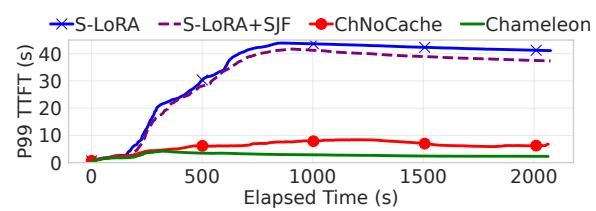

Figure 15: P99 TTFT latency over time with different scheduling policies: FIFO (default in *S-LoRA*), SJF in *S-LoRA*, and our proposed policy in *ChameleonNoCache* and *Chameleon*.

<span id="page-9-3"></span>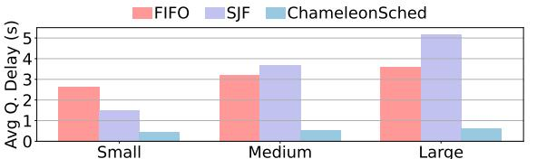

Figure 16: Average queuing time for each class of request in S-LoRA's FIFO, SIF, and the Chameleon Scheduler.

#### 5.3 Different Scheduling/Caching Policies

In earlier experiments, we compared Chameleon with S-LoRA, which performs FIFO request scheduling and does not cache unused adapters. Here, we compare Chameleon to a SJF (shortest-job-first) scheduling policy proposed by  $\mu$ Serve [46]. Also, we augment the baseline with a Chameleon Cache that uses an LRU eviction policy. **1. Scheduling Policies.** Figure 15 shows the P99 TTFT latency over time with different scheduling policies driven by the production traces in Spitwise [41] at 9 RPS. We run *S-LoRA* with its default FIFO scheduling policy [49] and *S-LoRA* with the SJF scheduling policy from  $\mu$ Serve [46], as two state-of-the-art baselines. Additionally, we run our proposed adapter-aware multi-queue scheduling policy, both without our caching mechanism (*ChameleonNoCache*) and with it (*Chameleon*).

Both *S-LoRA* and *S-LoRA*+SJF have large tail latencies that increase over time due to the queuing bottlenecks. Their TTFT latencies amply violate the SLO. With FIFO scheduling (*S-LoRA*), the requests at the tail are short ones blocked by the earlier long ones, while with SJF scheduling (*S-LoRA+SJF*), the requests at the tail are long ones starved by the prioritization of short requests. Our proposed scheduling policy (*ChameleonNoCache*) is very effective: it removes both HoL blocking effects and starvation, leading to much lower tail latencies. Finally, by integrating our caching approach, the TTFT latency reduces further.

2. Characterizing the Scheduling Policies. To understand why the Chameleon Scheduler outperforms the other schedulers, we measure the time that requests spent waiting in the queues before they are served. In Figure 16 we plot the average queuing delays per request size category, as identified by *Chameleon* (small, medium, and large), and for the three scheduling policies, i.e. *S-LoRA's FIFO*, *SJF*, and the *Chameleon* Scheduler. We see that FIFO introduces relatively uniform absolute queuing delays. However, for small requests, queuing delays account for 28.6% of their E2E latency. On the other hand, the SJF scheduler prioritizes small requests, creating long queuing delays for large requests. Finally, the Chameleon scheduler substantially reduces queuing delays for all request types, bringing delays to below 8% of the requests' E2E for all sizes.

<span id="page-10-0"></span>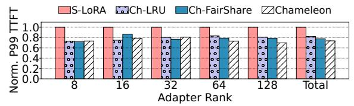

Figure 17: Normalized P99 TTFT latency for S-LoRA, Chameleon-LRU, Chameleon-FairShare, and Chameleon.

<span id="page-10-1"></span>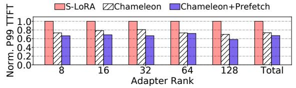

Figure 18: Normalized P99 TTFT latency for requests of different adapter ranks in S-LoRA, Chameleon, and Chameleon+Prefetch.

**3. Caching Policies.** We now compare different replacement policies for our proposed adapter cache. Specifically, *LRU* evicts from the cache the least recently used adapter. *FairShare* follows our proposed approach of considering the adapter's recency, frequency, and size, but assigns the same weight to all three knobs. Finally, *Chameleon* uses our proposed algorithm, where the weights of the three knobs are tuned based on our extensive profiling (Section 4.2).

Figure 17 shows the normalized P99 TTFT latency for requests of different adapter ranks at medium system load (8 RPS) for *S-LoRA* (which does not have an adapter cache) and for Chameleon with the three adapter cache replacement policies described above. We see that Chameleon's proposed caching mechanism is very effective. All the caching schemes reduce the P99 TTFT latency over *S-LoRA* by a considerable amount for all adapter ranks. Additionally, our proposed replacement policy further reduces the TTFT, especially for larger adapters. For example, for requests with adapter rank 128, *Chameleon* reduces the P99 TTFT latency over *Ch-FairShare* by 12%. For the total trace, *Ch-LRU*, *Ch-FairShare*, and *Chameleon* reduce the P99 TTFT latency over *S-LoRA* by 18%, 22%, and 26%, respectively.

Chameleon's eviction policy is based on cost and benefit estimations. Prior work on software caches for objects with variable sizes proposed the Greedy Dual Size Frequency (GDSF) algorithm for web caching [5]. GDSF uses Score = Frequency \* Cost/Size + K to identify eviction candidates, where Cost is the overhead to load an object into the cache. Chameleon applies this strategy to the new context of adapter caching, and proposes a new score formula for this use-case. GDSF's score is sub-optimal for a) the skewed access patterns of adapters, as it tends to cache only the most popular adapters and discards the rest, and b) the skewed rank popularity of adapters, as GDSF aggressively evicts larger adapters with moderate use frequency. It can be shown that the P99 TTFT for high load (9.5 RPS) and power-law adapter popularity for S-LoRA with the cache and eviction algorithm of GDSF, is substantially worse than that of Chameleon.

**4. Prefetching Mechanism.** To reduce the latency of cache misses, Chameleon could use prefetching. It could predict which adapters are going to be used in the near future, and prefetch them to the adapter cache ahead of time. To test this idea, we have used a histogram-based technique to predict the future load of requests

<span id="page-10-2"></span>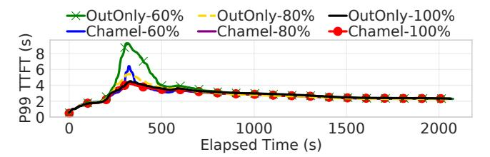

Figure 19: P99 TTFT latency over time for two configurations (*OutputOnly* and *Chameleon*) under different output length predictor accuracies.

from [48]. In this section, we show the potential benefits of using this prefetching. However, since the effectiveness of prefetching is highly dependent on the prediction accuracy of future loads, we do not include prefetching by default in our experiments in this paper.

Figure 18 shows the normalized P99 TTFT latency for requests of different adapter ranks under medium load in three systems: *S-LoRA, Chameleon*, and *Chameleon+Prefetch*. We see that prefetching can further reduce the TTFT latency of *Chameleon*. For the total trace, prefetching further reduces the P99 TTFT latency by 8.8%. As adapters are set to follow a uniform distribution for rank popularity and a power-law distribution for adapter popularity within a rank, their predictability is high. However, for other distributions, predictability may be lower.

## 5.4 Sensitivity Analysis

To gain further insights into Chameleon, we perform a sensitivity analysis of several of its parameters.

1. Impact of the Accuracy of the Output Length Predictor. Recall that the Chameleon Scheduler uses an open-source BERT-based proxy model to predict a request's output length (Section 4.3.1). We measure that our predictor has an average accuracy of about 80%. In this section, we examine the impact of artificially setting the predictor accuracy to 100%, 80%, and 60%. We consider two ways to compute the weighted request size (WRS) (Section 4.3.1): OutputOnly, which uses only the request output length (similar to [46]), and Chameleon, which uses input and output length, and adapter size.

Figure 19 shows the P99 TTFT latency for *OutputOnly* and *Chameleon* for the different output predictor accuracies as a function of time. We see that the system is robust to predictor accuracy for most of the time. However, during a load burst (at around 300s), the configurations with 60% accuracy have high TTFT latency. Also, the configuration that uses only the predicted output length (*OutputOnly*) is more sensitive to the predictor accuracy than *Chameleon*. Finally, with a predictor of 80% accuracy, *Chameleon* has approximately the same TTFT latency as with one of 100% accuracy.

2. Impact of the distribution of adapter rank popularity and adapter popularity within a rank. By default, our experiments use a uniform distribution for adapter rank popularity and a power-law distribution for adapter popularity within a rank (Section 5.1). In this section, we examine other distributions: i) uniform rank popularity and uniform adapter popularity within a rank (*U-U*), ii) uniform rank and power-law adapter popularity (*U-P*), and iii) power-law rank popularity and power-law adapter popularity (*P-P*). Figure 20-right shows the normalized P99 TTFT latency with these distributions in *S-LoRA* and *Chameleon*. We see that both

<span id="page-11-0"></span>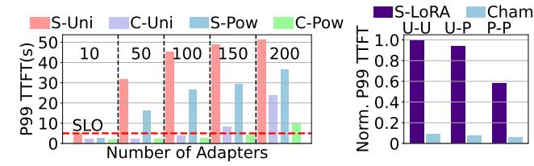

Figure 20: P99 TTFT latency sensitivity to the total number of adapters (left) and to their distribution (right).

<span id="page-11-1"></span>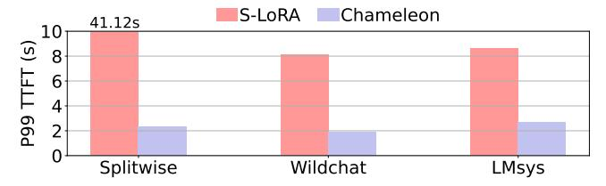

Figure 21: P99 TTFT latency for different traces. The SLOs for Splitwise, WildChat-1M, and LMSYS-Chat-1M are 5s, 3.3s, and 3.5s, respectively.

*S-LoRA* and *Chameleon* perform best under the *P-P* distribution, as the cost of loading adapters and the queuing delays decrease. *Chameleon*'s advanced caching and scheduling keep the P99 TTFT latency minimal for all distributions.

- 3. Impact of the total number of adapters. In our experiments, we have used a total number of adapters ( $N_a$ ) equal to 100. In this section, we consider  $N_a$  equal to 10, 50, 100, 150, and 200 [49, 60]. We also consider both uniform and power-law distributions for the rank popularity. Figure 20-left shows the P99 TTFT latency for *S-LoRA* (S) and *Chameleon* (C) for uniform (Uni) and power-law (Pow) distributions. The load is 9.5 RPS and the SLO is 5s. We see that *Chameleon* keeps the TTFT under SLO for up to 100 adapters when using a uniform distribution, and up to 150 when using a power-law distribution. In contrast, *S-LoRA* can only meet SLO for either distribution for 10 adapters. As the number of adapters increases, *Chameleon* keeps the TTFT latency low because: i) its adapter cache minimizes the increasing overheads of adapter loading and ii) its scheduler reduces the increasing effect of HoL blocking.
- 4. Impact of Additional Traces. We now use different traces beyond those from Splitwise [41] to evaluate *Chameleon*, without readjusting *Chameleon*'s tuned parameters—i.e., the coefficients in its cache eviction policy and WRS formula. We obtain traces from two data-sets: WildChat-1M [65] and LMSYS-Chat-1M [67]. In Figure 21, we plot the P99 TTFT latency for each trace for 9.5 RPS. The SLOs for Splitwise, WildChat-1M, and LMSYS-Chat-1M are 5s, 3.3s, and 3.5s, respectively. The new traces have generally smaller input and output lengths and thus their requests have shorter runtimes compared to Splitwise. In the figure, we see that *S-LoRA* fails to meet the SLO under high load for all traces due to queuing. In contrast, *Chameleon* meets the SLOs for all traces, and reduces the TTFT latency in the new traces by about 4× over *S-LoRA*.
- **5. Impact of the Scheduling Queue Organization.** Chameleon uses K-means clustering to decide the number of scheduling queues and their cut-offs. It then uses the equations in Section 4.3.5 to assign resource quotas to queues. Further, it performs all these actions dynamically. In this section, we compare *Chameleon* to a static system that, knowing the smallest and the largest size of

<span id="page-11-2"></span>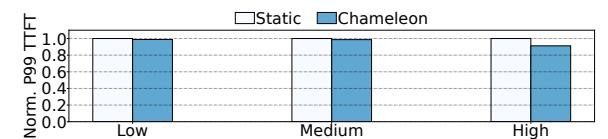

Figure 22: P99 TTFT latency for *Chameleon* normalized to a static scheme for different loads.

<span id="page-11-3"></span>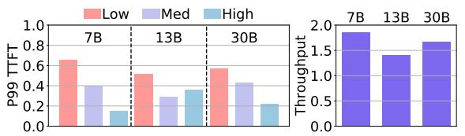

Figure 23: Normalized P99 TTFT latency (left) and throughput (right) of *Chameleon* over *S-LoRA* with different LLMs (Llama-7B, 13B, and 30B) and loads (Low, Medium, and High).

<span id="page-11-4"></span>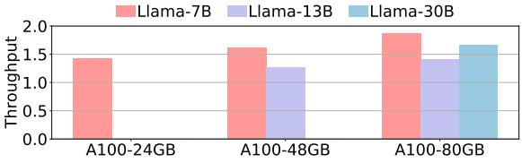

Figure 24: Normalized throughput of *Chameleon* over *S-LoRA* with different GPU memory sizes (24GB, 48GB, and 80GB) and LLMs sizes (Llama-7B, 13B, and 30B).

requests, sets the number of queues to 4, sets their ranges equally, and assigns the number of resource tokens to each queue equally. We call the system *Static*. Figure 22 shows the normalized P99 TTFT latency for *Static* and *Chameleon*. We see that, for low and medium load, the two configurations perform similarly. For high load, *Chameleon*'s design reduces the TTFT latency by 10%.

#### <span id="page-11-5"></span>5.5 Scalability Analysis

To assess the scalability of Chameleon, we run experiments with larger models (Llama-7B, Llama-13B, and Llama-30B) and with different memory capacities (24GB, 48GB, and 80GB). In this section, we run the experiments on an A100 NVIDIA GPU that, by default, has 80GB of memory. Given the available memory space, we use 500, 100, and 10 different adapters in the experiments with 7B, 13B, and 30B parameter models, respectively.

**1. Scalability with LLM size.** In this section, we increase the size of the base LLM model and the load in the system. Figure 23-left shows the P99 TTFT latency of *Chameleon* for Llama-7B, 13B, and 30B, and for low, medium, and high loads. The latency for a given model and load is normalized to *S-LoRA*'s for the same model and load. We see that *Chameleon* always has a substantially lower TTFT latency than *S-LoRA*. Overall, averaged across all loads, *Chameleon* reduces the P99 TTFT latency over *S-LoRA* by 60.0%, 61.3%, and 59.3% for the Llama-7B, Llama-13B, and Llama-30B models, respectively.

Figure 23-right shows the throughout of *Chameleon* normalized to that of *S-LoRA* for different LLM sizes. We see that *Chameleon* improves the throughout by 1.86×, 1.41×, and 1.67× for the Llama-7B, Llama-13B, and Llama-30B models, respectively.

**2. Scalability with GPU memory size.** In this section, we increase the GPU memory size in an A100 GPU. Figure 24 shows the normalized throughput of *Chameleon* over *S-LoRA* as we increase

<span id="page-12-0"></span>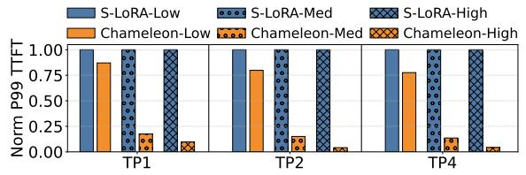

Figure 25: Normalized P99 TTFT latency for *Chameleon* and *S-LoRA* with different levels of tensor parallelism (TP1, TP2, and TP4), and request load (Low, Medium, and High).

the GPU memory size (24GB, 48GB, and 80GB) and the LLM size (Llama-7B, 13B, and 30B). Llama-30B fits only in 80GB of memory, Llama-13B fits in 48GB and 80GB of memory, and Llama-7B fits in all memory configurations. We see that *Chameleon* is more effective at increasing the throughput over *S-LoRA* as the amount of GPU memory increases. This is because a larger memory creates more space for adapter caching. For example, *Chameleon* improves the throughput of Llama-7B over *S-LoRA* by 1.4×, 1.6×, and 1.9× with 24GB, 48GB, and 80GB of GPU memory, respectively.

**3. Scalability with GPU compute capability.** This section compares the throughput improvements of *Chameleon* running on different hardware platforms with the same memory capacity. We consider an A40 GPU with 48GB of memory and 100 adapters, and an A100 GPU with 48GB of memory and 500 adapters. The first platform is discussed in Section 5.2.2 and Figure 11. *Chameleon* is shown to improve the throughput over *S-LoRA* by 1.5×. The second platform is discussed in Section 5.5.2. As shown in the second bar of Figure 24, *Chameleon* improves the throughput over *S-LoRA* by 1.6×. Therefore, *Chameleon*'s improvement in throughput over *S-LoRA* increases with the more powerful GPU, even with more adapters.

## 5.6 Multi-GPU Experiments

Finally, we evaluate *Chameleon* in a multi-GPU environment. We use the A100 server with 4 GPUs and employ tensor parallelism (TP) with 2 or 4 GPUs. We examine Low, Medium, and High request loads. In this setup, the base LLaMA-7B model and the adapters are partitioned across the GPUs along tensor dimensions. *Chameleon's* caching and scheduling mechanisms operate as in the single-GPU case. The cache is distributed across the GPUs, storing partitions of adapters, while scheduling continues to treat all GPUs as a single execution engine. No changes are made to the caching or scheduling policies to accommodate the multi-GPU setup.

Figure 25 compares the P99 TTFT latencies of *Chameleon* and *S-LoRA* for TP1, TP2, and TP4, and different request loads. The bars are normalized to *S-LoRA* for the specific level of parallelism and load. We see that *Chameleon* reduces the TTFT latency across all parallelism and load levels. The reduction widens with increasing parallelism. This is because, with more GPUs, the cost of loading adapters onto all participating GPUs becomes a bigger bottleneck in *S-LoRA*. *Chameleon*'s ability to cache and reuse adapter fragments across GPUs helps it avoid this overhead and scale more efficiently. This effect gets accentuated at higher loads. Overall, the gains of *Chameleon* are substantial: for TP4 and High load, *Chameleon* reduces the P99 TTFT latency by 95.8% over *S-LoRA*.

#### 6 Related Work

**LLM Inference Optimizations.** Many works proposed hardware [6, 16, 19, 22, 23, 41, 44, 45, 62–64, 69], algorithm [9, 14, 18] and

system-level [1, 20, 31, 32, 61] optimizations for performance and energy-efficiency [40, 52, 53] of LLM inference systems. These works consider LLMs with only a base model and do not optimize for a multi-adapter LLM inference environment. Chameleon is orthogonal to such techniques and can be combined with them.

LLM Inference with Parameter-Efficient Fine Tuning. Since the adoption of parameter-efficient fine tuning techniques [17, 24, 27, 58], researchers have been working on optimizing the system stack for efficient LLM inference in multi-adapter environments [4, 25, 49, 60, 68]. S-LoRA [49] and Punica [4] decouple the base model from task-specific adapters and fetch the required adapters on the fly from the host to the GPU memory. dLoRA [60] dynamically merges and unmerges adapters with the base model based on the current system state. In the paper, we quantitatively compare Chameleon to S-LoRA as the state-of-the-art baseline.

LLM Inference Scheduling. Many works explored scheduling policies for LLM inference serving [11, 39, 46, 50, 54, 59, 61]. µServe [46] and Learning to Rank [11] reduce the HoL blocking effects via SJF scheduling. We quantitatively compare to µServe. Based on input and output request lengths, ExeGPT [39] and DynamoLLM [53] allocate resources (batch size and model parallelism) and schedule the requests for minimal cost and energy consumption, respectively. Llumnix [54] reschedules the requests across worker replicas to improve load balance. These works focus on scheduling LLM inference requests in a multi-node environment, while using conventional iteration-level scheduling [61] within a node. Chameleon redesigns the scheduling policy within a node, and can be combined with cluster-level schedulers.

General-Purpose Workload Scheduling. Size-Interval Task Assignment (SITA) [7, 15] addresses head-of-line blocking by providing an "express-lane" for short tasks. Q-Zilla [35] leverages this idea and proposes a Server-Queue Decoupled Size-Interval Task Assignment for highly diverse microservice invocations. Chameleon applies the algorithm to a new domain: multi-adapter LLM inference serving. Moreover, SITA assumes perfect knowledge of task size, while Q-Zilla relies on request preemption. On the other hand, Chameleon uses a predictor for a request's output length (which is unknown ahead of time), and does not use preemption due to its high cost in LLM inference environments [20, 46, 59].

#### 7 Conclusion

This paper presented Chameleon, an efficient LLM inference serving system for many-adapter environments. Chameleon introduces two new ideas: adapter caching and adapter-aware request scheduling. Caching minimizes the overhead of loading the adapter weights on the request's critical path, while scheduling alleviates head-of-line blocking and starvation for requests with highly-diverse execution times. Under high loads, Chameleon reduces the P99 TTFT latency by 80.7% and the P50 TTFT latency by 48.1% over a state-of-the-art-baseline, while improving the throughput by 1.5×.

#### Acknowledgments

This work was supported by NSF under grants CCF 2107470 and CCF 2316233; by ACE, one of the seven centers in JUMP 2.0, a Semiconductor Research Corporation (SRC) program sponsored by DARPA; by the IBM-Illinois Discovery Accelerator Institute; and by an Amazon Fellowship funded by the UIUC AICE Center.

