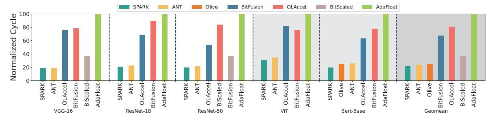
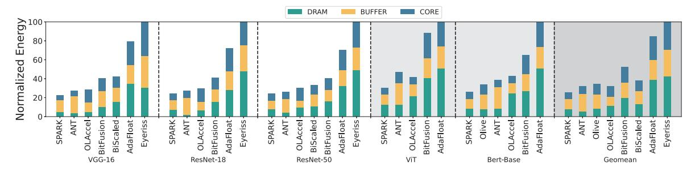

# *B. Accuracy Results*

For quantized DNN models, we utilize the SPARK encoding described in Section III to reduce the bit length of primitive data types with minimal accuracy loss. From the results in Table III, we observe that almost 4-bit SPARK achieves nearly original accuracy for commonly used vision and language models. On the ImageNet dataset, SPARK exhibits an average accuracy loss of approximately 0.1% against the original FP32 model. Additionally, for attention-based models, SPARK achieves better accuracy (+0.6% accuracy) compared to the original models.

We then compare the accuracy of SPARK against the prior quantization works without finetuning. Table IV shows the 6-bit quantization without finetuning results for ANT and BiScaled, and 5-bit encoding without finetuning for SPARK. This is because ANT and BiScaled achieve speedup with 6-bit is at the cost of about 1% accuracy loss for benchmark, leading to an unacceptable loss of precision if ANT and BiScaled drop to 5-bit. We find that SPARK with 5 bits offers much better accuracy than ANT and BiScaled with 6-bit because SPARK can take advantage of the bit sparsity that naturally appear among the quantized values. As the most values tend to be small and few are large, there are massive sparsity exists in the most significant bits, even on the quantized values.

We also compare the accuracy of SPARK against the prior quantization works on the attention-based model. The results in Table V show the accuracy loss for prior schemes on BERT is around 1% on the presented datasets. We find that SPARK offers much better accuracy with a fewer bitwidth (i.e., 4 bit) than the quantization schemes (e.g., OS, ANT and Olive) because SPARK can exploit intra-value adaptivity with bit sparsity domains, even for quantized values.

To summarize, our SPARK encoding framework pushes the limit of 4-bit quantization to a new state-of-the-art, as it is able to achieve nearly original accuracy for the commonly used models including VGG, ResNet, BERT and VIT on most datasets. Moreover, SPARK provides state-of-the-art mixedaccuracy results on these CNN-based and attention-based models without finetuning. This is because SPARK is essentially a encoding mechanism that aims to unleash the potential of

Fig. 11. Comparison of the normalized latency in different designs.

Fig. 12. Comparison of the normalized energy in different designs.

bit sparsity naturally occurring in the quantized parameter by utilizing efficient coding and decoding. It is worth noting that the prior compression techniques used to reduce the number of data can be applied to SPARK.

#### C. Performance, Energy and Area

Performance. Figure 11 shows the normalized total execution cycles on different accelerators for the six networks. SPARK has the most significant advantage in terms of performance improvement. ANT and OLAccel performs poorly on most models due to the relatively complex coding and decoding mechanisms dealing with different data formats. OliVe, although further optimized for decoding, has a complex encoding process as well as a restricted percentage of outlier pairs, resulting in inferior speedups to our proposed SPARK. Meanwhile, the performance improvement of SPARK is better on attention-based models, increasing with the number of model parameters. On average, SPARK achieves 4.65x, 3.76x and 1.12x speedup value over AdaFloat, OLAccel and ANT, respectively. Specifically, regarding the CNN-based model ResNet-50, our SPARK can achieve up to 80.1% performance improvement because SPARK mostly uses INT4 MACs for insensitive regions with only a limited number of INT8 MACs

TABLE V
ACCURACY LOSS (%) AND BIT WIDTH COMPARISON FOR BERT ON SST-2

DATASET. OS IS OUTLIER SUPPRESSION FOR SHORT.

| Model          | Q8BERT | OS   | Olive | ANT  | SPARK |
|----------------|--------|------|-------|------|-------|
| Acc. loss      | 1.1    | 1.49 | 0.92  | 2.87 | 0.34  |
| Avg. bit-width | 8      | 6    | 4     | 4    | 4.31  |

for significant values. Compared to AdaFloat, since it applies dedicate INT16 MACs for the first layer and separate INT4 MACs for the rest layers, SPARK can achieve 76.3% performance improvement thanks to the larger number of PEs under the same area budget in our scheme. Note that the speedup brought by OLAccel is at the cost of about 5% accuracy loss for ImageNet. For the attention-based model ViT, SPARK also provides 3.3x and 1.16x speedups compared to AdaFloat and ANT, which is brought about by the efficient codec mechanism and parameter transmission.

Energy. Figure 12 compares the normalized energy consumption of different designs for five networks, decomposed into DRAM, global buffer, and processing cores (Core). SPARK shows the lowest energy consumption for both CNN-based and attention-based models. Specifically, for ResNet-50, SPARK consumes 74.7%, 51.5%, 21.2%, 33.7%, 70.0%, and 21.0% less energy compared to Eyeriss, BitFusion, OLAccel, BiScaled, AdaFloat, and ANT, respectively. For ViT, which has a larger parameter size, SPARK consumes 69.9% and 36.3% less energy than AdaFloat and ANT, respectively. This is attributed to the challenge of compressing attention-based models through quantization and pruning. Nevertheless,

TABLE VI Area breakdown for PE array and devices SPARK needed.

| Component | Number | Area(mm 2 ) | Area Ratio(%) |
|-----------|--------|------------------------|---------------|
| Decoder   | 128    | 0.000822               | 0.251         |
| Encoder   | 64     | 0.000856               | 0.261         |
| 4-bit PE  | 4096   | 0.326                  | 99.49         |

TABLE VII THE CORE'S CONFIGURATION AND AREA BREAKDOWN OF SPARK AND OTHER WORK UNDER 28NM PROCESS.

|              | Core                        |        |           |  |  |
|--------------|-----------------------------|--------|-----------|--|--|
| Architecture | Component                   | Number | Area(mm2) |  |  |
|              | 4-bit Decoder(6.42μm2)      | 128    |           |  |  |
| SPARK        | 4-bit PE(79.57 μm2)         | 4096   | 0.327     |  |  |
|              | 4-bit Decoder(60.29μm2 )    | 128    |           |  |  |
| Olive        | 2) 8-bit Decoder(80.18μm | 64     | 0.338     |  |  |
|              | 4-bit PE(79.57 μm2)         | 4096   |           |  |  |
|              | Decoder(4.9μm2)             | 128    |           |  |  |
| ANT          | 4-bit PE(79.57 μm2)         | 4096   | 0.327     |  |  |
| BitFusion    | 4-bit PE                    | 4096   | 0.326     |  |  |
| OLAccel      | 4-bit & 8-bit PE            | 1152   | 0.309     |  |  |
| BiScaled     | 6-bit BPE                   | 2560   | 0.328     |  |  |
| AdaFloat     | 8-bit PE                    | 896    | 0.327     |  |  |
| Eyeriss      | 16-bit PE                   | 168    | 0.309     |  |  |

SPARK maximizes the use of bit sparsity among quantized values, efficiently conducting the majority of computations in the INT4 mode.

The energy reduction against Eyeriss and BitFusion mainly results from the reduced precision on PEs and narrower bitwidth data transferred between DRAM and the global buffer. While OLAccel and Olive consume less energy than BitFusion due to more 4-bit values, it requires an additional outlier controller with significant overhead to manage computation between normal values and outliers. Furthermore, SPARK requires fewer buffer accesses, reduced data transfer, and simpler decoding for output activations and weights compared to ANT. These advantages contribute to its superior energy efficiency across various neural network models.

Area. Table VI shows the area breakdown of SPARKbased systolic array architecture under 28 *nm* process. In this scenario, the 4-bit decoders and 4-bit encoders introduce about 0.25% and 0.26% overhead of the core area, respectively, which is inconsiderable compared to the area of PEs in the array. Considering on-chip memory structures, the overall area overhead would be even smaller.

In addition, we also scale other accelerators to 28 *nm* and compare the accelerator area breakdown in Table VII. Note that we implement all accelerators with a similar area size. We also find SPARK has the lowest area overhead. The small area overhead of our SPARK directly benefits from the carefullydesigned SPARK encoding and decoding.

