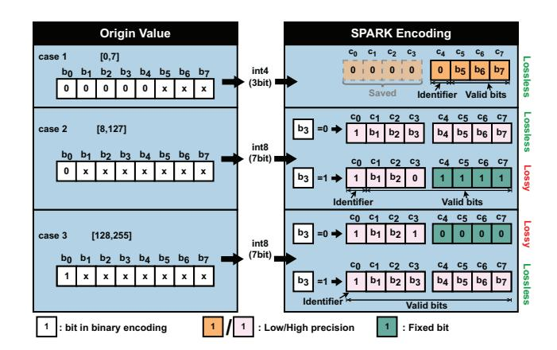
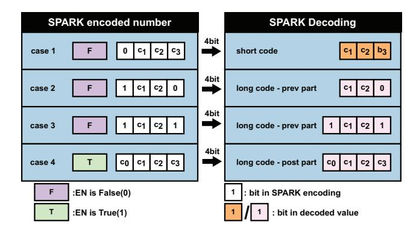

# C. Motivation

Quantization is essential for reducing the bitwidth of data in a neural network model. These quantized values can be categorized into lower-order parts (ranging from 0 to 15) and higher-order parts (ranging from 16 to 255). After examining the distribution of neural network weights, it is widely

Fig. 2. The quantized network accuracy and corresponding short code percent. When we use INT8 for these common used network, we can find that the loss of accuracy is generally no more than 2%, and has more than 40% of the values can be converted to short codes.

accepted that a long-tail effect is present, with more weights clustered around the center of the distribution, exhibiting a normal distribution shape [19]. This characteristic persists even after quantization, as demonstrated by the quantified weight distribution of neural networks like ResNet-50 and BERT, where the majority of the data belongs to the central part of the distribution. Interestingly, the observation reveals that high-order parts of the quantized values only account for a small percentage, while low-order ones dominate the entire set of parameters. This finding presents a new opportunity to further exploit the potential of quantized models to improve inference efficiency.

However, previous works have limitations in the applicability of their proposed compression-based architectures. Thus, there is a need for a more hardware-friendly and broadly applicable decoding/encoding method that aligns with the data representation of the parameters. In response to this demand, we propose the SPARK based on the variable-length encoding that leverages the dominance of low-order part among quantized values, leading to align memory accesses and is also compatible with existing accelerators. SPARK pushes the boundaries of quantized model efficiency, unlocking new possibilities for accelerating resource-efficient model inference.

#### III. EFFICIENT CODEC DATA FORMAT

In this section, we introduce our variable-length encoding method, which efficiently distinguishes values while maintaining global alignment. Quantized values in the range of [0,7] are represented using 4 bits, and values beyond [8,255] use 8 bits, maximizing numerical representation space utilization. Additionally, we propose an adaptive accuracy compensation mechanism based on this encoding to counter information loss during coding. This optimized approach enhances efficiency and accuracy in neural network computations.

#### A. Analysis of neural network coding

We visualize in Figure 2 to demonstrate the range percentage of the numerical representations in the neural network models (both the CNN-based model and the attention-based model) after INT8 quantization. The quantization process involves layer-wise INT8 quantization, with quantized values categorized into two intervals: [0, 7] and [8, 255]. These intervals are represented by blue and orange bars, respectively,

in the figure. The folded line in the graph indicates the accuracy loss of the model after INT8 quantization.

An evident observation reveals that approximately 80% of the parameters can be represented by INT4, with only a few requiring INT8 coverage. However, directly quantizing the model to a 4-bit data type poses challenges and results in a substantial accuracy loss (>2%), particularly for attention-based models (over >5%). Therefore, this observation suggests that encoding parameters based on INT8 quantization, while utilizing a narrow range of data representations, can significantly improve storage efficiency while mitigating the accuracy loss associated with direct 4-bit representation.

In summary, our analysis indicates that most of the quantized values in the parameters are in the lower quantization range, but still fill up a uniform data representation of the quantization bit-width due to storage alignment, so we choose the most appropriate data representation to accommodate the values. This motivates us to design hardware-friendly variable-length encoding mechanisms that provide aligned data representations to accelerate the model. In the next section, we present the variable-length encoding design.

## B. Variable-Length Encoding

Main idea. In Section III-A, we observed that small values in a tensor do not require high precision. Therefore, within a quantized model, if we can represent these small values with shorter bitwidth, we can effectively reduce storage and transfer overhead. DNN parameters are Gaussian distributed, with a concentration of major portions in the middle, typically having small values. If we use a fixed-length data type for all elements in the tensor, the Most Significant Bits (MSB) of large values become highly sparse, wasting bit length.

To address this and exploit intra-tensor adaptivity, we introduce a new primitive data type called **SPARK**. SPARK enables scalable and precision-aware coding, tailored to the distribution of parameters. Unlike a naive approach that divides the value range into intervals and assigns fewer bits to intervals with small or large values, our approach starts with a fixed-length and allocates fewer bits for middle-range values (as they do not require high precision) while allocating more bits for large values to preserve their precision.

To mark the boundary between the high-precision and low-precision field, we use the most significant bit as the identifier. While other strategies exist for separating the exponent and mantissa fields, this encoding has the critical advantage of simplicity: the decoder for this encoding only requires a simple leading zero detector as we would show later.

Accuracy Compensation Mechanism. Different from the general compression methods that require to perform the finetuning in the training loop to recover the accuracy loss, SPARK minimizes the information loss through an encoding compensation mechanism. As such, SPARK needs an encoding mechanism to convert the original quantized data, such as INT8, to the low precision SPARK. The software can employ this encoding mechanism to mimic the SPARK behavior without finetuning. Meanwhile, as we target both weight

Fig. 3. Encoding rules of SPARK, which shows different coding rules for different ranges of original values.

and activation encoding, the processing needs to be done dynamically during inference, which requires a lightweight and hardware-efficient encoding mechanism.

Figure 3 details the hardware-efficient SPARK encoding mechanism for each tensor element. SPARK, which maximizes the utilization of the encoding length for information representation by wrapping 1-bit identifiers with numerical information.

As an illustration, consider a model subjected to 8-bit unsigned quantization. For the original 8-bit value  $(b_0, b_1, \ldots, b_7)$ , if it has 0-3 valid bits (i.e., non-zero bits), we can directly encode it to a low-precision allocation without any information loss  $(c_4, c_5, c_6, c_7)$ , where the identifier  $c_4 = 0$  (Case 1 in Figure 3). For the original 8-bit value with 4-8 valid bits, which requires to encode it as a high precision allocation  $(c_0, c_1, \ldots, c_7)$  with  $c_0 = 1$ , we use the first bit  $b_0$  and the fourth bit  $b_3$  as the check bits, and take the XOR result of both as the check result. If the check result equal to 0, the encoded value does not need to be rounded. If the check result is 1, the encoded value needs to be rounded up, with no more than error of 16. As parameters are quantized to INT8 whose range is up to 255, this behavior leads to fewer encoding error ( $\leq 16$ ).

According to SPARK encoding, for large values, identifier  $c_0$  is set to 1, and for small values identifier  $c_0$  is equal to 0. For large values to be encoded, the identifier is not considered as a valid bit, that is, it does not contain numerical information. As such, we design the following rule: 1) If the original value is in the range of [8,127] with the 4-7 valid bits, the identifier is not regarded as the valid bit; 2) If the original value is within the range of [128,255] with up to 8 valid bits, the identifier should be regarded as a valid bit for numerical representation. To be specific, for the quantized data has value range of [8,127] (Case 2 in Figure 3), if  $b_0 = 0$  and  $b_3 = 0$ , then we directly store the original value in  $(c_1, \ldots, c_7)$  and set identifier to 1 in  $c_0$ , leading to no information loss. if  $b_0 = 0$  and  $b_3 = 1$ , then we set  $b_3$  to 0 stored in  $c_3$  and  $(b_4, \ldots, b_7)$  to 1111 stored in  $(c_4, \ldots, c_7)$  to minimize the encoding error. Note that after the

TABLE II
THE VALUE TABLE OF SPARK ENCODING. "x" is 0/1.

| Bits      | SPARK code | Value in Decimal                                                      |   | Error |
|-----------|------------|-----------------------------------------------------------------------|---|-------|
| 0xxx      | 0xxx       | [0, 7]                                                                |   | ×     |
| 0xx0 xxxx | 1xx0 xxxx  | $[8,15] \cup [32,47] \cup [64,79] \cup [96,111]$                      | Ī | ×     |
| 0xx1xxxx  | 1xx0 1111  | 15,47,79,111                                                          | Ī | ✓     |
| 1xx0xxxx  | 1xx1 0000  | 144,176,208,240                                                       | T | ✓     |
| 1xx1xxxx  | 1xx1 xxxx  | $ \mid \ [144, 159] \cup [176, 191] \cup [208, 223] \cup [240, 255] $ | ī | ×     |

above encoding process, the original value  $18_{10}$ , whose binary code is  $00010010_2$  is now rounded to  $15_{10}$ , with  $10001111_2$  in SPARK representation.

For the quantized data has value range of [128, 255] (Case 3 in Figure 3), if  $b_0 = 1$  and  $b_3 = 1$ , then we directly store the original value in  $(c_0, \ldots, c_7)$  without information loss. if  $b_0 = 1$  and  $b_3 = 0$ , then we set  $b_3$  to 1 stored in  $c_3$  and  $(b_4, \ldots, b_7)$  to 0000 stored in  $(c_4, \ldots, c_7)$ . For example, for 8-bit unsigned original value  $170_{10}$ , it has binary code  $10101010_2$ , which is now rounded to  $10110000_2(176_{10})$  in SPARK representation.

The SPARK encoding mechanism is an element-wise function that can be efficiently implemented in both hardware and software. With a model quantized to 8-bit, the basic bit length remains constant at 4. The quantization of weights can be executed offline, while activation quantization requires hardware support. Owing to the simplicity of our encoding mechanism, we can implement it in the hardware by augmenting the hardware's element-wise computation unit, such as the activation unit. Importantly, our SPARK encoding allows for mixed-precision within a tensor, but the tensor is stored in a fixed-length format (i.e., basic bit length). Consequently, the memory accesses of SPARK are aligned and hence efficient.

An Example. To provide a concrete understanding of our design, we refer to the eight-bit data representation example in Figure 3. Without loss of generality, we assume the case of unsigned values that have been scaled with the per-layer granularity of the weights (activations), identical to [20], [32].

Figure 3 shows a eight-bit unsigned binary number using our SPARK encoding, which can represent 8 distinctive binary values with the maximum value of 255. We divide this value range to two intervals corresponding into the high precision and low precision, and highlight the low precision in orange color. The last three bits have the encoded low precision fields of range [0,7]. The last seven bits have the encoded high precision fields of range [0,128]. This bit length allocation scheme is adaptive to the importance of the value, as the small values have the high sparsity in most significant bits and thus allocate the low precisions.

Table II shows the value table for the above 8-bit unsigned code  $(c_0,\ldots,c_7)$ . Each row refers to the divided interval. For example, the SPARK encoded number 10110001 (the large value) with 8 bits, where the identifier is 1 and the value is  $0110001_2$ . As such, its decimal value is  $177_{10}$ . On the other hand, SPARK encode the the small value with the binary encoding of 0101 by 4 bits, where the identifier is 0 and the value is  $101_2$ . As such, its decimal value is  $5_{10}$ . In different

Fig. 4. Lossless and lossy percentage after SPARK encoding. For both traditional CNNs (ResNet,VGG) and Attention-based models (Bert, Bart, GPT-2), more than 95% data is lossless when using SPARK encoding.

cases, depending on the identifier, SPARK encodes the original value differently.

As illustrated in Figure 3, the bit length is segmented into two intervals based on the value magnitude. In our SPARK, the bit representation of low-precision data can be effectively reused for that of high-precision data, guided by the identifier. Additionally, as indicated in Table II, numbers within the ranges [0,15] and  $[32i,32i+15], i \in (1,2,\ldots,7)$  can be fully accommodated within SPARK's data representation. Only a minority of values produces errors, which statistically constitute less than 5% (as shown in Figure 4). This allocation strategy matches closely with the Gaussian-like distribution, ensuring that values more concentrated in the middle range also receive more complete encoding, consequently leading to fewer accumulated errors.

#### C. Hardware-friendly Decoding

**Main Idea.** After the encoding process described earlier, the original values are now represented with condensed bit lengths. To support SPARK decoding, we have developed a hardware-friendly decoding mechanism that transforms these encoded numbers to their decimal forms. This transformation makes the data usable for direct calculations.

Figure 5 illustrates the decoding rules of SPARK. We utilize 4 bits for fixed-length input. Initially, the enable signal is set to 0, indicating whether the numerical value is of high precision or low precision. When the identifier is 0, it signifies that the numerical value is a low-precision representation, and it is directly outputted. Meanwhile, the enable signal remains unchanged. Conversely, when the identifier is 1, it indicates a high-precision representation, and the enable signal is set to 1. We then examine the 4th bit  $(c_3)$ . If  $c_3$  equals 0, we output the last three bits. Conversely, if  $c_3$  equals 1, we include the identifier bit as part of the result. Since the enable signal is 1, the subsequent 4 bits of data are directly exported as part of the high-precision representation, and the enable signal is reset to 0.

**Example Decoding.** Consider two SPARK numbers: 11010010 and 01000011. The former is decoded as 21010,

Fig. 5. Decoding rules of SPARK, where we use the input and enable signal to decode to get the result.

where the preceding high-precision representation is  $1101_2$  (with the 4th bit as 1), and the subsequent high-precision representation is  $0010_2$ . Thus, 11010010 corresponds to  $1101_2 << 4+0010_2 = 210_{10}$ . Similarly, the latter, 01000011, represents two distinct numbers: 4 and 3. In this case, the preceding low-precision representation is  $0100_2$ , and the subsequent low-precision representation is  $0011_2$ . Therefore, 01000011 translates to two numbers, 4 and 3, making it suitable for subsequent calculations. Section IV-B provides more decoder details

