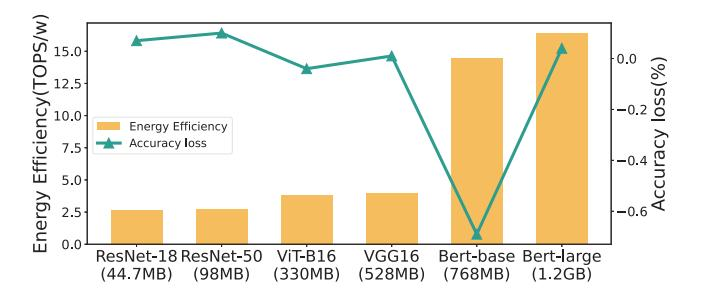

# *D. SPARK Optimization Analysis*

In this subsection, we evaluate the effectiveness of the optimization settings in SPARK, as discussed in Section III. We focus on analyzing the impact of diverse SPARK settings on the accuracy of DNN models. Figure 13 presents the results, showing the significance of the compensation mechanism (CM) in restoring accuracy to its original values before encoding. Additionally, finetuning plays a crucial role

Fig. 13. Accuracy Loss with different optimization settings. CM, w/-FT and w/o-FT are accuracy compensation mechanism, with finetuning and without finetuning for short, respectively.

in further increasing the proportion of 4-bit types within the models. For our attention-based models, we consider representative examples such as BERT and ViT, which exhibit similar trends to other Transformer models. These models have complex parameter distributions, and directly using a narrow bit length representation (e.g., quantization) for their parameters leads to reduced model accuracy. However, SPARK encoding effectively eliminates sparsity occupying invalid bit lengths that naturally occur in quantized values, resulting in a balanced ratio of various data types. Analyzing the type ratio, we find that attention-based models are more sensitive to the bit length of the data representation compared to CNN models. Nevertheless, after applying SPARK encoding, both CNN and attention models show a similar utilization proportion of 4 bit types. This observation suggests that SPARK effectively leverages bit sparsity within attention models.

## *E. Scalability Analysis*

In this subsection, we study how the model size affect the performance of our SPARK and the potential benefits of combining existing model compression techniques with SPARK.

Sensitivity Analysis. In this evaluation, we aim to explore the relationship between energy efficiency and various model sizes, shedding light on the impact of different model sizes on SPARK. Our findings are summarized in Figure 14, which illustrates how the energy efficiency of models encoded using SPARK increases with varying model sizes. Our analysis encompasses a range of representative examples, including attention-based models like BERT, known for their substantial computational demands. Interestingly, the SPARK encoding architecture directly addresses this computational overhead by processing network parameters to reduce redundant bit-length footprints in the model.

Notably, this encoding approach's benefits extend across models with natural sparsity of high significant bits, making SPARK equally effective in enhancing energy efficiency for models of diverse sizes. Furthermore, our results demonstrate that the improvement in energy efficiency is particularly prominent when applied to models with large-scale parameters, which inherently exhibit higher levels of bit sparsity. In summary, our analysis highlights SPARK's scalability and its consistent ability to enhance energy efficiency. This is particularly noteworthy for attention-based models with larger parameter sizes, where SPARK's benefits truly shine.

Fig. 14. Energy efficiency and accuracy with different model size.

Joint Optimization. SPARK leverages inherent bit-level redundancy in data representations without modifying the memory system, making it orthogonal to existing value-based compression techniques like pruning. Notably, SPARK can be seamlessly integrated with these methods to achieve joint optimization. As an illustration, we refer to the pruning technique known as Density-Bound Block (DBB) sparsity [26], [28], where we set the sparsity rate at 50% for all networks. The combined application of SPARK and pruning techniques is depicted in Figure 15. The results show that SPARK substantially reduces total execution cycles for the five networks, highlighting its compatibility with other compression techniques. Even when the model is compressed, SPARK consistently excels at compressing bit-level redundancy and effectively minimizing computational overhead.

Additionally, Ampere GPU's [31] compute data compression focuses on compressing zero values and similar bytes in DRAM and L2 cache, providing a lossless and general-purpose compression method that operates transparently alongside SPARK.

Fig. 15. Performance for different models with combination of density bound block (DBB) sparsity (50%) and SPARK.

## VI. RELATED WORKS

This section presents related works on DNN acceleration, sparse accelerators, and quantized accelerators.

a) DNN Acceleration: Researchers have proposed various hardware and software solutions to efficiently accelerate DNN models [36] [41]. On the hardware side, the efficient processing of DNNs on specialized devices has attracted sustained attention. These designs are termed DNN accelerators. Traditional DNN accelerators have focused on optimizing hardware architecture to align with the computational flow of DNNs, increase compute parallelism, and minimize memory accesses [14] [52]. For instance, the systolic array [18] utilized in TPUs and other spatial architectures exemplify such efforts. These designs enable localized data reuse within processing elements (PEs), reducing memory access overhead and improving computational efficiency for DNN computations.

On the software side, researchers have introduced several techniques to compress DNNs in recent years, with data quantization [49] [30] [21] and network sparsification [12] [47] [53] being prominent examples. Data quantization involves reducing the number of data bits to compress the original model, while network sparsification focuses on reducing the number of connections or neurons. Both data quantization and network sparsification offer distinct trade-offs in various aspects. The choice of technique depends on the specific application scenario, desired compression ratio, model accuracy requirements, and hardware usability.

- b) Sparse Accelerators: An interesting topic is to combine compression approach with hardware design bring the most benefits for hardware performance, which is usually called software-hardware codesign. For network sparsification, the index overhead and compute/access irregularity are the most challenging issues. Even though the structured sparsification can help, how to maintain accuracy also needs more efforts. To address this challenge, many techniques are proposed to support efficient sparsity exploitation [51] [8].
- c) Quantized Accelerators: The bit length required for data representation in DNN inference is typically  $\geq$  8-bit fixed-point, resulting in negligible accuracy loss. However, in the pursuit of ultra-high execution performance with some accuracy trade-offs, more aggressive low-bit quantization is explored in research, which is the focus of this paper. There are two types of quantized neural networks: fixed bit-width and variable bit-width. In the case of fixed-bitwidth, highprecision (8-bit) multipliers and adders can be easily replaced with low-bitwidth (4-bit) counterparts, while the overall architecture and data flow remain mostly unchanged from before quantization [4], [39]. For extremely low-bit quantization, such as binary/ternary data quantization, costly MAC operations can be implemented using simple XNOR and pop-count logic operations. However, these extremely low-bit quantization designs may not always achieve acceptable accuracy, particularly for large models requiring powerful expressive capabilities or attention-based models with more complex structures.

In the case of variable bitwidth, the motivation is to accommodate varied bitwidth requirements across regions and layers, instead of maintaining a consistent bitwidth throughout. Therefore, providing flexible architectural support for variable bitwidths becomes desirable. BitFusion [38] and DRQ [39]

can support different bitwidth via a spatial and temporal combination of low-bit PEs OLAccel [35] utilizes quantization with 4-bit and 16-bit MACs. ANT [11] are more aggressive and require heavy architectural modifications. Olive [10] is utlier-aware quantization accelerator designs. These designs mainly cater for general network pruning and data quantization. Consequently, their architectures struggle for peak performance because it is difficult to find a perfect fitted quantization algorithm.

In summary, the existing works in the field lack a close interaction between data representation, compression, and hardware, which we believe will be a significant trend for future DNN accelerators. To address this gap, we propose SPARK, which harnesses the inherent bit sparsity in already quantized values. Through efficient encoding and decoding mechanisms, SPARK respects model accuracy while enabling higher performance for accelerators.

