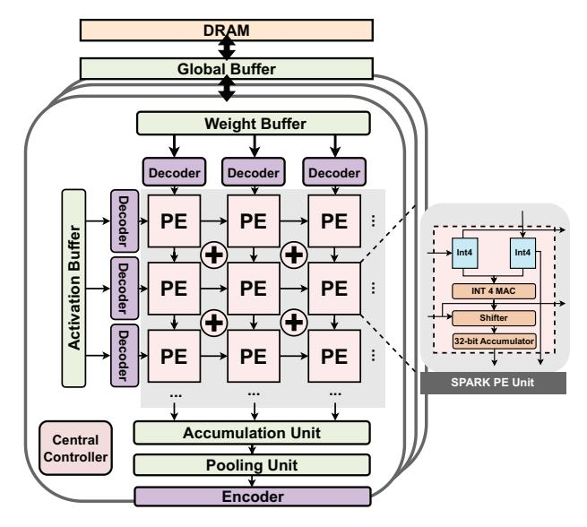
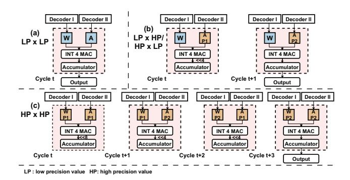

# IV. SPARK ARCHITECTURE

This section presents how to integrate SPARK in outputstationary systolic array architecture. We then present the hardware encoder and decoder for the aforementioned SPARK encoding/decoding mechanism. Such a integration enables the reduction of storage overhead while maintaining sustained neural network accuracy by preserving the bit length in lowprecision values. This approach proves to be efficient for quantized DNN parameters, which exhibit varying importance and distribution characteristics.

## A. Architecture Overview

We introduce the integration of the SPARK design into the systolic array architecture, illustrated in Figure 6. The SPARK architecture includes multiple processing element (PE) pages, communicating with memory through a global buffer. Each PE page consists of an input/weight buffer, a mixedprecision PE array, an accumulation unit, encoders/decoders, an output buffer, an activation and pooling unit, and associated control logic. Such a SPARK integrated architecture can be briefly described as follow. The global buffer stores SPARK encoded activations and weights. An im2col/pack engine in each PE page retrieves activations, transforms them, and packs them into activation buffers. It also handles weights, loading and aligning them in the array. A key part in each PE page is the decoder (Section IV-B), decoding operands before entering the systolic array. The PE array efficiently supports mixed-precision calculations (Section IV-C). Partial

Fig. 6. Overview of SPARK architecture.

sums accumulate in output buffers, accommodating variable kernel sizes. After activation and pooling, the outputs go to the encoder (Section IV-D), converting high-precision values to low-precision SPARK encoded numbers, reducing storage and transmission overhead for subsequent layers. Notably, no special hardware is required for off-chip memory accesses as SPARK encoded numbers are decoded before entering the systolic array. This design enhances performance and energy efficiency, which is critical for memory-bound neural network models. Integrating SPARK into the systolic array offers a hardware-efficient and energy-saving solution for neural network computations, advancing mixed-precision quantization and accelerating inference tasks.

#### B. Decoders

To achieve fast SPARK decoding, we designed a SPARK decoder, which is fairly simple to construct and can be easily embedded into existing accelerators. The SPARK decoder is simpler and more area-efficient than those used in other schemes, as it only requires multiplexers, OR gates, and NOT gates. These are well-known hardware components, all of which have lightweight circuits. As shown in Figure 7, the decoder reads in 4 bits and an enable signal per cycle, determining whether the input represents the post part of the

Fig. 7. The 4-bit decoder for SPARK format.

Fig. 9. Matrices A and B multiplication with mixed-precision (a). Adaptive dataflow in SPARK (b). The execution timing for the SPARK dataflow (c).

high-precision value according to the enable signal. When the enable signal is 1, it indicates that the input is the post part of the high-precision value. When the enable signal is 0, if  $c_0$  is 0, the input signifies a low-precision value and the decoder outputs data directly; when  $c_0$  is 1, the decoder assesses whether to include an identifier as numerical bit based on  $c_3$ , subsequently outputting either all four bits or the last three bits. The algorithm is shown in Equation 3. Note that we place the decoders along the borderlines, which can save most decoders. For example, if the PE array size is  $m \times n$ , we only need m+n decoders.

Decode number = 
$$\begin{cases} c_1 c_2 c_3, & ,EN \lor \neg c_0 \lor c_3 = 0 \\ c_0 c_1 c_2 c_3 & ,EN \lor \neg c_0 \lor c_3 = 1 \end{cases}$$
(3)

## C. Mixed-precision Support

In this work, we propose to couple our SPARK with the mixed-precision quantization to achieve the same accuracy of the original high-precision DNN models. According to many prior works, the 8-bit INT is sufficient to maintain the original model accuracy. We explain how our 4-bit Mixed-Precision PE (MPE) design can naturally support 8-bit INT PE.

a) Mixed-Precision PE: After decoding for high-precision and low-precision values, they are all transformed into PE array. To support the decoded mixed-precision computation, we need to add a shifter and an adder for the MAC (multiply and accumulation) unit. As shown in Figure 6 (right), the PE array consists of MPEs capable of mixed-precision computation. In SPARK architecture, the weights and activations will always be quantized into SPARK format, where weights are held into each PE in the array and activations are shifted right and the partial sums are shifted down to the neighboring MPEs every cycle during the MAC process. The leftmost column of MPEs accept new input values (i.e., activations) shifted from the line buffers for every clock cycle.

Fig. 8. PE unit design and calculation paradigm.

Figure 8 illustrates how to adapt the MPE in our variablespeed systolic array. There are two 8-bit registers W and Aholding a weight value and an activation value, respectively. A 16-bit register P store the partial result. In default, the PE is in INT4 mode, whose INT4 MAC is used for the multiplication of a 4-bit weight with a 4-bit activation (Figure 8(a)). On demand, the PE can switch to INT8 mode depending on the identifier generated in the previous SPARK decoding. To be specific, for the multiplication of a 4-bit value with a 8-bit value (Figure 8 (b)), in cycle t, it extracts the higher 4 bits of the high-precision value and the low-precision value from W and A, respectively. The result is then shifted left by 4 and stored into the P register. In cycle t+1, it extracts the lower 4 bits (L) of high-precision value and the higher 4 bits (H) of input value from W and A, respectively for another 4-bit MAC accumulated with the previous product. The result is written into the P register. The behavior in cycle t+2 and t+3 is similar with t and t+1.

*b) Mixed-Precision Dataflow:* Figure 9 depicts the utilization of four 4-bit MPEs to multiply two 8-bit INT numbers.

We fetch a number  $a_{0,1}$  from matrix A, which is then processed in parallel through multiplications with the corresponding row  $b_1$  from matrix B, containing four nonzeros:  $b_{1,0}$ ,  $b_{1,1}$ ,  $b_{1,2}$ , and  $b_{1,3}$ . The process begins by decoding the 8-bit number  $b_{1,0}$  into two numbers in our SPARK representation:  $b_{1,0}^0$  and  $b_{1,0}^1$ . Next, we perform four parallel multiplications for these four numbers, as illustrated in Figure 9 (b), each utilizing a 4-bit MPE. Finally, we sum the results of these four multiplications using accumulate PEs(APE). In summary, our MPE is well-suited for supporting mixed-precision DNN inference. In the subsequent evaluation, we demonstrate that the majority of parameters (up to 83%) can be represented with low precision, while only a fraction of parameters require high precision. This highlights the effectiveness of our approach in efficiently handling mixed-precision computations.

c) Execution Flow for Mixed-Precision: Also, our mixed-precision PE array can skillfully support variable-speed matrix multiplication, meeting the different requirements for low-precision and high-precision values. It works at full speed in INT4 mode, and switches to INT8 computation on demand by inserting stalls. We take four PEs  $PE_{00}$ ,  $PE_{01}$ ,  $PE_{02}$  and  $PE_{03}$  as an example, as seen from Figure 9(c). In the first cycle,  $PE_{00}$  receives the 4bit normally for computation. In the second cycle, since one of the inputs in  $PE_{00}$  is of high precision, it needs two cycles to complete the computation, while  $PE_{01}$  and  $PE_{02}$  continue to compute with low precision. Thus  $PE_{00}$  spends two cycles to complete the MAC computation and  $PE_{01}$  stalls one cycle to match the rate in the systolic array. Such a stall also needs in cycles 4 and 5. At cycle 6, the input to  $PE_{01}$  are both two high precision values, which means that it needs to perform a high precision computation that takes four cycles, so the remaining PEs need to stall for two cycles after completing low precision computation. In our example, the four PEs completed the computation of the eight original INT8s in at most 19 cycles, which illustrates the efficiency of our scheme.

#### D. Encoders

Meanwhile, we designed a SPARK encoder that can quickly encode 8-bit fixed-length codes into SPARK data representation. The encoder for SPARK format, which uses leading-zero detector (LZD), multiplexer and XOR gate, which are

Fig. 10. The encoder for SPARK format

well-known hardware components and both have lightweight implementations. As shown in the Figure 10, for a given 8-bit input, the encoder first inputs its first five bits b[0:4] into a simplified 5-bit leading zero detector and determines the first four bits of the code based on the result. When the leading zero detector outputs 0, which means the first five bits of the previous input are 0, then this input can be encoded as a low-precision value. In this case, we output the last four bits as the result of the code, and discard the first four bits, thus reducing the bit length. Conversely, when the detector yields an output of 1, the code is classified as a high-precision value. In this scenario, the output of the prev part has already been determined as  $c_0c_1c_2c_3=1b_1b_2b_0$ , in accordance with the encoding rules. The formula for the output of the first four bits is given in Equation 4.

And if  $b_0 = 1$ , the encoder needs to check whether the last four bits are rounded or not, which is determined by the result of the XOR between  $b_0$  and  $b_3$ . When the result is 0, the post part is equal to the last four bits of the input; and when the result is 1, the output is changed to a fixed output determined by  $b_3$ . We use the following Equation 5 to generate the the post part. After deciding on the output, the prev part is concatenated with the post part to get the final SPARK encoded number with mixed-precision.

Prev part = 
$$\begin{cases} b_4 b_5 b_6 b_7 & , LZD(b_0 b_1 b_2 b_3 b_4) = 0 \\ 1b_1 b_2 b_0 & , LZD(b_0 b_1 b_2 b_3 b_4) = 1 \end{cases}$$
(4)

Post part = 
$$\begin{cases} b_4 b_5 b_6 b_7 & , & b_0 \oplus b_3 = 0 \\ 1111 & , & b_0 \oplus b_3 = 1 \text{ and } b_3 = 1 \\ 0000 & , & b_0 \oplus b_3 = 1 \text{ and } b_3 = 0 \end{cases}$$
 (5)

