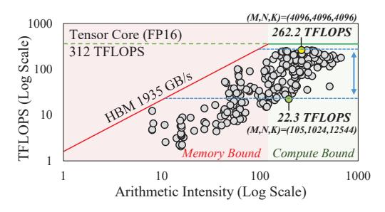
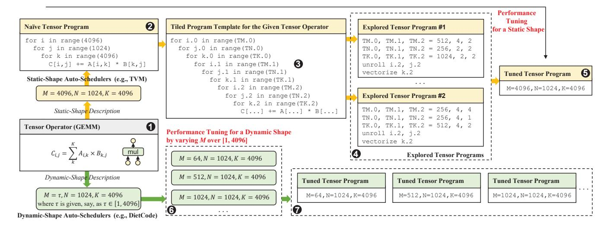
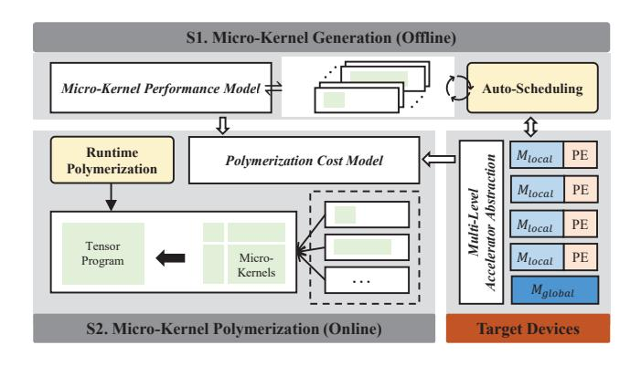
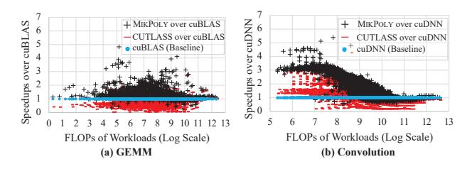

# **1 Introduction**

Deep Neural Networks (DNNs) have demonstrated remarkable success across various domains, such as computer vision [20, 25, 46] and natural language processing [5, 10, 56]. In these DNNs, tensor operators (e.g., convolution and matrix multiplication) play a crucial role, and their efficiency is paramount for powering intelligent applications. In addition to traditional static-shape neural networks, which involve tensor computations with fixed-shape input and output, dynamic-shape neural networks are gaining popularity in emerging intelligent applications to address more complex tasks. For instance, BERT [10], a state-of-the-art language model, uses variable input sizes based on the sequence length, leading to tensor operators with varying shapes. Introducing dynamic characteristics in tensor computations brings new challenges for performance optimization in libraries and compilers. Efficiently handling these dynamic computations is vital to unlock the full potential of advanced neural network architectures.

To support high-performance tensor computations, three representative approaches have been proposed:

- Vendor-Provided Hand-Crafted Libraries. Most vendors have provided highly-tuned implementations for neural network operators, e.g., oneDNN [22] on x86 CPUs and cuBLAS [44] on Nvidia GPUs. While a library routine typically includes several hand-crafted operator implementations specially optimized for widely-used shapes, prior studies [58] revealed that a carefully-designed specific operator implementation is hardly suitable for all the shapes, resulting in sub-optimal performance inevitably. For example, we observed that the GEMM routine provided by cuBLAS has significant performance variations for different tensor shapes (262.2 TFLOPS when (M, N, K) = (4096, 4096, 4096) vs. 22.3 TFLOPS when (M, N, K) = (105, 1024, 12544)), even if both shapes are compute-bound), as shown in Figure 1.
- Tensor Compilers for Static-Shape Operators. Most tensor compilers like TensorFlow XLA [29], TVM [7], and TC [55] optimize tensor operators by searching through loop tiling structures within a substantial search space to determine the optimal implementation for a given shape. Nonetheless, these auto-schedulers necessitate prior knowledge of the operator's shape during compilation. This limitation renders it infeasible to optimize tensor operators across all potential shapes in dynamic scenarios due to the high search cost within an extensive search space.
- Tensor Compilers for Dynamic-Shape Operators. Recently, several studies have explored dynamic-shape compilers [49, 65, 70]. One example, DietCode [65], enhances traditional auto-schedulers by refining shape-generic search spaces for optimal operator implementations. However, these dynamic-shape auto-schedulers still rely on predefined shape descriptions and offline code optimization.

Existing methods have utilized auto-schedulers that handle a range of shapes to generate a limited subset of optimized programs offline. However, these auto-schedulers cannot guarantee efficient or even correct execution for shapes outside the pre-defined range, limiting their usability in dynamic scenarios with frequent shape variations. Our approach entails the creation of a set of finely-tuned fixed-size microkernels, each of which represents a tiled loop nest responsible for executing a portion of a tensor operator. These microkernels are generated offline and are dynamically combined on the fly to produce optimized code for any tensor shape encountered during model execution. The key challenge lies in determining an efficient composing strategy and generating optimized code at a very low cost during model execution.

To address this challenge, we present MikPoly, a dynamic-shape tensor compiler founded on Micro-Kernel Polymerization for emerging accelerators handling dynamic-shape neural networks. MikPoly employs a two-stage process, guided by a precise cost model, to obtain an optimized tensor program for a dynamic-shape operator. It employs a program template with innermost *offline loops* (forming a



**Figure 1.** Performance of GEMM with different shapes on the NVIDIA A100 GPU (using cuBLAS).

micro-kernel template) and surrounding *online loops*. In the offline stage, it creates highly-optimized fixed-size micro-kernels (from the micro-kernel template) and develops corresponding performance models. In the online stage, MikPoly examines polymerization patterns to restructure online loops into tensor programs using parameterized micro-kernels. It then evaluates polymerization strategies by instantiating these parameterized micro-kernels with the optimized fixed-size ones obtained offline. MikPoly employs a precise yet lightweight cost model, considering computation, memory, and parallelism, to predict performance across diverse implementations with various polymerization strategies and patterns. This informs the selection of the most efficient final tensor program for the given operator.

This paper makes the following contributions:

- We propose a two-stage approach to generate an optimized tensor program for a dynamic-shape tensor operator on a multi-level accelerator abstraction. This approach decouples the underlying optimization problem into an offline stage, where a set of highly-optimized micro-kernels for some fixed shapes is created, and an online stage, where multiple micro-kernels are polymerized to obtain an optimized program for any known shape at runtime.
- We introduce a precise yet lightweight cost model that facilitates efficient online polymerization. During the offline stage, we model the performance of individual microkernels by concurrently considering computation and memory access behavior. In the online stage, we consider the performance of various program implementations for an operator with different polymerization strategies under various patterns, taking parallelism into account.
- We have implemented MikPoly, a dynamic-shape tensor compiler, and evaluated it on two representative accelerators, GPU Tensor Cores and Ascend NPUs. In the case of GEMM and convolution operators, MikPoly demonstrates average speedups of 1.29× (with a peak of 11.05×) and 1.70× (with a peak of 15.32×) compared to state-of-the-art vendor libraries on GPUs and NPUs, respectively.



Figure 2. Optimizing tensor programs for GEMM by existing static- and dynamic-shape tensor compilers.


Figure 3. Generating an optimized tensor program for GEMM by MikPoly, a two-stage dynamic-shape tensor compiler.

## 2 Background and Motivation

We start by explaining the importance of optimizing dynamicshape operators. We then review current solutions and introduce our approach using GEMM as an illustrative case.

#### 2.1 Dynamic-Shape Neural Networks

Traditional DNNs typically use static model structures, where the shapes of input and output tensors for each operator are fixed, known as static-shape neural networks [49]. However, real-world applications often exhibit dynamic behavior, such as sentences of varying lengths in language modeling, making static-shape neural networks insufficient. To address this limitation, dynamic-shape neural networks have been proposed to support more sophisticated real-world intelligent applications, and we discuss some of their representative scenarios below.

- (1) Dynamic Batch Sizes. The batch size is a crucial parameter in model training, impacting the accuracy of the error gradient estimation, as it represents the number of samples used in one iteration. Larger batch sizes generally lead to faster convergence and improved stability but come with increased computational resource usage [17]. To address this trade-off, researchers have conducted studies [9, 32] exploring dynamic-shape neural networks with dynamic batch sizes. This approach aims to enhance the training process by adapting the batch size during training, offering better optimization and performance for real-world applications.
- (2) Dynamic Image Resolution. In computer vision tasks, images often have varying tensor shapes due to different resolutions. Existing methods [19, 61] resize images to a fixed shape for static-shape DNNs, but this sacrifices original image information, making it challenging to detect small

objects in complex scenarios [6]. To address this, state-ofthe-art models like Faster R-CNN [16] use advanced pooling methods with dynamic-shape input tensors. These models effectively handle varying image shapes, enabling accurate object detection, even for small objects in complex scenes.

**(3) Dynamic Sequence Length.** Popular natural language processing applications, like BERT [10], handle dynamically changing tensor shapes due to varying input sentence lengths [2, 56]. One solution to support variable sequence lengths is to pad all sequences to a predefined maximum length, covering most cases [60]. Optimized padding policies have been proposed in further research [1, 12]. However, the padding approach [65] can result in resource waste when sequences are much smaller than the maximum length.

## **2.2 The State of the Art**

Automatic schedulers, such as TVM [7], have been developed to achieve high-performance tensor programs across different hardware. They utilize a cost model updated with actual hardware measurements to explore shape-specific search spaces, yielding efficient implementations. We illustrate this optimization process using static- and dynamic-shape tensor compilers using GEMM, as depicted in (❶) of Figure 2.

Let us delve into the operation of existing static-shape tensor compilers (❷ to ❺ in Figure 2). Consider GEMM, depicted in (❶), which represents a key operator in deep neural networks. Initially, a naive tensor program with a fixed shape (,,) = (4096, 1024, 4096) is represented by a three-dimensional nested loop (❷). However, this basic version is suboptimal. Leading static-shape tensor compilers like TVM [7] offer a tiled program template for GEMM (❸), using undetermined tile parameters (e.g., TM.0, TN.0, and TK.0). Static-shape tensor compilers engage in an autoscheduling process based on this template, exploring optimal tile sizes within an extensive search space. This process involves tuning various tiled tensor programs (❹). Ultimately, a fine-tuned tensor program (❺) tailored to the specific shape (,,) = (4096, 1024, 4096) is derived, delivering superior performance among the explored tensor program options.

Nonetheless, these static-shape tensor compilers often demand significant time (e.g., 0.33 CPU hours [52]) to generate efficient implementations for operators with predetermined shapes (from ❶ to ❺). This duration is reasonable within static scenarios, as the compilation is conducted offline, and the fine-tuned programs can be recurrently executed during runtime. In dynamic-shape situations, the compilation process is executed online during model execution. Consequently, the time-intensive method employed by static-shape tensor compilers is unsuitable for this context.

Let us explore how existing dynamic-shape tensor compilers [40, 65] work (❻ – ❼ in Figure 2). Consider GEMM in ❶ with a dynamic shape (,,) = (, 1024, 4096). Here, is a dynamic dimension, and its range is specified as [1, 4096]

by a parameter provided by the developer. To generate optimized implementations, developers can use auto-schedulers with a set of representative shapes. While a comprehensive set can enhance performance across various tensor shapes, it also incurs higher compilation costs. To tackle this challenge, DietCode [65] enhances the auto-scheduling process by generating a series of tuned tensor programs (❼), each tailored for a set of shapes instead of just one. During runtime, a suitable pre-compiled tensor program is selected based on the known tensor shape, mitigating costly compilation expenses. Nevertheless, DietCode mandates foreknowledge of the tensor shape range (e.g., ∈ [1, 4096] for ), limiting its scope. A similar limitation applies to Nimble [49].

Existing static- and dynamic-shape compilers optimize tensor operators for specific input ranges, leading to potential performance degradation or runtime errors for outof-range shapes as well as suboptimal performance for inrange shapes (as revealed in Section 5.2.3). To efficiently execute dynamic-shape deep neural networks, an effective mechanism is required to deliver high-performance tensor programs with arbitrary shapes.

#### **2.3 Our Solution**

MikPoly innovates the compilation of dynamic-shape tensor operators through a two-stage program template, depicted in Figure 3. For instance, in GEMM (❶), with an initially unknown shape (,,) at compile-time, we design a program template (❷) that integrates offline loops (in blue) to create a micro-kernel template (❸), accompanied by encompassing online loops (in orange). This configuration empowers the creation of optimized micro-kernels with varying sizes offline. The notion of *micro-kernels* draws inspiration from existing offline optimization strategies [30, 65]. By flexibly reorganizing online loops using diverse polymerization patterns and strategies, we generate a spectrum of on-the-fly GEMM implementations with distinct microkernels. This flexibility enables the selection of the bestperforming GEMM implementation, tailored to the runtimeknown dynamic-shape, leveraging a precise yet lightweight cost model (❹ and ❺).

In the offline stage, MikPoly creates a set of highly optimized fixed-size micro-kernels, together with their performance models, from the micro-kernel template (❸) leveraging auto-schedulers, similar to static-shape compilers.

In the online stage, once GEMM's runtime shape is known (e.g., (,,) = (4096, 1024, 4096)), MikPoly dynamically adapts its program template (❷) into various GEMM implementations. This involves exploring diverse polymerization patterns, depicted as Patterns I and II (❹), and utilizing varied polymerization strategies to instantiate their parameterized micro-kernels from the set of fixed-size micro-kernels generated offline. Pattern I retains the GEMM program template while replacing micro-kernel(x.*uM*, x.*uN*, x.*uK*) with those



Figure 4. Overview of MikPoly.

from the offline stage. Pattern II explores program implementations with two micro-kernels, micro-kernel(a.uM, a.uN, a.uK) and micro-kernel(b.uM, b.uN, b.uK). Ultimately, the optimal tensor program for the known shape (M, N, K) = (4096, 1024, 4096) is selected and executed, determined by an accurate and lightweight cost model ( $\odot$ ). This approach efficiently generates tensor programs for dynamic-shape tensor operators by blending polymerization patterns and strategies with compile-time optimized fixed-size micro-kernels, significantly boosting the performance of dynamic-shape neural networks on emerging accelerators.

## 3 The MikPoly Design

Figure 4 provides an overview of MIKPOLY, comprising two core stages: micro-kernel generation (S1) and micro-kernel polymerization (S2). In MIKPOLY, a target device is modeled through a multi-level accelerator abstraction, where each processing unit is abstractly depicted as a PE (Processing Engine), and its memory hierarchy is represented by  $M_{local}$  and  $M_{alobal}$ .

The initial stage of MikPoly occurs offline, employing a template-driven tuning process to create and enhance microkernels (via its *Auto-Scheduling* component). Consequently, a set of micro-kernels is generated, with each tailored to a specific size. Simultaneously, we develop a *micro-kernel performance model* for each micro-kernel, enabling the second stage to dynamically choose a fitting polymerization strategy online with minimal computational overhead.

The micro-kernel polymerization stage for a tensor operator occurs online when its shape is known. MikPoly reorganizes the operator's program template into different implementations using its *Runtime Polymerization* component, and selects the most efficient one for execution based on a lightweight *polymerization cost model*. The Runtime Polymerization component derives program candidates by matching the operator's template with predefined patterns and then instantiates their parameterized micro-kernels using the fixed-size micro-kernels created offline. This involves

**Table 1.** Abstraction of  $H_{\text{gpu}}$  (A100) and  $H_{\text{npu}}$  (Ascend 910A).

|               | $P_{multi}$   | $M_{\rm local}$                                 | $M_{\rm global}$ |
|---------------|---------------|-------------------------------------------------|------------------|
| $H_{\rm gpu}$ | SMs           | (shared memory, local memory, register)         | (global memory)  |
| $H_{npu}$     | DaVinci Cores | (L1 buffer/unified buffer, L0 buffer, register) | (global memory)  |

exploring available polymerization strategies for the runtime shape heuristically.

#### 3.1 Multi-Level Accelerator Abstraction

MIKPOLY uses a basic multi-level accelerator abstraction for modern hardware platforms [8, 33, 34], denoted as  $H = (P_{\text{multi}}, M_{\text{local}}, M_{\text{global}})$ . This model incorporates multiple processing engines  $(P_{\text{multi}})$ , hierarchical memory including local memory  $(M_{\text{local}})$  within a single processing engine (PE), and global memory  $(M_{\text{global}})$  shared among multiple PEs. This abstraction is widely adopted in contemporary neural network compilers such as Roller [69], ANT [18], and WELDER [50], enhancing efficient accelerator utilization.

This straightforward accelerator abstraction effectively supports the creation of an accurate cost model for performance prediction. For a given tensor program, its parallelism on H relies on  $P_{\rm multi}$ , and its memory access characteristics (exclusive or shared) are governed by  $M_{\rm local}$  and  $M_{\rm global}$ . Whenever feasible,  $M_{\rm local}$  is utilized to store data, thus enhancing memory access efficiency, while  $M_{\rm global}$  allocates its bandwidth equally across PEs. In MikPoly, micro-kernels and their performance models are tailored to the local memory  $M_{\rm local}$ . This hardware abstraction allows MikPoly to seamlessly adapt to different accelerators, like Nvidia GPUs and Huawei NPUs. The representations of Nvidia A100 ( $H_{\rm gpu}$ ) and Ascend 910A ( $H_{\rm npu}$ ) are depicted in Table 1.

## 3.2 Two-Stage Optimization

We detail our approach to creating an optimized tensor program for a dynamic-shape tensor operator, exemplifying it through our motivating GEMM example in Figure 3.

**3.2.1 Decoupled Optimization Space.** For a tensor operator, e.g., GEMM, loop tiling is frequently employed to enhance data reuse within a given memory hierarchy. We denote its tiled *program template* as Q, which encompasses a collection of n-dimensional tiled loops with adjustable tile size parameters. For example, GEMM's program template was examined earlier in ② within Figure 3.

Diverging from conventional tiled program templates utilized in auto-schedulers [7, 66], Q embodies a two-stage structure, comprising  $Q_{\text{offline}}$  and  $Q_{\text{online}}$ . Here,  $Q_{\text{offline}}$  is a set of innermost (offline) loops tailored to exploit  $M_{\text{local}}$ , while  $Q_{\text{online}}$  are the remaining (online) loops optimized for  $M_{\text{global}}$ . These two sets of loop nests are illustrated by the blue and orange regions in ② of Figure 3, respectively.

The core idea of MikPoly is to generate micro-kernels of various sizes from  $Q_{\text{offline}}$  and optimize their performance

offline. This empowers MikPoly to dynamically identify the best polymerization strategy for  $Q_{\rm online}$  based on the operator's known shape at runtime. This approach involves reorganizing  $Q_{\rm online}$  to create diverse micro-kernel combinations, guided by an accurate and lightweight cost model.

**Offline Optimization Space.** We utilize a *micro-kernel tem-plate*, denoted as  $\hat{K}$ , which is derived from the offline loops in  $Q_{\text{offline}}$  and optimized for  $M_{\text{local}}$ . In the case of the GEMM operator shown in Figure 3, its two-stage template (②) results in a micro-kernel template  $\hat{K}$  (depicted at the bottom of ③). Through the use of  $\hat{K}$ , we can generate a set of optimized fixed-size micro-kernels (displayed at the top of ③), along with their performance models, by using existing static-shape auto-schedulers. These micro-kernels and their performance models are then used in the online polymerization process for  $Q_{\text{online}}$ .

Online Optimization Space. We reorganize  $Q_{\text{online}}$  using predefined polymerization patterns to restructure Q into different program implementations for the underlying operator. In the case of GEMM, two polymerization patterns are shown in  $\bullet$  of Figure 3. From each obtained program implementation, we instantiate its parameterized micro-kernels by systematically exploring all potential polymerization strategies (essentially trying all fixed-size micro-kernels derived offline), and finally, we select the best-performing version, completing the process of micro-kernel polymerization for this implementation.

**3.2.2 Optimization Objective.** Given a two-stage program template Q for a tensor operator and a shape known at runtime,  $S_S$  represents the set of all tensor programs explored by MikPoly. The task of identifying the optimal performing program  $S^*$  for Q on a hardware platform H can be defined as an optimization problem:

$$S^* = \underset{S \in S_S}{\operatorname{arg \, min}} \operatorname{Cost}(S, H) \tag{1}$$

Due to significant runtime overhead, evaluating all tensor programs in  $S_S$  on real hardware at runtime is impractical. Instead, we rely on a polymerization cost model that considers factors like parallelism, memory access, and resource utilization to estimate their performance.

#### 3.3 Micro-Kernel Generation

This happens during the offline stage of MikPoly.

**Auto-Tuning Fixed-Size Micro-Kernels.** MIKPOLY generates a collection of fixed-size micro-kernels, denoted  $S_{\tilde{K}}$ , for each given micro-kernel template  $\hat{K}$ . Each micro-kernel  $\tilde{K} \in S_{\tilde{K}}$  is an instantiation of  $\hat{K}$  with a specific size, optimized to efficiently use  $M_{\text{local}}$  on given H. Some fixed-size micro-kernels for GEMM are illustrated in  $\mathfrak{G}$  of Figure 3.

MIKPOLY uses established static-shape auto-schedulers [7, 66] to generate optimized micro-kernels in  $\mathcal{S}_{\tilde{K}}$  for a specific platform. Using three hyper-parameters, namely  $n_{\text{gen}}$ ,  $n_{\text{syn}}$ ,

and  $n_{\text{mik}}$ , we create  $\mathcal{S}_{\tilde{K}}$  in two steps. Initially, we include all micro-kernels, each with the nested loops from  $\hat{K}$  and tile sizes from  $\{16 \times i \mid i \in [1, n_{\text{gen}}]\}$  per dimension. Second, we retain only some high-performing micro-kernels, reducing the optimization space for the micro-kernel polymerization stage. We utilize a tensor program derived directly from the underlying operator, following Pattern I in Figure 3. We generate a set of synthetic test cases using dimension sizes from  $\{2^i \mid i \in [0, n_{\text{syn}}]\}$ . The micro-kernels in  $\mathcal{S}_{\tilde{K}}$  are ranked based on their average performance for these synthetic workloads, and only the Top- $n_{\text{mik}}$  best-performing ones are retained.

In our evaluation (Section 5), we set  $n_{\rm gen}=32$ ,  $n_{\rm syn}=12$ , and  $n_{\rm mik}=40$  for the considered GPU and NPU platforms. These empirical values cover diverse real-world dynamic-shape workloads while minimizing both the offline auto-tuning and the online polymerization overheads.

Micro-Kernel Performance Model. Each micro-kernel  $K \in \mathcal{S}_{\tilde{K}}$  has a performance model created by MIKPOLY to predict its execution cost in a reduction loop on a specific platform H. This is demonstrated using a GEMM program utilizing a micro-kernel K with size (uM, uN, uK), where Kis the reduction loop. The GEMM's shape is represented as  $(M, N, K) = (t_1 \times uM, t_2 \times uN, t_3 \times uK)$ . Typically, the reduction loop (K) is executed on a single PE, while the remaining loops (M and N) are parallelized across multiple PEs. To execute  $t_3$  instances of K in the reduction loop on a single PE while overlapping computation and memory operations, MikPoly employs pipelining techniques [42, 69]. This pipelined task can be divided into three stages: (1) loading data from  $M_{global}$  to  $M_{local}$ ; (2) processing data on  $M_{local}$ using  $\tilde{K}$  on the PE; and (3) writing the results back from  $M_{\text{local}}$  to  $M_{\text{global}}$ . During execution, intermediate results of a pipelined task are stored in  $M_{local}$ , reducing memory access traffic. When a GEMM operator with shape (M, N, K) = $(t_1 \times uM, t_2 \times uN, t_3 \times uK)$  is fully executed,  $t_1 \times t_2$  pipelined tasks (each with  $t_3$  instances of K) are executed in parallel on  $P_{\text{multi}}$ . The cost of executing the entire operator is estimated as the cost of executing  $(t_1 \times t_2)/|P_{\text{multi}}|$  pipelined tasks, each composed of  $t_3$  instances of K, where  $|P_{\text{multi}}|$  indicates the number of PEs in  $P_{\text{multi}}$  on H.

With  $t_1$ ,  $t_2$ , and  $t_3$  determined at runtime based on the specific GEMM shape, the offline stage requires creating a performance model solely for a pipelined task. Let  $g_{\text{predict}}(t, \tilde{K}, H)$  be a piecewise linear function estimating the cost of executing a pipelined task with t instances of  $\tilde{K}$  on platform H. This function is derived by performing experiments, running  $\tilde{K}$  with t from 1 to  $n_{\text{pred}}$  (set at 5120 empirically) on a single PE on H to learn its coefficients. These micro-kernel performance models empower MikPoly to efficiently estimate the performance of executing pipelined tasks on a single PE on H during its online micro-kernel polymerization stage.

| •  |     | 2 |
|----|-----|---|
|    |     | 3 |
| 4  | (5) | 6 |
| 4) | (3) | 7 |

| Pattern | Description | Pattern | Description   |
|---------|-------------|---------|---------------|
| I       | 1234567     | VI      | 123   45   67 |
| II      | 123   4567  | VII     | 1 4 5 2367    |
| Ш       | 145 2367    | VIII    | 1 4 5 236 7   |
| IV      | 145 236 7   | IX      | 1 2 3 45 67   |
| V       | 1 2 3 4567  | -       | -             |

(a) Pattern skeleton

(b) Polymerization patterns

Figure 5. Polymerization patterns used in MikPoly.

#### 3.4 Micro-Kernel Polymerization

**Polymerization Patterns.** For a given program template Q (e.g., GEMM as illustrated in **②** of Figure 3), MikPoly divides the set of online loops in  $Q_{\text{online}}$  into multiple loop nests, guided by predefined polymerization patterns. This division leads to distinct program implementations. Each newly formed loop nest encompasses the same micro-kernel template from O, but handles only a specific region of the original computation within  $Q_{\text{online}}$ . For each program thus obtained, we write  $R_i$  to denote its *i*-th loop nest (region). In the context of GEMM, two such patterns are visualized in Figure 3. To efficiently address common scenarios, we employ a pattern skeleton for the systematic generation of polymerization patterns, shown in Figure 5 (a). This skeleton divides an operator's output into seven blocks, marked as ①-⑦. Derived from this skeleton, each pattern includes multiple regions, with each region encompassing one or more blocks. To minimize online search effort, we categorize similar patterns and retain only the most representative. From evaluations with synthetic workloads, we have finally selected nine unique representative patterns for MikPoly, as depicted in Figure 5 (b). For instance, Pattern-II, featured in Figure 3, splits  $Q_{\text{online}}$  into two sections:  $R_1$  (①-③) and  $R_2$ (4-7), leading to two loop nests for micro-kernel(a.uM, a.uN, a.uK) and micro-kernel(b.uM, b.uN, b.uK).

**Polymerization Strategy.** For each program resulting from a polymerization pattern, MikPoly applies a polymerization strategy to instantiate its parameterized micro-kernels from the set of fixed-size micro-kernels generated offline. If a loop nest  $R_i$  contains a (parameterized) micro-kernel, its instantiation involves replacing it with a micro-kernel  $\tilde{K}_i$  from  $S_{\tilde{K}_i}$ . Moreover, MikPoly utilizes a local padding technique, akin to CUTLASS, to minimize boundary checks and sustain performance. This ensures the availability of micro-kernel combinations with padding for any given shape.

**Polymerization Cost Model.** When assessing the performance of a tensor program *S* on a multi-level accelerator *H*, we employ the following cost model. This model leverages the performance models established for its micro-kernels, while also factoring in parallelism from their concurrent execution:

$$Cost(S, H) = \sum_{(R_i, \tilde{K}_i) \in S} f_{wave}(R_i, \tilde{K}_i, H) \times f_{pipe}(R_i, \tilde{K}_i, H)$$
 (2)

where  $f_{\text{pipe}}$  gives the cost for the pipelined execution of a micro-kernel (a pipelined task), and  $f_{\text{wave}}$  gives the cost for the parallel execution of multiple pipelined tasks. The overall execution cost of a tensor program S is determined by summing up the individual costs associated with executing its regions  $R_i$ , each of which encompasses the micro-kernel  $\tilde{K}_i$ .

The function  $f_{\text{wave}}$  represents the number of waves needed to execute all pipelined tasks in parallel:

$$f_{\text{wave}}(R_i, \tilde{K}_i, H) = \left[ \frac{f_{\text{parallel}}(R_i, \tilde{K}_i)}{|P_{\text{multi}}|} \right]$$
 (3)

where  $f_{\text{parallel}}(R_i, \tilde{K}_i)$  denotes the number of pipelined tasks (as instances of  $\tilde{K}_i$ ) involving non-reduction loops of  $R_i$ .

The function  $f_{pipe}$  is used to estimate the cost of executing a pipelined task:

$$f_{\text{pipe}}(R_i, \tilde{K}_i, H) = g_{\text{predict}}(f_{\text{num}}(R_i, \tilde{K}_i), \tilde{K}_i, H)$$
 (4)

where  $g_{\text{predict}}$  is the performance model (obtained in the offline stage), and  $f_{\text{num}}(R_i, \tilde{K}_i)$  denotes the number of instances of  $\tilde{K}_i$  appearing in a pipelined task within the reduction loop of  $R_i$ .

#### 3.5 Putting it All Together

Algorithm 1 outlines MikPoly's workflow. In the Offline Generation phase, optimized micro-kernels  $\mathcal{S}_{\tilde{K}}$  are generated from a micro-kernel template  $\hat{K}$  using a TVM autoscheduler [7] (line 4). During On-the-Fly Polymerization, for a dynamic shape known at runtime, MikPoly attempts predefined patterns (Figure 5) based on a two-stage template Q. Utilizing heuristics, MikPoly explores polymerization strategies and estimates costs using Equation 2 (lines 9 -12). If the cost of  $(R_i, \tilde{K}_i)$  exceeds the current best strategy's cost, related strategies are skipped, considerably narrowing the search space with minimal runtime overhead (Section 5.3.1). Finally, MikPoly constructs an optimized tensor program  $S^*$  based on the best polymerization strategy (line 13).

#### 4 Implementation

Despite differing architectures between GPUs and NPUs, MIKPOLY's accelerator abstraction uniformly represents both, as demonstrated in Table 1. For micro-kernel generation, we set hyperparameters empirically to choose the micro-kernels to be generated, as detailed in Section 5.4. MIKPOLY employs a static-shape auto-scheduler, i.e., TVM with CUTLASS-based templates for GPUs and manual templates for NPUs to produce fixed-size parameterized micro-kernels. These micro-kernels, compiled into binary files, maintain a constant shape size, treating tensor starting addresses and loop iteration counts as parameters for online determination. During micro-kernel polymerization, MIKPOLY determines a suitable polymerization strategy for the specific runtime input shape and instantiates the selected micro-kernels based on available

#### Algorithm 1 MikPoly's Two-Stage Optimization

```
Input: Q (Two-Stage Program Template) and H (Target Device)
Output: S^* (An Optimized Tensor Program)
  1: function Offline Generation(Q, H)
         Generate \hat{K} from Q_{\text{offline}}
 2:
         S_{\tilde{K}} \leftarrow \text{AutoTune}(\hat{K}, H)
 3:
         \mathcal{S}_{\tilde{K}}^{\kappa} \leftarrow \text{RankAndPrune}(\mathcal{S}_{\tilde{K}})
  4:
         return \mathcal{S}_{\tilde{K}}
 5:
  6: end function
  7: function On-the-Fly Polymerization(Q, S_{\tilde{K}}, H)
         Obtain D as the operator's dynamic-shape
 8:
         for all polymerization patterns do
 9:
              Generate polymerization strategies with D, Q, and S_{\tilde{K}}
10:
              Estimate their costs on H
11:
12:
         end for
         Construct S^* using the best polymerization strategy
13:
         return S*
14:
15: end function
```

runtime data. This process entails adjusting tensor address offsets, incurring minimal overhead mainly via scalar assignments

We have adopted nine patterns (I – IX) for the NPU platform, where manual specification is needed for parallelizing programs across multiple PEs, like DaVinci Cores. To assign micro-kernels to these cores, a max-min static allocation algorithm is employed, enhancing parallel execution and overall performance. In contrast, on GPUs, due to the greater emphasis on minimal runtime overhead, we have limited pattern use to only Patterns I and II. These patterns are selected based on their optimal balance of runtime overhead and operator performance. Additionally, GPUs utilize dynamic allocation through hardware schedulers, which automatically assign thread blocks to SMs.

MIKPOLY efficiently generates fixed-size micro-kernels for tensor operators on GPU and NPU platforms within hours (e.g., approximately 6 hours for GEMM on GPUs) in its offline stage. These micro-kernels, tailored to specific platforms, do not require re-generation for the same operator on the same platform. In the online stage, MIKPOLY dynamically selects an appropriate polymerization strategy and conveys runtime information like offsets to the chosen micro-kernels for dispatch. The main runtime overhead stems from exploring polymerization strategies and estimating their costs, keeping MIKPOLY's runtime overhead minimal.

#### 5 Evaluation

Our objective is to demonstrate that MikPoly effectively optimizes dynamic-shape tensor operators and neural networks on accelerators, outperforming the state of the art. We address the following research questions:

RQ1: Can MikPoly enhance dynamic-shape tensor operators and neural networks on accelerators practically?

**RQ2**: Does MikPoly's cost model effectively support microkernel polymerization in a lightweight manner?

**Table 2.** Specifications for the experimental platforms.

| Platform                 | GPU Server           | NPU Server    |
|--------------------------|----------------------|---------------|
| Operating System         | Ubuntu 18.04         | EulerOS 2.8   |
| ĊPŪ                      | Intel Xeon Gold 6348 | Kunpeng 920   |
| Host Memory              | 256 GB               | 128 GB        |
| Accelerator              | Nvidia A100          | Ascend 910    |
| Processing Engine        | SM                   | Da Vinci Core |
| Tensor Processing Module | Ampere Tensor Core   | Cube Unit     |
| Device Memory            | 80 GB                | 32 GB         |

**Table 3.** Benchmarked GEMM with dynamic shapes.

| Category             | M*            | N*            | <i>K</i> *    | #Test Cases |
|----------------------|---------------|---------------|---------------|-------------|
| DeepBench            | [2, 10752]    | [1, 48000]    | [128, 500000] | 166         |
|                      | [1, 256]      | [1, 256]      | [1, 256]      | 299         |
| Real-World           | [1, 256]      | [1, 256]      | [257, 65536]  | 218         |
| Applications         | [1, 256]      | [257, 1024]   | [1, 65536]    | 232         |
| (Transformer-based   | [1, 256]      | [1025, 65536] | [1, 65536]    | 97          |
| models (e.g., BERT), | [257, 1024]   | [1, 256]      | [1, 65536]    | 64          |
| fully connected      | [257, 1024]   | [257, 65536]  | [1, 65536]    | 87          |
| layers of CNNs       | [1025, 8192]  | [1, 256]      | [1, 65536]    | 65          |
| (e.g., AlexNet))     | [1025, 8192]  | [257, 8192]   | [1, 65536]    | 136         |
|                      | [8193, 65536] | [1, 8192]     | [1, 8192]     | 69          |

**Table 4.** Benchmarked convolution with dynamic shapes.

| Category        | Filter Size | Fmap Size* | Batch Size* | #Test Cases |
|-----------------|-------------|------------|-------------|-------------|
|                 | 11x11       | [64, 640]  |             | 80          |
| AlexNet [25]    | 5x5         | [7, 79]    |             | 80          |
|                 | 3x3         | [3, 39]    |             | 240         |
|                 | 7x7         | [64, 640]  |             | 80          |
|                 | 1x1/3x3     | [16, 160]  |             | 160         |
| GoogLeNet [53]  | 1x1/3x3     | [8, 80]    |             | 880         |
| Googleiver [55] | 1x1/3x3     | [4, 40]    |             | 1760        |
|                 | 3x3         | [2, 40]    |             | 240         |
|                 | 1x1/3x3     | [2, 20]    |             | 720         |
|                 | 1x1/3x3     | [16, 160]  | [1, 128]    | 240         |
|                 | 3x3         | [8, 80]    |             | 240         |
| ResNet [20]     | 1x1/3x3     | [4, 40]    |             | 240         |
|                 | 3x3         | [2, 20]    |             | 80          |
|                 | 3x3         | [64, 640]  | 1           | 77          |
|                 | 3x3         | [32, 320]  |             | 80          |
| VGG [51]        | 3x3         | [16, 160]  |             | 128         |
|                 | 3x3         | [8, 80]    |             | 80          |
|                 | 3x3         | [4, 80]    |             | 80          |

#### 5.1 Experimental Setting

Hardware and Software Platforms. MIKPOLY'S evaluation covers two hardware platforms running Linux-based operating systems: an Nvidia A100 GPU and an Ascend 910 NPU (Table 2). For the GPU platform, we utilize CUTLASS (v2.9), CUDA toolkit (v11.5) with cuBLAS and cuDNN libraries. On the NPU platform, we employ CANN SDK (v5.1.RC1). For the GPU platform, we assess end-to-end performance using PyTorch (v1.11) for CNN models and TurboTransformers (master branch) for language models. On the NPU platform, MindSpore (v1.7) is used for end-to-end model performance on the NPU platform. For fairness, we switch to GEMM for convolution when using libraries, as convolution has multiple implementations such as GEMM, Winograd, and FFT. To ensure accuracy, we warm up experiments and average execution times over 20 runs, reducing interference.

**Benchmarks.** Tables 3 and 4 display the benchmarks used for GEMM and convolution, along with their respective test



**Figure 6.** Speedups on GPUs (normalized to cuBLAS/cuDNN).

cases. Each test case is characterized by a unique shape size. In each operator, a shape dimension marked with/without "\*\*" indicates whether it is dynamic/static. For a dynamic dimension, [min, max] represents its value range.

For GEMM with a dynamic shape (M, N, K), we consider a total of 166 cases from DeepBench [41] and a total of 1267 cases from real-world applications. These include GEMM operators in Transformer-based models such as BERT [10], DistilBERT [48], RoBERTa [35], and ALBERT [26], and fully connected layers in CNNs like AlexNet [25], GoogLeNet [53], ResNet [20], and VGG [51], each with varying input sizes. In transformer-based models, M, N, and K depend on sequence length, hidden dimension size, and number of attention heads. For CNNs' fully connected layers, M, N, and K are determined by batch size, number of output neurons, and number of input neurons. For a dynamic-shape convolution operator, we examine 5485 test cases across representative CNN models. The test case count can rise significantly for commonly-used filter sizes due to expanded input/output channel combinations (e.g., GoogLeNet).

In our end-to-end experiments, we substituted the standard GEMM and convolution operators in the DNN framework from cuBLAS/cuDNN/CANN with those tailored by MIKPOLY, to assess model inference performance. This evaluation involved four language models from HuggingFace [23] (bert-base-uncased, distilbert-base-uncased, roberta-base, albert-xxlarge-v2) and four CNN models from TorchVision [39] (alexnet, googlnet, resnet18, vgg11), focusing on end-to-end dynamic-shape neural network analysis. This encompasses various sequence lengths, batch sizes, and image resolutions. To replicate real-world scenarios, we generate 150 sentences with lengths spanning from 5 to 500 for language models. For CNN models, we utilize 8 batch sizes and 10 resolution sizes. Batch sizes are configured as  $2^n$ , where n varies from 0 to 7, and resolution sizes are set at  $64 \times i$ , where i varies from 1 to 10.

#### 5.2 Performance Results

In this section, we introduce and analyze our results.

