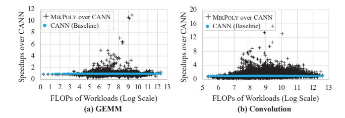
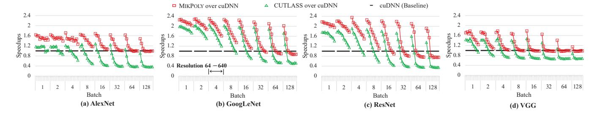
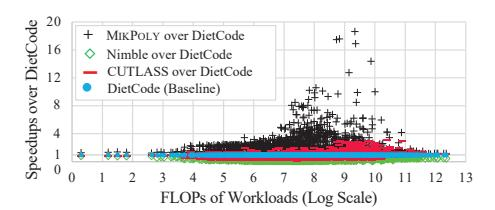
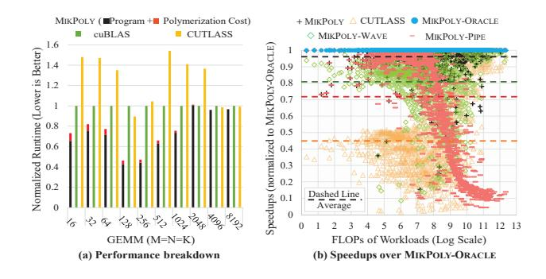
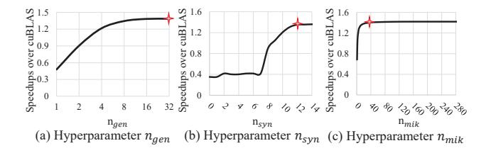
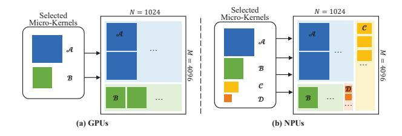

# 5.2.1 Optimizing Dynamic-Shape Operators.

MIKPOLY vs. GPU Libraries. Figure 6 shows the speedups of MIKPOLY, CUTLASS, and cuBLAS/cuDNN (normalized to

**Figure 7.** Speedups on NPUs (normalized to CANN).

the baseline cuBLAS/cuDNN) for both GEMM and convolution operators. The x-axis specifies the number of floating-point operations (FLOPs) in the workloads (encompassing all test cases for GEMM from Table 3 and convolution from Table 4), while the y-axis represents the speedups of each approach over the baseline. MIKPOLY effectively optimizes dynamic-shape operators, with an average GEMM speedup of 1.47× (with a maximum of 4.82×) over cuBLAS and an average convolution speedup of 1.98× (with a maximum of 5.38×) over cuDNN. Compared to CUTLASS, MIKPOLY achieves average GEMM and convolution speedups of 3.02× and 1.72×, respectively. Notably, MIKPOLY performs exceptionally well for small shapes, where the "imbalance" phenomenon becomes more pronounced (as discussed in Section 6).

MIKPOLY vs. an NPU Library. Figure 7 depicts the speedups of MIKPOLY over the vendor library CANN (used as the baseline) for the same two operators on NPUs. MIKPOLY demonstrates its effectiveness in optimizing dynamic shape operators on NPUs, outperforming CANN with an average speedup of 1.10× for GEMM and 1.41× for convolution. Due to its ability to alleviate the memory bottleneck, MIKPOLY achieves significant speedups for certain test cases.

#### 5.2.2 Optimizing Dynamic-Shape Model Inference.

Figures 8 and 9 show the end-to-end inference performance of typical language models and CNN models on GPUs, where MikPoly, CUTLASS, and cuBLAS/cuDNN represent the speedups of the three implementation methods (normalized to the cuBLAS/cuDNN baseline). It is important to note that the end-to-end model inference latency for MikPoly encompasses both the operator execution time on the accelerator and the runtime overhead attributed to MikPoly's cost model.

In each model, the x-axis denotes input tensor shapes, and the y-axis shows speedups relative to the baseline. MikPoly achieves average speedups of 1.39×, 1.38×, 1.36×, and 1.37× for BERT, DistilBERT, RoBERTa, and ALBERT, respectively. For AlexNet, GoogLeNet, ResNet, and VGG, MikPoly's average speedups are 1.34×, 1.69×, 1.59×, and 1.22×, respectively. Remarkably, MikPoly consistently outperforms CUTLASS across a wide range of input shapes, even surpassing hand-tuned kernels from this proprietary vendor library in scenarios involving small shapes.

We also evaluated MikPoly on NPUs. Compared to CANN, MikPoly achieves average speedups of 1.30×, 1.19×, 1.32×,

Figure 8. Comparison of end-to-end performance with dynamic sequence lengths (normalized to cuBLAS).

Figure 9. Comparison of end-to-end performance with dynamic batch sizes and image resolutions (normalized to cuDNN).

and 1.38× for AlexNet, GoogLeNet, ResNet, and VGG, respectively. Overall, MikPoly effectively accelerates the endto-end execution of dynamic-shape DNNs.

#### 5.2.3 Comparing MikPoly with the State of the Art.

We compared MIKPOLY with existing dynamic-shape tensor compilers, DietCode [65] and Nimble [49], on GPUs. To ensure a fair evaluation, we excluded Tensor Cores in MIKPOLY for this experiment as DietCode and Nimble support only GPU CUDA Cores. As explained in Section 2, both DietCode and Nimble face limitations in handling arbitrarily-shaped tensors, as they require a supplied range for each dynamic dimension in a shape. This restriction hampers their applicability in scenarios where shapes are not predefined or dynamically vary.

In Figure 10, we present the results obtained from all 1433 test cases indicated in Table 3 for MikPoly, DietCode, Nimble, and CUTLASS. Both Nimble and DietCode were given input ranges for M, N, and K as specified in Table 3. The x-axis represents the FLOPs of these workloads, and the y-axis shows the speedups (normalized to DietCode). On average, MikPoly outperforms DietCode, Nimble, and CUTLASS by  $2.94\times$ ,  $7.54\times$ , and  $3.59\times$ , respectively.

In Table 5, we further examine their end-to-end inference performance for the four language models considered, using input sequence lengths ranging from 5 to 500. We utilize a set of 150 randomly generated lengths within this range for comparison across all four methods. On average, MIKPOLY outperforms DietCode (the best performer among the three compared existing methods) by 1.55×.

DietCode can yield errors or incorrect outcomes when the runtime shape of a tensor operator falls outside its predefined

**Figure 10.** Speedups for GEMM on GPUs (normalized to DietCode).

**Table 5.** End-to-end inference performance on GPUs (normalized to DietCode).

| Method         | BERT  | DistilBERT    | RoBERTa       | ALBERT        | Average |
|----------------|-------|---------------|---------------|---------------|---------|
| DietCode [65]  | 1.00× | 1.00×         | 1.00×         | 1.00×         | 1.00×   |
| Nimble [49]    | 0.25× | 0.26×         | 0.25×         | 0.26×         | 0.25×   |
| CUTLASS        | 0.70× | 0.71×         | $0.71 \times$ | $0.71 \times$ | 0.71×   |
| MikPoly (Ours) | 1.60× | $1.60 \times$ | $1.50 \times$ | $1.51 \times$ | 1.55×   |

shape, leading to *invalid runs* due to issues such as out-of-bounds errors or resource unavailability. Table 6 presents the counts of valid runs for both MikPoly and DietCode during the execution of GEMM, using a total of 8192 dynamic shapes,  $(M, N, K) = (\tau, 3072, 768)$ , where  $\tau$  ranges from 1 to 8192. For DietCode, one of the five input ranges for M was provided, while for MikPoly, M is considered fully dynamic at runtime. Notably, DietCode produces numerous invalid runs, unlike MikPoly, which exhibits zero occurrences of invalid runs. Additionally, as outlined in Table 7, DietCode underperforms compared to MikPoly, even with the utilization of input range information for M across 128 evaluated test cases. The superiority of MikPoly over DietCode in terms of speedup becomes more pronounced as the input range widens. These

**Table 6.** Comparing MIKPOLY with DietCode using GEMM when the runtime size of *M* falls outside its predefined range.

| 8192 Test Cases: $M \in [1, 8192], N = 3072, K = 768$ |                 |          |          |           |           |          |
|-------------------------------------------------------|-----------------|----------|----------|-----------|-----------|----------|
| DietCode                                              | M's Input Range | [1, 128] | [1, 512] | [1, 1024] | [1, 2048] | [1,8192] |
| DietCode                                              | #Valid Runs     | 254      | 572      | 1136      | 2144      | 8192     |
| МікРога                                               | M's Input Range |          |          | N/A       |           |          |
| WIIKI OLI                                             | #Valid Runs     |          |          | 8192      |           |          |

**Table 7.** Speedups of MIKPOLY over DietCode using GEMM when the runtime size of *M* falls with its predefined range.

| 128 Test Cases: $M \in [1, 128], N = 3072, K = 768$ |          |         |           |           |           |
|-----------------------------------------------------|----------|---------|-----------|-----------|-----------|
| DietCode's Input Range for $M$                      | [1, 128] | [1,512] | [1, 1024] | [1, 2048] | [1, 8192] |
| Speedups                                            | 1.68×    | 1.81×   | 1.92×     | 2.25×     | 2.37×     |

**Table 8.** Speedups of GEMM operators in Llama2-13b (normalized to cuBLAS).

| Layer Name | М    | N*        | K    | Speedups |
|------------|------|-----------|------|----------|
| qkv_proj   | 3840 | [1, 4096] | 5120 | 1.09×    |
| o_proj     | 5120 | [1, 4096] | 1280 | 1.24×    |
| ffn up     | 3456 | [1, 4096] | 5120 | 1.21×    |
| ffn down   | 5120 | [1, 4096] | 3456 | 1.08×    |

outcomes further underscore the practical effectiveness of MikPoly's on-the-fly micro-kernel polymerization.

**5.2.4 Applying MikPoly to LLMs.** To assess MikPoly's efficacy in LLM scenarios, we employed Llama2-13b [54] from HuggingFace for evaluating both operator and end-to-end inference performance. The experiments were conducted on a server with four Nvidia A100 GPUs connected via NVLink, under the same software platform setup as described in Section 5.1. Input sequence lengths were set to  $2^i$  (with i ranging from 0 to 9), and batch sizes to  $2^j$  (with j ranging from 0 to 3). We also configured tensor parallelism size to 4 to fully utilize the four GPUs and set the output sequence length to 512, aligning with common practices in LLM systems [21, 31, 57].

We tested four representative GEMM operators in the Llama2-13b model: qkv\_proj, o\_proj, ffn up, and ffn down, across 52 unique test cases with varying shapes. The performance results of these GEMM operators, where N is the dynamic dimension, are detailed in Table 8. In comparison to cuBLAS, MikPoly achieved average speedups of  $1.09\times$ ,  $1.24\times$ ,  $1.21\times$ , and  $1.08\times$  for these operators, respectively.

In evaluating end-to-end model inference, we used Nvidia's FasterTransformer as a baseline, integrating MikPoly's GEMM operators into it. The results, shown in Figure 11, indicate MikPoly's performance with varying input sequence lengths (x-axis) and speedups relative to the baseline (y-axis). MikPoly achieved average speedups of 1.05×, 1.04×, 1.02×, and 1.01× for batch sizes 1, 2, 4, and 8, respectively, demonstrating its effectiveness in optimizing LLMs.

**Figure 11.** End-to-end inference performance of Llama2-13b on GPUs (normalized to FasterTransformer).

**Figure 12.** GEMM performance analysis of MikPoly on GPUs.

#### 5.3 Performance Analysis

We now provide a comprehensive performance analysis of MikPoly using GEMM on GPUs, illustrated in Figure 12.

**5.3.1** Online Polymerization Overhead. In Figure 12(a), we show MikPoly's execution breakdown for GEMM on GPUs, including micro-kernel polymerization costs and execution times of final tensor programs across different shapes. A comparison is made against cuBLAS (baseline) and CUT-LASS. The x-axis denotes various shapes used, while the y-axis presents execution times normalized to cuBLAS. Notably, MikPoly's polymerization cost forms a small fraction of total execution time for each shape, decreasing as shape size increases due to its efficient cost model.

**5.3.2 Cost Model Effectiveness.** In Figure 12(b), we compare three MikPoly variants for GEMM on GPUs using all test cases from Table 3. Additionally, for reference, CUTLASS is included for comparison purposes. MikPoly-Oracle employs an exhaustive search, reporting runtime of optimized tensor programs for shapes, disregarding search cost. MikPoly-Wave considers the number of waves required for executing pipelined tasks (via  $f_{\text{wave}}$  in Section 3), resulting in large-sized micro-kernels. MikPoly-Pipe uses the execution costs of pipelined tasks executed on a single SM (via  $f_{\text{pipe}}$  in Section 3), favoring small-sized micro-kernels. The x-axis indicates the FLOPs in the workloads considered, while the y-axis shows speedups of different methods normalized to MikPoly-Oracle (baseline).

Figure 13. Hyperparameters analysis in MikPoly.

**Figure 14.** Two tensor programs generated by MikPoly for GEMM on GPUs and NPUs using two different polymerization schemes.

On average, the speedups achieved by MikPoly, MikPoly-Wave, and MikPoly-Pipe over MikPoly-Oracle are 0.96×, 0.81×, and 0.72×, respectively. For reference, CUTLASS exhibits an average speedup of 0.45×.

MIKPOLY-WAVE produces large-sized micro-kernels that focus on minimizing the number of waves, while MIKPOLY-PIPE generates small-sized micro-kernels that focus on maximising the performance of a pipelined task. MIKPOLY takes both factors into consideration, outperforming CUTLASS (which lacks the guidance of a cost model).

MIKPOLY-ORACLE, utilizing an oracle cost model, achieves the best performance. However, its search process is excessively time-consuming, making it impractical for real-world applications. Specifically, for a given shape, MIKPOLY-ORACLE takes about 1.6 seconds to find the best polymerization solution, whereas MIKPOLY accomplishes the same task in just about 2 microseconds on average. Remarkably, despite this significant reduction in search time, MIKPOLY delivers nearly identical high-performing programs as MIKPOLY-ORACLE, showcasing the effectiveness of our cost model.

#### 5.4 Hyperparameter Analysis

We conducted sensitivity tests on MikPoly's hyperparameters,  $n_{gen}$ ,  $n_{syn}$ , and  $n_{mik}$ , as outlined in Section 5.1, with results in Figure 13. Each hyperparameter's value range is on the x-axis, and MikPoly's average operator speedups over cuBLAS are on the y-axis. These experimental results highlight a balance between operator performance and polymerization cost, showing performance enhancement up to a saturation point with increasing hyperparameter values. As a result, we set  $n_{gen} = 32$ ,  $n_{syn} = 12$ , and  $n_{mik} = 40$ , as indicated by stars in Figure 13.

**Figure 15.** How MIKPOLY's micro-kernel polymerization mitigates the load-imbalance problem on GPUs (N = 1024 and K = 4096).

Table 9. Performance measurements for GEMM on GPU.

|                   | GEM        | GEMM- $\mathcal{AB}$ |            |
|-------------------|------------|----------------------|------------|
|                   | (M = 3072) | (M = 4096)           | (M = 4096) |
| sm_efficiency (%) | 86.67      | 58.90                | 96.06      |
| elapsed_cycles_sm | 16,186,802 | 31,714,450           | 25,681,910 |
| grid_size         | 96         | 128                  | 352        |

#### 6 Case Studies

We analyze MikPoly's performance using GEMM on GPUs with a test case (M, N, K) = (4096, 1024, 4096), where M signifies the dynamic input sequence length. Figure 14 displays two polymerization strategies applied to GPUs and NPUs, respectively. On GPUs, MikPoly selects a tensor program with two micro-kernels ( $\mathcal{A}$  and  $\mathcal{B}$ ), achieving a speedup of  $1.21\times$  compared to the single micro-kernel program ( $\mathcal{A}$ ). On NPUs, MikPoly utilizes a program comprising four micro-kernels ( $\mathcal{A}$  to  $\mathcal{D}$ ) and achieves a speedup of  $1.12\times$  compared to the single micro-kernel program ( $\mathcal{A}$ ).

Let GEMM- $\mathcal{AB}$  denote the program with two micro-kernels,  $\mathcal{A}$  and  $\mathcal{B}$ ; GEMM- $\mathcal{A}$  as the program with the single micro-kernel  $\mathcal{A}$ ; and GEMM- $\mathcal{B}$  as the program with the single micro-kernel  $\mathcal{B}$ . In Figure 15, we observe that GEMM- $\mathcal{AB}$  can effectively mitigate load imbalance on GPUs, outperforming individual micro-kernels.

In Figure 15(a), the execution times of GEMM- $\mathcal{A}$  and GEMM- $\mathcal{B}$  are given with N = 1024 and K = 4096, while M varies over [1024, 4096] with a stride of 256. As M increases from 3328 to 3584, the execution time of GEMM- $\mathcal{A}$  increases from 0.11 ms to 0.21 ms. Table 9 presents the performance metrics obtained by Nvidia's profiling tools for GEMM- $\mathcal{A}$  (with  $M \in \{3072, 4096\}$ ) and GEMM- $\mathcal{AB}$ (with M = 4096). Notably, sm\_efficiency indicates the percentage of time that at least one warp is active on an SM, elapsed\_cycles\_sm indicates the number of clock cycles elapsed per SM, and grid\_size indicates the number of thread blocks. When M increases from 3072 to 4096, GEMM- $\mathcal A$  experiences a drop in sm\_efficiency from 86.67% to 58.90%, and its elapsed\_cycles\_smincreases by 1.96×. Thus, as the number of thread blocks increases from 96 to 128, GEMM- $\mathcal{A}$  faces a load imbalance problem, while GEMM-ЯВ, obtained by MikPoly through micro-kernel polymerization, exhibits improved hardware utilization.

In Figure 15(b), we reveal the load imbalance in GEMM- $\mathcal{A}$ . Each rectangle's width corresponds to the number of warps, while its height reflects warps' execution time. On the A100 GPU, grids of threads are divided into waves of thread blocks based on available SMs and theoretical occupancy. With 108 SMs and a maximum of 64 warps per SM, GEMM- $\mathcal{A}$  has a theoretical occupancy of 12.5%, yielding only 8 active warps per SM. Thus, a full wave comprises 864 warps. MIKPOLY employs a thread block of 256 threads (8 warps) for  $\mathcal{A}$ , with uM=256, uN=128, and uK=32 (Figure 3). This results in  $(4096\times1024)/(256\times128)=128$  pipelined tasks (Section 3.3) for GEMM- $\mathcal{A}$ . Consequently, GEMM- $\mathcal{A}$  requires  $128\times8=1024$  warps. This necessitates  $\lceil 1024/864 \rceil=2$  waves to complete, with the last wave underutilizing the GPU and significantly impacting its execution time.

In Figure 15(c), we depict the effective mitigation of the load imbalance issue faced by GEMM-A through GEMM-AB. GEMM-AB follows Pattern II (Figure 3), with GEMM- $\mathcal{AB}$ -TOP handling (M, N, K) = (3072, 1024, 4096) using  $\mathcal{A}$ , and GEMM- $\mathcal{AB}$ -BOT addressing (M, N, K) = (1024, 1024, 1024, 1024, 1024, 1024, 1024, 1024, 1024, 1024, 1024, 1024, 1024, 1024, 1024, 1024, 1024, 1024, 1024, 1024, 1024, 1024, 1024, 1024, 1024, 1024, 1024, 1024, 1024, 1024, 1024, 1024, 1024, 1024, 1024, 1024, 1024, 1024, 1024, 1024, 1024, 1024, 1024, 1024, 1024, 1024, 1024, 1024, 1024, 1024, 1024, 1024, 1024, 1024, 1024, 1024, 1024, 1024, 1024, 1024, 1024, 1024, 1024, 1024, 1024, 1024, 1024, 1024, 1024, 1024, 1024, 1024, 1024, 1024, 1024, 1024, 1024, 1024, 1024, 1024, 1024, 1024, 1024, 1024, 1024, 1024, 1024, 1024, 1024, 1024, 1024, 1024, 1024, 1024, 1024, 1024, 1024, 1024, 1024, 1024, 1024, 1024, 1024, 1024, 1024, 1024, 1024, 1024, 1024, 1024, 1024, 1024, 1024, 1024, 1024, 1024, 1024, 1024, 1024, 1024, 1024, 1024, 1024, 1024, 1024, 1024, 1024, 1024, 1024, 1024, 1024, 1024, 1024, 1024, 1024, 1024, 1024, 1024, 1024, 1024, 1024, 1024, 1024, 1024, 1024, 1024, 1024, 1024, 1024, 1024, 1024, 1024, 1024, 1024, 1024, 1024, 1024, 1024, 1024, 1024, 1024, 1024, 1024, 1024, 1024, 1024, 1024, 1024, 1024, 1024, 1024, 1024, 1024, 1024, 1024, 1024, 1024, 1024, 1024, 1024, 1024, 1024, 1024, 1024, 1024, 1024, 1024, 1024, 1024, 1024, 1024, 1024, 1024, 1024, 1024, 1024, 1024, 1024, 1024, 1024, 1024, 1024, 1024, 1024, 1024, 1024, 1024, 1024, 1024, 1024, 1024, 1024, 1024, 1024, 1024, 1024, 1024, 1024, 1024, 1024, 1024, 1024, 1024, 1024, 1024, 1024, 1024, 1024, 1024, 1024, 1024, 1024, 1024, 1024, 1024, 1024, 1024, 1024, 1024, 1024, 1024, 1024, 1024, 1024, 1024, 1024, 1024, 1024, 1024, 1024, 1024, 1024, 1024, 1024, 1024, 1024, 1024, 1024, 1024, 1024, 1024, 1024, 1024, 1024, 1024, 1024, 1024, 1024, 1024, 1024, 1024, 1024, 1024, 1024, 1024, 1024, 1024, 1024, 1024, 1024, 1024, 1024, 1024, 1024, 1024, 1024, 1024, 1024, 1024, 1024, 1024, 1024, 1024, 1024, 1024, 1024, 1024, 1024, 1024, 1024, 1024, 1024, 1024, 1024, 1024, 1024, 1024, 1024, 1024, 1024, 1024, 1024, 1024, 1024, 1024, 1024, 1024, 1024, 1024, 1024, 1024, 1024, 1024, 1024, 1024, 1024, 1024, 1024, 1024, 1024, 1024, 1024, 1024, 14096) using  $\mathcal{B}$ . For GEMM- $\mathcal{AB}$ -TOP, similar to GEMM- $\mathcal{A}$ , a simple analysis indicates it induces  $(3072 \times 1024)/(256 \times$ 128) = 96 pipelined tasks, necessitating 768 warps. GEMM-AB-BOT also maintains a theoretical occupancy of 12.5%, resulting in 8 active warps per SM and a maximum of 864 warps per wave. Concerning  $\mathcal{B}$ , with uM = uN = uK = 64, a thread block of 128 threads (4 warps) is utilized. Hence, GEMM- $\mathcal{AB}$ -BOT generates  $(1024 \times 1024)/(64 \times 64) = 256$ pipelined tasks, requiring 1024 warps. Consequently, GEMM- $\mathcal{AB}$  necessitates  $\lceil (768 + 1024)/864 \rceil = 3$  waves to complete, with the final wave accounting for a fraction  $\frac{t_B}{t_B+2*t_B}$  of the total execution time, where  $t_{\mathcal{A}}$  and  $t_{\mathcal{B}}$  denote the pipelined execution times of  $\mathcal{A}$  and  $\mathcal{B}$ , respectively. When  $t_{\mathcal{A}} > 2 \times t_{\mathcal{B}}$ , GEMM- $\mathcal{AB}$  outperforms GEMM- $\mathcal{A}$  by a factor of  $\frac{2*t_{\mathcal{A}}}{(t_{\mathcal{A}}+2*t_{\mathcal{B}})}$ . The effectiveness of micro-kernel polymerization is evident in sm\_efficiency, as illustrated in Table 9.

#### 7 Discussions

Generality. We have successfully demonstrated that MikPoly can accelerate representative tensor operators such as GEMM and convolution, as well as real-world applications like BERT and ResNet on both GPU and NPU platforms. The framework utilizes a novel two-stage approach to address the performance optimization challenges in dynamic-shape scenarios. This generic framework can be extended to support numerous other operators and accelerators.

Applicability. The speedups achieved by MikPoly may vary across different applications due to the diversity of tensor shapes. We noticed that MikPoly performs exceptionally well for operators with frequently varying input shapes in a relatively large range. Moreover, when certain input shape

ranges are known during compilation, we can enhance performance by generating a more appropriate set of microkernels and refining the cost model for better optimization.

Loop Transformation. Polymerization in this study can be seen as a variant of traditional loop transformation for dynamic shapes. As illustrated in Figures 3 and 4, MikPoly operates in two stages, using a tensor program template with inner offline loops and outer online loops. In polymerization, MikPoly splits the online loop into groups of nested loops, each with a parameterized micro-kernel, pending loop boundaries and micro-kernel selection. With a chosen polymerization strategy, these micro-kernels are finalized, also setting the nested loops' boundaries.

Impact on LLM Systems. MIKPOLY, designed to boost dynamic-shape operator performance, is fully compatible with in-flight batching technology [59], enabling dynamic runtime batch size adjustments. This enhances dynamic-shape GEMM operator efficiency, accelerating LLMs. Future plans involve integrating MIKPOLY with system-level optimizations for further LLM efficiency improvements.

Limitations. Our future work will focus on two main directions to improve our approach. First, we plan to explore the combination of MikPoly with graph-level optimization techniques, such as operator fusion [24], to further enhance performance at the graph level in dynamic-shape scenarios. Second, while our current implementation utilizes a GEMM-based approach for convolution, we recognize the potential benefits of investigating other convolution implementations, such as Winograd [28], which may offer additional performance improvements. We look forward to exploring this area as a part of our future research efforts.

#### 8 Related Work

For static-shape workloads, researchers have achieved success in improving operator performance through techniques such as automatic tuning [7, 13, 45, 66, 67], polyhedral models [4, 55, 64], and analytical modeling [30, 62]. In comparison, MikPoly stands out among prior dynamic-shape autoschedulers [40, 49, 65, 70] as it broadens the optimization space through micro-kernel polymerization and employs a two-stage compilation approach. This enables MikPoly to efficiently support arbitrary-shape high-performance operators at runtime, as comprehensively evaluated in this paper.

Numerous studies focus on graph-level optimizations, including operator fusion [24, 43, 63, 68], co-scheduling [11, 38], and layout selection [3, 36]. In the context of dynamic shape scenarios, DISC [70] uses shape relations instead of shape size for operator fusion criteria. Batching systems employ merge-batch strategies [12] and request concatenation [15, 60] to reduce padding overhead due to varying shapes. At the IR level, MLIR [27] and TensorIR [14] focus on expressiveness and performance optimization, extensible

to support tile-level computational representations. Nimble [49] extends Relay [47] to represent dynamic structures like control and recursion, ensuring performance portability with virtual machines. DietCode [65] employs an enhanced auto-scheduler to generate tensor programs for dynamicshape tensor operators with known shape ranges at compile time. VELTAIR [37] addresses resource contention in multitenant DNN servers through multi-version compilation, creating optimized programs offline and selecting the best one at runtime with a linear model. Conversely, MikPoly targets a different dynamic aspect in DNN systems, concentrating on optimizing programs for dynamic shapes. This allows MikPoly to be smoothly integrated with other techniques, boosting overall neural network performance.

