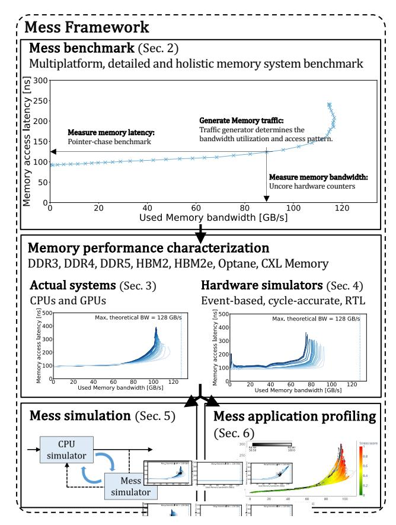

# A Mess of Memory System Benchmarking, Simulation and Application Profiling

Pouya Esmaili-Dokht\*†, Francesco Sgherzi\*†, Valéria Soldera Girelli\*†, Isaac Boixaderas\*, Mariana Carmin\*, Alireza Monemi\*, Adrià Armejach\*†, Estanislao Mercadal\*, Germán Llort\*, Petar Radojković\*, Miquel Moreto\*†, Judit Giménez\*†, Xavier Martorell\*†, Eduard Ayguadé\*†, Jesus Labarta\*†, Emanuele Confalonieri‡, Rishabh Dubey‡, Jason Adlard‡

Barcelona Supercomputing Center\*, Universitat Politecnica de Catalunya†, Micron Technology‡ {pouya.esmaili, francesco.sgherzi, valeria.soldera, isaac.boixaderas, mariana.carmin, alireza.monemi, adria.armejach}@bsc.es {lau.mercadal, german.llort, petar.radojkovic, miquel.moreto, judit, xavier.martorell, eduard.ayguade, jesus.labarta}@bsc.es {econfalo, rdubeya, jadlard}@micron.com

Abstract—The Memory stress (Mess) framework provides a unified view of the memory system benchmarking, simulation and application profiling.

The Mess benchmark provides a holistic and detailed memory system characterization. It is based on hundreds of measurements that are represented as a family of bandwidth-latency curves. The benchmark increases the coverage of all the previous tools and leads to new findings in the behavior of the actual and simulated memory systems. We deploy the Mess benchmark to characterize Intel, AMD, IBM, Fujitsu, Amazon and NVIDIA servers with DDR4, DDR5, HBM2 and HBM2E memory. The Mess memory simulator uses bandwidth-latency concept for the memory performance simulation. We integrate Mess with widelyused CPUs simulators enabling modeling of all high-end memory technologies. The Mess simulator is fast, easy to integrate and it closely matches the actual system performance. By design, it enables a quick adoption of new memory technologies in hardware simulators. Finally, the Mess application profiling positions the application in the bandwidth-latency space of the target memory system. This information can be correlated with other application runtime activities and the source code, leading to a better overall understanding of the application's behavior.

The current Mess benchmark release covers all major CPU and GPU ISAs, x86, ARM, Power, RISC-V, and NVIDIA's PTX. We also release as open source the ZSim, gem5 and OpenPiton Metro-MPI integrated with the Mess simulator for DDR4, DDR5, Optane, HBM2, HBM2E and CXL memory expanders. The Mess application profiling is already integrated into a suite of production HPC performance analysis tools.

Index Terms-Memory systems, benchmarking, simulation, application profiling, CXL, bandwidth-latency curves.

#### I. INTRODUCTION

The importance of the main memory in the overall system's design [1]-[3] drives significant effort for memory system benchmarking, simulation, and memory-related application profiling. Although these three memory performance aspects are inherently interrelated, they are analyzed with distinct and decoupled tools. Memory benchmarks typically report the maximum sustainable memory bandwidth [4]-[6] or performance of the bandwidthlimited application kernels [7]. This is sometimes complemented with latency measurements in unloaded memory systems [8]–[10] or for a small number of memory-usage scenarios [11], [12].

**Memory simulators** determine the memory system response time for a given traffic. Simple simulators model memory with a fixed latency, or calculate its service time based on queueing theory or simplified DDR protocols [13]–[19]. Dedicated cycle-accurate memory simulators consider detailed memory device sequences and timings [20]-[25]. Application profiling tools determine whether applications are memory bound based on the memory access latency [26]-[28], the position in the Roofline model [29], [30] or the memory-related portion of the overall CPI stack [31].

Our study argues that the memory system benchmarking, simulation and application profiling can and should be based on a unified view of memory system performance. We provide this view with the Memory stress (Mess) framework comprised of the Mess benchmark, analytical memory system simulator and application profiling tool (Figure 1). Mess benchmark (Section II) describes the memory system performance with a family of bandwidth-latency curves. The benchmark covers the full range of the memory traffic intensity, from the unloaded to fully-saturated memory system. It also considers numerous compositions of read and write operations, plotted with different shades of blue in Figure 1 (middle). The Mess benchmark is designed for holistic and detailed memory system characterization, and it is easily adaptive to different target platforms. The current benchmark release covers all major CPU and GPU ISAs: x86, ARM, Power, RISC-V, and NVIDIA's Parallel Thread Execution (PTX) [32].

We deploy the Mess benchmark to characterize **Intel**, **AMD**, IBM, Fujitsu and Amazon servers as well as NVIDIA GPUs with DDR4, DDR5, HBM2 and HBM2E memory (Section III). We report and discuss a wide range of memory system behavior even for the hardware platforms with the same main memory configuration. These differences are especially pronounced in the high-bandwidth areas which have the greatest impact on memory-intensive applications. We also detect and analyze scenarios in which increase of the memory request rate leads to the degradation of the measured bandwidth.

We use the Mess benchmark to evaluate memory system simulation of event-based **ZSim** [15], cycle-accurate **gem5** [16] and RTL simulator OpenPiton Metro-MPI [33] (Section IV) We evaluate different internal memory models and widely-used external memory simulators, **DRAMsim3** [22], **Ramulator** [23] and **Ramulator 2** [24]. Unfortunately, all tested memory simulators, including well-established and trusted gem5 DDR models and cycleaccurate memory simulators, poorly resemble the actual system performance. The simulators show an unrealistically low load-to-use latency (starting at 4 ns), high memory bandwidth (exceeding  $1.8\times$  the maximum theoretical one), and a simulation error of tens of percents for memory-intensive benchmarks, STREAM [5], LMbench [8] and Google multichase [9]. We detect two sources of these errors: the Zsim interface towards the external memory simulators, and the imprecise DRAMsim3 and Ramulator model of the row-buffer utilization. Finally, although it was not the initial design target, we also detected a case in which holistic and detailed Mess benchmarking diagnosed a bug in the coherency protocol generated by the OpenPiton framework.

Apart from the memory system characterization, the Mess bandwidth-latency curves can be also used for the memory performance simulation (Section V). We develop and integrate the **Mess** simulator in the ZSim, gem5, and OpenPiton Metro-MPI simulators, enabling simulation of high-end memory systems based on DDR4, DDR5, Optane, HBM2, and HBM2E technologies, and Compute Express Link (CXL) [34]. The Mess integration is easy, based on the standard interfaces between the CPU and external memory simulators [15], [16], [35]. The Mess simulator closely matches the actual memory systems performance. The simulation error for STREAM, LMbench and Google multichase benchmarks is between 0.4% and 6%, which is significantly better than any other memory models we tested. Mess is also fast. For example, Mess integrated with ZSim introduces only 26% simulation time increment over the fixed-latency memory model, while the speed-up over the Ramulator and DRAMsim3 ranges between  $13 \times$  and  $15 \times$ . Mess also removes the current lag between the emergence of memory technologies and development of the reliable simulation models. For example, Mess is the first memory simulator that models CXL memory expanders, enabling further research on these novel memory devices. The simulation is based on the bandwidth-latency curves obtained from the memory manufacturer's SystemC hardware model (Section V-C).

Finally, the Mess memory bandwidth–latency curves enhance application profiling and performance analysis (Section VI). Mess application profiling determines positions of application execution time segments on the corresponding memory bandwidth–latency curves. The application memory stress can be combined with the overall application timeline analysis and can be linked to the source code. The Mess application profiling is already integrated into a suite of **production HPC performance analysis tools** [36].

The inherent dependency between the used memory bandwidth and the access latency is by no means a new phenomenon, and the community has known about it at least for a couple of decades [37]. The Mess framework extends the previous work in three important aspects. Previous studies typically use a single bandwidth—latency memory curve to illustrate a **general memory system behavior** [12], [27], [37]—[40]. The Mess benchmark is designed for **holistic**, **detailed and close-to-the-hardware** memory system performance characterization of the **particular system under study**. To reach this objective, the Mess benchmark

Fig. 1: Mess framework: The Mess benchmark describes the memory system performance with a family of bandwidth–latency curves. We deploy the benchmark to characterize memory systems of actual servers and hardware simulators. The Mess bandwidth–latency curves can be also used for the memory performance simulation and memory-related application profiling.

is developed directly in assembly, and the experiments are tailored to minimize and mitigate the impact of the system software. It detects and quantifies some aspects of the memory systems behavior not discussed in previous studies, such as the impact of the read and write memory traffic on performance, or discrepancies between different memory systems, both in actual platforms and hardware simulators. Second, the Mess framework tightly integrates the memory performance characterization into the **memory simulation**. The Mess simulator avoids complex memory system simulation and analytically adjusts the rate of memory instructions (provided by the CPU simulator) to the actual memory performance. The accuracy of this simulation approach relies on the input memory performance characterization. This characterization therefore has to be holistic, detailed and specific to the system under study, closely matching the Mess benchmark design. Third, the framework closely couples the memory-related profiling of hardware platforms and applications. Similar to the Mess simulator, the Mess application profiling itself is uncomplicated, and its real value comes from the application analysis in the context

of the memory system characteristic. The quality of the memory characterization therefore directly impacts the quality of the overall analysis. For this reason, the analysis has to be performed with detailed Mess-like memory performance description.

The Mess benchmark is released as open source [32] and it is ready to be used in x86, Power, ARM, and RISC-V CPUs and NVIDIA GPUs. The release also contains all bandwidth–latency measurements shown in the paper, including the CXL expander curves provided by the memory manufacturer. We also release as open source the ZSim, gem5 and OpenPiton Metro-MPI integrated with the Mess simulator supporting DDR4, DDR5, Optane, HBM2, HBM2E and CXL expanders[41]. Also, the public releases of the production HPC performance analysis tools already include the Mess application profiling extension [42]. The released tools are ready to be used by the community for better understanding of the current and exploration of future memory systems.

## II. MESS BENCHMARK

This section describes the Mess benchmark use, and analyzes its characterization of actual platforms and hardware simulators.

#### *A. Mess benchmark: Memory bandwidth–latency curves*

The Mess memory characterization comprises tens of bandwidth– latency curves, each corresponding to a specific ratio between the read and write memory traffic. The Mess benchmark kernels cover the whole range of memory operations, from 100%-loads to 100%-stores. The 100%-load kernel generates a 100% read memory traffic, while the 100%-store kernel creates 50% read/50%-write traffic. This is because the contemporary CPUs deploy the write-allocate cache policy [43]. With this policy, each store instruction first reads data from the main memory to the cache, then modifies it, and finally writes it to the main memory once the cache line is evicted. Each store instruction, therefore, does not correspond to a single memory write, but to one read and one write.1

The Mess bandwidth–latency curves are illustrated in Figure 1 (middle). The curves with different composition of read and write traffic are plotted with different shades of blue. Each curve is constructed based on tens of measurement points that cover the whole range of memory-traffic intensity. Figure 1 (top) illustrates the construction process for one of the curves. The x-axis of the chart corresponds to memory bandwidth, monitored with hardware counters [44]–[47]. The memory access latency is measured with a pointer-chase benchmark [48], [49] executed on one CPU core or one GPU Stream Multiprocessor (SM). This determines the y-axis position of the measurement. The pointer-chase is selected because it is simple and portable to different actual hardware platforms and simulators. Optionally, memory latency could be measured with instruction-based sampling approach [50] available in some current architectures [28], [51], [52].

Running pointer-chase alone measures the unloaded memory access latency. To measure the latency of the loaded memory

1Memory traffic with more than 50% of writes can be generated with streaming stores that directly write data to the main memory. The public Mess repository already includes the benchmark with x86 streaming (non-temporal) stores. We are working on the equivalent benchmark version for ARM and Power CPUs (zero cache line fill instructions), and NVIDIA GPUs.

system, concurrently with the pointer-chase, on the remaining CPU cores or GPU SMs, we run a memory traffic generator. The memory access latency is still measured only for the pointerchase benchmark. The purpose of the traffic generator is to create memory accesses that will collide with the pointer-chase in the loaded memory system. The generator is designed to create memory traffic with configurable memory bandwidth utilization and read/write ratio. Each CPU core and GPU SM traverses two separate arrays, one with load and one with store operations. Therefore, the overall memory traffic is complex, determined by a sequential accesses within each array, but also by the interleaving between memory request from distinct arrays. The Mess benchmark covers a large range of row-buffer hit/empty/miss rates, e.g. between 35/43/22% and 84/13/3% in state-of-the-art Intel architectures (Section IV-D).

Both, pointer-chase and traffic generator are implemented in assembly to minimize any compiler intervention. To minimize the latency penalties introduced by the TLB misses and the page walk, the Mess data-structures are allocated in huge memory pages. Additionally, at runtime, these overheads are monitored with hardware counters and subtracted from the memory latency measurements. The Mess benchmark release [32] includes the source code and its detailed description.

#### *B. Validation*

The Mess benchmark exceeds the coverage of all existing memory benchmarks and tools. Still, these tools can validate some of the Mess measurements.

The unloaded memory system latency can be measured with LMbench and Google multichase in CPU platforms, and Pchase [53] in GPUs. We used these benchmarks to validate the Mess unloaded latency measurements in all hardware platforms under study. In all experiments, Mess closely matches the LMbench, Google multichase and P-chase results.

In Intel systems, the maximum sustained memory bandwidth can be measured with the Intel Advisor [4]. In the Skylake, Cascade Lake and Sapphire Rapids servers under study, the Mess benchmark matches the Advisor measurements, with a difference below 1%.

The Intel Memory Latency Checker (MLC) [11], can measure the memory latency for a selected memory traffic intensity, i.e. memory bandwidth. The memory bandwidth can be fine-tuned, but the tool provides a sparse analysis of different traffic compositions, i.e. read and write memory operations. We compare the Intel MLC results and the corresponding subset of the Mess measurements for all Intel platforms under study. The MLC and Mess results show the same trend, with slightly lower (<5%) latencies reported by the Mess benchmark. This is because the Mess is designed for close-to-the-hardware memory characterization, and, unlike the MLC, it excludes the latency penalties introduced by the OS overheads, the TLB misses and the page walk.

#### *C. Performance analysis*

Figure 2 illustrates the Mess benchmark performance analysis with an example of the 24-core Intel Skylake server with six DDR4- 2666 memory channels [54]. The figure confirms a general trend of the memory access latency, which is initially roughly constant

and then increases with higher memory pressure (i.e. bandwidth) due to resource contention among parallel accesses [37], [55], [56].

Detailed and close-to-the-hardware Mess characterization reveals some memory system aspects not discussed by previous studies. The most important one is the impact of the read and write memory traffic. The best performance, the lowest latency and the highest achieved bandwidth, are obtained for 100% read traffic. Memory writes reduce the memory performance and reach the saturation point sooner. This is due to the extra timing constraints such as tWR and tWTR, which come with memory write operations [57]. We detect this behavior for all the Intel, AMD, IBM, Fujitsu, and Amazon servers as well as NVIDIA GPUs used in the study with DDR4, DDR5, HBM2 and HBM2E memory (Section III). However, we see a very different write traffic impact on CXL memory expanders [34]. This behavior of CXL memory expanders is analyzed in Section V-C.

Apart from the memory bandwidth–latency curves, we use the Mess benchmark to derive memory system performance metrics, also depicted in Figure 2, for quantitative comparison of different memory systems. In addition to the commonly-used unloaded memory latency, the detailed Mess characterization quantifies the maximum latency range of memory access latencies for all read/write ratios and the saturated bandwidth range. The memory system is saturated when any further increase in the memory system pressure, i.e. bandwidth, leads to a high increase in the memory access latency. We consider that the saturated bandwidth area starts at the point in which the memory access latency doubles the unloaded latency. In some of the platforms under study, we also detect that the increase in the Mess memory access rate causes a memory bandwidth decline, while the access latency continues to increase. This behavior is observed in the bandwidth–latency curves as a "wave form" seen in Figure 2. The causes for this memory behavior are analyzed in Section III. To the best of our knowledge, our study is the first one to detect and analyze this suboptimal memory system behavior.

Figure 2 also depicts the bandwidth reported by the STREAM benchmark (vertical dashed lines). STREAM and Mess provide complementary memory bandwidth analysis. While STREAM is the *de facto* standard for measuring application-level sustained memory bandwidth [5], [58], the Mess benchmark provides the microarchitecture view and considers all memory traffic visible by hardware counters. Differences between these two approaches are analyzed in the next section.

