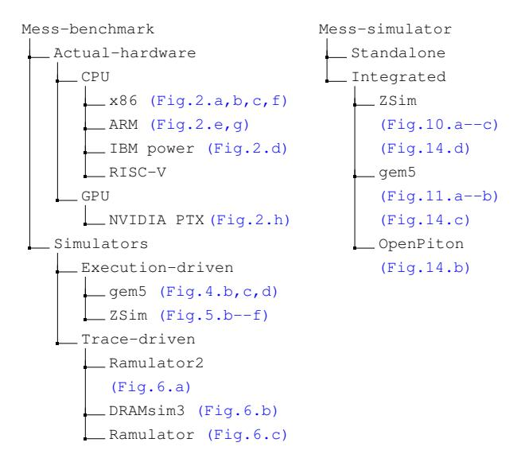

# APPENDIX

#### *A. Abstract*

This artifact comprises the implementation of the Mess benchmark for various platforms, including actual hardware platforms (e.g., Intel, IBM, NVIDIA), system simulators (ZSim, gem5, and OpenPiton), and memory simulators (DRAMsim3, Ramulator, Ramulator2). It also includes the Mess memory simulator integrated with ZSim, gem5, and OpenPiton simulators.

This artifact also contains all the scripts and guidelines necessary to reproduce the major figures presented in this paper. In addition to the scripts, it includes raw hardware measurements, processed measurements, and the final bandwidthlatency curves.

This study involves more than eight different hardware platforms with a diverse set of runtime environments, including various compilers, ISAs, and tools. Therefore, in this artifact, we mention the packages, tools, and applications without specifying the exact versions. In the Git repository, we provide detailed dependencies and version information for each experiment.

#### *B. Artifact check-list (meta-information)*

- Program: Pointer-chase and workload generator implemented in C, C++ with its kernel implemented in inline assembly (included in the benchmark). Mess simulator integrated with ZSim, gem5, and OpenPiton.
- Compilation: GCC, G++, ICX, MPI++, and Python 3.
- Data set: All the raw values measured from hardware counters and simulation tracecs as well as final curves for all the figures are included.
- Run-time environment: For Intel Cascade Lake curves, we use small server with single node. For Fujitsu A64FX, we use PJM batch processing support. For Graviton server, we use Amazon AWS. For the rest of the systems, we use production servers with Slurm Workload Manager environment.
- Hardware: Servers or Supercomputers with the following CPUs and GPUs: Intel Sandy Bridge, Skylake, Cascade Lake and Sapphire Rapids. AMD Zen 2, IBM Power 9, Amazon Graviton 3, Fujitsu A64FX, NVIDIA Hopper H100.
- Metrics: For latency, we use nanoseconds and cycles. For bandwidth, we use GB/s.
- Output: We plot bandwidth–latency curves. Moreover, we print detailed data points in a .csv file.
- Experiments: Generate experiments using supplied scripts.
- How much disk space required (approximately)?: 10s of GB.
- How much time is needed to prepare workflow (approximately)?: For each experiment, approximately one hour.
- How much time is needed to complete experiments (approximately)?: To generate bandwidth–latency curves for actual hardware, ZSim, gem5, and OpenPiton, we need approximately 3-6 days, 1-2 weeks, 2-3 weeks, and 1-2 weeks, respectively.
- Publicly available: Yes.
- Code licenses: MIT License.
- Data licenses: MIT License.
- Archived (provide DOI)?: 10.5281/zenodo.13748673

#### *C. Description*

Figure 17 and 18 show where to replicate each major result presented in the paper. A detailed explanation of dependencies, system configurations, experimental setups, and result validation is available in the README.md file in each folder. To fit within the page limit of this artifact, this guideline introduces the general approach for replicating each result, along with an example to reproduce Figure 6.b. To replicate

Fig. 17: Mess benchmark repo Fig. 18: Mess simulator repo

other figures, a similar approach should be followed (detailed guidelines are available in the Git repositories).

- *1) How to access:* The Mess Benchmark artifact can be cloned from GitHub at https://github.com/bsc-mem/Messbenchmark.git. The structure of the repository is depicted in Figure 17. The Mess simulator artifact can also be cloned from https://github.com/bsc-mem/Mess-simulator. The structure of the repository is depicted in Figure 18. Each folder in the repositories replicates one or more figures presented in the main manuscript (figures are indicated in blue text). This artifact can also be downloaded as a .zip file from https://zenodo.org/records/13748674.
- *2) Hardware dependencies:* To run the Mess benchmark on actual hardware, access to a full node is required. The CPU/GPUs must support hardware counters to measure memory bandwidth (preferably uncore counters). For simulation experiments, a single core is sufficient. However, ZSim and OpenPiton can benefit from multicore or multinode parallelism.
- *3) Software dependencies:* The benchmark and simulations run on Linux OS. To measure uncore counters, we primarily use the Linux perf tool, which is supported by all major Linux versions. In some cases, we also use Intel VTune and LIKWID.
- *4) Data sets:* All the data sets are included in the repositories.

