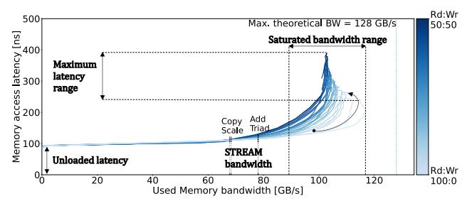
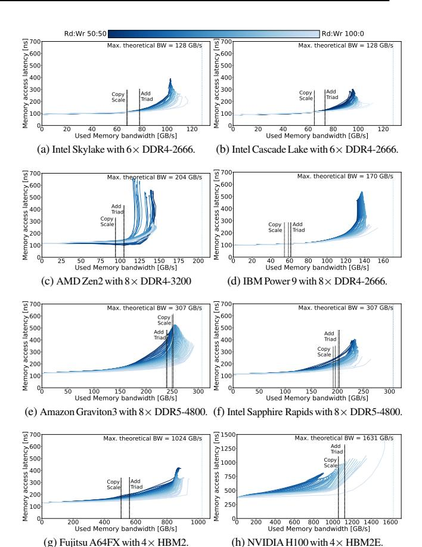

# III. PERFORMANCE CHARACTERIZATION: ACTUAL SYSTEMS

We use the Mess measurements to compare the memory system performance of Intel, AMD, IBM, Fujitsu and Amazon servers as well as NVIDIA GPUs with DDR4, DDR5, HBM2 and HBM2E. The platform and memory system characteristics are listed in Table I while Figure 3 shows their bandwidth–latency curves. The unloaded memory latency varies significantly between different platforms. It ranges from 85 ns in the Cascade Lake server with DDR4, to 122 ns in the A64FX servers with HBM2 and 129 ns in the Graviton 3 with DDR5 main memory. This difference should not be directly associated to the main memory. For example, the AMD Zen2 comprises DDR4 technology with practically the same

Fig. 2: The Mess benchmark models the memory system performance with a family of bandwidth–latency curves.

command latencies (in nanoseconds) as the Intel Cascade Lake server, and still it shows almost 30 ns higher unloaded memory latency. This is because the load-to-use latency considers the time memory requests spend within the CPU chip, including the cache hierarchy and network on chip. These timings can differ significantly between different CPU architectures. We detect the highest unloaded memory latencies in the chips with the largest number of cores (Zen2, A64FX, Graviton 3) indicating that at least a portion of this latency is likely to be attributed to the network on chip which is larger and more complex in these architectures. NVIDIA H100 GPU shows higher unloaded latency due to its massive number of arithmetic processing units, lower on-chip frequency, and complex memory hierarchy [53], [59].

We also detect a wide maximum latency range between different platforms, and even within a single platform for different read and write memory traffic. Maximum memory latency is a primary concern in real-time systems, and it is less critical in high-performance computing (HPC). Still it has to be bound to guarantee quality of service of some HPC applications. We believe that our study may open a discussion about the sources of different maximum latencies in different systems, e.g. due to the different lengths of the memory queues, and about its desirable limits.

All platforms except AMD Zen2 CPU and NVIDIA H100 show a similar saturated bandwidth range, between approximately 70% and 90% of the maximum theoretical bandwidth. The maximum achieved bandwidth cannot reach the theoretical one because part of it is "lost" due to factors such as DRAM refresh cycles blocking the entire chip, page misses causing precharge and activate cycles, and timing restrictions at the bank, rank, and channel levels [66]. The efficiency of the memory bandwidth utilization also depends on the memory controller design. As expected (see Section II-C), the best utilization is achieved for 100%-read memory traffic, and it reduces with the increment of the memory writes. AMD Zen2 is an exception in two ways. First, its saturated bandwidth range is significantly lower, 57–71% of the maximum theoretical one. Second, it does not follow the expected impact of the write traffic on the bandwidth utilization. The traffic with the maximum rate of memory writes shows a very good performance, very close to the 100%-read traffic, while the main drop is detected for a mixed, e.g. 60%-read/40%-write, traffic.

In some AMD Zen 2, Intel Skylake and Intel Cascade Lake bandwidth–latency curves, increase in the Mess memory access

| TABLE I: CPU and GPU | platforms under study: | Quantitative memory n | performance comparison. |
|----------------------|------------------------|-----------------------|-------------------------|
|                      |                        |                       |                         |

| Platform                           | Intel Skylake Xeon Platinum [54] | Intel Cascade Lake Xeon Gold [54] | AMD Zen 2 EPYC 7742 [60] | IBM Power 9 02CY415 [61] | Amazon Graviton 3 [62] | Intel Sapphire Rapids Xeon Platinum [63] | Fujitsu A64FX [64] | NVIDIA Hopper H100 [65] |
|------------------------------------|-------------------------------------|--------------------------------------|-----------------------------|-----------------------------|---------------------------|---------------------------------------------|-----------------------|----------------------------|
| Released                           | 2015                                | 2019                                 | 2019                        | 2017                        | 2022                      | 2023                                        | 2019                  | 2023                       |
| Cores @ frequency                  | 24 @2.1 GHz                         | 16 @2.3 GHz                          | 64 @2.25 GHz                | 20 @2.4 GHz                 | 64 @2.6 GHz               | 56 @2GHz                                    | 48 @2.2 GHz           | 132 SMs@1.1GHz             |
| Main memory                        | 6×DDR4-2666                         | 6×DDR4-2666                          | 8×DDR4-3200                 | 8×DDR4-2666                 | 8×DDR5-4800               | 8×DDR5-4800                                 | $4 \times HBM2$       | $4 \times HBM2E$           |
| Theoretical bandwidth              | 128 GB/s                            | 128 GB/s                             | 204 GB/s                    | 170 GB/s                    | 307 GB/s                  | 307 GB/s                                    | 1024 GB/s             | 1631 GB/s                  |
| % of the max theoretical bandwidth |                                     |                                      |                             |                             |                           |                                             |                       |                            |
| Saturated bandwidth range          | 72-91%                              | 68-87%                               | 57-71%                      | 67-91%                      | 63-95%                    | 60-86%                                      | 72-92%                | 51-95%                     |
| STREAM kernels: Application view   | 53-61%                              | 51-57%                               | 46-51%                      | 32-36%                      | 78-82%                    | 63-66%                                      | 49-55%                | 64-69%                     |
| Unloaded latency                   | 89 ns                               | 85 ns                                | 113 ns                      | 96 ns                       | 122 ns                    | 109 ns                                      | 129 ns                | 363 ns                     |
| Maximum latency range              | 242-391 ns                          | 182-303 ns                           | 257-657 ns                  | 238-546 ns                  | 332-527 ns                | 238-406 ns                                  | 338-428 ns            | 699-1433 ns                |

rate, after some point, leads to decline in the measured bandwidth.2 In Amazon Graviton 3, Intel Sapphire Rapids and NVIDIA H100 this behavior is frequent for the memory traffic with high percent of writes. We explored these findings in the Cascade Lake servers in which we had access to the row-buffer hardware counters. In the experiments that experienced the bandwidth decline, we detect a significant increase in row-buffer misses. In case of a row-buffer miss, the current content of the row is stored in the memory array and the correct row is loaded into the row-buffer. These additional operations increase the memory access time and reduce the effective device bandwidth. To confirm these findings, we increased the memory system pressure by removing four out of six DIMMs in each socket. In these experiments, we detected a large "wave-form" segments in all bandwidth-latency curves. And indeed, the measurement confirmed that the measured bandwidth drop is highly correlated with the row-buffer miss rate.

The results also show the **difference between the STREAM** and Mess measurements. STREAM benchmark reports four datapoints: the maximum sustained bandwidth of Copy, Scale, Add and Triad kernels. Mess provides a wide range of measurements for different memory traffic intensity and read/write ratios. STREAM measures the application-level data traffic estimated based on the application execution time, size of the data structures, and number of load and store instruction in each STREAM kernel. Mess measures the architecture-level memory bandwidth measured with hardware counters. This includes all the application data traffic, but also all the microarchitecture data transfers. For example, STREAM bandwidth calculation assumes one memory read for each load instruction and one memory write for each store. In state-of-the-art HPC servers with write-allocate cache policy, each store instruction does not correspond to a single memory write, but to one read and one write (see Section II-A). For this reason, Mess benchmark reports higher maximum measured bandwidths. This difference is clearly visible in IBM Power 9, A64FX and all Intel platforms. In Graviton 3 and NVIDIA H100, the results reported by STREAM are very close to the maximum Mess measurements for the corresponding read/write ratio. This would correspond to a architecture with a write-through cache policy. The second cause of the difference between the maximum Mess and STREAM bandwidths is the memory traffic composition. The Mess benchmark achieves the maximum bandwidth for a 100%-read traffic. The write memory traffic, present in all STREAM kernels, adds timing constrains and reaches sooner

Fig. 3: We detect a wide range of memory system behavior, even for the hardware platforms with the same memory standard.

the bandwidth saturation point. Our results show that different platforms show distinct relation between the application-level STREAM and architecture-level Mess measurements. Therefore, we believe that the memory bandwidth analysis should include both approaches. As a part of future work, we plan to compare the STREAM and Mess measurements in high-end architectures that dynamically adjust the level of write-allocate traffic [68], [69].

