# IV. PERFORMANCE CHARACTERIZATION: MEMORY SIMULATORS

Mess benchmark can also be used to characterize memory simulators and compare them with the actual systems they intent to

&lt;sup>2These findings are consistent with two recent studies which report that running high-bandwidth benchmarks on all CPU cores may lead to lower memory bandwidths w.r.t. the experiment in which some cores are not used [6], [67].

model. We illustrate this Mess capability with the gem5, ZSim, and OpenPiton Metro-MPI simulators with different internal memory models and widely-used external memory simulators, DRAMsim3, Ramulator and Ramulator 2.

#### A. gem5

The gem5 [16] is a cycle-accurate full-system simulator. In our experiments, the simulator is configured to model the Graviton 3 server with 64 Neoverse N1 cores [62]. The cache hierarchy includes 64 KB of 4-way L1 instruction and data cache, 1 MB of 8-way private L2 cache and 64 MB of 16-way shared L3. The main memory system has eight DDR5-4800 memory channels. Figure 4 compares Mess bandwidth—latency curves of the actual server with gem5 simple memory model, more complex gem5 internal DDR model and gem5 connected to Ramulator 2. To maintain a reasonable simulation time, we model each system with a family of six curves, from 50% to 100% read memory traffic with a 10% step.

Practically in the whole bandwidth range, the gem5 **simple memory model** delivers a fixed latency of 4–49 ns. The latency increases only when the bandwidth asymptotically approaches its theoretical maximum. Contrary to the Graviton 3 server, the highest latencies are measured for a 100%-read traffic, and the latency drops with the percent of memory writes. Also, unlike in the actual platform, for some memory traffic, increasing the bandwidth reduces the memory access latency. For example, the 50%-read/50%-write traffic reaches the lowest simulated latency of only 4 ns at the 200 GB/s bandwidth. The same traffic in the actual system has the memory access latency of 261 ns.

The more detailed **internal DDR model** shows small improvements over the simple memory model, but still poorly resembles the actual system performance. The simulated latencies are unrealistically low, most of them in the range of 14–100 ns. Similarly to the gem5 simple memory model, the latencies drops with the percent of memory writes. For all the curves except 100%-read, the saturated bandwidth is significantly lower from the one measured on the actual system. Again, the error increases with the percent of memory writes.

As the internal gem5 memory models, **gem5+Ramulator 2** simulates unrealistically low memory latencies and the error increases with the ratio of memory writes. In addition to this, the curves experience a sharp, nearly vertical rise between 100 GB/s and 130 GB/s, which is less than a half of the actual measured bandwidth. Surprisingly, the most complex and trusted memory model shows the highest simulation error. Some sources of this error will be analyzed in Section IV-D.

#### B. ZSim

We select ZSim [15] as a representative of event-based hardware simulators. We use publicly-available ZSim modeling 24-core Intel Skylake processor connected to six DDR4-2666 channels [70]. The cache hierarchy of the modeled CPU includes 64 KB of 8-way L1 instruction and data cache, 1 MB of 16-way private L2 cache and 33 MB of 11-way shared L3. The simulator is extensively evaluated against the actual hardware platform [71]. The ZSim comprises three internal memory models: fixed-latency, M/D/1

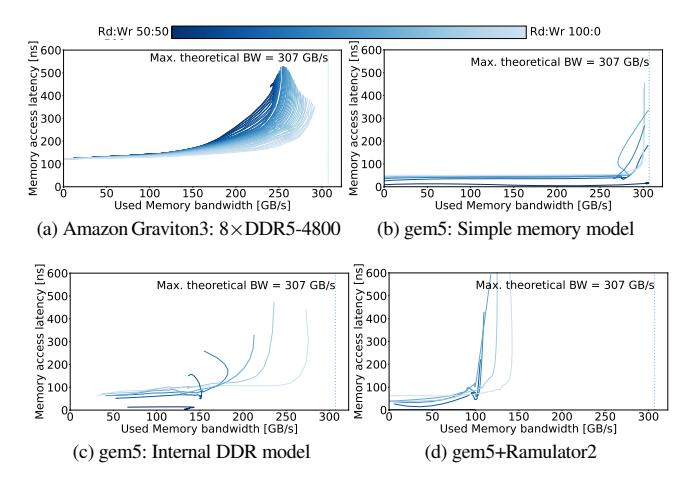

Fig. 4: Memory performance: Amazon Graviton3 server vs. gem5 memory models.

queue model and the internal DDR model. Also it is already connected to Ramulator [23] and DRAMsim3 [22]. To avoid any simulator integration error, we use the ZSim+DRAMSim3 released by the University of Maryland (DRAMSim3 developers) [72], and ZSim+Ramulator from The SAFARI Research Group at the ETH University (Ramulator developers) [73].

Figure 5 compares the Mess bandwidth-latency curves of the actual server with all five ZSim memory simulation approaches. As expected, the fixed-latency memory model provides a constant latency in the whole bandwidth domain. Given that this latency is configured by a user, it can be set to match the unloaded memory latency in the actual system. On the down side, the memory bandwidth provided by this model is unrealistic: the maximum simulated bandwidth is 342 GB/s, which exceeds the maximum theoretical one by  $2.7\times$ . The M/D/1 queues correctly model the memory system behavior in the linear part of the curves. The modeling of the system saturation is less accurate. The queue model does show some difference between read and write memory traffic, but the reported performance does not correspond to the actual system trend in which increasing the write traffic lowers the performance. The internal DDR model correctly emulates the linear and saturated segments of the curves and the impact of the memory writes. However, the simulator underestimates the saturated bandwidth area to 69-93 GB/s, significantly below the 92–116 GB/s measured in the actual system. Also, the simulator excessively penalizes the memory writes which is seen as a wider spread of the curves with a higher write memory traffic. Finally, we detect some unrealistic memory-latency peaks in the low-bandwidth 1-4 GB/s curve segments. The DRAMsim3 shows a similar trend as the M/D/1 queue model in the linear segments of the memory curves, with some latency error, 52-63 ns in the DRAMsim3 versus 89-109 ns in the actual system. The simulator does not model the saturated bandwidth area. Finally, the Ramulator provides a fixed 25 ns latency in the whole bandwidth area and for all memory traffic configurations. Also, similar to the fixed-latency model, the simulated bandwidth is unrealistic, exceeding by 1.8× the maximum theoretical one.

Our evaluation of the memory models and detailed hardware simulators detected major discrepancies w.r.t. the actual memory systems performance. DRAMsim3, Ramulator and Ramulator 2 are considered *de facto* standard for the memory system simulation. All of them are evaluated against the manufacturer's Verilog model and they show no violation of the JEDEC timings [57], [74]. DRAMsim3 is evaluated for DDR3 and DDR4 [22], Ramulator for DDR3 [23], and Ramulator 2 for DDR4 [24]. However, as our results demonstrate, this does not guarantee that the simulators properly model the memory system performance. In Section IV-D, we will use Mess benchmark to analyze some causes of these discrepancies.

#### C. RTL simulators: OpenPiton and Metro-MPI

OpenPiton framework [75] provides an open-source RTL implementation of a tiled architecture based on Ariane RISC-V cores [76]–[78]. Developed in the Verilog RTL, the OpenPiton simulation is slow, especially for large number of cores. We use the OpenPiton simulation accelerated by Metro-MPI [33]. This approach uses Verilator [79] to convert the RTL code of each tile into a cycle-accurate C++ simulation model. Then, all the tiles are simulated in parallel and their interconnect communication is done with the MPI programming interface.

In our experiments, the OpenPiton framework is configured to generate 64-core Ariane architecture which includes 16 KB of 4-way L1 instruction and data cache, and 4MB of 4-way shared L2 cache. The main memory is originally modeled with a single-cycle latency, and it is recently extended with a fixedlatency model [77]. Our Mess measurements confirm that both models deliver the expected load-to-use latency. Also, as expected, we see no difference between read and write memory traffic, leading to a perfect overlap of the curves. The only difference is in the maximum observed memory bandwidth. For a single-cycle memory latency, 100%-read memory traffic achieves 32 GB/s, limited by the memory concurrency of the 64 in-order Ariane cores. Memory writes do not stall the cores, so the achieved memory bandwidth increases with the write memory traffic ratio. Still, a small 2-entry miss status holding registers (MSHR) limits the memory bandwidth to 47 GB/s for 50%-read/50%-write traffic. We detect the same trend for the fixed memory model.

The Mess evaluation of the OpenPiton Metro-MPI resulted in an unexpected discovery: in some experiments we detected significantly higher memory write traffic than anticipated. By analyzing the system behavior for various Mess configurations, we connected the extra memory traffic to the unnecessary eviction of the data from the last-level cache. Instead of evicting only the dirty cache lines, the system was evicting all of them. The source of the error is the coherency protocol generated by the OpenPiton framework. The error was reported to the OpenPiton developers and they confirmed its existence.

#### D. Sources of memory simulation errors

To exclude any simulation error caused by the CPU simulators or their memory interfaces, we perform a **trace-driven DRAMsim3**, **Ramulator and Ramulator 2 simulation**. The detailed Mess

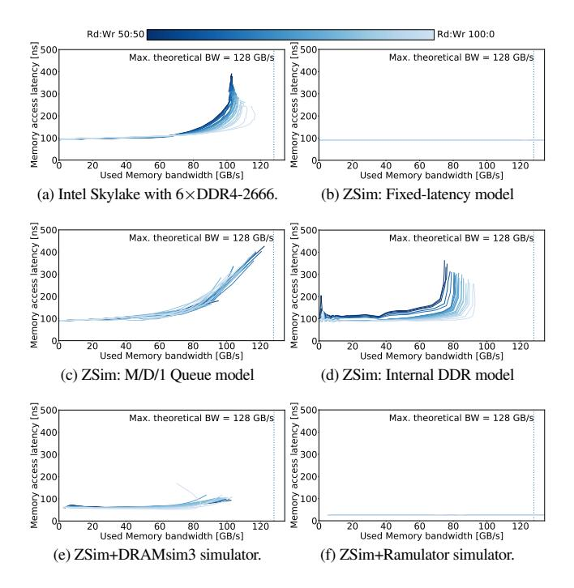

Fig. 5: Memory performance: Intel Skylake server vs. ZSim memory models.

memory traces are collected from its ZSim simulation, and they include the addresses of all memory read and write operations. To account for the timings of non-memory operations, DRAMsim3 traces contain simulation cycles in which the memory requests reach the memory controller, The Ramulator and Ramulator 2 traces include the number of non-memory instructions between the consecutive memory operations. The Mess traces may contain some timings errors w.r.t. actual execution, so the DRAMsim3, Ramulator, and Ramulator 2 simulations may not match the exact bandwidth-latency point. Still, the correct memory simulation should provide data-points that are located on the actual bandwidth latency curves. Figure 6 shows the trace-driven Mess evaluation of DRAMsim3, Ramulator and Ramulator 2. The charts report the round-trip memory access latency from the memory controller, so it is expected that the simulated curves are somewhat below the actual load-to-use measurements.

The trace-driven **Ramulator 2** show the same bandwidth–latency trends as the gem5+Ramulator 2 simulations (see Figure 4(d)). The simulated memory latency is unrealistically low and the maximum simulated memory bandwidth is only 126 GB/s which is less than a half of the 292 GB/s measured in the actual system. This indicates that the main source of the large simulation error is indeed Ramulator 2.

The conclusions are somewhat different for **DRAMsim3** and **Ramulator** as their trace-driven memory bandwidth-latency curves show better general trends than the corresponding Zsim-driven simulations. This indicates that a part of the ZSim+DRAsim3 and ZSim+Ramulator simulation errors reported in Figure 5 is caused by the simulators' interfaces. Our finding is

aligned with the previous studies that report issues in the integration of the event-based CPU simulators with cycle-accurate memory models [49], [80], [81].

However, trace-driven DRAMsim3 and Ramulator also show important discrepancies w.r.t. actual bandwidth–latency curves. **DRAMsim3** simulated latency starts at 68 ns. Apart from the peak at 5 GB/s, the latency increases linearly with the bandwidth. The curves for different read/write ratios are spread and intertwined in whole bandwidth range. Below 70 GB/s the curves with the highest write traffic ratio have the lowest latency. We detect no bandwidth saturation, and all the curves linearly reach the maximum bandwidth of 113 GB/s. **Ramulator** shows a better general trend: roughly-constant latencies below 40 GB/s, a light latency increase until approximately 85 GB/s, and a higher inclination in the final segments of the curves. Still, the latency is unrealistically low, starting at only 25 ns (100%-read traffic, 20–40 GB/s), different read/write curves are spread in all bandwidths, and the saturated behavior differs significantly from the actual one.

To understand better the underlying causes of the trace-driven DRAMsim3 and Ramulator simulation errors, we compare their **row-buffer hit, empty and miss statistics** with to the measurements from the actual Intel platform. We could not perform the same analysis for the Ramulator 2 because its baseline architecture, Amazon Graviton3 with 8×DDR5-4800, does not support the row-buffer measurements. Figure 7 shows a subset of the results for the 100%-read and 50%-read/50%-write memory traffic, which is sufficient to show a general trend. For a 100%-read traffic and low memory bandwidth utilization, the actual system has 84% row-buffer hits, 13% empty buffers and 3% misses. As expected, higher memory bandwidth utilization decreases the hit ratio, and increases the empty pages and misses. Also, as we increase the write traffic, the row-buffer utilization degrades, compare Figure 7(a) and 7(b).

DRAMsim3 shows a very different behavior. In most of the experiments, we measure 84-93% row-buffer hit rate with 7-16% of the misses. We detect the highest hit-rates for the dominantlyread and dominantly-write traffic, while intermediate read/write ratios have lower values. These hit-rates match the vertical spread we see in the DRAMsim3 bandwidth-latency curves for low and medium bandwidths (80 GB/s). The curves with high hit-rates have the lowest latencies. For the curves with lower hit-rates, the latency increase by up to 20 ns. In 2 GB/s DRAMsim3 experiments some of the read/write ratios have a surprisingly low row-buffer hitrates (< 35%), perfectly matching the Figure 6(b) memory latency peak at this bandwidth data-point. The Ramulator row-buffer statistics resemble better the actual measurements, see Figure 7. Still we detect some discrepancies that, interestingly, have similar trends as the DRAMsim3 results. Again, we detect the highest hitrates for the dominantly-read and dominantly-write traffic, while intermediate read/write ratios have lower values. For > 40% write traffic, Ramulator hit-rates greatly exceed the actual ones in the whole bandwidth range (Figure 7(b)). As in DRAMsim3, these hit-rates closely match the vertical spread of the Ramulator latency simulations.

Comparison of the **actual platform** row-buffer statistics and the latency measurements resulted in an interesting finding. For low and moderate bandwidth utilization (<70 GB/s), the write

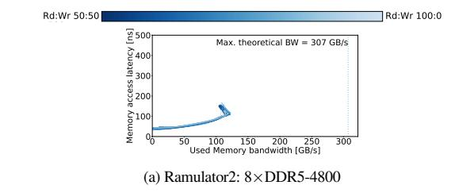

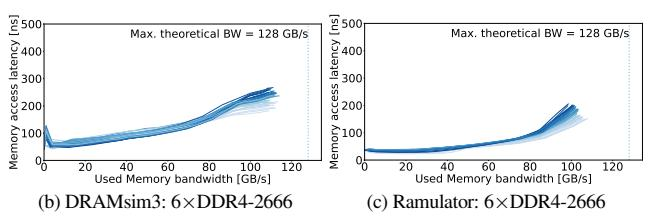

Fig. 6: Memory performance: Trace-driven cycle-accurate simulators.

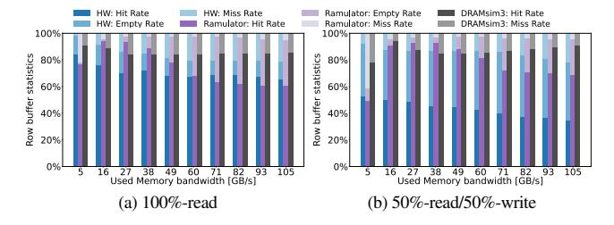

Fig. 7: Row buffer statistics: Actual hardware vs. DRAMsim3 vs. Ramulator.

traffic increase leads to a notably worse row-buffer utilization, but this does not translate into higher memory access latencies. It seems that the actual system is capable to mask the row-buffer contentions and delays. We do not see this behavior in the DRAMsim3 and Ramulator simulations. Overall, our analysis of the row-buffer statistics and its correlation with the bandwidth—latency curves provides some first steps in the analysis of the memory simulation errors. We believe that our work and publicly-released Mess benchmark will motivate the community to continue this exploration.

The memory access pattern has a significant impact on the row-buffer utilization and the overall memory system performance. The Mess benchmark concurrently executes random-access pointer-chase and the multi-process memory traffic generator. Each process traverses two arrays, one with load and one with store operations. Each array is accessed sequentially, but, the overall memory access pattern is complex due to the concurrent traversal of tens of distinct arrays located in main memory. Mess traffic generator can be easily extended to cover different array access patterns. Some of these patterns are strided access, e.g. targeting a new row-buffer in each operation, or the random access, e.g. the RandomAccess test in HPC Challenge benchmark developed to measure Giga Updates Per Second (GUPS) in a system [82].

#### V. MESS SIMULATOR

In this section we will present the Mess analytical memory system simulator and show how it significantly improves the memory simulation accuracy and enables a quick adoption of new memory technologies in hardware simulators.

#### A. Design

The CPU and memory simulators are typically connected in the following way: the CPU simulator issues the memory operations and the memory simulator determines their latencies. The Mess simulator does this analytically based on the application's position in the memory bandwidth–latency curves. This process is complex due to the inherent dependency between the memory system latency, timings of the memory operations and all dependent instructions, and the generated memory bandwidth. We simplify the problem by designing the Mess simulator not to compute the exact memory latency for a given memory traffic, but to detect and correct discrepancies between the memory access latency and the simulated bandwidth. This approach, together with the fundamental principle of application's position in the memory bandwidth-latency curves, enables the Mess simulator to surpass the accuracy of all other memory simulators, while remaining simple and fast. The only memory system parameter required by the Mess model is the family of the bandwidth-latency curves. The curves can be measured on the actual hardware (Section III) or can be provided by the manufacturers, e.g. based on their detailed hardware model, as we will discuss in Section V-C.

The Mess simulator acts as a feedback controller [83] from classical control theory [84], illustrated in Figure 8. The simulation can start from any memory access latency, e.g. the unloaded one. This latency is used by the CPU simulator which generates memory reads and writes. The Mess simulator observers this simulated memory bandwidth, positions it at the corresponding memory bandwidth—latency curve, and controls whether it coincides with the memory latency used in the CPU simulation. If this is not the case, the memory latency is being adjusted with an iterative process we describe later.

The control process is performed at the end of each simulation window, which, in our experiments, comprises 1000 memory operations. This is much smaller than the length of the application phases [66], so the transition error between different application phases has a negligible impact on the simulator's accuracy.

Figure 9 describes one iteration of the Mess simulator control loop. For simplicity, the figure shows a single bandwidth–latency curve. We start with the Mess estimate of the application's bandwidth–latency position in the  $i^{th}$  simulation window,  $(messBW_i, Latency_i)$  1. The curve is selected based on the read/write ratio of the simulated memory traffic, and the x-axis position is determined by  $messBW_i$ . From that point on, all the issued memory requests are simulated with  $Latency_i$ . At the end of the simulation window, the Mess simulator monitors the simulated memory bandwidth,  $cpuBW_i$  2, and compares it with the  $messBW_i$  estimated at the beginning of the window 3.

If the simulation is in a steady-state and the application did not change its behavior, there will be no major difference between  $cpuBW_i$  and  $messBW_i$ . This confirms the consistency in the

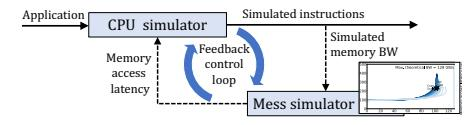

Fig. 8: Mess feedback control loop adjusts the simulated memory access latency.

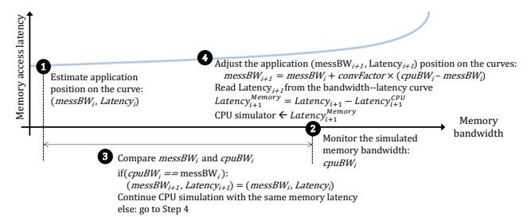

Fig. 9: One control loop iteration: Mess simulator monitors the simulated memory bandwidth,  $cpuBW_i$ , and compares it with the  $messBW_i$  estimated at the beginning of the simulation window. If a major difference is detected, the Mess simulator adjusts the application position in the bandwidth–latency curves.

simulated memory access latency, the CPU timings and the achieved memory bandwidth. Therefore, the CPU simulation in the next window will continue with the same memory latency.

Otherwise, a difference between  $cpuBW_i$  and  $messBW_i$  suggests inconsistent simulated memory latency and bandwidth. This can happen, for example, if the application changes its behavior. Figure 9 illustrates the case in which the application increases the frequency of memory request leading to the higher bandwidth:  $cpuBW_i > messBW_i$  3. In this case, the simulated memory bandwidth  $cpuBW_i$  does not correspond to the memory  $Latency_i$ used in the CPU simulation. To address this inconsistency, the Mess simulator adjusts the predicted application position in the bandwidth-latency curves. The objective of this adjustment is not to reach the correct (BW, Latency) position in a single iteration. The next Mess estimate,  $(messBW_{i+1}, Latency_{i+1})$ , will be positioned in-between  $messBW_i$  and  $cpuBW_i$  **4**. The exact position is determined based on the user-defined convergence factor:  $messBW_{i+1} = messBW_i + convFactor \times (cpuBW_i - convFactor)$  $messBW_i$ ). The approach is based on the proportional-integral controller mechanism from control theory [83], [84]. Finally, the Mess uses  $messBW_{i+1}$  to read the  $Latency_{i+1}$  from the corresponding bandwidth–latency curve. The  $Latency_{i+1}$  is a loadto-use latency. This includes the time spent in the CPU cores, cache hierarchy and network on chip, already considered in the CPU simulation. In the final step, the  $Latency_{i+1}$  is adjusted by these CPU timings  $Latency_{i+1}^{Memory} = Latency_{i+1}^{CPU}$ . The next simulation window starts with the Mess providing the updated  $Latency_{i+1}^{Memory}$  to the CPU simulator.

#### B. Evaluation

The Mess simulator is integrated with ZSim and gem5, and evaluated against the actual hardware. We compare the simulated and actual bandwidth–latency curves as well as the performance of memory-bound benchmarks: STREAM [5], LMbench [8], and Google multichase [9].

1) ZSim: Figure 10 shows the DDR4, DDR5 and HBM2 bandwidth-latency curves measured with the ZSim connected to the Mess simulator.3 The configurations of the simulators match the actual Intel Skylake with 24-core and six DDR4-2666 memory channels. The simulated Mess curves, depicted in Figure 10(a), closely resemble the actual memory systems performance (Figure 3(a)). The simulation error of the unloaded memory latency is below 1%, and it is around 3% for the maximum latencies. The difference between the simulated and the actual saturated bandwidth range is only 2%. Figures 10(b) and 10(c) show the ZSim+Mess simulation results for the high-end DDR5 and HBM memories. To saturate the 8-channel DDR5-4800 and 32-channel HBM2, we increase the number of simulated cores to 58 and 192, respectively. Again, the simulated bandwidth–latency curves closely resemble the performance of the corresponding actual memory systems (Figures 3(g) and 3(e)).

Figure 11 shows the evaluation results, w.r.t. to the actual Intel Skylake server, of all six ZSim memory models when running memory intensive STREAM [5], LMbench [8] and Google multichase [9]. The simulation errors are closely correlated with the similarity between the simulated and actual bandwidth–latency curves. The Mess shows the best accuracy with only 1.3% average error, followed by the M/D/1 and internal DDR model. The fixed-latency simulation and Ramulator show the highest errors of more than 80%. The Mess simulator is also fast. It increases the simulation time by only 26% higher w.r.t. a simple fixed-latency memory, and it is 2% and 15% faster than the M/D/1 and internal DDR model. The ZSim+Mess simulation speed-up over the ZSim+Ramulator and ZSim+DRAMsim3 is 13× and 15×.

2) gem5: Figure 12 shows the DDR5 and HBM2 bandwidth—latency curves simulated with the gem5 connected to the Mess memory simulator. In all experiments, the gem5 is configured to model Graviton 3 cores [62] described in Section IV-A. To reduce simulation time, we simulate 16 CPU cores connected to a single memory channel.4 The simulated bandwidth—latency curves, when scaled to eight DDR5 channels or 32 HBM2 channels, closely resemble actual system behavior (Figures 3(e) and 3(g)).

We also evaluate the Mess memory simulation against the gem5's built-in simple memory model and internal DDR5 model as well as cycle-accurate Ramulator2 when running STREAM, LMbench, and Google Multichase benchmarks. In these experiments we simulate a whole server comprising 64 Graviton 3 cores and 8×DDR5-4800, and compare the results against the benchmark executions on the actual server. The gem5+Mess simulation time is practically the same as the gem5 internal DDR model, while it provides much better accuracy. The Mess memory simulator decreases the average error from 30%

3The Mess simulator also supports the Intel Optane technology. Optane's bandwidth–latency curves are measured on a 16-core Cascade Lake server with 6×DDR4-2666 16 GB and 2×Intel Optane 128 GB memory in App Direct mode. Intel Optane technology is discontinued since 2023, so we do not analyze its performance characteristics and simulation.

4Simulation of a whole server comprising 64 Graviton 3 cores and 8×DDR5-4800 requires more than five hours to obtain a single bandwidth–latency datapoint. The full simulation of all the curves would require more than a year.

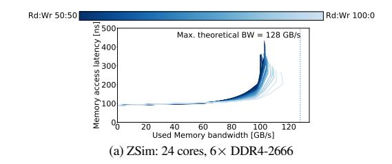

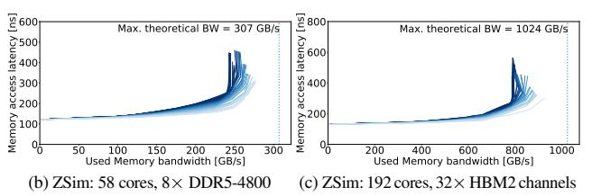

Fig. 10: ZSim with the Mess simulator closely matches the actual memory systems.

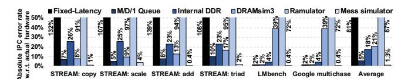

Fig. 11: The ZSim+Mess simulation error for STREAM, LMbench and Google multichase is only 1.3%.

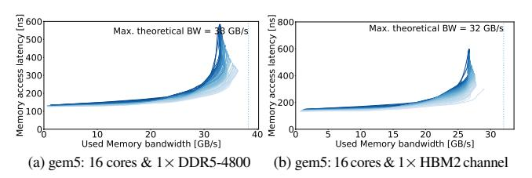

Fig. 12: gem5 with the Mess simulator, when scaled, closely follows the actual memory system curves (Figures 3(e) and 3(g)).

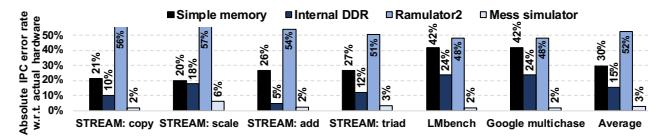

Fig. 13: The gem5+Mess simulation error for STREAM, LMbench and Google multichase is only 3%.

(gem5 simple memory model), 15% (internal DDR5 model), and 52% (Ramulator 2) to only 3%. Such a low error is unprecedented in any prior validation attempts [85]–[88].

#### C. Simulation of novel memory systems: CXL memory expanders

The memory system complexity and the scarcity of publicly-available information often result in a considerable gap between a technology release and the support for its detailed hardware simulation. For example, public memory simulators started to support the DDR5 in 2023 [24], three years after production servers with DDR5 DIMMs hit the market.

The Mess simulator provides a fundamental solution for this gap because it can simulate emerging memory systems as soon as their bandwidth–latency curves are available. For memory technologies available on the market, the curves can be measured on a real platform. For emerging memory devices that are not yet available in off-the-shelf servers, the bandwidth–latency curve can be measured on a developer board with a prototype of the new device, or alternatively it can be provided by the manufacturers, e.g. based on their detailed proprietary RTL models.

We will demonstrate the Mess simulation of novel memory systems with an example of the Compute Express Link (CXL) memory expanders. CXL is an emerging interconnect standard for processors, accelerators and memory devices. The CXL memory expanders enable a straightforward enlargement of the memory system capacity and bandwidth, as well as the exploration of unconventional disaggregated memory systems [34]. One of the main limitations for an academic research in this field, however, is the lack of reliable performance models for these devices.

The Mess simulation is performed with the CXL memory expanders bandwidth–latency curves provided by the memory manufacturer based on their detailed hardware model. In particular, we model a CXL memory expander connected to the host via the CXL 2.0 PCIe 5.0 interface with 1×8 Lanes. The device comprises one memory controller connected to a DDR5-5600 DIMM with two ranks. All the CXL modules, Front end, Central controller and Memory controller, are implemented in SystemC. The modules communicate by using the manufacturer's proprietary SystemC Transaction Level Modeling (TLM [89]) framework,

The obtained bandwidth-latency curves are shown in Figure 14(a).5 The figure plots the round-trip latency from the CXL host input pins. To consider a full load-to-use latency, a user should add the round-trip time between the CPU core and the CXL host. We measure this latency component with the Intel MLC [11]. The CXL memory expanders show a similar performance trends as the DDRx or HBM memory systems: latency that increases with the system load, significant non-linear increase after a saturation point, and the impact of the traffic read/write ratio. One major difference is that the CXL interface provides the best performance for a balanced reads and writes traffic, while its performance drops significantly for the 100%-read or 100%-write traffic. This is because, unlike the DDRx interfaces, CXL is a full-duplex interconnect with independent read and write links. Therefore, the CXL can transmit simultaneously in both directions, but in the case of the unbalanced traffic one CXL transmission direction could be saturated while other direction is negligibly used.

We use the obtained CXL memory bandwidth–latency curves in the Mess simulator integrated with ZSim, gem5 and OpenPiton Metro-MPI (see Figure 14). In all configurations, the Mess simulator closely follows the Manufacturer's SystemC model. To reduce long OpenPiton Metro-MPI simulation time, we model only 25 curves with a small number of experimental points in each curve. For this reason some segments of the curves are discrete. Nevertheless, the OpenPiton Metro-MPI simulations

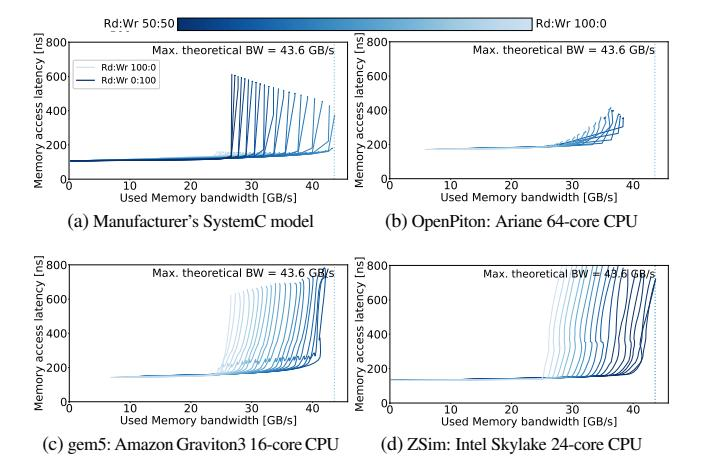

Fig. 14: Bandwidth–latency curves of the CXL memory expander. Mess simulator closely follows the Manufacturer's SystemC model.

match the general trend and the saturated bandwidth range of the manufacturer's curves. The maximum latency range is below the manufacturers CXL curves because the simulated small in-order Ariane cores with only 2-entry MSHRs cannot saturate the target memory system. This behavior is already detected and discussed in Section IV-C. ZSim and gem5 results practically match the manufacturer's CXL curves.

#### VI. MESS APPLICATION PROFILING

The Mess framework also enhances the memory-related application profiling. We demonstrate this functionality with the Mess extension of Extrae and Paraver, production HPC performance tools for detailed application tracing and analysis [36]. The Mess application profiling adds a new layer of information related to the application's memory performance metrics. This information can be correlated with other application runtime activities and the source code, leading to a better overall understanding of the application's characteristics and behavior.

#### A. Background: Extrae and Paraver

Paraver is a flexible data browser for application performance analysis [91], [92]. It can display and analyze application MPI calls, duration of the computing phases, values of the hardware counters, etc. Paraver can also summarized application behavior in histograms and link it with the corresponding source code. The input data format for Paraver is a timestamped trace of events, states and communications [93]. For parallel applications, the traces are usually generated with the Extrae tool [94].

Extrae automatically collects entry and exit call points to the programming model runtime, source code references, hardware counters metrics, dynamic memory allocation, I/O system calls, and user functions. It is is compatible with programs written in C, Fortran, Java, Python, and combinations of different languages. It supports a wide range of parallel programming models. Extrae is available for most UNIX-based operating systems and it is deployed in all relevant HPC architectures, including CPU-based systems and accelerators.

&lt;sup>5The maximum theoretical bandwidth of the CXL.mem protocol is influenced by the read/write ratio of the workload [90]. In this figure, we present the highest value among all possible scenarios.

#### *B. Use cases*

We illustrate the capabilities of the Mess application profiling with an example of the memory-intensive HPCG benchmark [7], [95] running in a dual-socket Cascade Lake server (Table I). We fully utilize the one CPU socket by executing 16 benchmark copies, one on each core. Extrae monitors the application memory behavior with a dedicated profiling process which traces the memory bandwidth counters. The sampling frequency is configurable, and it is 10 ms by default. Even with this fine-grain profiling, the introduced overhead is negligible, below 1%.

The extended Paraver tool correlates the application memory bandwidth measurements with Mess memory curves. The application measurements are plotted on the curves as a set of points, each of them corresponding to 10 ms of the application runtime. The application memory use can be also incorporated into the Paraver trace file, so a user can analyze its evolution over time, and correlate it with other application's behavior and the source code.

*1) Bandwidth–latency curves:* Figure 15 depicts the Mess profile of the HPCG benchmark. Most of the HPCG execution is located in the saturated bandwidth area, above 75 GB/s. Sporadically, the benchmark even reaches the maximum sustained bandwidth with peak memory latencies in the range of 260–290 ns. Also, each HPCG point on the curves is associated with a memory stress score. The score value ranges from 0, for the unloaded memory system, to 1, corresponding to the right-most area of the bandwidth–latency curves. Memory stress score in a given point is calculated as a weighted sum of the memory latency and the curve inclination. The latency itself is a good proxy of the system stress, while the inclination shows the memory system sensitivity to a bandwidth change. Gentle inclination indicates that a memory bandwidth change would have a minor impact on the memory access latency and the overall performance. In the steep curve segments, e.g. 95–100 GB/s area in Figure 15, small bandwidth changes can rapidly saturate the memory system leading to a major latency increase. The Mess extension of Paraver already includes the stress score visualization with a green–yellow–red gradient that can be easily interpreted by application developers.

*2) Timeline analysis:* Once the memory stress score is incorporated into the application's Paraver trace, it can be combined with other aspects of the application analysis, as illustrated in Figure 16. The figure analyzes around two seconds of the HPCG runtime, from 241,748,818µs to 243,728,242µs (x-axis). Guided by the sequence of MPI calls illustrated in Figure 16 (top), we identify the application's main iterative loop and, using MPI Allreduce (pink) as delimiter, we select two iterations for our analysis. The middle Figure 16 analyzes compute applications phases. The color gradient corresponds to the compute phase length: green to blue gradient for short to long phases. Figure 16 (bottom) shows the memory stress score for this region. The longest compute phases (blue) exhibits two distinct memory behaviors: at the start of the phase, the memory stress score rises to 0.71, and then halfway through the phase it decreases to 0.64. The fine-grain application profiling can detect different memory stress score values even within a single compute phase.

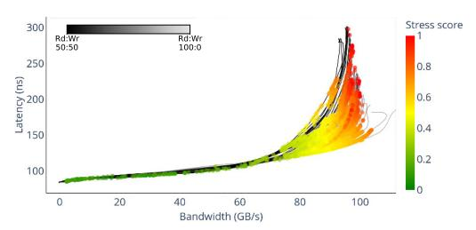

Fig. 15: Most of the HPCG execution is located in the saturated bandwidth area, above 75 GB/s. The Mess application-profiling extension of Paraver already includes the memory stress score visualization with a green–yellow–red gradient.

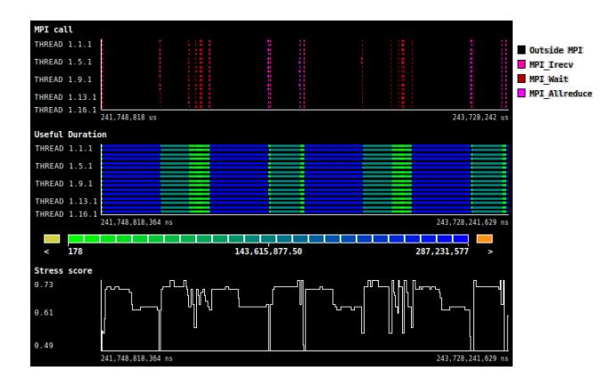

Fig. 16: Timeline showing two iterations of the HPCG benchmark with MPI calls (top), computations duration (middle) and memory stress score (bottom).

*3) Links to the source code:* Extrae also collects callstack information of the MPI calls, referred to as the MPI call-points,6 which are used to link the application runtime behavior with the source code. With the Mess application-profiling extension of Paraver, the application source code can be linked to its memoryrelated behavior. This is fundamental for making data placement decisions in heterogeneous memory systems, e.g. comprising DDRx DIMMs and HBM devices [96], [97].

#### VII. RELATED WORK

Mess framework provides a unified view of the memory system performance that covers the memory benchmarking, simulation and application profiling. Although these three memory performance aspects are inherently interrelated, they are currently analyzed with distinct and decoupled tools.

