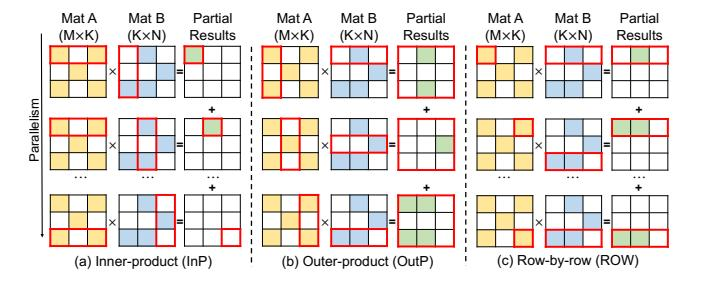
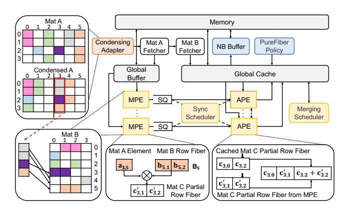
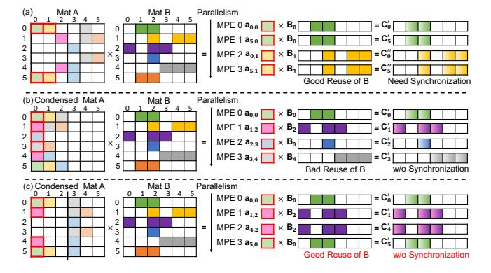
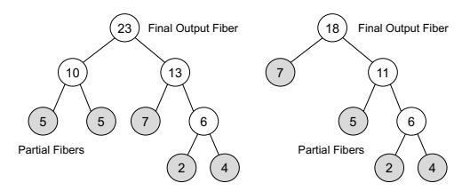
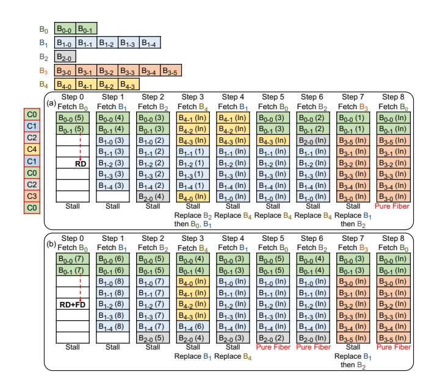
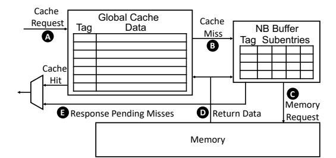

# 1 Introduction

Sparse matrix-matrix multiplication (SpMM) is a computational process where two sparse matrices are multiplied. SpMM is a cornerstone in scientific simulations [7], linear algebra [44, 57], graph analytics [5, 6, 8, 24, 47, 59], and the rapidly evolving fields of deep learning [14, 19, 20, 33, 42]. Its crucial role in efficiently processing large-scale data structures and complex algorithms makes the effective acceleration of SpMM not just a computational challenge, but a key enabler in advancing researches and applications in these diverse and impactful domains.

The processing efficiency of SpMM is heavily influenced by the characteristics of the input sparse matrices. The high proportion of zero elements in these matrices leads to challenges such as low utilization of computational and memory resources. These irregular sparse patterns, coupled with unpredictable memory access patterns, present significant obstacles for conventional cache-based computing architectures, which are typically optimized for dense and regular

∗Both authors contributed equally to this research.

data patterns. As a result, SpMM often becomes a performance bottleneck, particularly in an era where processing large datasets is increasingly crucial [15]. Given the critical role of SpMM in various computational domains, developing specialized accelerators to enhance SpMM performance is important.

Existing SpMM accelerators predominantly utilize fixed execution flows, such as inner-product (InP) [22, 45], outerproduct (OutP) [43, 61], or row-by-row (ROW) [50, 60], each tailored to optimize either input or output data reuse. However, the efficiency of each execution flow is determined by sparse patterns, resulting in inconsistent performance across different sparse matrices. For instance, in InP, the sparse pattern critically influences the index intersection between the two input matrices, affecting input data fetching efficiency. In OutP, the sparse pattern determines the size of the resulting partial matrices, making output data reuse optimization crucial. In the case of ROW, the distribution of non-zeros in the input matrices influences the effectiveness of input data reuse, impacting overall data access efficiency. This variability in performance due to differing sparse patterns underscores the need for SpMM execution flow that can dynamically adapt to optimize performance across a range of matrix structures.

Additionally, the existing SpMM accelerators exhibit limited capabilities in exploiting the inherent parallelism in SpMM, leading to several inefficiencies. First, the inherent dependencies in the execution flow can lead to a collective dependency of hardware processing elements (PEs) on completing a batch of tasks. In other words, multiple PEs processing the same batch must wait for all tasks to be completed before proceeding, typically leading to the underutilization of PEs and prolonged pipeline latency. Second, synchronization challenges [50] frequently arise in existing accelerators, especially when multiple mergers are tasked with working on the same region of the output matrix. In such situations, the mergers must carefully sequence their work to ensure both the correctness and coherence of the merging process. Therefore, the merge process, responsible for consolidating the multiplication results, often becomes a bottleneck due to the need for synchronization. These inefficiencies impede the effective utilization of hardware resources and limit the overall performance of SpMM operations. This underscores the need for designs that better align execution flows with the architecture, enhance fine-grained parallelism, and mitigate the synchronization overhead, thereby maximizing the potential of parallel processing.

Furthermore, cache performance is crucial for the efficiency of SpMM accelerators, but is often overlooked. Conventional cache replacement policies used in SpMM accelerators [32, 60, 61] aim to reduce the number of cache misses but overlook the importance of concurrency. In SpMM operations, it is common for multipliers to request cache lines of a row or column concurrently. This concurrency means

that even a single cache miss can cause delays in the entire processing chain. Moreover, the design of caches in current accelerators does not incorporate non-blocking features. As a result, a single cache miss causes delays in subsequent accesses, thereby exacerbating performance bottlenecks. These challenges underscore the pressing need for advanced cache optimizations in SpMM accelerators. Such optimizations must be tailored to efficiently handle the unique access demands of SpMM, considering concurrent accesses and ensuring non-blocking cache operations to optimize the overall performance of the accelerator.

In this paper, we introduce ACES, an innovative accelerator for SpMM, specifically designed to dynamically adapt its execution flow to accommodate varying sparsity patterns, optimize parallel execution, and implement localityconcurrency co-optimizations for on-chip cache. ACES has the following unique features.

- Adaptive execution flow. ACES is equipped with an adaptive execution flow that intelligently adjusts to varying sparsity patterns of input matrices. This adaptability is achieved through a spectrum of condensing degrees, implemented with minimal overhead and without altering the original encoding formats of the matrices. This ensures optimal performance across diverse matrix structures.
- Balanced data reuse and synchronization. ACES considers the reuse of input data and the synchronization needed for merging partial output results from each execution flow. By balancing memory access behavior with parallelism, it selects the most suitable condensing degree for various sparse patterns, enhancing efficiency.
- Concurrency-aware cache management. ACES employs PureFiber, a concurrency-aware cache replacement policy, to optimize cache management. This policy accounts for both reuse distance and potential concurrent accesses, aiming to minimize total stalls caused by cache accesses.
- Non-blocking buffer integration. ACES incorporates a non-blocking buffer to manage cache miss accesses, ensuring that cache misses do not significantly disrupt subsequent accesses, thereby improving data access concurrency.
- Tailored hardware architecture. The hardware architecture of ACES is specifically designed to complement its adaptive execution flow and cache optimizations. The architecture dedicates an addition processing element (APE) to each multiplication processing element (MPE), providing fine-grained parallelism and minimizing inter-PE dependencies.

We evaluate ACES against three state-of-the-art SpMM accelerators, including SIGMA [45], SpArch [61], and SPADA [32], across a variety of workloads with diverse sparse patterns.

Figure 1. Examples of three execution flows: (a) innerproduct, (b) outer-product, and (c) row-by-row.

Overall, ACES not only consistently provides optimal performance across all workloads, with average speedups of 25.5× over SIGMA, 8.9× over SpArch, and 2.1× over SPADA, but also achieves this with the lowest area cost, further underscoring its efficiency and innovation in SpMM acceleration.

## 2 Background

#### 2.1 Execution Flows for SpMM

The multiplication of two sparse matrices involves specific execution flows, dictating how the matrices are accessed and processed. The three primary execution flows in SpMM are InP [22, 45], OutP [43, 61], and ROW [50, 60]. Figure 1 demonstrates how matrices A and B are multiplied to produce output matrix C using each execution flow. Each execution flow exhibits distinct characteristics in terms of input and output reuse, index intersection efficiency, and synchronization requirements.

InP computes each element of matrix C by calculating the inner product of a corresponding row of matrix A and a column of matrix B. InP achieves full reuse of matrix C, as all partial results for each element are immediately accumulated. Additionally, InP allows multiple PEs to compute different elements of the output matrix simultaneously, thus minimizing synchronization issues. However, it faces challenges in efficiently reusing matrix B, since each column of matrix B must be refetched multiple times for every row in matrix A. Moreover, InP often encounters inefficiencies in index intersection due to the sparsity of matrices A and B. When fetching an entire row of A and an entire column of B for computation, only non-zero elements with matching indices contribute to C. Given the sparsity, many fetched elements lack matching indices, leading to numerous redundant operations. This inefficiency is exemplified in Figure 1(a), where the index intersection between the last row of matrix A and the last column of matrix B is illustrated.

OutP computes the outer product of a row of matrix A with a column of matrix B, forming one partial matrix of C at a time. These partial matrices are subsequently merged to produce the final output matrix C. OutP allows for efficient reuse of the input matrices, as each row of A and each column of B are fetched only once. Additionally, OutP mitigates

the inefficiencies in index intersection seen in InP, since only entirely zero columns of A and rows of B do not contribute to the output, a scenario that is relatively rare. However, OutP faces challenges in managing the size and number of partial output matrices, particularly when dealing with matrices that have highly irregular sparsity patterns. The cumulative size of all partial matrices often surpasses that of the final output matrix, leading to significant memory traffic and computational complexity during the merging process. This issue becomes even more pronounced when handling large matrices, where the memory and computational demands are substantially increased. Furthermore, when multiple PEs are involved in generating and merging these partial matrices, synchronization becomes necessary to ensure a correct merging process. A large number of synchronization requirements can significantly limit the efficiency of the accelerator and the utilization of PEs.

ROW operates based on row-wise partitioning of the input matrices. For each row C of the output matrix C, ROW calculates the result by merging the scalar-vector products of each non-zero element , in row A with the corresponding row B of matrix B. ROW generates and stores partial results for a single output row at a time, enabling efficient on-chip management and good reuse of matrix C. In terms of index intersection between the two input matrices, ROW is efficient, as it fetches only those pairs of non-zeros that are already matched. However, ROW faces challenges in efficiently reusing the rows of matrix B due to irregular access patterns driven by the non-zero distribution in matrix A. Moreover, when PEs work concurrently to generate partial results for the same output row, synchronization becomes necessary, as depicted in Figure 1(c), potentially creating bottlenecks in highly parallel systems.

While conventional execution flows in SpMM provide distinct characteristics to matrix multiplication, there is no universally optimal solution. The complexity of handling highly irregular sparsity patterns, coupled with the demands of parallel computing, underscores the need for innovative, adaptive execution flows that can efficiently balance data reuse, index intersection, and parallelism.

#### 2.2 SpMM Accelerators

SIGMA [45] is an InP-based SpMM accelerator that enhances index intersection efficiency through a bitmap format for sparse matrix representation. This format ensures that only essential computations are conducted. Additionally, SIGMA employs flexible interconnections among PEs to optimize their utilization. SpArch [61] adopts an OutP execution flow for SpMM, specifically focusing on enhancing the efficiency of the merging process. It proposes an aggressively condensed matrix representation for matrix A, which reduces the number of partial matrices produced during multiplication but may compromise input reuse. Additionally, SpArch integrates a high-radix merger, pipelining the production

and merging of partial matrices. SPADA [32] inherits ROW and introduces a window-based adaptive (WA) execution flow to effectively adapt SpMM to various sparse patterns, thereby addressing the limitations of traditional fixed execution flows. The specialized hardware architecture of SPADA includes multiple multipliers, which are responsible for concurrently executing scalar-vector multiplications within a WA window. However, WA introduces a collective dependency among the multipliers. This dependency dictates that a multiplier can only proceed to the next window once all the multiplication tasks in the current window are completed.

#### 2.3 Challenges and Opportunities

SpMM accelerators with fixed execution flows, such as SIGMA [45] and OuterSPACE [43], have introduced innovations in accelerating SpMM. However, they also encounter challenges due to the limitations of their fixed execution flows. In contrast, the WA execution flow of SPADA [32] offers an innovative approach to adapt to diverse sparse patterns. However, WA relies on collective dependencies among multipliers for coordinated execution, which, while essential, introduces potential bottlenecks in hardware parallelism. This dependency can limit the efficiency and scalability of the system, especially in cases where high parallel processing is required.

Moreover, the performance of on-chip caches presents a significant challenge in the context of concurrent data demands inherent in SpMM operations. Current accelerators [32, 60, 61] optimize cache performance on data locality. However, data concurrency is equally important [36, 38, 46, 52]. Effective cache management should consider data locality and concurrency together. In addition, the on-chip cache should handle cache misses in a non-blocking manner, allowing the cache to continue servicing other requests efficiently. The non-blocking design could enhance the data concurrency and reduce computational stalls.

Leveraging insights from the existing accelerators and the characteristics of SpMM, ACES differentiates itself with an adaptive execution flow that balances data reuse and parallelism, which effectively overcomes the limitations of fixed execution flows and the collective dependencies of WA. Furthermore, ACES emphasizes the co-optimizations of locality and concurrency in on-chip cache design and management. We introduce the details of ACES in the subsequent section.

#### 3 ACES Architecture

#### 3.1 Overview of ACES

Figure 2 presents an overview of ACES, an accelerator designed for efficient SpMM. The key components of ACES consist of a condensing adaptor to dynamically determine the execution flow; multiple PEs, including MPEs for handling multiplications and APEs for merging partial results; two schedulers (synchronization scheduler and merging scheduler) that adaptively distribute tasks across APEs; and a

Figure 2. Overview of ACES.

global cache, which is integrated with a non-blocking buffer (NB buffer) to organize a non-blocking cache system. These components synergize to build the key features of ACES: an adaptive execution flow, a tailored hardware architecture, and advanced locality-concurrency co-optimizations in cache management.

Adaptive execution flow. ACES incorporates a condensation adapter that dynamically tunes the condensed matrix representation for matrix **A** to optimize the execution flow, as depicted in the top left of Figure 2. This feature allows for flexibility in handling varying sparsity patterns of matrix **A** (more details in Section 3.2). A fetcher for matrix **A** retrieves elements from the condensed columns, placing them in a global buffer, specifically designed as a lightweight buffer to store elements of matrix **A**, while another fetcher fetches necessary rows of matrix **B** into the global cache.

Tailored hardware architecture. ACES employs parallel computing, utilizing MPEs and APEs to support its adaptive execution flow (detailed in Section 3.3). Each MPE, illustrated in the bottom left of Figure 2, loads a distinct non-zero element from the condensed column of matrix A and a corresponding row from matrix B. These MPEs execute scalarvector multiplications in parallel, as shown in the bottom middle of Figure 2. In conjunction with each MPE, each APE independently performs immediate merging of the partial output rows produced by the MPE with the corresponding partial result stored in the global cache, as demonstrated in the bottom right of Figure 2. A synchronization scheduler is designed to mitigate synchronization conflicts between APEs when processing immediate merging (more details in Section 3.4). After completing all multiplication operations, the APEs, under the coordination of a merging scheduler (detailed in Section 3.4), engage in the final merging stage to merge the remaining partial results into the final output

**Locality-concurrency co-optimizations for global cache.** The global cache in ACES is a critical component, designed to efficiently manage both matrix **B** rows and matrix **C** partial output rows. The PureFiber cache replacement policy is

Figure 3. Three execution flows with different condensing degrees: (a) w/o condensing, (b) aggressive condensing, and (c) moderate condensing.

employed to manage cache lines effectively by considering both data locality and concurrency (more details in Section 3.5). The integration of a NB buffer in the global cache (more details in Section 3.6) supports the PureFiber policy and enhances performance by facilitating non-blocking accesses.

#### 3.2 Adaptive Execution Flow

Inspired by ROW, in ACES, each MPE is tasked with a scalarvector multiplication, involving a single non-zero element from matrix A and the corresponding row in matrix B. This design addresses the inefficiencies of index intersection in InP and reduces the collective dependency among MPEs. Moreover, generating partial results at row granularity offers several advantages. It supports immediate merging, which pipelines both multiplication and merging processes. Additionally, it alleviates the challenges in OutP, where transferring entire partial matrices during the merging stage can significantly increase memory traffic. However, the ROW method compromises the reuse of matrix B, as non-zero elements from the same row of matrix A are often processed concurrently by MPEs, leading to requests for different rows of matrix B. To optimize the reuse of matrix B, we traverse the non-zero elements of matrix A column by column, similar to OutP. Figure 3(a) demonstrates this execution flow when no condensing is applied to matrix A. While this execution flow enhances the reuse of matrix B, it can also lead to multiple MPEs generating partial results for the same output matrix row, particularly when matrix A has high sparsity. This situation introduces synchronization challenges among APEs during the immediate merging.

An aggressive condensed matrix representation for matrix A involves shifting all non-zero elements to the leftmost columns, which results in much denser condensed columns. Despite condensation, each non-zero element retains a record of its original column index to ensure computational accuracy [61]. With the aggressive condensed matrix representation, traversal of non-zero elements of matrix A

occurs through condensed columns, impacting the execution flow of SpMM. In terms of implementation, matrix A is stored in the CSR format, where each row is an ordered list of column indices. The elements sharing the same index in each ordered list are fetched and assigned to MPEs for parallel computing. As shown in Figure 3(b), when four MPEs concurrently perform scalar-vector multiplications using elements from a condensed column of matrix A and corresponding rows from matrix B, the potential for reusing rows from matrix B diminishes due to simultaneous requests for different rows. However, aggressive condensing often generates distinct partial rows for the output matrix during parallel scalar-vector multiplications. This results in a diminished need for synchronization among APEs during immediate merging.

In an effort to strike a balance between data reuse and parallel computing efficiency, we introduce a moderately condensed matrix representation for matrix A. As depicted in Figure 3(c), the columns of matrix A are divided into two distinct groups: the first half in one group and the second half in the other. Within each group, non-zero elements of matrix A are shifted to the leftmost columns, which is the same as in aggressive condensing. For the example in Figure 3, the moderate condensing of matrix A enhances the reuse of matrix B when compared with aggressive condensing. Furthermore, it reduces synchronization challenges that might emerge without condensing.

Each condensing degree tries to offer a trade-off between data access and parallelism. However, given the complex and varied sparsity patterns in matrices, no single condensing degree can consistently outperform others across all workloads. This highlights the critical need for an adaptive mechanism, tailored to dynamically adjust to the unique sparse pattern of each input, thereby optimizing overall performance. ACES introduces such a mechanism, offering a spectrum of condensing degrees to ensure an optimized execution flow tailored to each workload.

In ACES, we employ a condensing adapter to dynamically adjust the representation of matrix A among three condensing degrees: none, moderate, and aggressive. We first partition the entire matrix into bands. Drawing on insights from [32], we recognize that adjacent rows with similar distributions of non-zero elements tend to have a stable row length (number of non-zero elements). Leveraging this observation, the partitioning of the matrix into bands is primarily based on row lengths, as indicated by the CSR offsets array, ensuring a fast and lightweight partitioning. A new band is established whenever the absolute difference in row length between adjacent rows surpasses a specified threshold, which we empirically set to be 10. Considering that each band displays a similar sparse pattern, we select the optimal condensing degree for each. For large bands, consisting of at least 256 rows, we identify the optimal condensing degree through the sampling phase. In the sampling phase, we execute three

sample passes, each containing 32 rows. During these passes, we execute the SpMM with different condensing degrees and monitor the overall execution time, including both multiplication and immediate merging tasks. The condensing degree resulting in the best execution time is then applied to the remaining rows in the band, as it offers the most efficient balance between data reuse and parallelism. For small bands, we apply moderate condensing by default due to insufficient data for sampling, striking a balance between no and aggressive condensing.

Once the execution flow is determined, the fetcher for matrix A loads non-zero elements of matrix A into the global buffer ahead of execution. Concurrently, the fetcher for matrix B rows retrieves the row corresponding to the matrix A element being fetched and places it in the global cache. Each row of matrix B, stored as a fiber [32, 60], is a list sorted by coordinate, consisting of the coordinates and values of each non-zero element. Then, the element from matrix A and the corresponding fiber of matrix B are dispatched to an available MPE.

## 3.3 Processing Elements

Each MPE in ACES is specifically designed for executing scalar-vector multiplications, a fundamental operation in SpMM. The partial output fiber produced by an MPE is filled into a corresponding selective queue (SQ), buffers the sequentially generated products from the multiplier. Due to the independence of each scalar-vector multiplication, every MPE can operate concurrently, avoiding collective dependencies and thereby maximizing processing element utilization. ACES adopts a distinctive one-to-one pairing of MPEs with APEs, facilitating efficient processing of different rows of the output matrix in SpMM. The bottom middle of Figure 2 shows the example of MPE executes the scalar-vector multiplication between 3,5 with the corresponding row B5.

In tandem with MPEs, APEs play a crucial role, particularly in the immediate merging of partial output fibers. Each APE handles the merging of newly produced partial output fibers from SQ with corresponding partial output fibers previously generated and stored in the global cache. This design allows APEs to initiate the merging process as soon as a partial fiber becomes available in the corresponding SQ, thus enhancing the efficiency of the system. The merging of each fiber is achieved by walking two pointers over the two fibers, comparing the corresponding coordinates, merging them accordingly if the coordinates match, and then advancing the pointers based on the comparison results. The outcome of this merging is a new fiber of matrix C, which is a sorted merge of the two input fibers and is then written back to the global cache for further processing. The bottom right of Figure 2 illustrates an APE executing the merging between two partial fibers. In instances where there is no partial fiber in the global cache that can be merged with the partial fiber loaded from the SQ, the APE will write the partial fiber into

the cache directly. This approach is implemented to prevent the stalls that could arise from waiting for a matching fiber to be fetched from memory. Immediate merging at row granularity in ACES facilitates the easy storage of partial fibers in the global cache and ensures effective reuse of matrix C, consequently reducing memory traffic. The independent and concurrent processing by the APEs, in collaboration with the synchronization scheduler, enhances system parallelism and optimizes the utilization of MPEs. Meanwhile, the MPEs continue with subsequent multiplication tasks, further amplifying the parallel processing capabilities of ACES.

In immediate merging, APEs focus on merging newly generated partial fibers with those currently stored in the global cache. However, due to the limited capacity of the global cache, it is not feasible to keep all partial fibers there. Consequently, some partial fibers are periodically written back to DRAM. This necessitates a final merging stage after the completion of all scalar-vector multiplications. During the final merging, every APE in the system participates, with each APE merging two partial fibers at a time. ACES employs a merging scheduler to optimize this final merging process, ensuring the final output matrix is assembled efficiently.

## 3.4 Schedulers

In ACES, two schedulers are introduced: the synchronization scheduler, which strives to streamline the immediate merging process and reduce synchronization delays, and the merging scheduler, managing the final merging stage to minimize memory accesses.

Synchronization scheduler. Once the partial fibers are generated by MPEs, they are buffered in the SQs. ACES utilizes the synchronization scheduler to efficiently assign fibers to APEs for initiating the immediate merging process. The synchronization scheduler coordinates with SQs and APEs. It tracks the rows of partial fibers that the APEs are currently merging to schedule subsequent merge tasks that minimize stalls of the APEs due to synchronization issues.

When an APE becomes available, the synchronization scheduler evaluates the head fiber of the corresponding SQ. The design of the SQ acts similarly to a normal FIFO, but allows for selective access to stored fibers, enabling the scheduler to select an appropriate fiber to minimize synchronization conflicts. If the top fiber in an SQ cannot be processed due to another MPE currently updating the corresponding row in the cache, the scheduler selects the next available fiber that does not have a synchronization issue. This approach ensures continuous processing and minimizes idle time for the APEs. In cases where the top fibers in different SQs correspond to the same row, the scheduler randomly picks an available APE from the corresponding APEs to first merge these two partial fibers. After this initial merge, the APE then merges the result with the corresponding partial fibers stored in the cache. For scenarios without synchronization conflicts, the scheduler assigns the top fibers from

**Figure 4.** Example of Huffman trees for two different rows of the output matrix.

the SQs directly to their corresponding APEs. With the help of the synchronization scheduler, execution stalls caused by synchronization issues are mitigated, and the parallelism of APEs is guaranteed.

Merging scheduler. In the final merging stage, the merging scheduler aims to minimize memory accesses. Drawing inspiration from SpArch [61], ACES adapts the Huffman tree, traditionally used in data compression for minimizing the total weighted path length of encoded symbols [26], to orchestrate the merging process for each row of the output matrix. Each Huffman tree in ACES is a binary tree, with leaf nodes representing partial fibers from a specific row of the output matrix. The weight of each node equates to the number of non-zero elements in the fiber it represents. The merging of fibers with the lowest weights forms internal nodes, each representing a merged result. The root node represents the fully merged fiber for that row. The bottom-up construction of the Huffman tree in ACES prioritizes the merging of fibers with fewer elements first. This approach not only reduces the number of memory loads and stores required during the final merging phase, but also decreases the total number of comparisons and operations needed, leading to a more efficient merging process. Figure 4 provides a simplified representation that assumes no intersection of non-zero elements between the leaf nodes, where the weight of each internal node is the sum of the weights of its child nodes. In practice, however, the actual number of non-zero elements post-merging is often lower due to the presence of intersections.

In the practical implementation of ACES, the Huffman tree is constructed using a priority queue. Initially, weights of leaf nodes, each representing a partial fiber, are entered into the queue. In each iteration, the two fibers with the lowest weights are extracted from the queue and merged, forming a new task encapsulated as a vector of fibers. With the updated weight, the merged fiber is then reinserted into the priority queue for potential future merging operations. This process repeats until all partial fibers corresponding to an output row are merged into a single fiber. Upon completing the merging tasks for one row, the priority queue is efficiently repurposed for the next, reducing the need to maintain a separate queue for each row. The merging scheduler holds the determined tasks temporarily in a small buffer, preserving the order in

**Figure 5.** Comparison of cache replacement policies: (a) behavior of Belady's OPT policy, and (b) behavior of PureFiber.

which they were created. When an APE becomes available, the merging scheduler prioritizes selecting the next task that minimizes synchronization conflicts. The merging scheduler adheres to the optimal merging order prescribed by the Huffman trees and mitigates synchronization risks, enhancing the overall processing efficiency in the final stage of SpMM.

## 3.5 Global Cache and PureFiber Policy

The global cache in ACES, organized as a multi-banked, setassociative cache, stores fibers of matrix B and partial output fibers of matrix C, supporting cache line granularity accesses for flexible capacity sharing among various fibers. During MPE operation in ACES, multiplying an element from matrix A with elements from the corresponding row in matrix B leads to concurrent requests for cache lines of matrix B. A single cache miss among these requests can stall the scalarvector multiplication process, as the MPE needs all required data from matrix **B** to produce a complete partial fiber. We define **pure fiber** as a scenario where cache lines of a fiber are accessed concurrently without any cache misses. Achieving a high number of pure fibers in SpMM is crucial for mitigating cache stalls. Contrasting with traditional accelerators [32, 61], which mainly focus on reducing cache misses, we have developed PureFiber, a concurrency-aware cache replacement policy designed to prioritize achieving more pure fibers in SpMM.

PureFiber integrates data locality and concurrency considerations for each cache line when making eviction decisions. It employs the *Next Request Distance (RD)*, dynamically capturing the reuse distance to the fiber, which indicates the expected time until the fiber is next requested. The RD value

is initialized upon cache line insertion or a cache hit and is decremented until the line is reused, thereby serving as a measure of temporal locality. Additionally, PureFiber evaluates the *Fiber Density (FD)*, representing the number of cache lines in the corresponding fiber and serving as an indicator of potential concurrent accesses. When making eviction decisions, PureFiber selects the cache line with the highest combined sum of RD and FD for eviction. If multiple candidates are present, PureFiber prioritizes evicting the line with higher fiber density. By balancing data locality with concurrency, PureFiber optimizes cache management, focusing on increasing the number of pure fibers to support uninterrupted computations and enhance overall performance.

Figure 5 presents a simplified case study, all the cache capacity is used to store lines of matrix  $\mathbf{B}$ . The leftmost column represents a condensed column from the condensed  $\mathbf{A}$  matrix. Each element is annotated with its original column number. For instance, the element labeled C0 originates from column 0 in the original matrix. Figure 5 top displays row fibers of matrix  $\mathbf{B}$ , segmented according to the cache line length, as indicated at the top of the figure ( $\mathbf{B}_0$  to  $\mathbf{B}_4$ ). In this example, the cache can store at most 8 lines.

Figure 5(a) illustrates Belady's OPT policy [4], which focuses solely on temporal locality. This policy prioritizes evicting cache lines with the largest RD values. From timestamps 0 to 2, lines from  $B_0$ ,  $B_1$ , and  $B_2$  are loaded into the cache. At timestamp 3, to accommodate lines from  $B_4$ , the policy first evicts lines from B2 and B0 because they have larger RD values than those from  $B_1$ . Then, to fully accommodate  $B_4$ , line  $B_{1-0}$  is also evicted. At timestamp 4, the miss of a single line from  $B_1$ , despite four hits, leads to a stall in output fiber production. As demonstrated in Figure 5(a), Belady's policy results in only one pure fiber. Figure 5(b) illustrates the cache replacement decisions made by PureFiber under the same access pattern. In a non-blocking cache system capable of handling concurrent misses (detailed in Section 3.6), Pure-Fiber achieves three pure fibers. By considering data locality and prioritizing the retention of fibers with lower density, such as B0 and B2, PureFiber secures two additional pure fibers at timestamps 5 and 6. This example underscores the ability of PureFiber to enhance performance by balancing considerations of locality and concurrency.

In ACES, PureFiber manages the cache lines for fibers in matrix B as well as the partial output fibers of matrix C. By prioritizing the retention of output fibers with smaller RD values, PureFiber increases the probability that corresponding partial results previously generated remain available in the cache for immediate use. Considering the locality of the partial output fibers of matrix C, APEs are able to participate in immediate merging, which enhances their utilization and reduces the number of tasks needed in the final merging stage. Additionally, the retention of fibers with smaller FD values helps prevent the APEs from engaging in time-consuming immediate merging tasks, especially when an

Figure 6. Organization of the non-blocking cache.

MPE generates a low-density fiber that requires to be merged immediately with a much denser partial fiber already in the cache. By prioritizing the eviction of higher-density fibers, PureFiber improves the overall pipeline efficiency in ACES.

#### 3.6 Non-Blocking Buffer

Traditional accelerators strive for speedups through extensive parallel computation. However, the effectiveness of parallelism is often constrained by the performance limitations of the memory system. In particular, a conventional blocking global cache stalls upon a cache miss, waiting until the missing cache line is retrieved from memory. This behavior significantly hinders SpMM performance due to its irregular access patterns and frequent cache misses.

In response, ACES integrates an NB buffer with the global cache, creating an efficient non-blocking cache system. The non-blocking cache [29], widely adopted in modern processors, ensures that cache misses do not stall subsequent cache accesses. A non-blocking cache can handle a number of outstanding misses, significantly improving data concurrency [2, 38, 46]. Figure 6 shows the organization and workflow of the non-blocking cache in ACES. For each global cache request (A), when a miss occurs, the corresponding miss information is stored in an entry of the NB buffer (B). NB buffer tracks all outstanding cache misses, with each entry referring to one missing cache line and containing multiple subentries for handling multiple misses to the same line. If it is the first miss to a specific cache line, a memory request is issued (C); subsequent misses for the same line are consolidated within the corresponding entry. While the cache continues to service other requests, the NB buffer fetches the missing data from the main memory. Once the data is retrieved, the buffer updates the global cache with the new data and resolves all associated misses (**D**). Once the misses are resolved, the corresponding entry in the NB buffer is released for future cache misses. All PEs or fetchers waiting for that cache line are then notified that the data is available in the cache (**E**). By allowing the cache to handle other requests during miss processing concurrently, the non-blocking design in ACES significantly reduces memory stall cycles and enhances concurrency.

Table 1. Configuration of ACES.

| MPEs          | 16 MPEs (multipliers); 1 GHz                        |
|---------------|-----------------------------------------------------|
| APEs          | 16 APEs (merger); 1 GHz                             |
| SQs           | 16 SQs, 2 KB per queue                              |
| Global Buffer | 0.5 KB, 32-entry buffer                             |
| Global Cache  | 1 MB, 16 banks, 16-way associative                  |
| Crossbar      | 16×16 and 16×16, swizzle-switch based               |
| NB buffer     | 0.5 KB, 64 subentries                               |
| Memory        | 128 GB/s, 16 64-bit HBM channels, 8GB/s per channel |

Table 2. Evaluated workloads.

| Workload           | Density | Workload            | Density |
|--------------------|---------|---------------------|---------|
| 2cubes_sphere (cs) | 1.6e-04 | offshore (of)       | 6.3e-05 |
| amazon0312 (az)    | 2.0e-05 | p2p-Gnutella31 (pg) | 3.8e-05 |
| ca-CondMat (cc)    | 3.5e-04 | patents_main (pm)   | 9.7e-06 |
| cage12 (cg)        | 1.2e-04 | poisson3Da (p3)     | 1.9e-03 |
| cop20k_A (ca)      | 1.8e-04 | roadNet-CA (rc)     | 1.4e-06 |
| email-Enron (ee)   | 2.7e-04 | scircuit (sc)       | 3.3e-05 |
| filter3D (f3)      | 2.4e-04 | web-Google (wg)     | 6.1e-06 |
| m133-b3 (mb)       | 2.0e-05 | webbase-1M (w1)     | 3.1e-06 |
| mario002 (m2)      | 1.4e-05 | wiki-Vote (wv)      | 1.5e-03 |

## 4 Evaluation Methodology

Table 1 presents the detailed configuration of ACES. The area of ACES is measured by writing RTL for core components, including MPEs, APEs, the condensing adapter, and schedulers, and synthesizing them using Synopsys Design Compiler on the TSMC 28 nm technology. CACTI 7.0 [3] is used to model the overhead of global cache, global buffer, and NB buffer. For interconnections, we follow the approach used in previous work [32] and model swizzle-switch networks [48] to connect banks of the global cache with PEs, thereby facilitating concurrent accesses. Furthermore, a cycle-accurate simulator is built to accurately measure performance, PE utilization, and memory traffic. This simulator is utilized to model interactions between hardware components and implement ACES adaptive execution flow.

We evaluate the performance of ACES using the SuiteSparse matrix collection [12], which is a widely recognized benchmark in prior works [32, 61]. Table 2 presents a selection of 18 sparse matrices from this dataset, chosen for their wide range of sparse patterns and densities. The diverse set of matrices provides a comprehensive basis for evaluating the adaptability and efficiency of ACES across varying matrix characteristics. To construct SpMM workloads, we adhere to the methodology outlined in SPADA, wherein a square matrix is multiplied by itself and a non-square matrix is multiplied by its transpose, ensuring consistency and fairness in our evaluation.

For comparison, we selected three state-of-the-art SpMM accelerators: SIGMA [45], SpArch [61], and SPADA [32]. SIGMA, an InP-based accelerator, and SpArch, which adopts the OutP execution flow, are chosen to represent two fundamental execution flows in SpMM accelerators. SPADA

is included for its adaptive execution flow, which incorporates the ROW execution flow as one of its modes, offering a comprehensive perspective for comparison. To ensure fair comparisons among all accelerators, we standardized the hardware configurations. The number of multipliers was aligned to 16, following the configurations of SpArch and SPADA. For SIGMA, we scale down the Flex-DPE to a width of 16, reduce the SRAM buffer size to 1.5 MB, and increase the operating frequency to 1 GHz. Furthermore, each accelerator utilizes the same HBM module for off-chip data storage. The data precision across all accelerators is standardized to 64-bit double-precision, which is a common requirement in scientific computing applications [32]. Regarding input formats, while ACES processes inputs in the CSR format, the other accelerators use their respective recommended formats, ensuring optimal operational conditions for each. When evaluating the performance of ACES, we include the cost associated with the sampling phases, ensuring a comprehensive and transparent performance comparison.

