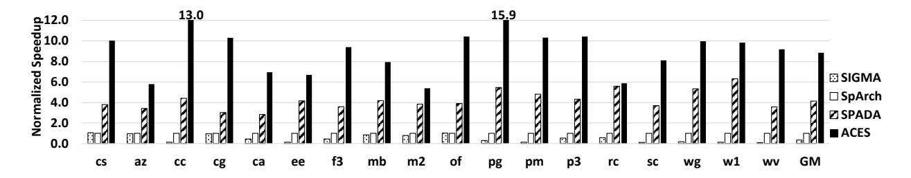
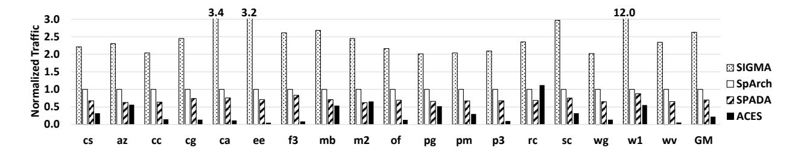
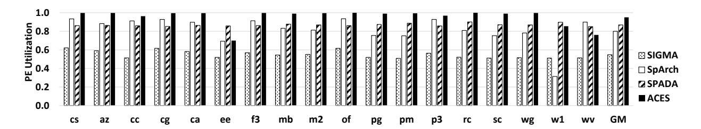
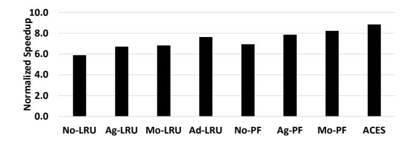
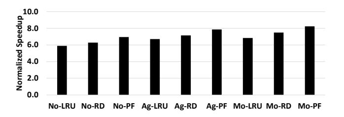
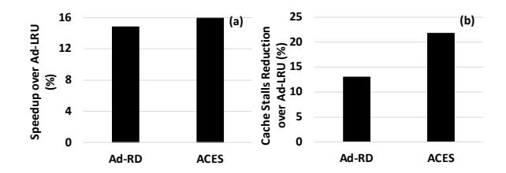
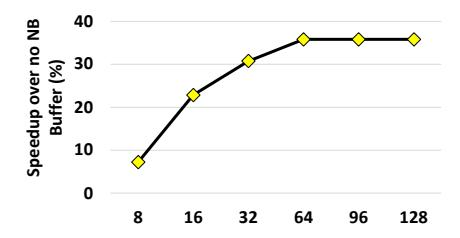

# 5 Experiment Results

## 5.1 Performance Comparisons

Figure 7 illustrates the performance of various SpMM accelerators, normalized to that of SpArch, across all evaluated workloads. We make four major observations. First, ACES consistently outperforms all state-of-the-art accelerators across every workload, highlighting its exceptional adaptability to diverse sparse patterns. On average, ACES achieves significant performance gains of 25.5×, 8.9×, and 2.1× over SIGMA, SpArch, and SPADA, respectively. Second, SIGMA faces challenges in most workloads, despite utilizing a bitmap format for sparse matrix representation. Third, SpArch achieves a 2.9× speedup over SIGMA on average, which is attributed to the better input reuse of OutP execution flow and its efforts to reduce off-chip traffic during the merging phase. Fourth, SPADA, with its WA execution flow, provides an adaptive execution flow and better performance compared with accelerators with a fixed execution flow. On average, SPADA leads to a 4.2× speedup over SpArch and a 12.0× speedup over SIGMA.

Figure 8 presents a comparison of the total off-chip memory traffic for matrix B and partial outputs across various workloads. The memory traffic associated with matrix B is crucial for the effectiveness of multiplications. Similarly, efficient handling of reads and writes for partial outputs is vital for the merging processes. Figure 8 demonstrates that ACES incurs the lowest off-chip memory traffic compared to recent SpMM accelerators. On average, the off-chip memory traffic of SIGMA is 11.6× higher than that of ACES, while the traffic for SpArch and SPADA is 4.4× and 3.1× higher, respectively. SIGMA achieves efficient output reuse but faces significant challenges in input memory traffic. SpArch strives to reduce off-chip traffic during the merging phase through

Figure 7. Performance comparison among SIGMA, SpArch, SPADA, and ACES.

Figure 8. Memory traffic comparison among SIGMA, SpArch, SPADA, and ACES.

Figure 9. PE utilization comparison among SIGMA, SpArch, SPADA, and ACES.

an aggressive condensing representation of matrix A. However, it disrupts input reuse, leading to excessive fetching of different rows of matrix B and causing cache thrashing. SPADA, relying on its adaptive execution flow, reduces memory traffic compared with SIGMA and SpArch; however, it still exhibits a significant gap when compared with ACES. ACES, with its adaptive execution flow, effectively balances input and output reuse. The design of immediate merging, in conjunction with the PureFiber cache replacement policy, ensures finer granularity in merging partial results. Furthermore, the merging scheduler efficiently manages the final merging stage, collectively contributing to optimal traffic management.

Figure 9 compares PE utilization among four SpMM accelerators. On average, GAMMA, SpArch, SPADA, and ACES exhibit PE utilization rates of 54.8%, 80.0%, 86.9%, and 95.1%, respectively. Notably, ACES consistently maintains PE utilization rates above 90.0% in 15 of the 18 evaluated workloads. The high PE utilization of ACES is attributable to two main factors: First, its adaptive execution flow effectively mitigates synchronization risks. Second, the architecture of

ACES features a one-to-one pairing of MPEs with APEs. This architecture, combined with efficient task scheduling by the synchronization scheduler during the immediate merging phase, reduces the collective dependency of MPEs and enhances the parallelism of APEs.

#### 5.2 Performance with Different Condensing Degrees

To assess the effectiveness of the novel adaptive execution flow designed for ACES, we conduct a performance comparison across three static condensing degrees: none (No), aggressive (Ag), and moderate (Mo), complemented by adaptive condensing (Ad). For each condensing degree, we implement two distinct cache replacement policies: the traditional Least Recently Used (LRU) policy and the PureFiber (PF) policy. Figure 10 depicts the overall speedup of various ACES implementations over SpArch, highlighting the performance for each specific combination of condensing degrees and cache replacement policies, such as Ag-LRU (aggressive condensing with LRU policy) and Mo-PF (moderate condensing with PureFiber policy). Importantly, as the original ACES

Figure 10. Average performance improvement of implementations with different static condensing degrees compared with adaptive condensing, across LRU and PureFiber cache replacement policies.

incorporates adaptive condensing with the PureFiber policy, the performance of the Ad-PF combination is distinctly identified as ACES in Figure 10.

The results presented in Figure 10 demonstrate the superior performance of adaptive condensing when compared with static condensing configurations under different cache replacement policies. Specifically, with the traditional LRU policy, adaptive condensing (Ad-LRU) achieves a 7.6× speedup over SpArch, outperforming No-LRU, Ag-LRU, and Mo-LRU by 29.6%, 13.8%, and 11.7%, respectively. Similarly, when utilizing the concurrency-aware PureFiber cache replacement policy, adaptive condensing (ACES) achieves an 8.9× speedup over SpArch, surpassing the No-PF, Ag-PF, and Mo-PF configurations by 27.4%, 12.6%, and 7.4%, respectively.

Adaptive condensing, whether working with the LRU or the PureFiber cache replacement policy, consistently delivers significant speedup gains over static condensing configurations. This performance advantage highlights the effectiveness of adaptive condensing in dynamically balancing data reuse and parallelism efficiency, providing an optimal execution flow finely tuned to the diverse sparse patterns of matrices. Such adaptability not only enhances the computational efficiency of ACES, but also establishes adaptive condensing as a pivotal feature for its versatility in diverse applications and system configurations. The ability of adaptive condensing to work effectively with various cache policies further underscores its broad applicability and flexibility in different system configurations.

## 5.3 Performance with Different Cache Replacement Policies

To highlight the innovation of the concurrency-aware cache replacement policy PureFiber in ACES, we compare it with two conventional cache replacement policies, LRU and RD, for managing the global cache. Specifically, the RD policy is designed to focus exclusively on the next request distance, prioritizing the eviction of cache lines that are furthest from being requested again. Both the LRU and RD policies aim to enhance data locality with the primary objective of minimizing cache misses. This comparative analysis is intended

Figure 11. Average performance improvement of implementations with different cache replacement policies, across various static condensing degrees.

to showcase the distinctive advantages and potential of the concurrency-aware cache replacement strategy embodied by PureFiber. Unlike conventional policies that focus mainly on data locality, PureFiber considers both data locality and concurrency, potentially offering a more nuanced approach to cache management.

Figure 11 illustrates the overall speedup of various ACES implementations compared with SpArch, emphasizing the performance enhancements achieved with three distinct cache replacement policies: LRU, RD, and PureFiber. These policies are evaluated across three static condensing degrees: none, moderate, and aggressive, providing a comprehensive view of their impact on the performance of ACES. The key observation from Figure 11 is that across all static condensing degrees, the PureFiber cache replacement policy consistently leads to the highest speedups. Specifically, without condensing, the PureFiber policy (No-PF) achieves a speedup of 6.9×, which exceeds the performance of No-LRU and No-RD by 18.0% and 10.7%, respectively. With aggressive condensing, a 7.9× speedup of PureFiber (Ag-PF) is observed, surpassing Ag-LRU and Ag-RD by 17.2% and 10.0%, respectively. When utilizing the moderate condensing degree, PureFiber (Mo-PF) shows the most significant improvement with an 8.2× speedup, outperforming Mo-LRU and Mo-RD by 20.5% and 10.0%, respectively. These results indicate that utilizing the concurrency-aware PureFiber policy in cache replacement not only offers the best performance in the absence of condensing, but also provides superior results when working with both moderate and aggressive static condensing, underscoring its effectiveness.

Figure 12 displays the performance of ACES implementations with adaptive condensing across various cache replacement policies: LRU, RD, and PureFiber. Figure 12(a) illustrates the speedup achieved by the original ACES implementation employing the PureFiber policy, as well as the speedup of Ad-RD, both in comparison with Ad-LRU. We observe that, when working with adaptive condensing, the consideration of both data locality and concurrency enables ACES with the PureFiber policy to achieve an average improvement of 15.9% over the LRU baseline. In contrast, the average speedup for Ad-RD, which does not consider data concurrency, is 14.8%.

Figure 12. Average performance of implementations with adaptive condensing using different cache replacement policies, showcasing (a) speedup over Ad-LRU, and (b) reduction in cache stalls over Ad-LRU.

Figure 13. Performance of ACES across various NB buffer sizes.

Figure 12(b) offers a detailed analysis of the PureFiber performance. This figure highlights that the PureFiber policy effectively reduces cache stalls compared with other policies. Specifically, ACES with the PureFiber policy, achieves an average cache stall reduction of 21.8% over Ad-LRU, whereas Ad-RD, which considers only reuse distance, sees a cache stall reduction of 13.0%. These observations highlight that although reuse distance considerations can improve the global cache performance, the integration of concurrency awareness into the global cache management can yield additional benefits. By considering both data locality and concurrency, the PureFiber policy substantially diminishes cache stalls, thereby enhancing the overall efficiency of the cache system in SpMM accelerators like ACES.

## 5.4 Performance with Different NB Buffer Sizes

To showcase the effectiveness of integrating a NB buffer with the global cache in ACES, Figure 13 illustrates the overall speedup of ACES with varying sizes of the NB buffer, ranging from 8 to 64 subentries. Performance is normalized to a version of ACES that uses a blocking cache, without integrating the NB buffer with the global cache. Two key observations emerge from the results. First, integrating an NB buffer with the global cache significantly enhances performance. Even with a minimal 8-subentry NB buffer, ACES achieves a 7.2% performance improvement over the blocking baseline. Moreover, an ACES configuration with a 16-subentry NB buffer further achieves a 22.8% speedup. These results validate the critical role of the non-blocking cache in SpMM accelerator performance. The design of the NB buffer not

Table 3. Area breakdown of ACES.

| Components   | Area (mm2 ) | Components    | Area (mm2 ) |
|--------------|----------------|---------------|----------------|
| 2 Fetchers   | 0.22           | Global Buffer | 0.06           |
| 16 MPEs      | 0.28           | Global Cache  | 2.09           |
| 16 APEs      | 0.24           | 16 SQs        | 0.25           |
| 2 Schedulers | 0.14           | NB buffer     | 0.08           |
| Crossbars    | 0.16           | Total         | 3.52           |

only mitigates global cache stalls due to cache misses but also enables the global cache to support higher concurrency, thereby increasing parallelism. Second, Figure 13 reveals that the performance of ACES tends to stabilize once the number of subentries of the NB buffer reaches 64. At this point, a substantial performance improvement of 35.8% is observed. Additionally, it is important to consider that a larger NB buffer also introduces additional overhead. Therefore, in balancing performance gains with potential overheads, we set the default number of subentries in the NB buffer for ACES to 64.

## 5.5 Area and Power

In ACES, the breakdown of the area is detailed in Table 3, showing a total area of 3.52mm2 . Similar to other SpMM accelerators, a significant portion of the area is occupied by the global cache. Specifically, the 1MB global cache in ACES constitutes 59.4% of the total area. Compared to existing works like SPADA and SpArch, the global cache capacity in ACES is relatively modest. By integrating a lightweight NB buffer with the global cache, ACES achieves reduced area overhead while improving performance relative to accelerators with larger caches. For comparison, the total areas of SPADA and SpArch at 28 nm technology are 6.32mm2 and 13.96mm2 , respectively. Additionally, the power consumption evaluation of ACES reveals that it consumes a total of 2.83W of power.

