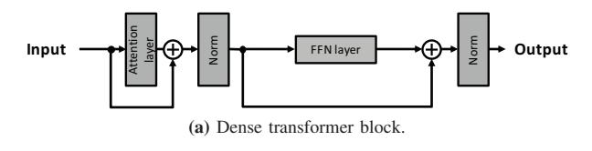
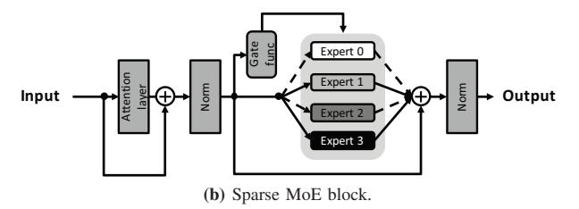
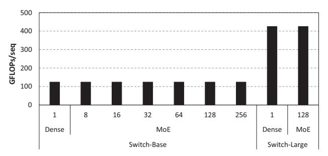
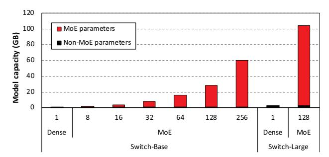
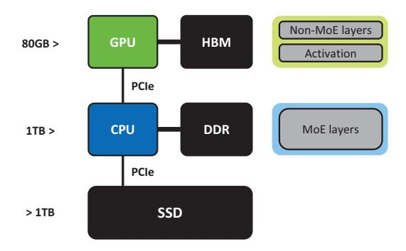

# I. INTRODUCTION

Machine learning (ML) applications based on large language models (LLMs) have taken the world by storm, widely being deployed in various consumer facing products [24], [26], [33]. The success of LLMs has been driven by scaling up the model capacity (i.e., the model size) and its training dataset, the largest trained model size increasing by around 1,000× within the past 5 years, from a few hundred million parameters to approaching a trillion parameter scale [3], [5], [39]. With larger model size bringing higher model accuracy, it is likely that future models will also increase in their model capacity. However, a critical challenge in sustainably growing model size is its increasingly demanding computation requirement.

To tackle the high compute requirements of LLMs, the Mixture-of-Experts (MoE) [37] model was suggested as an alternative to the previous *dense* LLMs [3], [5], [29], [39]. The power of MoE comes from its ability to scale up the model capacity by increasing the number of *expert* parameters within an MoE block. Despite the increase in model parameter size, however, MoE utilizes a *gate function* to only partially activate the experts in a *sparse* manner, allowing them to achieve sublinear compute cost with respect to model capacity. In contrast, prior dense LLMs activate the *entire* model parameters for inference and cause its compute cost to scale quadratically to model size, incurring significant computation overhead. Despite its merits, a critical challenge of MoE is its large memory requirement and the dynamically activated sparse experts which cause high deployment cost, rendering MoE's applicability in real-world problems to be limited.

- 1) Large memory requirement of experts. While sparsely activating model parameters (i.e., the experts) helps reduce compute cost to achieve the same model quality as their dense LLM counterparts, MoEs require significantly larger memory to accommodate the large number of experts. For instance, an MoE-based Google Switch-Transformer [8] can have up to 75× more parameters than the FLOPs-equivalent dense T5 model [29]. In other words, MoEs have a much lower *memory-efficiency* vs. dense LLMs, bringing critical system-level challenges in deploying MoE-based LLMs. To accommodate MoE's large model size under GPU's limited memory size, multiple GPUs can be utilized for deploying MoE where *expert parallelism* is employed to distribute the expert parameters across the GPUs to store only a portion of the experts for inference [18], [19], [30].
- 2) Dynamic and sparse activation of experts. Although multi-GPU solutions can distribute expert parameters across the GPU memory, MoE only partially activates a subset of the experts in a sparse manner [37]. This makes the number of experts actually utilized per each

∗ Co-first authors who contributed equally to this research. † Work done during an internship at Microsoft Research.

GPU to become either very small or non-existent (i.e., none of the experts in a GPU are activated, leaving GPU idle) [21]. Furthermore, the sparse expert activation is dynamically decided at runtime, making it difficult to anticipate how many experts will be activated in each GPU. As such, the effective computation conducted over each GPU becomes low, exhibiting low GPU compute utilization and aggravating the total cost of ownership (TCO) for deployment.

Prior work on deploying MoE seeks to address these dual challenges by *offloading* MoE's memory hungry expert parameters into CPU memory or SSD [1], [14], [18], [38] (referred to as *MoE-offload* below). The benefit of MoEoffload is that it reduces the number of GPUs required for deploying MoE, which helps increase the GPU's compute efficiency for inference. Offloading MoE parameters, however, is no silver bullet as it comes with a significant increase in inference latency, deteriorating quality of service (QoS) to end users. This is because CPU offloading can only resolve MoE's large memory requirement without addressing the *data dependency* issue that arises with dynamic sparse activation, a unique characteristic of the MoE. In an MoE block, there exists a sequential dependency between (1) the "selection" of which experts should be activated (using MoE's gate function), and (2) the "execution" of activated experts for inference. Because such data dependency is *dynamically* resolved by the input data, the two-stage process of (1) *expert selection* and (2) *expert execution* must be serialized back-to-back. Consequently, the latency to migrate the activated expert parameters from CPU to GPU cannot be hidden under MoE-offload and causes severe performance overheads, failing to address the aforementioned challenges of deploying MoE (Section III-B).

In this work, we propose *Pre-gated MoE*, an algorithmsystem co-design that enables MoE inference to incur low GPU memory consumption while still achieving high performance, substantially reducing TCO. We briefly summarize the key contribution and novelty of our Pre-gated MoE below.

- (Algorithm) In conventional MoE architectures, the gate function in the *N*-th MoE block selects the experts to activate which will then be executed within the *same N*th MoE block. In our proposed design, we modify the role of a gate function to *preemptively* select the experts to be activated for the *next* MoE block (hence its new name, the *pre-gate* function). More concretely, the pregate function in the *N*-th MoE block selects the experts to activate for the (*N*+1)-th MoE block. The novelty of our pre-gate function lies in its ability to completely *eliminate* the sequential dependency between the expert selection and expert execution stage within any given MoE block (i.e., data dependency now exists across the *N*-th MoE block's expert selection and the (*N*+1)-th block's expert execution), which our proposed system effectively utilizes for performance optimization as detailed below.
- (System) Similar to prior MoE-offload systems, our Pregated MoE stores the memory capacity limited expert

parameters in CPU memory and reduces the number of GPUs required for inference. Unlike MoE-offload, our Pre-gated MoE utilizes the pre-gate function to overlap the CPU→GPU expert migration latency with the expert execution stage, minimizing the expert migration's impact on performance. Specifically, Pre-gated MoE utilizes the *N*-th pre-gate function to identify the set of experts to activate for the (*N*+1)-th MoE block, in advance, effectively *prefetching* only the activated experts to the GPU in preparation for the (*N*+1)-th block's execution while concurrently going through the expert execution for the *N*-th MoE block.

We evaluate our Pre-gated MoE system using state-ofthe-art MoE models, achieving comparable or even higher model accuracy compared to the original MoE model across a wide range of natural language processing (NLP) tasks (e.g., summarization, and question answering). At the same time, decoupling the expert selection vs. expert execution stage provides our Pre-gated MoE to significantly reduce end-to-end inference latency, only adding 23% performance overhead than the oracular, performance-optimal GPU-only solution that can store the entire MoE parameters in GPU memory. Pre-gated MoE also reduces peak GPU memory consumption by 4.2× vs. GPU-only, allowing the deployment of larger LLMs within a single GPU. Overall, our Pre-gated MoE system presents a fast, scalable, and cost-effective solution for serving MoEbased LLMs.

## II. BACKGROUND

## *A. Dense LLMs using Transformers*

Transformer model architecture. Transformer models [42] have become the dominant approach in designing ML applications for natural language processing (NLP), due to their ability to capture long-range dependencies and complex patterns in data [6], [39]. There are two primary ways in which a transformer model is structured: an encoder-decoder architecture [29] and a decoder-only architecture [3]. An encoder-decoder architecture consists of an encoder module that processes the input data (sequence of input tokens) and a decoder module that generates the output (an output token per decoder). The decoder-only architecture on the other hand implicitly incorporates the encoding process within the transformer blocks, eliminating the need for a separate encoder module. Regardless of which architecture is employed, both encoder-decoder and decoder-only architectures employ the following key components of transformers: the self-attention layer, the position-wise feed-forward networks (FFN) layer, normalizations, and residual connections, as shown in Figure 1(a). Self-attention helps determine the inter-word relationships and their dependencies within a sequence, whereas the FFN layer applies non-linear transformations to capture complex patterns in the input data. Both self-attention and FFN account for a significant portion of computation as well as memory requirements of transformer models.

Challenges in scaling dense LLMs. The success of transformer based dense LLMs has primarily been driven by scaling

**Fig. 1:** (a) A dense transformer block that consists of the self-attention layer, feed-forward networks (FFN) layer, normalizations, and residual connections. (b) An MoE block that replaces a conventional transformer block's FFN layer to induce sparsity. The example assumes the MoE block has four expert layers. Each expert has the same dimension as the FFN layer of the corresponding dense transformer block.

up the model's capacity (i.e., model size) by stacking a series of transformer blocks [17], [28], providing higher model accuracy. However, a key challenge in sustainably growing model capacity is its increasingly demanding compute and memory cost, for both training and inference. In particular, as the size of the LLM increases, the demands on compute and memory grow *quadratically*, making it challenging to fit the model within the memory constraints of modern GPUs while also maintaining high compute efficiency [40]. Furthermore, the energy costs associated with training these LLMs are increasing significantly, raising serious concerns on the environmental impact of training and serving LLMs [27], [44].

#### B. Sparse LLMs using Mixture-of-Experts (MoE)

**MoE model architecture.** To address the high computational requirements of dense LLMs, the Mixture-of-Experts (MoE) [7], [8], [11], [37], [41] model was introduced which exploits *sparsity* in the model architecture to reduce LLM's high computation cost. MoE is designed to mimic the behavior of the human brain, which consists of specialized regions that are tailored for specific tasks. By sparsely activating only a subset of the parameters, MoE is able to scale up the model size without a corresponding increase in its computation cost (FLOPs).

Figure 1(b) illustrates the model architecture of an MoE block, which is converted from the dense transformer block in Figure 1(a) by replacing the original FFN layer in the transformer block with an MoE block. The MoE block consists of two key components: the gate function and the expert layer. The gate function is responsible for determining the relevance of each expert for a given input token, thereby assigning probabilities to each expert based on their importance to the specific input. The expert layer, on the other hand, is a dense FFN layer that focuses on processing distinct patterns in the

**Fig. 2:** Required number of FLOPs per sequence in deploying Switch-Transformer (MoE) and T5 (dense). In this figure, we show both the "Base" and "Large" model versions of SwitchTransformer and its FLOPs-equivalent T5 (Section V details the model configurations studied in this work). The numbers represent how many experts are available within the MoE block (i.e., dense T5 is equivalent to having just a *single* expert).

input data. During model inference, the gate function *selects* which experts should be activated for each input token based on their assigned probabilities. Subsequently, the activated experts process the input tokens by *executing* the assigned input tokens and generate the output tokens. As such, the evaluation of an MoE block involves a two-stage process, (1) *expert selection* and (2) *expert execution*, an input data-dependent procedure that must be executed sequentially.

In state-of-the-art MoE models, the number of experts that are activated is generally very small (e.g., Google's Switch-Transformer [8] and Meta's NLLB-MoE [41] only activates the top-1 and top-2 experts, respectively), rendering MoE's inference to exhibit high sparsity.

Computation cost of sparse MoE vs. dense LLMs. MoE's compute efficiency is achieved by selectively activating a small subset of the experts for each input token, instead of densely connecting all layers and neurons in the model. Figure 2 compares the required number of FLOPs per sequence between a representative sparse MoE model (Google's SwitchTransformer [8]) and its dense model counterpart with an iso-FLOPs count (Google's T5 [29]). As shown, the computation cost of MoE remains constant, regardless of the number of experts (i.e., the model size), highlighting the fact that MoE can scale up the model's capacity with minimal computation overheads.

## III. MOTIVATION

## A. Key Challenges of MoE inference

While MoE offers advantages in scaling the LLM model size without significantly increasing its computation cost, it introduces several key challenges as summarized below.

 Large memory footprint. The biggest advantage of MoE is its high compute efficiency, which comes from its ability to cost-effectively scale the model capacity by employing a large number of experts. This, however, comes at the cost of high memory consumption, leading MoE's overall memory footprint to become an order of magnitude larger than its dense counterpart, e.g., SwitchTransformer can consume as much as 75× higher

Fig. 3: Memory capacity requirement of deploying SwitchTransformer (MoE) and T5 (dense). MoE parameters include both the expert layer and the gate function, while the rest of the layers are marked as Non-MoE parameters. As depicted, MoE expert parameters account for the majority of the model's memory consumption.

memory consumption than the dense T5 (Figure 3). Such large memory usage poses several obstacles for MoE, one critical challenge being its inability to fit the model within a single GPU's local memory which is only several tens of GBs in size.

2) Dynamic and sparse expert activation. Because it is challenging to store the entire MoE model parameters within a single GPU, multi-GPU solutions that split the expert parameters across multiple GPU's memory can be a viable solution for high-performance MoE inference. Unfortunately, because MoE only partially activates the experts in a sparse manner, the number of experts actually executed by each GPU for inference becomes very low. In effect, multi-GPU solutions for deploying MoE suffer from low GPU compute utilization and deteriorate the TCO. Furthermore, because MoE experts are sparsely activated, a significant fraction of expert parameters allocated inside the expensive GPU memory is most likely not going to be utilized when servicing any given inference request (e.g., SwitchTransformer activating top-1 among the 128 experts executes only 0.8% of its experts per inference). Finally, because the sparsely activated experts are determined dynamically in an input data dependent manner, it becomes challenging to predict which experts will be activated at runtime, preventing any load-balancing solutions to better distribute the number of activated experts across the GPUs in an even manner. Since GPU's limited memory capacity was the very reason why a multi-GPU system was necessary for deploying MoE, such sub-optimal utilization of GPU memory is a significant waste.

#### *B. Prior Solution: CPU Offloading of Expert Parameters*

The challenge of efficiently managing LLM's large model size within the constraints of limited GPU memory has led to several prior work advocating to offload the memory hungry LLM parameters to CPU DRAM or even SSD [31], [35]. These *CPU offload* based approaches have also been explored under the context of MoE in order to address its aforementioned challenges, i.e., its large memory footprint and high deployment cost [1], [14], [15], [38]. Although CPU offload based solutions can help reduce the number of GPUs required for servicing MoE, the latency to transfer the CPU offloaded model parameters to the GPU memory can deteriorate end-to-end performance. This is because none of the prior work fundamentally addresses the dynamic and sparse expert activation challenge and its sequential dependency issue. Below we classify prior CPU offload based solutions into two categories, (1) *fetch-on-demand* and (2) *prefetch-all* discussing its benefits as well as its limitations. ,

Fetch-on-demand. This design point [15] employs the fetch-on-demand based CPU offloading for MoE serving. Under this system design, *all* the expert parameters are offloaded to the capacity-optimized CPU memory. At runtime, once the expert selection stage identifies which experts are activated, those activated experts are migrated to the GPU memory *demand*. Because GPU memory is only used to store the*on*activated experts (and not the entire experts as done in a baseline multi-GPU system), it helps improve GPU memory utilization significantly. However, the process of migrating activated experts on-demand serializes the expert selection stage with the expert execution stage, causing noticeable performance overhead. In the rest of this paper, we refer to this design point as *MoE-OnDemand*.

Prefetch-all. To better hide the CPU→GPU expert transfer latency, prior work on SE-MoE [38] proposes a *prefetching* based CPU offloading for MoE, where the expert parameters are proactively migrated to the GPU memory before its actual usage (henceforth referred to as *MoE-Prefetch*). Similar to MoE-OnDemand, MoE-Prefetch offloads all expert parameters in CPU memory. MoE-Prefetch then migrates the *entire* parameters to be used by the *next* MoE block while the expert *current* MoE block's expert execution is taking place. While MoE-Prefetch can help overlap compute (current MoE block's expert execution) with communication (transferring all experts required for the next MoE block), it suffers from several limitations. First, MoE-Prefetch is not scalable as CPU expert transfer time can be prohibitive when there exists a →GPU large number of experts (e.g., Google's SwitchTransformer [8] contains up to 256 experts, while Meta's NLLB-MoE [41] employs 128 experts). Second, at any given MoE block's execution, the GPU memory must be large enough to store both the current as well as the next MoE block's entire expert layer parameters, potentially overwhelming the scarce GPU memory. To mitigate the significant GPU memory demands required for transferring entire expert parameters, one could consider prefetching only a subset of experts predicted to be active in the next block. Nonetheless, predicting active experts does not always ensure accuracy, and mispredictions can lead to penalties such as waste of GPU memory and the unavoidable serialization of expert transfer latency, consequently increasing the end-to-end inference latency.

Aside from these prior works focusing on CPU offloading decisions for MoE inference, [14] characterizes MoE deployment's inference latency and its memory usage across different components of the MoE model architecture, suggest-

**Fig. 4:** Pre-gated MoE system for deploying MoE-based LLMs. The memory hungry, sparse MoE parameters are all offloaded to the capacity-optimized CPU memory and are only transferred to the GPU memory when necessary for inference. The rest of the dense, non-MoE parameters are stored locally within the GPU memory.

ing several optimization strategies like dynamic gating and expert buffering. Dynamic gating helps reduce wasted memory allocations for multi-GPU MoE inference and expert buffering is a technique that can help reduce inference latency by caching hot, active experts in GPU memory. In Section VI-D, we further discuss the applicability of expert caching on top of MoE-offload design points.

Overall, we conclude that the inherent sequential dependency between the expert selection and expert execution stage poses several challenges in designing a performance-efficient CPU offloading based MoE system. The key objective of this paper is to exploit the dynamic and sparse nature of MoE models to design a holistic system solution that effectively balances memory efficiency and high performance.

