# IV. PRE-GATED MOE: CO-DESIGNING ALGORITHM AND SYSTEM FOR FAST & SCALABLE MOE INFERENCE

### A. High-level Overview

We propose Pre-gated MoE, an algorithm-system co-design for scalable and high-performance MoE inference. Pre-gated MoE is designed to address the large memory footprint challenge of MoE while also mitigating the dynamic nature of sparse expert activation for performance improvement. These features enable our Pre-gated MoE to deploy largescale LLM using just a single GPU. Because activated experts are determined dynamically in an input dependent manner, all expert parameters must be preserved at all times, regardless of its actual utilization. To efficiently manage the storage of MoE's substantial model capacity, Pre-gated MoE carefully considers the model parameter's actual utility to decide their storage locations. As shown in Figure 4, the dense non-MoE parameters are stored locally within the GPU memory as they are always utilized, regardless of the input values. Meanwhile, the sparse MoE parameters are completely offloaded to the CPU's DRAM because (1) they account for the majority of LLM's model capacity so CPU offloading can help significantly save GPU memory, and (2) only a small fraction of the MoE experts that are activated are actually utilized

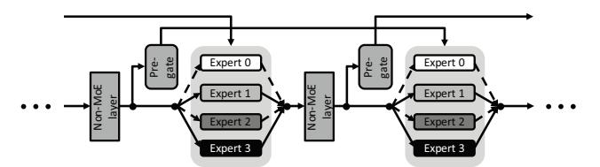

**Fig. 5:** Two consecutive MoE blocks employing our proposed pregate function. For brevity, we only provide a detailed illustration on the MoE blocks (the rest of the non-MoE layers are consolidated into a single block in this figure). The residual paths within a transformer block are not shown. As depicted, a pre-gate function is trained to select which experts to activate for the next MoE block.

for inference. As we detail in this section, such hierarchical storage of MoE parameters and its deployment proves effective in minimizing the usage of GPU memory while still providing high performance.

As discussed in Section III-B, prior work has followed two main approaches, MoE-OnDemand and MoE-Prefetch. Because traditional MoE blocks must sequentially execute expert selection followed by expert execution in an input data dependent manner, both MoE-OnDemand and MoE-Prefetch suffer from sub-optimal performance. In particular, MoE-OnDemand directly exposes the CPU→GPU communication latency to migrate activated experts as part of end-to-end inference time. This is because expert execution must always be preceded with the expert selection stage. MoE-Prefetch can hide the communication latency to transfer expert parameters to some extent, but it still suffers from performance loss because *all* expert parameters must be transferred to the GPU, even though only a small fraction of them will actually be utilized for inference.

The key objective of Pre-gated MoE is to mitigate the impact of the MoE block's dynamically determined sparse expert activation and utilize that property for performance improvement. Specifically, Pre-gated MoE introduces a new gate function that *decouples* the expert selection stage from the expert execution stage. The benefit of decoupling expert selection with expert execution is twofold. First, it enables our system to significantly reduce the latency to migrate experts from CPU to GPU as only the activated experts will be migrated under our proposed design. Second, the performance overhead of migrating the activated experts can be effectively hidden by overlapping it with MoE block's computation. In the remainder of this section, we detail the two key facets of our algorithm-system co-design.

### B. (Algorithm) Pre-gated MoE Architecture

**Pre-gate function.** In traditional MoE model architectures, each MoE block contains a gate function which selects the experts to activate within the *same* MoE block. Because only those experts that are activated are subject to the subsequent expert execution stage, it is impossible to overlap the expert selection stage with the expert execution stage. In our proposed MoE model architecture, we introduce the *pre-gate function* which is trained to preemptively select the experts to activate

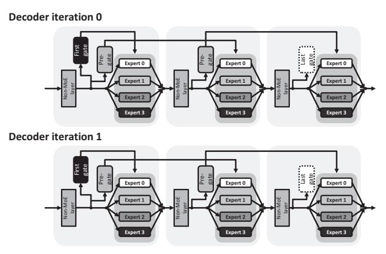

Fig. 6: The sequence of pre-gated MoE block's execution during the course of two consecutive decoder iterations. We assume the LLM consists of three pre-gated MoE blocks, requiring three MoE block executions for a single iteration of decoding. The first MoE block employs two gate functions (one for the current MoE block and another for the next MoE block) whereas the last MoE block does not utilize any gate function.

for the *next* MoE block rather than the current MoE block. More concretely, a pre-gate function for the *N*-th MoE block is trained to generate the activation masks to utilize in the (*N*+1)-th MoE block to select which experts to activate (Figure 5). Prior work has explored alternative ways to train gate functions, which are fine-tuned for specific objective functions such as enhancing the model accuracy and alleviating the input token's load-imbalance problem when distributed across multiple GPUs [8], [20], [36], [46], [47]. The approach taken with our Pre-gated MoE is aligned with these prior art but with one important distinction – our pre-gate function is designed to deterministically select and pre-compute which experts to activate for the subsequent MoE block. As we demonstrate in Section VI-C, our pre-gate function has a minimal impact on LLM's model accuracy and is shown to be highly robust.

Since our pre-gate function is trained to select the active mask for the next MoE block, two important questions remain: (1) How does our Pre-gated MoE architecture select the experts to activate for the *first* MoE block (i.e., the first MoE block does not have a previous MoE block that will select the experts to activate on behalf of the first block)? (2) What is the role of the pre-gate function for the *last* MoE block (i.e., the last MoE block does not have a subsequent MoE block)? We answer these questions using Figure 6. In conventional MoE-based LLMs, a single decoder iteration generates a single output token (word) and multiple iterations of decoding are conducted during a single inference run to generate the final output result (which is a series of tokens). As shown in Figure 6, a single decoder iteration involves the execution of several stacks of MoE blocks. In our proposed MoE design, the first MoE block employs *two* gate functions, the first gate selecting the activated experts for the first MoE block (identical to conventional MoE architectures) and the second gate (our *pre*-gate function) selecting the experts to

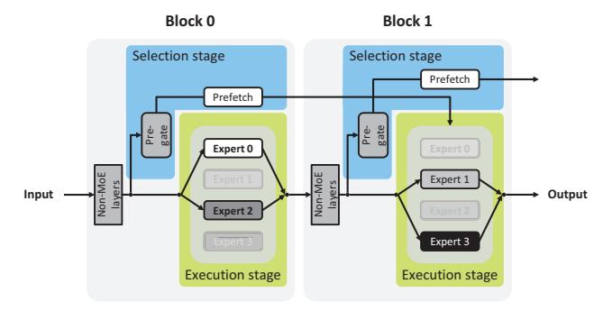

Fig. 7: Our pre-gate function helps eliminate the sequential dependency between an MoE block's expert selection and expert execution stage. The gate function is implemented as a compact MLP layer having low computation requirement, so the preemptive migration of activated experts right after the gate function (blue) exhibits a PCIe communication-bound behavior. Overall, our Pre-gated MoE enables the compute-bound expert execution stage (green) to concurrently execute with the communication-bound expert selection stage (blue) for all MoE blocks (with the exception of the first MoE block). Example assumes that expert 0 and 2 are activated for the first MoE block while expert 1 and 3 are activated for the second MoE block.

activate for the second MoE block. Conversely, because the last MoE block does not have a subsequent MoE block to execute within the *same* decoder iteration, we do not employ a pre-gate function for the last MoE block. In effect, the pregate function does not select activated experts *across* different decoder iterations.

Training the pre-gate function. Today's LLMs are first *pretrained* on vast amounts of textual data which spans a wide variety of languages and application domains. The pretraining stage requires a massive amount of computation power (several tens of thousands of GPUs) and typically takes several months to complete (e.g., GPT-3 is pretrained over hundreds of billions of tokens for more than one month using thousands of GPUs [3]). Once the LLM is pre-trained, it goes through the *fine-tuning* stage with task-specific datasets for specific use cases (e.g., summarization, question answering). Training our Pre-gated MoE does not change how the resource-intensive pretraining stage is conducted, as our pre-gate functions are incrementally trained during the fine-tuning stage. Specifically, we utilize existing pretrained MoE model parameters as-is but change the MoE model architecture to properly accommodate the functionalities of our pre-gate function as well as the augmentations required in the first/last MoE block (see Figure 6). We then go through the fine-tuning stage as required by the downstream task, identical to how conventional MoE models will be fine-tuned in a task specific manner. When our Pregated MoE is fine-tuned over the same number of fine-tuning training iterations vs. conventional MoE models, we observe no noticeable degradation in LLM model accuracy, one which we further elaborate in Section VI-C.

## *C. (System) Preemptive Expert Migration*

Our pre-gate function provides MoE models with the ability to determine what experts will be activated in the next

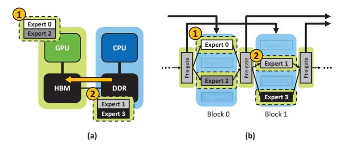

**Fig. 8:** (a) Illustration of how the example in Figure 7 gets handled over the Pre-gated MoE system where the expert execution in MoE block 0 (using the activated experts 0 and 2) concurrently takes places while the next MoE block 1's activated experts 1 and 3 are migrated over to the GPU memory. (b) The on-demand migration of just the activated experts (green) allows the entire experts to be stored in CPU memory (blue), significantly saving GPU memory capacity.

MoE block while the current MoE block is being executed, presenting new opportunities for system-level performance optimizations. In particular, with the exception of the first MoE block, all MoE block's expert execution stage is now completely decoupled from the expert selection stage without any data dependencies, allowing both stages to be concurrently executed (Figure 7)1. Such feature opens up several opportunities as detailed below.

CPU offloading with minimal expert migration over**head.** A key limitation of previous CPU offloading solutions is that the latency to migrate the CPU-offloaded expert parameters is either directly exposed as part of the end-to-end inference time (MoE-OnDemand) or the size of the migrated experts are simply too large that, despite its opportunity to overlap expert migration with the expert execution, copying the experts overwhelms the end-to-end performance (MoE-Prefetch). Our Pre-gated MoE, on the other hand, can evaluate which experts will be activated in advance, only migrating the activated experts for the next MoE block while the current MoE block's experts are being executed. This effectively addresses the dual challenges of prior CPU offloading techniques, namely (a) MoE-OnDemand's serialization of expert selection and expert execution (resolved by Pre-gated MoE's concurrent expert migration and expert execution) and (b) MoE-Prefetch's large expert migration latency (tackled by Pregated MoE's ability to only migrate activated experts). Stateof-the-art MoE models employ a large number of experts within an MoE block while only activating a very small subset of them (e.g., Google's SwitchTransformer [8] contains up to 256 experts but only activates the top-1 expert, while Meta's NLLB-MoE [41] employs 128 experts and activates top-2 experts). As depicted in Figure 8, we can clearly see the benefit of how our algorithm-system codesign can effectively address the limitations of existing CPU-offloading solutions, maximiz-

1The first MoE block is the only exception to this property under our Pregated MoE design – due to the lack of a pre-gate function in the first MoE block, we must sequentially execute its expert selection and expert execution stages, identical to conventional MoE models. Because state-of-the-art LLMs typically contain tens of MoE blocks, most of the MoE blocks are able to overlap expert selection with expert execution.

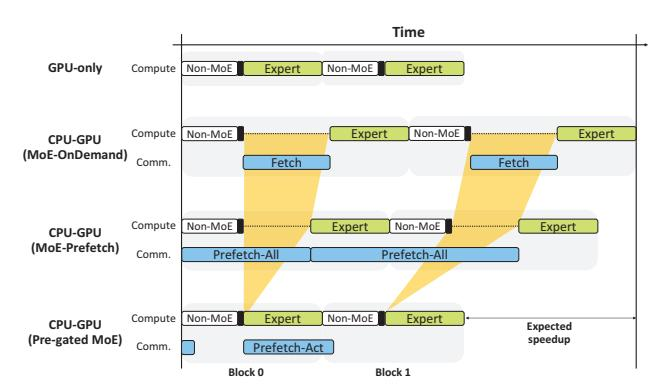

**Fig. 9:** Execution timeline between our Pre-gated MoE system and three baseline designs (GPU-only, MoE-OnDemand, and MoE-Prefetch). The black bar represents the latency to execute the gate functions. GPU-only is an ideal, oracular design point that has infinite GPU memory capacity, allowing the entire model parameters to be stored within GPU memory (i.e., there is no communication latency to migrate experts from CPU to GPU). In our Pre-gated MoE, the latency to migrate experts can be hidden by both the expert and non-MoE layer's (e.g., self-attention layer) execution time.

ing the opportunity to overlap expert migration latency with expert execution time while also ensuring that the CPU→GPU data transfer size is minimized. Figure 9 points out the limitations of MoE-OnDemand and MoE-Prefetch and how our Pre-gated MoE successfully addresses its shortcomings, potentially reaching the performance of an ideal, *GPU-only* design point when the latency to migrate activated experts can be completely hidden inside the MoE expert execution stage.

$$\forall N, 0 \le N < Number \ of \ MoE \ blocks$$

$$Peak\_GPU\_mem = \max \left(Non\_MoE_M + \sum_{L=N}^{N+1} Act\_Exp_L\right)$$
(1)

Low GPU memory utilization for large LLM deployment. The majority of MoE-based LLM's model capacity are concentrated around MoE parameters. Since our Pregated MoE system offloads the entire MoE parameters to CPU memory and only migrates activated experts over to the GPU, we are able to significantly reduce the *peak* usage of GPU memory. In our Pre-gated MoE system, peak GPU memory usage is primarily dominated by the memory capacity required to store (1) all the non-MoE parameters (which are statically stored in GPU memory) and (2) the active experts for both the current and the subsequent MoE block (dynamically determined at runtime and copied over to the GPU memory). Equation 1 summarizes the peak GPU memory usage to store MoE-based LLM's model parameters under Pre-gated MoE.

In this equation,  $Non\_MoE_M$  represents the total size of the non-MoE parameters while  $\sum_{L=N}^{N+1} Act\_Exp_L$  represents the aggregate size of the active expert parameters over two consecutive (the N-th and (N+1)-th) MoE blocks. Since expert parameters account for the majority of MoE-based LLM's model size (see Figure 3) and only a small fraction of experts

TABLE I: Model configuration of Google's SwitchTransformer.

| Model        | Experts | Layers | Parameters (B) | Capacity (GB) |
|--------------|---------|--------|----------------|---------------|
|              | 8       | 12     | 0.7            | 2.8           |
| Switch-Base  | 64      | 12     | 3.8            | 15.2          |
|              | 128     | 12     | 7.5            | 30.0          |
| Switch-Large | 128     | 24     | 26.4           | 105.6         |

are activated during inference, the peak GPU memory usage in Equation 1 becomes much lower than GPU-only and can also reach the memory consumption level of the memory-optimal MoE-OnDemand design. A key advantage of reducing peak GPU memory usage is that it facilitates the deployment of considerably larger LLMs on systems with limited GPU memory resources (e.g., desktop and edge devices). In Section VI-B, we demonstrate Pre-gated MoE's scalability and applicability for deploying large-scale LLMs.

## V. METHODOLOGY

System configuration. We conducted our evaluation using two system design points, GPU-only and CPU-GPU, which utilize an AMD EPYC 7V12 64-Core CPU with 1.8TB DDR4 memory and a single NVIDIA GPU A100 with 80GB of HBM. The CPU and GPU communicate over a PCIe (gen4) channel with 32 GB/sec of data transfer bandwidth.

The oracular GPU-only design assumes the entire model parameters are stored in GPU memory, so the all computations for inference are conducted on the GPU. Note that multi-GPU solutions leveraging expert parallelism can experience performance loss due to inter-GPU communications and load imbalance issues. For a conservative evaluation, we experiment with our GPU-only system under a single GPU system that can achieve the highest performance. As such, GPU-only represents a performance-optimal, upper-bound MoE inference system that we compare our Pre-gated MoE against.

The CPU-GPU design, on the other hand, utilizes both GPU and CPU memory for storing the model parameters where only the (dense) non-MoE parameters are persistently stored within the GPU memory while the (sparse) MoE parameters are completely offloaded to CPU memory (Figure 4). Our Pregated MoE system as well as the two baseline CPU offloading MoE systems (MoE-OnDemand and MoE-Prefetch) employ such CPU-GPU system configuration.

Model and dataset. We use Google's SwitchTransformer [8] as the baseline MoE for our evaluations, a state-ofthe-art large-scale MoE model. The open-sourced pretrained weights available at HuggingFace [43] were utilized to finetune both Pre-gated MoE as well as the baseline MoE model for downstream tasks (Table I). As for the training data, we study three datasets covering two distinct downstream tasks: one from the summarization task (Xsum [23]) and two from the closed-book question answering task (CB Web QA [2], SQuAD [32]). The evaluation metrics included Rouge-1 and Rouge-2 scores [22] for summarization, and ExactMatch and F1 scores for question answering.

Model training (fine-tuning). We applied the exact same fine-tuning configurations across all model architectures including Pre-gated MoE and conventional MoE. As discussed

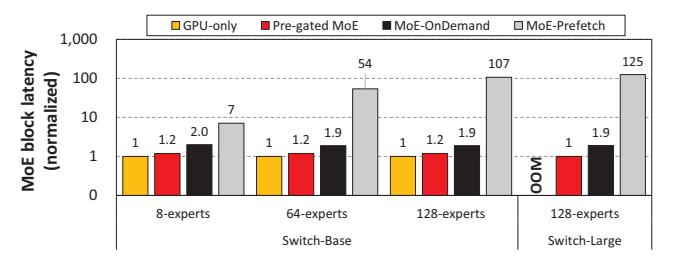

Fig. 10: Average latency incurred in executing a single MoE block (normalized to GPU-only). Since GPU-only experiences an out-ofmemory (OOM) error in Switch-Large, we normalized the latency of MoE-OnDemand and MoE-Prefetch to Pre-gated MoE. Note that the y-axis in this chart is plotted in log-scale.

in Section IV-B, the fine-tuning stage utilizes the pre-trained weights from the conventional MoE model. We utilize a minibatch containing 256 sequences, each with a length of 256 tokens, to fine-tune the model for 2,048 steps (i.e., 227 tokens in aggregate). A constant learning rate of 0.0001 is employed.

Software implementation. All of our GPU-only and CPU-GPU systems are implemented using NVIDIA's FasterTransformer [25], a state-of-the-art high-performance CUDA library widely employed in production inference servers in the industry. Because end-to-end inference performance is less sensitive to what the downstream task the MoE model is trained for, we report performance numbers using the MoE model finetuned for the closed-book question answering tasks with the SQuAD dataset. When reporting model accuracy, we use the two downstream tasks as discussed above.

## VI. EVALUATION

In this section, we first demonstrate Pre-gated MoE's effectiveness in improving performance (Section VI-A) and discuss its scalability to large-scale MoE models (Section VI-B). We then quantitatively evaluate Pre-gated MoE's impact on model accuracy (Section VI-C) and finally present sensitivity studies as a discussion point (Section VI-D), demonstrating the robustness of Pre-gated MoE.

#### *A. Performance*

In this section, we primarily focus on single batch inference scenarios because real-world production ML serving systems are optimized for a batch size of 1 [9], [10], [34]. As discussed in Section IV-B, the end-to-end performance of CPU offloading solutions are primarily determined by how well the CPU→GPU communication time (to migrate experts) is hidden inside the MoE block's execution time. Furthermore, the end-to-end MoE inference time is mostly dominated by a series of (identically sized) MoE block's execution. As such, we first focus on comparing a single MoE block's execution time between Pre-gated MoE vs. baseline systems. We then discuss the improvements in end-to-end inference throughput, measured as the number of tokens processed per second.

MoE block latency. Figure 10 summarizes the average latency in executing a single MoE block. Across all configurations, Pre-gated MoE significantly reduces latency by an

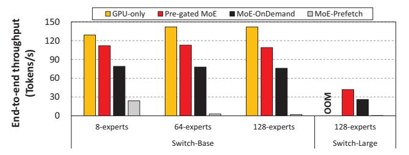

Fig. 11: End-to-end inference throughput. GPU-only experiences an out-of-memory (OOM) error in Switch-Large.

average 1.7× (max 1.9×) and 42× (max 125×) vs. MoE-OnDemand and MoE-Prefetch, respectively. Pre-gated MoE also exhibits comparable latency to the performance-optimal GPU-only, incurring only 19% latency overhead across all Switch-Base model configurations. Because MoE-Prefetch must migrate all experts, it suffers from the highest latency where the larger number of experts directly translates into higher performance overheads. MoE-OnDemand does better than MoE-Prefetch, thanks to its ability to only migrate activated experts. However, MoE-OnDemand still suffers from longer latency than Pre-gated MoE due to the serialization of expert selection and expert execution stages.

It is worth pointing out that the performance-optimal GPU-only is unable to run the largest MoE model, i.e., Switch-Large with 128 experts (105.6 GB), due to the limitations in GPU memory capacity, resulting in an out-of-memory (OOM) error. Pre-gated MoE still shows the shortest latency among the three CPU-GPU based designs with Switch-Large, achieving  $1.9\times$  and  $125\times$  latency reduction than MoE-OnDemand and MoE-Prefetch, respectively.

End-to-end inference throughput. Figure 11 shows the end-to-end inference throughput across all model configurations. Pre-gated MoE achieves an average 111 tokens/sec throughput over all Switch-Base model configurations, an average  $1.5\times$  (max  $1.6\times$ ) and  $27\times$  (max  $55\times$ ) improvement over MoE-OnDemand and MoE-Prefetch, respectively. Furthermore, Pre-gated MoE is able to achieve 81% of the throughput of oracular GPU-only solution, demonstrating its superior cost-effectiveness. As for the Switch-Large model with 128 experts, Pre-gated MoE achieves 42 tokens/sec of throughput which is  $1.6\times$  and  $52\times$  higher than MoE-OnDemand and MoE-Prefetch, respectively.

#### B. Scalability

As discussed in Section II-B, the majority of MoE's model size is dominated by expert parameters yet only a small fraction of the experts are actually activated for execution. Consequently, judiciously allocating GPU memory for efficient usage becomes vital in minimizing GPU's peak memory usage which helps deploy large-scale LLMs. Figure 12 compares the peak GPU memory usage of Pre-gated MoE against baseline systems to demonstrate Pre-gated MoE's scalability.

Among the four designs, GPU-only shows the highest peak memory usage because it solely relies on GPU memory to

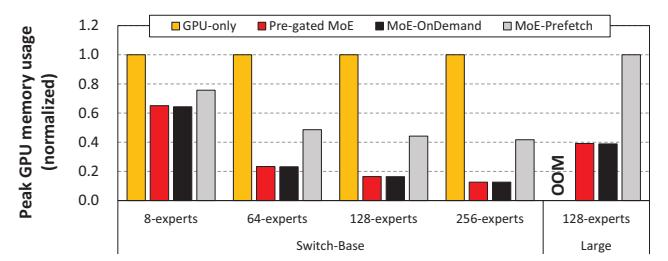

**Fig. 12:** Peak GPU memory consumption (normalized to GPU-only). We additionally evaluate Switch-Base with 256 experts to further demonstrate Pre-gated MoE's scalability in deploying larger MoE-based LLMs. For the Switch-Large with 128 experts, GPU-only suffers from an OOM error, so we normalized the memory usage of Pre-gated MoE and MoE-OnDemand to MoE-Prefetch.

**TABLE II:** Effect of our pre-gate function on the model accuracy of Google's SwitchTransformer. R1 and R2 represent the Rouge-1 and Rouge-2 scores, respectively. For all score metrics, higher is better.

|           | Xsum |      | CB Web QA  |      | SQuAD      |      |
|-----------|------|------|------------|------|------------|------|
|           | R1   | R2   | ExactMatch | F1   | ExactMatch | F1   |
| Base-8    | 34.6 | 13.0 | 26.0       | 30.9 | 77.4       | 85.8 |
| Pre-gated | 34.7 | 13.0 | 28.2       | 32.6 | 78.2       | 86.0 |
| Base-128  | 38.1 | 16.6 | 27.4       | 33.1 | 81.7       | 89.2 |
| Pre-gated | 38.0 | 16.5 | 25.8       | 32.2 | 82.2       | 89.4 |
| Large-128 | 40.2 | 18.8 | 31.0       | 36.5 | 82.4       | 90.1 |
| Pre-gated | 40.1 | 18.6 | 30.5       | 36.2 | 81.9       | 90.2 |

allocate all of its model parameters and input/output activations. All three CPU-GPU systems are able to significantly reduce peak GPU memory usage, as the memory hungry expert parameters are offloaded to the CPU memory. Also, notice how the GPU memory usage gap between GPUonly and the three CPU offloading based CPU-GPU designs gradually increases as the number of experts are increased. This is because the larger the number of experts are available within an MoE block, the more GPU memory savings the CPU offloading will provide. MoE-Prefetch, however, still consumes an average 51% of GPU-only's peak GPU memory usage because it always migrates the entire expert parameters to GPU memory. The memory-optimal MoE-OnDemand does much better than MoE-Prefetch as it only migrates activated experts on-demand, showing the lowest peak GPU memory utilization. Our proposed Pre-gated MoE system is able to consume only 23% of GPU-only's peak GPU memory usage while only incurring 0.2% more GPU memory consumption vs. the memory-optimal MoE-OnDemand.

Overall, these results demonstrate that Pre-gated MoE is capable of reaching the performance provided with the performance-optimal GPU-only (Figure 11) while also achieving the resource-efficiency of the memory-optimal MoE-OnDemand, achieving high scalability to deploy large LLMs.

#### C. Model Accuracy

In this subsection, we quantify the impact of our pre-gate function on MoE's model accuracy. Table II compares the model accuracy of SwitchTransformer with and without our pre-gate function employed for various downstream tasks. In

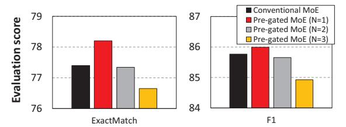

Fig. 13: Effect on model accuracy when changing the activation level of our pre-gate function, from a single MoE block ahead (*N*=1, our default configuration) to 2nd/3rd MoE block ahead (*N*=2/3). Evaluation is conducted over Switch-Base with 8 experts for the closed-book question answering task trained with the SQuAD dataset (ExactMatch (left) and F1 (right) scores are the evaluation metrics for the given task).

Switch-Base with 8 experts, which is the smallest size among our studied model configurations, Pre-gated MoE consistently exhibits slightly higher model accuracy across all downstream tasks. As the model size is increased with larger number of experts, Pre-gated MoE incurs a small accuracy degradation for some of the downstream tasks, but overall it continues to deliver competitive model accuracy results. Nevertheless, this magnitude of observed variances in accuracy does not signify a substantial improvement or deterioration in the model's fundamental capabilities. A detailed analysis on why our pregate function improves some of the downstream task's model accuracy is beyond the scope of this work. In general, Pregated MoE's robust model accuracy observed across different model sizes and different downstream tasks underscores the algorithmic robustness of our proposal.

It is important to emphasize that fine-tuning for both Pregated MoE and conventional MoE is done using *the same pretrained model parameters with the same number of training iterations*. The fact that Pre-gated MoE produces comparable model accuracy under these conditions demonstrates the robustness of our proposal. Furthermore, it also shows that *our proposal can effectively utilize pre-existing resources and training/fine-tuning recipes for deployment* (e.g., pre-trained model parameters from conventional MoE models), enhancing its applicability.

#### *D. Discussion*

Pre-gating to activate experts at different blocks. We have so far assumed that our pre-gate function is trained to preemptively select the experts to activate for the next subsequent MoE block. In other words, the pre-gate function's activation level (*N*) is a *single* (*N*=1) MoE block ahead of the current MoE block. To explore potential optimizations in the MoE architecture using our pre-gate function, we evaluate the model accuracy of MoE when the pre-gate function is trained to select the experts to activate for the 2nd/3rd subsequent MoE block ahead (*N*=2/3), the result of which is shown in Figure 13.

As depicted, our default Pre-gated MoE configuration (pregating with activation level-1, i.e., *N*=1) in the Switch-Base model with 8 experts consistently shows the highest model

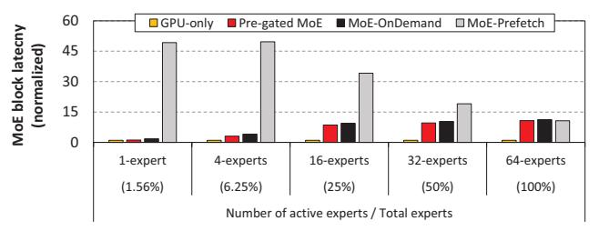

Fig. 14: Effect of the number of activated experts on MoE block latency (normalized to GPU-only). Evaluation is conducted using Switch-Base with 64 experts.

accuracy than the rest of the design points including conventional MoE structure (i.e., selecting experts to activate for the *current* MoE block, *N*=0) as well as pre-gate functions trained to select 2nd/3rd subsequent MoE block ahead (*N*=2/3). Note that the model accuracy gradually decreases as the pre-gate function's activation level increases (from *N*=1 to 3). We conjecture that the further away the preemptively selected MoE block is from the current pre-gate function, the less likely the current pre-gate function's input activations will contain useful information to accurately select what experts are most suitable to activate. A detailed evaluation of such is beyond the scope of this work and we leave it as future work.

Number of experts activated. The power of MoE comes from its *sparse* activation of experts (designed to mimic the behavior of the human brain, i.e., specialize regions of the brain tuned for specific tasks), which allows the model architecture to scale its model capacity without proportionally increasing its computational demand. For example, the default model configuration of Google's SwitchTransformer activates just a single expert (top-1 activation) in a single batch inference, so a SwitchBase model with 64 experts will activate only 1.56% of its experts. For the completeness of our study, we show in Figure 14 the performance of Pre-gated MoE when we manually increase the number of activated experts in Switch-Base with 64 experts from 1 expert (1.56% expert activation) to 64 experts (100% expert activation).

There are two key observations that can be made from this experiment. First, all CPU offloading based solutions (Pre-gated MoE, MoE-OnDemand, and MoE-Prefetch) experience a higher performance degradation vs. GPU-only as the number of activated experts is increased. This is expected because the behavior of MoE becomes similar to a dense LLM model when a larger number of experts are activated (i.e., all model parameters are utilized with 100% activation), rendering CPU offloading solutions less effective. Second, the performance gap between MoE-Prefetch and Pre-gated MoE gradually reduces as the number of activated experts increases. Because MoE-Prefetch migrates the entire expert parameters for every MoE block, a larger number of activated experts reduces the needlessly *overfetched* expert parameters, closing its performance gap against Pre-gated MoE. Nonetheless, for MoE models with sparse expert activations (the most common way of developing an MoE model architecture), Pre-gated

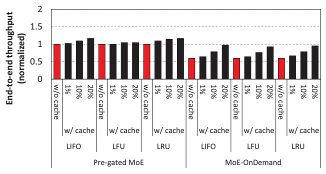

**Fig. 15:** End-to-end throughput of Pre-gated MoE and MoE-OnDemand when evaluated with the Switch-Large (128 experts) model (normalized to Pre-gated MoE without caching). When caching is enabled, we change the fraction of experts that are cached inside the GPU memory (from 1% to 20%) and compare its effectiveness. For the completeness of our study, we evaluate not only the LIFO policy suggested by [14] but also a least frequently used (LFU) replacement policy [38] and a least-recently used (LRU) replacement policy.

MoE demonstrates its robustness and consistently provides superior performance than other CPU-GPU systems.

Caching experts on Pre-gated MoE. Prior work by Huang et al. [14] characterized MoE models for machine translation and language modeling, uncovering the existence of a few hot active experts during inference. Based on such observation, [14] explores *expert buffering* for MoE inference which caches hot, active experts in GPU memory using a last in first out (LIFO) cache replacement policy, while buffering the rest in CPU memory. To evaluate the effectiveness of expert caching [14], [38] on our Pre-gated MoE as well as other CPU offloading based MoE designs, we implement a caching system on top of both Pre-gated MoE and MoE-OnDemand and evaluate its performance.

As shown in Figure 15, caching experts generally provides performance benefits to both Pre-gated MoE and MoE-OnDemand, regardless of the types of the cache replacement policy employed. However, the effectiveness of caching is more pronounced with MoE-OnDemand as the performance overhead incurred with expert migration is more severe under this design point, unlike Pre-gated MoE which is already capable of hiding most of the expert migration latency by overlapping it with expert execution.

Pre-gated MoE with SSD offloading. Prior work [38] evaluates the efficacy of offloading MoE parameters to SSDs as means to deploy even larger LLMs. To evaluate the effectiveness of Pre-gated MoE on top of such design point, we implement Pre-gated MoE and all baseline systems on top of an SSD offloading based MoE serving system, the result of which is summarized in Figure 16. As depicted, the performance benefit of Pre-gated MoE against other baseline systems is decreased compared to a CPU "DRAM" offloaded MoE system. This is because, when the MoE parameters are offloaded to an SSD, the expert migration latency between SSD→GPU becomes much longer compared to migrating it

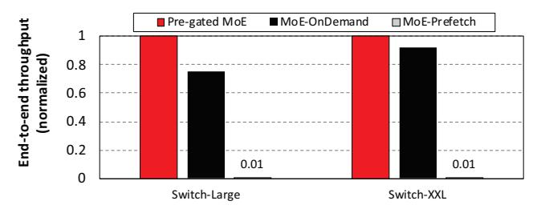

**Fig. 16:** End-to-end inference throughput of SSD offloading. In this experiment, we additionally evaluate a larger MoE model named Switch-XXL, a SwitchTransformer based model architecture that has the identical configuration as Switch-Large but increases both the feature vector dimension size and the number of heads by  $4\times$ , amounting to 395 billion parameters ( $16\times$  more than Switch-Large) and 217 GB in model size after quantization is applied. GPU-only suffers from an OOM error, so performance is normalized to Pregated MoE.

from CPU DRAM (due to the much lower slower data transfer bandwidth between SSD vs. CPU DRAM). Consequently, the expert migration latency becomes such a huge end-to-end performance bottleneck that it completely overwhelms the overall system, rendering the effectiveness of any CPU offloading based approaches to become smaller. Nonetheless, Pre-gated MoE consistently delivers higher performance than all other baseline systems demonstrating its robustness.

#### VII. RELATED WORKS

There exists a large number of prior work exploring ML inference systems for MoE-based LLMs [4], [12], [13], [16], [21], [30], [38], [45]. In this section, we summarize prior work by categorizing them into three different categories: (1) systems for MoE training, 2) systems for MoE inference, and 3) MoE model architectures for efficient MoE deployment.

Systems for the MoE training. Prior work on Fast-MoE [12] and FasterMoE [13] propose system-level optimizations for multi-GPU solutions, specifically tackling the load-imbalance issue in MoE training. Tutel [16] presents dynamic multi-GPU parallelism and pipelining optimization for distributed MoE training systems. SmartMoE [45] explores efficient search strategies for parallelizing MoE training. TA-MoE [4] and Li et al. [21] propose optimizations for MoE training's all-to-all communication and expert routing. Unlike Pre-gated MoE which focuses on inference, all of these prior works concentrate on MoE training over multi-GPU systems, assuming all model parameters are partitioned across the GPUs allowing each model partition to be stored in GPU memory.

Systems for the MoE inference. DeepSpeed-MoE [30] and Li et al. [21] propose efficient communication optimizations as well as compute kernel optimizations for multi-GPU based MoE inference systems. DeepSpeed-inference [1] proposes to offload memory hungry tensors (e.g., activations, parameters) to the CPU memory and NVMe SSD following ZeRO-offload [35] and ZeRO-infinity [31]. DeepSpeed-inference, however, did not evaluate their parameter offloading feature to sparse MoE architectures targeting the memory capacity limited expert parameters. HuggingFace Accelerate [15] and

SE-MoE [38] respectively implement the MoE-OnDemand and MoE-Prefetch systems we evaluate in this paper, a CPU offloading based MoE inference system.

Efficient MoE model architectures. DeepSpeedinference [1] proposed PR-MoE and Mixture-of-Student (MoS) architectures, which help significantly compress down the model size of MoE. However, these models require significant modifications to the model architecture based on knowledge distillation and often result in model accuracy degradation. Furthermore, these models are designed for GPU-only configurations, unlike the CPU offloading based Pre-gated MoE. SE-MoE [38] also proposed a compact MoE model architecture based on distillation, compression, and pruning, but it suffers from non-negligible degradation in model accuracy. Our Pre-gated MoE, on the other hand, only requires modest changes to the MoE model architecture without compromising model accuracy.

#### VIII. CONCLUSION

This paper presents Pre-gated MoE, our algorithm-system co-design for scalable and high-performance MoE inference. Pre-gated MoE effectively addresses the two main challenges of MoE (its large memory footprint and dynamic nature of sparse expert activation) via our novel pre-gate function, which alleviates the dynamic nature of sparse expert activation, allowing our proposed system to address the large memory footprint of MoEs while also achieving high performance. Compared to state-of-the-art MoE inference systems, Pregated MoE improves inference throughput while significantly reducing the GPU memory consumption. Importantly, Pregated MoE offers comparable model accuracy across various natural language processing tasks, facilitating its adoption in a wide range of real-world applications.

## ACKNOWLEDGMENT

This research was supported by the MSIT (Ministry of Science, ICT), Korea, under the High-Potential Individuals Global Training Program (RS-2022-00155958) supervised by the IITP (Institute for Information & Communications Technology Planning & Evaluation) and this project is (partially) supported by Microsoft Research Asia.

