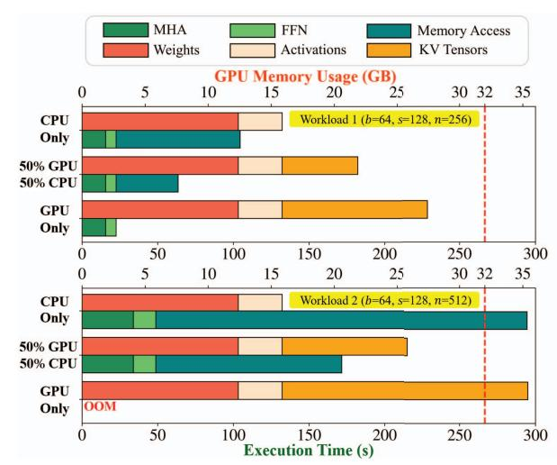

# ALISA: Accelerating Large Language Model Inference via Sparsity-Aware KV Caching

Youpeng Zhao, Di Wu, Jun Wang University of Central Florida Email: {youpeng.zhao, di.wu, jun.wang}@ucf.edu

Abstract—The Transformer architecture has significantly advanced natural language processing (NLP) and has been foundational in developing large language models (LLMs) such as LLaMA and OPT, which have come to dominate a broad range of NLP tasks. Despite their superior accuracy, LLMs present unique challenges in practical inference, concerning the compute and memory-intensive nature. Thanks to the autoregressive characteristic of LLM inference, KV caching for the attention layers in Transformers can effectively accelerate LLM inference by substituting quadratic-complexity computation with linear-complexity memory accesses. Yet, this approach requires increasing memory as demand grows for processing longer sequences. The overhead leads to reduced throughput due to I/O bottlenecks and even out-of-memory errors, particularly on resource-constrained systems like a single commodity GPU.

In this paper, we propose ALISA, a novel algorithm-system codesign solution to address the challenges imposed by KV caching. On the algorithm level, ALISA prioritizes tokens that are most important in generating a new token via a Sparse Window Attention (SWA) algorithm. SWA introduces high sparsity in attention layers and reduces the memory footprint of KV caching at negligible accuracy loss. On the system level, ALISA employs three-phase token-level dynamical scheduling and optimizes the trade-off between caching and recomputation, thus maximizing the overall performance in resource-constrained systems. In a single GPU-CPU system, we demonstrate that under varying workloads, ALISA improves the throughput of baseline systems such as FlexGen and vLLM by up to  $3\times$  and  $1.9\times$ , respectively.

## I. INTRODUCTION

Large Language Models (LLMs) stand as a revolutionary breakthrough in the modern era of artificial intelligence (AI). Distinct from previous small language models with only millions of parameters, LLMs often have hundreds of billions or even trillions of parameters. They have exhibited exceptional abilities in solving complex tasks, such as semantic reasoning and creative writing through text generation. GPT-2 XL, one of the earliest LLMs with 1.5 billion parameters, pioneered in showcasing these capabilities [29]. Its successor, GPT-3, showcases even more powerful abilities with 175 billion parameters [6]. To date, the most noteworthy application of LLMs is ChatGPT from OpenAI [26], a tool that allows users to interact with an AI agent in a conversational way to solve tasks ranging from language translation to software engineering, and beyond.

LLMs usually consist of stacked transformer decoder layers, in which the critical component is self-attention (attention for short in this work) [35]. The attention modules empower LLMs to capture contextual information by attending to different positions within the sequences, which however introduces

Fig. 1: Breakdown of execution time and memory usage for OPT-6.7B inference on one NVIDIA Tesla V100 GPU with 32 GB memory under different workloads. Weights, activations, and KV tensors (intermediate key and value states) denote the required GPU memory. MHA, FFN, and memory access denote the time for computing multi-headed attention, and feed-forward network (both including the follow-up Addition and LayerNorm operations) and KV caching (moving KV tensors between CPU and GPU if any). 50% means the ratio of the KV tensors allocated to CPU/GPU memory. OOM denotes out-of-memory error, and the red-dot line denotes the GPU memory capacity. The b, s, and n for workloads refer to the batch size, and input and output sequence length. Results are reported using FlexGen [31].

quadratic computation complexity with the sequence length. Such complexity severely bottlenecks the performance and scalability of LLMs and is becoming more pronounced upon the pursuit for longer sequences in existing systems [3, 8, 16, 28]. One viable solution to this problem during LLM inference is KV caching [27]. This idea originates from the fact that LLM inference is autoregressive, where LLMs generate new tokens sequentially based on all prior tokens (more details in Figure 2). This characteristic opens up the opportunity of reusing intermediate states, specifically, the key (K) and value (V) tensors, whose sizes increase linearly with the sequence length through caching in attention layers. With KV caching, the quadratic-complexity computation is reduced to linear-complexity computation and memory accesses, therefore substantially speeding up LLM inference.

Challenge. Despite KV caching significantly reducing the inference time, *LLM inference with KV caching is predominantly bottlenecked by memory [28], especially in resourceconstrained systems*, like a single commodity GPU. First, the most expensive operations in LLMs are matrix multiplication and softmax, which are notoriously memory-bound. Second, the weights and activations in LLMs have already raised an alert on the memory capacity. Third, intermediate KV tensors further exacerbate the requirement on memory capacity, which is determined by the sequence length and model dimension. For a given LLM, as the batch size and sequence length increase, the allocated memory for KV caching continues to grow linearly, and at some point, exceeds the available memory capacity. Ultimately, pursuing longer sequences in larger LLMs ends up with an out-of-memory error and halts the execution, as given by the "GPU only" case on workload 2 in Figure 1. To circumvent the out-of-memory error in a single GPU setting, researchers have developed solutions to offload KV tensors to CPU memory or even secondary storage to free up GPU resources in real-world scenarios [31]. However, frequent offloading and reloading of KV tensors incur significant data transfer overhead, which becomes the new bottleneck towards high throughput and low latency in resource-constrained systems, as seen in Figure 1. To this end, we ask: *how to innovate KV caching for LLMs in resourceconstrained systems, to facilitate better scalability and meet the need of longer sequences and larger model sizes.*

Proposal. In this paper, we propose ALISA, an algorithmsystem co-design solution to accelerate LLM inference via sparsity-aware KV caching for single GPU-CPU systems. Our key observation is that *during the autoregressive inference process, the attention weight matrix is highly sparse, and larger LLMs exhibit higher attention weight sparsity.* This observation validates the intuition that not all tokens are created equal and only a small number of important tokens contribute to generating a new token. Once these important tokens are identified, we can selectively access the KV tensors corresponding to these important tokens, and skip unimportant ones. To identify which tokens are important, we formulate a Sparse Window Attention (SWA) algorithm, in which both the globally dynamic and locally static sparse patterns are created. A mixture of these sparse patterns can significantly reduce the memory footprint while maintaining model accuracy due to the ability to better capture important tokens in a sequence.

However, as the size of LLMs keeps growing, the above algorithmic optimization is insufficient to guarantee satisfactory performance, i.e., throughput in this work, for resourceconstrained systems. We argue that *accelerating LLMs is not only a computation problem but more of a memory problem, in the presence of a gigantic memory footprint.* Three bottlenecks are responsible. Firstly, the size of sparse KV tensors will ultimately exceed the memory capacity with longer sequences, and the long-latency GPU-CPU memory accesses in dense LLMs recur. Secondly, the sparse nature of KV tensors induces unpredictable memory access, which is exacerbated

TABLE I: Comparison of prior works and our ALISA. Block means a fixed group of tokens. Head means a single attention module.

| Design                 | vLLM [21]               | FlexGen [31]            | ALISA (Ours)             |
|------------------------|-------------------------|-------------------------|--------------------------|
| Sparse Attn.           | ✗                       | ✗                       | ✓                        |
| Caching Granularity | Block-level (Static) | Head-level (Static)  | Token-level (Dynamic) |
| Recomputation          | ✓                       | ✗                       | ✓                        |
| Scenario               | Online (Multi-GPU)   | Offline (Single-GPU) | Offline (Single-GPU)  |
| Co-Design              | ✗                       | ✗                       | ✓                        |

by longer sequences. To address these two challenges, we propose to dynamically schedule the KV tensors at the token level and balance between caching and recomputation for best performance gain. We highlight this token-level scheduling in Table I. Thirdly, high-precision (FP16 in this work) KV tensors still exhibit a large memory footprint, thus high memory access latency. We can compress KV tensors to lower precision (INT8) via quantization and further reduce the overall memory overhead, without sacrificing the accuracy.

In summary, this paper makes the following contributions:

- We identify the challenges in KV caching for LLM inference and propose an algorithm-system co-design solution, ALISA, for efficient LLM inference in resourceconstrained systems.
- On the algorithm level, we propose sparse window attention (SWA) that creates a mixture of globally dynamic and locally static sparse patterns in KV tensors to reduce the memory footprint while maintaining high accuracy.
- On the system level, we design a three-phase scheduler to dynamically allocate KV tensors between GPU and CPU memory to reduce data transfer at the token level.
- We evaluate ALISA over a wide range of LLM models, tasks, and workloads. Experiments demonstrate that ALISA can significantly reduce the memory footprint of KV tensors and increase the throughput over previous baselines, with negligible accuracy drop.

The remainder of this paper is organized as follows. Section II recaps LLM-related concepts and works. Then, Section III articulates our perspectives on challenges and corresponding opportunities in accelerating LLMs. Next, Section IV and Section V elaborate the algorithm and system design in ALISA, with evaluation followed in Section VI. Finally, Section VII concludes this work.

