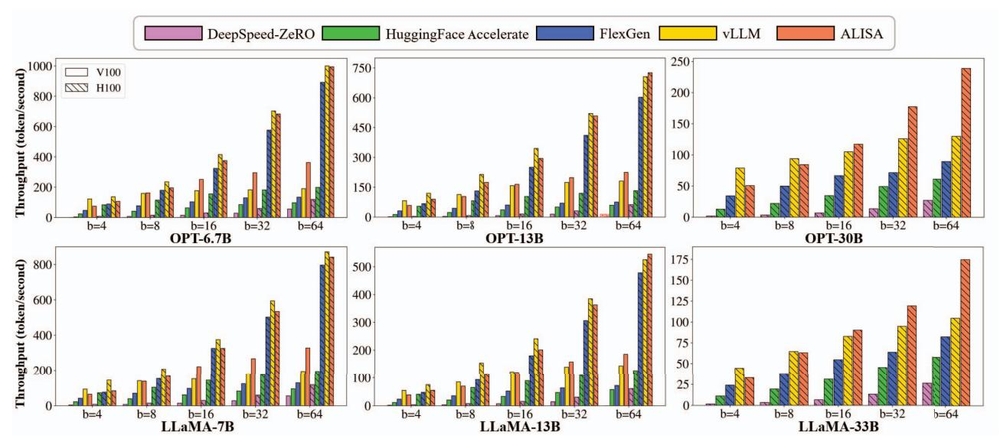
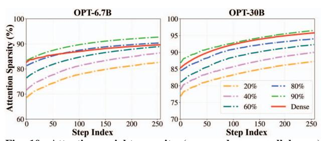
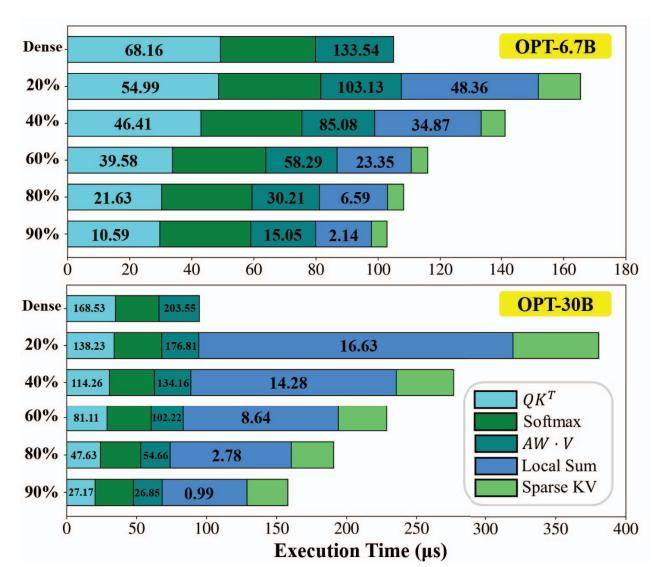
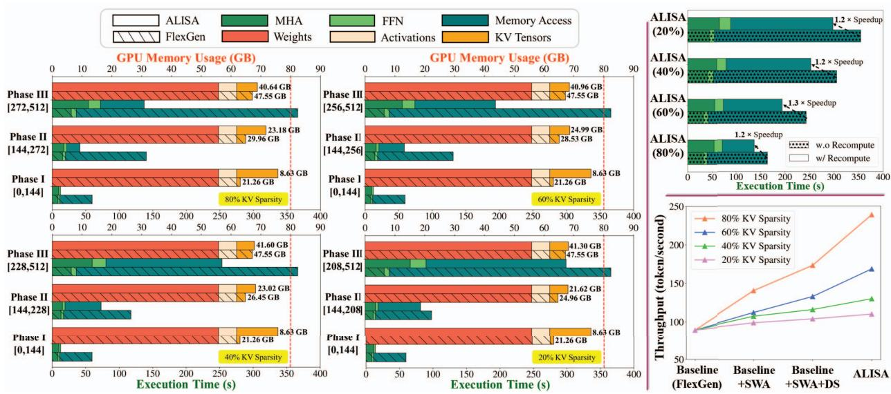

# *B. Accuracy*

We evaluate the accuracy for different KV sparsity, with results given in Figure 8. We observe that *ALISA has consistent and significant improvements over local and strided attention methods* across different model types, model sizes, and datasets, demonstrating the effectiveness of ALISA. We

Fig. 9: Throughput of ALISA with 80% KV Sparisty and baselines, including DeepSpeed-ZeRO [1], HuggingFace Accelerate [39], FlexGen [31], and vLLM [21] on the Alpaca dataset [33]. Along the y-axis, higher measurements are better. OOM denotes out-ofmemory error. We use an input length of 128 and an output length of 512. No results are given for 30B-level models on V100, as the model weights exceed the GPU memory capacity.

Fig. 10: Attention weight sparsity (averaged across all layers) upon different KV sparsity. We consider elements as zeros if they fall below 1% of the row-wise maximum value.

summarize three key insights here. First, ALISA is a much more robust sparse attention method for LLMs. For example, for LLaMA-33B on the top right, the accuracy of local and strided attention collapses instantly when sparse attention is adopted, i.e., the largest accuracy drop occurs from 0% to 20% KV sparsity, while ALISA almost maintains an identical accuracy to that of dense attention up to 80% KV sparsity. Second, ALISA is more robust when LLMs become larger. With ALISA, fewer accuracy collapses occur at 80% KV sparsity when LLM sizes increase from the 7B level to 13B/30B level, regardless of the model families. However, no such trends exist in local and strided attention. Third, KV compression is scalable with almost no accuracy impact for LLMs. In all settings, we see that the accuracy of ALISA almost perfectly tracks that of SWA. In certain settings, ALISA can even outperform dense attention, since well-structured sparsity can often act as regularization to improve accuracy on unseen datasets [19, 38]. Though minor discrepancies exist in

Fig. 11: Execution time of a single attention module. Numbers within the bar indicate the corresponding floating point operations per second (FLOPS), either MAC or ADD. We use a batch size of 64 and a sequence length of 128.

OPT-30B and LLaMA-13B on the COPA dataset, we conclude that KV compression is practically scalable with KV sparsity and model size.

## *C. Performance*

End-to-end Throughput. We further evaluate the end-to-end system performance (i.e., throughput) of ALISA. We choose 80% as the evaluated KV sparsity, as it is the maximum

Fig. 12: LLM inference. All experiments are conducted using OPT-30B with a batch size of 64, input length of 128, and output length of 512 on one NVIDIA H100 GPU. All bars correspond to the sequence length at the end of the phase. (a) Left four: execution time and memory usage of FlexGen and ALISA by our proposed scheduling phase for different KV sparsity. Numbers on the right-hand side of the memory bar indicate CPU memory usage and the red-dot line denotes the GPU memory capacity. (b) Top right: impact of recomputation on the execution time for different KV sparsity at the full sequence length. (c) Bottom right: ablation study on the impact of techniques for different KV sparsity. DS denotes dynamical scheduling.

value for ALISA to retain good algorithmic performance, i.e., perplexity and accuracy, less than 5% drop for most tasks shown in Figure 8. Specifically, the drop for the Alpaca dataset is around 3%. Figure 9 shows the performance of OPT and LLaMA models on the Alpaca dataset. Overall, ALISA offers the highest attainable throughput for LLM inference in resource-constrained systems. There are three key observations. First, ALISA achieves consistent speedup over all baselines, showing  $1.4 \sim 3.0 \times$  higher throughput over FlexGen. Prior works like DeepSpeed-ZeRO are not fully optimized for LLM inference by introducing out-of-memory errors upon large batch sizes, since it does not offload KV tensors. Second, ALISA is more scalable than previous works. As the batch size grows, the speedup of ALISA over FlexGen and other methods increases. Third, ALISA can sustain up to  $1.9 \times$  improvement over vLLM under larger batch sizes and larger model scales, especially when GPU memory capacity is limited. This is due to two reasons: 1) ALISA co-designs the sparsity patterns and KV caching to reduce the memory footprint, while vLLM only optimizes the memory management of KV tensors; 2) the dynamic scheduling strategy in ALISA features recomputation to further alleviate the memory bottleneck upon large KV tensors. Note that when serving smaller models with smaller batch sizes, vLLM outperforms as it is optimized for online serving with fine-grained memory management.

**Attainable Sparsity.** We further show why ALISA can achieve this speedup. Figure 10 shows the achieved sparsity after SWA. Two key observations exist. First, for both LLMs, allowing more sparse KV tensors will increase the sparsity in attention weights. Second, for larger LLMs, we need a higher

KV sparsity to close the gap between the attainable sparsity in our SWA and dense attention. However, the accuracy with higher KV sparsity will likely drop according to Figure 8. Overall, the insight is that ALISA can reasonably take advantage of the opportunities in sparse attention to accelerate LLM inference.

Breakdown of Attention Module. To better understand the impact of SWA, we profile the execution time of key operations in Algorithm 1, with results given in Figure 11. There are two key observations here. First, SWA introduces an execution overhead, which varies across different KV sparsity. Higher KV sparsity in SWA always reduces the execution time. The main sources of reduction are the process of  $QK^T$ , local attention sum, and sparse KV tensors (i.e., using sparse token indices to generate dense KV tensors). Larger LLMs incur higher overheads, especially in local attention sum and sparse KV tensors. The reason is that larger LLMs have larger model dimensions. For example, the hidden dimension and head number increase from [4096, 32] in OPT-6.7B to [7168, 56] in OPT-30B. This larger overhead also validates our argument that prior works that generate sparse attention based on the entire attention weight are not scalable [36, 43]. Second, there exists under-utilization in the  $QK^T$  computation for SWA. The corresponding execution time does not decrease proportionally as KV sparsity increases, leading to a significant FLOPS drop. The main reason is that a smaller dense tensor gathered from sparse KV tensors can not fully utilize massive parallel GPU cores. The execution time for the local sum scales with KV sparsity. Higher sparsity is induced by a lower caching ratio, which in turn reduces the number of additions in the local

sum. However, the local sum could spend more time than  $QK^T$  computation, due to its low data use, i.e., vector vs. matrix operation.

Breakdown of LLM Inference. Figure 12 shows the details of the full LLM inference. There are three key observations in Figure 12 (a). First, ALISA is always faster than FlexGen for all KV sparsity and all phases. With higher KV sparsity, the speedup of ALISA over FlexGen is more significant. Both the time spent on computation and memory access is less when KV sparsity goes higher since fewer KV tensors are involved per step. However, the main contributor to reducing the execution time is that fewer KV tensors need to be moved between CPU and GPU. As we have both statically local and dynamically global sparse patterns, we prefer allocating local tokens in GPU to reduce CPU memory access, since global tokens are less predictable. Second, ALISA always makes better use of the GPU memory than FlexGen in all cases. The total memory requirement of all KV tensors (the total GPU and CPU memory usage) increases with the sequence length. The GPU memory usage is not directly related to KV sparsity, as our dynamic scheduling optimizes the execution time instead of GPU memory usage. Third, the size of KV tensors indeed impacts when a phase starts. Different KV sparsity leads to varying tensor sizes and triggers Phase III at different sequence lengths, and higher KV sparsity enters Phase III later. ALISA in Phase III has a smaller size of KV tensors than FlexGen due to deleting partial KV tensors. Overall, ALISA manages KV caching at the token level and balances the caching and recomputation in a more fine-grained manner than FlexGen. Figure 12 (b) studies the impact of recomputation in Phase III. We observe that recomputation can reduce the total execution time by  $1.2 \sim 1.3 \times$ . Though recomputation induces additional computation overhead, it results in a more substantial reduction in execution time due to decreased memory accesses. Figure 12 (c) shows the ablation study. Across different KV sparsity, we observe that different techniques almost contribute equally, and the gain of each technique increases proportionally with the KV sparsity.

#### VII. CONCLUSION

In this work, we present an algorithm-system co-design solution, ALISA, to accelerate LLM inference in resource-constrained systems. On the algorithm level, ALISA adopts a Sparse Window Attention (SWA) algorithm to create a mixture of globally dynamic and locally static sparse patterns and reduces the memory footprint with negligible accuracy degradation. On the system level, ALISA leverages a three-phase scheduler to dynamically allocate KV tensors and achieves optimal throughput by balancing caching and recomputation. Experiments show that, in single GPU-CPU systems, ALISA achieves up to  $3\times$  and  $1.9\times$  throughput improvement over FlexGen and vLLM, respectively.

#### VIII. ACKNOWLEDGEMENT

This work was sponsored in part by the U.S. National Science Foundation (NSF) under Grants 1907765, 2028481,

and 2400014. The authors would like to thank the anonymous ISCA reviewers for their constructive feedback to improve this work.

#### REFERENCES

- [1] R. Y. Aminabadi, S. Rajbhandari, M. Zhang, A. A. Awan, C. Li, D. Li, E. Zheng, J. Rasley, S. Smith, O. Ruwase, and Y. He, "Deepspeedinference: Enabling efficient inference of transformer models at unprecedented scale," SC22: International Conference for High Performance Computing, Networking, Storage and Analysis, pp. 1–15, 2022.
- [2] L. A. Belady, R. A. Nelson, and G. S. Shedler, "An anomaly in spacetime characteristics of certain programs running in a paging machine," *Commun. ACM*, vol. 12, pp. 349–353, 1969.
- [3] I. Beltagy, M. E. Peters, and A. Cohan, "Longformer: The long-document transformer," ArXiv, vol. abs/2004.05150, 2020.
- [4] S. R. Biderman, H. Schoelkopf, Q. G. Anthony, H. Bradley, K. O'Brien, E. Hallahan, M. A. Khan, S. Purohit, U. S. Prashanth, E. Raff, A. Skowron, L. Sutawika, and O. van der Wal, "Pythia: A suite for analyzing large language models across training and scaling," ArXiv, vol. abs/2304.01373, 2023.
- [5] Y. Bisk, R. Zellers, R. L. Bras, J. Gao, and Y. Choi, "Piqa: Reasoning about physical commonsense in natural language," ArXiv, vol. abs/1911.11641, 2019.
- [6] T. B. Brown, B. Mann, N. Ryder, M. Subbiah, J. Kaplan, P. Dhariwal, and et al, "Language models are few-shot learners," *Advances in neural information processing systems*, vol. 33, pp. 1877–1901, 2020.
- [7] B. Chen, Z. Liu, B. Peng, Z. Xu, J. L. Li, T. Dao, Z. Song, A. Shrivastava, and C. Ré, "Mongoose: A learnable lsh framework for efficient neural network training," *International Conference on Learning Representations*, 2021.
- [8] R. Child, S. Gray, A. Radford, and I. Sutskever, "Generating long sequences with sparse transformers," ArXiv, vol. abs/1904.10509, 2019.
- [9] B. Chmiel, R. Banner, G. Shomron, Y. Nahshan, A. Bronstein, U. Weiser et al., "Robust quantization: One model to rule them all," Advances in neural information processing systems, vol. 33, pp. 5308–5317, 2020.
- [10] S. Dai, H. Genc, R. Venkatesan, and B. Khailany, "Efficient transformer inference with statically structured sparse attention," in 2023 60th ACM/IEEE Design Automation Conference (DAC). IEEE, 2023, pp. 1–6
- [11] T. Dao, "Flashattention-2: Faster attention with better parallelism and work partitioning," *ArXiv*, vol. abs/2307.08691, 2023.
- [12] T. Dao, D. Fu, S. Ermon, A. Rudra, and C. Ré, "Flashattention: Fast and memory-efficient exact attention with io-awareness," *Advances in Neural Information Processing Systems*, vol. 35, pp. 16344–16359, 2022.
- [13] J. Dass, S. Wu, H. Shi, C. Li, Z. Ye, Z. Wang, and Y. Lin, "Vitality: Unifying low-rank and sparse approximation for vision transformer acceleration with a linear taylor attention," 2023 IEEE International Symposium on High-Performance Computer Architecture (HPCA), pp. 415–428, 2022.
- [14] T. Dettmers and L. Zettlemoyer, "The case for 4-bit precision: k-bit inference scaling laws," in *International Conference on Machine Learning*. PMLR, 2023, pp. 7750–7774.
- [15] J. Devlin, M.-W. Chang, K. Lee, and K. Toutanova, "Bert: Pre-training of deep bidirectional transformers for language understanding," in Proceedings of the 2019 Conference of the North American Chapter of the Association for Computational Linguistics: Human Language Technologies, Volume 1 (Long and Short Papers), vol. 1, 2019, p. 2.
- [16] J. Ding, S. Ma, L. Dong, X. Zhang, S. Huang, W. Wang, N. Zheng, and F. Wei, "Longnet: Scaling transformers to 1,000,000,000 tokens," ArXiv, vol. abs/22307.02486, 2023.
- [17] E. Frantar, S. Ashkboos, T. Hoefler, and D. Alistarh, "Gptq: Accurate post-training quantization for generative pre-trained transformers," *International Conference on Learning Representations (ICLR)*, 2023.
- [18] L. Gao, J. Tow, S. Biderman, S. Black, A. DiPofi, C. Foster, L. Golding, J. Hsu, K. McDonell, N. Muennighoff, J. Phang, L. Reynolds, E. Tang, A. Thite, B. Wang, K. Wang, and A. Zou, "A framework for few-shot language model evaluation," 2021. [Online]. Available: https://doi.org/10.5281/zenodo.5371628
- [19] Y. Guo, A. Yao, and Y. Chen, "Dynamic network surgery for efficient dnns," Advances in neural information processing systems, vol. 29, 2016.
- [20] N. Kitaev, L. Kaiser, and A. Levskaya, "Reformer: The efficient transformer," *International Conference on Learning Representations (ICLR)*, 2010.

- [21] W. Kwon, Z. Li, S. Zhuang, Y. Sheng, L. Zheng, C. H. Yu, J. E. Gonzalez, H. Zhang, and I. Stoica, "Efficient memory management for large language model serving with pagedattention," *Proceedings of the ACM SIGOPS 29th Symposium on Operating Systems Principles*, pp. 611–626, 2023.
- [22] J. Lin, J. Tang, H. Tang, S. Yang, X. Dang, and S. Han, "Awq: Activation-aware weight quantization for llm compression and acceleration," *ArXiv*, vol. abs/2306.00978, 2023.
- [23] M. P. Marcus, B. Santorini, and M. A. Marcinkiewicz, "Building a large annotated corpus of english: The penn treebank," *Comput. Linguistics*, vol. 19, pp. 313–330, 1993.
- [24] S. Merity, C. Xiong, J. Bradbury, and R. Socher, "Pointer sentinel mixture models," *ArXiv*, vol. abs/1609.07843, 2016.
- [25] T. Mihaylov, P. Clark, T. Khot, and A. Sabharwal, "Can a suit of armor conduct electricity? a new dataset for open book question answering," *ArXiv*, vol. abs/1809.02789, 2018.
- [26] OpenAI, "Introducting chatgpt," 2022. [Online]. Available: https: //openai.com/blog/chatgpt
- [27] M. Ott, S. Edunov, A. Baevski, A. Fan, S. Gross, N. Ng, D. Grangier, and M. Auli, "fairseq: A fast, extensible toolkit for sequence modeling," in *North American Chapter of the Association for Computational Linguistics*, 2019, pp. 6151–6162.
- [28] R. Pope, S. Douglas, A. Chowdhery, J. Devlin, J. Bradbury, J. Heek, K. Xiao, S. Agrawal, and J. Dean, "Efficiently scaling transformer inference," *Proceedings of Machine Learning and Systems*, vol. 5, 2023.
- [29] A. Radford, J. Wu, R. Child, D. Luan, D. Amodei, and I. Sutskever, "Language models are unsupervised multitask learners," 2019. [Online]. Available: https://insightcivic.s3.us-east-1.amazonaws.com/ language-models.pdf
- [30] K. Sakaguchi, R. L. Bras, C. Bhagavatula, and Y. Choi, "Winogrande: An adversarial winograd schema challenge at scale," *Commun. ACM*, vol. 64, pp. 99–106, 2019.
- [31] Y. Sheng, L. Zheng, B. Yuan, Z. Li, M. Ryabinin, D. Y. Fu, Z. Xie, B. Chen, C. W. Barrett, J. Gonzalez, P. Liang, C. Re, I. C. Stoica, ´ and C. Zhang, "High-throughput generative inference of large language models with a single gpu," in *International Conference on Machine Learning*. PMLR, 2023, pp. 31 094—-31 116.
- [32] H. Shi, J. Gao, X. Ren, H. Xu, X. Liang, Z. Li, and J. T.-Y. Kwok, "Sparsebert: Rethinking the importance analysis in self-attention," in *International Conference on Machine Learning*. PMLR, 2021, pp. 9547–9557.
- [33] R. Taori, I. Gulrajani, T. Zhang, Y. Dubois, X. Li, C. Guestrin, P. Liang, and T. B. Hashimoto, "Stanford alpaca: An instruction-following llama model," https://github.com/tatsu-lab/stanford alpaca, 2023.
- [34] H. Touvron, L. Martin, K. R. Stone, P. Albert, A. Almahairi, Y. Babaei, N. Bashlykov, S. Batra, P. Bhargava, S. Bhosale, D. M. Bikel, L. Blecher, C. C. Ferrer, M. Chen, G. Cucurull, D. Esiobu, J. Fernandes, J. Fu, W. Fu, B. Fuller, C. Gao, V. Goswami, N. Goyal, A. S. Hartshorn, S. Hosseini, R. Hou, H. Inan, M. Kardas, V. Kerkez, M. Khabsa, I. M. Kloumann, A. V. Korenev, P. S. Koura, M.-A. Lachaux, T. Lavril, J. Lee, D. Liskovich, Y. Lu, Y. Mao, X. Martinet, T. Mihaylov, P. Mishra, I. Molybog, Y. Nie, A. Poulton, J. Reizenstein, R. Rungta, K. Saladi, A. Schelten, R. Silva, E. M. Smith, R. Subramanian, X. Tan, B. Tang, R. Taylor, A. Williams, J. X. Kuan, P. Xu, Z. Yan, I. Zarov, Y. Zhang, A. Fan, M. Kambadur, S. Narang, A. Rodriguez, R. Stojnic, S. Edunov, and T. Scialom, "Llama 2: Open foundation and fine-tuned chat models," *ArXiv*, vol. abs/2307.09288, 2023.
- [35] A. Vaswani, N. M. Shazeer, N. Parmar, J. Uszkoreit, L. Jones, A. N. Gomez, L. Kaiser, and I. Polosukhin, "Attention is all you need," in *Advances in neural information processing systems*, vol. 30, 2017.
- [36] H. Wang, Z. Zhang, and S. Han, "Spatten: Efficient sparse attention architecture with cascade token and head pruning," *2021 IEEE International Symposium on High-Performance Computer Architecture (HPCA)*, pp. 97–110, 2020.
- [37] S. Wang, B. Z. Li, M. Khabsa, H. Fang, and H. Ma, "Linformer: Selfattention with linear complexity," *ArXiv*, vol. abs/2006.04768, 2020.
- [38] W. Wen, C. Wu, Y. Wang, Y. Chen, and H. Li, "Learning structured sparsity in deep neural networks," *Advances in neural information processing systems*, vol. 29, 2016.
- [39] T. Wolf, L. Debut, V. Sanh, J. Chaumond, C. Delangue, A. Moi, P. Cistac, T. Rault, R. Louf, M. Funtowicz, and J. Brew, "Huggingface's transformers: State-of-the-art natural language processing," *ArXiv*, vol. abs/1910.03771, 2019.

- [40] T. Wolf, L. Debut, V. Sanh, J. Chaumond, C. Delangue, A. Moi, P. Cistac, T. Rault, R. Louf, M. Funtowicz, and J. Brew, "Transformers: State-of-the-art natural language processing," in *Proceedings of the 2020 conference on empirical methods in natural language processing: system demonstrations*, 2020, pp. 38–45.
- [41] J. Yeo, G. Lee, G. Wang, S. Choi, H. Cho, R. K. Amplayo, and S. won Hwang, "Visual choice of plausible alternatives: An evaluation of imagebased commonsense causal reasoning," in *Proceedings of the Eleventh International Conference on Language Resources and Evaluation (LREC 2018)*, 2018.
- [42] S. Zhang, S. Roller, N. Goyal, M. Artetxe, M. Chen, S. Chen, and et al, "Opt: Open pre-trained transformer language models," *ArXiv*, vol. abs/2205.01068, 2022.
- [43] Z. A. Zhang, Y. Sheng, T. Zhou, T. Chen, L. Zheng, R. Cai, Z. Song, Y. Tian, C. Re, C. W. Barrett, Z. Wang, and B. Chen, "H2o: Heavy- ´ hitter oracle for efficient generative inference of large language models," *ArXiv*, vol. abs/2306.14048, 2023.