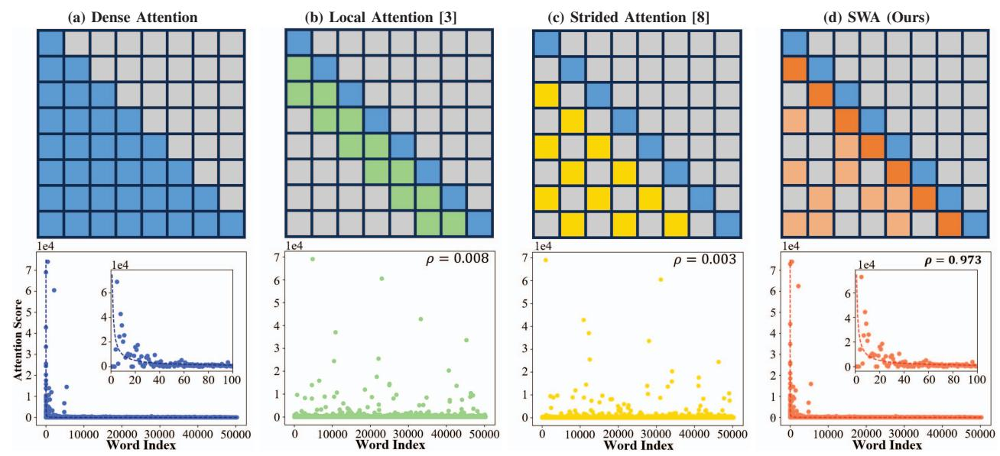
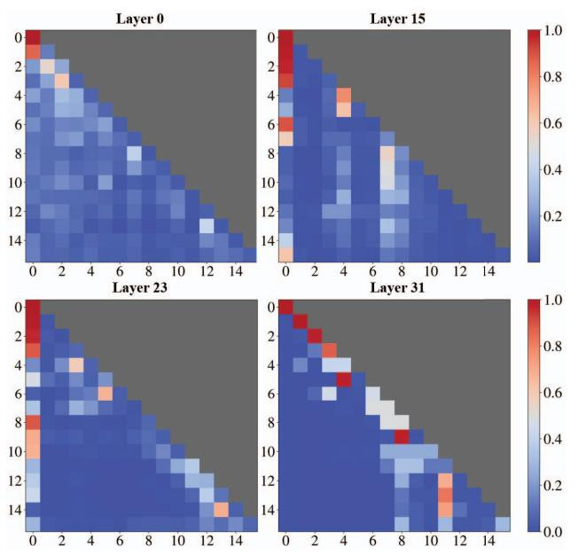
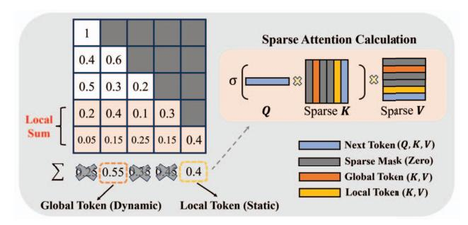
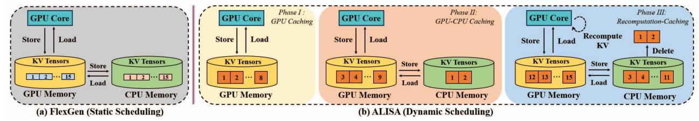
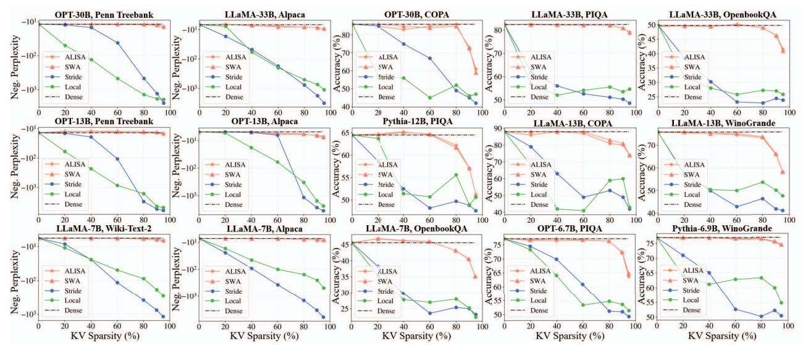

# C. Objective

To make the most of the high sparsity in attention weights, we propose to co-design LLMs in resource-constrained systems from both the algorithm and system sides. Three technical questions need to be answered.

**Identifying Important Tokens.** In the context of LLMs, individual tokens have varying importance. During the inference process, the attention weights for each token vary from step to step. The nondeterministic nature of language makes it extremely hard to predict which tokens are important. Hence we need a low-cost mechanism to distinguish important tokens without hurting accuracy significantly for LLM inference.

Caching KV Tensors. When KV tensors become too large for GPU memory, we have to store partial KV tensors in CPU memory for future reuse. Theoretically, we could use Belady's Algorithm as the caching policy [2], which evicts the tokens that will not be used for the longest period in the future. However, this oracle algorithm assumes future knowledge and imposes a huge amount of resources, making it impractical in LLM inference. Therefore there is a need to develop a low-cost caching policy to allocate sparse KV tensors and ensure a relatively low miss rate.

Caching vs. Recomputation. As the sequence length grows, the benefit of KV caching diminishes at a certain threshold since the time for accessing CPU memory might outweigh that for recomputing partial KV tensors. Moreover, this sequence length threshold varies across batch sizes and model configurations. Thus, we must design a dynamic scheduling strategy that balances KV caching and recomputation at the token level

#### IV. ALISA ALGORITHM DESIGN

#### A. Attention Analysis

In the LLM era, existing works mainly aim to create sparsity in attention weights during LLM inference [3, 8]. Long-former [3] adopts a local attention mechanism, which applies a fixed-size sliding window on the KV tensors corresponding to the most recent tokens. The resultant attention weight pattern is shown on the top of Figure 4 (b). SparseTransformer applies a strided mask on the tokens and creates strided attention [8], as shown on the top of Figure 4 (c).

To understand why the previous attention methods fail upon long sequences, we visualize the dense attention weight maps during LLM inference in Figure 5. We observe that attention weights with larger values do not exhibit a specific pattern. Only using the most recent tokens cannot accurately represent the distribution of the entire attention weights, since the tokens with large attention weights (therefore more important) are often far from the current token. A similar problem exists in strided attention, and the stride mask might not always capture large attention weights. Therefore, the attention weight maps of the local attention and the strided attention can not capture a large portion of attention weights. Subsequently, the corresponding attention score distributions significantly drift away from what is expected in dense attention. At the bottom of Figure 4 (a)-(c), we see that dense attention scores follow a near power-law distribution, which is consistent with previous findings [7, 37]. However, the attention score distributions generated by local and strided attention show close to zero correlation to that of dense attention, thus resulting in drastically lower accuracy.

#### B. Sparse Window Attention (SWA)

To maintain model accuracy, we propose a novel Sparse Window Attention (SWA) method, which produces both *locally static* and *globally dynamic* sparse patterns. We generate static patterns at local tokens by keeping the most recent



Fig. 4: Comparisons of our proposed Sparse Window Attention (SWA) and existing methods. On the top are illustrative sparse patterns for attention weight matrices generated by each method, where the x-axis the positions in the input sequence that are being attended to, and the y-axis represents the positions in the output sequence. The same notation is used in Figure 5. Grey blocks mean the values are masked with zeros, due to the autoregressive LLM inference. On the bottom are the corresponding average attention score distributions in the Wiki-Text-2 dataset vocabulary for the OPT-6.7B model. ρ is the Spearman correlation score between sparse attention and dense attention (higher is better).



Fig. 5: Average attention weight maps for dense attention in OPT-6.7B on the Wiki-Text-2 dataset [24]. The sequence length is 16. Grey blocks mean the values are masked with zeros, due to the autoregressive LLM inference.

tokens to preserve language sequential semantics and generate dynamic patterns to capture the dynamically changing semantic importance of prior tokens. The importance of the prior



Fig. 6: An illustrative example of our proposed Sparse Window Attention (SWA) algorithm using 40% caching ratio. The left matrix denotes the attention weight map. We calculate the local attention sum using solely the two most recent tokens. The locally static token is kept regardless of the value of the local attention sum. The globally dynamic token is selected as the one with the highest local attention sum.

tokens for future token generation is determined by the sum of the local attention weights. Figure 6 draws an example of our SWA algorithm, with the algorithm details formulated as in Algorithm 1.

Our method is based on the hypothesis that multiple preceding steps can provide better hints on which tokens are more important than a single step. The resultant sparse patterns are shown on the top of Figure 4 (d). Note that there do exist prior works that generate sparse patterns based on the entire attention weights [36, 43]. However, the entire attention weights will quadratically increase memory footprint with

## Algorithm 1 ALISA's Sparse Window Attention

**Input:** Previous attention weight AW, query Q, keys and values K, V, caching ratio r, sequence length n, hidden dimension d. Note that this work evenly splits final tokens into k globally dynamic and k local static tokens. The local attention sum is also reduced along the head dimension (not shown for conciseness).

## Output: Attention score Attn

```
\begin{array}{lll} 1: & k = \left \lfloor \frac{nr}{2} \right \rceil \\ 2: & S = \sum AW[n-k:n-1] \\ 3: & I^l = [n-k,...,n-1] \\ 4: & I^g = \operatorname{argmax}_k S \\ 5: & I = [I^l,I^g] \\ 6: & K_s, V_s = K[I,:], V[I,:] \\ 7: & AW = \sigma(\frac{QK_s^T}{\sqrt{d}}) \\ 8: & Attn = AW \cdot V_s \\ 9: & \mathbf{return} \ Attn \\ \end{array} \qquad \begin{array}{ll} \triangleright \ \operatorname{Local} \ \operatorname{attention} \ \operatorname{sum} \\ \triangleright \ \operatorname{Locally} \ \operatorname{static} \ \operatorname{tokens} \\ \triangleright \ \operatorname{Globally} \ \operatorname{dynamic} \ \operatorname{tokens} \\ \triangleright \ \operatorname{Sparse} \ \operatorname{KV} \ \operatorname{tensors} \\ \triangleright \ \operatorname{Sparse} \ \operatorname{KV} \ \operatorname{tensors} \\ \triangleright \ \operatorname{Sparse} \ \operatorname{KV} \ \operatorname{tensors} \\ \triangleright \ \operatorname{Sparse} \ \operatorname{KV} \ \operatorname{tensors} \\ \triangleright \ \operatorname{Sparse} \ \operatorname{KV} \ \operatorname{tensors} \\ \triangleright \ \operatorname{Sparse} \ \operatorname{KV} \ \operatorname{tensors} \\ \triangleright \ \operatorname{Sparse} \ \operatorname{KV} \ \operatorname{tensors} \\ \triangleright \ \operatorname{Sparse} \ \operatorname{KV} \ \operatorname{tensors} \\ \triangleright \ \operatorname{Sparse} \ \operatorname{KV} \ \operatorname{tensors} \\ \rightarrow \ \operatorname{Cocally} \ \operatorname{Sparse} \ \operatorname{KV} \ \operatorname{tensors} \\ \rightarrow \ \operatorname{Cocally} \ \operatorname{Model} \\ \rightarrow \ \operatorname{Sparse} \ \operatorname{KV} \ \operatorname{tensors} \\ \rightarrow \ \operatorname{Sparse} \ \operatorname{KV} \ \operatorname{tensors} \\ \rightarrow \ \operatorname{Cocally} \ \operatorname{Model} \\ \rightarrow \ \operatorname{Sparse} \ \operatorname{KV} \ \operatorname{tensors} \\ \rightarrow \ \operatorname{Cocally} \ \operatorname{Model} \\ \rightarrow \ \operatorname{Sparse} \ \operatorname{KV} \ \operatorname{tensors} \\ \rightarrow \ \operatorname{Cocally} \ \operatorname{Model} \\ \rightarrow \ \operatorname{Sparse} \ \operatorname{KV} \ \operatorname{tensors} \\ \rightarrow \ \operatorname{Cocall} \ \operatorname{Model} \\ \rightarrow \ \operatorname{Sparse} \ \operatorname{KV} \ \operatorname{Model} \\ \rightarrow \ \operatorname{Cocally} \ \operatorname{Model} \\ \rightarrow \ \operatorname{Cocally} \ \operatorname{Model} \\ \rightarrow \ \operatorname{Sparse} \ \operatorname{KV} \ \operatorname{Model} \\ \rightarrow \ \operatorname{Cocally} \ \operatorname{Model} \\ \rightarrow \ \operatorname{Cocally} \ \operatorname{Model} \\ \rightarrow \ \operatorname{Cocally} \ \operatorname{Model} \\ \rightarrow \ \operatorname{Cocally} \ \operatorname{Model} \\ \rightarrow \ \operatorname{Cocally} \ \operatorname{Model} \\ \rightarrow \ \operatorname{Cocally} \ \operatorname{Model} \\ \rightarrow \ \operatorname{Cocally} \ \operatorname{Model} \\ \rightarrow \ \operatorname{Cocally} \ \operatorname{Model} \\ \rightarrow \ \operatorname{Cocally} \ \operatorname{Model} \\ \rightarrow \ \operatorname{Cocally} \ \operatorname{Model} \\ \rightarrow \ \operatorname{Cocally} \ \operatorname{Model} \\ \rightarrow \ \operatorname{Cocally} \ \operatorname{Model} \\ \rightarrow \ \operatorname{Cocally} \ \operatorname{Model} \\ \rightarrow \ \operatorname{Model} \ \operatorname{Model} \\ \rightarrow \ \operatorname{Model} \ \operatorname{Model} \\ \rightarrow \ \operatorname{Model} \ \operatorname{Model} \\ \rightarrow \ \operatorname{Model} \ \operatorname{Model} \\ \rightarrow \ \operatorname{Model} \ \operatorname{Model} \\ \rightarrow \ \operatorname{Model} \ \operatorname{Model}  \rightarrow \ \operatorname{Model} \ \operatorname{Model} \ \operatorname{Model} \ \operatorname{Model} \ \operatorname{Model}  \rightarrow \ \operatorname{Model} \ \operatorname{Model} \ \operatorname{Model} \ \operatorname{Model} \ \operatorname{Model} \ \operatorname{Model}  \rightarrow \ \operatorname{Model} \ \operatorname{Model} \ \operatorname{Model} \ \operatorname{Model} \ \operatorname{Model} \ \operatorname{Model} \ \operatorname{Model} \ \operatorname{Model} \ \operatorname{Model} \ \operatorname{Model} \ \operatorname{Model} \ \operatorname{Model} \ \operatorname{Model} \ \operatorname{Model} \ \operatorname{Model} \ \operatorname{Model} \
```

sequence length, thus not scalable upon long sequences. We plot the distribution of the resultant attention scores at the bottom of Figure 4 (d). Unlike previous fixed sparse patterns, our SWA produces a nearly identical power-law distribution as the dense attention and obtains a Spearman correlation score close to 1. This similarity validates the efficacy of our SWA algorithm. The details of SWA are formulated in Algorithm 1. Two key differences exist between dense attention and SWA. First, the algorithm entails a caching ratio to determine how many tokens to keep at each step for KV sparsity and apply the sparse masks at the token level. While irregular sparsity could exist across tokens, each token is still a dense tensor. Second, we use gather operations to pack sparse KV tensors into a dense one and perform dense matrix operations. Therefore, despite the multi-step attention calculation in SWA, both the computation and memory access for SWA remain regular, if we target a proper granularity.

#### V. ALISA SYSTEM DESIGN

Since SWA introduces sparse KV tensors dynamically, designing a system for LLM inference that handles such sparsity effectively is essential. We propose dynamic scheduling to ensure SWA lives up to its potential at the system level. Then, we leverage KV compression to further improve the system-level performance. Our proposed ALISA is a synergetic symbiosis of SWA, dynamic scheduling, and KV compression. Specifically, SWA identifies important KV tensors and generates sparse patterns. Then the dynamic scheduling utilizes important tokens and user-specified caching ratio to balance sparsity-aware caching and recomputation at the token level during LLM inference. The KV compression further reduces the overall memory footprint of KV tensors by quantizing them into INT8 format.

## A. Dynamic Scheduling

**Three-Phase Scheduling.** Since the size of KV tensors gradually increases with longer sequences, it is evident that the

## Algorithm 2 ALISA's Dynamic Scheduling

1: **Initialization:** GPU core GC, GPU memory GM, CPU memory CM, sequence length n, phase switch step  $\{p_1, p_2\}$ , offload ratio  $\alpha$  and recompute ratio  $\beta$  for KV tensors.

```
2: for all j < n do
 3: # Load
                                                       ▷ Phase II & III
 4:
        if j \geq p_1 then
             CM \rightarrow GM.load(*)
 5.
         end if
 6:
 7:
         GM \rightarrow GC.load(*)
                                                      ▶ Phase I&II&III
 8: # Compute
        if j \geq p_2 then
                                                             ▶ Phase III
 9:
             Recompute(*)
10:
11:
         Update(K_i, V_i)

12:
13: # Store
         GC \rightarrow GM.store(K_i, V_i)
                                                      ▶ Phase I&II&III
14:
        if j > p_1 then
                                                              ▶ Phase II
15:
             if j \geq p_2 then
                                                             ▶ Phase III
16:
                 CM.delete(K_i^{\beta}, V_i^{\beta})
17:
18:
             GM \rightarrow CM.store(K_i^{\alpha}, V_i^{\alpha})
        end if
20.
21: end for
```

engaged memory will increase over time. Due to the high cost of CPU memory I/O accesses, one shall balance the memory access and computation at the token level to maximize the performance. Our scheduling is described as follows.

- Phase I: GPU Caching. All KV tensors can fit in GPU memory and are stored in the GPU.
- Phase II: GPU-CPU Caching. The total size of all KV tensors exceeds the capacity of GPU memory, and the KV tensors are split at the token level on both GPU and CPU memory and accessed upon need.
- Phase III: Recomputation-Caching. After a certain sequence length, partial KV tensors are deleted from the CPU and recomputed in GPU if needed instead of being accessed from CPU memory.

We illustrate our scheduling with an illustrative example in Figure 7 (b) and a formulation in Algorithm 2. Each inference pass contains load, compute, and store parts. Load from GPU memory to GPU core is mandatory for all phases. In Phase II and III, load from CPU to GPU happens before load from GPU memory to GPU core. The new KV tensors will be computed and then stored in GPU memory. In Phase II and III, certain KV tensors in GPU memory will be stored (offloaded) to CPU memory. Since the global sparse patterns vary from step to step, we choose to keep the KV tensors for the locally static tokens in the GPU and store the preceding ones in the CPU. Though there exist caching policies such as Belady's Algorithm [2], such oracle methods could be too computationally expensive to be impractical for efficient LLM inference. Our heuristic-based caching policy can effectively



Fig. 7: (a) FlexGen's static scheduling. This scheduling splits KV tensors along the head dimension and remains static across different sequence lengths. (b) ALISA's dynamic scheduling. In phase I, the entire KV tensors are small enough to fit in GPU memory, and no CPU memory access exists. In phase II, when GPU capacity is not enough for all KV tensors, the CPU is also used for caching preceding KV tensors. In phase III, recomputing partial KV tensors is faster than retrieving them from CPU memory. These KV tensors are deleted from CPU memory and recomputed in GPU. The phase change is triggered by the sequence length, and the autoregressive inference of different tokens can be in different phases.

TABLE II: Notations.

| h, l, b                   | hidden dimension, layer count, batch size  |
|---------------------------|--------------------------------------------|
| s, n                      | input length, output length                |
| r, B                      | KV caching ratio, CPU-GPU bandwidth        |
| $\alpha, \beta, p_1, p_2$ | offload/recompute ratio, phase switch step |
| $T^c, T^r$                | Time for compute and recompute             |
| $T^m$                     | Time for KV caching (CPU-GPU)              |
|                           |                                            |

reduce the potential CPU memory access with small enough compute overheads (compared to the memory bottleneck). In Phase III, we delete the oldest KV tensors in the CPU and recompute these KV tensors in the GPU core when needed.

In contrast, prior works usually pre-defined static scheduling for KV tensors throughout the LLM inference [21, 31, 43], as shown in Figure 7 (a). They fail to leverage the opportunity from dynamic memory capacity changes upon longer sequences, leading to sub-optimal performance.

**Sparsity-Aware Caching.** The subsequent question is how to determine the phase switch step and offload and recompute ratio of KV tensors. We formulate this question as an optimization problem to minimize the total execution time. We list the relevant notations in Table II. With FP16 format, the size of KV tensors for each token is  $4 \cdot b \cdot l \cdot h$  bytes. At a sequence length j, we denote the number of tokens moved from GPU to CPU as  $\theta_j^c(\alpha) = \alpha(j+s)$  and the number of tokens moved from CPU to GPU as  $\theta_j^g$ . The execution time of caching at step j can be estimated as:

$$T_j^m(\alpha) = \frac{4 \cdot b \cdot l \cdot h \cdot (\theta_j^c + \theta_j^g)}{B}$$
 (3)

$$p_1 \le j < n, \quad 0 \le \theta_j^g \le \lfloor (s+j)r \rceil$$
 (4)

The optimization of the total execution time is formulated as:

$$\min_{\{\alpha,\beta,p_1,p_2\}} \sum_{j=1}^{p_2} T_j^c + \sum_{j=p_1}^n T_j^m(\alpha) + \sum_{j=p_2}^n T_j^r(\beta)$$
 (5)

s.t. 
$$0 \le p_1 < p_2 \le n, 0 < \alpha < 1, 0 < \beta < 1$$
 (6)

We solve this problem by dividing it into two sub-problems, including a data transfer problem and a computation problem. The data transfer problem (the second term) is solved using hardware and software constraints, including memory capacity, bandwidth, KV tensor size, etc. Conversely, the computation problem (the first and third terms) is solved via profiling. We profile the execution time for compute and recompute with different configurations and create a mapping between input configurations and their execution time. Then, we apply a greedy search method to solve the optimization problem for the best performance. This process is done offline, introducing no overhead during LLM inference.

#### B. KV Compression

Previous works have utilized quantization to accelerate attention computation by compressing model weights [17, 22]. In this work, we leverage quantization for a different purpose, i.e., compressing KV tensors to reduce memory access. We adopt a fine-grained channel-wise quantization for KV tensors for better inference robustness [9]. More specifically, we use the following formula to quantize KV tensors to *b*-bit integers in memory and de-quantize them to their original format (FP16 in this work) for computation:

$$x_{\text{quant}} = \text{round}(\frac{1}{\lambda}x + z), \quad x = \lambda(x_{\text{quant}} - z)$$
 (7)

where the scaling factor  $\lambda = \frac{max - min}{2^b - 1}$ , and zero point  $z = \text{round}(\frac{-2^b}{max - min})$ . Previous work finds that for OPT model can be compressed up to INT4 while maintaining accuracy [14]. In this work, we choose to quantize KV tensors to INT8 to ensure our KV compression can be generalized to more LLMs.

## VI. EVALUATION

## A. Experimental Setup

**Models and datasets.** We use three open-sourced families of LLM models: OPT with 6.7B, 13B, and 30B parameters [42], LLaMA with 7B, 13B, and 33B parameters [34], and Pythia with 6.7B and 12B parameters [4]. For algorithm-related evaluations, we use the lm-evaluation-harness library [18] and perform two popular language-related tasks on seven



Fig. 8: Accuracy of ALISA (SWA + Compression), SWA, dense attention, local attention [3], and strided attention [8]. Along the y-axis, we arrange the measurements to be higher is better. The input length is set to 2048 for all the datasets to match the maximal context length of each LLM. Negative perplexity and accuracy are utilized to measure the language modeling and question-answering tasks, respectively.

different datasets, namely language modeling for Wiki-Text-2 [24], Penn Treebank [23] and Alpaca [33], and 4-shot question-answering inference for PIQA [5], COPA [41], Open-BookQA [25], and Winogrande [30]. We report task-specific metrics, e.g., perplexity for language modeling and accuracy for question-answering, across different model types and scales. We set the input length as 2048, matching the maximal context length for LLMs, to showcase the algorithmic performance (perplexity and accuracy in this work) when operating at full context.

For the system evaluation, we sample and tokenize inputs from the Alpaca dataset. We use an input sequence length of 128 and an output sequence length of 512 to test our system under varying batch size configurations, ranging from 4 to 64. We aim to evaluate the LLM system performance at all possible model scales, unless the configuration is not available (e.g., Pythia-30B does not exist). The evaluation metric for performance is token throughput, defined as the end-to-end execution time (both prefilling and decoding stages) divided by the total number of generated tokens.

Baselines. To validate the accuracy, we use dense attention, local attention [3], and strided attention [8] as our baselines. For system experiments, we use DeepSpeed-ZeRO [1], HuggingFace Accelerate [39], and FlexGen [31], and vLLM [21]as baselines. DeepSpeed-ZeRO is a deep learning optimization software developed to improve the computation and memory efficiency of training and inference for large models. For LLM inference, DeepSpeed-ZeRO performs offloading weights instead of intermediate KV tensors. HuggingFace Accelerate is another open-sourced library that focuses on promoting easy and reproducible transformer-based research. It supports offloading the whole KV tensors to the CPU memory during LLM inference. FlexGen is a very recent LLM-specific work that focuses on optimizing LLM inference in single GPU-CPU systems. It defines a static scheduling allocation strategy by solving an offline linear programming problem to minimize the total execution time given the memory constraints. vLLM is a dedicated online LLM inference serving system for multitenant user requests [21]. It manages the KV tensors at the block level (fixed group of tokens). Each block is stored in non-contiguous paged memory and is swapped between CPU and GPU memory.

Implementation. We conduct our experiments in single GPU-CPU systems. We use two types of GPUs, namely NVIDIA Tesla V100 with 16/32 GB HBM and NVIDIA H100 with 80 GB HBM. Due to GPU memory constraints, we run 30B level models only on H100 GPUs. The CPU is 2.60 GHz Intel Xeon with 128 GB DRAM, and the bandwidth between GPU and CPU is 20 GB/s. ALISA is implemented on top of Flex-Gen [31] and HuggingFace Transformers [40]. FlexGen allows users to offload model weights, KV tensors, and activations simultaneously. Since we focus on optimizing KV caching, we keep both the model weights and activations always in GPU memory. In terms of memory allocation, we manage the memory space at the token level and schedule KV tensors in a layerwise manner. We use the FP16 format for all variables, except the KV compression.

