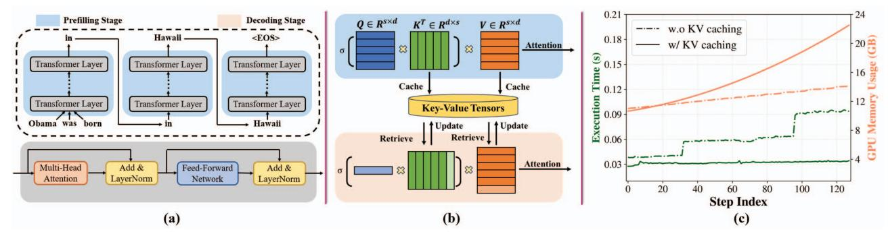
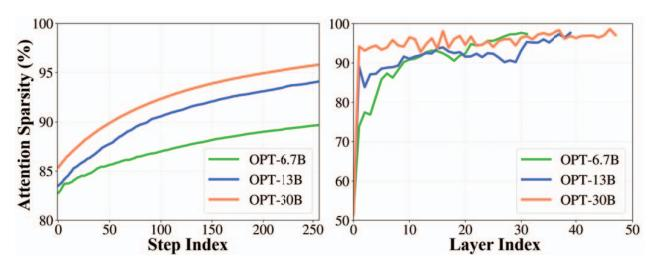

# II. BACKGROUND

In this section, we first present some preliminary knowledge of LLMs, including autoregressive inference, the Transformer layer, and KV caching. Afterwards, we discuss related works.

Fig. 2: (a) Top: an example of autoregressive LLM inference. EOS refers to end-of-sentence. Bottom: operation blocks in transformer layers. (b) KV caching: Q, K, V denotes the query, key, and value tensors. At the prefilling stage, all input tokens are processed simultaneously, and the generated intermediate KV tensors are stored, marked by dark colors. s and d represent the input sequence length and the hidden dimension size of KV tensors. At the decoding stage, the stored KV tensors in the dark colors are retrieved. The input Q, K, V tensors are marked by the light colors. The input Q tensor is multiplied with a concatenation of input K and stored K tensors, followed by a softmax of the entire attention weights. The attention weight are further multiplied with a concatenation of input V and stored V tensors to generate new results. Afterward, the input K and V tensors are stored. This process is repeated per token. (c) Execution time and GPU memory usage for OPT-6.7B inference with and without KV caching. The x-axis step index means the output sequence length. Results are reported using HuggingFace Accelerate [39].

## A. Large Language Models

Autoregressive Inference. Transformer-based language models function by processing a sequence of input words and generating new, related words as output. Compared with previous small language models in the pre-LLM era, the most distinctive characteristic of LLMs is that LLM inference is autoregressive, i.e., output tokens solely depend on past tokens. Figure 2 (a) gives an example of such an autoregressive behavior in LLM inference on the top. The inference process can be divided into two parts, including the prefilling and decoding stages. During the prefilling stage, LLMs process all the input tokens in a single pass. Then, during the decoding stage, a previously generated output token is fed back into the model as an input and generates the next output token. Therefore, the decoding stage unfolds iteratively, processing one token at a time. When the sequence length reaches a maximum threshold (specified by users or service providers) or an "(EOS)" token is emitted, the decoding process stops. Inside the LLMs, the input words are first tokenized to continuous vectors using an embedding layer (not shown for simplicity) and then go through stacked transformer layers. All transformer layers are identical and include a multi-head attention (MHA) layer and a feed-forward network (FFN) layer, as shown at the bottom in Figure 2 (a). There exist addition and layer normalization layers after MHA and FFN layers. We consider them as part of the MHA and FFN layers in this work during evaluation. Finally, the outputs of transformer layers will go through a linear projection and a softmax layer to generate the corresponding token for the next word (not shown).

**Transformer Layer.** At the core of transformer layers lies the attention module [35]. The relevant operations are given in Equation 1 and 2. There are three intermediate tensors involved, namely, query Q, key K, and value V. The attention

weights AW(Q,K) are calculated by first computing the dot product between Q and K, then scaling the product by the square root of hidden dimension d, and finally going through a softmax operation  $(\sigma(\cdot))$ . The attention scores Attn(Q,K,V) are calculated by multiplying the attention weights AW(Q,K) to V. The MHA output is obtained by simply concatenating the outputs of all attention heads along the head dimension, with each head being an attention module.

$$AW(Q,K) = \sigma(\frac{QK^T}{\sqrt{d}}) \tag{1}$$

$$Attn(Q, K, V) = AW(Q, K) \cdot V \tag{2}$$

**KV Caching.** According to Equation 1, the attention operation induces quadratic computation complexity with respect to the sequence length. An example is given at the top of Figure 2 (b). The sequence length quadratically increases the size of the attention weight matrix, therefore quadratically increasing execution time. This overhead is exacerbated when pursuing longer sequences for larger models [3, 8, 16, 28]. To mitigate such a quadratic overhead for LLM inference, KV Caching is proposed to store the intermediate tensors such as key (K) and value (V) tensors in attention layers for computation reuse in future decoding steps [27]. The bottom of Figure 2 (b) showcases how KV caching works. KV caching transforms the original matrix multiplication with quadratic complexity into vector-matrix multiplication and memory accesses with linear complexity, thus significantly improving the performance. Figure 2 (c) draws the execution time and memory usage for LLM inference with and without KV caching. Without KV caching, the execution time increases rapidly, due to calculating the entire attention repeatedly. With KV caching, only the attention weights and scores for the newly generated token are calculated as vector-matrix multiplication, and the execution time stays almost constant across different steps.

However, such runtime reduction is at the expense of GPU memory usage, which increases gradually over time, due to the growing size of KV tensors.

## B. Related Work

Algorithmic Optimization for Attention. On the algorithm side, various optimizations have been proposed to address the quadratic complexity of attention modules. In the pre-LLM era, algorithm optimizations largely focus on reducing the attention complexity through approximation methods. For example, Linformer [37] and Reformer [20] approximate the original attention using low-rank matrices and localitysensitive hashing, respectively, achieving almost linear complexity. However, these approximations are not able to offer competitive accuracy in LLMs. Another line of algorithmic optimization is to create sparse patterns in attention modules [3, 8, 10, 32]. However, most sparsity-driven methods require additional training, which is not scalable for LLMs and cannot guarantee accuracy performance [10, 32]. In the LLM era, Longformer [3] constructs the sparse attention using a fixed-size sliding window on the most recent local tokens. SparseTransformer [8] generates sparse patterns with a fixed stride on all tokens. However, these sparse attention methods are not able to capture important tokens during the autoregressive LLM inference, resulting in accuracy collapse.

Hardware Acceleration for Attention. For small language models, accelerators that utilize algorithm-hardware co-design have been proposed [13, 36]. For example, SpAtten co-designs the algorithm and accelerator architecture to improve the sparsity in attention modules and reduce both the compute and memory overheads in matrix multiplication operations [36]; ViTALiTy approximates the dot-product softmax operation in attention modules using first-order Taylor expansion and linearizes the relevant cost [13]. Though these accelerators are quite effective in the pre-LLM era, their merit fades away in LLM inference, due to their fundamental limitations. First, pre-LLM accelerators simply can not handle the large model size of LLMs. For example, SpAtten balances its design choices among algorithm complexity, computation throughput, and memory capacity for the BERT [15], GPT-2 small and medium model [29]. However, the largest GPT-2 medium model has only 0.36 billion parameters, not even a fraction of that for LLMs, e.g., 175 billion parameters for GPT-3 [6], which engages 652 GB for single-precision model weights. Naively slabbing large memory onto the computing kernels does not offer Pareto efficiency. Second, prior co-designed accelerators are not able to further scale up with longer sequences. For example, SpAtten requires storing the entire attention weights to prune away unwanted tokens. However, the size of the attention weight matrix increases quadratically with sequence length. In the era of LLMs, given limited memory capacity, especially in resource-constrained systems, squeezing memory from KV tensors to attention weights will certainly degrade the efficacy of KV caching and slow down the inference.

KV Caching Optimization. In the LLM era, numerous specialized LLM systems have been developed. We compare some of these systems in Table I. For example, FlashAttention aims to reduce memory accesses between on-chip SRAM and off-chip HBM in GPUs for higher throughput with finegrained tiling and partitioning at the kernel level [11, 12]. However, it does not optimize the memory accesses between CPUs and GPUs. vLLM proposes storing intermediate KV tensors at the block level, where each block contains a fixed number of tokens and is stored in non-contiguous paged memory to alleviate memory fragmentation for online LLM inference [21]. Identical to this work, FlexGen also targets resource-constrained systems [31]. FlexGen formulates a static offloading strategy for KV tensors throughout the LLM inference and manages them at the head level.  $H_2O$  designs a KV caching policy by retaining heavy hitters  $(H_2)$  tokens, which are determined by the global attention weight sum [43], rather than the local attention weight sum in ALISA. To summarize, three features differentiate ALISA from prior works. First, ALISA co-designs both the algorithm and system to fully exploit sparse attention for higher throughput, while previous works focus solely on either algorithm improvement  $(H_2O)$ or system improvement (vLLM, FlexGen). Second, ALISA performs KV caching at the granularity of one token, allowing flexible KV tensor allocation, which is critical upon sparsitydriven co-design. Third, ALISA adopts an appropriate dynamic scheduler to perform both caching and recomputation, while previous works only employ static KV caching [31, 43].

#### III. CHALLENGES AND OPPORTUNITIES

### A. Challenges

Despite KV caching has significantly improved the end-to-end performance for LLMs by avoiding quadratic-complexity computation, it still introduces a linear-complexity memory footprint. During LLM inference, we have to allocate GPU memory to store intermediate KV tensors. The corresponding memory footprint can vary from hundreds of megabytes to hundreds of gigabytes, depending on batch size, sequence length, and model configuration. As shown in Figure 2 (c), the GPU memory usage with KV caching is about 60% higher than that without KV caching with only 128 tokens in the sequence. In half-precision data format, running OPT-13B with a sequence length of 512 at a batch size of 64 imposes more than 25 GB of memory for KV tensors, which is even larger than the model weight size (about 23 GB). When the sequence length increases, this gap will be further widened.

In resource-constrained systems (e.g., a single GPU with limited memory), KV tensors ought to be offloaded to nextlevel memory hierarchies, such as CPU memory or even secondary storage, when the size of KV tensors exceeds the capacity of the GPU memory. However, offloading and reloading KV tensors incur significant data transfer overhead (e.g., I/O access between GPU and CPU memory on the PCIe bus), as shown in Figure 1. Storing 50% KV tensors in CPU memory will increase the overall execution time of LLM inference by  $3\times$ ; and this slowdown reaches  $5\times$  if storing

Fig. 3: Attention weight sparsity observed across different steps and layers during OPT model inference using the Wiki-Text-2 dataset [24]. We consider elements as zeros if they fall below 1% of the row-wise maximum value.

all KV tensors in CPU memory. Given this bottleneck in KV caching, we need to find a solution that orchestrates when, how, and what to offload and reload in resource-constrained systems, so that the overall execution time is minimized.

## B. Opportunities

Let's start with a simple example. Given the question "What is the capital of France?", we humans only need to pay attention to 'capital' and 'France' to respond with the answer "Paris." The intuition is that not all words (tokens) are created equal, and some are more important than others. This intuition has been leveraged in accelerating transformers in the pre-LLM era. Prior works for small language models empirically keep the tokens that lead to large attention weights, and prune away those with smaller weights [36]. In this work, we take one more step to corroborate this intuition in LLMs by profiling the sparsity in attention weights, as shown in Figure 3. We have two key observations. First, the attention weights in LLMs are highly sparse, e.g., the sparsity can vary between 80% and 95% across different inference steps, and reach close to 99% in some layers. Second, larger LLMs exhibit higher sparsity, e.g., the density (i.e., 1 - sparsity) of OPT-30B is about  $3\times$  less than that of OPT-6.7B. These observations translate to the fact that, from a computation perspective, very few elements in the attention weight matrix contribute to calculating the final attention score and generating new tokens in LLMs. This both motivates and validates our solution to create sparse KV tensors by skipping unimportant tokens in LLM inference.

