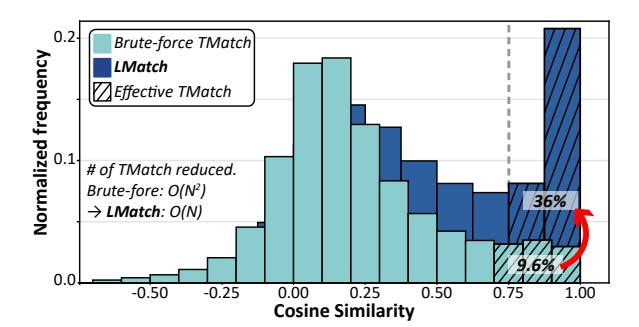
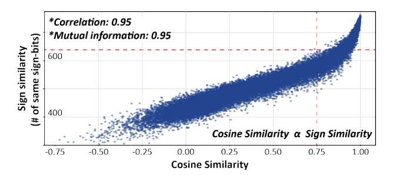
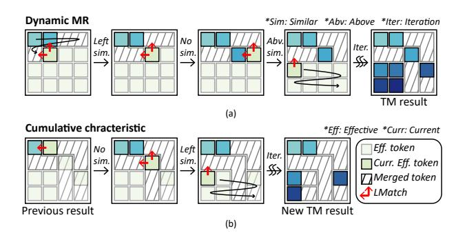

# A. Vision Transformers (ViT)

Vision Transformers (ViT) represent a groundbreaking shift in the field of computer vision, diverging from traditional Convolutional Neural Networks (CNN) [15], [16] by adopting mechanisms inspired by transformers used in natural language processing [17], [18]. Unlike CNNs, which rely on convolution operations, ViTs decompose an image into a sequence of fixed-size patches—referred to as tokens. These tokens are then processed through multiple layers of the transformer architecture (Figure 1(a)), each featuring multi-head self-attention mechanisms and feed-forward networks. This structure enables ViTs to capture both local and global dependencies among

Fig. 3: Stage breakdown of token merging.

tokens, thus preserving the spatial hierarchy and contextual relationships within an image.

However, in the context of ViT, redundancy emerges as a significant challenge, primarily due to the processing of similar or identical tokens across extensive homogeneous regions within images. Such regions, characterized by minimal variance (e.g., clear skies, monotonous walls, or vast water bodies), introduce computational redundancy since adjacent patches may contribute little to no new information. Processing these redundant tokens through each transformer layer incurs unnecessary computational costs and energy consumption.

#### B. Token Merging

To mitigate the redundancy inherent in ViT, token merging has been proposed as an effective strategy to reduce the computational burden by consolidating similar tokens into a more compact representation. Indeed, the concept of merging tokens is not new; existing clustering methods aimed at reducing token count [13], [14] have already utilized strategies to merge redundant tokens into specific clusters. However, with the introduction of ToMe [12], which began to term the merging scheme as token merging explicitly, numerous studies [19]–[24] have adopted its approach. Therefore, in this paper, the term *token merging* (TM) will specifically refer to the method proposed by ToMe.

As illustrated in Figure 1(a), TM can be applied either before or after the attention block within each layer of the ViT. To further analyze TM, it can be divided into two primary processes: token matching (TMatch) and cluster aggregation (Figure 3). TMatch is a process that calculates the similarity between tokens and clusters them based on these results. After the TMatch process, the actual merging occurs during the cluster aggregation stage, which offers two options: average merge [12], [19], which computes the average across tokens in a cluster to form a single representative token, and prune merge [19], which prunes redundant tokens, leaving one representative token per cluster. In this paper, TM will refer to the prune merge scheme and applied both before and after the attention block.

#### C. Layer Normalization

Within ViT, Layer Normalization (LN) is employed to standardize the features of each token across the model, thereby facilitating stable training and consistent performance across various input distributions. Unlike the original transformer block [1], in ViT, LN is applied both before and after the

Fig. 4: Illustration of (a) Local Matching. (b) Sign similarity.

attention block within each layer (Figure 1(a)). The LN process is governed by the equation:

$$y(x_i) = \gamma_i \frac{x_i - \mu_i}{\sigma_i} + \beta_i$$

where  $\mu_i$  and  $\sigma_i$  represent the mean and standard deviation of the features of token  $x_i$ , respectively, and  $\gamma_i$  and  $\beta_i$  are the scaling and shifting parameters for each token. It is important to note that LN is a token-by-token process, meaning that it is applied individually to each token  $x_i$  with its mean  $\mu_i$  and standard deviation  $\sigma_i$ .

#### D. Motivation

As discussed in Section I, deploying TM introduces significant performance degradation, while the fixed MR limits further speedup opportunities. Therefore, our objective is to design a latency-oriented hardware accelerator that dynamically merges tokens with significantly reduced overhead from TM. As detailed in Section II-C, LN is an essential tokenwise process in ViT, which collects running statistics and requires dynamic token-by-token normalization. Interestingly, TM is also a token-by-token process that operates at the same location as LN.

Therefore, throughout this paper, our *Design Philosophy* is defined as follows:

- Reduce the overhead of TM as much as possible.
- Embed TM with the pre-existing LN.

Consequently, all algorithmic optimizations (Section III) and the hardware architecture (Section IV) of AdapTiV are designed in accordance with this Design Philosophy.

## III. ADAPTIV'S ALGORITHMIC OPTIMIZATION

Our algorithmic optimizations for AdapTiV involve three main strategies. First, we introduce Local Matching (LMatch), which restricts TM candidates to local tokens within the image. This strategic restriction significantly reduces the number of TMatches required, adjusting the computational complexity from  $O(N^2)$  to O(N), where N represents the number of tokens. Second, we introduce Sign Similarity, a simplified similarity metric that streamlines calculations by focusing on sign bits, thereby reducing the computational overhead associated with cosine similarity. Lastly, we propose the Dynamic MR strategy, which dynamically adjusts the number of tokens to

Fig. 5: Distribution of cosine similarity with different TMatch methods on the ImageNet-1K dataset [25].

be merged per layer. This approach effectively achieves image-adaptive TM.

#### A. Local Matching

Prevailing approach [12] to do TMatch is randomly partitioning tokens into two sets and conducting a brute-force search for the most similar token between these sets, leading to a complexity of  $O(N^2)$  as each token is compared with every other token. In contrast, LN is performed individually on each token, meaning the number of LN operations follows O(N). This discrepancy in the complexity levels makes it challenging to hide TM with the existing token-wise process, LN.

To reduce the complexity of TMatch, we hypothesize that tokens nearby are likely to exhibit higher similarity due to the inherent spatial locality in images. Consequently, instead of assessing the similarity across all possible pairs of tokens, we confine our TMatch to neighboring local tokens left and above (Figure 4(a)), a method we term Local Matching (LMatch). This LMatch offers two advantages over the conventional, naive approach:

First, LMatch significantly decreases the number of required TMatch, as shown in Figure 4(a), aligning the complexity with O(N) similar to that of the LN process. This adjustment facilitates a smoother integration with LN, fulfilling the Design Philosophy. Second, LMatch increases the portion of TMatch that leads to merging. Figure 5 illustrates the experimental results of the occurrence frequency of cosine similarity value normalized to each method: brute-force TMatch and LMatch. Although extensive brute-force TMatch finds more similar matches numerically because of its brute-force nature, it does not necessarily lead to a high portion of merging from TMatch. Typically, only a small fraction (9.6%) of TMatch operations exhibit sufficient similarity (>0.75) to contribute to TM, which is considered an effective TMatch. In contrast, LMatch has led to a significant increase in the rate of effective TMatch to 36%, demonstrating that searching for similar tokens locally not only reduces the number of TMatch operations required but also enhances the proportion of effective TMatch.

#### B. Sign similarity

In the process of TM, similarity between tokens is calculated to find the similar tokens. Conventionally, well-known metrics

Fig. 6: Scatter plot between cosine and Sign similarity with ImageNet-1K dataset.

such as cosine similarity have been used [12] for this purpose. However, calculating these similarity values includes vector multiplication and normalization, which is also required for LN operations. Therefore, to meet the Design Philosophy, additional hardware resources are inevitable to run the TM process and LN in parallel. Consequently, a new similarity metric that substantially reduces the additional hardware burden, allowing TM to run parallel with LN, is needed.

Our intuition is that a similarity in the direction of two vectors is associated with a narrower angle between them, thus yielding a higher cosine similarity value. If this hypothesis holds, then merely comparing the direction of two vectors, or more specifically analyzing the sign of each vector element, should suffice to approximate the cosine similarity value. Here, we suggest a new similarity metric called Sign similarity, which indicates the number of vector elements sharing identical signs. Given two *d*-dimensional vectors **a** and **b**, the formula of *Sign similarity* is as follows:

Sign similarity = 
$$\sum_{i=1}^{d} \begin{cases} 1 & \text{if } sign(a_i) = sign(b_i) \\ 0 & \text{otherwise} \end{cases}$$

where,  $sign(a_i)$  and  $sign(b_i)$  denote the sign functions of the i-th element of vectors  ${\bf a}$  and  ${\bf b}$ , respectively. This formula evaluates whether the signs of elements at the same positions in the two vectors match and summarizes the results.

Figure 6 illustrates the results of similarity between tokens using the ImageNet-1K dataset [25]. The numbers at the top-left of the figure show calculated correlation [26], [27] and mutual information [28] values, while the scatter plot depicts the relationship between cosine similarity and Sign similarity. As the cosine similarity value increases, there is a corresponding rise in the number of vector components sharing identical signs, indicating Sign similarity. The calculated correlation between cosine similarity and Sign similarity is 0.95, and the mutual information is also 0.95. These results suggest that while Sign Similarity does not exactly replicate cosine similarity, it can approximate it effectively. Therefore, we propose substituting cosine similarity with Sign similarity during TM to facilitate more lightweight calculations. Utilizing Sign similarity offers two advantages (Figure 4(b)) over the conventional approach of calculating cosine similarity:

First, Sign similarity method simplifies the TMatch process to merely comparing the sign bits. Conventionally, computing

Fig. 7: Illustration of LMatch-based TM that has (a) Dynamic MR, (b) cumulative characteristic.

cosine similarity necessitates a series of *d n*-bit multipliers. However, for Sign similarity, the calculation can be executed using a series of *d 1*-bit *XNOR* gates, significantly reducing the additional hardware overhead of following Design Philosophy. Second, Sign similarity requires only the storage of sign bits, rather than the entire token vectors. While the cosine similarity approach requires storing the complete data of each token for future TMatch, Sign similarity necessitates only the sign bits for each element, thereby substantially decreasing the requisite on-chip memory capacity for TM.

