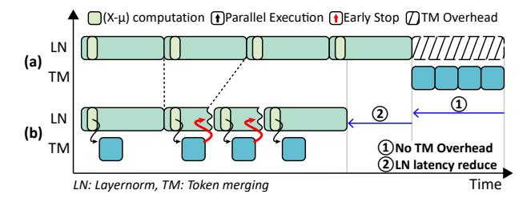

# *B. Sign-Driven Scheduling*

For efficient operation of the AdapTiV accelerator, optimized scheduling between the modules inside AdapTiV is

Fig. 8: Architecture overview of AdapTiV.

Fig. 9: A timeline representation of LN and TM process. (a) naive approach, (b) with Sign-Driven scheduling and early stop.

crucial. Especially, the integration of TM in AdapTME and the LN in VPU needs thorough examination to achieve our Design Philosophy. Naive scheduling, as depicted in Figure 9(a), would result in an unconcealable latency overhead of TM, adding the sequential operation to the model inference. To completely hide TM's latency overhead, TM operations must be executed in parallel with LN.

Our observation to enable such parallel execution was that the sign bits needed by the AdapTME are available from the middle of LN. LN computation initiates by calculating the mean of a single token's embedding vector and subtracting the embedding vector by its mean, as equation  $x_i - \mu_i$ . Immediately after the subtraction, the sign bits required for Sign similarity computation can be obtained. Based on this observation, we suggest our novel Sign-Driven scheduling, in which the AdapTME streamingly receives the current effective token's sign bits from the VPU during LN, and operates in parallel with the VPU. As illustrated in Figure 9(b), ① through our Sign-Driven scheduling, the TM operation is embedded in the LN operation, leaving no latency overhead. Also, due to the highly optimized and low-latency nature of our TM process, we observed that LN computations often continue even when the AdapTME finished TM. This overlap presents an opportunity for more latency reduction. Since tokens reported to be similar by the AdapTME are completely disposed of, it is unnecessary to finish their LN operations. ② Therefore, we effectively early stopped the LN operation.

