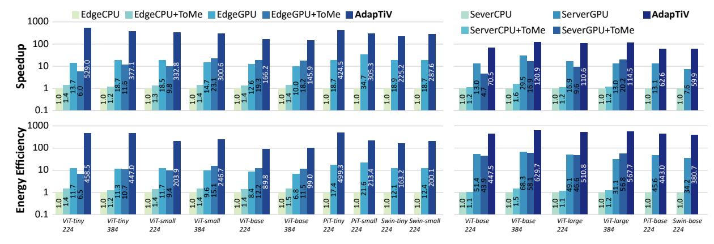
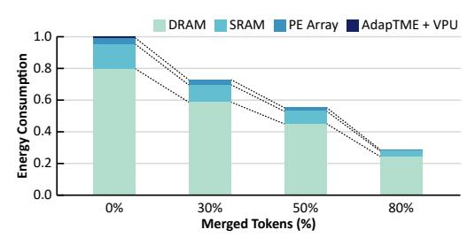

# C. Accuracy Evaluation

Figure 12 illustrates the impact of AdapTiV's algorithmic optimizations on model accuracy, presented alongside a box plot that displays the range of merge rates achieved. Compared to the vanilla baseline, which incorporates no AdapTiV optimizations, AdapTiV maintains an accuracy loss below 1% across all models without additional training or fine-tuning. In addition to preserving near-baseline accuracy, AdapTiV exhibits a significant variation in merge rates, from 0% to 96.5%, demonstrating its robust capability for image-adaptive TM. This variation effectively showcases AdapTiV's ability to handle the diverse similarity patterns inherent in each image

Fig. 12: Accuracy comparison of AdapTiV and the baseline. The box plot shows the dynamic range of AdapTiV's achieved proportion of merged tokens.

without noticeable accuracy loss. It is important to note that all the aforementioned results were achieved without additional training. This enables AdapTiV to be applied directly to off-the-shelf ViT models, which is a substantial advantage for edge applications.

#### D. Performance Evaluation

Figure 13 compares the end-to-end speedups achieved by AdapTiV across various platforms. Compared to edge-grade devices, AdapTiV attains, on average, speedups of  $309.4\times$ ,  $230.9\times$ ,  $18.4\times$  and  $30.7\times$  over edge CPU, edge CPU with ToMe, edge GPU, and edge GPU with ToMe, respectively. When compared against server-grade devices, AdapTiV achieves average speedups of  $89.8\times$ ,  $80.5\times$ ,  $6.3\times$ , and  $9.8\times$  over server CPU, server CPU with ToMe, server GPU, and server GPU with ToMe, respectively.

The results demonstrate that AdapTiV, with its dedicated hardware architecture supporting image-adaptive TM, consistently outperforms the comparative groups across diverse model benchmarks. This remarkable speedup is achieved through AdapTiV's specialized hardware architecture, which optimizes the image-adaptive TM process. By effectively concealing the latency overhead associated with TM, the AdapTiV fully exploits the performance benefits of TM—the reduction in input size—without incurring any latency penalties. In other words, our Design Philosophy has been successfully fulfilled.

One observation is that implementing ToMe yields a slight speedup on CPUs; however, deviations are observed in the GPU context, where specific model benchmarks exhibit reduced speedups when GPU employs ToMe. This phenomenon aligns with the challenges outlined in Section I, suggesting that the TM process is not well-optimized for GPUs due to its inefficient operations and dynamic tensor cropping. Note that our algorithmic optimizations applied to a conventional CPU also induce a  $1.83\times$  speedup while leading to a  $2.5\times$  slowdown for a conventional GPU, implying the need for specialized hardware to support our Design Philosophy.

#### E. Area/Power Evaluation

Figure 13 showcases the comparative analysis of energy efficiency achieved by the AdapTiV accelerator. Against edge-grade devices, AdapTiV secures energy efficiency averaging 262.1×, 192.0×, 21.5×, and 27.7× over edge CPU, edge

Fig. 13: The normalized speedup and energy efficiency (w.r.t Left: EdgeCPU, Right: ServerCPU) achieved by AdapTiV.

Fig. 14: On-chip (a) Area, (b) Power breakdown of AdapTiV.

Fig. 15: Normalized energy consumption breakdown of Adap-TiV. From left to right, the proportion of merged tokens increases.

CPU with ToMe, edge GPU, and edge GPU with ToMe, respectively. Server-grade device comparisons show energy efficiency averaging 496.6× and 11.2× over CPU and GPU, respectively, with ToMe adaptations yielding 441.0× and  $10.5\times$ .

The area distribution of AdapTiV is depicted in Figure 14(a), totaling 2.49 mm2. The breakdown includes on-chip memory accounting for 51.8%, the PE array at 27.5%, the VPU at 19.2%, and the AdapTME occupying a mere 1.49% of the total. The compact area of AdapTME confirms that AdapTiV's hardware architecture, including elements such as SP and SSCU, is optimized for minimal hardware burden while effectively supporting AdapTiV's algorithms.

The power consumption of AdapTiV is detailed in Table I, totaling 11.06W. Figure 14(b) breaks down the on-chip power distribution, showing the shares of on-chip memory (58%), the PE array (23%), the VPU (18%), and AdapTME (1%).

TABLE I: Power Breakdown of AdapTiV

|       | PE Array | VPU   | AdapTME | SRAM  | DRAM  | Overall |
|-------|----------|-------|---------|-------|-------|---------|
| Power | 0.63W    | 0.49W | 0.02W   | 1.59W | 8.32W | 11.06W  |

Notably, the AdapTME constitutes only 1% of the total power usage, evidencing the negligible power overhead of dedicated hardware for image-adaptive TM.

Figure 15 illustrates the energy consumption breakdown of AdapTiV at various token merge rates achieved through image-adaptive TM. The figure highlights that as the attained merge rate increases, the total energy consumption of AdapTiV significantly decreases. This reduction is primarily attributed to decreased DRAM access, a direct consequence of TM, which effectively reduces the input size and, consequently, the amount of DRAM read/write energy required.

#### F. Ablation Study

Figure 16 describes an ablation study that analyzes the sources of AdapTiV's speedup and energy savings in a scheme-by-scheme manner utilizing the ViT Base model.

As shown in Figure 16(a), AdapTiV achieves a  $2.9\times$  end-to-end latency speedup over an edge GPU with its specialized datapath. By implementing dynamic MR TM, we attain an additional  $5\times$  speedup, assuming an 80% merge rate. However, achieving such performance enhancement with TM requires careful implementations, realized through our advanced algorithmic and hardware optimizations. Figure 16(b) illustrates the energy consumption of TM, normalized to a baseline scenario without any optimization schemes. This baseline utilizes brute-force TMatch, cosine similarity, and no scheduling optimization. Our extensive simulations on energy consumption show that this naïve approach results in more than 15% of the end-to-end energy consumption, underscoring the need for AdapTiV to support our Design Philosophy.

To reduce the overhead of TM according to the first term of the Design Philosophy, we first apply LMatch to achieve  $3.7\times$  energy saving in the TM process by reducing the computational complexity from  $O(N^2)$  to O(N). Furthermore, utilizing Sign Similarity results in  $2.7\times$  energy savings due to the reduced amount of data needed for TM and gate-level

Fig. 16: Ablation study of (a) speedup over edge GPU, (b) energy consumption of TM normalized to a scenario of no optimizations applied.

XNOR computation. Lastly, according to the second term of the Design Philosophy, Sign-Driven scheduling effectively conceals all DRAM accesses associated with TM within the existing LN operations, compacting TM to a hardly noticeable process.

