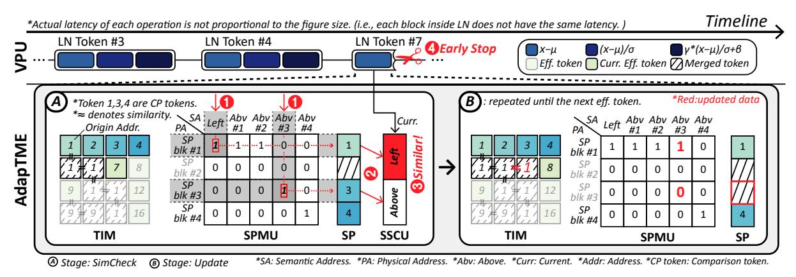
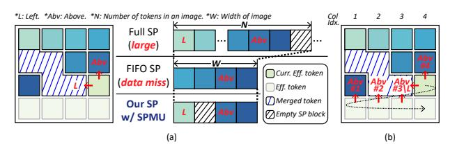

# C. Operation Overview

Before explaining in detail the implementation of the AdapTME (Section IV-D), Figure 10 provides an operational overview of the AdapTME microarchitecture. AdapTME operates in a two-stage manner:

- 1) Similarity Checking (SimCheck) Stage. Following the context and operational flow described in Figure 10, consider that the current effective token's index is 7. 1 At the onset of the SimCheck stage, the SPMU accesses columns corresponding to the semantic addresses of Left and Abv#3. 2 Each SPMU's column contains a single row with an entry value of 1, indicating that the corresponding physical address in the SP holds the required sign bits data. In this scenario, SP blocks inside physical addresses #1 and #3 are streamed to the SSCU. 3 Subsequently, the SSCU begins calculating Sign similarity using the three streams of input data from the SP and VPU. The SimCheck stage concludes when more than one of the O SC signals is triggered to 1, or if neither is activated across all Ch-bits. 4 shows that the Left token exhibits similarity with the current effective token, prompting an early stop of the LN and successful TM.
- 2) Update Stage. Based on the O\_SC results from the SSCU during the SimCheck stage, updates are applied to the TIM, SPMU, and SP. The semantic addresses for the tokens Left and Abv#3 now refer to the same physical address as Abv#1 and Abv#2. This update ensures that token #7's origin address now matches that of its left counterpart, token #1, which has remained at the first physical address of the SP from the start of this layer without movement or duplication, thanks to our novel SPMU implementation. Regarding the SP, no write operations are needed for the current token since it has already been merged. However, token #3 is now deemed to not participate in any further TM, and its associated block at physical address #3 is cleared, making space available for any new effective tokens that may emerge.

If the similarity check concludes that the current token is similar to a previously processed token, an early stop signal

Fig. 10: Operational overview of AdapTME and VPU with Sign-Driven scheduling.

for the ongoing LN operations is sent to the VPU, indicating that the current token should not participate further in the model's computations. Conversely, if the current token is deemed unique and unsuitable for merging, the LN operation will continue to be completed.

By performing this series of processes on a stream of incoming tokens, similar tokens are merged through TM. In contrast, those that are not similar survive to participate in the next ViT backbone operation as input. This dynamic and efficient mechanism ensures that only unique and necessary tokens are processed in subsequent operations, optimizing the computational efficiency and effectiveness of the model.

#### D. Adaptive Token Merging Engine

Throughout the implementation of our algorithmic optimizations (Section III) within the AdapTME module, we discovered numerous opportunities to apply comprehensive hardware optimizations. For each submodule of AdapTME described in Section IV-A, we conducted targeted hardware design and optimization efforts.

Sign Similarity Computing Unit. The SSCU streamingly receives three different tokens' sign bits data: the current effective token, and its left and above tokens. The current effective token's sign bits data is duplicated, each to be compared with the left token and the above token. For each of the two comparisons to be made, the SSCU has XNOR lines and PopCount units to compute the Sign similarity and then accumulate the result. The accumulated scalar values are continuously compared against a threshold to produce a single bit of similarity check output (O\_SC) per comparison. If any O\_SC bit triggers to 1, indicating the current token shall be merged, it is immediately reported to the VPU. This allows the early stop of the LN process and results in reduced input size across the whole ViT model afterward.

**Sign Scratchpad.** Preparing the sign bits of the left and above tokens is the necessary precursor to computing Sign similarity. This would lead to an absurd amount of DRAM accesses assuming there is no dedicated on-chip storage in the AdapTME to keep the previously processed tokens. As each Sign similarity computation would require DRAM read

operation of two entire embedding vectors of left and above tokens, a total of  $2 \times N$  additional tokens should be read, resulting in severe dataflow interruption and energy congestive operation.

Therefore, as Figure 11(a) describes, various design choices were explored to find the most effective way to store the sign bits of the previously processed tokens. A Full SP that stores every previously processed token's sign bits is highly impractical, requiring up to 54KB of SRAM for the ViT-base model, which is almost half the size of the actual weight or input buffer attached to the PE array. However, naively reducing the SP size and evicting data in an inconsiderate manner like First-In-First-Out (FIFO) would result in a data miss. Although the current effective token's left and above tokens are supposed to reside inside the SP, FIFO SP is not aware of the image content and evicts the necessary token's sign bits without caution. Throughout the whole TM process, the potential for multiple misses exists; such occurrences should be avoided.

Such critical problems of naive approaches lead to the development of our lightweight image width-sized SP and unique identification to classify previously processed tokens. Our observation is that only a few tokens among the previously processed tokens have the potential to be used in later Sign similarity computation. Tokens that were already deemed to be not similar to its right or below token no longer have their purpose to reside in the SP due to our effective LMatch scheme (Section III-A). Based on this observation, we suggest a unique identification among the previously processed tokens: only the tokens that still have the potential to expand their cluster in the right and below direction need to be stored in the SP, and such tokens will be referred to as comparison tokens afterward. Furthermore, we logically inspect that the maximum number of such comparison tokens is fixed at all times: W (image width) number of above tokens and a single left token. More inspection led to the conclusion that the left token with a column index of k is essentially equivalent to the above token with a column index of k, refining the physical maximum number of comparison tokens to W.

Our SP is designed to effectively store *comparison tokens* only, keeping its size down to  $W \times Ch$ -bits. For the ViT-base-patch16-224 model that we're using generally throughout the paper, our SP is a compact 1.3KB SRAM. By managing the SP correctly, we could handle naive approaches' issues and avoid any additional DRAM read while maintaining such a minimal size.

Sign Scratchpad Managing Unit. SPMU manages the SP to store *comparison tokens* and optimize further to avoid any data duplication and unnecessary data movements within the SP. We enable such optimizations by introducing a concept of semantic address to comparison tokens, as expressed with an example in Figure 11(b). There are W+1 number of semantic addresses: Left and Abv#1~Abv#W with Abv standing for above. If the column index of the current effective token is k, tokens with a lower row index and tokens of the same row with a lower column index than k are previously processed. Among these, the left token with a column index of k-1 is assigned a semantic address Left. For semantic addresses of Abv#1~Abv#W, the most recently processed tokens with column indexes #1~#W are assigned. Therefore, sign bits of the tokens with semantic addresses of Left and Abv#k need to be ready to operate the LMatch of the current effective token. With this semantic address as the key, SPMU finds the physical location inside the SP where the corresponding sign bits data is residing using a compact bitmap which is of size  $W \times (W+1)$ -bit. For each semantic address column allocated in the bitmap, there exists one corresponding physical address marked with an entry value of 1. This indicates that the data for the sign bits, which the SPMU seeks using the semantic address, is stored at that location.

Note that due to TM, tokens with different semantic addresses might be equivalent when they are included in the same cluster. For example, assuming all the tokens before the current effective token are forming a single cluster, sign bits of every different semantic address would be completely equivalent. Utilizing the previously introduced bitmap, SPMU informs SP to store just one copy of the sign bits data and control the bitmap so that any search of sign bits with semantic address would result in the same physical address of SP.

During LN, we continually update the SPMU and SP based on the TIM. This guarantees **zero** SP data misses, as no *comparison token* is suddenly required; instead, each token is moved into the SP once and alters only the bitmap entries in the SPMU. Also, sign bits of tokens that are confirmed as dissimilar to adjacent right and bottom tokens are evicted from the SP safely.

**Token Integration Map.** Each entry in the token integration map (TIM) consists of O\_SC from the SSCU and the origin address of the token to record the TM status of the corresponding token. The origin address refers to the address of the top-left token in a cluster, which represents the entire cluster. The TIM entry for all tokens within the cluster will share this same origin address. At the start of the ViT inference for an image, TIM is initialized with each entry's O\_SC being 2'b00 and the origin address pointing to itself, meaning no TM has

Fig. 11: (a) Explanation of SP design exploration with an example input. (b) Concept of semantic address.

been done yet. When SSCU reports a similarity, the TIM entry corresponding to the current effective token index is updated. For example, if a token is similar to the one to its left, it will be merged into the same cluster as that left token. Therefore, O\_SC is updated to 2'b10, and the origin address is updated to match the left token's TIM entry. This is all we need to do to form and expand a cluster, significantly differing from prior works that require iterative or complex computations [12]–[14]. We also keep track of the population of each cluster via TIM, which is later used in the Softmax operation of the self-attention layer to maintain model accuracy [12].

#### E. Design Details

Within the design, all the elements are represented using a 16-bit fixed-point format. For the hardware details, our on-chip SRAM buffers have a total of 385KB, with a W/K/V buffer, Activation/Query buffer, and Output buffer, each contributing 128 KB, and the SP contributing only 1 KB. For external memory, we utilized DDR4 2400MHz with a bandwidth of 76.8GB/s to match with the Jetson Orin Nano edge GPU. Our PE Array consists of 16 lanes of 64-element MAC lines. A 64-element configuration has been chosen to match the head dimension of the model, and VPU also operates at a 64element granularity. Inside the AdapTME, the SSCU consists of two lanes of 64-element XNOR lines, each dedicated to left and above TMatch. For later evaluation to compare with server devices, we scaled the number of lanes accordingly. SP block entry's bit-width (Ch) is 1024 bits, 768 bits, 384 bits, and 192 bits for ViT-large, base, small, and tiny models. Also, each model has 224×224 and 384×384 versions regarding the original input's size, having different numbers of input tokens (N) by 196 and 576. Each version's TIM entry's origin address bit-width is 8 bits and 10 bits. For our evaluation, we set hardware implementation according to the ViT-basepatch16-224 model.

## V. EVALUATION

#### A. Workload

To evaluate AdapTiV, we conducted experiments across a range of ViT models. The tested models include ViT Tiny [31], ViT Small, ViT Base, and ViT Large [2], PiT Tiny, PiT Small, PiT Base [32], Swin Tiny, Swin Small, and Swin Base [33]. For the ViT models, we use patch 16, and each is implemented in two versions that vary by input size. For the Swin models, we use patch 4. For each workload, we utilized the timm framework and obtained pre-trained models

from HuggingFace to integrate the AdapTiV algorithm. Each model was evaluated off-the-shelf, meaning no training was conducted. All models were tested using the ImageNet-1K dataset for the image classification task to assess AdapTiV's performance comprehensively.

#### B. Methodology

**Performance.** To evaluate performance, we developed a custom cycle simulator for AdapTiV. Our analysis encompassed a diverse range of hardware platforms as benchmarks, including an edge CPU (6-core ARM Cortex A78AE), an edge GPU (Nvidia Jetson Orin Nano), a server CPU (Intel Xeon Platinum 8452Y), and a server GPU (Nvidia RTX 6000 ADA). Furthermore, AdapTiV's performance was compared against ToMe [12] implementations to compare AdapTiV's imageadaptive TM against the hardware-untailored TM approach. Note that ToMe is only applicable to ViT models; therefore, for PiT and Swin, there are no results for the implementation of ToMe. We also implemented a simulator for the prior ViT accelerators, ViTCoD [34] and ViTALiTy [35], to compare AdapTiV with works that do not focus on TM. Note that we simulate both prior accelerators with the same hardware configurations for fair comparisons. Execution latency on GPU was measured using the CUDA Event API, with additional analyses performed via the Nvidia Nsight [36]. For CPU, we utilized native Python to determine execution latency. For the comparison with server-grade devices, we evaluate forty-five AdapTiV accelerators to match the peak performance of the Nvidia RTX 6000 ADA (91 TFLOPS), as outlined by [29], [30]. However, to ensure a fair and practical comparison, we do not scale the DRAM bandwidth up to forty-five times but instead match it to 960GB/s, as in the Nvidia RTX 6000 ADA.

Area/Power. The AdapTiV accelerator was implemented using SystemVerilog and synthesized with a target frequency of 1 GHz using Synopsys Design Compiler and Samsung's 28nm standard cell library, to measure the area and power for the AdapTiV accelerator. The SRAM on-chip memory was also compiled and synthesized using Samsung's 28nm library. For DRAM, read/write energy metrics were integrated into our simulator using the energy consumption numbers from [37]. For comparative analysis, the power consumption of GPU and CPU was measured using Jetson Power, Nvidia-SMI, and the Linux Performance Analysis tool.

