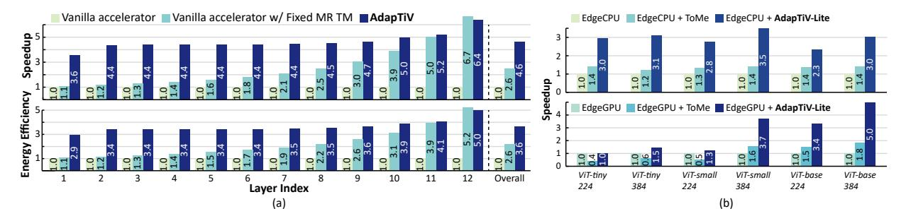

# *D. Comparison with ViT accelerators*

To understand the significance of TM and validate the

Fig. 17: Normalized (a) speedup, energy efficiency (w.r.t Vanilla accelerator) (b) speedup (w.r.t. edgeCPU and edgeGPU).

Fig. 18: Speedup normalized to (a) the ideal accelerator with zero latency for attention-mechanism, (b) edgeGPU.

necessity of AdapTiV, we compared it with the prior ViT accelerators, ViTCoD [34] and ViTALiTy [35]. Note that unlike AdapTiV, both accelerators require re-training to achieve the performance reported in their papers. In the case of ViTCoD, an auto-encoder module, and the split-and-conquer algorithm are applied to achieve a sparse attention pattern. For ViTALiTy, the model is modified to use Taylor attention instead of vanilla Softmax attention, reducing the complexity of attention from quadratic to linear. However, AdapTiV, which is an off-theshelf method that does not require training, outperforms the prior ViT accelerators by up to 4.7×, as shown in Figure 18(b). This result demonstrates that for ViT models, other computations such as query, key, value generation (QKV generation) and Feed Forward Network (FFN) are also important and affect the end-to-end latency of the model. This makes AdapTiV, which reduces the input size of the entire model, beneficial not only for attention but also for other computations, leading to much greater effectiveness compared to the prior ViT accelerators.

