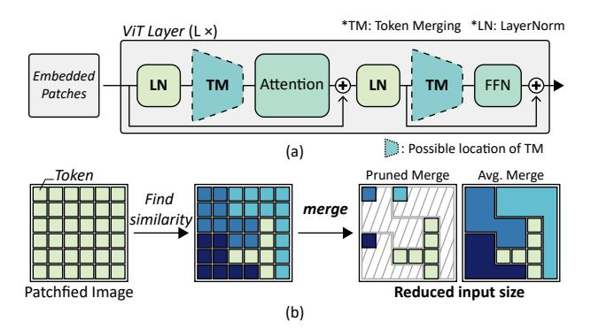
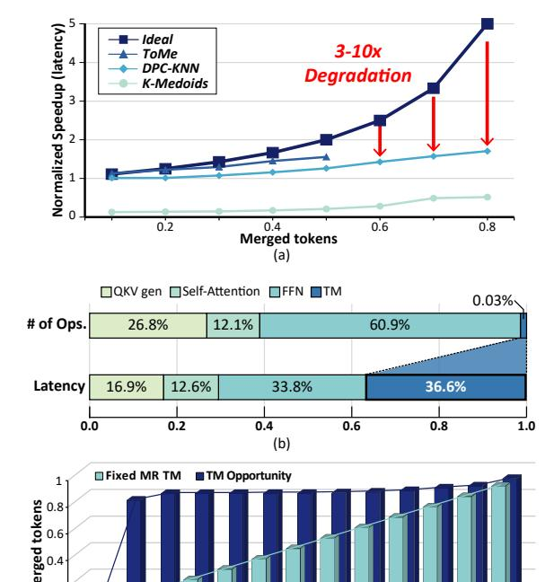

# I. INTRODUCTION

In recent years, the realm of Computer Vision (CV) has been revolutionized by the advent of attention-based Transformer architectures [1], marking a significant leap forward in how machines understand and process visual data. This innovation has been primarily driven by integrating the selfattention mechanism, a pivotal component of the Transformer architecture, which has demonstrated an unparalleled ability to capture global contextual relationships within data. Notably, Vision Transformers (ViT) [2] have established new benchmarks, showcasing remarkable performance across a

Fig. 1: Overview of (a) ViT layer, (b) Token merging.

wide range of tasks. However, this efficacy comes at a steep computational cost, primarily due to the self-attention mechanism's quadratic complexity relative to the number of input tokens. This computational overhead introduces a substantial latency bottleneck, which limits the deployment of ViT in latency-sensitive applications (e.g., augmented reality, drone navigation). Consequently, optimizing the latency of ViTs has been the focus of active research [3], [4].

Furthermore, the extensive computational demand of selfattention has prompted researchers to explore various optimization strategies, including efficient transformers [5], [6] and token pruning [7]–[11]. Among these, token merging (TM) [12] emerges as a promising approach, aiming to alleviate the computational burden by reducing the input size by merging similar tokens (Figure 1(b)). Therefore, the original TM work [12] has achieved significant increases in throughput (images per second) by the reduction in the input size that leads to a decrease in the required number of floating point operations (FLOPs). However, it is noteworthy that it does not reduce the latency performance, which is critical for realtime applications. To the best of our knowledge, no study has yet investigated whether TM provides a latency-wise speedup rather than merely enhancing throughput.

To confirm the above, we have implemented state-of-theart TM strategies and measured their throughput and latency performances. Unlike the substantial improvements in throughput, the latency speedups from the existing TM methods fell short of expected improvements, as shown in Figure 2(a).

\*Both authors contributed equally to this work.

Ideally, the speedup should increase proportionally with the token merge rate. However, the actual TM implementations result in a  $3\text{-}10\times$  performance degradation, deviating from the ideal case in which the speedup is perfectly proportional to the reduction in FLOPs. Based on the detailed analysis, we discover the two major factors that hinder an ideal reduction in latency:

- 1) The token merging operation itself involves inefficient computation, causing a long latency. As shown in Figure 2(b), although TM operations account for only 0.03% of the total operations, they constitute 36.8% of the processing time. The latency overhead of TM stems from the inefficiency of numerous vector-wise or element-wise operations (e.g., cosine similarity, argsort, etc.) [11] and dynamic tensor cropping on GPUs during the TM process. Consequently, this significant latency overhead substantially negates the acceleration effect of TM.
- 2) Fixed merge rate (MR) TM misses further speedup opportunities. Various TM approaches consistently merge input tokens at a fixed ratio across each ViT layer, because dynamically changing the input size is unfavored on GPUs, disregarding the variable informational content within each image. As illustrated in Figure 2(c), conventional TM strategies utilize a fixed MR method that incrementally increases the proportion of merged tokens throughout the ViT layers. However, this fixed MR approach fails to capitalize on significant intra-image token similarities—an opportunity that a dynamic MR TM could effectively exploit. Consequently, it misses key latency and energy optimization opportunities.

Against this backdrop, our work introduces a novel hardware-software co-designed accelerator specifically tailored to achieve latency-wise speedups of **ViT** through image**adapt**ive token merging, named AdapTiV. Our contributions are as follows:

- On the algorithmic level, we introduce *Local Matching*, which limits the search space for TM by leveraging the spatial locality in images. Additionally, AdapTiV proposes *Sign Similarity* to simplify the computation of similarity during TM. Together, these strategies significantly reduce the overhead associated with TM. Furthermore, the novel *Dynamic Merge Rate (MR)* strategy dynamically adjusts the merge rate based on the varying informational content of images, thereby enabling imageadaptive TM.
- On the hardware level, we have developed a dedicated hardware accelerator designed to support Adap-TiV's algorithms, thereby enhancing both performance and energy efficiency. This accelerator employs a Sign-Driven scheduling that effectively conceals the latency and DRAM access overhead of TM. The core component, the Adaptive Token Merging Engine, includes several key modules: a Sign Similarity Computing Unit, Sign Scratchpad, Sign Scratchpad Managing Unit, and a Token Integration Map. These modules are thoroughly

Fig. 2: (a) Speedup normalized to vanilla model and proportion of merged tokens (ToMe [12], DPC-KNN [13], K-Medoids [14]). (b) Breakdown of latency and the number of operations with ToMe implementation. (c) The layer-by-layer proportion of merged tokens. (All results are measured on Jetson Orin Nano with ViT base model)

- engineered to facilitate image-adaptive token merging.
- Through extensive evaluations, AdapTiV has been demonstrated to offer significant speedups and energy efficiency while maintaining accuracy across various benchmarks supporting image-adaptive TM. Remarkably, AdapTiV achieves up to 309.4× speedups and 496.6× improvements in energy efficiency on diverse platforms, including edge CPUs, edge GPUs, server CPUs, and server GPUs, while maintaining an accuracy loss below 1% without training.

#### II. BACKGROUND AND MOTIVATION

