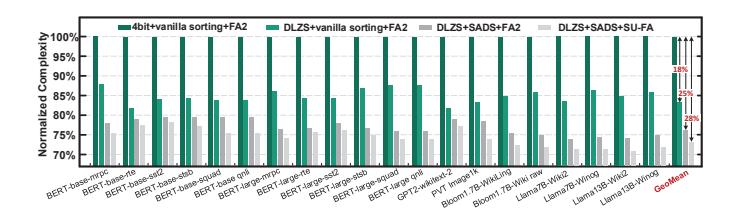

# B. Algorithm Performance

Fig. 16 illustrates the SOFA flow-diagram, which consists of two phases: *Pre-deployment Preparation (PP)* and *User Inference (UI)*. During the PP phase, the server selects models and corresponding datasets, then preprocesses each model through DSE (Section III-D) and fine-tuning. The processed models are then stored for user selection. In the UI phase, users simply select their desired model, which, once loaded, enables real-time dynamic sparsity inference using SOFA.

1) Algorithm Settings: In DSE objective function (2), the coefficient  $\alpha$  adjusts the proportion of the increased sorting cost, while  $\beta$  controls the proportion of the benefit from reduced exponential operations. Initially, we conducted numerous experiments on BERT/PVT/GPT-2/Bloom/Llama to determine the search range for each hyperparameter. Subsequently, during training, we employed grid search to find the optimal parameter for each model and applied the suc-

Fig. 17. Complexity reduction for the proposed DLZS, SADS and SU-FA.

cessive halving method to accelerate the process. According to our experiments, the  $\alpha/\beta$  is set as 0.24/0.31 (BERT-B/L), 0.2/0.24 (ViT), 0.4/0.42 (GPT-2), 0.53/0.56 (Bloom-1.7B), and 0.58/0.63 (Llama-7B/13B), respectively. We then search for 200 iterations with each learning rate (1e-1, 5e-2, 1e-3) to obtain the optimal tiling setting.

2) Overall Performance: We first set an ablation experiment to evaluate the low-complexity advantages of DLZS, SADS and SU-FA by comparing them with a baseline scheme. The baseline is assumed to utilize 4-bit multiplications in pre-compute stage, vanilla sorting in top-k stage and traditional FA in formal-compute stage. The complexity for different operations is normalized by the arithmetic complexity model [41]. For fairness, each model's loss remains under 2%. As shown in Fig.17, DLZS reduces complexity by 18% on average compared to the baseline. The reduction mainly comes from its multiplier-free computing and half-conversion feature. Further, SADS and SU-FA contribute to an extra 10\% reduction through segmented sorting and simplifying redundant non-linear computations using top-k information. Overall, compared to traditional mechanisms, SOFA's software strategy achieves 28% lower computation complexity under the same token sparsity, making SOFA accelerator effective for handling the LTPP scenario.

To demonstrate the effectiveness of SOFA in detecting token sparsity, Fig. 18 shows the QKV and attention computation reduction, introduced by the SOFA's sparsity prediction (LP). For practicality, we statistically analyzed the reduction in computational workload while ensuring accuracy losses remained below 0%, 1%, and 2% respectively. Different end-to-end metrics are utilized for evaluation, such as F1 score for SQuAD and accuracy for RTE. On average, SOFA's sparsity prediction can reduce the attention+QKV computation by 56.8%/62.6%/67.4% with 0%/1%/2% accuracy loss, respectively. Focusing solely on the attention part, SOFA reduces computation by 81.3%/87.7%/92.6%.

**Discussion on accuracy:** In top-k pruning, there is a hyperparameter k. Lowering k eliminates more QK-pairs, which in turn reduces computation. However, reducing k too aggressively could lead to the exclusion of some relatively important QK-pairs, thus hurting the model's accuracy. Moreover, different datasets exhibit varying features of sparsity due to their distinct data types and tasks. Consequently, in the pre-deployment preparation, the value of k can be modified to optimize the algorithm's exploiting of sparsity to minimize computation while maintaining accuracy. For example,

Fig. 18. Computation reduction by LP with diverse loss tolerance. [X, Y] respectively denote the computation reduction for the Atten part and QKV+Atten.

we observed that datasets like SST2 and STS-B, used for sentiment classification or semantic analysis, typically exhibit high sparsity because one or two keywords often indicate sentiment. Therefore, their computation reduction is adjusted to 90% while the accuracy loss is controlled within 1%. In contrast, image datasets generally contain a high amount of key information and have lower data redundancy compared to text classification datasets, resulting in lower sparsity. As a result, their computation reduction is adjusted to 73% with a 1% accuracy loss.

#### C. Architecture Evaluation

Throughput Improvement: Fig. 19 (a) compares the throughput of SOFA with A100 GPU on all benchmarks versus diverse accuracy loss. As can be seen, LP enables 1.08-1.78× of speed up on GPU with its sparsity detection. Unfortunately, the GPU cannot leverage the LP results as it cannot handle high sparsity or fine-grained on-demand KV calculations. Nor can it run the cross-stage DLZS-based prediction efficiently. By contrast, the SOFA exhibits an average 85.2% PE utilization due to its stage-fused fine-grained tiled dataflow, which pipelines crossstage DLZS prediction, SADS sorting, and SU-FA, leading to almost triple sparsity utilization than GPU. Further, the SU-FA engine is tailored to support sparsity attention acceleration with reduced computational complexity. Overall, SOFA achieves  $6.1\times$ ,  $7.2\times$  and  $9.5\times$  inference speed up with 0%/1%/2% accuracy degradation. Fig. 19 (b) further compares the SOFA with LP+traditional FA and LP+FA2 on A100. On average, FA on GPU brings around 1.5× gain, leading to a total  $2.7\times$  speed up combined with LP. By adjusting the loop order to avoid some factor scaling nonlinear computations, FA2 achieved a further  $1.19 \times$  throughput improvement. However, due to the difficulty of fine-grained cross-stage data movement on GPUs and the challenges of optimizing FA1/2 to support fine-grained scheduling and sparse computation, it is difficult to achieve higher improvements. By contrast, SOFA (soft+archi) achieves  $9.5 \times$  gain, which is  $3.01 \times$  greater than vanilla LP+FA2 on GPU. Fig. 20 (a) shows the memory access reduction effectiveness of SOFA. Compared with the baseline with vanilla dynamic sparsity, SOFA with RASS can reduce average 23% memory access. With SU-FA and tiled dataflow, the reduction rises further 79%.

Fig. 21 (a) illustrates the breakdown of throughput improvement achieved by GPU A100 and TPU with the hardware-software mechanism of SOFA. The baseline is executing a

Fig. 19. Throughput gain of SOFA over (a) LP (b) LP+FA-1/2 on A100 GPU.

dense Transformer model on GPU/TPU. With SOFA software optimization, GPU and TPU achieve improvements of  $3.16\times$ and  $2.8\times$ , respectively. However, both of them cannot fully leverage all the benefits of SOFA software. GPU performs better than TPU due to its better ability to handle some of the fine-grained computations and scheduling in SOFA software. Adding SOFA's engines incrementally, we observed significant performance gains. The GPU with the DLZS engine achieves a  $1.65 \times$  speedup due to the systolic data flow improving data reuse, which the GPU's vector engine cannot support. The TPU with the DLZS engine shows an even higher improvement of 1.82× because its limited control instructions are inefficient at handling DLZS's logical branching. Similarly, the SADS engine, with its customized data paths, achieves a  $1.28\times$  improvement on the GPU and  $1.52\times$  on the TPU by quickly and efficiently executing redundant computations. Further, the SU-FA engine improves performance by  $1.26\times$  on the GPU and  $1.1\times$  on the TPU due to its max-assured circuits that avoid inefficient recomputation and data movement caused by log-domain calculation errors. The SU-FA engine employs a systolic array design. Since the GPU's support for systolic arrays is inferior to that of the TPU, it achieves a greater speedup than TPU. Lastly, the RASS unit achieves improvements of  $1.14\times$  on the GPU and  $1.3\times$  on the TPU owing to its customized control unit, which enables more efficient scheduling and data arrangement.

Area, Power and Energy: Table III shows the power and area breakdown of SOFA accelerator. It has a total area of  $5.69 \text{ mm}^2$ , and LP accounts for merely 18% and 15% of area and power. This benefits from the multiplier and converter-free

TABLE II SUMMARY AND COMPARISON WITH SOTA WORKS.

|               | Software Performance  |       |                   | Hardware Performance |      |          |       |       |         |          |                     |                         |         |
|---------------|-----------------------|-------|-------------------|----------------------|------|----------|-------|-------|---------|----------|---------------------|-------------------------|---------|
| Accelerators  | Sparsity ® | Accu  | Saved             | Tech                 | Freq | Area     | Powe  | r [W] | Throup. | Energy 1 | Effi.® [GOPS/W]     | Area Effi. ® | Latency |
|               |                       | Loss  | Comp ® | [nm]                 | [Hz] | $[mm^2]$ | Core  | IO    | [GOPS]  | Core     | Device † | [GOPS/mm 2 ] | [ms]    |
| $A^{3}$ [28]  | Unstr                 | 5.3%  | 40%               | 40                   | 1G   | 2.08     | 0.205 | 0.617 | 221     | 1863     | 300                 | 217                     | 622     |
| ELSA [29]     | Unstr                 | 2%    | 73%               | 40                   | 1G   | 1.26     | 0.969 | 0.525 | 1090    | 1944     | 1004                | 1765                    | 252     |
| Sanger [30]   | Str                   | 0%    | 76%               | 55                   | 500M | 16.9     | 2.76  | -     | 2285    | 2342     | -                   | 522                     | 241     |
| DOTA [31]     | Str                   | 0.8%  | 80%               | 22                   | 1G   | 4.44     | 3.02  | -     | 4905    | 817      | -                   | 683                     | 448     |
| Energon [34]  | Unstr                 | 0.9%  | 77%               | 45                   | 1G   | 4.2      | 0.32  | 2.4   | 1153    | 7007     | 450                 | 709                     | 477     |
| DTATrans [32] | Unstr                 | 0.74% | 74%               | 40                   | 1G   | 1.49     | 0.734 | -     | 1304    | 3071     | -                   | 1786                    | 652     |
| SpAtten [33]  | Str                   | 0.9%  | 67%               | 40                   | 1G   | 1.55     | 0.325 | 0.617 | 360     | 1915     | 447                 | 474                     | 382     |
| FACT [23]     | Unstr                 | 0%    | 79%               | 28                   | 500M | 6.03     | 0.337 | -     | 928     | 2754     | -                   | 154                     | 296     |
| SOFA          | Unstr                 | 0%    | 82%               | 28                   | 1G   | 5.69     | 0.95  | 2.45  | 24423   | 25708    | 7183                | 4292                    | 45      |

Unstructured or Structured sparsity. Comp saving = Reduced attention computation - Prediction computation. Device Scaled to 28nm and 1.0V CMOS with  $f \propto 1/s^2$  and power (core)  $\propto (1/s)(1.0/Vdd)^2$ , where s=Tech/28nm [64], [68].

TABLE III AREA AND POWER BREAKDOWN FOR SOFA (CORE PART) AT 1GHZ.

| Modules            | Parameters                                           | Area[mm 2 ] | Power[mW] |  |  |
|--------------------|------------------------------------------------------|------------------------|-----------|--|--|
| DLZS prediction    | 128×32 shift PEs                                     | 0.351                  | 29.05     |  |  |
| DLZS prediction    | 128 LZEs                                             | 0.551                  |           |  |  |
| Iterative SADS     | 128 16-4 sort cores 0.679                            |                        | 112.79    |  |  |
| Tierative 5/1D5    | 128 clipping units                                   | 0.013                  | 112.73    |  |  |
| KV generation      | 128×4 16 bit PEs                                     | 0.875                  | 146.21    |  |  |
|                    | 128×4 16 bit PEs                                     |                        |           |  |  |
| SU-FA module       | 128 EXP units                                        | 3.012                  | 485.12    |  |  |
|                    | 128 DIV units                                        |                        |           |  |  |
|                    | 192KB Token SRAM                                     |                        |           |  |  |
| Memory             | 96KB Weight SRAM                                     | 0.497                  | 170.23    |  |  |
|                    | 28KB Temp SRAM                                       |                        |           |  |  |
| Scheduler & Others | -                                                    | 0.280                  | 6.45      |  |  |
| Off-Chip DRAM      | HBM2, 16× HBM channels @ 2GHz                        |                        |           |  |  |
| Total              | TSMC 28nm: Area=5.69mm 2 , Power=949.85mW |                        |           |  |  |

TABLE IV POWER BREAKDOWN OF SOFA.

|       | Core Part | Memory Interface | DRAM  | Overall |
|-------|-----------|------------------|-------|---------|
| Power | 0.95W     | 0.53W            | 1.92W | 3.40W   |

&lt;sup>® The DRAM and Interface power are estimated with 59.8GB/s.

design in DLZS engine and the low-overhead design of SADS engine. Fig. 20 (b) illustrates the overall energy-efficiency gain of SOFA compared to the A100 GPU. On average, SOFA achieves  $49.8\times$ ,  $57.6\times$ , and  $71.5\times$  greater energy efficiency in comparison to the A100 GPU with 0%, 1% and 2% accuracy loss, respectively. In Fig. 21 (b), we also show the efficiency gain breakdown. DLZS and SADS engines bring  $2.48\times$  and 2.1× efficiency gain, respectively. Further, SU-FA and RASS units together bring about  $3.27 \times$  gain. In Table IV, we list the power overhead consumed by the memory interface [69] and external DRAM.

