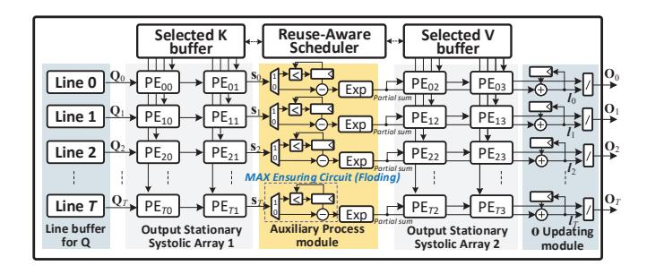

# B. Reusable and Configurable DLZS Engine

As discussed in Section III-A, the DLZS unit is acquired to predict the  $\hat{\mathbf{K}}$  and  $\hat{\mathbf{A}}$ , respectively. The two phases demand diverse precisions. In the former case, the inputs are 8-bit token and weights, where the weights are pre-converted into LZ format. In contrast, the latter case requires operations with 16-bit precision, as the output of the former is truncated to at most 16 bit. To this end, the LZE is designed as configurable to enable 8 & 16-bit mixed precisions. As depicted in Fig. 12 left, each LZE unit contains two 8-bit leading zero counters (LZCs) [48] connected in series. When the input is 8-bit, the two LZCs work independently. However, when the input becomes 16-bit, the two *all-zero flag a*0 and  $a_1$  are performed through logic AND, then the corresponding output is employed as a selected signal to pick up 16-bit outputs. The processing flow of DLZS engine is illustrated in Fig. 12 right. First,

Fig. 13. Architecture for the flexible-input supported SADS engine.

the operands are sent to a zero eliminator module, where calculations with zeros are removed. Next, in the  $\hat{\mathbf{K}}$  prediction phase, 8-bit tokens and 4-bit LZ-format weights are transferred to the  $128 \times 32$  systolic shift array, and  $\hat{\mathbf{K}}$  would be generated and cached in the output buffer. Then, in the A prediction phase, the 16-bit Qs are fed to the 16-bit mode LZC array. The generated 5-bit LZs along with the  $\hat{\mathbf{K}}$  are sent to the shift array again, to produce the final estimated  $\hat{\mathbf{A}}$ .

#### C. High-parallel and Flexible-input Supported SADS Engine

As illustrated in Fig. 6, the tile sizes in SOFA's tiled pipeline mechanism vary across different models and tasks. In other words, the length of the sub-segment that the sorting unit needs to process is flexible. This demands a sorting module that supports flexible inputs with low power overhead and high throughput to avoid bottlenecks. To this end, we design a flexible-input sorting architecture, with the high-parallel bitonic sorting core. Fig. 13 illustrates the SADS engine, which consists of two main modules:

- 1) Sorting Module: The core sorting architecture uses a fully parallel 16-to-4 bitonic sort design [49]. To handle flexible-length inputs, the module receives 12 new inputs each time. combines them with the four largest values from the previous round, and outputs four new sorted values. After all elements are processed, the final results are generated. Throughout this process, we observe an opportunity to further reduce power consumption. Essentially, we only need the top-k values and the top-k values and the top-k value (the top-k), and the order among the k-th Max value is inconsequential. Therefore, we can eliminate redundant comparators without compromising the outcome, as shown in the shaded area in Fig. k-k-k-k-k-k-k-k-k-k-
- 2) Clipping Module: According to the proposed SADS in Section III-B, only elements in the feasible range are picked up and sorted accordingly. To this end, an adaptive clipping mechanism is implemented in this module to perform the filter function. As illustrated in Fig. 13, it first reads the data to be sorted from DLZS unit and the threshold from Threshold Updating (TU), respectively. The threshold is selected as the larger value between the top margin (=Max-r) and the low bound (The current Min value in the output buffer). In the beginning, both the low bound and top margin are set as zero and no values are eliminated. After obtaining the

Fig. 14. The dedicated data flow architecture for the SU-FA mechanism.

temporal sorted results, the *low bound* and *top margin* are updated in TU module. After that, the clipping mechanism is active and the smaller values are blocked in the following iterations. Given the efficiency of hardware implementation, we opt to directly substitute the blocked values with zeros. This approach effectively reduces power consumption from switching activities while maintaining hardware compatibility.

#### D. Successive Updating FlashAttention Engine

While SU-FA can effectively reduce non-linear computations of traditional FA by leveraging the Max value provided by the top-k stage, it still faces a critical precision issue. This is because DLZS inherently is log-domain approximate computing, thus inevitably leading to estimation errors. Hence, hardware support is required to provide runtime assurance for the Max value. However, introducing a dedicated module for dynamic comparison directly would incur huge area overheads. To achieve this, we design a folded auxiliary process (AP) module capable of simultaneously supporting both Max value assurance functionality and synchronization between tiles (line 5-6 in Fig. 10). As depicted in Fig. 14, this module operates in two configuration modes: computation (0) and  $max\ update\ (1)$ . In mode 0, the intermediate value s from the systolic array (SA) 1 is directly subtracted with the Max value cached in Reg, and then fed to the Exp unit. Otherwise, in mode 1, the s is sent into a comparator, compared with the Max cached in Reg, and the Reg's Max value is updated accordingly. Please note Mode 1 is only activated during switching between different tiles or in the first computation phase within the same tile. The tiled computation controller manages the switching between the two modes.

Workflow. The SU-FA engine consists of four main parts: two SAs, an AP module, and an O updating module. First, the 128-row Q vectors are stored in the line buffer. Subsequently, two rows of K vectors corresponding to each Q vector are incrementally fed into SA-1, generating the corresponding s. Then, s is sent into the AP module to perform the corresponding comparison or Exp calculation (Fig. 10 line3, 5, 6), yielding intermediate partial sum results. The partial sum results are then fed into SA-2 and multiplied with the corresponding V vectors. Finally, the resulting output is sent to the O updating module to compute the final outputs (Fig. 10 line 7).

**Reuse-Aware Schedule Scheme (RASS).** Due to dynamic sparsity, different queries select different Ks and Vs, with some

Fig. 15. Comparisons between RASS strategy and vanilla execution.

overlap. Hence, how to effectively reuse K and V between different queries is a crucial challenge, especially in large-scale parallel processing. Based on [31], we design a *reuse-aware schedule scheme (RASS)* with KV out-of-order execution to reduce overall memory access. As shown in Fig 15,  $k_2$  and  $k_3$  are shared among three queries:  $q_0$ ,  $q_1$  and  $q_2$ , making them the top candidates for initial scheduling. Then, RASS seeks out Ks which are exclusively used by the remaining unscheduled query  $q_3$ , i.e.,  $k_5$  and  $k_6$ . As a result,  $k_2$ ,  $k_3$ ,  $k_5$ , and  $k_6$  are packed together for execution in Phase 0. Such greedy search continues until all queries are allocated adequate Ks. As exemplified in Fig 15, compared to the default left-to-right computation order, RASS reduces 33% memory access.

We design a scheduler to implement the RASS. As shown in the middle of Fig. 15, the whole condition statement and control logic are implemented in an FSM controller. Besides, it involves a single-port read-write ID Buffer which is indexed using a bitmask of queries. For example,  $k_5v_5$  and  $k_6v_6$  are exclusively required by query  $q_3$ . Consequently, the pair '5, 6' is stored in buffer-1000. Then the FSM controller accesses the ID Buffer according to the RASS, and dispatches the IDs into the Issuing FIFO in an optimized execution order.

#### V. EVALUATION

#### A. Experimental Setup

We evaluate the soft performance of SOFA with several typical Transformer models and tasks by NVIDIA A100 GPU. For NLP tasks, the BERT-base and BERT-large models [3], are selected and evaluated by eight tasks from GLUE [50] and SQuAD v1.1 [51]. The maximum sequence length for BERT-B/L is 256/256/384/512/512 for MRPC/RTE/SQUAD/STSB/QNLI, respectively. Moreover, for GPT-2 [7], Bloom-1.7B [52], Llama7B/13B [46], language modeling tasks on Wikitext-2 [53], WikiLingua [54], Wiki-raw and Winogrande [55] are evaluated. The maximum length for datasets on evaluated Bloom1.3B/Llama7B/13B is 2k/4k/4k, respectively. For CV tasks, we choose the latest PVT (with 3192 sequence length) [56] for ImageNet-1k classification [57] by fine-tuning the checkpoint of ImageNet-21k. All models are implemented with Pytorch libraries [58] and Huggingface

Fig. 16. The preparation and execution flow diagram of SOFA.

Transformer project [59]. For each task, we execute finetuning on NVIDIA A100 GPU after token pruning to recover accuracy.

For hardware evaluation, we performed the RTL design for the SOFA accelerator and utilized Synopsys DC on TSMC 28nm CMOS technology, to estimate the logic parts' area and power consumption. The power, area, and read/write bandwidth of on-chip SRAM buffers are estimated through CACTI [60]. For modeling off-chip DRAM, we utilize Ramulator [61] to simulate the memory behaviors and employ the same method with [62]–[64] to estimate the IO power. According to the synthesized results, the latency of the critical path is less than 1 ns. Then, we assume the running frequency of SOFA is 1 GHz. We extract each stage's actual cycles by simulating the RTL with Verilator [65], based on which a cycle-level simulator is implemented to evaluate end-to-end performance.

For comparisons with GPU, we deploy the benchmarks on the A100 platform using the Pytorch framework. We measure execution time by inserting torch.cuda.synchronize at the start and end points, and then calculate the elapsed time. For power measurement, based on nvidia-smi, we first measure the system's idle power, and then repeatedly run workloads and get the total power. The dynamic power is total power minus idle power. Based on the computational workload, we derive the average throughput and energy efficiency. Similarly, we run the cloud TPU [66], [67] to analyze the performance on diverse commercial hardware.

