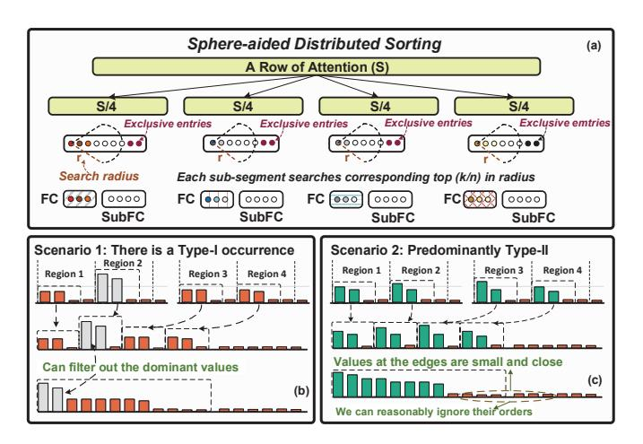

# B. Sphere-search Aided Distributed Sorting (SADS)

To effectively identify vital tokens in the top-k stage, previous works [33], [34] have tried to explore low-cost sorting algorithms and design corresponding hardware to improve throughput. However, they all fail to consider the data distribution property, thus only achieving limited efficiency and missing opportunities for cross-stage optimization.

As softmax approximates the argmax operation, its results primarily depend on dominant tokens when multiple tokens with prominent amplitudes appear, as denoted in Type-I of Fig. 8(a). Alternatively, there are two potential scenarios for element distribution: a uniform distribution, exemplified by Type-II, and a concentration of slightly larger elements in a specific region, depicted as Type-III. To ascertain their practical distributions in Transformer inference, we conducted a token analysis for BERT/L [3], ViT/B [12], GPT-2 [7] and Llama7B [46] with 4096 rows. The statistical results in Fig. 8(b) reveal that the Type-II distribution predominates across all four models, accounting for over 76\% on average. Type-I occurrence is more frequent in ViT, GPT-2 and Llama, with an average rate of 25%, which may be attributed to image local similarity and the self-autoregressive token generation, respectively. By contrast, the occurrence probability of Type-III is notably low in all models, even approaching nearly 0 in GPT-2 and Llama7B. This is primarily attributed to the extended context, which diminishes the likelihood of a concentration for higher magnitude tokens in a specific region.

Combined, Type-I and Type-II collectively constitute over 95% of the total distribution. Hence, these two types can effectively represent the overall data distribution characteristics of the attention. We observe that the larger values within each region of these two data types can aptly represent the overall larger values. We term this characteristic as the 'Distributed Cluster Effect (DCE)'. Distributed implies that a long segment can be divided into several shorter sub-segments, while Cluster indicates that each sub-segment contains its primary information. Therefore, sorting based on well-segmented partitions is expected to have a negligible impact on holistic performance.


Fig. 7. (a) Traditional sparsity prediction. (b) Cross-phase DLZS sparsity prediction. (c) Comparisons between DLZS and vanilla scheme.


Fig. 8. (a) Three types of attention data distribution. (b) Corresponding proportions in diverse Transformer models.



Fig. 9. (a) Low-complexity SADS sorting algorithm. (b) Scenario 1: Type-I occurs. (c) Scenario 2: Type-II dominates.

To this end, we propose the SADS sorting, which exploits the DCE to reduce complexity in a tiled manner. Initially, as shown in Fig. 9 (a), one row of the attention matrix is divided into n sub-segments (assuming n=4). Next, each sub-segment pick up the top-(k/n), i.e., top-(k/4) values, from its own data. Due to the area constraints of hardware implementation, sorting may necessitate multiple iterations. In each iteration, the Max value from the previous iteration

serves as a benchmark. A feasible range (FR) is obtained by subtracting the spherical radius (R) from the benchmark. Then, the sorting is exclusively performed on the entries within the FR, rather than all entries. Following this, for each sorted set, the largest k/4 elements are collected into FC set, which represents the indices of vital KVs. This set is used to guide the subsequent *Formal Computing Stage*.

Figs. 9 (b)-(c) exemplify why SADS can maintain accuracy with reduced complexity. For Scenario 1, where Type-I distribution occurs, SADS is certain to capture the dominant values, irrespective of which sub-segment they fall into. For Scenario 2, where the majority of the distribution is Type-II, SADS can effectively select all relatively larger values that dominate in the complete row. Given that the values falling on the edges of the top-k are typically smaller, we can reasonably relax the sorting requirements for them. According to our experimental results, with s=1024 and n=4, the average error of the top 25% is only around 3% (Different K indices are considered as errors). Furthermore, the specific number of sub-segments (e.g. tiling size) of each layer is obtained by the DSE in Section III-D.

### C. Sorted-Updating FlashAttention (SU-FA)

The attention is the primary bottleneck in scaling to LTPP scenario, as its memory complexity increases quadratically with the sequence length. To tackle this issue, we propose an attention acceleration mechanism called SU-FA, which is both computationally and memory efficient, by leveraging specific sorting information generated from the *top-k stage*. It also enables cross-stage tiling for the formal-compute stage. Traditionally, addressing overflow in hardware *softmax* implementation requires identifying the Max value in each row [47]. This leads to continual comparison operations in classical FA [39], [40] to refresh the Max value across diverse blocks, which however, results in skyrocketing computational cost as revealed in Fig. 5.

The indices of the top-k values provided by top-k stage allow us to get the potential index of the Max value. A direct but coarse approach is to calculate the Max value based on the potential index and then send it into the FA for computation. However, there are two critical problems: 1) The index of the Max value is not guaranteed to be accurate due to the approximation properties of DLSZ, which could result in

```
m_i^{(j)} = \max(m_i^{(j-1)}, x_i^{(j)}) = x_i^{(j)} \int m_i^{(j)} = \max(m_i^{(j-1)}, x_i^{(j)}) = m_i^{(j-1)}
Additional multiplication
  Proposed compute-memory efficient SU-FA
  Initial: Divide K,V into Tc blocks, each with Bc × H/A
  Parallel for i = 1 to T do
       Load \mathbf{Q}_i \in \mathbb{R}^{1 \times H/A} from DRAM to on-chip SRAM
       for j = 1 to Tc do
                //Scheduler ensure s_i^j[1] is the Max in Block
               \mathbf{s}_{i}^{j} = \mathbf{Q}[i,:]\mathbf{K}^{T}[:,(j-1)B_{c},jB_{c}]
              l_i^{(j)} = l_i^{(j-1)} + \sum_{t=1}^{B_c} e^{\mathbf{s}![t] - \mathbf{s}![1]}
              \mathbf{o}_{i}^{(j)} \! = \! \mathbf{o}_{i}^{(j-1)} + \sum\nolimits_{t=1}^{B_{c}} \! \mathrm{e}^{\mathrm{s}\!i[t] - \mathrm{s}\!i[1]} \mathbf{V}[(j-1)B_{c} + t,:]
4
5
         m_i = \max(s_i^1[1], s_i^2[1], \cdots, s_i^{T_c}[1])
        l_i = l_i^{(1)} e^{s_i^1[1] - m_i} + \dots + l_i^{(T_e)} e^{s_i^{T_e}[1]} -
6
        \mathbf{O}_i = \mathbf{o}_i^{(T_c)}/l_i
                                       //Different Tiles synchronization
```

Fig. 10. (a) Formulas for diverse updating orders. (b) Procedure of SU-FA.

potential overflow; 2) Separately calculating the Max value introduces additional computational and power overhead. To this end, we propose a novel sorted-updating FA. Instead of computing for the Max separately, SU-FA executes either ascend or descend updates during the computation process. Descend updating means first computing Fig. 5(a) line 5 from the index of Max, followed by the index of the 2nd large value, until the k-th value. Ascend updating proceeds in the opposite order. Although at first glance, both of these approaches can effectively eliminate the max comparison (Fig. 5 (a) line5), we found that the benefits vary significantly with different updating orders. Specifically, when executing ascend updating, the line 5-7 can be rewritten as Eq. (1) in Fig. 10(a), where we denote  $\mathbf{S}_{i}^{j}$  as  $x_{i}^{(j)}$  for clarity. Though  $m_{i}^{(j)}$  equals to  $x_{i}^{(j)}$ constantly, it is noteworthy the calculating for  $l_i^{(j)}$  still acquires one exponentiation (Exp), one multiplication (Mul) plus an addition (Add).

By contrast, if descending order is employed, as Eq. (2) in Fig. 10(a), the updating for  $l_i^{(j)}$  merely requires one Exp and one Add. While such benefits may seem minor, the performance gain is substantial when large-scale parallel process long sequences. The procedure for the descending SU-FA is summarized in Fig. 10(b). Compared to the traditional FA and ascending SU-FA, the descending SU-FA on average reduces 25% and 11% complexity, respectively. In subsequent discussions, SU-FA defaults to adopt the descending order. Please note the inaccuracy of the predicted Max is co-optimized by the architecture in Section IV-D.

