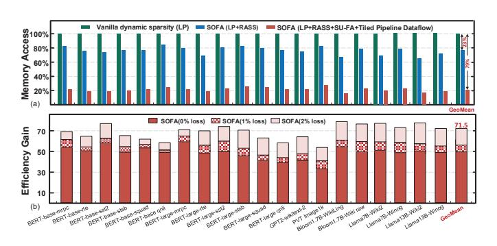
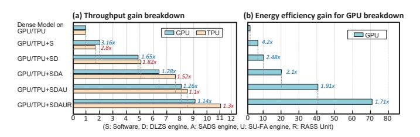

# D. Comparison with Existing Acclerators

FACT, Sanger, Energon, SpAtten, ELSA and DOTA are SOTA Transformer dynamic sparsity accelerators. However, their designs focus on computational optimization, overlooking that memory access becomes the de facto bottleneck after computational optimization. The head pruning technique in SpAtten can partly alleviate memory access issues, but its efficiency is limited as it fundamentally depends on the

Fig. 20. (a) Memory access reduction of SOFA. (b) Efficiency gain of SOFA over Nyidia A100 GPU.

Fig. 21. (a) Throughput gain of GPU/TPU with SOFA's mechanism (b) Energy efficiency gain of GPU with SOFA's mechanism.

characteristics of the task. On the other hand, although Energon considers a certain computation-to-memory access ratio in its architecture design, it still suffers from inefficiency due to the variability of computational tasks and models. In summary, previous efforts still lack simultaneously optimizing both computation and memory access. When imbalance arises between computation and memory access due to sparsity, it hampers further enhancement of hardware efficiency. SOFA employs a holistic FlashAttention-like scheme to divide all work stages of dynamic sparsity into fine-grained tile manner, and leverages the sort information for cross-stage collaborative optimization. Table II compares the features of software and hardware performance across existing SOTA accelerators. Benefiting from the low complexity of LP mechanism, SOFA achieves the greatest reduction (82%) in computation at the same accuracy loss of 0%. We list their hardware parameters and present a normalized comparison [64], [68] of energy

and area efficiency. Compared to these SOTA accelerators, SOFA achieves a device (core + I/O) energy efficiency of 7183 GOPS/W, representing an average improvement of  $7.2\times$  to  $24\times$ . This improvement stems from the fine-grained data flow achieved through collaborative cross-stage optimization, which effectively reduces off-chip memory accesses. Additionally, SOFA achieves 4292 GOPS/mm² area efficiency, which is  $2.4\times$  to  $27.9\times$  better than the SOTA accelerators. The gain in area efficiency primarily arises from the algorithm-hardware co-optimization for low complexity.

In Table II, we also quantitatively compare the latency of the SOTA accelerators by evaluating them to execute an attention part (137GOPs) of Llma7B. For fairness, all accelerators are scaled to 128 multipliers clocked at 1GHz. For example, the effective throughput of FACT is 928 GOPS in 500MHz with 512 multipliers. Then its execution latency is 2\*137/928=296ms. Compared to the 0% loss accelerators FACT and Sanger, SOFA achieves  $6.6\times$  and  $5,4\times$  latency reduction, respectively. Moreover, SOFA achieves  $8.5\times$  and  $10.6\times$  latency decrease over SpAtten and Energon, respectively. Such reduction in SOFA latency is mainly attributed to the fine-grained tiling execution across stages, as illustrated in Fig.6.

#### VI. RELATED WORKS AND DISCUSSION

Efficient Transformer Accelerator. Numerous studies [23], [28]-[34], [70]-[75] have been proposed to improve the energy efficiency and speed of Transformer inference. However, most of these works focus on attention computation reduction, including static sparsity [75]-[78], dynamic sparsity [23], [28]–[34] and hybrid sparsity [79]. However, when computation is optimized, the memory access would dominate the overall power and time, especially for LTPP scenarios, which these works ignore. By contrast, SOFA optimizes both compute and memory access, thus greatly outperforming previous works. Further, all dynamic sparsity efforts focus on individually optimizing each stage for higher efficiency. Unlike these works, SOFA exhibits a cross-stage holistic optimization. This provides SOFA with an ever-overlooked opportunity for cross-stage tiling, executing a fine-grained tiled dataflow that accelerates inference while reducing off-chip memory access.

Neural network accelerator with sparsity. There are very many ASIC or FPGA accelerators [70], [72], [80]–[98] that leverage sparsity to optimize the performance of neural network inference. There also exist general sparse tensor algebra accelerators [99]-[104] proposed in recent years, which can be used to process sparse FC layers. Recently, works [105]-[107] utilize hierarchical sparsity to construct a comprehensive design space and provide accurate performance metrics, which enable the automatic and optimal design of sparse DNN accelerators. However, most of the works focus on exploiting pre-trained static sparse weights. By contrast, SOFA leverages LP to predict on-the-fly dynamic sparsity. Especially, such sparsity comes from the argmax approximation property of softmax, thus needing to be detected actively. This makes the traditional near-zero-based sparsity methods inapplicable. Through recently some works are config for activation sparsity [108] and both weight and activation sparsity [106], [109], [110], they are all based on the near-zero sparsity, thus failing to the top-k sparsity scene, which is SOFA targets.

Fused operator tiling accelerators. Many works [111]– [118] leverage layer-fusion strategy to optimize the DNN inference performance. Specifically, DNNBuilder [117] and DeFiNES [118] use a depth-first-like layer fusion in CNNs to enhance data reuse via cross-layer tiling, enabled by the weak operator dependencies in CNNs. However, dynamic sparsity of Transformers face bottlenecks due to row dependency in the top-k/softmax operator, restricting dynamic sparsity for long sequences. SOFA addresses this by employing the DCE data distribution property, unlocking the possibility of depthfirst-like execution in Transformer dynamic sparsity for the first time. DeepBurning [119] partitions NN graphs at the inter-operator granularity and executes them in a pipeline fashion. In contrast, SOFA achieves finer-grained execution by dividing within the operator, leading to more efficient SRAM utilization. FLAT [120] fuses the two matmul operators and softmax in attention to reduce off-chip memory access but fails to resolve softmax row dependency. Traditional FlashAttention [39], [40] successfully unlocks the row dependency of softmax but at the expense of surging computation costs. In this aspect, SOFA leverages SU-FA to successfully solve the row dependency in softmax, allowing for finer-grained tiling and reducing SU-FA complexity using top-k sorting information.

#### VII. CONCLUSION

We propose SOFA, a cross-stage compute-memory efficient algorithm-hardware co-design to accelerate dynamic sparsity Transformer inference for LTPP. We introduce a novel log-domain DLZS computing paradigm to estimate Q-K pairs with add-only operation, requiring less converters. To prevent memory access from becoming a bottleneck after sparsity computation optimization, we propose SADS and SU-FA to enable cross-stage tiling for the end-to-end workflow. Leveraging this tiling strategy, SOFA executes a fine-grained pipeline dataflow across diverse stages, effectively mitigating memory access and latency issues. Efficient architecture is designed to support and accelerate the above mechanisms with a memory-efficient reuse-aware schedule. SOFA achieves 71.5× energy saving than Nvidia A100 GPU, and average 15.8× higher energy efficiency than eight SOTA accelerators, respectively.

