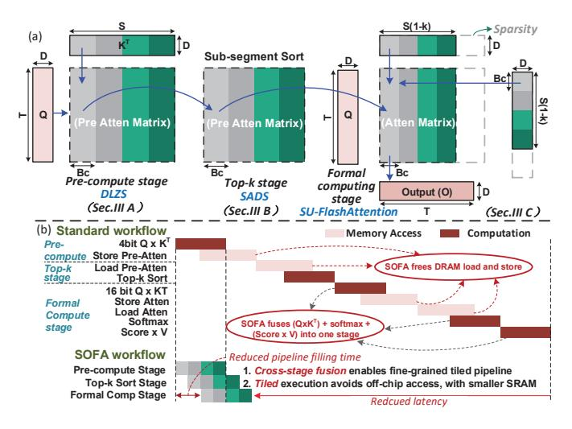

# III. ALGORITHM OPTIMIZATIONS OF SOFA

Fig. 6 (a) presents an overview of the SOFA algorithm optimizations. First, at the *pre-compute* stage, we propose DLZS, a log-domain computing paradigm to predict  $\hat{\mathbf{A}}$ . Then, exploiting DCE, we introduce SADS, to partition a long sequence into several sub-segments for independent tiled sorting. Next, leveraging the sorting information, a memory-compute efficient attention-computing mechanism (SU-FA) is designed. The SADS and SU-FA enable SOFA to execute a cross-stage

Fig. 6. (a) High-level diagram of the SOFA algorithm optimizations. (b) Tilebased pipelined dataflow (SOFA) vs. standard dataflow.

tiling pipeline dataflow. Compared to the vanilla workflow in Fig. 6(b), the tiling execution makes SOFA require minimal SRAM for storing intermediate results without extra memory access, while the fine-grained pipelined dataflow can reduce inference latency.

