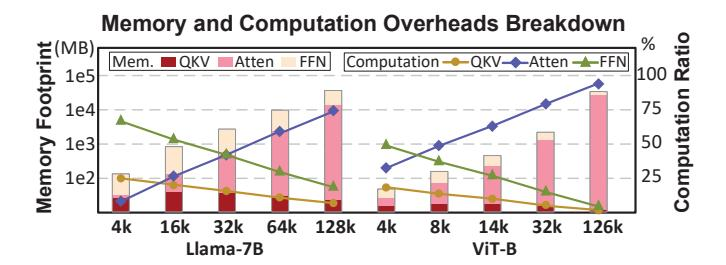
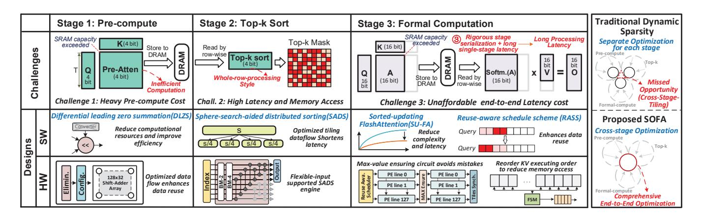
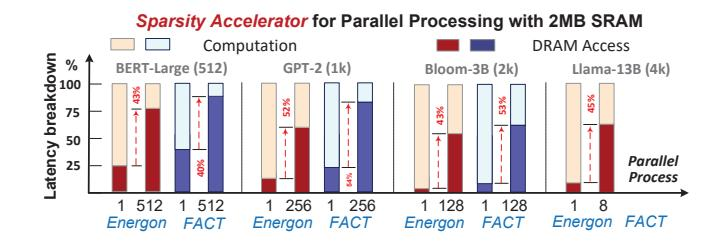

# SOFA: A Compute-Memory Optimized Sparsity Accelerator via Cross-Stage Coordinated Tiling

Huizheng Wang\*, Jiahao Fang\*, Xinru Tang\*, Zhiheng Yue\*, Jinxi Li\*, Yubin Qin\*, Sihan Guan\*, Qinze Yang\*, Yang Wang\*, Chao Li†, Yang Hu\*‡⊠, Shouyi Yin\*‡

\* School of Integrated Circuits, Tsinghua University, Beijing, China, 100084

† School of Computer Science and Engineering, Shanghai Jiao Tong University, Shanghai, China, 200240

‡ Shanghai Artificial Intelligence Laboratory, Shanghai, China, 200433

© Corresponding author, hu\_yang@tsinghua.edu.cn

Abstract—Benefiting from the self-attention mechanism, Transformer models have attained impressive contextual comprehension capabilities for lengthy texts. The requirements of highthroughput inference arise as the large language models (LLMs) become increasingly prevalent, which calls for large-scale token parallel processing (LTPP). However, existing dynamic sparse accelerators struggle to effectively handle LTPP, as they solely focus on separate stage optimization, and with most efforts confined to computational enhancements. By re-examining the endto-end flow of dynamic sparse acceleration, we pinpoint an everoverlooked opportunity that the LTPP can exploit the intrinsic coordination among stages to avoid excessive memory access and redundant computation. Motivated by our observation, we present SOFA, a cross-stage compute-memory efficient algorithmhardware co-design, which is tailored to tackle the challenges posed by LTPP of Transformer inference effectively. We first propose a novel leading zero computing paradigm, which predicts attention sparsity by using log-based add-only operations to avoid the significant overhead of prediction. Then, a distributed sorting and a sorted updating FlashAttention mechanism are proposed with cross-stage coordinated tiling principle, which enables finegrained and lightweight coordination among stages, helping optimize memory access and latency. Further, we propose a SOFA accelerator to support these optimizations efficiently. Extensive experiments on 20 benchmarks show that SOFA achieves  $9.5 \times$ speed up and 71.5× higher energy efficiency than Nvidia A100 GPU. Compared to eight SOTA accelerators, SOFA achieves an average  $15.8 \times$  energy efficiency,  $10.3 \times$  area efficiency and  $9.3 \times$ speed up, respectively.

Index Terms—Transformer, attention, sparsity accelerator, cross-stage tiling, top-k, FlashAttention, software-hardware codesign.

#### I. INTRODUCTION

Remarkable success has been witnessed recently in the development of Transformer architecture [1], for both natural language processing (NLP) [2]–[10] and computer vision (CV) tasks [11]–[19]. The impressive capabilities of Transformers greatly stems from their *self-attention* module, which excels at extracting global context information [20]. Typically, self-attention modules take three matrices as their inputs: namely,  $\mathbf{Q}$  (query),  $\mathbf{K}$  (key) and  $\mathbf{V}$  (value). First, an attention matrix  $\mathbf{A} \in \mathbb{R}^{S \times S}$  is obtained by multiplying  $\mathbf{Q}$  and  $\mathbf{K}$ , where S is sequence length. Next,  $\mathbf{A}$  goes through the softmax function for normalization, then is multiplied by  $\mathbf{V}$  for the final output.

Large language models (LLMs) have driven the transformer architecture to unprecedented levels of complexity

Fig. 1. Transformer memory and computation breakdown for long sequence.

and capability, particularly in handling extended sequence lengths [21]. This evolution places heightened demands on inference capabilities and throughput [22], critically impacting the performance of key transformer components: the attention module, feed-forward network (FFN) module, and the query-key-value (QKV) computations.

Traditionally, in Transformers designed for smaller sequence lengths  $(\leq 2k)$ , the FFN module typically presented the main bottleneck due to its dense computational requirements [23], [24]. However, with recent advancements in processing long text, where sequence lengths can exceed 128,000 characters [25]–[27], the performance bottleneck is shifting from the FFN to the attention module. Our detailed profiling indicates that as sequence lengths surpass 32,000 characters, the attention module becomes the dominant factor affecting inference time, as shown in Fig.1. This shift is primarily because the complexity of the attention mechanism scales quadratically with sequence length, making it increasingly challenging to manage as sequences extend.

Dynamic sparsity (DS) acceleration [23], [28]–[34] have emerged as a promising solution to mitigate the latency issue of self-attention. The key idea is to predict vital Q-K pairs at runtime and calculate attention based on these vital pairs to reduce the inference latency. Typically, it consists of three stages. A pre-compute stage firstly estimates the matrix  $\bf A$  (denoted as  $\bf \hat{\bf A}$ ). Then, a top-k stage picks the vital Q-K pairs. In the subsequent formal computing stage, self-attention is calculated only based on the vital pairs.

The need for high parallelism of dynamic sparsity token processing in the context of LLM inference is increasing,

Fig. 2. Dynamic sparsity challenges for LTPP and SOFA's software and hardware co-design.

especially during the prefill stage. In this stage, entire contexts are processed simultaneously, favoring high token parallelism to enhance efficiency. This scenario is especially meaningful as modern LLM inference often employs separate deployments for the prefill and decode stages [35], [36]. Moreover, the advent of speculative inference [37] can transform decode operations into prefill tasks, further emphasizing the need for efficient large-scale token processing parallelism (LTPP).

However, supporting dynamic sparsity with large-scale token parallel processing would present prohibitive overheads, as shown in Fig. 2. This is because, firstly, current dynamic sparsity acceleration solutions lack efficient prediction schemes to reduce computation complexity. Though calculating selfattention based on vital Q-K pairs can be beneficial in reducing compute and memory consumption, the newly introduced precompute and top-k stages consume non-trivial computational and memory resources when large amounts of tokens are processed, which can even offset the benefits brought by sparsity acceleration methods in some cases. Our characterization depicts that even with 4-bit during the prediction stage and 16bit during the *formal stage*, the power overhead of prediction is already  $1.4\times$  that of formal computing when top-k equals 20%. Unfortunately, the overhead in prediction will further rise sharply with increased parallelism.

Secondly, the processing stages in current dynamic sparsity acceleration are not designed to be partitionable, and miss the opportunity to support fine-grained pipelining, which would enable more efficient processing. The *top-k* sorting must be based on the readiness of a whole row of the Pre-Atten (Â) matrix. In LTPP scenarios, the increased delay in processing each stage accumulates continuously, ultimately resulting in a significant increase in end-to-end latency. This "whole-row-processing" style also increases the amount of intermediate data, resulting in a substantial rise in DRAM access requirements. Fig. 3 shows the memory access time (MAT) of two SOTA Transformer accelerators when scaled to process multiple tokens. The increase in parallelism leads to a sharp rise in off-chip memory access and surging MAT. On average, the MAT ratio rises to 72%, overshadowing computation time

Fig. 3. MAT for SOTA dynamic sparsity accelerators (FACT [23], Energon [34]) with diverse parallelisms.

and becoming the primary bottleneck.

Thirdly, current dynamic sparsity acceleration solutions do not exploit cross-stage coordination, missing the opportunity to reduce the computation complexity of later stages by leveraging guidance extracted from former stages. Although FlashAttention2 (FA-2) already provides a tiling scheme for softmax to reduce memory access overhead, *the decreased memory access comes with surging computations*. This occurs because repeated exponentiation and comparison operations are necessary to refresh the MAX among tiles, ensuring the correctness of the global MAX value. We observe an opportunity to guide FA-2 computation with top-*k* information. These limitations highlight the need for more advanced strategies to manage dynamic sparsity with LTPP effectively.

Our Insights: Motivated by the challenges, we observe an opportunity that breaks down the computation, memory, and latency overheads in each stage by adopting a cross-stage coordinated tiling strategy, thus a stage is decomposed into fine-grained sub-stages. Therefore the process in the following stages doesn't have to wait for the finish of processes in the last stage. The coordination among stages becomes more swift and excessive DRAM memory access could be saved. Notably, it is non-trivial to achieve this goal as we need to figure out effective methods to partition top-k module and efficiently forward the information to formal stages.

We propose an algorithm-hardware co-design for attention optimizations, named SOFA. It features three key designs that correlate to three challenges, as depicted in Fig. 2. First, the

Fig. 4. Basic components of a Transformer model and operation intensity.

computation overhead in *pre-compute* stage is alleviated via a multiplier-free *differential leading zero summation (DLZS)* paradigm, which helps reduce the sparsity prediction overhead of each tile. Second, we propose a *sphere-search-aided distributed sorting (SADS)*, which distributes a long segment into sub-segments to execute individual tiled sorting, while effectively reducing total comparisons. Third, we propose a *sorted-updating FlashAttention (SU-FA)*. It skillfully decouples the *softmax* row-dependence to enable the formal computing stage tiling, while leveraging cross-stage sorting information to reduce computation. In summary, DLZS and SADS together serve as a low-complexity prediction (LP) mechanism to reduce prediction overhead. SADS collaborates with SU-FA, employing fine-grained tiling for sparse acceleration, to optimize memory access and processing latency.

We propose a dedicated accelerator to support the proposed mechanism effectively. Compared to naive implementation, which only has a limited  $19.6\times$  energy saving over Nvidia A100 GPU, SOFA accelerator improves its performance with four novel algorithm-hardware co-designs.

Evaluated on 20 benchmarks, SOFA achieves an average energy efficiency of 7183 GOPS/W, which is  $71.5\times$  and average  $15.8\times$  higher than Nvidia A100 GPU and eight SOTA accelerators, respectively. Overall, SOFA's computational efficiency is  $9.5\times$  higher than that of the GPU A100 and  $11.1\times$  higher than the TPU, respectively. We also conduct comprehensive ablation on GPU to quantify the performance benefits brought by our software mechanism and various hardware components. Evaluations on GPU/TPU show that SOFA's software optimization achieves a  $3.16\times/2.8\times$  speedup, while hardware acceleration delivers a  $3.03\times/3.9\times$  speedup.

#### II. BACKGROUND AND MOTIVATION

#### A. Preliminaries for Transformer

Fig. 4(a) shows a typical Transformer model: an input sequence containing S tokens is transformed into an embedding matrix  $\mathbf{X} \in \mathbb{R}^{S \times H}$ , projected to  $\mathbf{Q}$ ,  $\mathbf{K}$  and  $\mathbf{V}$  spaces, split into A chunks  $\mathbb{R}^{S \times H/A}$ , and processed by multi-head attention (MHA) to generate an attention matrix. The attention matrix, after softmax and multiplication with  $\mathbf{V}$ , resulting in a matrix  $\mathbf{O} \in \mathbb{R}^{S \times (H/A)}$ . Outputs from all heads are concatenated, projected by  $\mathbf{W}_O \in \mathbb{R}^{S \times H}$ , and passed through the FFN with two fully connected layers to generate final outputs.

Fig. 5. Process of FlashAttention-2 and its computation overhead.

Computation Properties Analysis. We analyze the operation intensity (OI) [38] for the three parts of a Transformer layer. As shown in Fig. 4(b), MHA exhibits notably lower OI, averaging 15% of the FFN. This means MHA requires more data movement for the same computation FLOPs, due to element-wise operations. Fig. 4(c) further illustrates the relationship between the OI of MHA and the token processing parallelism. We can figure increasing parallelism effectively boosts OI, thus theoretically reducing the demand for data movement under equivalent computational power and PE utilization. This gain is attributed to increased data reuse.

#### B. FlashAttention (FA)

To reduce data movement of attention, Tri Dao et. al proposed FlashAttention (FA) [39] and the improved version FA-2 [40], both of which successfully minimized memory access but greatly increased computational cost. Fig. 5(a) outlines the procedure of FA-2 and Fig. 5(b) compares its exponential operations and comparison complexity with vanilla implementation regarding S. Here we assume the number of tiles  $T_c = S/16$ , i.e., tiling size  $B_c = 16$ . We employ the arithmetic complexity model [41] to normalize the complexity for different operations. As S increases, FA-2 exhibits a notable increase in exponential and comparison operations compared to the vanilla scheme. When S=2048, it demands  $9\times10^6$  more exponential calculations and  $3 \times 10^5$  more comparisons than the vanilla implementation. Fig. 5(c) compares the increased computational load after summing all calculations. The computational complexity of FA-2 soars with the growth of S, and the increased magnitude correlates with  $T_c$ . The larger  $T_c$  leads to a faster increase, due to the repeated calculations among  $T_c$  blocks, as shown in lines 5-8 of Fig. 5(a).

#### C. Sparsity in Attention

Typically, as shown in Fig. 4 (a), the results (a.k.a scores) of  $\mathbf{Q} \times \mathbf{K}^T$  are then processed by a *softmax* operator. Due to the *softmax*'s approximation to the *argmax* operator, most smaller score values become extremely close to zero after passing the

softmax. Therefore, they usually impose a negligible impact on the final results and can be reasonably removed. The key difference between the attention sparsity and the sparsity in DNN/Transformer models lies in that attention sparsity is entirely driven by the input data and requires dynamic evaluation at runtime, whereas model sparsity is based on static weight sparsity, which can be optimized through quantization or structured pruning.

To accelerate *self-attention*, emerging dynamic sparsity accelerations [23], [28]–[31], [33], [34] offer a promising solution. Their key idea is to predict key Q-K pairs at runtime and calculate attention for selected pairs. Typically, their workflow proceeds as Fig. 6. First, a low-precision computational paradigm is employed to predict the attention (*Pre-compute stage*); Next, vital Q-K pairs are filtered out from each row to generate a mask (*Top-k sorting stage*). Finally, based on the mask, the scheduler initiates the *Formal Computing Stage*, typically with higher precision.

