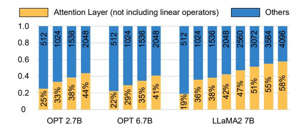
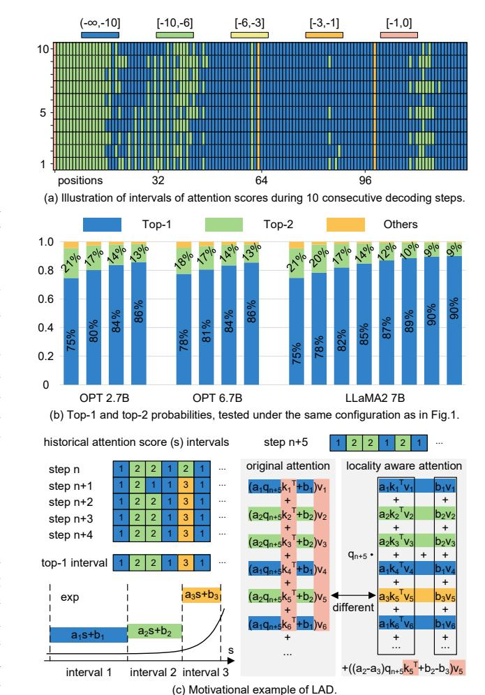
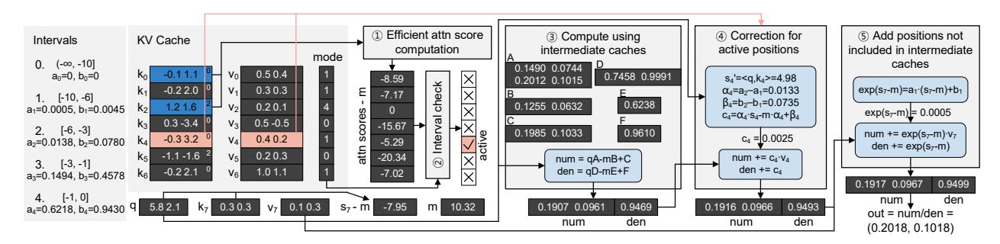
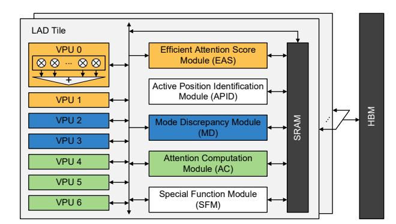
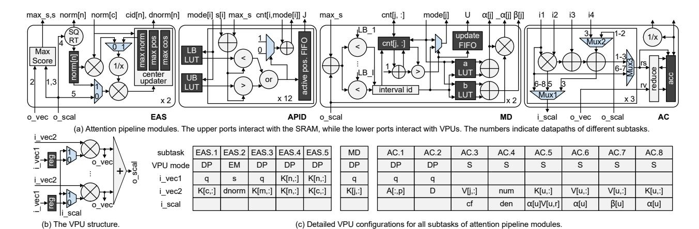
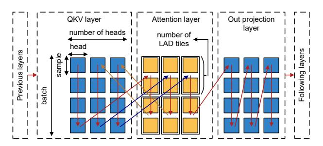
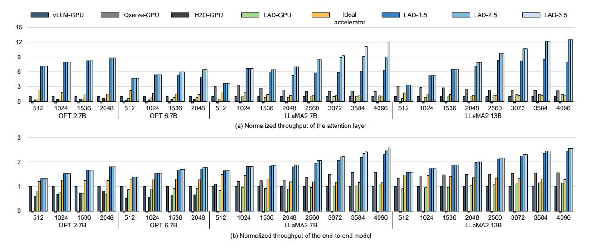
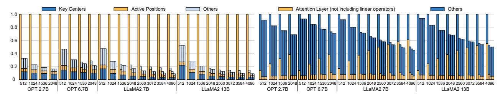
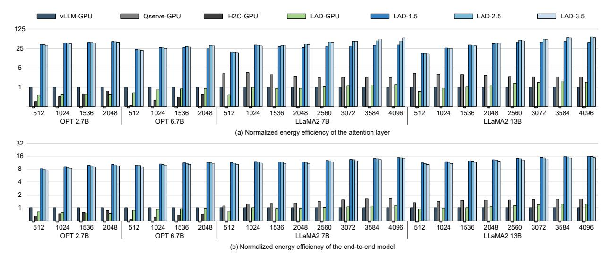
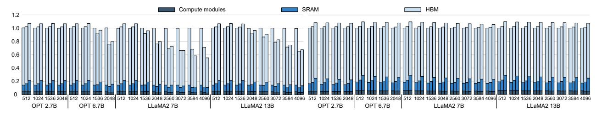

# LAD: Efficient Accelerator for Generative Inference of LLM with Locality Aware Decoding

Haoran Wang<sup>1</sup>,<sup>2</sup> , Yuming Li<sup>1</sup>,<sup>2</sup> , Haobo Xu<sup>1</sup> , Ying Wang<sup>1</sup> , Liqi Liu<sup>1</sup>,<sup>2</sup> , Jun Yang<sup>1</sup> , Yinhe Han<sup>1</sup> Institute of Computing Technology, Chinese Academy of Sciences<sup>1</sup> , University of Chinese Academy of Sciences<sup>2</sup> {wanghaoran20g, xuhaobo, wangying2009, yangjun2021, yinhes}@ict.ac.cn, {liyuming22, liuliqi24}@mails.ucas.ac.cn

*Abstract*—Large Language Models (LLMs) have emerged as the cornerstone of content generation applications due to their ability to capture relations between newly generated token and the full preceding context. However, this ability stems from the attention mechanism for decoding that retains the entire generation history as key value cache (KV cache). As the generated sequence lengthens, the KV cache expands, causing a substantial memory access bottleneck. In advanced LLM generation systems running on GPUs, the attention mechanism for decoding accounts for more than 50% of the total inference time when the KV cache length reaches 4096. To address this issue, this paper introduces LAD (Locality Aware Decoding), an LLM generation accelerator with algorithm-hardware enhancements that significantly decrease KV cache access, resulting in considerable speedups and energy savings. A key insight underlying LAD is that when the attention score for a specific position remains fixed over the next several decoding steps, it is unnecessary to repeatedly retrieve the associated key and value at each step to reproduce the computation. Our analysis reveals that numerous positions exhibit notable numerical locality in attention scores through multiple decoding steps. Leveraging these insights, we have designed an innovative attention decoding computation method that decreases the frequency of accessing the key and value for positions demonstrating good locality, all while maintaining decoding accuracy. Extensive experiments show that LAD generates sequences with an average ROUGE-1 similarity of 97% compared to those generated by the original model. When the length of KV cache exceeds 2048, the high configuration of LAD accelerator achieves on average (geomean) 10.7× speedup and 52.4× energy efficiency for the attention mechanism compared to the A100 GPU. For end-to-end model inference, it also achieves on average 2.3× speedup and 13.4× energy efficiency.

## I. INTRODUCTION

Large Language Models (LLMs) [2], [4], [46], [57] based on Transformer [47] decoder architecture have been widely applied to various critical content generation tasks, such as chatbots [5], image generation [36] and code assistants [7], [9], [37]. The generation process of LLMs is based on *autoregressive decoding*, where the attention mechanism establishes relations between the latest token and all preceding tokens in each decoding step. This enables LLMs to generate content by comprehensively understanding the entire generation history.

Nonetheless, the attention mechanism used during decoding is not sufficiently optimized for existing hardware such as GPUs, causing a bottleneck in the generation process. More specifically, the generation history is stored within attention layers in what is known as the *Key-Value cache* (KV cache),

which includes all keys and values corresponding to previously generated tokens. The size of the KV cache increases steadily with the number of generated tokens. Additionally, unlike model parameters that are uniform across various samples, the KV cache is distinct for each sample. As a result, accessing the KV cache becomes a significant bottleneck in the practical use of LLM generation. For instance, in a single decoding step, one layer of LLaMA2 7B [46] requires access to 0.29 GB of weights and 0.5 GB of KV cache when using fp16 number format with a batch size and sequence length of 32 and 1024. When the sequence length extends to 4096, the KV cache access surges to 2 GB, which is 6.9× than the constant 0.29 GB of weight access.

Existing works [18], [28], [56] have explored various methods to accelerate the generative inference of LLMs, including architectural optimization, model compression, and speculative decoding. However, purely focusing on architectural optimizations does not effectively reduce the KV cache access. The compression harms the decoding accuracy and requires retraining. Speculative decoding predicts future decoding results with small models to alleviate the KV cache access, but its success heavily relies on the precision of small models and it introduces additional computational overhead. Therefore, a more comprehensive approach is needed to address the KV cache access challenge.

We propose Locality Aware Decoding (LAD), an algorithmhardware co-designed accelerator for efficient end-to-end generative LLM inference. LAD explores inter-decoding step *numerical locality* in attention scores, which refers to the property of a position that its attention scores across multiple decoding steps are concentrated within a specific numerical range. In contrast to previous approaches that sacrifice information or require additional computations to reduce the KV cache access, LAD leverages the numerical locality of attention scores to preserve historical decoding information in compact, fixed-size intermediate caches. These intermediate caches enable decoding computations to proceed with minimal KV cache access, allowing LAD to generate longer sequences much more efficiently without compromising the generation quality. In summary, we make the following contributions:

- We propose a novel attention scheme for decoding that significantly reduces the KV cache access, while incorporating historical decoding information in small, fixed-size intermediate caches to ensure decoding accuracy.
- We design specialized accelerator with architectural op-



Fig. 1. The proportions of end-to-end decoding latency spent on the attention layer. The proportions and the lengths of KV cache are labeled at the bottom and top of the figure respectively.

timizations to support the proposed scheme, effectively harnessing the reduction in memory access to accelerate end-to-end LLM generative inference.

We evaluate LAD on popular models with various decoding settings. When the KV cache length exceeds 2048, the high configuration of LAD achieves a geomean average of 10.7× speedup and 52.4× energy efficiency for the attention layer compared to the A100 GPU. For the end-to-end model, an average of 2.3× speedup and 13.4× energy efficiency are achieved.

#### II. BACKGROUND AND MOTIVATION

#### A. Attention Mechanism for Decoding

Generative LLM inference is divided into prefill and decode stages, with the decode stage being the core and contributing to the predominant latency in long sequence generations. In the decode stage, tokens are generated step by step with each token influenced by all preceding tokens. This is achieved by the attention mechanism, which stores previous tokens in the form of the KV cache  $K_{cache}, V_{cache} \in \mathbb{R}^{n \times d}$ . Note we explain one attention head here, n,d are the number of previous tokens and the hidden dimension size of one head. In a new decoding step, the attention layer takes  $q_{n+1}, k_{n+1}, v_{n+1} \in \mathbb{R}^{1 \times d}$  corresponding to the new token as inputs. The KV cache is updated by appending  $k_{n+1}, v_{n+1}$  to the end:

$$K_{cache} \leftarrow [K_{cache}^T, k_{n+1}^T]^T$$

$$V_{cache} \leftarrow [V_{cache}^T, v_{n+1}^T]^T$$
(1)

Afterwards, compute the attention score s between  $q_{n+1}$  and updated  $K_{cache}$ , which is used to weight the  $V_{cache}$  with softmax normalization:

$$\begin{split} s &= q_{n+1} \cdot K_{cache}^T / \sqrt{d} \\ o &= [exp(s_1), \cdots, exp(s_{n+1})] \cdot V_{cache} / \sum_i exp(s_i) \end{split} \tag{2}$$

The computation in Eq.2 is dominated by the Vector-Matrix multiplication, which is memory-bound and bottlenecked by accessing  $K_{cache}, V_{cache}$ . The size of  $K_{cache}, V_{cache}$  increases as the decoding process continues, ultimately becoming a bottleneck of the end-to-end LLM generation. Fig.1 shows the proportions of latency attributed to the attention layer across various decoding settings and models using vLLM [22] implementations on NVIDIA A100 [32]. The proportion



Fig. 2. Existence (a) (b) of numerical locality in attention scores and its application (c) to reduce the KV cache access. The red parts in (c) represent accessing the KV cache.

of attention latency constantly increases with the KV cache length. Specifically, for a KV cache length of 2048, the attention layer takes up around 42% of the end-to-end latency. This proportion surges to 58% for LLaMA2 7B [46] with a KV cache length of 4096. Since LLMs are being employed to generate longer sequences for tackling more complex tasks, improving the efficiency of the attention mechanism for decoding is becoming increasingly imperative.

#### B. Motivation

Our motivation originates from the observation that attention scores exhibit notable inter-decoding step numerical locality, which can be utilized to incorporate historical decoding information into fixed-size intermediate caches that are significantly smaller than the KV cache.

**Existence of Numerical Locality.** We analyze the attention scores extracted from real generative inference of LLMs. For example, consider partitioning  $(-\infty, 0]$  into sub-intervals

 $(-\infty, -10]$ , [-10, -6], [-6, -3], [-3, -1] and [-1, 0]. Fig.2 (a) illustrates the sub-intervals in which the attention scores of positions 0-127 in an attention head fall during 10 consecutive decoding steps. It is evident that most positions' attention scores (in columns) consistently fall within a certain interval across these decoding steps. To quantitatively validate this numerical locality, we record the probabilities of each position's attention scores falling into various intervals during generative inference. We then compute the top-1 and top-2 probabilities averaged over all positions in all attention heads, which are shown in Fig.2 (b). The top-1 probabilities exceed 74% and the sum of top-1 and top-2 probabilities exceed 95% in all cases. We additionally observe that most positions' top-2 probable intervals are neighboring to their top-1 probable intervals. Moreover, as the KV cache length increases, the dominance of top-1 probable intervals also rises, exceeding 90% for LLaMA2 7B when the KV cache length reaches 4096. These data indicate the prevalent existence of numerical locality in attention scores, particularly in long sequence generations.

Application of Numerical Locality. To illustrate the practical implications of this numerical locality, we provide an example in Fig.2 (c). In this example, the top-1 probable intervals of positions 1-6 are intervals 1, 2, 2, 1, 3, 1 respectively. Basic calculus suggests that the exp (core computation of softmax) of attention scores within a local interval can be accurately approximated by a linear function. Therefore, the attention computation (omitting the softmax denominator for brevity) can be reformulated into summing linear terms as shown in the middle of Fig.2 (c). The numerical locality ensures that linear coefficients  $a_i, b_i$  in these terms barely change across different decoding steps. Thus, we can conduct weighted sums on the terms  $k_i^T v_i, v_i$  using each position's top-1 probable interval's linear coefficients, resulting in intermediate caches outlined by black boxes on the right side of Fig.2 (c). With these intermediate caches, we can compute the attention without accessing the majority of the KV cache. Only the key and value corresponding to the position whose score falls outside its top-1 probable interval need to be accessed for correction computations, as shown in the bottom right corner of Fig.2 (c). This approach effectively reduces memory access demands and serves as the foundation for improving the performance and energy efficiency of the LAD accelerator.

## III. LOCALITY AWARE DECODING

## A. Piecewise Linear Approach

The piecewise linear approach [19], [41] is widely adopted for computing non-linear functions with high accuracy. We adopt piecewise linear approach to compute the exp function within domain  $(-\infty,0]$  for the attention mechanism. We non-uniformly partition  $(-\infty,0]$  into sub-intervals, with intervals closer to 0 being shorter, while the interval farthest from 0 extends to  $-\infty$ . This non-uniformity is well-suited for the exp function, which has a greater rate of slope variation at points closer to 0. We set linear coefficients of the interval farthest from 0 to be 0, and obtain coefficients of the rest intervals using least squares optimization [41].

#### B. Locality Aware Decoding

In one decoding step, the attention between a query q and all keys and values  $k_i, v_i$  in the KV cache is computed. Suppose  $a_i, b_i$  are linear coefficients corresponding to the interval that attention score  $qk_i^T - m$  falls in (omitting  $/\sqrt{d}$  for brevity, m is the maximum among all  $qk_i^T$ ). The attention computation in Eq.2 can be reformulated into:

$$o = \frac{\sum_{i} (a_{i}(qk_{i}^{T} - m) + b_{i})v_{i}}{\sum_{i} (a_{i}(qk_{i}^{T} - m) + b_{i})}$$
(3)

For each position i, its attention score varies across multiple decoding steps, and  $a_i, b_i$  change accordingly. However, the attention score falls in a specific interval with high probability. We define the *mode interval* of position i as the interval that its scores fall in with highest probability, and denote the linear coefficients corresponding to the mode interval as  $a_i^*, b_i^*$ . Mode intervals barely change during the decoding process which can be interpreted as a stable positional property. In a decoding step, position i whose score falls beyond its mode interval is defined as *active position*, where we have  $a_i \neq a_i^*, b_i \neq b_i^*$ .

The numerical locality in attention scores ensures that most positions' scores fall in their mode intervals, guaranteeing that active positions take up a small proportion of all positions. LAD introduces an attention computation method that significantly reduces memory access by only accessing keys and values at active positions. Denote the set of active positions as J, Eq.3 can be reformulated into:

$$o = \frac{q \sum_{i} a_{i} k_{i}^{T} v_{i} - m \sum_{i} a_{i} v_{i} + \sum_{i} b_{i} v_{i}}{q \sum_{i} a_{i} k_{i}^{T} - m \sum_{i} a_{i} + \sum_{i} b_{i}}$$

$$= \frac{qA - mB + C + \sum_{i \in J} \alpha_{i} q k_{i}^{T} v_{i} - m \sum_{i \in J} \alpha_{i} v_{i} + \sum_{i \in J} \beta_{i} v_{i}}{qD - mE + F + \sum_{i \in J} \alpha_{i} q k_{i}^{T} - m \sum_{i \in J} \alpha_{i} + \sum_{i \in J} \beta_{i}}$$
(4)

where A to F are intermediate caches maintained based on modes, and  $\alpha_i$ ,  $\beta_i$  are the coefficient differences between the actual interval and the mode interval of position i:

$$A = \sum_{i} a_{i}^{*} k_{i}^{T} v_{i}, B = \sum_{i} a_{i}^{*} v_{i}, C = \sum_{i} b_{i}^{*} v_{i}$$

$$D = \sum_{i} a_{i}^{*} k_{i}^{T}, E = \sum_{i} a_{i}^{*}, F = \sum_{i} b_{i}^{*}$$

$$\alpha_{i} = a_{i} - a_{i}^{*}, \beta_{i} = b_{i} - b_{i}^{*}$$
(5)

Eq.4 accesses intermediate caches with a total size of  $d^2+3d+2$  and a subset  $\{k_i,v_i|i\in J\}$  of the KV cache with a total size of 2|J|d. The intermediate cache size remains fixed during the decoding process. In popular LLMs where d=128, the intermediate cache size is smaller than the KV cache size 2nd when n>65. It accounts for less than 6.5% of the KV cache size when n>1024. The number of multiply-add operations in Eq.4 is around (d+4|J|)d, which is primarily induced by computing qA  $(d^2)$ ,  $qk_i^T$  (|J|d) and weighted sums of  $v_i$  in the numerator (3|J|d). Note that |J| increases sub-linearly with n, and |J|d becomes the dominant term when n is large. Therefore LAD asymptotically reduces the memory access and computation complexity to |J|/n and 2|J|/n respectively,



Fig. 3. The LAD attention algorithm. The upper right corner of each key indicates its cid. The KV cache access for active positions is highlighted in red.

where the reduction becomes more substantial as KV cache grows.

Another type of locality is the temporal locality of active positions. Suppose J' and J are active position sets of previous and current decoding steps, the temporal locality is based on the high degree of overlap between J', J. This provides an opportunity to further reduce current step's KV cache access from 2|J|d to 2|J-J'|d through pre-fetching or caching techniques, which is elaborated in Sec.IV-D.

#### C. Intermediate Cache Update

If the mode interval of a position changes, its corresponding term in intermediate caches should be updated. Suppose U is the set of positions whose mode intervals change. It is evident that  $U \subseteq J$ , because the necessary condition for a position to change its mode interval is that its current actual interval differs from its mode interval. Furthermore, the new mode interval must be the current interval, which means we can use  $\alpha_i, \beta_i$  in Eq.5 for update:

$$A += \sum_{i \in U} \alpha_i k_i^T v_i, B += \sum_{i \in U} \alpha_i v_i, C += \sum_{i \in U} \beta_i v_i$$

$$D += \sum_{i \in U} \alpha_i k_i^T, E += \sum_{i \in U} \alpha_i, F += \sum_{i \in U} \beta_i$$
(6)

Since  $U\subseteq J$ , updating intermediate caches does not incur extra KV cache access. The major computation overhead in Eq.6 arises from updating A, which involves computing outerproducts. However, |U| is sufficiently small due to the stability of modes, ensuring that the update incurs only a small amount of computations.

## D. Efficient Active Position Identification

Since identifying J only requires identifying the intervals of attention scores, it is unnecessary to accurately compute  $qk_i^T$ . Therefore, we dynamically extract directional centers among keys, such that J can be identified with sufficient precision while not incurring the memory access of the complete set of keys. As shown in Alg.1, directional centers are selected from keys, thus no extra vector storage is required to implement this algorithm. Two keys are regarded to be collinear when the absolute value of cosine of the angle between them exceeds 0.98, which is an empirical threshold that ensures accuracy.

We need to additionally store scalar data cid, dnorm, norm. The cid[i] records the position of the center that is collinear with  $k_i$ , which means the direction of  $k_i$  can be approximated by that of  $k_{cid[i]}$ . The  $qk_i^T$  can be approximated by  $qk_{cid[i]}^T* dnorm[i]$ , where  $dnorm[i] = \pm norm[i]/norm[cid[i]]$  and negative is chosen when  $k_i$  is in the opposite direction of  $k_{cid[i]}$ . In this way, we compute approximate attention scores by accessing only the directional centers among keys.

Here we utilize quantization merely to reduce the overhead of active position identification, which is independent from the core concept of the LAD attention algorithm. In fact, quantization techniques for accelerating LLMs [13], [25], [53], [59] introduce quantization errors, which are harmful to autoregressive decoding (Table.I), because errors in one decoding step propagate to all subsequent steps. The core concept of LAD lies in its ability to utilize numerical locality across decoding steps, such that all accurate keys and values are embedded in small intermediate caches, meanwhile avoiding the introduction of quantization errors into attention results. For example in Fig.3, keys  $k_1, k_3, k_4, k_5, k_6$  are quantized to  $k_0, k_2$ . Instead of introducing quantization errors to positions 1, 3, 4, 5, 6, LAD keeps accurate computations for these positions, since accurate  $k_1, k_3, k_4, k_5, k_6$  are embedded in intermediate caches (Eq.5) while the quantized keys are only used for interval determination.

## E. LAD Attention Algorithm

Fig.3 illustrates the operations of the LAD attention during one decoding step using an example with detailed numbers. The intermediate numbers in this example can be verified and the final result can be compared with the original attention's result to validate the correctness of LAD.

Active Position Identification. ① Compute dot-products between query and directional centers among keys to approximate attention scores as described in Sec.III-D. ② After obtaining attention scores, check which scores fall outside their mode intervals and mark those positions as active.

Mode-based Attention Computation. We separately compute the vector numerator and scalar denominator in Eq.4. ③ Compute the numerator and denominator using mode-based intermediate caches. This step does not involve accessing keys and values in the KV cache. ④ In the previous step,

## **Algorithm 1:** Dynamic Key Directional Center Extraction in one Decoding Step

```
1 Previous keys: k_0, ..., k_{n-1}, New key: k_n
2 Center ids, norms, dnorms: cid[:], norm[:], dnorm[:]
3 Set of center positions: C
4 max\_cos, max\_pos = 0, 0;
5 norm[n] = ||k_n||_2;
6 for pos in C do
      cos = \langle k_n, k_{pos} \rangle / (norm[n] * norm[pos]);
7
      if |cos| > |max\_cos| then
       max\_cos = cos; max\_pos = pos;
10 if max\_cos > 0.98 then
      cid[n] = max\_pos;
11
      dnorm[n] = norm[n]/norm[max\_pos];
12
13 else if max\_cos < -0.98 then
      cid[n] = max\_pos;
      dnorm[n] = -norm[n]/norm[max\_pos];
15
16 else
     cid[n] = n; dnorm[n] = 1; C.add(n);
17
```

the numerator and denominator were computed with incorrect linear coefficients at active positions. In this example, position 4 is active, thus  $k_4, v_4$  need to be accessed for correction computations. We compute the accurate attention score  $s_4' =$ 4.98 for the active position. Thus  $s'_4 - m = -5.34$  falls in interval 2, differing from its mode 1. We then compute  $\alpha_4, \beta_4$ , which are differences of linear coefficients between interval 2 and 1. Accordingly, we can compute correction factor  $c_4$ , so that the numerator and denominator are corrected by adding  $c_4v_4$  and  $c_4$  respectively. (5) Position 7 is the latest position in the current decoding step, which has not been included in intermediate caches and its computations need to be performed separately. Since  $s_7 - m = -7.95$ falls in interval 1, we compute  $exp(s_7 - m)$  with coefficients  $a_1, b_1$ . After adding  $exp(s_7 - m)v_7$  and  $exp(s_7 - m)$  to the numerator and denominator respectively, we finally compute attention output as numerator / denominator. Note in practice, we exclude the latest 16 positions from intermediate caches, because only positions with sufficient decoding history have statistically meaningful modes. The computations for the latest 16 positions adopt the method as shown in this step.

Maintenance of Intermediate Cache. We maintain counters to record the number of times of each position falling into each interval throughout the decoding history. Step 4 computes accurate intervals for active positions, based on which we increase their corresponding counters. For each non-active position, simply increase its mode interval's counter. If the maximum counter of a position becomes the newly increased counter, this position should be added to U and intermediate caches are updated according to Eq.6. In each decoding step, there is one new position whose decoding history exceeds 16 steps, and its key value should be added to intermediate caches as illustrated in Eq.5.

#### F. Ensuring Decoding Accuracy

Unlike existing KV cache optimization techniques [52], [58], LAD does not discard information in the KV cache, which is key to its superior accuracy. The piecewise linear approach does not introduce additional error compared to other implementations of transcendental functions on accelerators such as Look-Up-Table based methods. Our piecewise linear exponential function introduces less than  $10^{-6}$  mean squared error to softmax results. In fact, the major source of error in LAD comes from the wrong identifications of intervals due to key quantization (Sec.III-D). To ensure accuracy, in practice, we also compute accurate attention scores for positions with larger modes, which are more likely to fall within intervals closer to 0. Given that intervals closer to 0 are shorter (Sec.III-A), approximating attention scores that fall in these intervals can easily lead to incorrect interval identification. Also, only a small portion of positions have higher modes, accessing keys and computing accurate attention scores for them does not impact efficiency.

Positions with incorrectly determined intervals can be categorized into two groups: those falsely identified as active (false positive) and those falsely identified as non-active (false negative). Only false negative positions contribute to the error because false positive positions' correction factors are computed to be 0 in step 4. This limits the proportion of error positions to around 1% in our experiments. Moreover, the actual interval of a false negative position is its top-2 probable interval in most cases, which typically neighbors its mode interval (Sec.II-B). This results in small coefficient deviations for false negative positions, limiting the magnitude of computation errors. These features collectively guarantee the accuracy of LAD, addressing the challenge of error propagation in the auto-regressive decoding process.

#### IV. LAD HARDWARE ARCHITECTURE

We design a specialized hardware to fully harness KV cache access reduction brought by LAD algorithmic optimizations. The proposed architecture efficiently supports LAD operations, many of which presents different memory access and computational patterns across attention heads and are inefficient on GPUs. Moreover, active positions are identified at runtime, which necessitates architectural optimizations to balance memory access and computations during the execution of LAD operations.

#### A. Hardware Overview

Fig.4 shows the overall architecture of the proposed accelerator. It mainly consists of multiple LAD tiles, all connected to the off-chip memory (HBM). Each LAD tile consists of modules for attention computations, a special function module (SFM), 7 vector processing units (VPUs) and an on-chip memory (SRAM).

The attention computation is pipelined across the following modules within each LAD tile:

• Efficient Attention Score Module (EAS): The EAS computes attention scores and updates key centers.



Fig. 4. The overall architecture of LAD accelerator.

- Active Position Identification Module (APID): The APID verifies which positions of attention scores fall outside their mode intervals to identify active positions.
- Mode Discrepancy Module (MD): The MD computes accurate attention scores for active positions, enabling the update of modes and computation of coefficient differences.
- Attention Computation Module (AC): The AC computes attention output and updates intermediate caches.

Note that EAS, APID, MD and AC are responsible for special LAD attention operations and scalar operations, while vector operations are delegated to VPUs. During attention layer computations, each VPU is assigned to a specific pipeline module, as highlighted by colors in Fig.4. During linear layer computations, all VPUs are evenly distributed to calculate dot-products. The SFM handles operations aside from linear and attention layers, such as layer normalization and rotary positional embedding.

## B. Modular Design

#### (1) Vector Processing Unit

We have designed the VPU as shown in Fig.5 (b), which contains d (the hidden dimension size of an attention head, 128 for most LLMs) multipliers and an adder tree that sums outputs of all multipliers. It has two vector inputs  $i\_vec1$  and  $i\_vec2$ , one scalar input i\_scal, one vector output o\_vec and one scalar output o\_scal. The computation involves numerous vectormatrix multiplications, specifically, computing dot-products between a single vector and a series of vectors. Thus we design d registers to hold  $i\_vec1$ , reducing SRAM accesses. The VPU can be configured to perform various operations including computing the dot-product (DP), element-wise multiplication between vectors (EM), and scaling a vector by a scalar (S). To compute DP and EM, the multiplexers are set to select port 0, allowing elements in registers to be fed into the multipliers and multiplied with elements of  $i\_vec2$ . The  $o\_scal$  is linked to the output of the adder tree to take the DP result, while o vec receives the EM result from all multipliers' outputs. To compute S, the multiplexers are set to choose port 1, enabling i\_scal to be broadcast to all multipliers and multiplied with elements of  $i\ vec2$ . The scaled vector is output through  $o\ vec$ .

#### (2) Efficient Attention Score Module

The workload of the EAS module can be decomposed into five distinct sub-tasks, denoted as EAS.1 to EAS.5. In EAS.1, the attention score of a key center K[c,:] is computed per cycle and stored in s[i] where cid[i] = c. Note that in the following modular descriptions, array notations like K[:,:], s[:] represent on-chip data, including data in SRAM and registers. In EAS.2, attention scores are re-scaled as  $s[i] \leftarrow s[i] * dnorm[i]$ , where dnorm is pre-computed. Denote the set of positions with larger modes as M. EAS.3 accurately computes (Sec.III-F) the attention score of K[m,:] for each  $m \in M$  and overwrite the value of s[m]. During EAS.1-EAS.3, the maximum attention score is identified. After EAS.3, attention scores with enough accuracy for active position identification are obtained. EAS.4 and EAS.5 updates key centers according to the logic outlined in Alg.1. In EAS.4, the L2 norm of the latest key K[n,:]is calculated as  $\sqrt{\langle K[n,:],K[n,:]\rangle}$  and stored in a register for subsequent use in EAS.5. In EAS.5, the multiplexers are set to select port 0, such that a cosine similarity  $\langle K[n, :$  $], K[c,:] \rangle / (norm[n] * norm[c])$  is computed per cycle. During this process,  $norm[max\_pos], max\_pos, max\_cos$  are maintained in the center updater's registers. After computing all cosine similarities, the multiplexers are set to select port 1 to compute  $norm[n]/norm[max\_pos]$ . The center updater finally produces cid[n], dnorm[n] with the combinational logic outlined in lines 10-17. We design the EAS with a parallelism degree of 2, utilizing 2 VPUs to process 2 positions per cycle. (3) Active Position Identification Module

The APID module contains two pre-populated lookup tables, storing the lower and upper bounds of intervals respectively. APID receives position i's attention score s[i], mode interval index mode[i] and the count of appearances of mode interval cnt[i, mode[i]]. It access mode[i]-th entries from the lookup tables, which are lower and upper bounds of the mode interval.  $s[i] - max_s$  is computed and compared with the looked up bounds. If it is smaller than the lower bound or greater than the upper bound, the active signal is sent to the active position FIFO, such that position index i is appended. If this position is not active, its cnt[i, mode[i]] is increased by 1. Note that the active signal is ignored for the latest 16 positions. These positions are by default in active position FIFO with default modes 0. Since interval 0's linear coefficients are zero, this default setting ensures that the following computations in the MD and AC module align with that described in Sec.III-E step (5) for these 16 positions. The identification logic has a parallelism degree of 12, sharing a single set of lookup tables. (4) Mode Discrepancy Module

The MD module computes the accurate attention score  $s[j] = \langle q, K[j,:] \rangle$  for each active position  $j \in J$ . Then,  $s[j] - max\_s$  is computed and compared to the lower bounds of all intervals using multiple comparators. The number of comparators equals the number of intervals, denoted as I. The outputs from comparators are converted to the interval index id, which indexes the actual interval that position j currently falls in. For example suppose I=5 and the comparators' outputs are 1,1,0,0,0 where 1 stands for the lower bound



Fig. 5. LAD attention pipeline block diagram and VPU Details.

is smaller than the score, then id = 1 (the second interval) because interval 1 has the biggest lower bound that is smaller than the score. Position j's interval counters cnt[j,:] are loaded into an array of I registers. We increase cnt[j,id] by 1 and compare the increased value with cnt[j, mode[j]]. If the increased value is greater, the update mode signal is set, such that mode[j] is updated to id and index j is added to the update FIFO. Note that the update mode signal is ignored for the latest 16 positions except for the earliest position among them. This position is ensured to be in the update FIFO so that its key and value will be added to intermediate caches in the following computations of the AC module. There are two lookup tables pre-populated with linear coefficients a and b of all intervals, having 2I entries in total. Linear coefficients a[id], b[id] of the actual interval, as well as a[mode[j]], b[mode[j]] of the mode interval are accessed to compute  $\alpha[j] = a[id] - a[mode[j]],$  $\alpha[j] = \alpha[j] \cdot s[j]$  and  $\beta[j] = b[id] - b[mode[j]]$ . We design the MD module with a parallelism degree of 2, using 2 VPUs to process two active positions per cycle.

## (5) Attention Computation Module

Alg.2 illustrates this module's operations in detail, where each iteration of a for loop is executed in one cycle. The computation components have a parallelism degree of 3, utilizing 3 VPUs. It has a (d+1)-dimensional accumulator acc and a reduction module. The reduction module comprises (d+1) two-layer adder trees, supporting element-wise summation of four (d+1)-dimensional vectors in one cycle. Explicitly, the reduction module is designed to sum outputs from 3 computation components and the acc, where each computation component outputs a scalar rs and a d-dimensional vector rv. The workload of this module can be decomposed into 8 subtasks AC.1 to AC.8.

For brevity we elucidate the dataflow of AC.1, AC.3, while the remaining ones can be checked in Fig.5 and Alg.2. In AC.1 (line 15), input ports i1,i2,i3 read  $max\_s,B[p],C[p]$  from SRAM, and port  $o\_scal$  presenting  $\langle q,A[:,p]\rangle$  computed by the VPU is selected by Mux2 so that the adder computes the result. The result is routed to rs by Mux3 and



Fig. 6. An example scheduling when the batch size is 4, the number of heads is 3 and the number of LAD tiles is 2. Every vertical arrow represents an execution period, which completes the computation for a batch of head-samples. During an attention period, each time 2 (the number of LAD tiles) head-samples are scheduled to enter 2 attention pipelines to explore inter-tile parallelism.

written to acc[p]. In AC.3 (lines 20-22), i1,i2,i3,i4 read  $max\_s,\alpha[j],\beta[j],\_\alpha[j]$  from SRAM. Mux2 selects i4 so that the adder computes the correction factor cf, which is routed to  $i\_scal,rs$  by Mux1, Mux3. The VPU computes cf\*V[j,:] and rv, which connects the VPU's  $o\_vec$ , presents the result. Then, rs,rv from 3 computation components along with acc are summed and stored back in acc.

#### (6) Special Function Module

The SFM consists of d adders and special scalar components. It is responsible for special operators which are not compute-intensive. We explain LayerNorm and RoPE here for brevity. For LayerNorm- $(\gamma,\beta)$ , SFM computes scalar  $\gamma/\sqrt{V[X]}$  and element-wise vector addition X-E[X], while the vector scaling  $(\gamma/\sqrt{V[X]})(X-E[X])$  is delegated to the VPU. The results from VPU is then added with  $\beta$  in SFM. For RoPE, SFM delegates element-wise vector multiplications between the input vector and cos, sin vectors to VPUs, and the two multiplied vectors are added in SFM.

## C. Pipeline Design

To balance the HBM access across multiple modules and ensure operation parallelism, we have designed a pipeline for

Algorithm 2: Attention Computation Module

```
1 def reduce_accumulator():
2 acc[:d] ← sum(acc[:d], rv[0, :], rv[1, :], rv[2, :]);
3 acc[d] ← sum(acc[d], rs[0], rs[1], rs[2]);
4 def basic_update(c[:], v[:], s, X[:, :]):
5 acc[:d] ← v[:]; acc[d] ← s;
6 for i = 0 to (len(U) − 1)/3 do
7 parallel for m = 0 to 2 do
8 u = U[i ∗ 3 + m];
9 rv[m, :] = c[u] ∗ X[u, :]; rs[m] = c[u];
10 reduce accumulator();
11 write acc[:d], acc[d] to v[:], s in SRAM;
  // mode-based numerator: AC.1
12 for i = 0 to (d − 1)/3 do
13 parallel for m = 0 to 2 do
14 p = i ∗ 3 + m;
15 acc[p] ← ⟨q, A[:, p]⟩ − max s ∗ B[p] + C[p];
  // mode-based denominator: AC.2
16 acc[d] ← ⟨q, D⟩ − max s ∗ E + F;
  // correction computations: AC.3
17 for i = 0 to (len(J) − 1)/3 do
18 parallel for m = 0 to 2 do
19 j = J[i ∗ 3 + m];
20 cf = α[j] − max s ∗ α[j] + β[j];
21 rv[m, :] = cf ∗ V [j, :]; rs[m] = cf;
22 reduce accumulator();
23 write acc[:d], 1/acc[d] to num[:], den in SRAM;
  // compute attention output: AC.4
24 attention output = num ∗ den;
  // Update A: AC.5
25 for r = 0 to d − 1 do
26 acc[:d] ← A[:, r];
27 for i = 0 to (len(U) − 1)/3 do
28 parallel for m = 0 to 2 do
29 u = U[i ∗ 3 + m];
30 rv[m, :] = (α[u] ∗ V [u, r]) ∗ K[u, :];
31 reduce accumulator();
32 write acc[:d] to A[:, r] in SRAM;
  // Update B, E: AC.6
33 basic update(α, B, E, V );
  // Update C, F: AC.7
34 basic update(β, C, F, V );
  // Update D: AC.8
35 basic update(α, D, NULL, K);
```

LAD attention execution. We coalesce all small volume data norm, dnorm, cid,(mode, cnt) into a tensor G. G has a shape of n × 4, where n denotes the current KV cache length. Each element of G occupies 16b, with norm, dnorm being fp16, cid being uint16 and mode, cnt being uint4, uint12.

We have 6 pipeline stages in total, where stages 1, 4 involve HBM access while the remaining stages are dedicated to computations. Stage 1 reads G and keys in sets C, M (centers, large-mode keys) of the sample entering the pipeline, and writes back updated G and intermediate caches of the sample that has just completed stage 6. Stages 2 and 3 correspond to the computations of EAS and APID, after which active position set J is determined. Stage 4 reads intermediate caches and active keys and values in set J. Stages 5 and 6 are dedicated to the computations of MD and AC. The latency of computation stages is modeled as:

$$max(\frac{2|C| + n/128 + |M|}{2}, \frac{n}{12}, \frac{|J|}{2}, \frac{d + |J| + |U|d + 3|U|}{3})$$
(7)

The terms in Eq.7 are balanced under our workloads. In terms of HBM access stages 1 and 4, an appropriate number of LAD tiles should be chosen based on the HBM bandwidth, ensuring that each tile occupies adequate bandwidth to balance the latency of stages 1, 4 with that in Eq.7. The number of tiles and HBM configurations are detailed in Sec.V.

## *D. End-to-end Scheduling Optimization*

We schedule the execution of most layers sequentially, with special optimizations between the QKV projection layer and the attention layer. Fig.6 illustrates the scheduling around these two layers. Each head-sample (depicted as a small square in Fig.6) represents the computation corresponding to one attention head of the sample. For non-attention layers, computing one head involves retaining only the computations for that head's part in output hidden dimension. We adopt batched processing with a batch size of b. In our scenario, batching means that each time a part of weight is accessed from HBM, it is used to project b head-samples. This ensures that linear layers are compute-bound.

We schedule QKV and attention layers' computations in an interleaving fashion such that a sufficiently long computebound QKV period exists before each memory-bound attention period to support pre-fetching. As introduced in Sec.III-B, there is a significant overlap between active positions of consecutive decoding steps for each attention layer. This allows us to pre-fetch keys and values from HBM during the compute-bound period, leveraging the record of previous decoding step's active positions. In this way, only new active positions not hit by previous decoding step's active positions require HBM access during the memory-bound period. Our experiments show that the active position hit ratio exceeds 80% in most cases. In practice, we perform pre-fetching for all b head-samples in a batch, managing the number of positions pre-fetched for each head-sample to ensure it does not exceed the SRAM size limit.

To mitigate pipeline bubbles, the attention pipeline is paused when interleaving between QKV and attention periods. When the last head-sample of an attention period completes stage 1 of the pipeline, the pipeline is paused and the execution goes to the next QKV period (brown arrows in Fig.6). The data belonging to head-samples being processed in the pipeline is retained in SRAM, awaiting to be utilized when the pipeline resumes in the next attention period (blue arrows in Fig.6).

TABLE I DECODING ACCURACY EVALUATION: ROUGE SCORES BETWEEN LAD/QSERVE/H2O DECODING RESULTS AND THE ORIGINAL MODEL'S RESULTS

|        | OPT-2.7B       |                |                |                | OPT-6.7B       |                |                |                |
|--------|----------------|----------------|----------------|----------------|----------------|----------------|----------------|----------------|
|        | rouge1(%)      | rouge2(%)      | rougeL(%)      | rougeLsum(%)   | rouge1(%)      | rouge2(%)      | rougeL(%)      | rougeLsum(%)   |
| alpaca | 95.1/NA/22.0   | 93.8/NA/16.9   | 94.8/NA/21.5   | 94.9/NA/21.8   | 96.7/NA/23.4   | 95.7/NA/14.0   | 96.5/NA/22.5   | 96.5/NA/22.3   |
| gsm8k  | 98.3/NA/56.5   | 97.9/NA/48.2   | 98.2/NA/55.1   | 98.2/NA/56.1   | 98.1/NA/53.4   | 97.6/NA/45.7   | 98.0/NA/51.4   | 98.0/NA/52.9   |
| mmlu   | 97.4/NA/38.3   | 96.5/NA/28.2   | 97.2/NA/36.8   | 97.2/NA/37.6   | 97.2/NA/39.9   | 96.2/NA/28.4   | 96.9/NA/37.9   | 97.0/NA/38.9   |
|        |                |                | LLaMA2-7B      |                | LLaMA2-13B     |                |                |                |
|        | rouge1(%)      | rouge2(%)      | rougeL(%)      | rougeLsum(%)   | rouge1(%)      | rouge2(%)      | rougeL(%)      | rougeLsum(%)   |
| alpaca | 95.9/54.1/19.2 | 94.4/42.5/17.6 | 95.4/51.9/19.1 | 95.5/51.6/19.2 | 95.8/58.5/19.1 | 94.0/46.8/17.1 | 95.3/55.7/19.1 | 95.6/56.0/19.1 |
| gsm8k  | 97.2/77.6/54.1 | 96.4/71.0/49.0 | 96.9/75.6/52.9 | 97.0/77.1/53.9 | 97.2/74.3/56.4 | 96.2/66.7/47.8 | 97.0/72.0/53.7 | 97.1/73.6/55.9 |
| mmlu   | 96.0/66.3/36.4 | 94.5/54.7/29.1 | 95.5/62.5/34.6 | 95.8/65.0/35.9 | 95.2/70.6/43.1 | 93.4/58.9/32.9 | 94.6/65.9/40.1 | 95.0/68.6/42.7 |

TABLE II ACCURACY/PERPLEXITY EVALUATION OF ORIGINAL/LAD/QSERVE/H2O MODELS ON POPULAR DATASETS

|                   | OPT-2.7B             | OPT-6.7B             | LLaMA2-7B           | LLaMA2-13B          |
|-------------------|----------------------|----------------------|---------------------|---------------------|
| wikitext2 (ppl)   | 14.32/14.32/NA/15.72 | 12.29/12.29/NA/13.38 | 8.71/8.71/8.83/8.82 | 7.68/7.68/7.77/7.75 |
| openbookQA (acc)  | 0.25/0.25/NA/0.16    | 0.28/0.28/NA/0.15    | 0.31/0.31/0.31/0.18 | 0.35/0.35/0.34/0.17 |
| lambada-std (ppl) | 7.41/7.40/NA/NA      | 5.22/5.21/NA/NA      | 4.13/4.13/4.43/6.43 | 3.69/3.69/3.78/5.19 |

In Table.I, II, NA indicates the absence of open-sourced implementations.

## V. EVALUATION

## *A. Evaluation Methodology*

Models and Benchmarks. We evaluate LAD using four representative LLMs OPT 2.7B, OPT 6.7B, LLaMA2 7B and LLaMA2 13B [46], [57]. To validate that LAD preserves models' decoding capability, we conduct causal language modeling with prompts from alpaca-clean, gsm8k, and mmlu [8], [17], [45]. For each model, we run the original model and models with state-of-the-art post-training quantization Qserve [25], KV cache optimization technique H2O [58] and proposed LAD attention. For Qserve, we adopt A16W16KV4 configuration which only quantizes the KV cache to 4 bits. The H2O and LAD models use fp16 number representation. For H2O, we adopt its default configuration where both heavy ratio and recent ratio are 0.1. ROUGE scores are evaluated between the original model decoding results and results of various techniques. We also evaluate popular benchmarks Wikitext-2, openbookQA and lambada-standard [27], [29], [34] using Lm-Eval-Harness [14].

Hardware Implementations. We implement LAD with Verilog and complete all the functional verifications. The RTL implementation is synthesized with a 1GHz clock frequency using Synopsys Design Compiler [43] and the TSMC 22nm library. The computational components are implemented using fp16 number representation. Special functions such as the reciprocal and square root are implemented based on Taylor expansion [44]. To model the SRAM, we utilize CACTI [30], configuring the SRAM capacity, number of ports and port width to meet LAD's on-chip memory access requirements. We adopt an HBM2 configuration with 5 cubes, each containing 16 channels that provide 19.2 GB/s bandwidth per channel, yielding a total bandwidth of 1.5 TB/s. The HBM behavior is simulated with the Ramulator [21] and HBM energy consumption is simulated with 3.9 pJ/bit as reported in [33].

We extract LAD's memory access and computation patterns from our tested workloads. The memory access patterns are converted into traces for input to the Ramulator. We implement a cycle-accurate simulator operating at 1GHz, which takes the extracted patterns and outputs from Ramulator as inputs, to simulate LAD's performance and energy consumption. We integrate 6 LAD tiles to explore inter-tile parallelism, all sharing the same HBM. Three different configurations of LAD are evaluated, with each tile having varying amounts of SRAM (1.5MB, 2.5MB, 3.5MB). These configurations are referred to as LAD-1.5, LAD-2.5 and LAD-3.5, respectively.

Baselines. For comparisons with GPU, we deploy the workloads on the NVIDIA A100-40GB PCIe [32] platform. To fairly evaluate the GPU decoding performance, we utilize widely used framework vLLM [22] with KV cache management optimizations for GPUs. We evaluate the performance of Qserve using its open-sourced implementation, which includes optimized kernels for quantized KV cache and supports only LLaMA models. For H2O, we evaluate with its open-sourced interfaces based on FlexGen [39] as indicated in its paper, where only the implementation of OPT models is available. To elaborate the necessity of introducing specialized LAD accelerator, we implement LAD attention kernels using Triton [1]. Specifically, operations in Alg.1, Eq.4, 6 induce different



Fig. 7. Performance of baselines and LAD accelerators. The downward bar indicates that the test case has not been supported by the provider.



Fig. 8. Normalized HBM access breakdown of the attention layer (left) and latency breakdown of the end-to-end model (right). Each group of bars, from left to right, represent the ideal accelerator, LAD-1.5, LAD-2.5 and LAD-3.5 respectively.

memory access patterns and computation sizes across attention heads. We optimize the parallelization of these irregular operations onto GPU with automatic kernel tuning provided by Triton. For evaluating the GPU energy consumption, we monitored power usage every second during execution using nvidia-smi and calculated the average power. Note that NVIDIA A100-40GB has 1555 GB/s peak HBM bandwidth and we intentionally configure the HBM of LAD to match this bandwidth, ensuring a fair comparison.

We also compare with an ideal accelerator with the same computation throughput and HBM bandwidth as LAD, but without locality aware optimizations. The ideal accelerator is assumed to operate at peak computation throughput during compute-bound periods, and utilize the peak HBM bandwidth simulated by Ramulator during memory-bound periods.

To compare the best performance of hardware platforms, we iterate through possible batch sizes and adopt the batch size yielding the highest throughput for each test case.

#### B. Accuracy Results

For accuracy evaluation of LAD, we utilize model implementations from HuggingFace [51] and extend their attention layers' source codes to match LAD attention's outputs. For all

test cases, models are evaluated using their pre-trained weights directly.

Table.I shows the ROUGE scores comparing sequences generated by the original models and their LAD, Qserve and H2O versions (each table item shows LAD/Qserve/H2O). ROUGE scores range from 0 to 1, where higher scores indicate better alignment with the original model's sequence. LAD achieves on average 96.6%, 97.0%, 95.9%, 95.5% ROUGE scores for OPT 2.7B, OPT 6.7B, LLaMA2 7B and LLaMA2 13B, significantly surpassing those of Qserve and H2O models, demonstrating that LAD generates sequences closely resembling original models than existing techniques. We also observe that differing tokens between LAD and original sequences exhibit semantically similar token substitutions, which do not affect the overall semantic meaning. Table.II shows the evaluation results on popular datasets (each table item shows original/LAD/Qserve/H2O), where lower ppl (perplexity) and higher acc (accuracy) are better.

## C. Performance Results

**Throughput.** The decoding throughput of the attention layer and the end-to-end model are illustrated in Fig.7 (a), (b). For each model, we evaluate the decoding throughput under various KV cache lengths ranging from 512 to the maximum



Fig. 9. Energy efficiency of baselines and LAD accelerators



Fig. 10. Normalized energy breakdown of the attention layer (left) and the end-to-end model (right). Each group of bars represent LAD-1.5, LAD-2.5 and LAD-3.5.

supported sequence length. In the following, we categorize test cases with KV cache lengths from 512 to 2048 as group 1, and those with lengths from 2560 to 4096 as group 2.

For the attention layer, LAD-1.5, LAD-2.5 and LAD-3.5 achieve  $5.8\times$ ,  $6.2\times$  and  $6.2\times$  geomean speedups over the vLLM-GPU baseline in group 1. In group 2, they achieve  $7.1\times$ ,  $10.0\times$  and  $10.7\times$  geomean speedups. The key to improving attention throughput is the reduction of HBM accesses. As illustrated in the left part of Fig.8, the HBM access of LAD is broken down into three parts, namely accessing key centers for active position identification, accessing key value of active positions and others. The proportions of key centers and active positions are small, and tend to further decrease as the KV cache length grows. The memory access of others includes accessing fixed-size intermediate cache and scalars, whose proportion becomes negligible in long KV cache test cases. Larger SRAM typically benefits throughput by facilitating pre-fetching of more active positions to enhance the hit ratio. However, when the total size of active keys and values is small, increasing SRAM size does not boost throughput because a small SRAM already offers sufficient space for pre-fetching all active positions. LAD accelerators also achieve significantly higher throughput than other GPU baselines with Qserve, H2O and LAD optimizations. Note

that LAD-GPU only shows slightly better performance than vLLM-GPU in especially long KV cache scenarios, where the memory access reduction is significant enough to cover the extra overhead introduced by irregular operations of LAD.

For the end-to-end model, LAD-1.5, LAD-2.5 and LAD-3.5 achieve  $1.6\times$ ,  $1.7\times$ ,  $1.7\times$  geomean speedups over the vLLM-GPU in group 1, and  $2.2\times$ ,  $2.3\times$ ,  $2.3\times$  in group 2. It is important to note that LAD does not reduce computations in linear layers, thus it does not achieve notable speedups in linear layers compared to the GPU. Nevertheless, LAD still achieves end-to-end speedups over the GPU due to its efficient attention layers.

Latency. The right part of Fig.8 illustrates the end-to-end latency breakdown of the ideal and LAD accelerators. On average, LAD-1.5, LAD-2.5 and LAD-3.5 exhibit 0.79×, 0.78×, 0.78× of the ideal accelerator's latency in group 1, and 0.56×, 0.53×, 0.52× in group 2. The breakdowns reveal that as the KV cache length increases, the ideal accelerator spends a significantly larger proportion of latency processing the attention layer. However, this proportion remains low on LAD accelerators, demonstrating only mild increases. For LLaMA2 13B running on LAD-3.5, the proportion of attention latency increases by only 3% as the KV cache length grows from 512 to 4096. This indicates that LAD effectively addresses

the attention performance bottleneck when decoding long sequences.

## *D. Energy and Area Results*

Area and Power. Table.III presents the on-chip area and power of a LAD tile, with detailed breakdowns for each module. The SRAM accounts for the majority of the on-chip area and power. Excluding the SRAM, the computation modules take up 82.7% of the area and 78.3% of the power.

TABLE III AREA AND POWER OF ONE LAD TILE

|                                                | Area      | Dynamic   | Static    |  |  |  |  |  |
|------------------------------------------------|-----------|-----------|-----------|--|--|--|--|--|
| Module                                         | (mm2<br>) | Power(mW) | Power(mW) |  |  |  |  |  |
| Attention Pipeline Modules (not including VPU) |           |           |           |  |  |  |  |  |
| EAS module                                     | 0.003     | 1.37      | 0.78      |  |  |  |  |  |
| APID module                                    | 0.006     | 2.31      | 0.99      |  |  |  |  |  |
| MD module                                      | 0.001     | 1.06      | 0.34      |  |  |  |  |  |
| AC module                                      | 0.087     | 92.20     | 20.20     |  |  |  |  |  |
| Computation Modules                            |           |           |           |  |  |  |  |  |
| VPUs (×7)                                      | 0.398     | 291.78    | 77.60     |  |  |  |  |  |
| SFM                                            | 0.069     | 43.29     | 16.90     |  |  |  |  |  |
| On-chip SRAM                                   |           |           |           |  |  |  |  |  |
| SRAM in LAD-1.5 (1.5 MB)                       | 1.596     | 733.33    | 118.25    |  |  |  |  |  |
| SRAM in LAD-2.5 (2.5 MB)                       | 2.231     | 841.97    | 193.58    |  |  |  |  |  |
| SRAM in LAD-3.5 (3.5 MB)                       | 3.187     | 1202.82   | 276.55    |  |  |  |  |  |
| LAD Tile                                       |           |           |           |  |  |  |  |  |
| LAD-1.5                                        | 2.160     | 1165.34   | 235.06    |  |  |  |  |  |
| LAD-2.5                                        | 2.795     | 1273.98   | 310.39    |  |  |  |  |  |
| LAD-3.5                                        | 3.751     | 1634.83   | 393.36    |  |  |  |  |  |

Energy. Fig.9 (a), (b) illustrate the energy efficiency of the attention layer and end-to-end model respectively. Fig.10 shows the energy breakdown of LAD accelerators. Overall, the improvements in energy efficiency over the baseline are attributed to reductions in on-chip energy consumption and decreased HBM energy consumption resulting from reduced KV cache access.

For the attention layer, LAD-1.5, LAD-2.5 and LAD-3.5 achieve 29.3×, 30.4×, 29.0× geomean energy efficiency improvements in group 1, and 36.9×, 51.2×, 52.4× in group 2. The energy breakdown in Fig.10 reveals that HBM and SRAM consume the majority of LAD's total energy, highlighting the efficiency of LAD's computation modules. For test cases with longer KV cache, the HBM energy consumption reduces as SRAM size increases as shown in the left part of Fig.10, also attributing to the higher hit ratio.

For the end-to-end model, LAD-1.5, LAD-2.5 and LAD-3.5 present 10.9×, 10.6×, 10.0× geomean energy efficiency improvements in group 1, and 14.4×, 14.2×, 13.4× in group 2. A larger SRAM does not enhance the end-to-end energy efficiency because active position hits are achieved through pre-fetching in our implementation. With pre-fetching, LAD only needs to access part of active positions during the attention execution, which helps to improve the end-to-end throughput. However, LAD still needs to access all active positions during the end-to-end execution. Therefore, as shown in the right part of Fig.10, the HBM energy consumption does not decrease as SRAM size increases.

## VI. RELATED WORK

KV Cache Optimization. Due to the need for longer sequence length in LLM generative inference, there has been a rising interest in reducing the access overhead of the KV cache. Window-based attention [52], [58] was proposed to selectively discard unimportant keys and values. Speculative decoding [20], [28], [55] was proposed to predict future tokens with small models and periodically validates and corrects tokens with original LLM. This approach involves more computations in exchange for reduced memory access and depends on the accuracy of small models. Parallel decoding [31], [38], [40], [42], [50] proposed to relax the auto-regressive limitation and generate multiple tokens in one forward pass. From the system perspective, memory management and scheduling optimizations [3], [10], [11], [22], [24], [35], [39], [54] were introduced. In contrast to these methods, our work successfully reduces KV cache access without altering the essence of LLM's auto-regressive decoding.

Accelerator for LLM Inference. Various ASIC-based and FPGA-based accelerators for efficient LLM inference have been proposed. Several works [12], [15], [16], [23], [26], [48], [49] proposed sparsification and compression techniques to accelerate the attention mechanism. These works mainly focused on encoding, thus missing optimizations for the KV cache in auto-regressive decoding. [6], [18], [56] accelerated end-to-end LLM generative inference, and [56] introduced hardware support for LLM compression. However, fine-tuning was necessary in [56] to maintain model accuracy after compression. Our work accelerates end-to-end generative inference by utilizing unique numerical properties of auto-regressive decoding, which have not been explored by existing works.

## VII. CONCLUSION

The attention mechanism records the full decoding history in the KV cache, which is crucial to LLMs' generative ability but incurs substantial memory access overhead during long sequence generation. Our work identifies and leverages the numerical locality present among auto-regressive decoding steps of the attention mechanism, providing new opportunities to reduce the KV cache access without losing decoding history or altering the essence of auto-regressive decoding. We propose a locality aware attention computation method and accelerator to support direct deployment of end-to-end generative inference with high accuracy, while achieving significant reductions in KV cache access. With this KV cache optimization, our accelerator achieves notable improvements in performance and energy efficiency over the high-end GPU.

## VIII. ACKNOWLEDGMENTS

This work was supported in part by the National Natural Science Foundation of China (Grant No. 62025404, 62104229, 62222411, 62495104), and in part by the National Key R&D Program of China: 2023YFB4404400. We express our gratitude to Lei Wang (leiwang1999@outlook.com) for providing technical supports on quantization baselines. The corresponding authors are Haobo Xu and Ying Wang.

## REFERENCES

- [1] [Online]. Available: https://openai.com/index/triton/
- [2] J. Achiam, S. Adler, S. Agarwal, L. Ahmad, I. Akkaya, F. L. Aleman, D. Almeida, J. Altenschmidt, S. Altman, S. Anadkat *et al.*, "Gpt-4 technical report," *arXiv preprint arXiv:2303.08774*, 2023.
- [3] R. Y. Aminabadi, S. Rajbhandari, A. A. Awan, C. Li, D. Li, E. Zheng, O. Ruwase, S. Smith, M. Zhang, J. Rasley *et al.*, "Deepspeed-inference: enabling efficient inference of transformer models at unprecedented scale," in *SC22: International Conference for High Performance Computing, Networking, Storage and Analysis*. IEEE, 2022, pp. 1–15.
- [4] T. Brown, B. Mann, N. Ryder, M. Subbiah, J. D. Kaplan, P. Dhariwal, A. Neelakantan, P. Shyam, G. Sastry, A. Askell *et al.*, "Language models are few-shot learners," *Advances in neural information processing systems*, vol. 33, pp. 1877–1901, 2020.
- [5] [Online]. Available: https://chatgpt.com/
- [6] H. Chen, J. Zhang, Y. Du, S. Xiang, Z. Yue, N. Zhang, Y. Cai, and Z. Zhang, "Understanding the potential of fpga-based spatial acceleration for large language model inference," *ACM Transactions on Reconfigurable Technology and Systems*, 2024.
- [7] M. Chen, J. Tworek, H. Jun, Q. Yuan, H. P. D. O. Pinto, J. Kaplan, H. Edwards, Y. Burda, N. Joseph, G. Brockman *et al.*, "Evaluating large language models trained on code," *arXiv preprint arXiv:2107.03374*, 2021.
- [8] K. Cobbe, V. Kosaraju, M. Bavarian, M. Chen, H. Jun, L. Kaiser, M. Plappert, J. Tworek, J. Hilton, R. Nakano *et al.*, "Training verifiers to solve math word problems," *arXiv preprint arXiv:2110.14168*, 2021.
- [9] [Online]. Available: https://github.com/features/copilot
- [10] T. Dao, "Flashattention-2: Faster attention with better parallelism and work partitioning," *arXiv preprint arXiv:2307.08691*, 2023.
- [11] T. Dao, D. Fu, S. Ermon, A. Rudra, and C. Re, "Flashattention: Fast and ´ memory-efficient exact attention with io-awareness," *Advances in Neural Information Processing Systems*, vol. 35, pp. 16 344–16 359, 2022.
- [12] H. Fan, T. Chau, S. I. Venieris, R. Lee, A. Kouris, W. Luk, N. D. Lane, and M. S. Abdelfattah, "Adaptable butterfly accelerator for attention-based nns via hardware and algorithm co-design," in *2022 55th IEEE/ACM International Symposium on Microarchitecture (MICRO)*. IEEE, 2022, pp. 599–615.
- [13] E. Frantar, S. Ashkboos, T. Hoefler, and D. Alistarh, "Gptq: Accurate post-training quantization for generative pre-trained transformers," *arXiv preprint arXiv:2210.17323*, 2022.
- [14] L. Gao, J. Tow, B. Abbasi, S. Biderman, S. Black, A. DiPofi, C. Foster, L. Golding, J. Hsu, A. Le Noac'h, H. Li, K. McDonell, N. Muennighoff, C. Ociepa, J. Phang, L. Reynolds, H. Schoelkopf, A. Skowron, L. Sutawika, E. Tang, A. Thite, B. Wang, K. Wang, and A. Zou, "A framework for few-shot language model evaluation," 07 2024. [Online]. Available: https://zenodo.org/records/12608602
- [15] T. J. Ham, S. J. Jung, S. Kim, Y. H. Oh, Y. Park, Y. Song, J.-H. Park, S. Lee, K. Park, J. W. Lee *et al.*, "Aˆ 3: Accelerating attention mechanisms in neural networks with approximation," in *2020 IEEE International Symposium on High Performance Computer Architecture (HPCA)*. IEEE, 2020, pp. 328–341.
- [16] T. J. Ham, Y. Lee, S. H. Seo, S. Kim, H. Choi, S. J. Jung, and J. W. Lee, "Elsa: Hardware-software co-design for efficient, lightweight selfattention mechanism in neural networks," in *2021 ACM/IEEE 48th Annual International Symposium on Computer Architecture (ISCA)*. IEEE, 2021, pp. 692–705.
- [17] D. Hendrycks, C. Burns, S. Basart, A. Zou, M. Mazeika, D. Song, and J. Steinhardt, "Measuring massive multitask language understanding," *arXiv preprint arXiv:2009.03300*, 2020.
- [18] S. Hong, S. Moon, J. Kim, S. Lee, M. Kim, D. Lee, and J.-Y. Kim, "Dfx: A low-latency multi-fpga appliance for accelerating transformer-based text generation," in *2022 55th IEEE/ACM International Symposium on Microarchitecture (MICRO)*. IEEE, 2022, pp. 616–630.
- [19] H. Khan, A. Khan, Z. Khan, L. B. Huang, K. Wang, and L. He, "Npe: An fpga-based overlay processor for natural language processing," *arXiv preprint arXiv:2104.06535*, 2021.
- [20] S. Kim, K. Mangalam, S. Moon, J. Malik, M. W. Mahoney, A. Gholami, and K. Keutzer, "Speculative decoding with big little decoder," *Advances in Neural Information Processing Systems*, vol. 36, 2024.
- [21] Y. Kim, W. Yang, and O. Mutlu, "Ramulator: A fast and extensible dram simulator," *IEEE Computer architecture letters*, vol. 15, no. 1, pp. 45–49, 2015.

- [22] W. Kwon, Z. Li, S. Zhuang, Y. Sheng, L. Zheng, C. H. Yu, J. Gonzalez, H. Zhang, and I. Stoica, "Efficient memory management for large language model serving with pagedattention," in *Proceedings of the 29th Symposium on Operating Systems Principles*, 2023, pp. 611–626.
- [23] B. Li, S. Pandey, H. Fang, Y. Lyv, J. Li, J. Chen, M. Xie, L. Wan, H. Liu, and C. Ding, "Ftrans: energy-efficient acceleration of transformers using fpga," in *Proceedings of the ACM/IEEE International Symposium on Low Power Electronics and Design*, 2020, pp. 175–180.
- [24] Z. Li, L. Zheng, Y. Zhong, V. Liu, Y. Sheng, X. Jin, Y. Huang, Z. Chen, H. Zhang, J. E. Gonzalez *et al.*, "{AlpaServe}: Statistical multiplexing with model parallelism for deep learning serving," in *17th USENIX Symposium on Operating Systems Design and Implementation (OSDI 23)*, 2023, pp. 663–679.
- [25] Y. Lin, H. Tang, S. Yang, Z. Zhang, G. Xiao, C. Gan, and S. Han, "Qserve: W4a8kv4 quantization and system co-design for efficient llm serving," *arXiv preprint arXiv:2405.04532*, 2024.
- [26] L. Lu, Y. Jin, H. Bi, Z. Luo, P. Li, T. Wang, and Y. Liang, "Sanger: A co-design framework for enabling sparse attention using reconfigurable architecture," in *MICRO-54: 54th Annual IEEE/ACM International Symposium on Microarchitecture*, 2021, pp. 977–991.
- [27] S. Merity, C. Xiong, J. Bradbury, and R. Socher, "Pointer sentinel mixture models," *arXiv preprint arXiv:1609.07843*, 2016.
- [28] X. Miao, G. Oliaro, Z. Zhang, X. Cheng, Z. Wang, Z. Zhang, R. Y. Y. Wong, A. Zhu, L. Yang, X. Shi *et al.*, "Specinfer: Accelerating large language model serving with tree-based speculative inference and verification," in *Proceedings of the 29th ACM International Conference on Architectural Support for Programming Languages and Operating Systems, Volume 3*, 2024, pp. 932–949.
- [29] T. Mihaylov, P. Clark, T. Khot, and A. Sabharwal, "Can a suit of armor conduct electricity? a new dataset for open book question answering," *arXiv preprint arXiv:1809.02789*, 2018.
- [30] N. Muralimanohar, R. Balasubramonian, and N. P. Jouppi, "Cacti 6.0: A tool to model large caches," *HP laboratories*, vol. 27, p. 28, 2009.
- [31] X. Ning, Z. Lin, Z. Zhou, Z. Wang, H. Yang, and Y. Wang, "Skeleton-ofthought: Prompting llms for efficient parallel generation," in *The Twelfth International Conference on Learning Representations*, 2024.
- [32] [Online]. Available: https://www.nvidia.com/content/dam/enzz/Solutions/Data-Center/a100/pdf/nvidia-a100-datasheet-us-nvidia-1758950-r4-web.pdf
- [33] M. O'Connor, N. Chatterjee, D. Lee, J. Wilson, A. Agrawal, S. W. Keckler, and W. J. Dally, "Fine-grained dram: Energy-efficient dram for extreme bandwidth systems," in *Proceedings of the 50th Annual IEEE/ACM International Symposium on Microarchitecture*, 2017, pp. 41–54.
- [34] D. Paperno, G. Kruszewski, A. Lazaridou, Q. N. Pham, R. Bernardi, S. Pezzelle, M. Baroni, G. Boleda, and R. Fernandez, "The lambada ´ dataset: Word prediction requiring a broad discourse context," *arXiv preprint arXiv:1606.06031*, 2016.
- [35] R. Pope, S. Douglas, A. Chowdhery, J. Devlin, J. Bradbury, J. Heek, K. Xiao, S. Agrawal, and J. Dean, "Efficiently scaling transformer inference," *Proceedings of Machine Learning and Systems*, vol. 5, pp. 606–624, 2023.
- [36] A. Ramesh, P. Dhariwal, A. Nichol, C. Chu, and M. Chen, "Hierarchical text-conditional image generation with clip latents," *arXiv preprint arXiv:2204.06125*, vol. 1, no. 2, p. 3, 2022.
- [37] B. Roziere, J. Gehring, F. Gloeckle, S. Sootla, I. Gat, X. E. Tan, Y. Adi, J. Liu, T. Remez, J. Rapin *et al.*, "Code llama: Open foundation models for code," *arXiv preprint arXiv:2308.12950*, 2023.
- [38] C. Shao, J. Zhang, Y. Feng, F. Meng, and J. Zhou, "Minimizing the bagof-ngrams difference for non-autoregressive neural machine translation," in *Proceedings of the AAAI conference on artificial intelligence*, vol. 34, no. 01, 2020, pp. 198–205.
- [39] Y. Sheng, L. Zheng, B. Yuan, Z. Li, M. Ryabinin, B. Chen, P. Liang, C. Re, I. Stoica, and C. Zhang, "Flexgen: High-throughput generative ´ inference of large language models with a single gpu," in *International Conference on Machine Learning*. PMLR, 2023, pp. 31 094–31 116.
- [40] M. Stern, N. Shazeer, and J. Uszkoreit, "Blockwise parallel decoding for deep autoregressive models," *Advances in Neural Information Processing Systems*, vol. 31, 2018.
- [41] H. Stone, "Approximation of curves by line segments," *Mathematics of Computation*, pp. 40–47, 1961.
- [42] Z. Sun, Z. Li, H. Wang, D. He, Z. Lin, and Z. Deng, "Fast structured decoding for sequence models," *Advances in Neural Information Processing Systems*, vol. 32, 2019.

- [43] [Online]. Available: https://www.synopsys.com/implementation-andsignoff/rtl-synthesis-test/dc-ultra.html
- [44] N. Takagi, "Powering by a table look-up and a multiplication with operand modification," *IEEE Transactions on Computers*, vol. 47, no. 11, pp. 1216–1222, 1998.
- [45] R. Taori, I. Gulrajani, T. Zhang, Y. Dubois, X. Li, C. Guestrin, P. Liang, and T. B. Hashimoto, "Alpaca: A strong, replicable instructionfollowing model," *Stanford Center for Research on Foundation Models. https://crfm. stanford. edu/2023/03/13/alpaca. html*, vol. 3, no. 6, p. 7, 2023.
- [46] H. Touvron, L. Martin, K. Stone, P. Albert, A. Almahairi, Y. Babaei, N. Bashlykov, S. Batra, P. Bhargava, S. Bhosale *et al.*, "Llama 2: Open foundation and fine-tuned chat models," *arXiv preprint arXiv:2307.09288*, 2023.
- [47] A. Vaswani, N. Shazeer, N. Parmar, J. Uszkoreit, L. Jones, A. N. Gomez, Ł. Kaiser, and I. Polosukhin, "Attention is all you need," *Advances in neural information processing systems*, vol. 30, 2017.
- [48] H. Wang, Z. Zhang, and S. Han, "Spatten: Efficient sparse attention architecture with cascade token and head pruning," in *2021 IEEE International Symposium on High-Performance Computer Architecture (HPCA)*. IEEE, 2021, pp. 97–110.
- [49] H. Wang, H. Xu, Y. Wang, and Y. Han, "Cta: Hardware-software co-design for compressed token attention mechanism," in *2023 IEEE International Symposium on High-Performance Computer Architecture (HPCA)*. IEEE, 2023, pp. 429–441.
- [50] Y. Wang, F. Tian, D. He, T. Qin, C. Zhai, and T.-Y. Liu, "Nonautoregressive machine translation with auxiliary regularization," in *Proceedings of the AAAI conference on artificial intelligence*, vol. 33, no. 01, 2019, pp. 5377–5384.
- [51] T. Wolf, L. Debut, V. Sanh, J. Chaumond, C. Delangue, A. Moi, P. Cistac, T. Rault, R. Louf, M. Funtowicz *et al.*, "Huggingface's transformers: State-of-the-art natural language processing," *arXiv preprint arXiv:1910.03771*, 2019.
- [52] G. Xiao, Y. Tian, B. Chen, S. Han, and M. Lewis, "Efficient streaming language models with attention sinks," *arXiv preprint arXiv:2309.17453*, 2023.
- [53] Z. Yao, R. Yazdani Aminabadi, M. Zhang, X. Wu, C. Li, and Y. He, "Zeroquant: Efficient and affordable post-training quantization for largescale transformers," *Advances in Neural Information Processing Systems*, vol. 35, pp. 27 168–27 183, 2022.
- [54] G.-I. Yu, J. S. Jeong, G.-W. Kim, S. Kim, and B.-G. Chun, "Orca: A distributed serving system for {Transformer-Based} generative models," in *16th USENIX Symposium on Operating Systems Design and Implementation (OSDI 22)*, 2022, pp. 521–538.
- [55] B. Yun, Y. Wang, J. Chen, H. Wang, W. Shen, and Q. Li, "Spectr: Spectral transformer for hyperspectral pathology image segmentation," *arXiv preprint arXiv:2103.03604*, 2021.
- [56] S. Zeng, J. Liu, G. Dai, X. Yang, T. Fu, H. Wang, W. Ma, H. Sun, S. Li, Z. Huang *et al.*, "Flightllm: Efficient large language model inference with a complete mapping flow on fpgas," in *Proceedings of the 2024 ACM/SIGDA International Symposium on Field Programmable Gate Arrays*, 2024, pp. 223–234.
- [57] S. Zhang, S. Roller, N. Goyal, M. Artetxe, M. Chen, S. Chen, C. Dewan, M. Diab, X. Li, X. V. Lin *et al.*, "Opt: Open pre-trained transformer language models," *arXiv preprint arXiv:2205.01068*, 2022.
- [58] Z. Zhang, Y. Sheng, T. Zhou, T. Chen, L. Zheng, R. Cai, Z. Song, Y. Tian, C. Re, C. Barrett ´ *et al.*, "H2o: Heavy-hitter oracle for efficient generative inference of large language models," *Advances in Neural Information Processing Systems*, vol. 36, 2024.
- [59] Y. Zhao, C.-Y. Lin, K. Zhu, Z. Ye, L. Chen, S. Zheng, L. Ceze, A. Krishnamurthy, T. Chen, and B. Kasikci, "Atom: Low-bit quantization for efficient and accurate llm serving," *Proceedings of Machine Learning and Systems*, vol. 6, pp. 196–209, 2024.