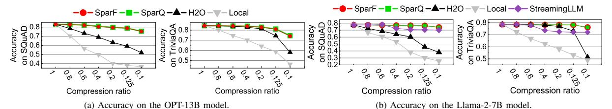
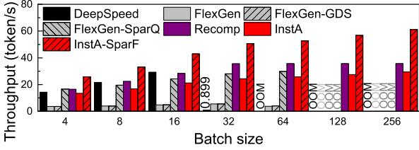
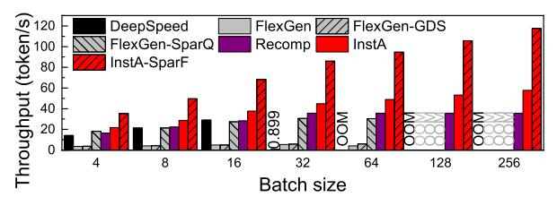

# *C. Throughput Evaluation*

Performance with 1 SSD (CSD). Figure 14 illustrates the end-to-end throughput of different platforms with 1 SSD(CSD) on OPT-13B. DeepSpeed leverages host memory for KV

Fig. 13: Accuracy of different sparsity methods.

Fig. 14: Throughput of LLM systems: 1-SSD@OPT-13B.

cache offloading, which owns a larger bandwidth and thereby outperforms other dense schemes when batch size is small (4-16). However, it quickly exceeds the available host memory at bs=32 and incurs the kernel swapping to SSDs, which results in a 32.6× throughput degradation compared with bs=16. FlexGen supports up to bs=64 but delivers much lower throughput due to the SSD-offloading with larger capacity but limited PCIe bandwidth. Note that the OOM error occurs at bs=128 despite the substantial SSD capacity. This is because the intermediate KV cache during the prefilling phase exceeds the available GPU VRAM. FlexGen-GDS gets negligible performance improvement over the original FlexGen, because the original GPU-Direct Storage provided by CUDA [48] still relies on host filesystem to manage data on the SSD.

In contrast, InstA bypasses the host filesystem, enabling direct access to the KV cache on InstCSD. InstA also leverages a layerwise transmission of the KV cache during the prefilling phase, which significantly reduces the VRAM buffer requirement for the intermediate KV caches. Therefore, InstA supports much larger batch sizes, and addresses the bandwidth challenges in traditional offloading systems, thereby outperforming FlexGen by  $6.85 \times$  at bs=64. InstA shows the best scalability as batch size increases. Note that InstA only outperforms the maximal achievable throughput of DeepSpeed (at bs=16) by 4.6%, because the CSD internal bandwidth (11.2GB/s) is still lower than the PCIe bandwidth between GPU and host memory (32GB/s). InstA-SparF effectively reduces the demanding KV cache volume, which further improves the throughput of original InstA by up to 2.08× at bs=256, outperforming the baseline FlexGen by up to 11.1×. Lastly, Recomp achieves the best performance at small batch sizes. Nevertheless, for large batch sizes, InstA-SparF still outperforms Recomp by up to 71.3% (at bs=256). Recomp is limited by enormous KV cache recomputation on large batches, and incompatible with sparse KV cache techniques such as SparF.

Performance with 2 SSDs (CSDs). Figure 15 further presents

Fig. 15: Throughput of LLM systems: 2-SSD@OPT-13B.

the throughput with 2 SSDs(CSDs). We observe that traditional offloading schemes exhibit negligible performance improvement despite larger PCIe bandwidth aggregated by multiple SSDs. This is because these schemes rely on the host filesystem to manage KV cache on the SSD, which puts a heavy burden on the data transmission between GPU and SSD. InstA addresses this issue through two approaches. On the one hand, the optimized P2PDMA transmission between GPU and CSDs bypasses the host; on the other hand, most of the KV cache transmission occurs within the CSD through the internal flash channels, which can be easily scaled up through multiple CSDs. Therefore, InstA (at bs=256) outperform maximal achievable throughput of FlexGen (at bs=32) by 10.5×, and InstA-SparF (at bs=256) outperforms FlexGen-SparQ (at bs=32) by 3.11×, respectively.

Performance on other models. To illustrate the potential and scalability of InstAttention, we further evaluate the OPT-30B and Llama-2-13B models, as shown in Figures 16 and 17, respectively. For OPT-30B, InstA and InstA-SparF (at bs=128) outperform FlexGen (at bs=8) by up to 4.09× and 9.39×, respectively, exhibiting performance advantages similar to the 13B model. For the Llama-2-13B model with 4K context, InstA and InstA-SparF (at bs=128) outperform FlexGen (at bs=16) by up to 5.68× and 12.48×. Note that Recomp also shows obvious performance advantages, outperforming FlexGen by up to 9.26×. Nevertheless, since InstAttention adopts the bandwidth-efficient sparsity mechanism and can be further enhanced by aggregating multiple CSDs (cf. Figures 15 and 20a), thereby showing greater potential in offline long-context inference.

