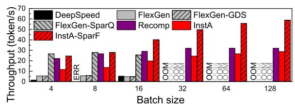
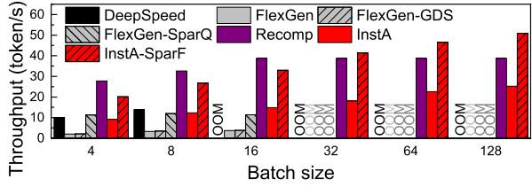
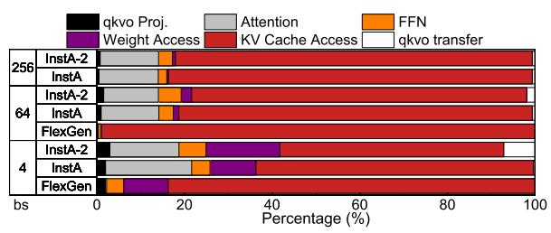
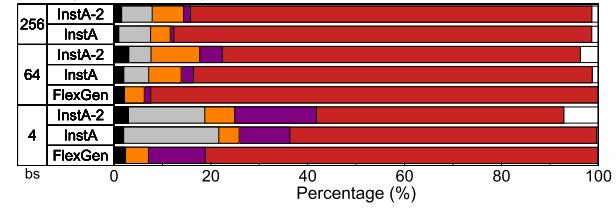
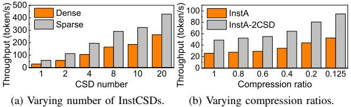
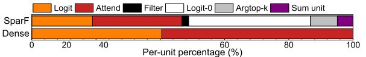
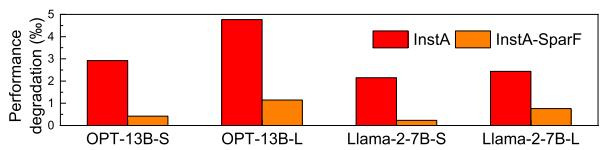
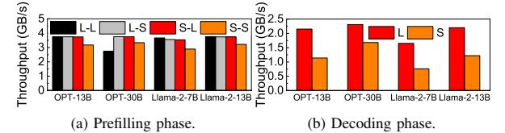

# D. Latency Breakdown

**Decoding Latency Analysis.** Figure 18 and 19 depicts the normalized latency breakdown during the decoding phase of different LLM systems, respectively, where InstA-2 InstAttention with 2 CSDs. Both sparse (1/8) and dense attention are evaluated, with small (bs=4), middle (bs=64), and large batch size (bs=256) scenarios. We observe that the KV cache

Fig. 16: Throughput of LLM systems: OPT-30B.

Fig. 17: Throughput of LLM systems: Llama-2-13B.

access is the primary bottleneck across all the scenarios and systems, considering the extremely low arithmetic intensity of the attention computation. Nevertheless, compared with FlexGen at bs=64, InstA and InstA-2 still reduce the KV cache access percentage from 98.9% to 80.7% and 76.4% in dense inference, and from 92.4% to 82.3% and 74.0% with sparsity, respectively. To further alleviate the bottleneck, it is promising to scale up to more CSDs or flash channels.

**SparF Attention Engine Analysis.** We dive into the SparF Attention engine in InstCSD to analyze the normalized overheads of each unit, as illustrated in Figure 21. Compared with dense attention computation, the primary difference lies in that SparF introduces an additional Logit-0 process, corresponding to the step 4 in Algorithm 1. The extra logit computation further helps identify the sparsity within the sequences, which finally delivers the overall performance improvement.

### E. Scalability And Sensitivity Tests

**Scalability with More CSDs.** We further evaluate the scalability of InstAttention with more CSDs in terms of both dense

Fig. 18: Latency breakdown of dense LLM inference.

Fig. 19: Latency breakdown of sparse LLM inference.

Fig. 20: Throughput with varying configurations.

Fig. 21: Latency breakdown of the SparF Attention engine.

inference and 1/8-sparsity at bs=256, as depicted in Figure 20a respectively. Since traditional KV cache-offloading systems with SSDs show negligible performance improvements scaling with SSD number, we omit them in the Figure. Compared with 1-CSD configuration, 20 CSDs can improve the dense and sparse inference throughput by 8.99× and 7.29×, respectively. The head-level parallelism is employed among multiple CSDs, which is suitable for InstAttention because only the critical attention computation and KV cache are offloaded. As these computations and data are inherently parallel and have no dependency, the scaling up can be quite straightforward by assigning attention heads to multiple CSDs. Therefore, both the dense and sparse (with SparF) InstA show good scalability with an increasing number of CSDs.

Sensitivity with Varying Sparsity. Figure 20b shows the throughput of InstA with 1 or 2 CSDs under different compression ratios with SparF Attention, respectively. We observe that although a larger compression ratio leads to more random fine-grained access to KV cache on the flash chips, which is typically a challenge for SSDs, InstAttention efficiently benefits from larger compression ratios due to the efficient dual-step loading mechanism of SparF Attention.

## F. Overhead Analysis

Endurance Analysis. Although InstAttention involves a substantial amount of KV cache writing to flash, potentially causing severe endurance issues, we contend that modern SSDs are capable of prolonged inference tasks. We use the V-NAND V6 NAND flash as a reference model, which is the NAND chip utilized in the Samsung 980 Pro SSD, featuring 3,000 P/E cycles [55]. Note that the assumed theoretical endurance is larger than the original 980 Pro model, which is attributed to the simplified FTL of InstAttention to avoid extra GC or wearleveling processes. This minimizes write amplifications and thereby contributes to the optimal endurance of flash chips. Therefore, for an InstAttention instance equipped with four dedicated CSDs and targeting a 13B model, which generates approximately 0.78MB of KV cache per token, the system can accommodate 32,263,877K tokens. Furthermore, given that KV caches represent intermediate activation data that are either discarded or refreshed shortly, reducing the NAND flash retention time from the typical three years to three weeks-which is adequate for LLM inference tasks-would

Fig. 22: Degradation with the worst read-retry (%).

Fig. 23: Writing performance of InstCSD in different phases.

increase the endurance (i.e., P/E cycles) by a factor of approximately  $6.67 \times$ , as indicated by prior studies [1], [7], [41]. Consequently, assuming a user with extremely high-intensity use of LLM inference service consumes 128K tokens per day, the actual serving capacity could accommodate at least 920 extreme users over five years, 1530 users over three years, or 4600 users over one year. Considering that typical commercial SSDs provide a warranty period ranging from 3 years to 5 years [7], this serving capacity is sufficient for a resource-constrained LLM server.

Considering the possible read-retry exacerbation due to the reduced  $V_{TH}$  margin [51] for modern TLC-based SSDs, the recent research has revealed promising advancements in this area. To be specific, by modeling the characteristics of flash chips and predicting the optimal read voltage offset, the state-of-the-art approaches [73] can establish a dynamic read retry table for NAND flash, which has been demonstrated to achieve near-zero read retries. Therefore, based on this study, we assessed the performance of InstAttention under various workloads by taking the read retry statistics (up to 5 retries for a single page read request, average 0.003 retries) in the worst case (i.e., after 8K P/E cycles and 10 days of baking at 85°C) from the prior work [73] as the estimated value for InstCSD after retention relaxation. We further tested the performance of InstAttention across various workloads after the worstcase-based read retry scenario, as illustrated in Figure 22. The -S or -L tag represents inference with Small batch size (4) or Large batch size (64). The experimental results indicated that the performance degradation of InstAttention was limited to a maximum of 4.7%, and InstA-SparF shows more negligible penalty due to less KV cache reading from flash chips. These findings suggest that, for InstCSD, leveraging retention relaxation to trade retention time for enhanced endurance is a feasible approach.

SSD IO Analysis. Although NAND flash exhibits significantly worse writing performance compared to reading one, we contend that in the InstAttention architecture, writing requests have a minimal impact on performance penalties during long-context LLM serving. Table III details the accumulated I/O volume transferred between InstGPU and InstCSDs, which are collected from evaluations on the OPT-13B model at a batch size of 64. The data read during the decoding phase is

|                  | IO volumes (GB) | Throughput (GB/s) |
|------------------|-----------------|-------------------|
| Prefilling read  | 0               | 0                 |
| Prefilling write | 1.34            | 3.78              |
| Decoding read    | 1085.65         | 7.66              |
| Decoding write   | 1.93            | 2.15              |

TABLE III: IO on OPT-13B to InstCSD during inference.

approximately  $810\times$  and  $560\times$  greater than the data written during the prefilling and decoding phases, respectively. This considerable reading traffic stems from the repetitive decoding process, where each token generation necessitates reading all existing KV caches from the NAND flash.

We further conduct more detailed analysis on the writing performance of InstCSD with diverse workloads, as illustrated in Figure 23a and Figure 23b for prefilling and decoding phase, respectively. For prefilling phase, we tested both large (64) or small (4) batch sizes (represented by the first L/S tag in the figure), and long (2K) or short (128) sequences (represented by the second L/S tag). For decoding phase, as the writing granularity is always one token, we only tested different batch sizes. In most cases except OPT-30B L-L, the writing data volume is relatively minor and can be buffered by the InstCSD internal DRAM. Therefore, the poor writing speed of NAND flash does not compromise the overall system performance. For decoding phase, the writing performance shows a slight degradation due to the small writing granularity (1 token). Considering the small writing traffic volume, the overall performance penalty is still negligible. These observations indicate that the primary I/O overhead is attributed to reading during the decoding phase, whereas the impact of writing on LLM inference performance is minimum.

## VII. RELATED WORKS AND DISCUSSION

PIM-Based Transformer Acceleration. Several works [11], [20], [67], [81] explore Processing-In-Memory techniques to address the storage and bandwidth bottleneck of LLM inference, which integrate computing units within the memory cells for the memory-bound attention computation. However, these works are all based on simulators, considering that PIM devices are still expensive and far from being widely deployed in practice, especially for resource-constrained scenarios. In contrast, InstAttention is deployed in real hardware, adopting economical CSDs as a more cost-effective and scalable solution to address the storage and bandwidth challenges.

High-bandwidth Chip Interconnect Solution. Prior works such as the Nvidia GH (Grace-Hopper) chip [13] feature high-bandwidth inter-chip interconnect between GPU and CPU to address the LLM bandwidth limitation. However, compared with InstAttention, GH chips are cost-prohibitive at about \$30,000 in contrast to the more affordable CSDs like Samsung's SmartSSD at approximately \$1500 [58], limiting their use in resource-constrained scenarios. Moreover, GH chips support a maximum of 624GB of fast-access memory, insufficient for extensive KV cache demands for scenarios such as multi-turn conversations or memorization. Therefore, we believe both GH chip and InstAttention contribute to boosting long-context LLM inference from different aspects

(i.e., throughput and capacity). Combining GH chips with InstAttention could be a promising solution in the future.

Optimizations For KV Cache Management. vLLM [32] manages KV cache in GPU VRAM and host memory in block-granularity, which takes inspiration from the virtual memory mechanism, to reduce the overhead of fragmentation. LMDeploy [25] and CachedAttention [16] focus on managing KV caches on the host memory and SSDs to reduce the recomputation overheads in multi-turn conversations. These works aim to optimize the prefilling phase in online inference scenarios. However, they are not suitable for inference with long output sequences. Other solutions [19], [33], [52], [53], [80] leverage disaggregated resources (i.e., GPU, CPU and memory pools) to store the KV cache and accelerate longcontext LLM inference, which are not suitable for resourceconstrained scenarios. InstAttention leverages cost-effective CSDs, which are more applicable and effectively address the decoding-phase bottleneck of KV cache.

**Insights For Non-CSD System.** Although InstAttention is primarily designed to offload KV cache and attention to CSDs, traditional non-CSD systems can still benefit from InstAttention. With a specifically calibrated KV cache management system on the host CPU to reduce random and small accesses to the SSDs, we believe a host-side SparF engine can also boost the inference performance with SSD-based offloading.

#### VIII. CONCLUSION

In this work, we introduced InstAttention, a novel CSD-based LLM offline inference system to address the substantial storage and bandwidth challenges associated with KV caches in a cost-effective approach. By offloading the critical decoding-phase attention and KV cache to CSDs with flash-aware designs, InstAttention exploits high channel bandwidth of flash chips, circumventing the limitations imposed by external PCIe bandwidth. Our evaluation shows that InstAttention outperforms current SSD-offloading systems by up to  $11.1\times$  for long-context inference in resource-constrained scenarios.

#### ACKNOWLEDGMENT

We sincerely thank the anonymous shepherd and reviewers for their insightful comments and feedback. This work is mainly supported by the National Key Research and Development Program of China under Grant No. 2023YFB4502702 and the National Natural Science Foundation of China under Grant No. 62332021 and 62472007. Dr. Li is partly supported by the National Natural Science Foundation of China under Grant No. 62202396. Dr. Liang is supported in part by the National Natural Science Foundation of China under Grant No. 62202453. Dr. Luo is partly supported by the National Natural Science Foundation of China under Grant No. 62032001. Dr. Jie Zhang is affiliated with School of Computer Science at Peking University and Zhongguancun Laboratory, and is the corresponding author.

#### REFERENCES

- [1] "Optimizing NAND Flash-Based SSDs via retention relaxation," in 10th USENIX Conference on File and Storage Technologies (FAST 12). San Jose, CA: USENIX Association, Feb. 2012. [Online]. Available: https://www.usenix.org/conference/fast12/optimizing-nand-flash-based-ssds-retention-relaxation
- [2] J. Achiam, S. Adler, S. Agarwal, L. Ahmad, I. Akkaya, F. L. Aleman, D. Almeida, J. Altenschmidt, S. Altman, S. Anadkat *et al.*, "Gpt-4 technical report," *arXiv preprint arXiv:2303.08774*, 2023.
- [3] A. Agrawal, N. Kedia, A. Panwar, J. Mohan, N. Kwatra, B. Gulavani, A. Tumanov, and R. Ramjee, "Taming {Throughput-Latency} tradeoff in {LLM} inference with {Sarathi-Serve}," in 18th USENIX Symposium on Operating Systems Design and Implementation (OSDI 24), 2024, pp. 117–134.
- [4] N. Agrawal, V. Prabhakaran, T. Wobber, J. D. Davis, M. Manasse, and R. Panigrahy, "Design tradeoffs for {SSD} performance," in 2008 USENIX Annual Technical Conference (USENIX ATC 08), 2008.
- [5] K. Alizadeh, I. Mirzadeh, D. Belenko, K. Khatamifard, M. Cho, C. C. Del Mundo, M. Rastegari, and M. Farajtabar, "Llm in a flash: Efficient large language model inference with limited memory," arXiv preprint arXiv:2312.11514, 2023.
- [6] R. Y. Aminabadi, S. Rajbhandari, A. A. Awan, C. Li, D. Li, E. Zheng, O. Ruwase, S. Smith, M. Zhang, J. Rasley et al., "Deepspeed-inference: enabling efficient inference of transformer models at unprecedented scale," in SC22: International Conference for High Performance Computing, Networking, Storage and Analysis. IEEE, 2022, pp. 1–15.
- [7] Y. Cai, G. Yalcin, O. Mutlu, E. F. Haratsch, A. Cristal, O. S. Unsal, and K. Mai, "Flash correct-and-refresh: Retention-aware error management for increased flash memory lifetime," in 2012 IEEE 30th International Conference on Computer Design (ICCD), 2012, pp. 94–101.
- [8] W. Cao, Y. Liu, Z. Cheng, N. Zheng, W. Li, W. Wu, L. Ouyang, P. Wang, Y. Wang, R. Kuan et al., "{POLARDB} meets computational storage: Efficiently support analytical workloads in {Cloud-Native} relational database," in 18th USENIX conference on file and storage technologies (FAST 20), 2020, pp. 29–41.
- [9] S. Chaudhari, V. Mithal, G. Polatkan, and R. Ramanath, "An attentive survey of attention models," ACM Transactions on Intelligent Systems and Technology (TIST), vol. 12, no. 5, pp. 1–32, 2021.
- [10] B. Chen, T. Dao, E. Winsor, Z. Song, A. Rudra, and C. Ré, "Scatterbrain: Unifying sparse and low-rank attention," *Advances in Neural Information Processing Systems*, vol. 34, pp. 17413–17426, 2021.
- [11] J. Choi, J. Park, K. Kyung, N. S. Kim, and J. H. Ahn, "Unleashing the potential of pim: Accelerating large batched inference of transformerbased generative models," *IEEE Computer Architecture Letters*, 2023.
- [12] P. Desnoyers, "Analytic modeling of ssd write performance," in Proceedings of the 5th Annual International Systems and Storage Conference, 2012, pp. 1–10.
- [13] A. C. Elster and T. A. Haugdahl, "Nvidia hopper gpu and grace cpu highlights," Computing in Science & Engineering, vol. 24, no. 2, pp. 95–100, 2022.
- [14] N. Express, "Nvm express base specification 2.0d." [Online]. Available: https://nvmexpress.org/wp-content/uploads/NVM-Express-Base-Specification-2.0d-2024.01.11-Ratified.pdf
- [15] Y. Fu, L. Xue, Y. Huang, A.-O. Brabete, D. Ustiugov, Y. Patel, and L. Mai, "{ServerlessLLM}:{Low-Latency} serverless inference for large language models," in 18th USENIX Symposium on Operating Systems Design and Implementation (OSDI 24), 2024, pp. 135–153.
- [16] B. Gao, Z. He, P. Sharma, Q. Kang, D. Jevdjic, J. Deng, X. Yang, Z. Yu, and P. Zuo, "{Cost-Efficient} large language model serving for multi-turn conversations with {CachedAttention}," in 2024 USENIX Annual Technical Conference (USENIX ATC 24), 2024, pp. 111–126.
- [17] G. Haas and V. Leis, "What modern nyme storage can do, and how to exploit it: high-performance i/o for high-performance storage engines," *Proceedings of the VLDB Endowment*, vol. 16, no. 9, pp. 2090–2102, 2023.
- [18] A. Hadian and T. Heinis, "Towards batch-processing on cold storage devices," in 2018 IEEE 34th International Conference on Data Engineering Workshops (ICDEW). IEEE, 2018, pp. 134–139.
- [19] J. He and J. Zhai, "Fastdecode: High-throughput gpu-efficient llm serving using heterogeneous pipelines," arXiv preprint arXiv:2403.11421, 2024

- [20] G. Heo, S. Lee, J. Cho, H. Choi, S. Lee, H. Ham, G. Kim, D. Mahajan, and J. Park, "Neupims: Npu-pim heterogeneous acceleration for batched llm inferencing," in Proceedings of the 29th ACM International Conference on Architectural Support for Programming Languages and Operating Systems, Volume 3, 2024, pp. 722-737.
- [21] C. Holmes, M. Tanaka, M. Wyatt, A. A. Awan, J. Rasley, S. Rajbhandari, R. Y. Aminabadi, H. Qin, A. Bakhtiari, L. Kurilenko et al., "Deepspeedfastgen: High-throughput text generation for llms via mii and deepspeedinference," arXiv preprint arXiv:2401.08671, 2024.
- [22] K. Hong, G. Dai, J. Xu, Q. Mao, X. Li, J. Liu, Y. Dong, Y. Wang et al., "Flashdecoding++: Faster large language model inference with asynchronization, flat gemm optimization, and heuristics," Proceedings of Machine Learning and Systems, vol. 6, pp. 148-161, 2024.
- [23] J.-W. Hsieh, H.-Y. Lin, and D.-L. Yang, "Multi-channel architecturebased ftl for reliable and high-performance ssd," IEEE Transactions on Computers, vol. 63, no. 12, pp. 3079-3091, 2013.
- [24] X.-Y. Hu, E. Eleftheriou, R. Haas, I. Iliadis, and R. Pletka, "Write amplification analysis in flash-based solid state drives," in Proceedings of SYSTOR 2009: The Israeli Experimental Systems Conference, 2009, pp. 1-9.
- [25] InternLM, "Lmdeploy." [Online]. Available: https://github.com/ InternLM/Imdeploy
- [26] H. Jin, X. Han, J. Yang, Z. Jiang, Z. Liu, C.-Y. Chang, H. Chen, and X. Hu, "Llm maybe longlm: Self-extend llm context window without tuning," arXiv preprint arXiv:2401.01325, 2024.
- [27] M. Joshi, E. Choi, D. S. Weld, and L. Zettlemoyer, "Triviaqa: A large scale distantly supervised challenge dataset for reading comprehension," in Proceedings of the 55th Annual Meeting of the Association for Computational Linguistics. Vancouver, Canada: Association for Computational Linguistics, July 2017.
- [28] J. Juravsky, B. Brown, R. Ehrlich, D. Y. Fu, C. Ré, and A. Mirhoseini, "Hydragen: High-throughput llm inference with shared prefixes," arXiv preprint arXiv:2402.05099, 2024.
- [29] S.-H. Kim, J. Shim, E. Lee, S. Jeong, I. Kang, and J.-S. Kim, '{NVMeVirt}: A versatile software-defined virtual {NVMe} device,' in 21st USENIX Conference on File and Storage Technologies (FAST 23), 2023, pp. 379-394.
- [30] G. Koo, K. K. Matam, T. I, H. K. G. Narra, J. Li, H.-W. Tseng, S. Swanson, and M. Annavaram, "Summarizer: trading communication with computing near storage," in Proceedings of the 50th Annual IEEE/ACM International Symposium on Microarchitecture, 2017, pp. 219-231
- [31] J. Kwak, S. Lee, K. Park, J. Jeong, and Y. H. Song, "Cosmos+ openssd: Rapid prototype for flash storage systems," ACM Transactions on Storage (TOS), vol. 16, no. 3, pp. 1-35, 2020.
- [32] W. Kwon, Z. Li, S. Zhuang, Y. Sheng, L. Zheng, C. H. Yu, J. Gonzalez, H. Zhang, and I. Stoica, "Efficient memory management for large language model serving with pagedattention," in Proceedings of the 29th Symposium on Operating Systems Principles, 2023, pp. 611-626.
- [33] W. Lee, J. Lee, J. Seo, and J. Sim, "InfiniGen: Efficient generative inference of large language models with dynamic KV cache management," in 18th USENIX Symposium on Operating Systems Design and Implementation (OSDI 24). Santa Clara, CA: USENIX Association, Jul. 2024, pp. 155-172. [Online]. Available: https: //www.usenix.org/conference/osdi24/presentation/lee
- [34] Y. Lee, J. Chung, and M. Rhu, "Smartsage: training large-scale graph neural networks using in-storage processing architectures," in Proceedings of the 49th Annual International Symposium on Computer Architecture, 2022, pp. 932-945.
- [35] Y. Li, H. Wen, W. Wang, X. Li, Y. Yuan, G. Liu, J. Liu, W. Xu, X. Wang, Y. Sun et al., "Personal Ilm agents: Insights and survey about the capability, efficiency and security," arXiv preprint arXiv:2401.05459,
- [36] S. Liang, Y. Wang, Y. Lu, Z. Yang, H. Li, and X. Li, "Cognitive {SSD}: A deep learning engine for {In-Storage} data retrieval," in 2019 USENIX Annual Technical Conference (USENIX ATC 19), 2019, pp. 395-410.
- [37] B. Lin, T. Peng, C. Zhang, M. Sun, L. Li, H. Zhao, W. Xiao, Q. Xu, X. Qiu, S. Li et al., "Infinite-Ilm: Efficient Ilm service for long context with distattention and distributed kycache," arXiv preprint arXiv:2401.02669, 2024.
- [38] Z. Liu, A. Desai, F. Liao, W. Wang, V. Xie, Z. Xu, A. Kyrillidis, and A. Shrivastava, "Scissorhands: Exploiting the persistence of importance hypothesis for llm kv cache compression at test time," Advances in Neural Information Processing Systems, vol. 36, 2024.

- [39] Z. Liu, J. Wang, T. Dao, T. Zhou, B. Yuan, Z. Song, A. Shrivastava, C. Zhang, Y. Tian, C. Re et al., "Deja vu: Contextual sparsity for efficient llms at inference time," in International Conference on Machine Learning. PMLR, 2023, pp. 22137-22176.
- [40] W. Luk, K. F. C. Yiu, R. Li, K. Mishchenko, S. I. Venieris, H. Fan et al., "Hardware-aware parallel prompt decoding for memory-efficient acceleration of llm inference," arXiv preprint arXiv:2405.18628, 2024.
- [41] Y. Luo, Y. Cai, S. Ghose, J. Choi, and O. Mutlu, "Warm: Improving nand flash memory lifetime with write-hotness aware retention management," in 2015 31st Symposium on Mass Storage Systems and Technologies (MSST). IEEE, 2015, pp. 1-14.
- [42] N. Mansouri Ghiasi, J. Park, H. Mustafa, J. Kim, A. Olgun, A. Gollwitzer, D. Senol Cali, C. Firtina, H. Mao, N. Almadhoun Alserr et al., "Genstore: A high-performance in-storage processing system for genome sequence analysis," in Proceedings of the 27th ACM International Conference on Architectural Support for Programming Languages and Operating Systems, 2022, pp. 635-654.
- [43] B. Mao, S. Wu, and L. Duan, "Improving the ssd performance by exploiting request characteristics and internal parallelism," IEEE Transactions on Computer-Aided Design of Integrated Circuits and Systems, vol. 37, no. 2, pp. 472-484, 2017.
- [44] J. Markussen, L. B. Kristiansen, P. Halvorsen, H. Kielland-Gyrud, H. K. Stensland, and C. Griwodz, "Smartio: Zero-overhead device sharing through pcie networking," ACM Transactions on Computer Systems, vol. 38, no. 1-2, jul 2021.
- [45] mindchain, "Wiki-text-2 dataset." [Online]. Available: https: //huggingface.co/datasets/mindchain/wikitext2
- [46] K. Myung, S. Kim, H. Y. Yeom, and J. Park, "Efficient and scalable ex-ternal sort framework for nyme ssd," *IEEE Transactions on Computers*, vol. 70, no. 12, pp. 2211-2217, 2020.
- [47] E. Nijkamp, B. Pang, H. Hayashi, L. Tu, H. Wang, Y. Zhou, S. Savarese, and C. Xiong, "Codegen: An open large language model for code with multi-turn program synthesis," in International Conference on Learning Representations, 2022. [Online]. Available: https://api.semanticscholar.org/CorpusID:252668917 [48] NVIDIA, "Gpudirect rdma." [Online]. Available: http://docs.nvidia.
- com/cuda/gpudirect-rdma/index.html
- [49] NVIDIA, "Nvidia rtx a6000 graphics card." [Online]. Available: https://www.nvidia.com/en-us/design-visualization/rtx-a6000/
- [50] X. Pan, Y. An, S. Liang, B. Mao, M. Zhang, Q. Li, M. Jung, and J. Zhang, "Flagger: Cooperative acceleration for large-scale cross-silo federated learning aggregation," in Proceedings of the 51th Annual International Symposium on Computer Architecture, 2024, pp. 915–930.
- [51] J. Park, M. Kim, M. Chun, L. Orosa, J. Kim, and O. Mutlu, "Reducing solid-state drive read latency by optimizing read-retry," in Proceedings of the 26th ACM International Conference on Architectural Support for Programming Languages and Operating Systems, 2021, pp. 702-716.
- [52] P. Patel, E. Choukse, C. Zhang, A. Shah, Í. Goiri, S. Maleki, and R. Bianchini, "Splitwise: Efficient generative Ilm inference using phase splitting," Power, vol. 400, no. 700W, pp. 1-75, 2023.
- [53] R. Qin, Z. Li, W. He, M. Zhang, Y. Wu, W. Zheng, and X. Xu, "Mooncake: Kimi's kvcache-centric architecture for llm serving," arXiv preprint arXiv:2407.00079, 2024.
- [54] L. Ribar, I. Chelombiev, L. Hudlass-Galley, C. Blake, C. Luschi, and D. Orr, "Sparq attention: Bandwidth-efficient llm inference," arXiv preprint arXiv:2312.04985, 2023.
- [55] Samsung, "Samsung 980pro nvme ssd." [Online]. https://www.samsung.com/us/computing/memory-storage/solidstate-drives/980-pro-pcie-4-0-nvme-ssd-1tb-mz-v8p1t0b-am/
- [56] ShareGPT. [Online]. Available: https://sharegpt.com/
- [57] Y. Sheng, L. Zheng, B. Yuan, Z. Li, M. Ryabinin, B. Chen, P. Liang, C. Ré, I. Stoica, and C. Zhang, "Flexgen: High-throughput generative inference of large language models with a single gpu," in International Conference on Machine Learning. PMLR, 2023, pp. 31094-31116.
- [58] M. Soltaniyeh, V. Lagrange Moutinho Dos Reis, M. Bryson, X. Yao, R. P. Martin, and S. Nagarakatte, "Near-storage processing for solid state drive based recommendation inference with smartssds®," in Proceedings of the 2022 ACM/SPEC on International Conference on Performance Engineering, 2022, pp. 177-186.
- [59] Stanford, "Squad dataset." [Online]. Available: https://rajpurkar.github. io/SQuAD-explorer/
- [60] C. Technology, "Daisplus openssd." [Online]. Available: https: //www.crz-tech.com/crz/article/DaisyPlus/

- [61] H. Touvron, T. Lavril, G. Izacard, X. Martinet, M.-A. Lachaux, T. Lacroix, B. Rozière, N. Goyal, E. Hambro, F. Azhar et al., "Llama: Open and efficient foundation language models," arXiv preprint arXiv:2302.13971, 2023.
- [62] A. Vaswani, N. Shazeer, N. Parmar, J. Uszkoreit, L. Jones, A. N. Gomez, Ł. Kaiser, and I. Polosukhin, "Attention is all you need," Advances in neural information processing systems, vol. 30, 2017.
- [63] W. Wang, Z. Chen, X. Chen, J. Wu, X. Zhu, G. Zeng, P. Luo, T. Lu, J. Zhou, Y. Qiao et al., "Visionllm: Large language model is also an open-ended decoder for vision-centric tasks," Advances in Neural Information Processing Systems, vol. 36, 2024.
- [64] Y. Wang, Z. Zhang, and R. Wang, "Element-aware summarization with large language models: Expert-aligned evaluation and chain-of-thought method," in *Annual Meeting of the Association for Computational Linguistics*, 2023. [Online]. Available: https://api.semanticscholar.org/ CorpusID:258841145
- [65] Y. Wang, Y. Chen, Z. Li, Z. Tang, R. Guo, X. Wang, Q. Wang, A. C. Zhou, and X. Chu, "Towards efficient and reliable llm serving: A real-world workload study," arXiv preprint arXiv:2401.17644, 2024.
- [66] Y. Wang, X. Pan, Y. An, J. Zhang, and G. Reinman, "Beacongnn: Large-scale gnn acceleration with out-of-order streaming in-storage computing," in 2024 IEEE International Symposium on High-Performance Computer Architecture (HPCA). IEEE, 2024, pp. 330–344.
- [67] Y. Wu, Z. Wang, and W. D. Lu, "Pim gpt a hybrid process in memory accelerator for autoregressive transformers," npj Unconventional Computing, vol. 1, no. 1, p. 4, 2024.
- [68] G. Xiao, Y. Tian, B. Chen, S. Han, and M. Lewis, "Efficient streaming language models with attention sinks," arXiv preprint arXiv:2309.17453, 2023
- [69] Xilinx, "Xilinx zynq 7000-series soc." [Online]. Available: https://www.amd.com/en/products/adaptive-socs-and-fpgas/soc/zynq-7000.html
- [70] M. Xu, D. Niyato, H. Zhang, J. Kang, Z. Xiong, S. Mao, and Z. Han, "Cached model-as-a-resource: Provisioning large language model agents for edge intelligence in space-air-ground integrated networks," arXiv preprint arXiv:2403.05826, 2024.
- [71] J. Yang, H. Jin, R. Tang, X. Han, Q. Feng, H. Jiang, S. Zhong, B. Yin, and X. Hu, "Harnessing the power of llms in practice: A survey on chatgpt and beyond," *ACM Trans. Knowl. Discov. Data*, vol. 18, no. 6, apr 2024. [Online]. Available: https://doi.org/10.1145/3649506
- [72] Z. Yang, Y. Lu, X. Liao, Y. Chen, J. Li, S. He, and J. Shu, "{λ-IO}: A unified {IO} stack for computational storage," in 21st USENIX Conference on File and Storage Technologies (FAST 23), 2023, pp. 347–362.
- [73] M. Ye, Q. Li, Y. Lv, J. Zhang, T. Ren, D. Wen, T.-W. Kuo, and C. J. Xue, "Achieving near-zero read retry for 3d nand flash memory," in Proceedings of the 29th ACM International Conference on Architectural Support for Programming Languages and Operating Systems, Volume 2, 2024, pp. 55–70.
- [74] W. Yin, M. Xu, Y. Li, and X. Liu, "Llm as a system service on mobile devices," arXiv preprint arXiv:2403.11805, 2024.
- [75] Z. Yuan, Y. Shang, Y. Zhou, Z. Dong, C. Xue, B. Wu, Z. Li, Q. Gu, Y. J. Lee, Y. Yan et al., "Llm inference unveiled: Survey and roofline model insights," arXiv preprint arXiv:2402.16363, 2024.
- [76] J. Zhang and M. Jung, "Zng: Architecting gpu multi-processors with new flash for scalable data analysis," in 2020 ACM/IEEE 47th Annual International Symposium on Computer Architecture (ISCA). IEEE, 2020, pp. 1064–1075.
- [77] M. Zhang, J. Cao, X. Shen, and Z. Cui, "Edgeshard: Efficient llm inference via collaborative edge computing," arXiv preprint arXiv:2405.14371, 2024.
- [78] S. Zhang, S. Roller, N. Goyal, M. Artetxe, M. Chen, S. Chen, C. Dewan, M. Diab, X. Li, X. V. Lin et al., "Opt: Open pre-trained transformer language models," arXiv preprint arXiv:2205.01068, 2022.
- [79] Z. Zhang, Y. Sheng, T. Zhou, T. Chen, L. Zheng, R. Cai, Z. Song, Y. Tian, C. Ré, C. Barrett et al., "H2o: Heavy-hitter oracle for efficient generative inference of large language models," Advances in Neural Information Processing Systems, vol. 36, 2024.
- [80] Y. Zhong, S. Liu, J. Chen, J. Hu, Y. Zhu, X. Liu, X. Jin, and H. Zhang, "{DistServe}: Disaggregating prefill and decoding for goodput-optimized large language model serving," in 18th USENIX Symposium on Operating Systems Design and Implementation (OSDI 24), 2024, pp. 193–210.
- [81] M. Zhou, W. Xu, J. Kang, and T. Rosing, "Transpim: A memory-based acceleration via software-hardware co-design for transformer," in

2022 IEEE International Symposium on High-Performance Computer Architecture (HPCA). IEEE, 2022, pp. 1071–1085.