# InstAttention: In-Storage Attention Offloading for Cost-Effective Long-Context LLM Inference

Xiurui Pan\*, Endian Li\*, Qiao Li<sup>†</sup>, Shengwen Liang<sup>‡</sup>,
Yizhou Shan<sup>§</sup>, Ke Zhou<sup>¶</sup>, Yingwei Luo\*, Xiaolin Wang\*, and Jie Zhang\*
Peking University\*, University of Electronic Science and Technology of China<sup>†</sup>,
Institute of Computing Technology, Chinese Academy of Sciences<sup>‡</sup>, Huawei Cloud<sup>§</sup>,
Wuhan National Laboratory for Optoelectronics of Huazhong University of Science and Technology<sup>¶</sup>
https://www.chaselab.wiki

Abstract—The widespread of Large Language Models (LLMs) marks a significant milestone in generative AI. Nevertheless, the increasing context length and batch size in offline LLM inference escalate the memory requirement of the key-value (KV) cache, which imposes a huge burden on the GPU VRAM, especially for resource-constrained scenarios (e.g., edge computing). Several cost-effective solutions leverage host memory or SSDs to reduce storage costs for offline inference scenarios and improve the throughput. Nevertheless, they suffer from significant performance penalties imposed by intensive KV cache accesses due to limited PCIe bandwidth. To address these issues, we propose InstAttention, a novel LLM inference system that offloads the most performance-critical computation (i.e., attention in decoding phase) and data (i.e., KV cache) parts to Computational Storage Drives (CSDs), which minimize the enormous KV transfer overheads. InstAttention designs a dedicated flashaware in-storage attention engine with KV cache management mechanisms to exploit the high internal bandwidths of CSDs instead of being limited by the PCIe bandwidth. The optimized P2P transmission between GPU and CSDs further reduces data migration overheads. Experimental results demonstrate that for a 13B model using an NVIDIA A6000 GPU, InstAttention improves throughput for long-sequence inference by up to  $11.1 \times$ , compared to existing SSD-based solutions such as FlexGen.

## I. INTRODUCTION

Large language models (LLMs) and their underlying transformer architecture have revolutionized AI and have become the bedrock of many emerging applications, widely used in domains such as chatbot [2], summarization [64], and code generation [47]. Most of these LLMs are built based on the transformer architecture [62] with an enormous number of parameters and perform inference in an autoregressive manner consisting of two phases: *prefilling* phase and *decoding* phase.

Previous research [3], [20], [67], [80] indicate that the prefilling phase is compute-bound, while the decoding phase turns memory bound due to its key technique *KV cache*. It stores intermediate key and value tensors from previous tokens, significantly reducing computational complexity by allowing the model to reference past information efficiently without time-consuming recomputations [16], [32]. Considering the computing and bandwidth requirements, leveraging the extensive computing power and large bandwidth of GPU to accelerate LLM inference is the mainstream choice. As illustrated in Figure 1(a), the GPU-only architecture stores

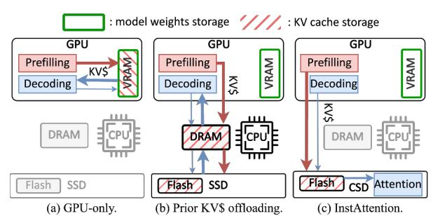

Fig. 1: Comparison of different LLM inference architectures.

all weights and KV caches in the VRAM and leverages the GPU to accelerate both prefilling and decoding phases.

Current LLM inference services can be categorized into online and offline scenarios. Online inference prioritizes low latency and typically accepts shorter sequences from users [15]; whereas offline reasoning usually deals with longer sentences, accepting longer delays in exchange for higher throughput [57]. As LLMs continue to evolve and push the boundaries toward longer context reasoning [26], [37] and larger batches [28], [57], the memory footprint of their associated KV cache in offline-inference escalates drastically [33], introducing substantial challenges in storing them efficiently. The situation gets more severe in resource-constrained scenarios such as edge computing or personal devices [5], [35], [74]. To be specific, the financial burden of deploying additional GPUs to accommodate the expansive KV cache can become exorbitantly high, potentially exceeding even the costs associated with storing the model weights. For instance, a midsized LLM with 13 billion parameters, operating at a batch size of 32 and 4K tokens, necessitates approximately 100GB of KV cache. This volume is  $4.2 \times$  the size of the model itself.

To mitigate the storage costs associated with the KV cache, several approaches (e.g., DeepSpeed-MII [21] and FlexGen [57]) have adopted more economical solutions, which offload the KV cache to host memory or cheaper SSDs for throughput-oriented offline inference, as shown in Figure 1(b). Before the GPU begins the decoding phase of inference, the KV cache is first loaded from SSDs to the memory and then to the GPU via PCIe buses. However, this offloading strategy introduces severe performance penalties. In particular, the PCIe bandwidth

between host memory and GPUs is substantially lower than the bandwidth within GPU VRAM [33], while the bandwidth of SSDs is even lower. Additionally, the lack of direct datapath between the SSD and GPU and the complicated host-oriented storage software stack further exaggerate the performance penalty of SSD-offloading solutions. Unlike the computebound prefilling phase, the memory-bound decoding phase critically depends on KV cache I/O, as it requires frequent transfers of large KV cache volumes between the storage media and GPUs. This dependence makes data movement over a narrow PCIe bus a new performance bottleneck.

To address the storage cost and bandwidth issues associated with KV cache, Computational Storage Drives (CSDs) [34], [42], [72] become a promising and cost-effective solution. Built on modern high-capacity SSDs, CSDs integrate computational resources such as FPGA accelerators internally. They present two advantages: 1) The storage cost of CSDs is comparable to that of SSDs [8], [30]. Unlike the expensive GPU and DRAM, the affordable storage capacity of SSDs can satisfy substantial capacity requirements of KV cache for long-context and large-batch scenarios. 2) Modern SSDs aggregate the throughput of all flash chips to deliver high internal bandwidth (tens of GB/s) [50], [66], [76], which is significantly higher than the external PCIe bandwidth (3∼7 GB/s) [17], [46]. Offloading inference to the computing engines in CSDs allows operands to leverage the high internal bandwidth directly. This bypasses the bandwidth-limited external PCIe bus, thereby meeting the KV cache bandwidth requirements.

Nevertheless, due to power consumption and cost constraints [18], the computational power of CSDs is 2∼3 orders of magnitude weaker than GPUs, making it ineffective to accelerate the entire inference tasks (cf. Section III-B). Instead, CSDs must collaborate with GPUs to accelerate LLM inference as a novel heterogeneous system, which, while seemingly straightforward, presents significant challenges:

- *Coarse task partitioning between the GPU and CSD.* Existing heterogeneous LLM inference solutions typically disaggregate the prefilling and decoding phases [52], [80]. However, considering the much lower computing power of the CSD compared to the GPU, the entire decoding task exceeds the computing capability of the CSD, which becomes a new performance bottleneck.
- *Significant bandwidth gap between CSD and GPU.* Both the external and internal bandwidth of CSD are still much lower than the GPU. For memory-bound decoding phase inference, reducing the data migration overheads remains necessary.
- *Discrepancy between flash and memory access patterns.* NAND flash accesses necessitate page granularity, high access latency, and complex multi-layer address translation mechanisms including the host file system and the flash Translation Layer (FTL) [23]. Therefore, existing KV cache management mechanisms designed for memory (e.g., vLLM [32]) cannot be directly applied within the CSD.

Tackling the aforementioned challenges, we propose *InstAt-*

*tention* <sup>1</sup> , a novel LLM inference system based on in-storage computing and flash-based KV cache offloading, which effectively addresses both storage cost and bandwidth limitations in traditional offline-inference schemes incurred by enormous KV cache volume, as illustrated in Figure 1(c). Specifically, to alleviate the computing burden of CSDs, InstAttention only offloads the most performance-critical *decoding-phase attention* computations during long-context inference to CSDs, while leveraging the GPU to execute the remaining inference tasks. To mitigate the computation power and bandwidth gap between CSD and GPU, InstAttention designs dedicated flash-aware in-storage computation engines with algorithmhardware co-design for attention operators, which effectively lower the computation intensity and KV cache demands. InstAttention further proposes a KV cache-oriented FTL design to enable efficient KV cache access on the flash chips. The GPU and CSDs are directly connected via PCIe peer-to-peer DMA [48], bypassing the host to avoid extra copies. Meanwhile, the works as the control plane, which only manages user requests, task scheduling, and data movement coordination. To the best of our knowledge, InstAttention is the *first work* to exploit *CSDs* to address the performance penalty incurred from KV cache offloading. Experimental results show that for a 13B model with an NVIDIA A6000 GPU [49], the throughput for long-sequence inference is improved by up to 11.1×, compared to FlexGen.

The main contributions of this work are as follows:

- *Pioneering CSD-based or GPU-CSD heterogeneous LLM inference system for long contexts:* Our detailed analysis reveals that the decoding-phase attention is the most critical performance bottleneck due to the restricted PCIe bandwidth to access large KV caches. It exhibits extremely low arithmetic intensity, rendering GPU acceleration ineffective. To address this, InstAttention offloads both KV cache and memoryintensive decoding-phase attention to the CSD, which exploits the high aggregated bandwidth of flash chips. Consequently, the data migration overheads are effectively mitigated by up to 94.0%, while the prefilling phase overheads are further alleviated by the optimized peer-to-peer DMA mechanism.
- *Hardware-algorithm co-designed in-storage attention engine:* To effectively bridge the bandwidth and computation power gap between GPU and CSD, we propose the bandwidthefficient *SparF* algorithm, which not only reduces the computing intensity but also minimizes the required KV cache volume during the decoding-phase attention while maintaining accuracy. Considering the page granularity of flash accesses, InstAttention incorporates a *dual-step loading* strategy to manage the sparsity in the sequence: initially at the page level and subsequently at the token level. We further implement the instorage SparF attention engine in hardware kernels, with finegrained parallelism design to conceal the long access latency of flash chips, thereby improving the inference efficiency.
- *KV cache-oriented FTL design for efficient retrieval:* With

<sup>1</sup> InstAttention is open-sourced and can be accessed at https://github.com/ChaseLab-PKU/InstAttention.

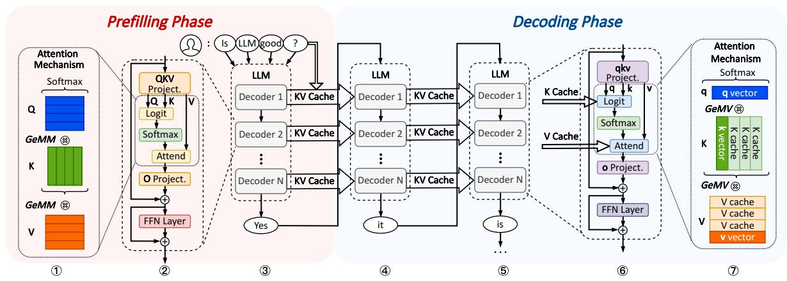

Fig. 2: General architecture of LLM and the inference flow.

the SparF algorithm identifying sparsity patterns in both tokens and channels, the resultant random access to KV caches in the flash chips presents a significant challenge. InstAttention confronts this issue by introducing *dual address mapping* mechanisms tailored for token-indexed and channel-indexed KV caches, respectively. We further meticulously organize KV cache tensors into groups that align with flash page sizes and distribute them across multiple flash blocks and chips in a stridden fashion for each attention head, thus exploiting the inherent high parallelism.

#### II. BACKGROUND

## A. LLM Inference Basics

LLM Architecture. Mainstream Large Language Models (LLMs) predominantly utilize a decoder-only transformer architecture [61], [63], [71], [78]. It primarily comprises multiple decoder blocks, each consisting of a self-attention module and a Feed-Forward Network (FFN) module. As illustrated in blocks 2,3 in Figure 2, for a given sequence of inputs  $X = [x_1, ..., x_s]$ , each decoder block applies linear transformations to X with the parameter matrices, mapping Xinto three embedding matrices: Q, K, and V, through GeMM computations. Subsequently, the attention mechanism [62] is performed to capture the semantic context of the sentence:  $Attention(Q, K, V) = softmax(\frac{QK^T}{\sqrt{d_k}})V$ . To enhance the ability of the vanilla attention mechanism to capture various aspects of the context, the Multi-Head Attention (MHA) [62] further divides the QKV matrices into multiple smaller matrices. This approach allows the model to focus on different parts of the input sequence simultaneously. The resultant attention output is then subjected to a linear transformation via the O matrix and processed by the FFN layer. This output is then fed into the next decoder block as input. After all the decoder blocks, the final predicted token is generated.

**Auto-regressive Inference.** LLM inference leverages an auto-regressive approach [33], consisting of the prefilling phase and the decoding phase (cf. blocks ③~⑤ in Figure 2). During prefilling, the LLM processes all the tokens of the input prompts in parallel to generate the first predicted output token

 $x_{s+1}$ . This token is then appended to the existing input prompt sequence to generate the new input sequence  $[x_1,...,x_s,x_{s+1}]$ . When decoding, the LLM predicts one new output token at a time based on this sequence, and gets the predicted token  $x_{s+2}$ . This process repeats iteratively until an End-of-Sequence token is generated or the model reaches its context limit.

#### B. KV Cache

**Recomputation reduction.** During the decoding phase of LLM inference, the input for each inference step consists of the entire sequence generated so far. Consequently, the attention operation requires repeated calculations of the QKV matrices for all the previous tokens, resulting in a computational complexity of  $O(s^2)$  per iteration [62].

An effective method to alleviate the computational bottleneck in LLM decoding is the KV cache [32] (cf. blocks ® and  $\mathfrak{D}$  in Figure 2). By caching the KV tensors for the generated tokens in the GPU VRAM, redundant calculations can be avoided. Thus, when computing the new attention output, only the KV vectors for the new token need to be calculated. This optimization reduces the attention calculation in each decoding step from GeMM to GeMV, thereby lowering the computational complexity of the attention layer from  $O(s^2)$  to O(s). However, as the context length of LLMs increases, storing the KV cache consumes substantial memory space and imposes high I/O demands during the decoding phase [33]. **Sparse Attention.** To further reduce the memory access demands of attention, sparse attention has become a commonly adopted method [9], [10]. This approach is based on the obser-

demands of attention, sparse attention has become a commonly adopted method [9], [10]. This approach is based on the observation that within a text sequence, the importance of different tokens varies; in a fully connected attention mechanism, some weak connections contribute minimally to the final attention output and can be disregarded. By reducing the number of KV vectors for tokens to be calculated and stored, sparse attention opens up possibilities for decreasing the computational and storage overhead of the KV cache.

Prior works have proposed various sparse attention algorithms [38], [39], [54], [68], [79], among which SparQ Attention [54] is optimized for bandwidth-efficient inference

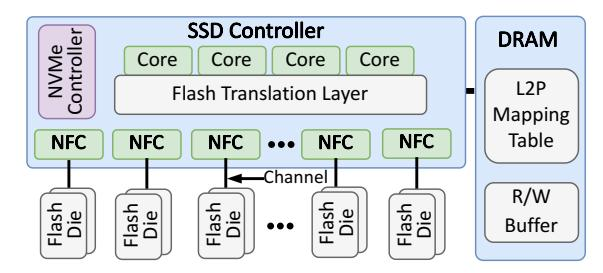

Fig. 3: A typical SSD architecture.

scenarios. Unlike other algorithms that compute the complete attention score, it approximates the score based on the r largest entries in the query (Q) vector. It then identifies the top-kmost important tokens based on the approximated attention score with full hidden embeddings to calculate the attention output. To compensate for the omitted value (V) tensors, the V tensors are weighted and averaged, merging them into the final attention output. On multiple datasets, SparQ Attention reduces the bandwidth requirement for KV cache transmission during the decoding phase by up to 7/8 while maintaining accuracy (cf. Section VI-B). However, the SparQ attention algorithm only reduces the bandwidth demand for KV cache access but requires 1.5× larger KV cache memory footprints. This is because it needs to index the key (K) cache by both token dimension and channel dimensions, limiting its applicability in memory-constrained scenarios.

## C. SSD and In-Storage Computation

SSD Basics. Figure 3 illustrates the internal organization of a modern NAND-flash-based solid-state drive (SSD) [43], which comprises three main components: NAND flash dies, an SSD controller, and a DRAM module. One or more dies share command/data buses, known as *channels*, to connect to the SSD controller. Each die is subdivided into 2~4 planes, and each plane contains thousands of blocks. A block is further divided into hundreds of pages, typically ranging from 4KB to 16KB in size [12]. Pages are the smallest read/write units of flash chips. Before data can be written to flash pages, the flash memory needs to be erased at the block level [4].

The SSD controller generally consists of three parts: a general-purpose processor running the flash translation layer (FTL), an NVMe controller, and NAND flash controllers (NFCs). The FTL is responsible for managing the logicalto-physical address mapping of the data stored in the flash dies and scheduling tasks on the NAND flash. The NVMe controller facilitates communication with the host via the NVMe protocol [14], while the NFCs manage communication with the flash backend. Each NFC operates on a flash channel for independent data transfers. Modern SSDs typically feature 8~16 flash channels, with each channel capable of transferring data at rates of 1~2GB/s [76]. Consequently, the aggregated bandwidth of flash channels can reach tens of GB/s, significantly exceeding the external PCIe bandwidth of SSDs (3~6GB/s) [55]. The DRAM within the SSD functions as a temporary buffer for data being read from or written to

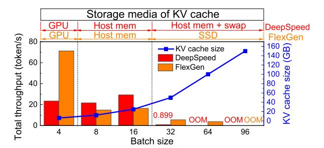

Fig. 4: Throughput of DeepSpeed and FlexGen.

the flash dies. It also maintains the logical-to-physical (L2P) mapping table and other metadata for the FTL.

Computational Storage Drive. To leverage the high internal bandwidth of modern SSDs, the computational storage drive (CSD) employs in-storage computation techniques by integrating computing engines, such as ARM cores, NPUs, or FPGA chips, within the SSD [30], [36], [42]. This integration endows the SSD with computing capabilities, enabling it to perform data processing tasks directly within the storage device. It is worth noting that, to fully utilize the high flash channel bandwidth, it would be better to place the computing engine near the flash dies or NFCs rather than being connected to the SSD through a PCIe switch (i.e., Samsung SmartSSD [58]). This in-storage computing architecture is employed in InstAttention to harness the substantial bandwidth necessary for LLM inference with a large KV cache.

#### III. CHALLENGES AND OPPORTUNITIES

## A. Limitations of Conventional KV Cache Offloading

KV Cache Analysis. Nowadays, the context length of the LLM inference serving system is continuously increasing [26], [37]. Furthermore, as LLMs become prevalent, both the user base and usage frequency significantly increase, leading to more concurrent inference requests for LLM servers. Consequently, for resource-constrained scenarios [40], [70], [77] such as offering inference services to a small group of people at the edge or a large number of users at medium-sized LLM Agent servers, one common practice to enable cost-effective LLM inference systems is to batch many requests in a single iteration, which can effectively enhance the GPU utilization rates. However, all the above lead to the KV cache capacity bloat. Assuming that b, s, p denote the batch size, sequence length, and model size, respectively, the KV cache size stored in the FP16 format is 4bsp, while the model size in FP16 format is only 2p. For a 2K-length sequence with b = 128, the OPT-13B model occupies about 24GB for its model weights and generates 200GB KV caches. For larger models like OPT-175B, the model weights occupy 325GB, while the KV cache reaches up to 2.63TB. Given that the precious GPU memory will be primarily allocated for storing the model weights and activations, the KV cache tends to be offloaded to host memory or SSDs for cost-effectiveness, depending on the sizes.

**Performance Degradation With Offloading.** As the PCIe bandwidth between host memory or SSDs and the GPU is

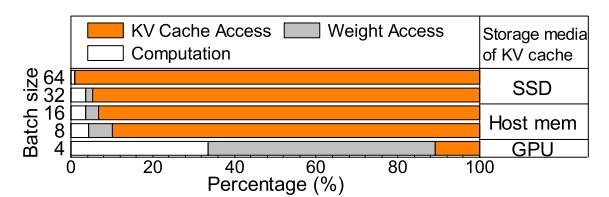

Fig. 5: Latency breakdown of FlexGen decoding.

significantly lower than that of GPU memory, prior offloading schemes lead to a noticeable decline in inference performance. To demonstrate this, we evaluate the inference throughput of two latest KV cache offloading systems, DeepSpeed [21] and FlexGen [57], in a long-context scenario of the OPT-13B model. We evaluate them with different batch sizes on an NVIDIA A6000 GPU, which possesses 48GB GPU memory. Both the input and output sequence lengths are set to 1024 tokens. As depicted in Figure 4, both Deepspeed and FlexGen exhibit performance drop as batch sizes increase: Deepspeed at batch sizes 8 and 32, and FlexGen at batch sizes 8 and 64. These drops occur because the KV cache size exceeds the available GPU memory, necessitating offloading first to host memory and subsequently to SSD. Note that Deepspeed does not support SSD offloading; consequently, at a batch size of 32, kernel swapping from host memory to SSD occurs, leading to a 97.01% performance decline. While increasing the batch size within the same memory tier enhances throughput, offloading the KV cache to secondary storage significantly degrades the performance.

To further elucidate the source of the performance penalty, we analyze the decoding-phase latency of FlexGen across different batch sizes, as illustrated in Figure 5. For smaller batch sizes (4, 8), where all the KV caches fit within the GPU, the primary bottleneck is Weight Access. However, as the batch size increases and the KV caches are offloaded to memory or SSD, the overhead from KV Cache Access escalates to as high as 98.94%. This substantial increase underscores the need for new solutions to address the significant performance challenges introduced by KV cache offloading.

### B. Offloading Opportunities with CSD

We discovered that compared to memory and NVMe SSDs, offloading KV caches to the flash chips within the CSD can directly leverage the higher flash channel bandwidth to meet the demands of the LLM decoding phase using the internal computational units. However, the simple prefilling-decoding separation architecture proposed in prior works [52], [80], which typically targets GPU-CPU separation or distribution across different GPUs, is not suitable for CSD offloading. This is primarily due to the significant differences in the characteristics of various operators and the much lower performance of CSD compared to GPUs. Consequently, it is challenging for CSDs to handle the entire inference task independently.

To minimize the computational load on the CSD and fully utilize its high internal bandwidth, a practical approach involves restructuring the scheme of task disaggregation. This

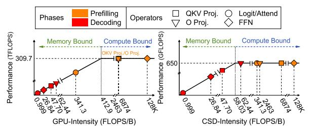

Fig. 6: Roofline models of different hardware.

can be achieved by offloading only memory-bound operators with low computing intensity and substantial KV cache I/O to the CSD, while retaining other operators on the GPU.

To this end, we thoroughly analyzed the main operators in LLM inference, examining their patterns on both CSD and GPU. Figure 6 illustrates the roofline models [75] of an NVIDIA A6000 GPU [49] and a Zynq7045 FPGA-based CSD [69]. The hardware configurations are detailed in Section V. For the prefilling phase, QKV Proj., O Proj., and FFN are extremely computing-intensive and should be placed on GPU. Although the attention operands (i.e., Logit and Attend) are memory-bound on the GPU, the limited computing power on CSD will severely constrain their performance. Therefore, the prefilling-phase attention should also remain on the GPU.

In contrast, the decoding-phase operators exhibit significantly different characteristics. Although QKV Proj., O Proj., and FFN operands are memory-bound on the GPU and seem suitable for CSD-offloading, their operational intensities are near the maximum computing capability of CSD. This places a substantial burden on CSD's computing engine. Moreover, these operands rely solely on weight matrices for flat GeMM computations [22], independent of the KV cache on the flash chips. Conversely, the attention operands (Logit and Attend), which involve extremely low-intensity GeMV computations with 1:1 computation-memory-access ratio, require direct access to KV caches (see block T in Figure 2). Considering the maximum 650GFLOPS computation capacity of CSD, the theoretical throughput requirements would be 650GB/s, which is hard to reach for general SSDs over PCIe lanes (3~10GB/s). This motivates us to offload the decodingphase attention operands to the CSD while retaining other processes on the GPU. This approach aims to significantly reduce KV cache transmission overheads and minimize the computational burden on the CSD.

## IV. DESIGN

## A. Overview of InstAttention

Based on the insights presented in Section III, we propose *InstAttention*, the first in-storage attention offloading system with general GPUs, tailored for offline LLM inference with long-context and large-batch.

The key idea of InstAttention lies in reducing both KV cache movement overheads and computational burden on the CSD, along with the corresponding flash-aware KV cache retrieval mechanism and co-design of attention operands. As

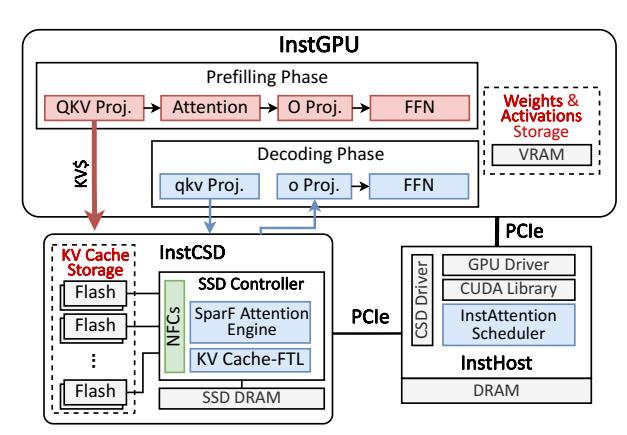

Fig. 7: Overview of InstAttention architecture.

illustrated in Figure 7, InstAttention is primarily comprised of three hardware components: 1) *InstCSD*, which executes decoding-phase attention computation and stores the large KV cache volumes; 2) *InstGPU*, which performs other inference computations along with generating KV cache during the pre-filling phase; and 3) *InstHost*, which runs the software stack, scheduling inference tasks and orchestrating data transmission between the GPU and InstCSDs.

Given that for KV cache in the CSD, the storage requirement is significantly less than the demanding bandwidth, we propose the *SparF Attention* mechanism, an enhanced version to the traditional SparQ algorithm [54] (cf. Section II-B), specifically tailored for flash storage to trade storage capacity for reduced computation and data transmission on the CSD. Considering the page granularity of flash access, SparF Attention organizes tokens at a group level, which corresponds to the page size of flash chips to avoid wasting the flash channel bandwidth. KV cache tensors are identified and fetched via a dual-step mechanism, initially at the coarsegrained group level and then at the fine-grained entry level.

Based on the SparF Attention, we further design the hardware-based accelerator on InstCSD via FPGA, which computes the attention outputs at fine-grained parallelism, to effectively identify sparsity patterns in runtime. As SparF requires to index KV cache in both channel and token, we propose two address-mapping mechanisms in the FTL of InstCSD for efficient KV cache retrieval. Through the InstCSD, only qkv vectors and attention output are transmitted between the GPU and CSD during the decoding phase. Furthermore, the KV caches generated by the GPU are transmitted to CSD through P2PDMA, bypassing the host memory and the burden from the filesystem. The KV cache transmission is executed in a layerwise way, overlapped with the inference computation to hide the transmission latency. Note that as LLMs and the corresponding optimization techniques are experiencing rapid evolution, we aim to explore an architectural solution for LLM acceleration through FPGA-based CSD rather than focusing on a specific algorithm. Considering LLM pruning techniques are rapidly evolving, InstAttention adopts FPGAbased acceleration units to serve as a flexible solution for various algorithms.

```
Algorithm 1 SparF Attention: flash-aware Sparse q-Attention
```

```
Input: q, \bar{v} \in \mathbb{R}^{d_h}, K, V \in \mathbb{R}^{S \times d_h}, r, k \in \mathbb{N}
Output: out \in \mathbb{R}^{d_h}
   1: i \leftarrow [1 \text{ if } i \in \operatorname{argtopk}(|\boldsymbol{q}|, r) \text{ else } 0]_{i=1}^{d_h}
   2: for i_1 = 1 to num_{group}^{ch} do
                 if all entries in group_{i_1} are zero then
                       load \boldsymbol{K}_{[:,i_1]}^{\top} {SparF Filter-I}
\boldsymbol{K}_{[:,i]}^{\top} \leftarrow \boldsymbol{K}_{[:,i_2]}^{\top} for i_2 \neq 0 in group_{i_1}
{SparF Filter-2}
   6:
                 end if
    7: end for
   8: \hat{\boldsymbol{s}} \leftarrow \operatorname{softmax} \left( \boldsymbol{q}_{[i]} \cdot \boldsymbol{K}_{[:,i]}^{\top} / \sqrt{d_h \frac{||\boldsymbol{q}_{[i]}||_1}{||\boldsymbol{q}||_1}} \right)
   9: m \leftarrow [1 \text{ if } i > S \text{ else } 0]_{i=1}^{S}
 10: \boldsymbol{j} \leftarrow [1 \text{ if } j \in \operatorname{argtopk}(\boldsymbol{\hat{s}} + \boldsymbol{m}, k) \text{ else } 0]_{i=1}^{S}
 11: \alpha \leftarrow \text{sum}(\hat{\boldsymbol{s}}_{[\boldsymbol{i}]})
 12: for j_1 = 1 to num_{group}^{tk} do
                 if all entries in group_{j_1} are zero then
                      load K_{[j_1,:]}^{\top}, V_{[j_1,:]}^{\top} (SparF Filter-3)

K_{[j,:]}^{\top}, V_{[j,:]} \leftarrow K_{[j_2,:]}^{\top}, V_{[j_2,:]} for j_2 \neq 0 in group_{j_1}

{SparF Filter-4}
 14:
                 end if
 16:
 17: end for
 18: s \leftarrow \operatorname{softmax} \left( \boldsymbol{q} \cdot \boldsymbol{K}_{[j,:]}^{\top} / \sqrt{d_h} \right)

19: out \leftarrow \alpha s \cdot \boldsymbol{V}_{[j,:]} + (1 - \alpha) \overline{\boldsymbol{v}}
```

## B. Compute Attention Outputs

Flash-Aware Sparse Attention. Based on Section III-B. we observed that the decoding-phase attention remains severely memory-bound on CSD due to its predominate reliance on the KV cache in the flash chips. Our solution leverages the inherent sparsity in attention, which has been thoroughly exploited in prior works (cf. Section II-B). However, prior approaches do not consider the specific flash characteristics, rendering them unsuitable for CSD adoption. Specifically, unlike memory, NAND-flash-based SSD has a much larger capacity with lower bandwidth, making it feasible to trade storage capacity for bandwidth. Furthermore, current sparsity algorithms generate extensive random accesses to the KV cache due to the varying semantic relatedness among tokens in different contexts. It leads to random accesses in flash chips, resulting in significant write amplification [24] and bandwidth wastage due to the page granularity of flash chip accesses.

To this end, we propose SparF Attention, a flash-aware sparse q-attention algorithm that builds on the vanilla SparQ attention [54], as delineated in Algorithm 1 assuming an LLM with a hidden dimension of  $d_h$ , sequence length of S, and batchsize=1. The enhancements specific to SparF are highlighted in Algorithm 1 with  $\{SparF\ Filters\}$ . SparF identifies the sparsity pattern between the current token (i.e., the q vector) and existing sequence (i.e., the K cache matrix) by selecting the top-r entries of the q vector (step 1 in

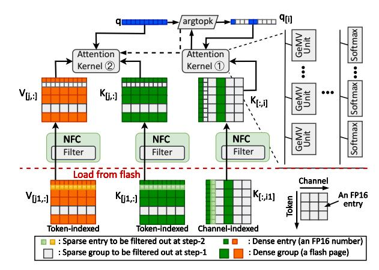

Fig. 8: Workflow and architecture of SparF engine on InstCSD.

Algorithm 1) to approximate the full attention score  $\hat{s}$ . This involves loading the K caches from flash chips indexed by the hidden embedding channel (steps 2-7), matching the identified sparsity in q. Subsequently, based on the approximated attention score  $\hat{s}$ , SparF selects the top-k largest tokens from  $\hat{s}$  to approximate the final output (step 10). It then loads the corresponding full K, V cache tensors for these tokens from the flash chips (steps 12-17). To fit with the flash page size, the KV cache loading process is structured into two phases, as in steps 4-5, 14-15 in Algorithm 1. The detailed data mapping scheme will be elaborated in Section IV-C. Initially, steps 4, 14 filter KV caches at a page granularity (i.e., group in Algorithm 1), preventing the retrieval of flash pages containing only weak tokens identified by argtopk in steps 1, 10. Subsequently, during steps 5, 15, the NFCs refine the sparse KV caches by passing through only strong tokens from the pages that contain both weak and strong tokens.

**Hardware-Based Attention Engine.** Based on the SparF Attention mechanism, we design the hardware-based SparF engine on the InstCSD and integrate it with the SSD controller. As depicted in Figure 8, the SparF engine is primarily comprised of attention kernels, argtopk unit, and the filters within each NFC. Minor components, such as the summation and normalization units, are omitted in the figure for simplicity.

The workflow of the SparF engine is as follows. To begin with, the q vector of shape  $(1 \times d_h)$  is submitted to the argtopk unit and filtered to retain only the top-r entries, denoted by i. The NFC subsequently uses these top-r indices to retrieve columns i from the K cache in NAND flash with a shape of  $(S \times d_h)$ , trying to get  $K_{[:,i]}$ . Despite this selection, the retrieved pages may contain sparse entries due to the size gap between a KV entry (FP16 number, or 2 Bytes) and a flash page (4K Bytes). Therefore, only a subset of sparse columns are filtered out, and we get  $K_{[:,i_1]}$ . The coarse-grained sparse  $K_{[:,i_1]}$  caches are further refined using fine-grained index information (for further details, see Section IV-C). The refined entries,  $q_{[i]}$  and  $K_{[:,i]}$ , are then processed by the Attention Kernel to compute an approximate attention score  $(\Phi)$ . This score is reprocessed through the argtopk

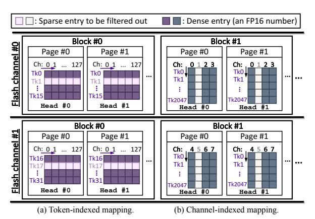

Fig. 9: Schematic of different KV cache mapping schemes.

unit to find out the top-k largest token indices, represented by j, which form the final attention output. Based on the indices, the  $K_{[j;,]}$  and  $V_{[j;,]}$  caches are loaded from flash at the coarse page-level granularity and filtered through the NFC similarly. Specifically, the q and sparse  $K_{[j;,]}$  tensors are first loaded and directed to Attention Kernel (②). Concurrently, the  $V_{[j;,]}$  tensors are loaded in parallel to hide the loading latency. The two instances of Attention Kernels in Figure 8 are identical. Each kernel comprises multiple GeMV and Softmax units to complete the attention computation involved in steps 8,18,19 in Algorithm 1. During the execution, both attention kernels can be scheduled for the two attention computations in SparF Attention considering the real-time loads.

## C. Manage and Transmit KV Caches

To facilitate the SparF Attention mechanism within the CSD equipped with flash chips, it is necessary to enable token-indexed random access to the V cache, in other words, in a column-wise manner. Additionally, both token-indexed and channel-indexed random accesses are required for the K cache (i.e., in both column-wise and row-wise manner). Therefore, considering the low storage cost of flash, we opted to store the K matrices twice in different orientations to optimize access efficiency. Additionally, we designed two sets of efficient address mappings with the dual-step loading mechanism. This approach enables random indexing and efficient flash memory access while significantly reducing write amplification.

**Token-Indexed Mapping.** The token-indexed management, or the row-wise manner, is illustrated in Figure 9(a). Specifically, it is worth noting that in mainstream LLMs such as OPT and Llama, each attention head has a hidden size of 128 in FP16 numbers [61], [78]. Since the multi-head attention calculates head-by-head, it implies a minimum reading granularity of 256B. Considering the 4KB page-granularity access of flash, randomly reading the KV cache can lead to performance degradation of up to 16× in conventional FTL.

To address this, we integrate entries of 16 consecutive tokens from K or V cache in the same head into a *group*, identical to the flash page size. Each group consists of 2048 FP16 numbers, which span a subspace of the complete hidden

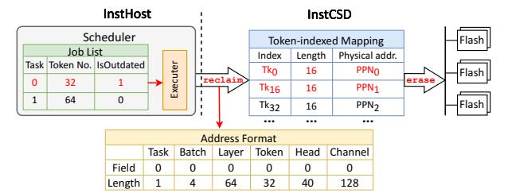

Fig. 10: Illustration of GC mechanism in InstAttention.

embedding corresponding to a specific attention head. For other configurations (e.g., larger attention head or flash page size), the group size varies accordingly. Based on the SparF mechanism, the group may contain a certain number of sparse tokens, which are rows to be ignored. Therefore, during the first loading step, a group will be ignored only if all its tokens rank below the top-k threshold; otherwise, it is considered dense. The sparse tokens remaining in the group are further filtered out through the NFCs, as illustrated in Section IV-B.

To avoid IO conflict and synchronization issues of concurrent accesses, the SparF engine retrieves KV caches in a sequential and pipelined manner. Considering that different token groups within an attention head must be simultaneously loaded for computation, it is essential to maximize throughput by parallelizing retrieval across all flash channels. We therefore stride the KV cache groups across different flash channels in the token dimension. Given that the number of groups accessed per read during the attention computation is substantially greater than the number of available flash channels (typically 4-16), each channel is fully utilized. Our tests imply that this group-based dual-step loading scheme maintains about half sparsity across various datasets during the first-step loading, while the second step reaches full sparsity.

Channel-Indexed Mapping. The channel-indexed access, or the column-wise manner, is relatively similar, as illustrated in Figure 9(b). To access entries of consecutive tokens in one hidden embedding channel, we need to store the K cache corresponding to multiple tokens in the same channel within a single page. However, if we still assume the page size as 4KB, each flash page can store 2K entries, which is quite a large granularity for general LLM inference. Therefore, we further adopt the two-step loading mechanism for the channel-indexed access, grouping 2-8 channels into one page. Therefore, the minimum storage granularity in this scenario is 256-1K tokens, which is feasible for both short conversations (less than 256 tokens) and long contexts (longer than 1K tokens). The group size can be dynamically adjusted based on the input length and largest context length of the model in the runtime.

Based on the two mapping schemes, all the computations concerning KV caches are confined within the InstCSD, allowing us to manage KV cache completely in the InstCSD and eliminate the need for a complex host filesystem. InstCSD orchestrates the KV cache data by indexing them with customized logical addresses via the FTL. Specifically, the logical address is defined as a 32-bit integer, which is segmented into multiple fields to uniquely identify the batch, layer, token,

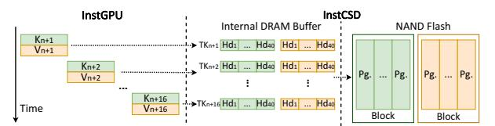

Fig. 11: Batched writing in InstCSD.

head, and channel number of an entry, as illustrated by the *Address Format* in Figure 10. Consequently, the SparF engine directly locates and retrieves the KV cache it needs through two L2P mapping tables, which are stored in the CSD internal DRAM like what traditional SSDs do.

Batch Writing Requests. The writing process of KV caches primarily occurs during the prefilling phase, where the entire input sequence is processed in parallel, generating a substantial amount of KV cache. Nevertheless, once all KV cache chunks from the input tokens are transmitted and stored on the flash chips, the decoding phase continues to generate KV vectors for new tokens incrementally. These vectors are written to the CSD in small sizes. As each page contains KV tensors for multiple tokens, the KV caches generated sequentially for these tokens must first be stored in the DRAM group buffer within the CSD, illustrated in Figure 11. These vectors are then flushed back to the flash chips in the background once the DRAM buffer is fulfilled. Furthermore, owing to the mismatch between page-granularity writes and block-granularity erases of NAND flash [24], small write requests can lead to write amplification (WAF) issues, a well-documented challenge for SSDs. To mitigate WAF, it is crucial to ensure that each write operation is at block granularity comprising several hundred pages. Therefore, since the GPU generates new k, v vectors of all attention heads in parallel, enough groups of attention heads can be batched to fill one flash block. For token-indexed KV caches, we prioritize placing groups corresponding to different attention heads within the same block, which can effectively avoid write amplification issues. As all KV caches are sequentially generated and stored in an appending manner, data fragmentation is eliminated within the InstCSD. This obviates the need for foreground GC during writing processes, thereby avoiding any interference (cf. Section IV-D).

#### D. Integrate and Scale the System

**GPU-CSD coordination.** In InstAttention, the CSD manages the KV cache during the QKV projection process in both prefilling and decoding phases, and calculates attention during decoding. This leads to a pipelined cooperation between the GPU and CSD: In the prefilling phase, the GPU handles all computations are handled. The KV cache for all input tokens is transferred to the CSD via PCIe, a process that may be time-consuming. To mitigate this, we implement a layer-wise pipeline wherein the KV cache generated at the i-th layer is transferred to CSD concurrently with the computation at the (i+1)-th layer. After attention computation, the CSD sends attention outputs back to the GPU to proceed with generating the o vector and completing the subsequent FFN layer inferences. Compared with the traditional KV cache

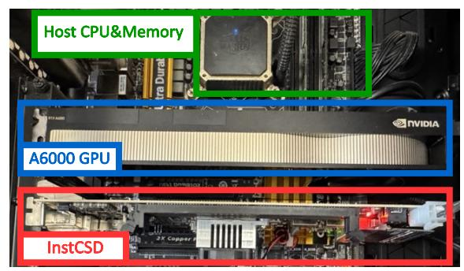

Fig. 12: Hardware deployment of InstAttention.

offloading system, the data volume transmitted on the PCIe buses is reduced by s/2, where s refers to the sequence length.

For data transmission between the GPU and the CSD, we use a peer-to-peer approach, bypassing the host memory buffer to enable direct data transfer through PCIe lanes. This approach minimizes redundant data copies and optimizes transmission efficiency. Unlike the traditional GPUDirect Storage [48] approach, which depends on the host filesystem to manage SSD data, InstAttention operates independently of complex host file systems for managing KV cache. Specifically, the host runs InstCSD and InstGPU drivers. In the data plane, the InstCSD driver replaces the logical address field (DWord10 in NVMe commands [14]) with our customized logical address (cf. Section IV-C) to perform nvme\_read() and nvme\_write() commands, similar to standard NVMe protocols. The *InstAttention Scheduler* orchestrates data transmission, initiating DMA transactions between the logical addresses of InstCSD and the mapped VRAM address of Inst-GPU. In the control plane, we leverage the reserved bits in the NVMe command to support three new functions: config() to set model hyperparameters, attend() to initiate attention computation, and reclaim() with specific data address and size to perform GC (Garbage Collection) on InstAttention.

Garbage Collection. The garbage collection (GC) process in InstCSD is simplified, which differs significantly from the traditional GC processes observed in SSDs. As the KV cache serves as intermediate activation data, it does not require persistent storage within InstCSD. Instead, GC is periodically initiated by the host scheduler only to erase the stale pages (i.e., obsolete and unnecessary KV cache), thereby preventing the overwhelming of flash capacity. The sequential nature of all KV cache writing requests to InstCSDs, which append rather than modifying existing data, eliminates data fragmentation. This simplification substantially reduces the GC overhead compared to that of traditional SSDs. Furthermore, considering that real LLM serving systems present periodic and fluctuating request intensity [65], GC is invoked only during LLM service intervals when the InstCSD is idle and the available page budget falls below a specified threshold. This approach minimizes interference with attention computation and writing requests. The KV cache data is ordered and erased in an LRU manner, which guarantees the availability of sufficient pages for incoming KV caches.

Figure 10 illustrates an example of the GC process in InstAttention. The host scheduler maintains a job list to record all the inference jobs with their token number, and whether they are outdated. During idle time, the scheduler issues the reclaim() command to InstCSD to erase the blocks corresponding to the outdated Task 0, and specifies the length to set the range of all the metadata. As we want to erase KV cache data of all the batches and layers of Task 0 in this example, all the Fields are set to zero and Lengths are set to the maximum. Upon receiving the command, the InstCSD FTL leverages the two index-based mapping table to find out all the token indices in the specified range of task 0, and executes garbage collection process based on the physical addresses. Note that for simplicity, we only illustrate the token-indexed mapping in the figure, and the channelindexed mapping follows a similar approach.

Scale To CSD Array. InstAttention can be seamlessly scaled across multiple CSDs to significantly improve inference performance. Specifically, the MHA that mainstream LLMs employ allows each head in a multi-head attention layer to be calculated for an independent set of attention scores. As each InstCSD exclusively handles the attention module and different attention heads compute independently without interdependencies, it is feasible to distribute various attention heads across CSDs. For a configuration with n CSDs and nhead attention heads, where typically nhead ≫ n (for example, OPT-13B features 40 heads), each CSD processes nhead/n heads. Finally, the outputs from the attention heads processed on different CSDs are transmitted back to the GPU, which then concatenates these results to form the final output.

## V. IMPLEMENTATION

## *A. System Deployment*

We have implemented InstAttention with real hardware, as illustrated in Figure 12, with full-stack software support. InstCSD is built on Daisyplus OpenSSD, the latest representative NVMe CSD device in the OpenSSD project [31], [60]. It employs a Xilinx ZU17EG MPSoC as its processor, which contains a mid-range FPGA chip with a four-core ARM processor, 2GB DRAM, and PCIe 3.0x4 interface. The SparF engine and NFC filters are implemented on the FPGA part, clocked at a frequency of 285MHz, while the FTL runs as software on the ARM processor. The software stack of InstAttention is built atop FlexGen [57]. Specifically, we consider TorchDisk object, which is employed for offloading the KV cache in the original FlexGen implementation, as a TorchDevice endowed with computational capabilities. This allows us to leverage the inherent GPU-CPU heterogeneous computing capability, seamlessly integrating the CSD into the established FlexGen framework with the same APIs for users. The driver for InstCSD is customized based on [44], providing simple control and data-plane interfaces (cf. Section IV-D).

| Units   |         | Latency | Throughput | Accuracy |  |
|---------|---------|---------|------------|----------|--|
| GeMV    | Real    |         | 12.7GFLOPS |          |  |
|         | Virtual | 0.32us  | 13.3GFLOPS | 95.50%   |  |
| Softmax | Real    |         | 14.2MFLOPS |          |  |
|         | Virtual | 164us   | 15.1MFLOPS | 94.00%   |  |
| Filter  | Real    |         | 1.85GB/s   | 96.80%   |  |
|         | Virtual | 37us    | 1.79GB/s   |          |  |

TABLE I: Performance and accuracy of InstCSD.

|                  | LUT(K) | FF(K)  | BRAM Tile | DSP    |
|------------------|--------|--------|-----------|--------|
| Attention Kernel | 99.2   | 207.3  | 96        | 768    |
| Argtopk          | 5.83   | 3.87   | 24        | 0      |
| NFC              | 58.332 | 27.8   | 96        | 0      |
| NVMe Controller  | 7.99   | 12.45  | 27.5      | 0      |
| Interconnect     | 4.12   | 6.17   | 7.5       | 0      |
| Available        | 218.6  | 437.2  | 545       | 900    |
| Percent(%)       | 80.27% | 58.92% | 46.06%    | 85.33% |

TABLE II: Resource utilization of InstCSD on Zynq7045.

## *B. Towards Practical CSD Solutions*

While OpenSSD serves as a real CSD, it presents several challenges that hinder its widespread adoption. Notably, it features expensive FPGA chips, costing thousands of dollars [60], and is equipped with limited flash resources. Additionally, it only supports legacy motherboards like Z97, which lags far behind the current hardware environment [31]. These specifications fall short of contemporary SSDs with cheaper processors, more channels, and greater storage capacity.

To bridge this gap between experimental setups and practical systems, we adopt NVMeVirt [29], a cutting-edge software-defined virtual NVMe device. NVMeVirt facilitates a seamless integration with the host software stack like a real NVMe SSD with the flexibility to customize SSD internals with specific needs. Therefore, we first collected fine-grained latency statistics of OpenSSD-based InstCSD deployment with the system. We further built the software-defined InstCSD based on the NVMeVirt, setting the corresponding latencies to reflect the speed of InstCSD processing engine on the host CPU. To match real deployment costs, we also prototyped InstCSD on Xilinx Zynq7045 [69], a more economically viable FPGA SoC, prevalently utilized in edge computing. Table I shows the performance statistics of main components in InstCSD for one OPT-13B attention head and 16 tokens, both on the real and virtual CSD devices. We use the evaluated throughput statistics to reflect the emulation accuracies, all of which are around 95% and sufficient to reflect the real system. We further extend the flash channel number to 8, with 1.4GB/s channel bandwidth to align with modern SSD configurations (i.e., Samsung 980pro [55]). The external PCIe interface is 4.0x4, which delivers a maximum of 7GB/s throughput. The detailed resource utilization rates are listed in Table II. We exploit the DSP resources of Zynq7045 to deliver the maximum performance for attention computation.

