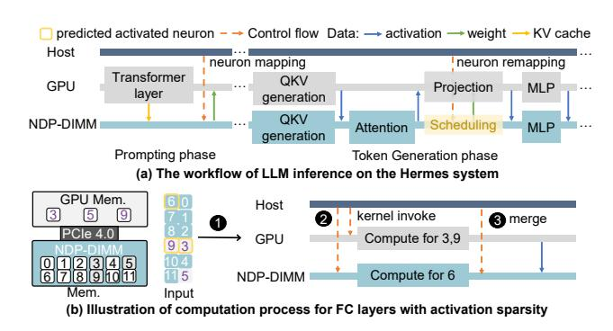
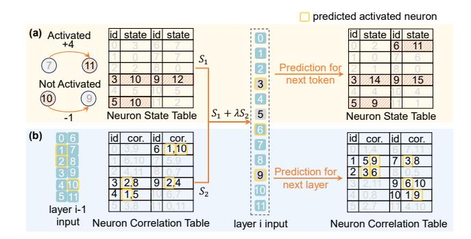

# *A. System & Architecture Overview*

*1) Architecture:* Figure 5a illustrates the overview of Hermes. Hermes augments consumer-grade GPU with NDP-DIMMs to achieve low-budget, high-performance inference system for LLMs.

Consumer-grade GPU: For LLM inference, we only use one accessible and budget-friendly consumer-grade GPU. Despite limited graphic memory, it has ample computing units, like tensor cores, for high-performance parallel processing. It also features high-speed GDDR memory with superior bandwidth. For instance, the NVIDIA RTX 4090 with 24GB GDDR6 provides 82.6 TFLOPS, 1321 Tensor TOPS, and 936 GB/s bandwidth, making it suitable for LLM inference. Hermes uses a single GPU to efficiently execute hot neurons.

NDP-DIMM: Given that cold neurons are randomly activated, all data stored on each DIMM should be accessible to its own NDP units. Meanwhile, DIMM is required to support the normal data access from GPU for hot neuron transmission. Therefore, as illustrated in Figure 5b, we have chosen the center buffer-based NDP-DIMM design [3], [11], [25], [29], which allows the processing unit to access all data in its own DIMM. The center buffer-based NDP DIMM design also complies with the normal memory access as the newly added units will not influence the memory access function supported by the local memory controller [3], [25]. Here, we detail the microarchitecture of our NDP-DIMM design. To facilitate typical operations in LLMs and potential inter-DIMM data moving, each NDP-DIMM is equipped with GEMV units, activation units, and DIMM-links [68].

*GEMV Unit*: The GEMV unit reads data from the DRAM cell and the center buffer, performing the GEMV computation associated with cold neurons. To support batched inference and fully utilize the bandwidth achievable within the DIMM center buffer, each GEMV unit contains 256 multipliers. Each multiplier is responsible for 128-bit multiplication in a typical bit-serial manner [14], a reduction tree-based accumulator, and a 256 KB buffer. During computation, each multiplier computes eight FP16 values simultaneously, and the accumulator is responsible for the addition of partial sums with data dependencies. The buffer stores the intermediate result generated by LLM layers.

*Activation Unit*: The activation unit is designed to support the necessary non-linear functions, such as softmax and ReLU operation for LLM inference. This unit is composed of 256 FP16 exponentiation units, 256 FP16 addition units, and 256 FP16 multiplication units, in addition to a comparator tree, an adder tree, and a divider.

*DIMM-link*: Due to the input-specific nature of the activated neurons, it is necessary to adjust the neuron mapping in multiple NDP-DIMMs to further ensure the load balance of computation in the DIMMs. Therefore, we adopt DIMM-link [68] to achieve inter-DIMM communication with a bandwidth of 25 GB/s. Each DIMM-link employs bidirectional external data links between DIMMs, facilitating efficient point-to-point data transfers. The DIMM-link controller and bridge enable highspeed neuron redistribution between DIMMs. Compared to relying on the host for inter-DIMM data movement, using DIMM links provides over a 62× speedup for data transfer with negligible hardware overhead. For example, when running OPT-66B, the introduction of DIMM-link effectively reduces the migration overhead for cold neurons from 5.3% of total time to below 0.2% .

Scheduler: During LLM inference, the scheduler in the host CPU redistributes neuron computation tasks to the GPU and NDP-DIMMs. The scheduler primarily comprises two components: a lightweight predictor and a neuron mapper, which are both implemented by software. In addition, the scheduler includes a monitor that gathers runtime information to assist the predictor and an instruction queue that triggers instructions for the GPU and NDP-DIMMs. With the help of the monitor, the lightweight predictor leverages token-wise similarity and layer-wise correlation patterns to accurately predict neuron activity. Based on the prediction results, the neuron mapper assigns hot and cold neurons to DIMMs and GPU memory, respectively, and it also dynamically adjusts the neurons' placement to ensure efficient inference on both the GPU and NDP-DIMMs. The subsequent sections will provide detailed descriptions of these two components.

Programming Interface: We use a standard programming model, PIM-SYCL [27], to compile the heterogeneous platform. Unified memory programming [12], [65] allows data to be transferred implicitly between heterogeneous memory devices, enabling cooperative processing on GPU and NDP-DIMMs. Additionally, Hermes provides a set of extra NDP commands, such as MAC and softmax, to support various operators in LLMs. Taking GEMV computation as an example, the NDP-DIMM computations can be invoked through the memory command interface by sending a series of MAC commands. On the GPU side, the corresponding computations are triggered through APIs like cudaLaunchKernel.

*2) Workflow:* The workflow for LLM inference within the Hermes system is depicted in Figure 6a. Given the significant computational demands, the entire prompting stage is processed on the GPU, adhering to a traditional offloading strategy [50]. During this stage, the host scheduler records

Fig. 5. Overview of our proposed Hermes System. (a) Hermes augments GPU memory with NDP-DIMMs, and utilizes a scheduler to control the inference workflow. (b) Multiple NDP-DIMMs are connected to support LLM inference and inter-DIMM communication.

Fig. 6. Workflow of Hermes system (a) The whole workflow of LLMs inference on the Hermes system. (b) Illustration of computation process for FC layers with activation sparsity. The block with a number in the Mem. means one neuron's weight.

neuron activity for future scheduling optimization. Upon completing the prompting stage, only the selected hot neurons are loaded back into GPU memory. The offline partition of hot and cold neurons will be further detailed in Section IV-B. In the token generation stage, for each transformer layer, the QKV generation is collaboratively completed by GPU and NDP-DIMMs. The output of OKV generation will be collected in the NDP-DIMMs for further attention computation. The memory bandwidth-intensive nature of attention computation [43], [61] makes it ideal for execution on NDP-DIMMs, which benefit from the abundant internal bandwidth. Additionally, transferring attention computation to NDP-DIMMs helps save the limited GPU memory by eliminating the need for storing KV cache. Since the projection layer cannot utilize the activation sparsity, it is handled solely by the computation-efficient GPU. During the projection computation, as the DIMMs are entirely idle, the host takes advantage of this period to dynamically reconfigure the hot/cold partitions and redistribute neurons across DIMMs based on the prediction results, which will be detailed in the Section IV-C and IV-D. Then, similar to the QKV generation, MLP is offloaded to both GPU and NDP-DIMMs. Finally, the output of each transformer layer is reduced in the NDP-DIMMs.

Figure 6b illustrates the computation process for FC layers (for both QKV generation and MLP block) with activation sparsity. Specifically, it includes three steps. After completing the related prediction, the host CPU determines the computa-

TABLE I
TERMINOLOGY FOR THE OFFLINE PARTITION SOLVER.

| Parameters - predetermined or offline profiled |                                                                               |  |
|------------------------------------------------|-------------------------------------------------------------------------------|--|
| L                                              | All layers                                                                    |  |
| N                                              | All neurons                                                                   |  |
| $\mathbb{D}$                                   | All NDP-DIMMs                                                                 |  |
| $f_i$                                          | Activation frequency of neuron i                                              |  |
| $N_l$                                          | Neuron in layer l                                                             |  |
| $M_i$                                          | The memory space required by neuron i                                         |  |
| $T_{sync}$                                     | The time required for one synchronization                                     |  |
| $T_{sync}$ $T_l^j$ $S_j$                       | The time for computing one neuron in layer $l$ on processing $j$              |  |
| $S_{j}$                                        | The storage size for processing unit $j$                                      |  |
| Binary Variables - needed to be solved         |                                                                               |  |
| $x_{il}^j$                                     | Whether neuron $i$ in layer $l$ is placed on processing unit $j$              |  |
|                                                | $x_{il}^{j} = 1$ means the neuron i in layer l is placed on processing unit j |  |

tion allocation for both the GPU and NDP-DIMMs based on the location of the activated neurons. Once the neuron mapping is determined, the host CPU invokes APIs for both the GPU and NDP-DIMMs to load data and perform computation. For example, the host CPU uses "cudaLaunchKernel" to launch GPU kernels for GEMM and GEMV operations. To ensure correctness, the host CPU inserts barriers for the GPU and NDP-DIMMs to synchronize their computations. Once the DIMMs and GPU complete their computations, a merge kernel is invoked on the NDP-DIMMs side to gather the results from both sources. This method is advantageous for two reasons. Firstly, as the GPU generally finishes computation tasks more quickly owing to its superior computation capability, the latency in transferring data from the GPU to DIMMs can be hidden by the DIMMs' computation, thus not penalizing the overall system runtime. Secondly, with the attention computation occurring on NDP-DIMMs, merging the QKV generation outcomes on the NDP-DIMMs side minimizes the additional data transfer overhead.

## B. Offline Neuron Mapping

Since NDP-DIMMs and GPU are responsible for the computational load of the neurons stored in them, the predetermined mapping for each neuron's location greatly influences the inference efficiency. However, due to the huge neuron mapping space (e.g., more than  $2^{1000}$  for LLaMA-7B), solely relying on online mapping solutions is impractical and will contribute to considerable performance degradation. Therefore, in the belief that "hot" and "cold" neurons are partly attributed to the pretrained LLM's nature [52]–[54], [66], we utilize the offline profiled information to deduce the initial offline neuron mapping. It alleviates the adjustment cost of

subsequent online partition and scheduling during inference. Please note that the optimal initial mapping denotes the mapping that can be found during the offline stage, which will be adjusted during runtime.

To determine the optimal location for each neuron that minimizes the inference latency using our heterogeneous system, we formalize the mapping issue as an integer linear programming problem (ILP). In particular, we analyze several factors, including each neuron's activated frequency, computational overhead, memory usage, and synchronization delays, to model the inference performance of the Hermes system. To gather these factors accurately, we test the model on popular datasets such as C4 [44] and Pile [15] with 128 samples, and also employ an execution monitor in the host CPU to record during inference. The notation for solving the optimal offline neuron placement problem is summarized in Table I.

Objective function. The objective of the optimal neuron mapping is to minimize the total inference latency, as shown in Equation 1. Since the execution of each layer involves both GPU and NDP-DIMMs, the total execution time is determined by the longer duration of the GPU and NDP-DIMMs execution times. For NDP-DIMMs, the single-layer execution time is the longest execution time among all DIMM modules, as shown in Equation 2. For the GPU, the single-layer execution time includes both computation time and extra synchronization overhead, while the synchronization overhead includes that of fetching input activation data from the DIMM and sending the computation results back to the DIMM to trigger the merge kernel. Hence, as illustrated in Equation 3, the total GPU execution time also includes twice the single-direction synchronization overhead.

$$\min \sum_{l} \max(T_{GPU-l}, T_{DIMM-l}), \quad \forall l \in \mathbb{L}$$
 (1)

$$T_{DIMM-l} = max(T_{dimm-il}), \quad \forall i \in \mathbb{D}$$
 (2)

$$T_{GPU-l} = T_{compute-GPU-l} + 2 \cdot T_{sync} \tag{3}$$

The computation times for a single layer on both the GPU and NDP-DIMMs depend on the number of activated neurons located in each device. Let  $T_l^{GPU}$  represent the time required to compute a single neuron on the GPU. Consequently, the computation time for a single layer on the GPU is the product of the number of activated neurons in the GPU memory and the time taken to compute each neuron, as illustrated in Equation 4. Similarly, the single-layer computation time for each NDP-DIMM is demonstrated in Equation 5.

$$T_{compute-GPU-l} = T_l^{GPU} \cdot \sum_i f_i \cdot x_{il}^{GPU}, \quad \forall i \in \mathbb{N} \quad (4)$$

$$T_{dimm-jl} = T_l^{DIMM} \cdot \sum_i f_i \cdot x_{il}^{dimm-j}, \quad \forall i \in \mathbb{N} \quad (5)$$

**Constraints.** The offline optimal neuron placement issue must adhere to the conditions listed in Equation 6 and 7, which limit the memory space occupied by neurons not to exceed the available memory size of each DIMM and GPU.

Fig. 7. The predictor design in Hermes. (a) We are motivated to utilize the temporal locality of token generation for prediction. (b) The layer-wise correlation effectively predicts activated neurons.

$$\sum_{l} M_{i} \cdot x_{il}^{GPU} \leq S_{GPU}, \quad \forall l \in \mathbb{L}$$

$$\sum_{l} M_{i} \cdot x_{il}^{dimm-j} \leq S_{dimm-j}, \quad \forall l \in \mathbb{L}$$
(7)

$$\sum_{l} M_{i} \cdot x_{il}^{dimm-j} \le S_{dimm-j}, \quad \forall l \in \mathbb{L}$$
 (7)

Consequently, we employ the open-sourced optimization solver, PulP [55], to determine the optimal offline neuron mapping. Based on our assessment, it takes about 110 seconds to solve for the optimal neuron mapping, making it appropriate for a single offline compilation process. Before LLM inference, we initially transfer relevant hot neurons to GPU memory based on the mapping outcomes and further adjust the mapping during runtime to improve efficiency.

