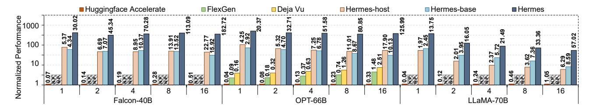
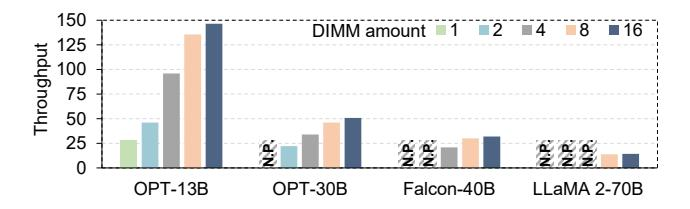
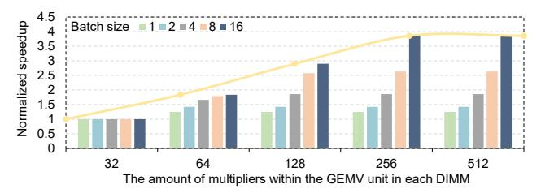

# *C. Ablation Studies*

To evaluate the scheduling strategies proposed in Section IV, we compare the normalized inference latency on MLP block for different LLMs with various scheduling settings. Specifically, Hermes-random denotes utilizing a random offline mapper to achieve neuron placement, Hermes-partition denotes that it only considers the optimal offline neuron placement, Hermes-adjustment denotes the system that further uses online adjustment for hot/cold neuron partition, and Hermes is

Fig. 11. End-to-end performance on different batch sizes (ranging from 1 to 16). N.P. denotes the model is not supported by the current inference system.

Fig. 12. Evaluating the performance breakdown on Deja Vu, Hermes, and Hermes-base (H-base) on various LLMs with different batch sizes.

Fig. 13. Ablation study on proposed offline and online scheduling strategies.

the one that integrates all the scheduling strategies proposed in Section IV. Furthermore, we also explore when only adopting token-wise prediction or layer-wise prediction to guide the online adjustment of hot/cold partition, denoted as Hermestoken-adjustment and Hermes-layer-adjustment, respectively.

Load Balancing with Multi-level Optimization. Figure 13 shows the contributions of each component in Hermes . Utilizing the offline mapper can effectively identify the frequent hot neurons, reducing the computation cost of NDP-DIMMs. As a result, Hermes-partition can achieve  $1.63 \times$  speedup than Hermes-random. However, the input-specific nature of activation sparsity challenges the offline partition approach. Therefore, further adopting online adjustment for hot/cold partition (Hermes-adjustment) achieves 1.33× performance gains over Hermes-partition. Despite this, the overall execution efficiency is still constrained by the NDP-DIMMs, which possess limited computation capability. Thus, the performance of the resource-constrained NDP-DIMMs can be improved by tackling the load imbalance issues in several NDP-DIMMs. The introduced online remapping method successfully addresses this problem. As a consequence, the fully optimized Hermes system demonstrates a  $1.29 \times$  boost in performance when compared with Hermes-adjustment.

Benefits of Token-wise and Layer-wise Prediction. Compared to Hermes-partition which only considers the optimal offline neuron placement, Hermes-token-adjustment and Hermes-layer-adjustment can achieve  $1.08\times$  and  $1.11\times$  speedup, respectively, demonstrating the benefits of online adjustment. However, token-wise prediction cannot address fluctuations in neuron activity, making it inaccurate for frequent changes in hot/cold neurons. Simultaneously, layer-wise prediction only relies on the static sampled neuron correlation table to guide the online adjustment, inefficient for constant changes of online adjustment. As a result, using token-wise or layer-wise prediction only cannot effectively unleash the benefits of prediction-based online adjustment.

## D. Performance Breakdown

Figure 12 illustrates the performance breakdown of Deja Vu, Hermes-base, and Hermes on various LLMs. It provides detailed insights into the efficiency sources of Hermes.

Figure 12a shows that while Deja Vu benefits from activation sparsity, it still requires loading cold neurons when activated, resulting in communication costs—especially PCIe data transfer—comprising about 89% of the execution time. On the right side of Figure 12a, we disregard the effect of communication on performance. The MLP-based predictor in Deja Vu consumes roughly 18.1% of computation time, further reducing the gains from activation sparsity. Our lightweight predictor, in contrast, contributes less than 0.1% to runtime overhead. Even with communication costs lowered through reusable neurons at large batch sizes, Deja Vu's performance remains inferior to Hermes.

Figure 12b compares Hermes-base and Hermes. Without activation sparsity, Hermes-base incurs higher computation

Fig. 14. Throughput of four typical LLMs with different numbers of NDP-DIMMs. N.P. denotes the model is not supported by current system.

Fig. 15. Throughput of OPT-13B and OPT-30B with various GPUs, including RTX 4090, RTX 3090 and Tesla T4.

costs, especially as batch sizes increase, due to intensive computation on NDP-DIMMs. For example, running LLaMA2-70B offloads over 80% of computation to NDP-DIMMs, leading to a substantial portion of the execution time being occupied by FC computation. In Hermes, token generation takes 66.40% of execution time at batch size 1. After optimizing token generation, the prompting stage becomes the bottleneck, accounting for about 33.01% of the overhead, limiting further inference efficiency improvements.

## E. Sensitivity Studies

1) Sensitivity analysis of the number of DIMMs: Figure 14 illustrates the improvement in LLM throughput as the number of NDP-DIMMs increases. We evaluated four distinct LLM models using a single batch to understand the impact of varying numbers of NDP-DIMMs, while mitigating the effect of limited computation capability. An increase in NDP-DIMMs enhances both memory size and internal bandwidth. Larger memory capacity facilitates the deployment of more extensive models; for instance, deploying Falcon-40B on Hermes necessitates a minimum of four NDP-DIMMs. Additionally, higher internal bandwidth significantly enhances end-to-end performance, addressing the bandwidth limitations that bottleneck current offloading-based systems. However, once sufficient bandwidth is achieved, further increases in the number of NDP-DIMMs do not proportionally boost throughput. For example, LLaMA2-70B exhibits similar throughput with both 8 and 16 NDP-DIMMs. Once the NDP-DIMMs surpass the GPU in performance, additional NDP-DIMMs do not yield further performance gains.

2) Sensitivity analysis of various GPUs: Figure 15 illustrates the significant impact of different GPUs on the end-to-end throughput of LLM execution. We have included two additional consumer-grade GPUs, Tesla T4 and RTX 3090, in our evaluation. Specifically, Tesla T4 offers 16GB of graphic

Fig. 16. Design Space Exploration for NDP-DIMMs with different number of multipliers in each GEMV unit.

Fig. 17. Comparison with TensorRT-LLM on LLaMA2-70B.

memory, 320GB/s memory bandwidth, and 65 tensor TOPS (FP16), whereas RTX 3090 provides almost the same graphic memory and bandwidth as RTX 4090, but with 142 tensor TOPS (FP16). Overall, Hermes with RTX 4090 achieves an average throughput improvement of  $2.02 \times$  and  $1.34 \times$  compared to Hermes with Tesla T4 and RTX 3090, respectively. The data loading cost for RTX 3090 is nearly identical to that of RTX 4090. However, RTX 3090 spends more time on prefill and hot neuron computations due to its weaker computation capability. Tesla T4, with its smaller graphic memory and lower memory bandwidth compared to RTX 3090, is inefficient for data loading. Consequently, the choice of GPU device is crucial for optimizing Hermes performance.

3) Design Space Exploration for NDP-DIMMs: Figure 16 highlights the impact of increasing the number of multipliers within a GEMV unit per DIMM on LLM inference performance, especially with larger batch sizes. We varied the number of multipliers within a GEMV unit from 32 to 512, thereby enhancing computation capability by 16×. For OPT-13B with a batch size of 1, performance stabilizes once 64 multipliers are reached, as further computation capability yields minimal gains. In contrast, with a batch size of 16, performance continuously improves with additional multipliers, achieving up to a 3.86× speedup. This difference arises because memory bandwidth limits performance for smaller batch sizes due to lower arithmetic intensity, while computation capability becomes the bottleneck with larger batch sizes. To optimize the balance between hardware overhead and performance across various batch sizes, we selected 256 multipliers within the GEMV unit per DIMM.

