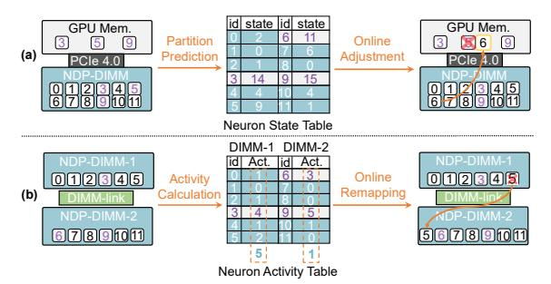

# C. Online Adjustment for Hot/Cold Neuron Partition

Although the optimal offline neuron mapping provides an effective hot/cold partition, the input-specific nature of activation sparsity makes the hot/cold neuron partition change dynamically in practice. Our evaluation indicates that about 52% of the initialized hot neurons exhibit varied activity during inference. Therefore, it is necessary to adjust the hot/cold neuron partition online to improve inference efficiency before neuron computation, which requires an in-advance prediction of the neuron partition. In this section, we leverage the distribution patterns of activation sparsity to create a novel lightweight predictor to guide the online adjustment of the hot/cold neuron partition.

1) Predictor Design: Accurately forecasting activated neurons and the hot/cold neuron partition is crucial for improving inference performance. On one hand, to effectively harness activation sparsity, the Hermes workflow necessitates predetermining the computation loads for both the GPU and NDP-DIMMs. On the other hand, assigning hot neurons to the GPU before computation can fully utilize the GPU's computation capability and ease the burden on NDP-DIMMs. Nevertheless, existing MLP-based predictors [34], [52], [53] incur considerable storage and computation overhead, reducing inference efficiency. To address it, we introduce a lightweight predictor that exploits token-wise similarity and layer-wise correlation (discussed in Section III-B) for accurate predictions.

**Token-wise Prediction.** The token-wise similarity suggests that the distribution of activated neurons is similar among



Fig. 8. Neuron mapper design. (a) The mapper utilizes the information in the neuron state table to adjust the hot/cold neuron partition. (b) Cold neurons are remapped based on the neuron activity within a window.

adjacent tokens. Given that tokens are generated one by one during the token generation stage, token-wise similarity can be considered as a temporal locality of activated neurons. Inspired by well-known branch prediction strategies [36], [51], [60] that also benefit from temporal locality, we propose a novel prediction strategy. As shown in Figure 7a, we establish a neuron state table where each neuron has a 4-bit state, ranging from 0 to 15, used to predict whether the neuron will be activated. After the prefill stage, we initialize each neuron's state based on the activated frequency in the whole prefill stage. Specifically, we divide the distribution of the activated frequency into 16 stages and initialize each state accordingly. For example, if a neuron's activated frequency exceeds 90%, its state is initialized as '15', whereas if the ratio is below 2%, the state is set as '0'.

We update each neuron's state based on the actual activated neurons during each token generation step using a finite state machine. If a neuron is not activated, its state decreases by 1; if it is activated, its state increases by s, which is set to 4 in this paper. The left part of Figure 7a shows that, when neuron 6 is activated, the state is updated from 7 to 11, while the state of neuron 5 is updated from 10 to 9 as it is not activated.

Layer-wise Prediction. Token-wise similarity alone cannot address fluctuations in neuron activity between tokens [64], [66]. Therefore, we further employ layer-wise correlation to improve prediction accuracy. Insights from Section III-B suggest that if neurons with high correlation in the preceding layer are activated, the activated probability for the current neuron is significantly increased. Consequently, we create a neuron correlation table to boost layer-wise prediction. As depicted in Figure 7b, we initially offline sampled the top 2 correlated neurons from the previous layer and documented their relationships in the neuron correlation table.

Finally, we combine the token-wise and layer-wise prediction strategies to achieve accurate prediction for activated neurons during token generation. Specifically, we use  $s_1$  to denote the state in the neuron state table for one neuron, and use  $s_2$  to indicate the activated number of the highly correlated neurons for one neuron. To predict the activation state for such a neuron, we examine the inequation:  $s_1 + \lambda \cdot s_2 > T$ . In this paper, we set  $\lambda$  as 6, and the threshold T as 15. As Figure 7 shows, following the prediction criterion, we finally activate

neurons 3, 6 and 9 for subsequent computation. During context switches, token similarity may vanish, but layer-wise correlation is still available for effective prediction. Conversely, even if correlated neurons are not activated, observing neighboring tokens' activation states still helps achieve accurate prediction. Experimental result shows that the accuracy of our proposed predictor achieves 98% using less than 1MB of memory. For instance, LLaMA-7B occupies 32 layers, with each one having 4K neurons for the self-attention block and 10.5K for the MLP block. In our implementation, only 4-bit data is used to record the corresponding state of each neuron. Consequently, it only costs 232 KB for the neuron state table of LLaMA-7B. We integrate the proposed predictor into the host CPU and store the table values in the last level cache for fast prediction.

2) Online Adjustment guided by Predictor: Given their ample memory capacity, instead of mapping only cold neurons, we store all the weight parameters on DIMMs. Thus, we only need to reload the actual hot neurons onto GPU memory to achieve online adjustment. The neuron state in our proposed predictor effectively represents the activity of each neuron. Specifically, as shown in the Figure 8a, once the neuron state exceeds a certain threshold  $T_h$ , it can be viewed as the hot neuron. In this paper, we set the threshold  $T_h = 10$ . Accordingly, neurons 3, 6, and 9 are identified as hot neurons. We then use the neuron mapper to locate the corresponding hot neuron. As the hot neuron 6 is originally located on the DIMMs, an instruction is issued to copy the corresponding hot neuron to the GPU memory during the projection computation. Meanwhile, the neuron with the lowest state value (neuron 5) stored in GPU memory will be swapped out. Note that, since all neurons are stored in DIMMs, we only need to overwrite the location of the neuron to be swapped out in the GPU memory to achieve neuron swapping. In general, online neuron adjustment between GPU and NDP-DIMMs significantly improves the inference efficiency without inducing additional data transfer overhead.

## D. Online Remapping for Cold Neurons

Due to our implementation of a center buffer-based NDP-DIMM architecture, the total computation delay correlates with the count of activated neurons in each DIMM module. As shown in Equation 2, the total execution duration is constrained by the slowest-performing NDP-DIMM module. Hence, determining the optimal cold neuron assignment to ensure a balanced load across multiple NDP-DIMMs is crucial. Despite using DIMM-link for inter-DIMM communication, the limited bandwidth (25GB/s) cannot afford over-frequent data exchanges between DIMMs. Therefore, we need to achieve a load balance across multiple NDP-DIMMs while minimizing the remapping of cold neurons.

The similarity between tokens inspires us to develop a novel window-based online scheduling method for remapping cold neurons. In particular, we group every five consecutive tokens into a window. Based on our observations, due to the token-wise similarity, once the optimal mapping for cold neurons is identified, the runtime variance among different

## Algorithm 1: Window-based online scheduling

```
Input: neuron mapping C_{j,i}; Activity for neuron i within a window A_i; Number of NDP-DIMM modules J;

1 // Compute the number of activated neurons for NDP-DIMM i.

2 Z_j = \sum_i C_{j,i} \cdot A_i
2 Sort Z with the descending order
3 for int id = 0; id < J/2; id++ do
4 | while Z_{id} \leq Z_{J-id} do
5 | Find the most activated neurons h in NDP-DIMM id
6 | // Remapping the most activated neurons from id to J-id
C_{id,h} = 0; C_{J-id,h} = 1
```

