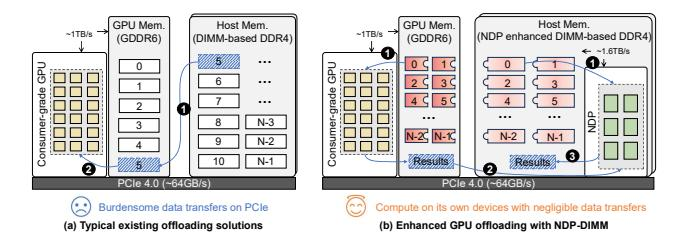

# Make LLM Inference Affordable to Everyone: Augmenting GPU Memory with NDP-DIMM

Lian Liu1, 2, 3, †, Shixin Zhao1, 2, †, Bing Li4, Haimeng Ren1,5, Zhaohui Xu1,5,

Mengdi Wang1,2, Xiaowei Li1,2,3, Yinhe Han1,2, and Ying Wang1,2, ⋈

Institute of Computing Technology, Chinese Academic of Sciences1,

University of Chinese Academy of Sciences2, Zhongguancun Laboratory3,

Institute of Microelectronics, Chinese Academy of Sciences4,

School of Information Science and Technology, ShanghaiTech University5

{liulian211, zhaoshixin18}@mails.ucas.ac.cn libing2024@ime.ac.cn {renhm2022, xuzhh12022}@shanghaitech.edu.cn

{wangmengdi, lxw, yinhes, wangying2009}@ict.ac.cn

Abstract—The billion-scale Large Language Models (LLMs) necessitate deployment on expensive server-grade GPUs with large-storage HBMs and abundant computation capability. As LLM-assisted services become popular, achieving cost-effective LLM inference on budget-friendly hardware becomes the current trend. This has sparked extensive research into relocating LLM parameters from expensive GPUs to external host memory. However, the restricted bandwidth between the host and GPU memory limits the inference performance of existing solutions.

This work introduces Hermes, a budget-friendly system that leverages the near-data processing units (NDP) within commodity DRAM DIMMs to enhance the performance of a single consumergrade GPU, achieving efficient LLM inference. We recognize that the inherent activation sparsity in LLMs naturally divides weight parameters into two categories, termed "hot" and "cold" neurons, respectively. Hot neurons, which consist of only approximately 20% of all weight parameters, account for 80% of the total computational load. In contrast, cold neurons make up the other 80% of parameters but are responsible for just 20% of the computational workload. Leveraging this observation, we propose a heterogeneous computing strategy: mapping hot neurons to a single computation-efficient GPU without large-capacity HBMs, while offloading cold neurons to NDP-DIMMs, which offer large memory size but limited computation capabilities. In addition, the dynamic nature of activation sparsity necessitates a real-time partition of hot and cold neurons and adaptive remapping of cold neurons across multiple NDP-DIMM modules. To tackle these issues, we introduce a lightweight predictor that ensures optimal real-time neuron partition and adjustment between GPU and NDP-DIMMs. Furthermore, we utilize a window-based online scheduling mechanism to maintain load balance among multiple NDP-DIMM modules. In summary, Hermes facilitates the deployment of LLaMA2-70B on consumer-grade hardware at a rate of 13.75 tokens/s and realizes an average 75.24× speedup over the state-of-the-art offloading-based inference system on popular LLMs.

## I. INTRODUCTION

Large Language Models (LLMs) have gained significant importance and widespread attention. Open-source models like OPT, LLaMA, and Qwen series [1], [57], [63], as well as proprietary models such as GPT-4 and Claude [2], [5], exhibit remarkable performance in a variety of tasks including code

Fig. 1. (a) Existing offloading solutions view host memory as the augmented memory, but cause burdensome data transfer on PCIe. (b) Partitioning the weight matrix in each layer, and utilizing NDP-DIMMs to handle poor computation intensity parts, only introduces negligible data transfer.

generation [9], [18], machine translation [24], [30], and chatbots [19], [42], etc. Nevertheless, extremely powerful LLMs with billions of parameters often require server-grade GPUs with large-capacity HBMs, making them cost-prohibitive for many applications. For example, deploying LLaMA2-70B locally using TensorRT-LLM [41] requires five NVIDIA A100-40GB-SXM4 GPUs, totaling over \$50,000.

To investigate the development of cost-effective LLM inference systems, researchers have shifted their focus to more budget-friendly hardware, such as consumer-grade GPUs. Despite these GPUs' significant computation capability, such as 1321 Tensor TOPS in NVIDIA RTX 4090, they suffer from limited graphic memory size. This limitation renders them unsuitable for deploying LLMs with billions of parameters. To this end, researchers use offloading strategies [23], [45], [50], transferring large portions of LLM parameters to DIMM (Dual-Inline Memory Module)-based host memory. As depicted in Figure 1a, existing offloading solutions view host memory as the augmented memory space for GPUs to enable LLMs, and parameters stored in host memory need to be accessed via PCIe. This results in substantial data transfers on PCIe. However, due to more than  $15 \times$  bandwidth gap between the PCIe and the internal GPU memory, about 99% of the overall LLM runtime in these offloading solutions is attributed to the data transfers on PCIe.

It is essential to minimize the data loading for weight parameters to ease the burden on PCIe. Thus, existing works [34],

†Both authors contributed equally to this research

&lt;sup>™Corresponding author

[53], [59] utilize the activation sparsity to reduce the required data loading. Since the activation functions such as ReLU in LLMs can zero out specific activation values, the corresponding parameters that are expected to be computed with these zero activations do not need to be loaded either, as illustrated in Figure 3. According to the activation sparsity, weight parameters in LLMs can be further categorized into hot and cold neurons1 . Our evaluation indicates that around 20% of neurons, referred to as "hot neurons", are responsible for 80% of the computations, whereas the remaining 80% of neurons, known as "cold neurons", account for only 20% of the computations. This suggests that the computation intensity of hot neurons is 16× higher than that of cold neurons. Consequently, it is natural to store hot neurons in GPU memory and offload cold neurons to host memory to effectively mitigate data loading costs [34]. Despite these optimizations, data transfers on PCIe still dominate the inference procedure, accounting for 90% of the total inference latency of OPT-66B, as they constitute a large part of the total LLM work-set.

According to our observation, the cold neurons offloaded on host memory require large storage but have poor computation intensity. As a result, we are motivated to utilize near-data processing (NDP) units based on DRAM DIMMs to provide the least-required computation capability for cold neurons to avoid their movement. As illustrated in Figure 1b, we can leverage the NDP units and GPU cores to conduct computations for cold and hot neurons, respectively. As the computation results only take a few KBs, the data transfer cost in step 2 is negligible. Note that we use NDP-DIMMs, instead of high-performance but expensive alternatives such as HBM-PIM and AiM [11], [16], [20], [43], as the augmented memory to build the budget-friendly system for local deployment.

Yet, attaining high-performance but affordable LLM inference using a basic NDP-DIMM enhanced GPU system is challenging due to the limited computational resources in NDP-DIMMs. Two primary challenges must be resolved:

- 1. Deciding the optimal neuron partition. First, the criteria for dividing hot and cold neurons between GPU and NDP-DIMMs are crucial for computational efficiency. For instance, if only the least active neurons are predicted as "hot", this will stress the limited GPU memory size. Conversely, allocating frequently activated neurons to the "cold" region will burden the computation-limited NDP-DIMMs with excessive computation. Therefore, determining the optimal neuron partition strategy is essential. However, due to the input-specific nature, the hot/cold neuron partition cannot be completely predetermined. It necessitates an accurate but lightweight online prediction to achieve real-time adjustment for hot/cold neuron partition with minimal migration cost.
- 2. Exploiting the limited computation capability of multiple NDP-DIMMs. In contrast to the provided hundreds of TFLOPS of a single GPU, the computation capability is constrained to hundreds of GFLOPS [6], [14], [26], [68] on

NDP-DIMMs. Consequently, even are used to process the infrequently activated neurons, NDP-DIMMs still bottleneck the inference performance. Thus, it is crucial to fully unleash NDP units for efficient computing. Specifically, as we need to use multiple DIMMs together to support the large-scale LLMs, computational loads on each NDP-DIMM are expected to be balanced. However, due to the dynamics of activated neurons, some NDP-DIMMs are overburdened while others remain underutilized during inference. Therefore, the main challenge is to achieve online scheduling for computational load balance among NDP-DIMMs.

To address the aforementioned challenges, we introduce Hermes, an innovative and budget-friendly inference system that uses NDP-DIMMs to enhance both the memory capacity and processing capability of a single consumer-grade GPU. On one hand, we address the optimal neuron partition in two phases. First, we formalize the problem as an integer linear programming (ILP) issue and employ an offline solver to help determine the optimal partition based on the profiled data. Then, utilizing the distinct distribution patterns of hot and cold neurons, we develop a lightweight online predictor to manage online cold/hot neuron partition. This approach bypasses the expensive MLP-based predictor used in prior studies [52], [54], [59], enabling real-time migration of hot and cold neurons. On the other hand, to address load imbalance issues among multiple NDP-DIMMs, we exploit the token-wise similarity inherent in LLM. In detail, we propose a windowbased online scheduling strategy, which utilizes the neuron activity of adjacent tokens to online remap cold neurons across multiple NDP-DIMMs, achieving load balance.

In a nutshell, our contributions are as follows:

- 1) We propose a novel system, Hermes, which takes advantage of the cold/hot distribution in LLM inference and augments consumer-grade GPU with NDP-DIMMs to achieve high-performance and economic LLM inference.
- 2) We propose a two-step solution to achieve the optimal cold/hot neuron partition for Hermes. We first formulate an ILP problem and utilize an offline solver to find the original optimal partition, and further implement a lightweight online predictor to guide the online migration of hot and cold neurons during LLM inference.
- 3) We develop a window-based online scheduling strategy to achieve load balance among multiple computationlimited NDP-DIMMs, effectively improving the overall hardware utilization.
- 4) Compared to existing offloading-based inference systems FlexGen and Deja Vu, Hermes achieves a speedup of 148.98× and 75.24×, respectively.

