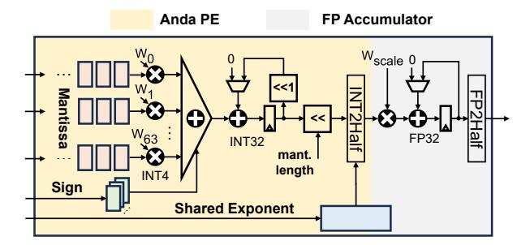

# A. Bit-plane Data Layout Scheme

Anda-based activation values feature a variable-length mantissa, necessitating careful data layout arrangement in the onchip buffer to maintain regular memory access. Otherwise, irregular memory accesses caused by an ineffective data layout could completely undo the benefits provided by Anda.

To tackle these challenges, we propose the bit-plane data layout scheme as illustrated in Fig. 10. Unlike prior fixedlength data arrangement methods [30], [41], [61], [67], which treat each FP data element as an atomic unit, our approach separates and reorganizes the sign bit, mantissa, and exponent of FP numbers within grouped data blocks from a bit-plane view. A transposed data arrangement [48] is introduced where bits of the same significance across multiple numbers are packed together to keep the regularity of memory access. Taking the common memory bank word width into account, 64 Anda-type values are grouped to implement the bit-plane data layout scheme. As shown in Fig. 10, Group #0 shows the layout for 4-bit mantissa Anda numbers, while Group #1 presents the arrangement for 5-bit mantissa Anda numbers. The variable mantissa length only reflects on the different memory address depths, without impacting memory bandwidth utilization, and can be easily managed during address generation. Hence, in both cases, the bit-plane data layout efficiently accommodates these formats with varying lengths, maintaining consistent access patterns. Furthermore, the bitplane organization inherently facilitates parallel processing, inspiring the design of a novel processing unit for the Anda data format to enhance LLM inference in both computing and energy efficiency.

#### B. Anda-enhanced Bit-serial Processing Unit

The Anda-enhanced bit-serial processing unit (APU), as depicted in Fig. 11, serves as the key computational element of the Anda architecture, embracing Anda processing element (PE) and an FP accumulator. Anda PE efficiently executes dot-product operations between variable-length Anda format activations and INT weights, seamlessly integrating with the bit-plane data layout scheme to enhance performance. The FP

Fig. 11. The architecture of Anda-enhanced bit-serial processing unit, which enables efficient dot-product operations for Anda activations and INT weights.

accumulator follows the PE to complete the APU functionality by accumulating the cross-group dot-product results.

The computation process begins with the Anda PE storing the sign and exponent in internal registers. Concurrently, the INT weights are stored in the PE using a double-buffer design, allowing overlapped weight loading and computation to minimize loading latency. The PE then loads the bit-plane mantissas and performs computations with the INT weights. By employing bit-serial processing of mantissas, the Anda PE can adapt to Anda format data of varying lengths without additional hardware overhead.

To further optimize hardware efficiency, the Anda PE implements a first-element-then-bit-plane reduction pattern. In this approach, a partial sum is obtained for each bit-plane by accumulating all elements within that bit-plane using an adder tree. This method reduces storage requirements by storing only one partial sum per bit-plane instead of all intermediate results. It also minimizes data movement and processing overhead by performing subsequent shift operations only on the single partial sum rather than individual elements. Furthermore, it significantly reduces hardware resource consumption by using a single shared accumulator for all bit-plane accumulations.

The bit-plane partial sums are then sequentially accumulated to complete the dot-product operation. Upon completion, the Anda PE dynamically shifts the dot-product result based on the Anda mantissa length and converts it to FP16 using the shared exponent. The result is then multiplied with the groupwise scale factor of the INT weights, followed by crossgroup accumulation using the FP accumulator. Finally, the accumulated FP32 result is converted to FP16 for output.

