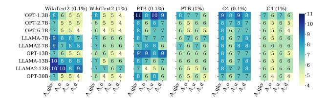

# A. Experimental Setup

**LLM Benchmarks:** To demonstrate the wide applicability of our proposed method, we benchmark various open-source LLMs using PyTorch and Hugging Face libraries. We evaluate their performance on WikiText-2 [60], Penn Treebank (PTB) [59], and C4 [65] datasets. The models used in our benchmarks range in size from 1.3B to 30B parameters and are selected from OPT [86], LLaMA [72], and LLaMA2 [73] families, enabling the effectiveness assessment of our method across different model scales and architectures.

Quantization Baselines: To validate the model accuracy when replacing FP activations with the proposed Anda format, we compare against the following SotA competitors: (a) Full-precision baseline where both activations and weights are represented in FP16. (b) Weight-only PTQ baseline using Omniquant [66] with W4A16g128 scheme, which uses 4-bit weight quantization with a group size of 128. (c) Lossless BFP baseline that adopts FIGNA's [32] approach of using extended mantissa lengths to maintain model accuracy. (d) Aggressive BFP baseline that employs 4-bit mantissa to activations using VS-Quant [12] quantization scheme. For fair comparison in the PTQ scenario, we directly apply VS-Quant's 4-bit data format without the typically required costly retraining. For baseline (c), (d), and our Anda method, we use baseline (b)

TABLE II

COMPARISON OF COMPUTATION METHODS OF WEIGHT-ONLY QUANTIZED LLMS

KEY METRICS: PERPLEXITY (BLACK, LOWER IS BETTER), ACCURACY DROP (RED) AND BOPS SAVING (GREEN)

|           |                                                                                   | OPT-1.3B                                                                                                                                                                                                                               | OPT-2.7B                                                                                                                                                                                          | OPT-6.7B                                                                                                                                                                                                      | LLaMA-7B                                                                                                                                                                                                 | LLaMA2-7B                                                                                                                                                                          | OPT-13B                                                                                                                                                                                                    | LLaMA-13B                                                                                                                                                                                                  | LLaMA2-13B                                                                                                                                                                                                             | OPT-30B                                                                                                                                                                                                        |
|-----------|-----------------------------------------------------------------------------------|----------------------------------------------------------------------------------------------------------------------------------------------------------------------------------------------------------------------------------------|---------------------------------------------------------------------------------------------------------------------------------------------------------------------------------------------------|---------------------------------------------------------------------------------------------------------------------------------------------------------------------------------------------------------------|----------------------------------------------------------------------------------------------------------------------------------------------------------------------------------------------------------|------------------------------------------------------------------------------------------------------------------------------------------------------------------------------------|------------------------------------------------------------------------------------------------------------------------------------------------------------------------------------------------------------|------------------------------------------------------------------------------------------------------------------------------------------------------------------------------------------------------------|------------------------------------------------------------------------------------------------------------------------------------------------------------------------------------------------------------------------|----------------------------------------------------------------------------------------------------------------------------------------------------------------------------------------------------------------|
| WikiText2 | FP16 Omniquant [66] FIGNA [32] VS-Quant*[39] Ours (0.1%) Ours (1%) | $ \begin{vmatrix} 14.62 \\ 14.88_{1.00\times}^{0.00\%} \\ 14.90_{1.23\times}^{-0.13\%} \\ 19.04_{-0.00\times}^{-27.96\%} \\ 14.91_{-0.20\%}^{-0.20\%} \\ 14.92_{-0.74\%}^{-0.74\%} \\ 14.92_{-0.95\times}^{-0.74\%} \\ \end{vmatrix} $ | $\begin{array}{c} 12.47 \\ 12.65_{1.00\times}^{0.00\%} \\ 12.65_{1.23\times}^{0.00\%} \\ 16.41_{-22.91\%}^{-22.91\%} \\ 12.66_{2.91\times}^{-0.07\%} \\ 12.76_{3.25\times}^{-0.86\%} \end{array}$ | $\begin{array}{c} 10.86 \\ 10.96^{0.00\%}_{1.00\%} \\ 10.96^{0.00\%}_{1.23\%} \\ 12.24^{-11.68\%}_{-10.95} \\ 10.95^{0.09\%}_{3.10\%} \\ 10.99^{-0.27\%}_{3.31\%} \end{array}$                                | $\begin{array}{c} 5.68 \\ 5.77^{0.00\%}_{1.00\%} \\ 5.78^{-0.17\%}_{1.23\%} \\ 7.45^{-29.12\%}_{4.00\%} \\ 5.78^{-0.17\%}_{1.99\%} \\ 5.82^{-0.87\%}_{2.56\%} \end{array}$                               | $\begin{array}{c} 5.47 \\ 5.59^{0.00\%}_{1.00\%} \\ 5.60^{-0.18\%}_{1.23\%} \\ 8.26^{-47.76\%}_{4.00\%} \\ 5.60^{-0.18\%}_{0.18\%} \\ 5.65^{-1.07\%}_{2.56\%} \end{array}$         | $\begin{array}{c} 10.13 \\ 10.20^{0.00\%}_{1.00\times} \\ 10.22^{-0.20\%}_{1.23\times} \\ 11.63^{-13.98\%}_{4.00\times} \\ 10.21^{-0.10\%}_{2.86\times} \\ 10.30^{-0.98\%}_{3.20\times} \end{array}$       | $\begin{array}{c} 5.09 \\ 5.17^{0.00\%}_{1.00\times} \\ 5.18^{-0.19\%}_{1.23\times} \\ 6.36^{-23.02\%}_{4.00\times} \\ 5.18^{-0.19\%}_{1.88\times} \\ 5.23^{-1.16\%}_{2.59\times} \end{array}$             | $\begin{array}{c} 4.88 \\ 4.95_{1.00\times}^{0.00\%} \\ 4.96_{1.23\times}^{-0.20\%} \\ 6.43_{-29.90\%}^{-29.90\%} \\ 4.96_{1.80\times}^{-0.20\%} \\ 5.00_{2.44\times}^{-1.01\%} \end{array}$                           | $\begin{array}{c} 9.56 \\ 9.62^{0.00\%}_{1.00\%} \\ 9.61^{0.10\%}_{1.23\%} \\ 10.67^{4.00\%}_{4.00\%} \\ 9.60^{0.20\%}_{3.10\%} \\ 9.71^{-0.94\%}_{3.31\%} \end{array}$                                        |
| PTB       | FP16 Omniquant [66] FIGNA [32] VS-Quant*[39] Ours (0.1%) Ours (1%) | $ \begin{vmatrix} 16.96 \\ 17.40^{0.00\%}_{1.00\%} \\ 17.41^{-0.06\%}_{1.23\%} \\ 25.64^{-47.36\%}_{4.00\%} \\ 17.41^{-0.06\%}_{1.64\%} \\ 17.57^{-0.98\%}_{2.31\%} \end{vmatrix} $                                                    | $\begin{array}{c} 15.12 \\ 15.28_{1.00\%}^{0.00\%} \\ 15.28_{1.23\%}^{0.00\%} \\ 21.09_{-27.55\%}^{-27.55\%} \\ 15.29_{2.13\%}^{-0.07\%} \\ 15.42_{2.70\%}^{-0.91\%} \end{array}$                 | $\begin{array}{c} 13.09 \\ 13.25_{1.00\%}^{0.00\%} \\ 13.26_{1.03\%}^{-0.08\%} \\ 13.26_{1.23\%}^{-0.08\%} \\ 15.50_{-0.08\%}^{-16.98\%} \\ 13.26_{2.23\%}^{-0.08\%} \\ 13.35_{2.86\%}^{-0.75\%} \end{array}$ | $\begin{array}{c} 8.80 \\ 8.97_{1.00\%}^{0.00\%} \\ 8.98_{-0.11\%}^{-0.11\%} \\ 8.98_{1.23\%}^{-0.11\%} \\ 15.78_{-0.11\%}^{-75.92\%} \\ 8.98_{2.21\%}^{-0.11\%} \\ 9.05_{2.54\%}^{-0.89\%} \end{array}$ | $\begin{array}{c} 20.82 \\ 21.52_{1.00\%}^{0.00\%} \\ 21.52_{1.23\%}^{0.00\%} \\ 53.46_{-148.42\%}^{-148.42\%} \\ 21.48_{2.19\%}^{0.20\%} \\ 21.61_{2.39\%}^{-0.42\%} \end{array}$ | $\begin{array}{c} 12.34 \\ 12.46_{1.00 \times}^{0.00 \%} \\ 12.47_{1.23 \times}^{-0.08 \%} \\ 14.47_{-16.13 \%}^{-16.13 \%} \\ 12.47_{1.84 \times}^{-0.08 \%} \\ 12.58_{-0.96 \%}^{-0.96 \%} \end{array}$  | $\begin{array}{c} 8.07 \\ 8.14_{1.00\%}^{0.00\%} \\ 8.15_{-0.12\%}^{-0.12\%} \\ 8.15_{1.23\%}^{-54.05\%} \\ 12.54_{4.00\%}^{-54.05\%} \\ 8.15_{-0.12\%}^{-0.12\%} \\ 8.22_{-0.98\%}^{-0.98\%} \end{array}$ | $\begin{array}{c} 28.93 \\ 30.19_{1.00\times}^{0.00\%} \\ 30.19_{1.23\times}^{0.00\%} \\ 49.91_{4.00\times}^{-65.32\%} \\ 30.18_{2.84\times}^{0.03\%} \\ 30.41_{2.92\times}^{-0.73\%} \end{array}$                     | $\begin{array}{c} 11.84 \\ 11.94_{1.00\%}^{0.00\%} \\ 11.95_{1.23\%}^{-0.08\%} \\ 13.47_{-4.00\%}^{-12.81\%} \\ 11.96_{2.23\%}^{-0.17\%} \\ 12.03_{2.86\%}^{-0.17\%} \end{array}$                              |
| C4        | FP16 Omniquant [66] FIGNA [32] VS-Quant*[39] Ours (0.1%) Ours (1%) | $ \begin{vmatrix} 14.72 \\ 15.03_{1.00}^{0.00\%} \\ 15.04_{1.03}^{-0.07\%} \\ 15.04_{1.23}^{-0.07\%} \\ 19.00_{4.00\times}^{-26.41\%} \\ 15.05_{1.86\times}^{-0.13\%} \\ 15.17_{2.43\times}^{-0.93\%} \end{vmatrix} $                  | $\begin{array}{c} 13.16 \\ 13.38_{1.00\%}^{0.00\%} \\ 13.38_{1.23\%}^{0.00\%} \\ 16.65_{4.00\%}^{-19.64\%} \\ 13.40_{2.11\%}^{-0.15\%} \\ 13.51_{2.86\%}^{-0.96\%} \end{array}$                   | $\begin{array}{c} 11.74 \\ 11.85_{1.00\%}^{0.00\%} \\ 11.86_{1.23\%}^{-0.08\%} \\ 13.13_{-10.80\%}^{-10.80\%} \\ 11.87_{-2.23\%}^{-0.17\%} \\ 11.97_{-1.01\%}^{-1.01\%} \end{array}$                          | $\begin{array}{c} 7.08 \\ 7.21^{0.00\%}_{1.00\%} \\ 7.22^{-0.14\%}_{1.23\%} \\ 8.89^{-23.30\%}_{4.00\%} \\ 7.22^{-0.14\%}_{-0.14\%} \\ 7.28^{-0.97\%}_{2.70\%} \end{array}$                              | $\begin{array}{c} 6.97 \\ 7.12^{0.00\%}_{1.00\%} \\ 7.12^{0.00\%}_{1.03\%} \\ 10.36^{-45.51\%}_{4.00\%} \\ 7.13^{-0.14\%}_{2.04\%} \\ 7.19^{-0.98\%}_{2.67\%} \end{array}$         | $\begin{array}{c} 11.20 \\ 11.29_{1.00\%}^{0.00\%} \\ 11.29_{1.00\%}^{0.00\%} \\ 11.29_{1.23\%}^{0.10\%} \\ 12.64_{4.00\%}^{-11.96\%} \\ 11.30_{2.23\%}^{-0.09\%} \\ 11.37_{2.86\%}^{-0.71\%} \end{array}$ | $\begin{array}{c} 6.61 \\ 6.69_{1.00\%}^{0.00\%} \\ 6.70_{1.23\%}^{-0.15\%} \\ 7.85_{4.00\%}^{-17.34\%} \\ 6.70_{2.16\%}^{-0.15\%} \\ 6.74_{2.70\%}^{-0.75\%} \end{array}$                                 | $\begin{array}{c} 6.47 \\ 6.56_{1.00\times}^{0.00\%} \\ 6.57_{-0.15\%}^{-0.15\%} \\ 8.35_{-27.29\%}^{-27.29\%} \\ 8.57_{-0.15\%}^{-0.15\%} \\ 6.57_{-0.14\times}^{-0.91\%} \\ 6.62_{2.70\times}^{-0.91\%} \end{array}$ | $\begin{array}{c} 10.69 \\ 10.75_{1.00}^{0.00\%} \\ 10.75_{1.00}^{0.00\%} \\ 10.75_{1.23}^{0.00\%} \\ 11.91_{-4.00\times}^{-10.79\%} \\ 10.76_{2.31\times}^{-0.99\%} \\ 10.85_{-0.93\%}^{-0.93\%} \end{array}$ |

\* For fair comparison in the PTQ scenario, we directly apply VS-Quant's 4-bit data format without the costly retraining typically required by this method.

as the starting point, and the group size of BFP activations is uniformly set to 64.

Hardware Baselines: To further highlight the advantages of the Anda scheme, we compare the Anda hardware architecture against several SotA platforms: (a) FP-FP: A spatial accelerator based on FP16 Tensor Cores [84], representative of current GPU architectures [69]. (b) FP-INT: An enhanced Tensor Core-based accelerator featuring specialized FP-INT computation units. (c) iFPU [42]: A spatial accelerator employs bit-serial computation for INT weights and dynamically converts FP activations to BFP format with extended mantissa before computation. (d) FIGNA [32]: An evolution of (c) leveraging bit-parallel computation and optimized mantissa length in BFP to enhance computational efficiency. All systems are configured to have the same operating clock frequency of 285 MHz, equivalent peak throughput, and on-chip memory resources to ensure a fair comparison [68].

**Evaluation Methodologies**: Our comprehensive assessment encompasses both model accuracy and hardware efficiency, where we focus on optimizing the dominated FP-INT GeMM operations, keeping the others, e.g., KV cache [56], in FP16. For model accuracy, we employ three key metrics: (a) perplexity (PPL) [33] using a 2048 sequence length, where lower values indicate higher model accuracy; (b) relative accuracy loss of FIGNA, VS-Quant, and our Anda method compared to Omniquant, which demonstrates the accuracy drop during BFP conversion in the deployment process; and (c) bit-level operations (BOPs) [1] reduction, quantifying the decrease in theoretical model computation. Here we consider one FP16-INT4 operation equivalent to 64 BOPs, as this approximates the bit-level computational complexity of an FP16-INT4 multiply-accumulate operation. Hardware performance evaluation spans two levels: at the PE level, we analyze area and power along with corresponding efficiencies; at the system

level, we compare Anda with baseline architectures, focusing on speedup and energy efficiency, when performing FP-INT GeMMs where the FP activations can be drop-in replaced by Anda data format. In alignment with prior studies [27], [32], [42], [79], system-level evaluation uses LLMs with a batch size of 1 and the maximum acceptable input sequence length under the WikiText2 dataset. PE-level baselines and Anda system are implemented in SystemVerilog RTL and synthesized using Cadence Genus [6] at 16nm technology node, operating at a clock frequency of 285 MHz and 0.8 V nominal voltage. Power evaluation is performed using value change dump (VCD) files generated from synthesized netlist simulations and analyzed by Genus. A cycle-accurate simulator, rigorously verified against functional simulations, assesses the energy and performance of Anda and baseline accelerators. HBM2 memory is modeled with an access energy of 3.9 pJ/bit and a bandwidth of 256 GB/s [36].

#### B. Inference Accuracy

We evaluate inference accuracy on validation datasets using the Anda format explored by adaptive precision search algorithm across all benchmarks. For each benchmark, 128 random sequences of length 2048 are sampled from the training dataset for calibration [66]. We also limit the adaptive precision search algorithm to 32 iterations. Note that Anda is capable of adapting mantissa bits according to the user-defined accuracy tolerance. Therefore, we report results for two accuracy constraints: 0.1% representing minimal loss and 1% representing acceptable loss for most scenarios.

Table II compares Anda's performance against baseline quantization methods, where PPL values are shown in black, the relative accuracy drop is displayed in red, and the BOPs reduction is presented in green. Note that the occasional slight exceedance of the validation accuracy loss over the

Fig. 14. Identified best precision combinations of various LLMs on different datasets given different accuracy tolerances.

constraint is normal for Anda due to differences between the calibration and validation datasets. The results demonstrate that Anda achieves significant BOPs reductions while maintaining accuracy close to the target constraints. For instance, on the WikiText2 dataset, Anda achieves 1.80~3.10× and 2.44~3.31× BOPs reduction under 0.1% and 1% accuracy loss, respectively, flexibly meeting varying accuracy-efficiency requirements. Compared to FIGNA, which yields a  $1.23\times$ BOPs reduction with shorter bit-width multiplication, Anda further achieves 1.46~2.69× BOPs reductions at similar accuracy loss levels by leveraging different mantissa lengths for activation tensors In contrast to VS-Quant, a BFP method requiring retraining, directly deploying it leads to severe accuracy degradation despite achieving 4× BOPs reduction. For example, VS-Quant suffers a 27.96% accuracy loss on OPT-1.3B with WikiText2. Anda, however, achieves a much better accuracy-efficiency balance, obtaining nearly 3× BOPs reduction with only a 0.74% accuracy loss in the same scenario. Anda's consistent performance improvements across various models and datasets showcase the effectiveness and robust generalization of our adaptive precision search algorithm.

Fig. 14 presents the best precision combination driven by 0.1% and 1% relative accuracy loss, revealing the patterns of quantization precision choices for different activation parts across models. The precision combinations vary under different accuracy constraints, showing the importance of the adaptive precision combination search algorithm in automatically adjusting the mantissa lengths based on LLM module sensitivity. Examining the module types reveals that  $A_{qkv}$ , involved with the Q, K, and V projection layers, prefers higher precision due to higher sensitivity, while  $A_u$  and  $A_d$  in the feed-forward layers, especially  $A_d$ , can be more aggressively quantized to lower precision, demonstrating higher tolerance.

