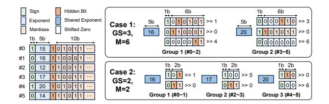
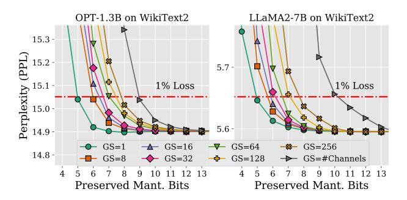
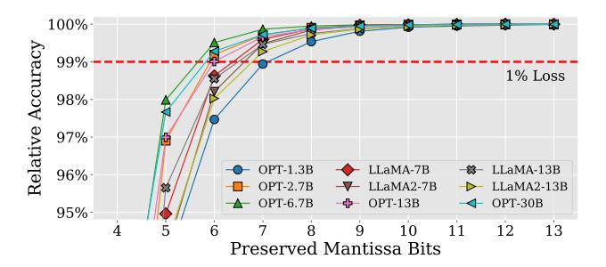
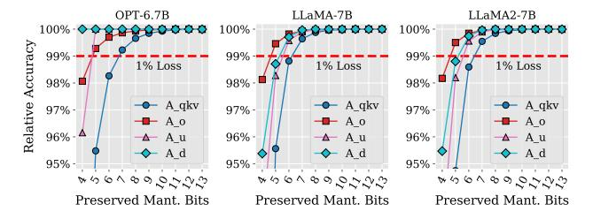

# *A. Weight-only Quantized LLMs*

Weight-only quantization [8], [17], [24], [34], [35], [47], [51], [64], [66], [78], [81] has emerged as a pivotal technique for efficient LLM inference. Unlike weight-activation quantization [12], [16], [52], [79], [89], which reduces precision for both weights and activations, weight-only quantization focuses solely on compressing model parameters using a much more aggressive quantization scheme.

Fig. 3 illustrates the architecture of a weight-only quantized LLM, composed of a series of Transformer blocks that each contains an attention layer and a feed-forward layer. The light blue background highlights the dominant computational modules involving FP-INT GeMM operations, which can be categorized into four module types based on the positions of the FP activations: the first type involves Aqkv interacting with Wq, Wk, and Wv to compute the query (Q), key (K), value (V ) matrices, respectively; the second type involves Ao multiplying with Wo to compute the output matrix; the other two types are up-projection and down-projection modules of the feed-forward layer, respectively, involving Au and Ad with interacting to corresponding weights.

Weight-only quantized LLMs offer significant advantages in storage efficiency [62], [66]. Compared to W8A8 weight-

Fig. 4. The process of converting a set of FP16 numbers into different BFP numbers. BFP format is regulated by two key parameters: group size (GS) and mantissa length (M).

activation quantized LLMs [79], W4A16 weight-only quantized LLMs [51] achieve similar model accuracy while reducing storage requirements of model parameters by nearly half [83], making them particularly suitable for deployment on resource-constrained devices in edge computing scenarios. However, under current GPU computing schemes, computing a W4A16 FP-INT operations consumes approximately 1.7× more energy than W8A8 INT-only operations [42]. This can be explained by accessing FP activations incurs higher energy costs than INT weights [31], and FP-INT operations require complicated hardware implementations [32]. Hence, optimizing FP activations emerges as a key opportunity to improve the overall efficiency of weight-only quantized LLMs.

#### B. Block Floating Point

Reducing the computation and storage overhead of FP16 activations is crucial for optimizing the efficiency of LLMs. BFP [19] offers a promising solution by sharing exponents within groups of values, preserving dynamic range while mitigating the impact of outliers and simplifying computations. The BFP format can characterized by two key parameters: group size and mantissa length. Fig. 4 shows the process of converting FP16 tensors to BFP numbers using two different instances of the BFP format. Initially, FP16 tensors are divided into groups. Within each group, the largest exponent is selected as the shared exponent and other mantissas are right-shifted based on their exponent differences. Bits exceeding the specified mantissa length are truncated, and zero is represented by all mantissa bits being 0. As illustrated in Fig. 4, this conversion process can lead to precision loss due to mantissa truncation, with some elements becoming zero, thereby posing a significant challenge to maintaining model accuracy.

Current approaches to address this fall into two categories. On the one hand, BFP-aware training fine-tunes the model after the quantization [12]–[14], [23], [26], [39], [41], [44], [61], [85], at the expense of a costly training process, making it rather impractical for agile LLM deployment. On the other hand, direct conversion of pre-trained FP models to BFP formats [22], [23], [44], [50], [61] requires long mantissas to avoid the significant accuracy loss, which increases computation and storage overhead, diminishing the advantages of BFP. To avoid the storage of these long mantissas, methods like FIGNA [32] and [42] propose dynamic conversion to BFP during computation. This approach stores activations in FP16 format and expands to long mantissas with shared exponents

Fig. 5. LLM sensitivity to BFP group size (GS) and preserved mantissa bits.

before computations to maintain model accuracy. However, this also prevents FIGNA from obtaining activation memory footprint savings.

To avoid both costly retraining and large activation memory footprints, we seek a solution that can rapidly convert FP activations to BFP activations without retraining, while also leveraging the computational and storage advantages of BFP for LLM inference. To achieve this goal, it is necessary to explore opportunities for reduced mantissa length BFP under the unique characteristics of LLMs.

#### C. Opportunities towards Activation Optimizations

We explore opportunities for LLM activation optimization by investigating the sensitivity of model accuracy to reduced mantissa lengths in BFP formats. This study converts FP-INT GeMM activation tensors  $(A_{qkv},\ A_o,\ A_u,\ A_d)$  from FP16 to BFP format, as shown in Fig. 4. Model accuracy is evaluated using perplexity (PPL) on the WikiText2 dataset, with lower PPL indicating higher accuracy. We assume a 1% accuracy loss tolerance in practical scenarios. We aim to uncover efficient activation representations while maintaining LLM performance within acceptable limits.

Sensitivity to group size: Fig. 5 illustrates the sensitivity to shared exponent group size for two different LLM models across various mantissa lengths. The experiments reveal a clear trade-off between group size and the minimum required mantissa length to maintain model accuracy. Larger activation group sizes allow more efficient parallel computations, yet at a greater accuracy tolerance or increased mantissa lengths. Based on these observations, we select a group size of 64 for subsequent experiments, as it offers a good balance between computational efficiency and accuracy tolerance.

Sensitivity to LLM model: With this group size of 64, we continue our exploration across a wider range of recent LLMs, to derive their sensitivity to reduced mantissa lengths. Fig. 6 reveals varying sensitivities among different models. Notably, models such as OPT-2.7B, OPT-6.7B, OPT-13B, and OPT-30B are less sensitive to mantissa reduction, allowing for the direct removal of 5 mantissa bits, while other models could only tolerate the removal of 4 mantissa bits. As more mantissa bits are removed, differences in accuracy sensitivity become more pronounced. This insight inspires us to consider a variable-length BFP datatype, potentially enabling more aggressive

Fig. 6. The relative accuracy to preserved mantissa bits across various LLMs.

Fig. 7. The relative accuracy of OPT-6.7B, LLaMA-7B, and LLaMA2-7B when cutting mantissa bits on either  $A_{qkv},\,A_o,\,A_u$ , or  $A_d$  activation only.

compression in less sensitive models while employing a more conservative one for others. It also prompts us to explore whether activations in different modules within one LLM have varying sensitivities.

Sensitivity to LLM inner module: We finally explore the impact of different mantissa lengths of the activations of different modules within the same LLM. More specifically, we examine the  $A_{qkv}$ ,  $A_o$ ,  $A_u$ , and  $A_d$  modules of the OPT-6.7B, LLaMA-7B, and LLaMA2-7B models. The mantissa length of each module is swept while keeping the lengths of other modules fixed at 13 bits. Fig. 7 summarizes the results, revealing that activations from different modules have varying impacts on model accuracy across all three models.  $A_{qkv}$  consistently shows the most significant influence, while  $A_d$  demonstrates low sensitivity in OPT-6.7B but has a more pronounced effect in the LLaMA series models.

Our study reveals several key insights into the application of BFP in LLMs: (a) LLMs can maintain good performance with reduced mantissa lengths. (b) Different LLM models exhibit varying sensitivities to mantissa reduction. (c) Within a single LLM, different modules have distinct sensitivities to precision reduction. These observations motivate us to introduce the new variable-length grouped data format for FP activations, along with a methodology for post-training quantization (PTQ) and rapid selection of tolerable reduced mantissa lengths for any LLM.

