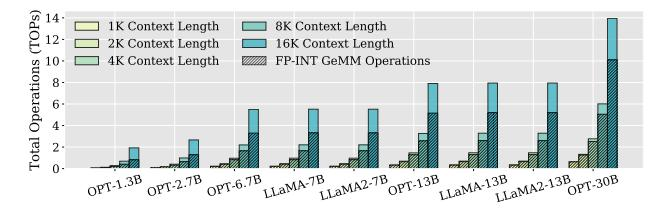

# Anda: Unlocking Efficient LLM Inference with a Variable-Length Grouped Activation Data Format

Chao Fang†,‡, Man Shi‡,\*, Robin Geens‡, Arne Symons‡, Zhongfeng Wang†,\*, Marian Verhelst‡

†School of Electronic Science and Engineering, Nanjing University, China ‡ESAT-MICAS, KU Leuven, Belgium
Email: fantasysee@smail.nju.edu.cn, zfwang@nju.edu.cn, {man.shi, robin.geens, arne.symons, marian.verhelst}@kuleuven.be

Abstract—The widely-used, weight-only quantized large language models (LLMs), which leverage low-bit integer (INT) weights and retain floating-point (FP) activations, reduce storage requirements while maintaining accuracy. However, this shifts the energy and latency bottlenecks towards the FP activations that are associated with costly memory accesses and computations. Existing LLM accelerators focus primarily on computation optimizations, overlooking the potential of jointly optimizing FP computations and data movement, particularly for the dominant FP-INT GeMM operations in LLM inference.

To address these challenges, we investigate the sensitivity of activation precision across various LLM modules and its impact on overall model accuracy. Based on our findings, we first propose the Anda data type: an adaptive data format with group-shared exponent bits and dynamic mantissa bit allocation. Secondly, we develop an iterative post-training adaptive precision search algorithm that optimizes the bit-width for different LLM modules to balance model accuracy, energy efficiency, and inference speed. Lastly, a suite of hardware optimization techniques is proposed to maximally exploit the benefits of the Anda format. These include a bit-plane-based data organization scheme, Anda-enhanced processing units with bit-serial computation, and a runtime bit-plane Anda compressor to simultaneously optimize storage, computation, and memory footprints. Our evaluations on FP-INT GeMM operations show that Anda achieves a 2.4× speedup, 4.0 $\times$  area efficiency, and 3.1 $\times$  energy efficiency improvement on average for popular LLMs including OPT, LLaMA, and LLaMA-2 series over the GPU-like FP-FP baseline. Anda demonstrates strong adaptability across various application scenarios, accuracy requirements, and system performance, enabling efficient LLM inference across a wide range of deployment scenarios.

#### I. INTRODUCTION

Large language models (LLMs) [11], [63], [70], [72], [86] have demonstrated remarkable proficiency in a wide array of natural language processing tasks, including text generation, question answering, and automatic summarization. The extraordinary success of LLMs can be attributed to the scaling law [3], which posits that performance improves dramatically with the ever-increased model size, training data volume, and computational resources. The evolution of the GPT series [5], [38], [63] on model size strikingly illustrates the scaling law: while GPT-1 comprised a modest 117 million parameters, its successor GPT-4 is speculated to encompass over a trillion parameters. However, the exponential growth in LLM model sizes has created substantial deployment challenges, imposing enormous demands on storage and computational resources.

\*Corresponding author

Fig. 1. Overview of the drop-in replacement for FP activations using the variable-length grouped Anda data type via a one-shot offline calibration process. This enables online variable-precision LLM inference, significantly improving speed and energy efficiency through the adaptive precision combination search algorithm and the Anda-aware architecture.

Fig. 2. Proportion of FP-INT GeMM operations in weight-only quantized LLMs across varying model sizes and context lengths for text generation tasks. FP-INT GeMMs dominate (>90%) in prevalent sub-4K token applications and remain significant for 10K+ sequences.

To address these challenges, quantization techniques [12], [16], [24], [51], [52], [66], [78] have been widely adopted in LLMs to reduce memory footprint and lower deployment costs. To maximally shrink the model size, the most common strategy for LLMs today is weight-only quantization [8], [17], [24], [34], [35], [47], [51], [64], [66], [78], [81], which aggressively lowers the precision of the weights while maintaining high precision for activations due to the presence of outliers [16], [77]. In particular, the widely adopted W4A16 scheme [24], [66], which quantizes weights into 4-bit integers (INT4) while retaining activations in 16-bit floating-point format (FP16), significantly reduces memory requirements and bandwidth, lowering GPU memory usage by nearly 4× [83] and facilitating deployment to smaller devices [51], [62].

With the increasing importance of weight-only quantization, FP-INT GeMM operations [32] have become indispensable in LLM inference. As illustrated in Fig. 2, FP-INT GeMMs constitute a significant portion of the computational workload across various weight-only quantized LLMs and context lengths in text generation tasks. They dominate in typical

applications with sequences under 4K tokens, comprising over 90% of operations on average, and remain substantial even for context lengths exceeding 10K tokens in applications from LongBench [4]. Such prevalence highlights the urgent need to optimize FP-INT GeMMs for efficient LLM inference.

NVIDIA's new FP-INT GeMM kernel [62], as well as some specialized GPU kernels [24], [35], [57], [78], are a consequence of this evolution. However, these optimized GPU kernels still rely on using FP units by converting the INT weights to FP values for execution in FP GeMM operators [52]. Efforts have been made to develop dedicated FP-INT arithmetic units [32], while the additional costs of exponent alignment and normalization persist, resulting in complicated hardware implementation. To reduce hardware cost, another optimization approach is to convert the FP activations to a block floating point (BFP) data format for computation [13], [19], [44]. Since grouped BFP elements share an exponent, the overhead of exponent alignment and normalization within a group disappears, simplifying the operation to INT arithmetic. However, to mitigate accuracy loss when converting FP activations to BFP format on a pre-trained network, costly retraining [12]–[14], [26], [39], [44], [61], [85] is required, hindering agile LLM deployment. Alternatively, accuracy can be preserved by using a large mantissa field conversion [32], [42], but this significantly increases the energy consumption due to computational and memory access overhead of the additional bits.

In summary, processing FP activations remains a major bottleneck in weight-only quantized LLM inference, and existing methods struggle to balance model accuracy, computational efficiency, and energy consumption. To overcome the above limitations, we propose Anda to unlock efficient LLM inference. Anda introduces a novel variable-length grouped activation data format, coupled with the algorithm innovation and specialized hardware optimizations. As shown in Fig. 1, Anda first employs a fast, training-free adaptive precision search algorithm during compile time, using the same calibration data as post-training weight-only quantization [25]. Guided by userdefined accuracy constraints, our one-shot process identifies the desired mantissa bit length, which instructs the activation precision across various LLM modules during inference. Combining the flexible Anda data format with our specialized hardware architecture allows running these dominant FP-INT GeMM operations at lower precision, significantly improving inference speed and energy efficiency for weight-only quantized LLMs. More concretely, our contributions are as follows:

- We investigate the potential of BFP activation quantization across popular LLM models within different modules. Based on these insights, we propose Anda: a variable-length grouped data format with shared exponents and adjustable mantissa widths for activations.
- We develop an adaptive search algorithm to optimize the mantissa widths for different LLM modules without retraining. This algorithm balances model accuracy, energy efficiency, and inference speed based on a user-defined accuracy loss tolerance.

Fig. 3. Illustration of the architecture for a weight-only quantized LLM model.

• We design an efficient Anda-aware hardware architecture featuring (a) a bit-plane-based data layout scheme in memory, (b) Anda-enhanced bit-serial processing units, and (c) a runtime bit-plane data compressor. Extensive evaluations of the Anda system across popular LLMs demonstrate an average improvement in processing speed of 2.4×, area efficiency of 4.0× and energy efficiency of 3.1× compared to existing SotA hardware.

The paper is organized as follows: Sec. II reviews the benefits and remaining bottlenecks of weight-only quantized LLMs and BFP formats, and quantifies the sensitivity of LLM inference accuracy to the shared exponents and reduced mantissas sizes. Based on these findings, Sec. III features the proposed Anda data format and presents the algorithm to rapidly optimize mantissa length under given accuracy constraints. Next, an Anda-optimized hardware architecture is proposed in Sec. IV, which allows us to derive system-level gains in Sec. V and benchmark it against the SotA solutions. Sec. VII concludes the paper.

