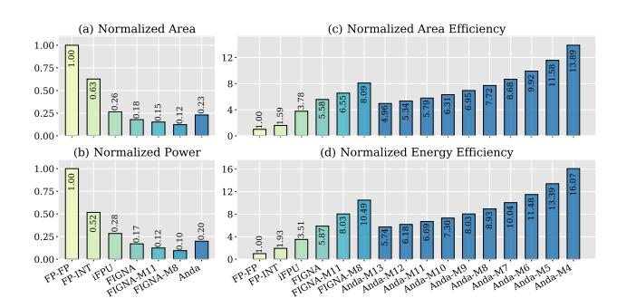

# C. PE-level Evaluation

We quantitatively compare the proposed Anda PE with common FP-FP units [58], enhanced FP-INT units, and dedicated PE units from iFPU [42] and FIGNA [32], respectively. We also introduce FIGNA-M11 and FIGNA-M8 as baselines, representing bit-parallel PEs with 11-bit and 8-bit mantissas that achieve 0.1% and 1% accuracy degradation targets, respectively, based on the results from Fig. 14. Here, M(x) denotes the number of preserved mantissa bits. To ensure an equitable evaluation, all PEs are configured with equal computational throughput per cycle. We process an identical

Fig. 15. PE-level comparison in terms of area, power, area efficiency, and energy efficiency. All data are normalized to the GPU-like FP-FP baseline.

dot product workload across different PEs to measure area efficiency (TOPS/mm2) and energy efficiency (TOPS/W).

Fig. 15 (a) and (b) show the area and power consumption of Anda and baseline PEs. Anda presents significant reductions, consuming less than 60% of the power and area compared to FP-FP and FP-INT PEs. This is primarily due to shared exponents, which eliminate complex alignment and normalization processes. Compared to iFPU [42], Anda offers 12% and 29% reductions in area and power, respectively, by avoiding high-overhead ultra-wide multipliers and registers needed for maintaining FP16 precision. While Anda incurs a 27% power and 18% area overhead compared to FIGNA due to its bit-serial structure, its adaptive precision capability can significantly reduce execution time, leading to higher efficiency. Fig. 15 (c) and (d) further exhibit superior area and energy efficiency of Anda PE with variable-length mantissas. Referring back to Fig. 14, the retained mantissa lengths of Anda typically range between 4~8 bits with negligible 1% accuracy impact, resulting in the area and energy efficiency improvements of  $1.38 \sim 2.48 \times$  and  $1.52 \sim 2.74 \times$  over FIGNA, respectively. Moreover, comparing FIGNA and Anda at fixed mantissa lengths, Anda introduces some control logic overhead due to its bit-serial design. At 11 bits, Anda has 12% and 17% lower area and energy efficiency against FIGNA-M11; at 8 bits, it's 5% and 15% lower against FIGNA-M8. However, Anda's ability to dynamically adjust mantissa lengths based on model accuracy requirements allows it to potentially achieve higher utilization at the system level, which will be analyzed in the next subsection.

