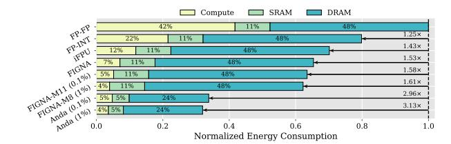

# D. System-level Evaluation

Fig. 16 compares system-level speedup, area efficiency, and energy efficiency between Anda and several baselines across various LLM models. We also introduce bit-parallel FIGNA-M11 and FIGNA-M8 as baselines for 0.1% and 1% accuracy loss. Anda enables precision-scalable inference within a single hardware architecture, in contrast to FIGNA's separate implementations for each precision level.

**Speedup:** Anda, utilizing the precision combinations identified in Fig. 14, implements scalable computation and achieves  $2.14 \times$  and  $2.49 \times$  speedups on average over the GPU-like FP-FP baseline at 0.1% and 1% accuracy loss, respectively. Com-

Fig. 16. Speedup, area efficiency, and energy efficiency comparison across accelerators on WikiText2. All data are aligned to the GPU-like FP-FP baseline.

pared to the corresponding FIGNA variants, Anda achieves  $1.48 \times$  and  $1.25 \times$  higher acceleration, benefiting from efficient utilization of varied mantissa precisions across tensor types.

Area Efficiency: Anda improves area efficiency by 3.47× and 4.03× over the GPU-like FP-FP baseline at 0.1% and 1% loss, respectively, due to two factors: (a) shared exponent design simplifies alignment operations, improving computational unit efficiency; (b) bit-serial design fully utilizes mantissa widths of different tensor types. Notably, in 1% loss with LLaMA models, FIGNA-M8's area efficiency rivals or slightly exceeds Anda due to its alignment with 8-bit precision, where bit-parallel designs excel. However, Anda's scalable computation outperforms FIGNA by adopting more aggressive bit-widths in OPT models.

**Energy Efficiency:** Anda achieves a 3.07× improvement over the GPU-like FP-FP baseline at 0.1% accuracy loss, increasing to  $3.16\times$  at 1% loss tolerance. Unlike iFPU [42] and FIGNA [32], which solely optimize energy during computation, Anda's bit-serial architecture skips redundant mantissa bit calculations to improve computational utilization, and the BPC compresses output, reducing memory access. FIGNA-M11 and FIGNA-M8 use reduced mantissa bit-parallel designs to improve computational efficiency, but rely on FP16 storage, leading to frequent data conversions, which offsets energy gains. Fig. 17 further presents that compared to the GPU-like FP-FP baseline on the LLaMA-13B model, Anda reduces energy consumption by 90%, 54%, and 50% for computation, SRAM, and DRAM access, respectively. While FIGNA achieves similar compute efficiency, Anda's architecture avoids redundant computations and FP-to-BFP conversion, reducing energy further. Moreover, Anda's bit-plane storage scheme and BPC compression reduce memory access overhead, improving SRAM and DRAM energy efficiency by  $2.2\times$  and  $2.0\times$  compared to FIGNA.

#### E. Power and Area Breakdown

We conduct a detailed hardware analysis of the Anda architecture for LLaMA-13B inference within 1% accuracy loss.

Fig. 17. Energy breakdown of Anda in contrast with the baseline accelerators. Energy consumption during the LLaMA-13B inference is evaluated.

