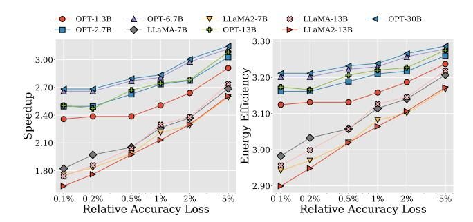

# F. Accuracy-Performance Trade-off

This section explores speedup and energy efficiency improvements of the Anda system over the FP-FP baseline with

Fig. 18. Speedup and energy efficiency improvement of Anda over FP-FP baseline towards various acceptable accuracy losses.

accuracy loss constraints ranging from 0.1% to 5%. As shown in Fig. 18, using LLaMA-13B as an example, Anda achieves a 1.73× speedup and 2.95× energy efficiency improvement with only 0.1% accuracy loss, increasing to  $2.74 \times$  and  $3.22 \times$ , respectively, when the constraint is relaxed to 5%. All models exhibit significant acceleration and efficiency gains as the tolerated accuracy loss increases. Notably, OPT and LLaMA models exhibit distinct characteristics when using the Anda format. This stems from OPT's lower sensitivity to bit-width reductions, allowing the use of shorter mantissa bit-widths with minimal accuracy sacrifice. Consequently, under tighter accuracy constraints, e.g., 0.1%~0.5%, OPT models achieve greater speedups and energy efficiency improvements compared to LLaMA models. However, as accuracy constraints relax, their performance gains gradually converge. By integrating the adaptive precision combination search algorithm with the Anda format, our architecture achieves flexible balancing of system performance and accuracy across diverse practical application scenarios, enabling efficient LLM inference under different LLM architectures and varying requirements.

